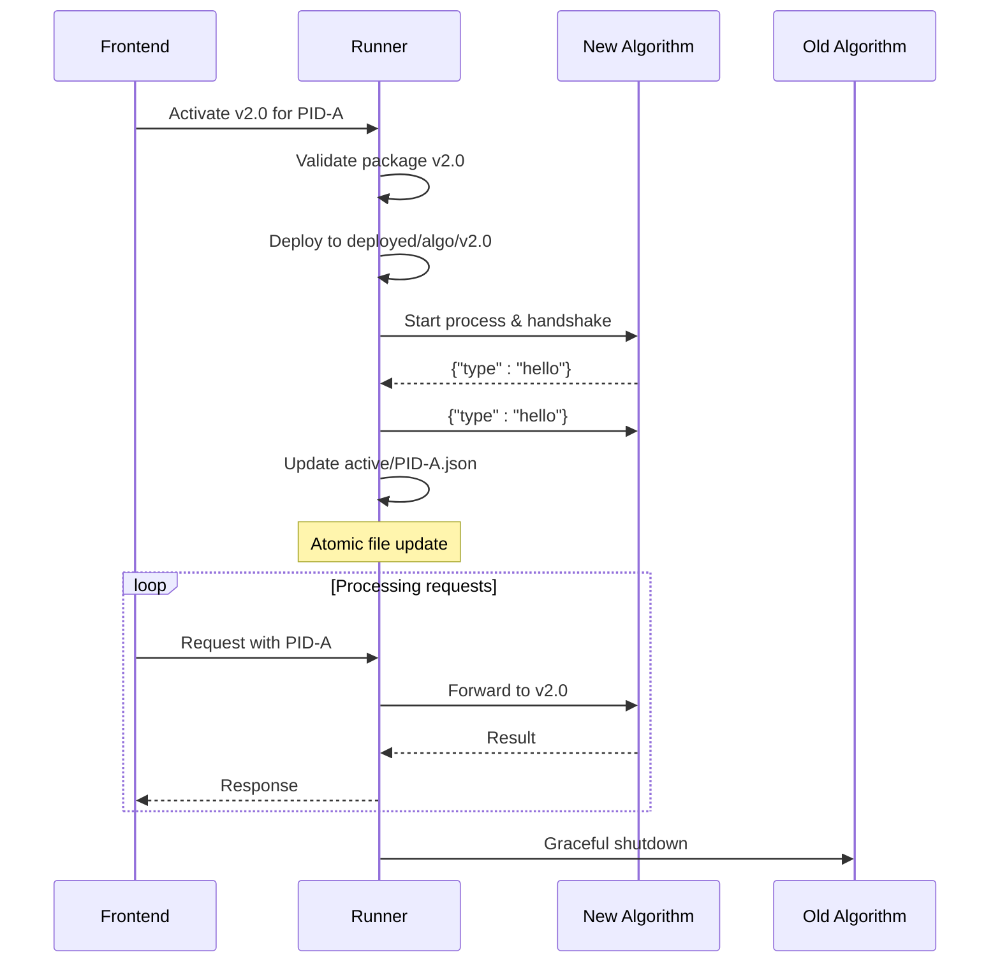
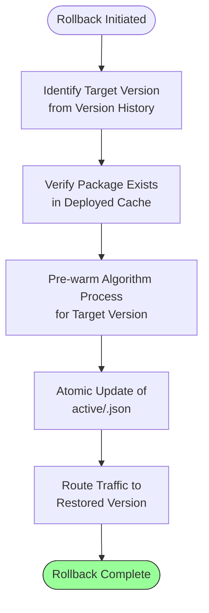
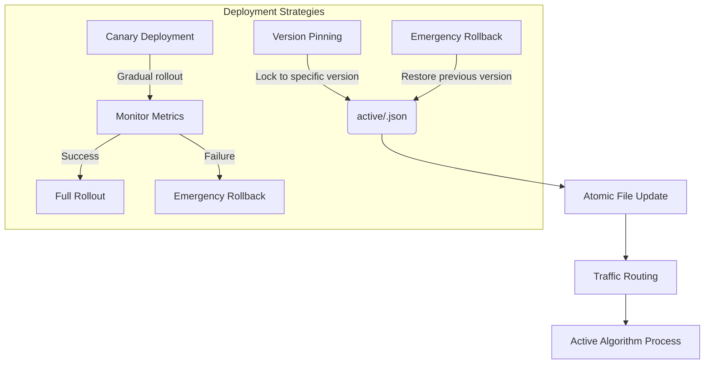
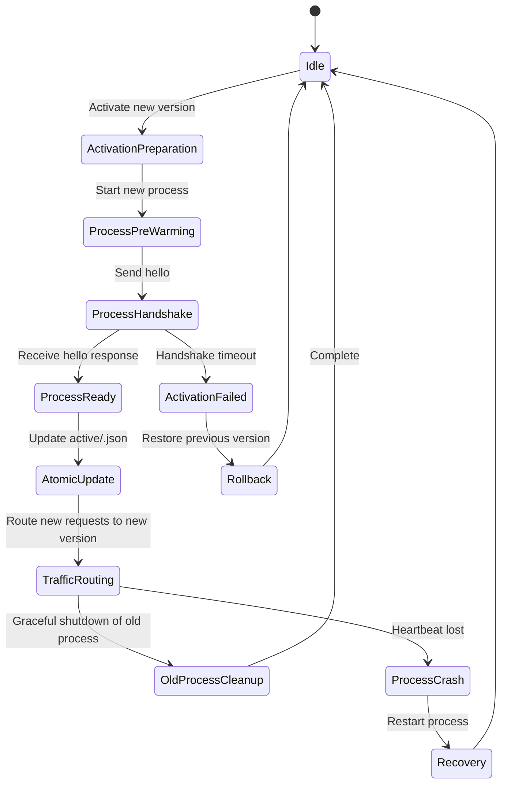
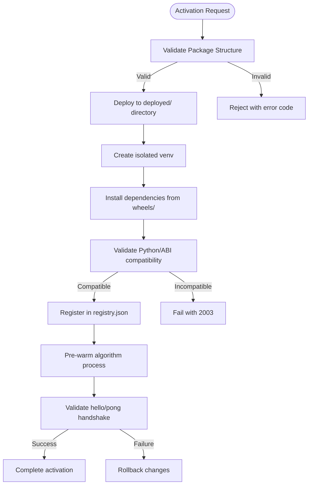

# Activation and Rollback

<cite>
**Referenced Files in This Document**   
- [runner_spec.md](file://runner_spec.md)
- [spec_runner.md](file://spec_runner.md)
- [cli.py](file://procvision_algorithm_sdk/cli.py)
- [base.py](file://procvision_algorithm_sdk/base.py)
- [session.py](file://procvision_algorithm_sdk/session.py)
</cite>

## Table of Contents
1. [Introduction](#introduction)
2. [Activation Mechanism](#activation-mechanism)
3. [Atomic File Update Process](#atomic-file-update-process)
4. [Version Rollback Procedure](#version-rollback-procedure)
5. [Deployment Strategies](#deployment-strategies)
6. [Race Condition Handling](#race-condition-handling)
7. [Error Conditions and Status Codes](#error-conditions-and-status-codes)
8. [Conclusion](#conclusion)

## Introduction
This document details the algorithm activation and version rollback mechanism in the ProcVision platform. The system enables precise control over algorithm versioning through a file-based activation system that binds specific algorithm versions to processing units (PIDs). The core mechanism revolves around the `active/<pid>.json` file, which serves as the authoritative source for determining which algorithm version should handle requests for a given PID. This design supports atomic updates, version pinning, canary deployments, and emergency rollbacks, ensuring production stability and reliability.

**Section sources**
- [runner_spec.md](file://runner_spec.md#L1-L282)
- [spec_runner.md](file://spec_runner.md#L1-L192)

## Activation Mechanism
The Runner binds a specific algorithm version to a processing unit by updating the `active/<pid>.json` configuration file. This file contains the mapping between a PID and the deployed algorithm package, including the package name and version identifier. When a request arrives for a specific PID, the Runner reads this file to determine which algorithm version should process the request.

The activation process begins when a new algorithm package is installed and validated. The package must contain essential components including `manifest.json`, `requirements.txt`, and a `wheels/` directory with pre-compiled dependencies. Once validated, the package is deployed to the `algorithms/deployed/<name>/<version>/` directory, where it is isolated in its own virtual environment.

Activation occurs when the system writes to the `active/<pid>.json` file with the following structure:
```json
{
  "name": "algorithm-name",
  "version": "1.2.3",
  "activated_at": "2024-01-01T00:00:00Z"
}
```

Before activation, the system verifies that the target algorithm's `supported_pids` list includes the specified PID. This validation prevents activation conflicts and ensures compatibility between the algorithm and the processing unit it will serve.

The activation process supports zero-downtime switching through a pre-warming mechanism. When switching to a new version, the Runner first starts the new algorithm process and completes the handshake protocol before updating the `active/<pid>.json` file. This ensures that the new version is fully operational before it begins receiving production traffic, with the old process gracefully handling any in-flight requests before termination.



**Diagram sources **
- [runner_spec.md](file://runner_spec.md#L197-L248)
- [spec_runner.md](file://spec_runner.md#L34-L80)

**Section sources**
- [runner_spec.md](file://runner_spec.md#L197-L248)
- [spec_runner.md](file://spec_runner.md#L34-L80)

## Atomic File Update Process
The system ensures consistency during activation through an atomic file update process. When updating the `active/<pid>.json` file, the Runner uses atomic file operations to prevent race conditions and ensure that the file is always in a valid state.

The atomic update follows these steps:
1. Write the new configuration to a temporary file (`active/<pid>.json.tmp`)
2. Perform validation on the temporary file to ensure it contains valid JSON and references an existing, deployed package
3. Use an atomic rename operation to replace the original file with the temporary file

This approach guarantees that readers of the `active/<pid>.json` file will either see the complete old configuration or the complete new configuration, never a partially written or corrupted state. The atomic rename operation is supported natively by most filesystems and provides the necessary consistency guarantees for production environments.

The system also implements file system locks during package management operations to prevent concurrent modifications. Operations such as installation, activation, switching, and uninstallation acquire a mutex lock (using a lock file like `algorithms/.lock`) to ensure that only one operation can modify the algorithm deployment state at a time.

This atomic update mechanism is critical for maintaining system stability during version transitions, especially in high-availability production environments where downtime must be minimized and configuration consistency is paramount.

**Section sources**
- [runner_spec.md](file://runner_spec.md#L271-L277)
- [spec_runner.md](file://spec_runner.md#L34-L80)

## Version Rollback Procedure
The rollback procedure restores previous algorithm versions using the version history and deployed package cache. The system retains recently deployed versions in the `algorithms/deployed/` directory, allowing for rapid restoration of previous states without requiring re-download or re-installation of packages.

When a rollback is initiated, the process follows these steps:
1. Identify the target version from the version history (typically the previous stable version)
2. Verify that the target version exists in the deployed packages cache
3. Update the `active/<pid>.json` file to point to the historical version using the atomic update process
4. Pre-warm the algorithm process for the target version
5. Complete the atomic file update to route traffic to the restored version

The system maintains a configurable retention policy for deployed versions, typically keeping the three most recent versions available for rollback. This balance between disk usage and recovery flexibility allows operators to revert to stable versions quickly in case of issues with new deployments.

Emergency rollbacks can be triggered manually through the platform's API or automatically based on health monitoring metrics. The rollback process is designed to be as fast as the initial activation, leveraging the pre-existing deployed packages and the same zero-downtime switching mechanism.

The audit log records all activation and rollback operations, including timestamps and operator information, providing full traceability for compliance and debugging purposes.



**Diagram sources **
- [runner_spec.md](file://runner_spec.md#L253-L277)
- [spec_runner.md](file://spec_runner.md#L34-L80)

**Section sources**
- [runner_spec.md](file://runner_spec.md#L253-L277)
- [spec_runner.md](file://spec_runner.md#L34-L80)

## Deployment Strategies
The system supports multiple deployment strategies to accommodate different production requirements and risk tolerance levels.

### Version Pinning
Version pinning allows operators to lock a processing unit to a specific algorithm version, preventing automatic updates. This is achieved by setting the `active/<pid>.json` file and configuring the deployment policy to respect pinned versions. Version pinning is commonly used for critical production lines where stability is prioritized over feature updates.

### Canary Deployments
Canary deployments enable gradual rollout of new algorithm versions to a subset of processing units. The process involves:
1. Activating the new version on a small number of non-critical PIDs
2. Monitoring performance, accuracy, and error rates
3. Gradually expanding to additional PIDs based on success criteria
4. Full rollout once stability is confirmed

This strategy minimizes risk by limiting the blast radius of potential issues with new versions. The system provides APIs to query the current active version for each PID, enabling monitoring tools to track the progress of canary deployments.

### Emergency Rollbacks
Emergency rollbacks provide a rapid recovery mechanism for critical issues. When severe errors are detected (such as high error rates or system instability), operators can initiate an immediate rollback to the previous stable version. The system also supports automated emergency rollbacks based on predefined health metrics, such as:
- Excessive error rates (e.g., >5% ERROR responses)
- Timeout frequency exceeding thresholds
- Resource utilization anomalies
- Heartbeat failure from algorithm processes

The emergency rollback procedure bypasses normal validation steps for maximum speed, relying on the assumption that previously deployed versions have already been validated and are known to be stable.



**Diagram sources **
- [runner_spec.md](file://runner_spec.md#L253-L277)
- [spec_runner.md](file://spec_runner.md#L34-L80)

**Section sources**
- [runner_spec.md](file://runner_spec.md#L253-L277)
- [spec_runner.md](file://spec_runner.md#L34-L80)

## Race Condition Handling
The system ensures only one active version per PID through a combination of atomic file operations and process management protocols. Race conditions during PID reassignment are prevented by the atomic update mechanism for the `active/<pid>.json` file, which guarantees that only one version mapping is active at any given time.

When a PID is reassigned to a new algorithm version, the system follows a strict sequence:
1. Acquire a mutex lock for the package management operation
2. Pre-warm the new algorithm process and complete handshake
3. Perform atomic update of the `active/<pid>.json` file
4. The old process continues to handle in-flight requests
5. After a grace period, the old process is terminated

This sequence ensures that there is no period where multiple versions could simultaneously claim responsibility for the same PID. The routing logic always reads the current state of the `active/<pid>.json` file, which due to atomic updates, presents a consistent view to all readers.

The system also handles edge cases such as process crashes during activation. If the new algorithm process fails to start or crashes after activation, the system can automatically roll back to the previous version or maintain the current version, depending on the configured policy. Health monitoring continuously verifies the stability of the active algorithm process, triggering recovery procedures if necessary.



**Diagram sources **
- [runner_spec.md](file://runner_spec.md#L271-L277)
- [spec_runner.md](file://spec_runner.md#L34-L80)

**Section sources**
- [runner_spec.md](file://runner_spec.md#L271-L277)
- [spec_runner.md](file://spec_runner.md#L34-L80)

## Error Conditions and Status Codes
The system defines specific error conditions and status codes for activation failures, as referenced in `runner_spec.md`. These codes provide clear diagnostics for troubleshooting deployment issues.

### Activation Failure Codes
- **2001 invalid_zip**: The zip file is corrupted or missing essential components
- **2002 manifest_missing**: Required manifest.json file is absent
- **2003 incompatible_python**: Python/ABI version mismatch with wheels
- **2004 wheels_missing**: Missing wheels directory or critical dependencies
- **2005 install_failed**: General installation failure
- **2006 activation_conflict**: PID already bound to another package or not in supported_pids
- **2007 unsafe_uninstall**: Attempt to uninstall an active package

### State File Issues
Corrupted state files can prevent successful activation. The system validates the integrity of the `active/<pid>.json` file before and after updates, rejecting malformed JSON or references to non-existent packages. When a corrupted state file is detected, the system can revert to a backup or previous known-good state.

The validation process checks several aspects of the algorithm package:
- Structural integrity of the zip file
- Presence of required files (manifest.json, requirements.txt, wheels/)
- Compatibility between the package's declared Python version and the target environment
- Validity of the entry point class and its inheritance from BaseAlgorithm
- Consistency between the manifest's supported_pids and the algorithm's runtime information

These validation checks occur during both installation and activation, providing multiple layers of protection against deployment of faulty packages.



**Diagram sources **
- [runner_spec.md](file://runner_spec.md#L253-L277)
- [cli.py](file://procvision_algorithm_sdk/cli.py#L1-L614)

**Section sources**
- [runner_spec.md](file://runner_spec.md#L253-L277)
- [cli.py](file://procvision_algorithm_sdk/cli.py#L1-L614)

## Conclusion
The algorithm activation and version rollback mechanism provides a robust foundation for managing algorithm deployments in production environments. By using atomic file updates to the `active/<pid>.json` configuration, the system ensures consistent and reliable version management. The combination of pre-warming, atomic updates, and graceful process termination enables zero-downtime deployments and rapid rollbacks.

The system's design supports multiple deployment strategies, from conservative version pinning to progressive canary deployments, allowing organizations to choose the approach that best fits their risk tolerance and operational requirements. Comprehensive error handling and status codes provide clear diagnostics for troubleshooting, while the retention of deployed package versions enables rapid recovery from issues.

This mechanism exemplifies a production-ready approach to algorithm version management, balancing the need for rapid iteration with the requirements for stability and reliability in industrial vision applications.