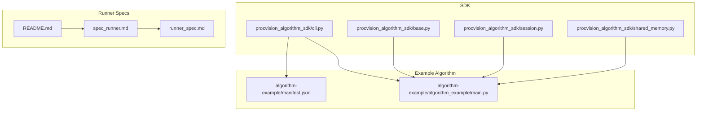
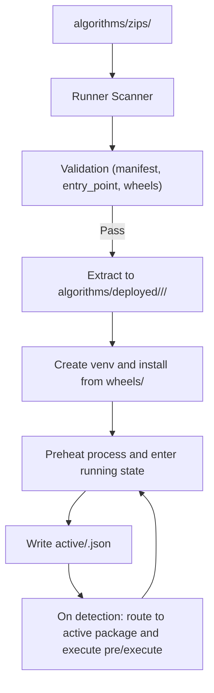
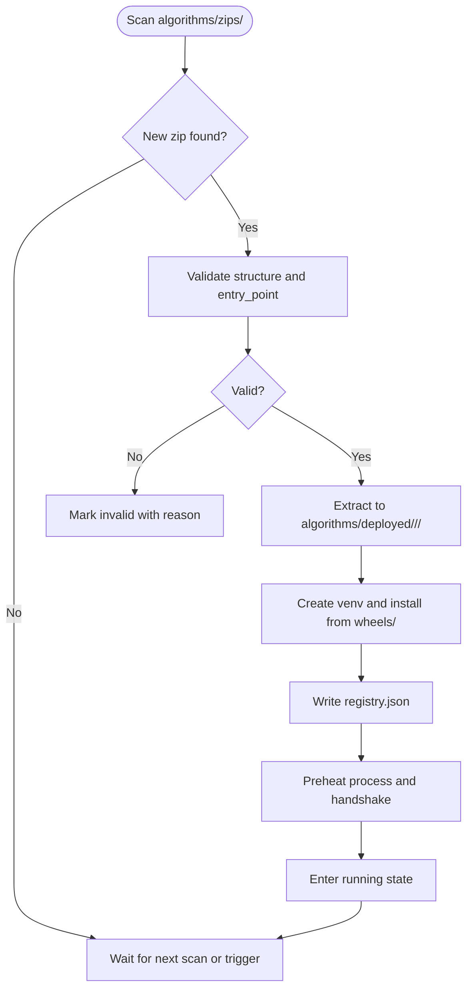
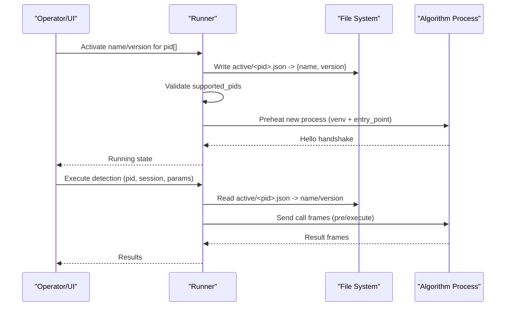
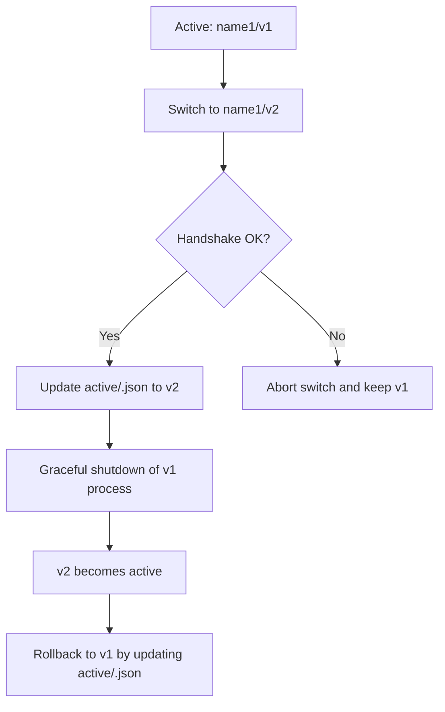
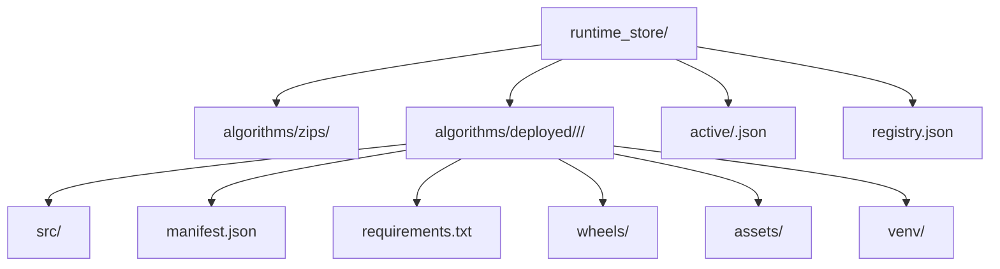
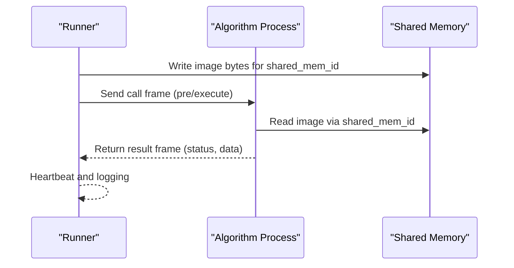
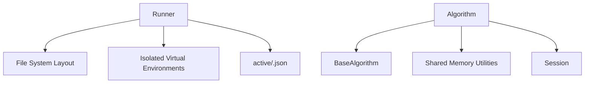

# Deployment Integration

<cite>
**Referenced Files in This Document**
- [runner_spec.md](file://runner_spec.md)
- [spec_runner.md](file://spec_runner.md)
- [README.md](file://README.md)
- [procvision_algorithm_sdk/cli.py](file://procvision_algorithm_sdk/cli.py)
- [procvision_algorithm_sdk/base.py](file://procvision_algorithm_sdk/base.py)
- [procvision_algorithm_sdk/session.py](file://procvision_algorithm_sdk/session.py)
- [procvision_algorithm_sdk/shared_memory.py](file://procvision_algorithm_sdk/shared_memory.py)
- [algorithm-example/manifest.json](file://algorithm-example/manifest.json)
- [algorithm-example/algorithm_example/main.py](file://algorithm-example/algorithm_example/main.py)
</cite>

## Table of Contents
1. [Introduction](#introduction)
2. [Project Structure](#project-structure)
3. [Core Components](#core-components)
4. [Architecture Overview](#architecture-overview)
5. [Detailed Component Analysis](#detailed-component-analysis)
6. [Dependency Analysis](#dependency-analysis)
7. [Performance Considerations](#performance-considerations)
8. [Troubleshooting Guide](#troubleshooting-guide)
9. [Conclusion](#conclusion)
10. [Appendices](#appendices)

## Introduction
This document describes the deployment integration pattern using offline zip packages for algorithm delivery and execution. It covers the package structure requirements, the Runner’s deployment workflow, activation and version management, and the file system layout for deployed packages. It also references the Runner specification for the complete package management API and error codes.

## Project Structure
The repository provides:
- An SDK with a base algorithm interface and CLI for packaging and validation
- Example algorithm demonstrating manifest and entry point
- Runner specification documents detailing the production-grade Runner behavior and offline package management

**Diagram sources**
- [procvision_algorithm_sdk/cli.py](file://procvision_algorithm_sdk/cli.py#L228-L326)
- [procvision_algorithm_sdk/base.py](file://procvision_algorithm_sdk/base.py#L1-L58)
- [procvision_algorithm_sdk/session.py](file://procvision_algorithm_sdk/session.py#L1-L36)
- [procvision_algorithm_sdk/shared_memory.py](file://procvision_algorithm_sdk/shared_memory.py#L1-L53)
- [algorithm-example/manifest.json](file://algorithm-example/manifest.json#L1-L25)
- [algorithm-example/algorithm_example/main.py](file://algorithm-example/algorithm_example/main.py#L1-L150)
- [spec_runner.md](file://spec_runner.md#L1-L192)
- [runner_spec.md](file://runner_spec.md#L1-L283)
- [README.md](file://README.md#L1-L116)

**Section sources**
- [README.md](file://README.md#L1-L116)
- [runner_spec.md](file://runner_spec.md#L60-L120)
- [spec_runner.md](file://spec_runner.md#L1-L192)

## Core Components
- Offline package structure:
  - Source code directory
  - manifest.json
  - requirements.txt
  - wheels/ directory containing all dependencies as wheel files
  - Optional assets/ directory
- Runner deployment workflow:
  - Scanning algorithms/zips/ directory
  - Validating package structure and entry point
  - Extracting to algorithms/deployed/<name>/<version>/
  - Creating an isolated virtual environment and installing dependencies exclusively from wheels/
  - Preheating the algorithm process and entering running state
- Activation:
  - Binding a specific algorithm version to a PID by writing active/<pid>.json
  - Dynamic loading routes requests to the active package directory
- Version management and rollback:
  - Maintaining multiple versions per algorithm
  - Switching and rolling back by updating active/<pid>.json
- File system layout:
  - algorithms/zips/ for original offline packages
  - algorithms/deployed/<name>/<version>/ for extracted and installed packages
  - active/<pid>.json for PID-to-package mapping
  - registry.json for package metadata and state

**Section sources**
- [runner_spec.md](file://runner_spec.md#L60-L120)
- [runner_spec.md](file://runner_spec.md#L204-L230)
- [spec_runner.md](file://spec_runner.md#L110-L192)

## Architecture Overview
The deployment integration centers on the Runner managing offline algorithm packages. The Runner scans for new packages, validates them, deploys them into isolated environments, and activates them per PID. The algorithm communicates with the Runner via stdin/stdout frames and shared memory.

**Diagram sources**
- [runner_spec.md](file://runner_spec.md#L60-L120)
- [runner_spec.md](file://runner_spec.md#L204-L230)

## Detailed Component Analysis

### Offline Package Structure
- Required files:
  - manifest.json: defines name, version, entry_point, supported_pids, steps, and optional required assets
  - requirements.txt: lists pinned dependencies
  - wheels/: directory containing compatible wheel files
- Optional:
  - assets/: static resources referenced by the algorithm
- Packaging:
  - CLI builds the offline zip with source, manifest, requirements, wheels, and assets
  - Wheels are downloaded targeting a specific platform, Python version, implementation, and ABI

Key behaviors and references:
- Package creation and wheel download are implemented in the CLI package command
- The CLI validates that the zip contains manifest.json, requirements.txt, and wheels/
- The Runner spec defines the expected internal structure and installation steps

**Section sources**
- [procvision_algorithm_sdk/cli.py](file://procvision_algorithm_sdk/cli.py#L228-L326)
- [procvision_algorithm_sdk/cli.py](file://procvision_algorithm_sdk/cli.py#L120-L160)
- [runner_spec.md](file://runner_spec.md#L204-L230)
- [README.md](file://README.md#L60-L116)

### Runner Deployment Workflow
- Discovery and scanning:
  - Runner periodically or on demand scans algorithms/zips/ for new offline packages
- Validation:
  - Checks presence of required files and performs SDK-style validation (entry import, supported_pids match, get_info shape)
- Extraction and environment setup:
  - Unpacks to algorithms/deployed/<name>/<version>/
  - Creates an isolated venv and installs dependencies from wheels/ only
- Registration and preheating:
  - Writes registry entries and preheats the algorithm process to reach running state

**Diagram sources**
- [runner_spec.md](file://runner_spec.md#L60-L120)
- [runner_spec.md](file://runner_spec.md#L204-L230)

**Section sources**
- [runner_spec.md](file://runner_spec.md#L60-L120)
- [runner_spec.md](file://runner_spec.md#L204-L230)

### Activation and PID Routing
- Activation:
  - Write active/<pid>.json pointing to name/version
  - Verify that the target package supports the PID
- Dynamic routing:
  - On detection, read active/<pid>.json to resolve the package directory
  - Launch the algorithm process using the package’s venv and manifest entry_point
- Zero-downtime switching:
  - Preheat the new version, complete handshake, then switch mapping at the next cycle

**Diagram sources**
- [runner_spec.md](file://runner_spec.md#L60-L120)
- [runner_spec.md](file://runner_spec.md#L204-L230)

**Section sources**
- [runner_spec.md](file://runner_spec.md#L60-L120)
- [runner_spec.md](file://runner_spec.md#L204-L230)

### Version Management and Rollback
- Multiple versions per algorithm are retained
- Switching:
  - Preheat the new version, complete handshake, then update active/<pid>.json mapping
- Rollback:
  - Reactivate a historical version by writing active/<pid>.json to the desired name/version
- Uninstallation:
  - Requires deactivating the package first; remove deployed directory and registry record

**Diagram sources**
- [runner_spec.md](file://runner_spec.md#L204-L230)

**Section sources**
- [runner_spec.md](file://runner_spec.md#L204-L230)

### File System Layout and Storage Conventions
- runtime_store/algorithms/zips/: original offline zip archives
- runtime_store/algorithms/deployed/<name>/<version>/: extracted package with src/, manifest.json, requirements.txt, wheels/, assets/, and venv/
- runtime_store/active/<pid>.json: PID-to-package mapping
- runtime_store/registry.json: package metadata and state
- Logs and audit trails are maintained under runtime_store/logs/

**Diagram sources**
- [runner_spec.md](file://runner_spec.md#L204-L230)

**Section sources**
- [runner_spec.md](file://runner_spec.md#L204-L230)

### Algorithm Execution Lifecycle and Communication
- The algorithm implements BaseAlgorithm with lifecycle hooks and pre_execute/execute
- The Runner manages process lifecycle, protocol framing, shared memory, and scheduling
- The example algorithm demonstrates supported_pids validation and returning structured results

**Diagram sources**
- [procvision_algorithm_sdk/base.py](file://procvision_algorithm_sdk/base.py#L1-L58)
- [procvision_algorithm_sdk/shared_memory.py](file://procvision_algorithm_sdk/shared_memory.py#L1-L53)
- [spec_runner.md](file://spec_runner.md#L1-L192)

**Section sources**
- [procvision_algorithm_sdk/base.py](file://procvision_algorithm_sdk/base.py#L1-L58)
- [procvision_algorithm_sdk/shared_memory.py](file://procvision_algorithm_sdk/shared_memory.py#L1-L53)
- [spec_runner.md](file://spec_runner.md#L1-L192)

## Dependency Analysis
- The Runner depends on:
  - File system layout and package metadata (manifest.json, requirements.txt, wheels/)
  - Isolated virtual environments for each package
  - PID-to-package mapping for dynamic routing
- The algorithm depends on:
  - BaseAlgorithm interface and shared memory utilities
  - Session for stateful context during a detection flow

**Diagram sources**
- [runner_spec.md](file://runner_spec.md#L60-L120)
- [runner_spec.md](file://runner_spec.md#L204-L230)
- [procvision_algorithm_sdk/base.py](file://procvision_algorithm_sdk/base.py#L1-L58)
- [procvision_algorithm_sdk/session.py](file://procvision_algorithm_sdk/session.py#L1-L36)
- [procvision_algorithm_sdk/shared_memory.py](file://procvision_algorithm_sdk/shared_memory.py#L1-L53)

**Section sources**
- [runner_spec.md](file://runner_spec.md#L60-L120)
- [runner_spec.md](file://runner_spec.md#L204-L230)
- [procvision_algorithm_sdk/base.py](file://procvision_algorithm_sdk/base.py#L1-L58)
- [procvision_algorithm_sdk/session.py](file://procvision_algorithm_sdk/session.py#L1-L36)
- [procvision_algorithm_sdk/shared_memory.py](file://procvision_algorithm_sdk/shared_memory.py#L1-L53)

## Performance Considerations
- Preheating processes avoids cold-start latency during detection
- Using wheels/ ensures deterministic installs without network overhead
- Shared memory minimizes copies and enables zero-copy image transfer
- Heartbeat and timeouts prevent resource starvation and enable fast recovery

[No sources needed since this section provides general guidance]

## Troubleshooting Guide
Common issues and remedies:
- Invalid zip or missing files:
  - Ensure manifest.json, requirements.txt, and wheels/ are present inside the offline zip
  - Use the CLI validate command to verify structure and entry_point
- Incompatible Python/ABI:
  - Wheels must match the target platform, Python version, implementation, and ABI
  - Rebuild wheels with matching parameters
- Unsupported PID:
  - The algorithm’s supported_pids must include the requested PID
  - Update manifest.json and algorithm logic accordingly
- Installation failures:
  - Confirm venv isolation and wheels availability
  - Check registry.json for installation records and logs
- Activation conflicts:
  - Ensure active/<pid>.json points to a package that supports the PID
  - Resolve conflicts by switching to a compatible version

**Section sources**
- [procvision_algorithm_sdk/cli.py](file://procvision_algorithm_sdk/cli.py#L120-L160)
- [procvision_algorithm_sdk/cli.py](file://procvision_algorithm_sdk/cli.py#L228-L326)
- [runner_spec.md](file://runner_spec.md#L204-L230)

## Conclusion
The offline zip package pattern provides a robust, repeatable, and secure way to deliver algorithm packages. The Runner enforces strict validation, isolation, and activation semantics, while the SDK and CLI streamline packaging and verification. Together, they support reliable versioning, zero-downtime switching, and predictable execution in production environments.

[No sources needed since this section summarizes without analyzing specific files]

## Appendices

### Package Management API and Error Codes
- Install: POST /algorithms/install
- Activate: POST /algorithms/activate
- Switch: POST /algorithms/switch
- Uninstall: DELETE /algorithms/{name}/{version}
- List: GET /algorithms and GET /algorithms/active
- Validate: POST /algorithms/validate
- Package management error codes (2xxx) include invalid_zip, manifest_missing, incompatible_python, wheels_missing, install_failed, activation_conflict, unsafe_uninstall

**Section sources**
- [runner_spec.md](file://runner_spec.md#L204-L230)