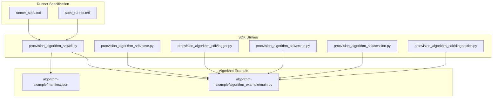
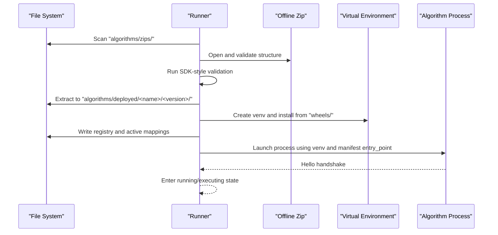
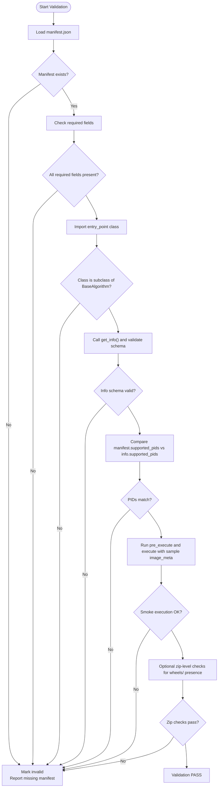
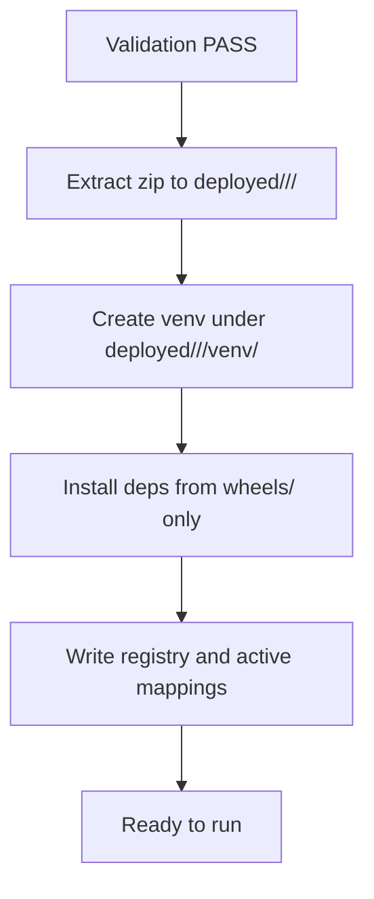
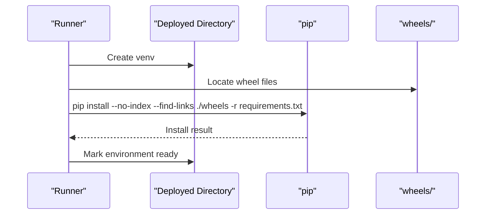
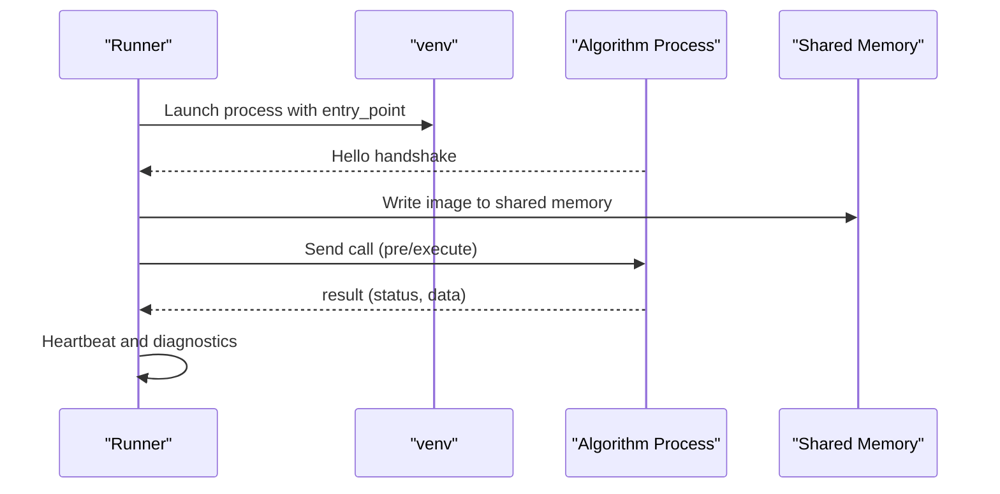
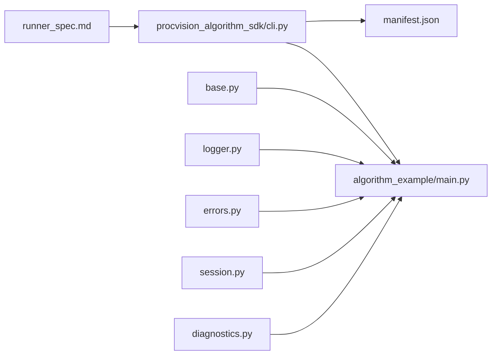

# Deployment Workflow

<cite>
**Referenced Files in This Document**
- [runner_spec.md](file://runner_spec.md)
- [spec_runner.md](file://spec_runner.md)
- [cli.py](file://procvision_algorithm_sdk/cli.py)
- [base.py](file://procvision_algorithm_sdk/base.py)
- [logger.py](file://procvision_algorithm_sdk/logger.py)
- [errors.py](file://procvision_algorithm_sdk/errors.py)
- [session.py](file://procvision_algorithm_sdk/session.py)
- [diagnostics.py](file://procvision_algorithm_sdk/diagnostics.py)
- [manifest.json](file://algorithm-example/manifest.json)
- [main.py](file://algorithm-example/algorithm_example/main.py)
</cite>

## Table of Contents
1. [Introduction](#introduction)
2. [Project Structure](#project-structure)
3. [Core Components](#core-components)
4. [Architecture Overview](#architecture-overview)
5. [Detailed Component Analysis](#detailed-component-analysis)
6. [Dependency Analysis](#dependency-analysis)
7. [Performance Considerations](#performance-considerations)
8. [Troubleshooting Guide](#troubleshooting-guide)
9. [Conclusion](#conclusion)
10. [Appendices](#appendices)

## Introduction
This document describes the Runner’s deployment workflow for offline algorithm packages. It covers scanning for new packages, validating zip integrity and structure, extracting valid packages into a deployed directory, and creating an isolated virtual environment per algorithm. It also documents dependency installation using only wheel files from the package’s wheels directory with no internet access, ensuring reproducibility and security. Finally, it outlines file system permissions and ownership, error handling during extraction and installation, and operational best practices for monitoring success and logging.

## Project Structure
The deployment workflow is defined by the Runner specification and implemented by the SDK’s packaging and validation utilities. The example algorithm demonstrates the manifest and entry point used by the Runner to launch algorithm processes.

**Diagram sources**
- [runner_spec.md](file://runner_spec.md#L231-L252)
- [spec_runner.md](file://spec_runner.md#L110-L170)
- [cli.py](file://procvision_algorithm_sdk/cli.py#L228-L326)
- [base.py](file://procvision_algorithm_sdk/base.py#L1-L58)
- [logger.py](file://procvision_algorithm_sdk/logger.py#L1-L24)
- [errors.py](file://procvision_algorithm_sdk/errors.py#L1-L14)
- [session.py](file://procvision_algorithm_sdk/session.py#L1-L36)
- [diagnostics.py](file://procvision_algorithm_sdk/diagnostics.py#L1-L12)
- [manifest.json](file://algorithm-example/manifest.json#L1-L25)
- [main.py](file://algorithm-example/algorithm_example/main.py#L1-L150)

**Section sources**
- [runner_spec.md](file://runner_spec.md#L231-L252)
- [spec_runner.md](file://spec_runner.md#L110-L170)
- [cli.py](file://procvision_algorithm_sdk/cli.py#L228-L326)
- [manifest.json](file://algorithm-example/manifest.json#L1-L25)
- [main.py](file://algorithm-example/algorithm_example/main.py#L1-L150)

## Core Components
- Package scanning and discovery: Runner monitors the algorithms/zips/ directory for new offline packages and triggers validation and deployment.
- Validation: Ensures the zip contains required files and passes SDK-style validation (manifest presence, entry import, supported_pids match, smoke execution).
- Extraction and deployment: Unpacks validated packages into algorithms/deployed/<name>/<version>/ and creates an isolated venv.
- Dependency installation: Installs only from the package’s wheels/ directory using pip with no-index and find-links pointing to wheels/.
- Isolation: Each algorithm runs in its own venv under its deployed directory.
- API endpoints: The Runner exposes platform APIs for install, activate, switch, uninstall, list, and validate, with explicit error codes for package management.

**Section sources**
- [runner_spec.md](file://runner_spec.md#L231-L252)
- [runner_spec.md](file://runner_spec.md#L204-L230)
- [runner_spec.md](file://runner_spec.md#L279-L282)
- [cli.py](file://procvision_algorithm_sdk/cli.py#L127-L159)
- [cli.py](file://procvision_algorithm_sdk/cli.py#L228-L326)

## Architecture Overview
The deployment pipeline is file-system driven. The Runner orchestrates scanning, validation, extraction, environment creation, and registration. The algorithm process is launched from the deployed directory’s venv using the manifest entry point.

**Diagram sources**
- [runner_spec.md](file://runner_spec.md#L231-L252)
- [runner_spec.md](file://runner_spec.md#L204-L230)
- [cli.py](file://procvision_algorithm_sdk/cli.py#L127-L159)
- [cli.py](file://procvision_algorithm_sdk/cli.py#L228-L326)

## Detailed Component Analysis

### Monitoring and Discovery
- The Runner periodically scans or responds to requests to discover new offline packages placed in algorithms/zips/.
- Discovery triggers validation and subsequent deployment steps.

**Section sources**
- [runner_spec.md](file://runner_spec.md#L231-L252)

### Validation Pipeline
Validation ensures the package is structurally sound and algorithmically ready:
- Manifest presence and loadability.
- Required fields: name, version, entry_point, supported_pids.
- Entry import and subclassing against BaseAlgorithm.
- get_info correctness and supported_pids alignment.
- Smoke execution of pre_execute and execute with minimal image_meta and shared memory id.
- Optional zip-level checks for manifest.json, requirements.txt, and wheels presence.

**Diagram sources**
- [cli.py](file://procvision_algorithm_sdk/cli.py#L35-L159)
- [base.py](file://procvision_algorithm_sdk/base.py#L1-L58)

**Section sources**
- [cli.py](file://procvision_algorithm_sdk/cli.py#L35-L159)
- [base.py](file://procvision_algorithm_sdk/base.py#L1-L58)

### Extraction and Deployment
- After validation, the Runner extracts the zip into algorithms/deployed/<name>/<version>/.
- The deployed directory mirrors the package layout: src/, manifest.json, requirements.txt, wheels/, assets/, and venv/.
- The Runner writes registry entries and active mappings for PID routing.

**Diagram sources**
- [runner_spec.md](file://runner_spec.md#L231-L252)
- [runner_spec.md](file://runner_spec.md#L204-L230)

**Section sources**
- [runner_spec.md](file://runner_spec.md#L231-L252)
- [runner_spec.md](file://runner_spec.md#L204-L230)

### Virtual Environment Creation and Dependency Installation
- Each algorithm gets its own venv under its deployed directory.
- Dependencies are installed exclusively from the package’s wheels/ directory using pip with no-index and find-links pointing to wheels/.
- The Runner enforces offline-only installation to ensure reproducibility and security.

**Diagram sources**
- [runner_spec.md](file://runner_spec.md#L231-L252)
- [cli.py](file://procvision_algorithm_sdk/cli.py#L228-L326)

**Section sources**
- [runner_spec.md](file://runner_spec.md#L231-L252)
- [cli.py](file://procvision_algorithm_sdk/cli.py#L228-L326)

### Process Lifecycle and Execution
- The Runner launches the algorithm process using the venv’s Python interpreter and the manifest entry_point.
- The algorithm performs setup, pre_execute, execute, and teardown according to the protocol.
- Heartbeat and timeouts are enforced; failures trigger restarts and retries per policy.

**Diagram sources**
- [spec_runner.md](file://spec_runner.md#L110-L170)
- [base.py](file://procvision_algorithm_sdk/base.py#L1-L58)

**Section sources**
- [spec_runner.md](file://spec_runner.md#L110-L170)
- [base.py](file://procvision_algorithm_sdk/base.py#L1-L58)

### API Endpoints and Status Codes
The Runner exposes platform APIs for package management and execution. The specification defines endpoints and error codes for package operations.

- Install: POST /algorithms/install
- Activate: POST /algorithms/activate
- Switch: POST /algorithms/switch
- Uninstall: DELETE /algorithms/{name}/{version}
- List: GET /algorithms, GET /algorithms/active
- Validate: POST /algorithms/validate

Package management error codes include invalid_zip, manifest_missing, incompatible_python, wheels_missing, install_failed, activation_conflict, and unsafe_uninstall.

**Section sources**
- [runner_spec.md](file://runner_spec.md#L231-L252)
- [runner_spec.md](file://runner_spec.md#L204-L230)

## Dependency Analysis
The deployment workflow depends on:
- Runner specification for orchestration and storage layout.
- SDK CLI for validation and packaging utilities.
- Algorithm example for manifest and entry point structure.

**Diagram sources**
- [runner_spec.md](file://runner_spec.md#L231-L252)
- [cli.py](file://procvision_algorithm_sdk/cli.py#L228-L326)
- [manifest.json](file://algorithm-example/manifest.json#L1-L25)
- [main.py](file://algorithm-example/algorithm_example/main.py#L1-L150)
- [base.py](file://procvision_algorithm_sdk/base.py#L1-L58)
- [logger.py](file://procvision_algorithm_sdk/logger.py#L1-L24)
- [errors.py](file://procvision_algorithm_sdk/errors.py#L1-L14)
- [session.py](file://procvision_algorithm_sdk/session.py#L1-L36)
- [diagnostics.py](file://procvision_algorithm_sdk/diagnostics.py#L1-L12)

**Section sources**
- [runner_spec.md](file://runner_spec.md#L231-L252)
- [cli.py](file://procvision_algorithm_sdk/cli.py#L228-L326)
- [manifest.json](file://algorithm-example/manifest.json#L1-L25)
- [main.py](file://algorithm-example/algorithm_example/main.py#L1-L150)
- [base.py](file://procvision_algorithm_sdk/base.py#L1-L58)
- [logger.py](file://procvision_algorithm_sdk/logger.py#L1-L24)
- [errors.py](file://procvision_algorithm_sdk/errors.py#L1-L14)
- [session.py](file://procvision_algorithm_sdk/session.py#L1-L36)
- [diagnostics.py](file://procvision_algorithm_sdk/diagnostics.py#L1-L12)

## Performance Considerations
- Offline installation avoids network latency and ensures deterministic builds.
- Isolated environments prevent dependency conflicts and reduce cold-start overhead.
- Heartbeat and timeout policies keep the system responsive and recoverable.
- Logging and diagnostics enable targeted performance tuning.

[No sources needed since this section provides general guidance]

## Troubleshooting Guide
Common issues and recovery strategies during deployment:

- Invalid zip or missing required files
  - Symptoms: Validation fails with invalid_zip or manifest_missing.
  - Action: Verify the zip contains manifest.json, requirements.txt, and wheels/.
  - Recovery: Fix package structure and re-run validation.

- Incompatible Python/ABI
  - Symptoms: incompatible_python error during installation.
  - Action: Ensure wheels match the target Python version and ABI.
  - Recovery: Rebuild wheels with matching platform and ABI.

- Wheels missing or corrupted
  - Symptoms: wheels_missing or install_failed.
  - Action: Confirm wheels directory exists and contains required distributions.
  - Recovery: Regenerate wheels and retry installation.

- Partial extraction
  - Symptoms: Partially extracted deployed directory.
  - Action: Clean up the partially deployed directory and re-extract.
  - Recovery: Retry extraction; ensure sufficient disk space and permissions.

- Disk space constraints
  - Symptoms: Installation fails due to insufficient space.
  - Action: Free disk space or configure retention policies to archive old versions.
  - Recovery: Delete unnecessary archives and retry.

- Concurrency and locks
  - Symptoms: Concurrent install/uninstall/activate causing race conditions.
  - Action: Use the Runner’s locking mechanism (.lock files) to serialize operations.
  - Recovery: Wait for locks to release or resolve conflicts manually.

- Error handling and logging
  - Use structured logging to capture timestamps, levels, and contextual fields.
  - Employ recoverable vs fatal error classification to guide restart/retry policies.

**Section sources**
- [runner_spec.md](file://runner_spec.md#L231-L252)
- [runner_spec.md](file://runner_spec.md#L204-L230)
- [logger.py](file://procvision_algorithm_sdk/logger.py#L1-L24)
- [errors.py](file://procvision_algorithm_sdk/errors.py#L1-L14)

## Conclusion
The Runner’s deployment workflow is designed for reproducibility, security, and reliability. By validating packages offline, extracting into isolated directories, and installing dependencies solely from wheels, the system achieves deterministic builds and predictable runtime behavior. Proper file system management, concurrency controls, and robust error handling ensure smooth operations even under partial failures or resource constraints.

[No sources needed since this section summarizes without analyzing specific files]

## Appendices

### Operational Best Practices
- Monitor deployment success by checking the registry and active mappings.
- Enable structured logging and collect stderr for diagnostics.
- Configure heartbeat and timeout policies aligned with your environment.
- Maintain retention policies to manage disk usage and support rollbacks.
- Use the validate endpoint to proactively catch issues before activation.

**Section sources**
- [runner_spec.md](file://runner_spec.md#L231-L252)
- [runner_spec.md](file://runner_spec.md#L204-L230)
- [logger.py](file://procvision_algorithm_sdk/logger.py#L1-L24)