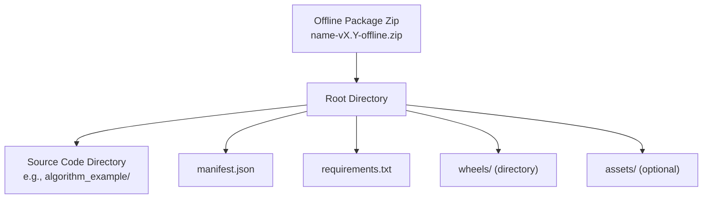
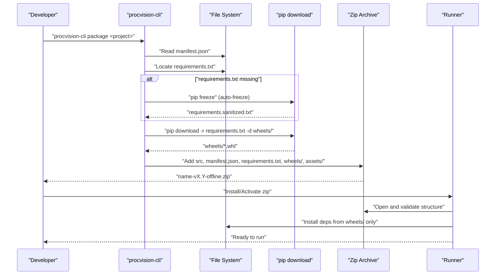
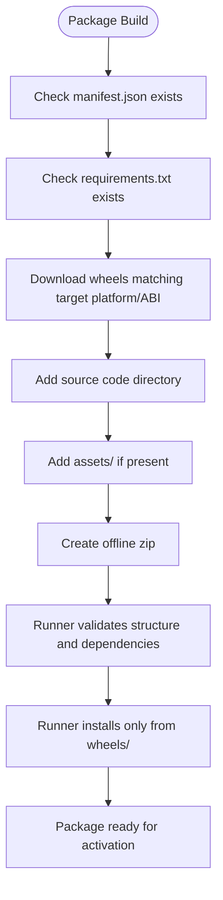
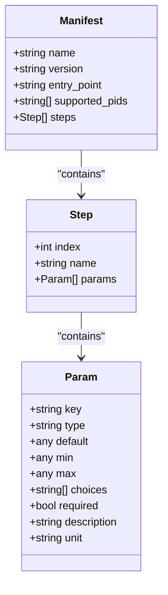
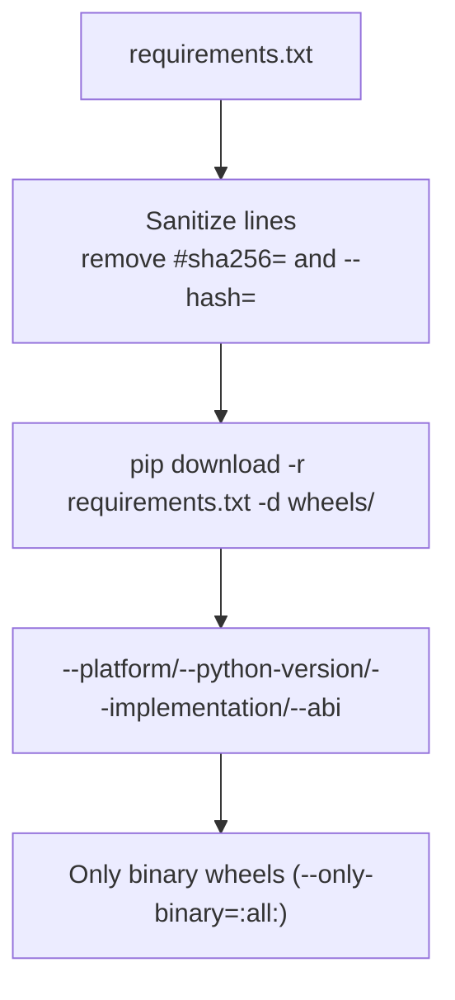
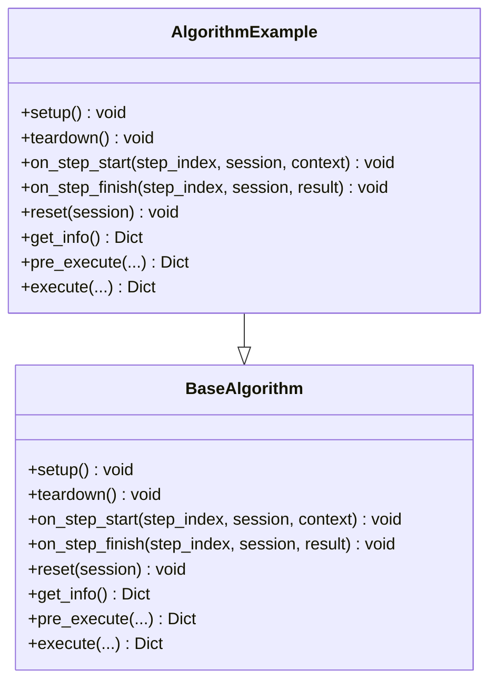
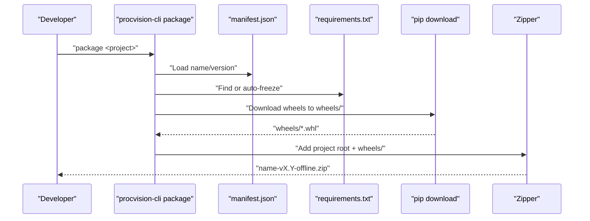
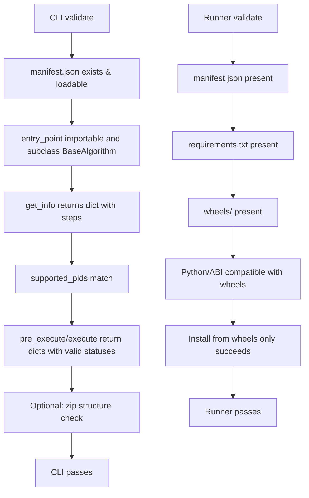
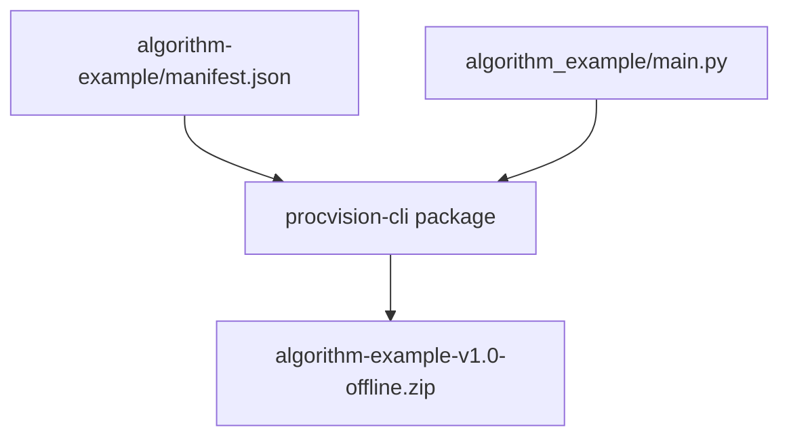
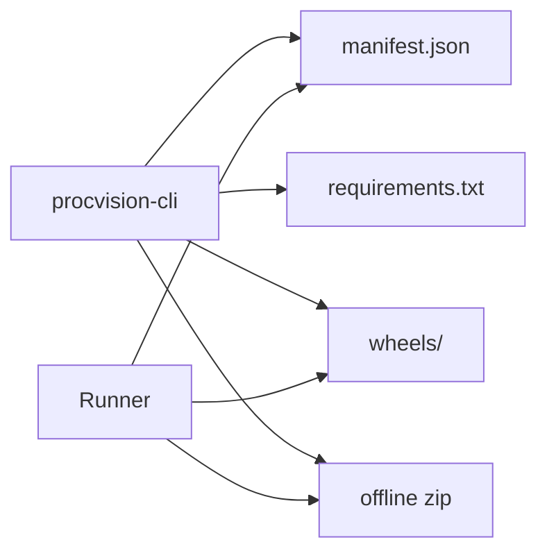

# Packaging Requirements

<cite>
**Referenced Files in This Document**
- [README.md](file://README.md)
- [runner_spec.md](file://runner_spec.md)
- [spec_runner.md](file://spec_runner.md)
- [cli.py](file://procvision_algorithm_sdk/cli.py)
- [base.py](file://procvision_algorithm_sdk/base.py)
- [algorithm-example/manifest.json](file://algorithm-example/manifest.json)
- [algorithm-example/algorithm_example/main.py](file://algorithm-example/algorithm_example/main.py)
- [pyproject.toml](file://pyproject.toml)
</cite>

## Table of Contents
1. [Introduction](#introduction)
2. [Project Structure](#project-structure)
3. [Core Components](#core-components)
4. [Architecture Overview](#architecture-overview)
5. [Detailed Component Analysis](#detailed-component-analysis)
6. [Dependency Analysis](#dependency-analysis)
7. [Performance Considerations](#performance-considerations)
8. [Troubleshooting Guide](#troubleshooting-guide)
9. [Conclusion](#conclusion)
10. [Appendices](#appendices)

## Introduction
This document specifies the offline deployment package structure required by the ProcVision Runner and explains how to build it using the ProcVision CLI. It covers the mandatory components, the zip packaging process, validation checks, and how a typical algorithm project maps to the final package layout. It also highlights the security and reproducibility benefits of air-gapped dependency installation and provides troubleshooting guidance for common packaging errors.

## Project Structure
The offline package must include:
- Algorithm source code directory (with the entry point class referenced by manifest)
- manifest.json (defines metadata, parameters, and interface version)
- requirements.txt (pins exact dependency versions)
- wheels/ directory (pre-compiled wheel files for all dependencies)
- Optional assets/ directory (as needed)

The ProcVision Runner expects the package to be a zip archive produced by the CLI command described below. The Runner validates the package structure and installs dependencies from wheels only.

**Section sources**
- [README.md](file://README.md#L1-L116)
- [runner_spec.md](file://runner_spec.md#L1-L283)
- [spec_runner.md](file://spec_runner.md#L1-L193)

## Core Components
- Algorithm source code: Implements BaseAlgorithm and exposes get_info, pre_execute, execute, plus lifecycle hooks as needed.
- manifest.json: Defines name, version, entry_point, supported_pids, and steps with parameter schemas.
- requirements.txt: Contains pinned dependency lines for exact versions.
- wheels/: Contains pre-built wheel files matching the target platform and Python ABI.
- assets/: Optional directory for auxiliary files (e.g., calibration data, models).

These components are validated by the Runner during installation and by the CLI’s validate command during development.

**Section sources**
- [README.md](file://README.md#L1-L116)
- [runner_spec.md](file://runner_spec.md#L1-L283)
- [spec_runner.md](file://spec_runner.md#L1-L193)

## Architecture Overview
The packaging and validation pipeline integrates the CLI, the algorithm project, and the Runner.

**Diagram sources**
- [cli.py](file://procvision_algorithm_sdk/cli.py#L1-L615)
- [runner_spec.md](file://runner_spec.md#L1-L283)
- [spec_runner.md](file://spec_runner.md#L1-L193)

## Detailed Component Analysis

### Offline Package Layout
- Root-level files and directories:
  - Source code directory named after the algorithm package
  - manifest.json
  - requirements.txt
  - wheels/ directory
  - assets/ directory (optional)
- The Runner will extract the package to a deployed directory and install dependencies using only the wheels inside wheels/.

**Section sources**
- [README.md](file://README.md#L1-L116)
- [runner_spec.md](file://runner_spec.md#L1-L283)
- [spec_runner.md](file://spec_runner.md#L1-L193)

### Manifest.json Requirements
- Fields: name, version, entry_point, supported_pids, steps (each step defines index, name, and params)
- The Runner uses entry_point to launch the algorithm process and to validate the class implements BaseAlgorithm and returns a valid get_info structure.

**Diagram sources**
- [algorithm-example/manifest.json](file://algorithm-example/manifest.json#L1-L25)

**Section sources**
- [algorithm-example/manifest.json](file://algorithm-example/manifest.json#L1-L25)
- [runner_spec.md](file://runner_spec.md#L1-L283)

### Requirements.txt Pinning
- The CLI reads requirements.txt and sanitizes it by removing hash markers and extra pip options.
- Wheels are downloaded using the target platform, Python version, implementation, and ABI to match the Runner’s runtime environment.

**Section sources**
- [cli.py](file://procvision_algorithm_sdk/cli.py#L1-L615)

### Wheels/ Directory
- Must contain all dependencies required by the algorithm.
- The Runner installs dependencies exclusively from wheels/ using a no-index approach to ensure air-gapped reproducibility.

**Section sources**
- [runner_spec.md](file://runner_spec.md#L1-L283)
- [spec_runner.md](file://spec_runner.md#L1-L193)

### Algorithm Source Code
- The example algorithm implements BaseAlgorithm and demonstrates lifecycle hooks, parameter usage, and returning structured results with result_status and optional debug fields.

**Diagram sources**
- [base.py](file://procvision_algorithm_sdk/base.py#L1-L58)
- [algorithm-example/algorithm_example/main.py](file://algorithm-example/algorithm_example/main.py#L1-L150)

**Section sources**
- [algorithm-example/algorithm_example/main.py](file://algorithm-example/algorithm_example/main.py#L1-L150)
- [base.py](file://procvision_algorithm_sdk/base.py#L1-L58)

### Packaging Workflow with procvision-cli package
- Command: procvision-cli package <project>
- Behavior:
  - Reads manifest.json to determine name and version
  - Locates or auto-generates requirements.txt
  - Sanitizes requirements.txt
  - Downloads wheels into wheels/ using target platform/ABI
  - Zips the project root, including wheels/ and excluding wheels/ from the source tree
  - Returns the path to the generated offline zip

**Diagram sources**
- [cli.py](file://procvision_algorithm_sdk/cli.py#L1-L615)

**Section sources**
- [cli.py](file://procvision_algorithm_sdk/cli.py#L1-L615)

### Validation Checks During Packaging and Deployment
- CLI validate checks:
  - manifest.json existence and loadability
  - required fields: name, version, entry_point, supported_pids
  - entry_point import and subclassing BaseAlgorithm
  - get_info returns a dict with steps
  - supported_pids match between manifest and get_info
  - smoke execution of pre_execute and execute
  - zip structure validation (manifest, requirements, wheels presence)
- Runner validate checks (during installation):
  - Presence of manifest.json, requirements.txt, wheels/
  - Compatibility of Python version and ABI with wheels
  - Successful installation from wheels only

**Section sources**
- [cli.py](file://procvision_algorithm_sdk/cli.py#L1-L615)
- [runner_spec.md](file://runner_spec.md#L1-L283)
- [spec_runner.md](file://spec_runner.md#L1-L193)

### Example: algorithm-example Project Mapping
- The example algorithm demonstrates:
  - manifest.json with name, version, entry_point, supported_pids, and steps with parameters
  - AlgorithmExample class implementing BaseAlgorithm and returning structured results
- The CLI package command will:
  - Read manifest.json to determine name and version
  - Auto-generate requirements.txt if missing
  - Download wheels into wheels/
  - Zip the project root, preserving the source directory and adding wheels/

**Diagram sources**
- [algorithm-example/manifest.json](file://algorithm-example/manifest.json#L1-L25)
- [algorithm-example/algorithm_example/main.py](file://algorithm-example/algorithm_example/main.py#L1-L150)
- [cli.py](file://procvision_algorithm_sdk/cli.py#L1-L615)

**Section sources**
- [algorithm-example/manifest.json](file://algorithm-example/manifest.json#L1-L25)
- [algorithm-example/algorithm_example/main.py](file://algorithm-example/algorithm_example/main.py#L1-L150)
- [cli.py](file://procvision_algorithm_sdk/cli.py#L1-L615)

## Dependency Analysis
- The CLI depends on:
  - manifest.json for metadata and entry_point
  - requirements.txt for dependency pinning
  - pip download to populate wheels/
  - zip creation to produce the offline package
- The Runner depends on:
  - manifest.json to launch the algorithm
  - wheels/ for dependency installation
  - requirements.txt to verify dependency completeness

**Diagram sources**
- [cli.py](file://procvision_algorithm_sdk/cli.py#L1-L615)
- [runner_spec.md](file://runner_spec.md#L1-L283)
- [spec_runner.md](file://spec_runner.md#L1-L193)

**Section sources**
- [cli.py](file://procvision_algorithm_sdk/cli.py#L1-L615)
- [runner_spec.md](file://runner_spec.md#L1-L283)
- [spec_runner.md](file://spec_runner.md#L1-L193)

## Performance Considerations
- Using pre-compiled wheels avoids compilation overhead during deployment.
- Air-gapped installation ensures deterministic dependency resolution and faster cold starts.
- Keeping wheels aligned with the target platform/ABI prevents runtime fallbacks and potential compatibility issues.

[No sources needed since this section provides general guidance]

## Troubleshooting Guide
Common packaging errors and resolutions:
- Missing wheels directory or wheels not downloaded:
  - Ensure requirements.txt exists or use --auto-freeze to generate it.
  - Verify the target platform/Python version/ABI match the wheels.
- Incorrect manifest format:
  - Confirm required fields: name, version, entry_point, supported_pids.
  - Ensure steps array contains valid param schemas.
- Excluded files in the zip:
  - The CLI excludes wheels/ from the source tree when zipping; ensure wheels/ is present and populated.
- Incompatible Python/ABI:
  - Align --python-version, --implementation, and --abi with the wheels’ metadata.
- Dependency completeness:
  - After packaging, run procvision-cli validate on the zip to confirm manifest, requirements, and wheels presence.
- Installation failures in Runner:
  - Confirm wheels/ contains all required dependencies and that Python/ABI match the target environment.

Security and reproducibility benefits:
- Air-gapped installation eliminates network exposure and ensures deterministic builds.
- Pinning exact versions in requirements.txt and using pre-compiled wheels guarantees identical environments across deployments.

**Section sources**
- [cli.py](file://procvision_algorithm_sdk/cli.py#L1-L615)
- [runner_spec.md](file://runner_spec.md#L1-L283)
- [spec_runner.md](file://spec_runner.md#L1-L193)

## Conclusion
The offline deployment package for the ProcVision Runner requires a strict structure: algorithm source code, manifest.json, requirements.txt, wheels/, and optional assets/. The procvision-cli package command automates dependency downloading and packaging, while the Runner enforces validation and air-gapped installation. Following the guidelines and troubleshooting steps outlined here ensures reliable, secure, and reproducible deployments.

[No sources needed since this section summarizes without analyzing specific files]

## Appendices

### Appendix A: CLI Commands Overview
- procvision-cli validate: Validates manifest, entry_point, get_info, and optional zip structure.
- procvision-cli package: Builds the offline zip using manifest, requirements, and wheels/.
- procvision-cli run: Local simulation using a test image and shared memory.

**Section sources**
- [cli.py](file://procvision_algorithm_sdk/cli.py#L1-L615)
- [README.md](file://README.md#L1-L116)

### Appendix B: Target Environment Configuration
- The CLI can read a .procvision_env.json file in the project to set wheels platform, Python version, implementation, and ABI defaults.
- Alternatively, pass explicit arguments to the package command.

**Section sources**
- [cli.py](file://procvision_algorithm_sdk/cli.py#L1-L615)