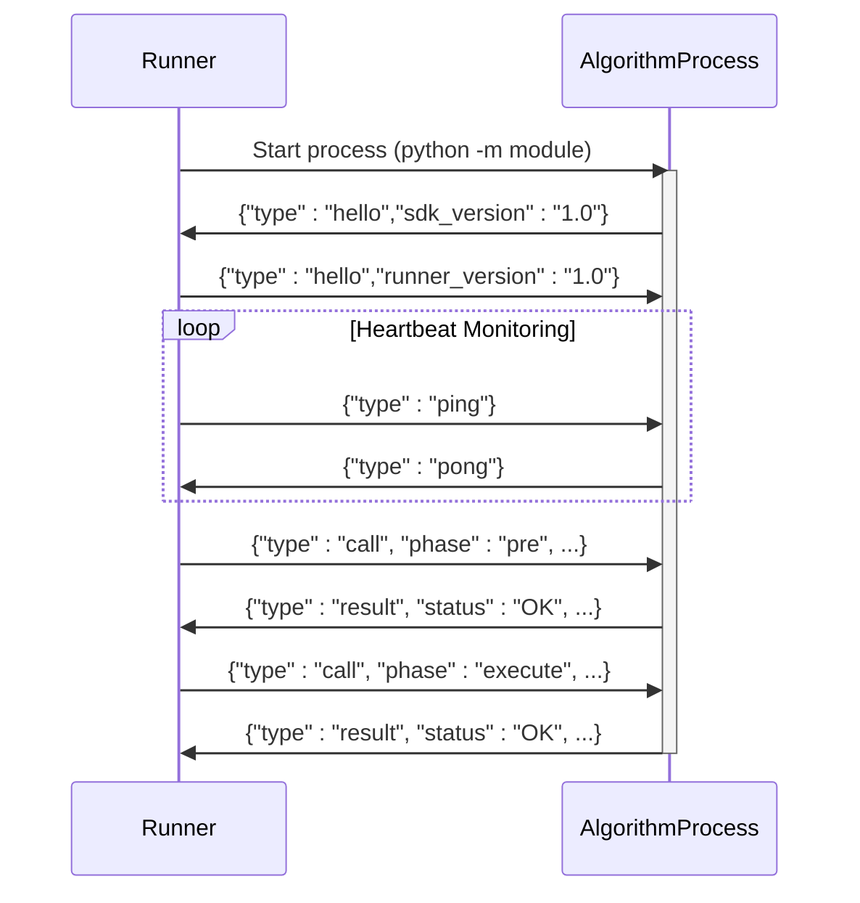
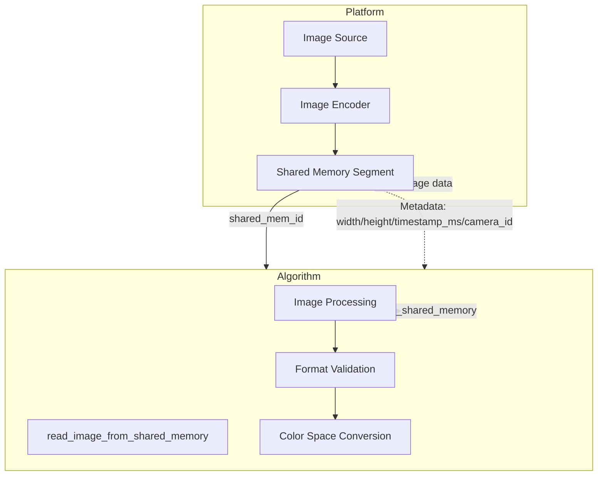
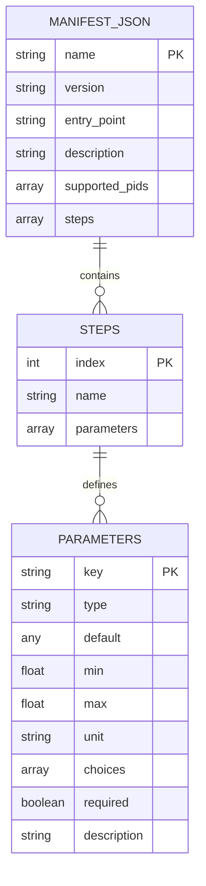
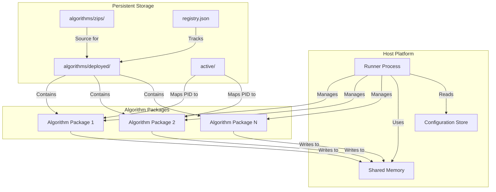

# Integration Patterns

<cite>
**Referenced Files in This Document**   
- [base.py](file://procvision_algorithm_sdk/base.py)
- [session.py](file://procvision_algorithm_sdk/session.py)
- [shared_memory.py](file://procvision_algorithm_sdk/shared_memory.py)
- [cli.py](file://procvision_algorithm_sdk/cli.py)
- [runner_spec.md](file://runner_spec.md)
- [spec_architecture_review.md](file://spec_architecture_review.md)
- [manifest.json](file://algorithm-example/manifest.json)
- [README.md](file://README.md)
</cite>

## Table of Contents
1. [Introduction](#introduction)
2. [Process Isolation Model](#process-isolation-model)
3. [Shared Memory Integration](#shared-memory-integration)
4. [Configuration-Driven Integration](#configuration-driven-integration)
5. [Deployment Integration Pattern](#deployment-integration-pattern)
6. [Deployment Topology](#deployment-topology)
7. [Process Lifecycle State Machine](#process-lifecycle-state-machine)
8. [Integration Inconsistencies and Resolutions](#integration-inconsistencies-and-resolutions)

## Introduction
The ProcVision Algorithm SDK implements a robust integration architecture between algorithm components and the host platform, designed for industrial vision applications. This document details the integration patterns that enable seamless communication, high-performance data transfer, and dynamic algorithm management. The architecture follows a process isolation model where algorithms run as separate processes managed by a Runner, communicating through stdin/stdout pipes. For high-performance image data transfer, a shared memory mechanism is employed. Configuration-driven integration through manifest.json enables dynamic algorithm discovery and PID-based routing, while deployment follows a pattern of offline zip packages with bundled dependencies. These patterns collectively ensure stability, performance, and maintainability in production environments.

## Process Isolation Model
The ProcVision Algorithm SDK employs a process isolation model where each algorithm runs as a separate process managed by the Runner component. This architectural pattern ensures stability and security by preventing algorithm failures from affecting the host platform or other algorithms. The Runner launches algorithm processes according to the entry_point specified in the manifest.json file, using either the command `python -m <module>` or `python <file>` depending on the configuration. Communication between the Runner and algorithm processes occurs through stdin/stdout pipes using a structured JSON-based protocol with length-prefixed framing ([4-byte big-endian length][UTF-8 JSON]).

The process lifecycle begins with a handshake sequence where the algorithm process outputs a hello message on stdout with its SDK version, and the Runner responds with its own hello message containing the runner_version. Heartbeat monitoring is implemented through periodic ping/pong messages, with the Runner sending a ping every 5 seconds and expecting a pong response from the algorithm within 2 seconds. This heartbeat mechanism enables the Runner to detect unresponsive processes and initiate recovery procedures. The Runner manages the complete lifecycle of algorithm processes, including setup, execution, and teardown phases, while ensuring graceful process termination and resource cleanup.



**Diagram sources**
- [runner_spec.md](file://runner_spec.md#L45-L282)
- [cli.py](file://procvision_algorithm_sdk/cli.py#L20-L614)

**Section sources**
- [runner_spec.md](file://runner_spec.md#L45-L282)
- [cli.py](file://procvision_algorithm_sdk/cli.py#L20-L614)

## Shared Memory Integration
The shared memory integration pattern provides high-performance image data transfer between the host platform and algorithm processes. This mechanism addresses the performance limitations of transmitting large image data through stdin/stdout pipes by allowing direct memory access between processes. The platform writes image data to a shared memory segment and provides the algorithm with a shared_mem_id identifier and image_meta containing essential metadata such as width, height, timestamp_ms, and camera_id.

The SDK provides two primary functions for shared memory operations: `write_image_array_to_shared_memory` for writing NumPy arrays directly to shared memory, and `read_image_from_shared_memory` for reading image data from shared memory into a standardized format. The `read_image_from_shared_memory` function performs intelligent format conversion, handling various input types including raw bytes (treated as JPEG/PNG), NumPy arrays with different channel configurations (grayscale, single-channel, or three-channel), and automatically converting between color spaces (BGR to RGB) when specified in the image_meta. When image data cannot be properly decoded, the function returns a zero-filled array with dimensions specified in the metadata, ensuring predictable behavior.

The implementation uses an in-memory dictionary `_DEV_SHM` as the shared memory backend during development and testing, with the capability to integrate with system-level shared memory mechanisms in production environments. This abstraction allows for consistent behavior across different deployment scenarios while maintaining high performance. The shared memory approach significantly reduces data transfer overhead, enabling real-time processing of high-resolution images in industrial vision applications.



**Diagram sources**
- [shared_memory.py](file://procvision_algorithm_sdk/shared_memory.py#L1-L52)
- [runner_spec.md](file://runner_spec.md#L230-L245)

**Section sources**
- [shared_memory.py](file://procvision_algorithm_sdk/shared_memory.py#L1-L52)
- [test_shared_memory.py](file://tests/test_shared_memory.py#L1-L15)
- [test_shared_memory_array.py](file://tests/test_shared_memory_array.py#L1-L38)

## Configuration-Driven Integration
The configuration-driven integration pattern enables dynamic algorithm discovery and PID-based routing through the manifest.json file. This JSON configuration file serves as the contract between the algorithm package and the host platform, containing essential metadata that drives the integration process. The manifest.json specifies critical information including the algorithm name, version, entry_point for process initialization, description, supported_pids that define which product identifiers the algorithm can process, and detailed step configurations with associated parameters.

The Runner uses the manifest.json to implement dynamic algorithm discovery by scanning designated directories for valid algorithm packages. When a request is received with a specific PID, the Runner consults the supported_pids array in the manifest to determine which algorithm package should handle the request. This PID-based routing mechanism allows multiple algorithms to coexist on the same platform while ensuring that each product type is processed by its designated algorithm. The steps array in the manifest defines the processing workflow, with each step containing an index, name, and parameters schema that describes the configurable options available for that processing stage.

This configuration-driven approach provides significant flexibility, allowing algorithms to be added, removed, or updated without modifying the host platform code. The parameter definitions within each step enable dynamic UI generation in the host application, where user-configurable parameters are automatically presented based on the parameter type (int, float, string, rect, enum, etc.) and constraints (min, max, choices). This declarative configuration model simplifies algorithm development and deployment while ensuring consistency across different algorithm implementations.



**Diagram sources**
- [manifest.json](file://algorithm-example/manifest.json#L1-L24)
- [runner_spec.md](file://runner_spec.md#L150-L180)

**Section sources**
- [manifest.json](file://algorithm-example/manifest.json#L1-L24)
- [runner_spec.md](file://runner_spec.md#L150-L180)
- [cli.py](file://procvision_algorithm_sdk/cli.py#L20-L614)

## Deployment Integration Pattern
The deployment integration pattern utilizes offline zip packages with bundled dependencies to ensure consistent and reliable algorithm deployment across different environments. This approach eliminates the need for network connectivity during deployment and guarantees that all required dependencies are present and compatible. The offline package contains the algorithm source code, manifest.json configuration, requirements.txt listing Python dependencies, a wheels/ directory with pre-downloaded binary packages, and optional assets such as models or templates.

The deployment process begins with package validation, where the Runner verifies the structural integrity of the zip file by checking for the presence of essential files (manifest.json, requirements.txt, wheels/). Following validation, the package is extracted to a designated deployment directory (algorithms/deployed/<name>/<version>/) and a isolated virtual environment (venv/) is created. Dependencies are installed from the bundled wheels using pip with the --no-index and --find-links flags to ensure only the packaged dependencies are used. This process guarantees reproducible deployments and prevents version conflicts that could arise from online package installation.

The deployment workflow supports zero-downtime updates through a pre-warming mechanism where new algorithm versions are deployed and their processes are started and validated before being activated for production traffic. When switching between algorithm versions, the Runner can pre-start the new version, complete the handshake process, and then route subsequent requests to the new version while allowing the old version to complete any in-progress tasks. This pattern enables seamless updates and rollbacks, critical for maintaining uptime in industrial environments. The Runner maintains a registry of installed packages and their activation status, allowing for version management and audit trails.

**Section sources**
- [runner_spec.md](file://runner_spec.md#L180-L282)
- [README.md](file://README.md#L90-L115)
- [cli.py](file://procvision_algorithm_sdk/cli.py#L400-L500)

## Deployment Topology
The deployment topology of the ProcVision Algorithm SDK follows a layered architecture with clear separation between the host platform, algorithm runtime, and persistent storage. The Runner component resides on the host platform and manages the lifecycle of algorithm processes, acting as the intermediary between the application layer and algorithm execution. Algorithm packages are stored in a hierarchical directory structure with separate locations for original zip packages (algorithms/zips/), deployed packages (algorithms/deployed/<name>/<version>/), and active configuration mappings (active/<pid>.json).

Each deployed algorithm package exists in its own isolated environment with its source code, configuration files, and a dedicated virtual environment (venv/) containing its specific dependencies. This isolation prevents dependency conflicts between different algorithms and allows each algorithm to use different versions of the same library if required. The shared memory subsystem provides a high-performance communication channel between the Runner and algorithm processes, bypassing the overhead of inter-process communication for large image data.

The topology supports multiple deployment scenarios, from single-node installations to distributed systems where the Runner and algorithms may reside on different physical machines. In distributed configurations, the shared memory mechanism can be adapted to use network-based shared memory or other high-performance data transfer protocols. The configuration-driven nature of the system allows for dynamic reconfiguration without requiring changes to the underlying topology. Monitoring and logging components collect diagnostic information from both the Runner and algorithm processes, providing comprehensive visibility into system performance and health.



**Diagram sources**
- [runner_spec.md](file://runner_spec.md#L246-L282)
- [README.md](file://README.md#L90-L115)

**Section sources**
- [runner_spec.md](file://runner_spec.md#L246-L282)
- [README.md](file://README.md#L90-L115)

## Process Lifecycle State Machine
The process lifecycle in the ProcVision Algorithm SDK follows a well-defined state machine that governs the transition of algorithm packages from discovery to execution and termination. The state machine is file-system driven, with each state corresponding to a specific directory structure and configuration. The lifecycle begins in the discovered state when a new zip package is placed in the algorithms/zips/ directory. The Runner then transitions the package to the validated state by performing structural checks and entry point validation, ensuring all required files are present and the algorithm class can be imported.

Upon successful validation, the package moves to the deployed state where it is extracted to the algorithms/deployed/<name>/<version>/ directory and its dependencies are installed in an isolated virtual environment. The next transition is to the running state, achieved when the Runner starts the algorithm process, establishes communication through the hello handshake, and confirms heartbeat functionality. In this state, the algorithm is ready to process requests but is not yet bound to a specific PID.

When a detection request is received, the Runner transitions the process to the executing state by sending a call instruction with the appropriate PID, session context, and image data references. After processing is complete, the process returns to the running state, ready for subsequent requests. The state machine also includes error states such as invalid (for packages that fail validation) and stopped (for processes that have been terminated but remain deployed). This state machine ensures predictable behavior and enables automated recovery procedures when processes fail or become unresponsive.

```mermaid
stateDiagram-v2
[*] --> Discovered
Discovered --> Validated : Scan & Validate
Validated --> Deployed : Extract & Install Dependencies
Deployed --> Running : Start Process & Handshake
Running --> Executing : Receive Call with PID
Executing --> Running : Return Result
Running --> Stopped : Stop Command
Stopped --> Running : Start Command
Discovered --> Invalid : Validation Failed
Invalid --> [*] : Manual Intervention
Stopped --> [*] :
Deployed --> [*] : Uninstall
note right of Invalid
Recorded with failure reason
Requires manual resolution
end note
note left of Running
Heartbeat monitored
Ready for execution
end note
```

**Diagram sources**
- [runner_spec.md](file://runner_spec.md#L210-L225)
- [cli.py](file://procvision_algorithm_sdk/cli.py#L20-L614)

**Section sources**
- [runner_spec.md](file://runner_spec.md#L210-L225)
- [cli.py](file://procvision_algorithm_sdk/cli.py#L20-L614)

## Integration Inconsistencies and Resolutions
The integration patterns described in this document have been refined based on architectural review findings documented in spec_architecture_review.md. Several inconsistencies were identified and resolved to ensure a coherent and reliable integration model. The most significant issue involved the Session API definition, where the documented get() method signature differed from its actual implementation. This was resolved by providing a complete Session class implementation that includes proper JSON serialization checks and clear documentation of the state management mechanism.

Another critical inconsistency involved the return value schema, where the BaseResponse definition conflicted with the documented execute method behavior. This was resolved by establishing a clear two-layer status model: the top-level status field indicates the technical success or failure of the API call (OK/ERROR), while the data.result_status field contains the business-level result (OK/NG) for execute operations. This separation ensures that technical errors and business outcomes are properly distinguished.

The documentation previously contained contradictory statements about overlay capabilities and the suggest_action field, with some sections indicating support while others explicitly stated these features were not available. These contradictions were resolved by completely removing references to unsupported features and updating all documentation to reflect the current capabilities. The parameter type system was also enhanced to provide more comprehensive definitions for complex types like array and json, including element-level constraints and JSON Schema examples.

These resolutions have resulted in a more consistent and reliable integration architecture. The process isolation model, shared memory integration, configuration-driven discovery, and deployment patterns now form a cohesive system that balances performance, flexibility, and maintainability. The architectural review process has strengthened the overall design by identifying and addressing potential points of confusion or implementation error, ensuring that the ProcVision Algorithm SDK provides a robust foundation for industrial vision applications.

**Section sources**
- [spec_architecture_review.md](file://spec_architecture_review.md#L1-L799)
- [runner_spec.md](file://runner_spec.md#L1-L282)
- [base.py](file://procvision_algorithm_sdk/base.py#L1-L57)