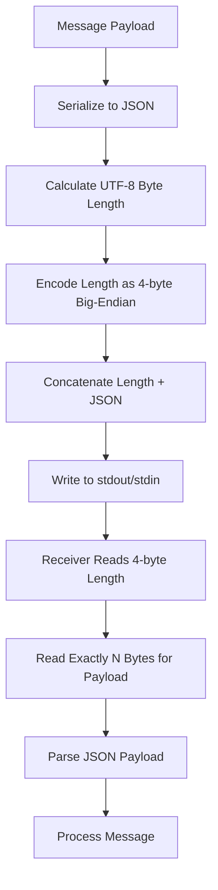
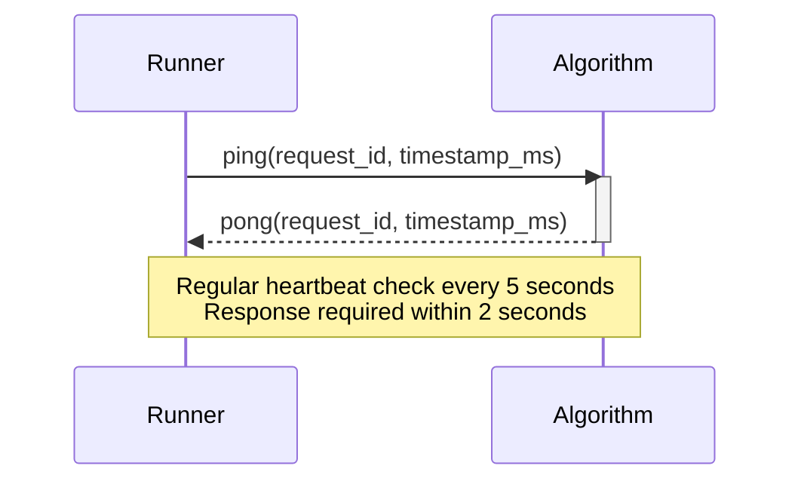
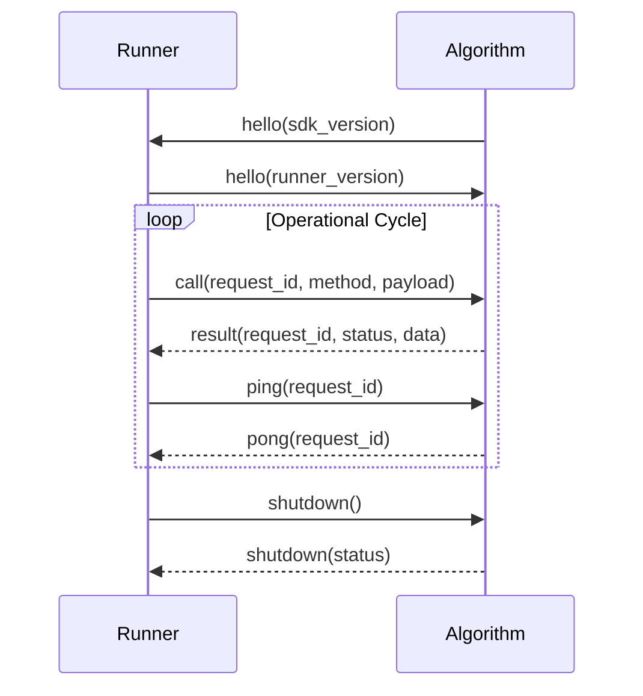

# Message Types and Payloads

<cite>
**Referenced Files in This Document**   
- [spec.md](file://spec.md)
- [runner_spec.md](file://runner_spec.md)
- [base.py](file://procvision_algorithm_sdk/base.py)
- [session.py](file://procvision_algorithm_sdk/session.py)
- [shared_memory.py](file://procvision_algorithm_sdk/shared_memory.py)
- [logger.py](file://procvision_algorithm_sdk/logger.py)
- [diagnostics.py](file://procvision_algorithm_sdk/diagnostics.py)
- [cli.py](file://procvision_algorithm_sdk/cli.py)
- [main.py](file://algorithm-example/algorithm_example/main.py)
</cite>

## Table of Contents
1. [Introduction](#introduction)
2. [Message Protocol Overview](#message-protocol-overview)
3. [Message Framing and Transport](#message-framing-and-transport)
4. [Message Types](#message-types)
   - [Call Message](#call-message)
   - [Result Message](#result-message)
   - [Ping Message](#ping-message)
   - [Pong Message](#pong-message)
   - [Error Message](#error-message)
   - [Shutdown Message](#shutdown-message)
5. [Heartbeat Mechanism](#heartbeat-mechanism)
6. [Request ID and Message Correlation](#request-id-and-message-correlation)
7. [Communication Flow](#communication-flow)
8. [Error Handling and Status Codes](#error-handling-and-status-codes)
9. [Best Practices](#best-practices)

## Introduction
This document provides comprehensive documentation for all message types used in the stdin/stdout communication protocol between the ProcVision Algorithm SDK and the Runner. The protocol enables bidirectional communication for algorithm execution, status monitoring, and lifecycle management. The documented message types include 'call', 'result', 'ping', 'pong', 'error', and 'shutdown', each serving specific purposes in the interaction between the Runner and algorithm processes. The specification covers message structure, usage context, framing mechanism, and correlation techniques to ensure reliable and efficient communication in industrial vision applications.

## Message Protocol Overview
The communication protocol between the ProcVision Algorithm SDK and the Runner is based on a bidirectional stdin/stdout pipe mechanism that uses JSON messages with a 4-byte big-endian length prefix for framing. This design ensures reliable message transmission without packet fragmentation or concatenation issues. The protocol supports several message types that facilitate different aspects of algorithm execution and monitoring, including method invocation ('call'), result reporting ('result'), health monitoring ('ping'/'pong'), error reporting ('error'), and lifecycle management ('shutdown'). All messages are structured as JSON objects with standardized fields that enable consistent parsing and processing. The protocol is designed to be language-agnostic, allowing algorithm implementations in various programming languages while maintaining interoperability with the Runner component.

**Section sources**
- [spec.md](file://spec.md#L615-L637)
- [runner_spec.md](file://runner_spec.md#L30-L32)

## Message Framing and Transport
The communication protocol employs a length-prefixed framing mechanism to ensure reliable message transmission over the stdin/stdout pipes. Each message is formatted with a 4-byte big-endian length prefix followed by the UTF-8 encoded JSON payload. This framing approach prevents message boundary ambiguity and eliminates the risk of packet fragmentation or concatenation that could occur with delimiter-based protocols. The length prefix represents the byte length of the JSON payload, enabling the receiver to read exactly the required number of bytes for complete message reconstruction. All protocol messages are transmitted through stdout for algorithm responses and stdin for Runner commands, while structured logging is isolated to stderr to prevent protocol stream contamination. This separation ensures that diagnostic information does not interfere with the operational message flow.

**Diagram sources**
- [spec.md](file://spec.md#L618-L619)
- [runner_spec.md](file://runner_spec.md#L34-L35)

## Message Types

### Call Message
The 'call' message type is used by the Runner to invoke algorithm methods, specifically 'pre_execute' or 'execute' operations. This message contains all necessary context and parameters for algorithm execution, including the step index, product ID (pid), session data, user-defined parameters, shared memory identifier, image metadata, and execution phase. The call message serves as the primary mechanism for initiating algorithm processing on image data. It includes a request_id field for message correlation and a timestamp_ms field for timing and diagnostic purposes. The payload structure is designed to provide all contextual information required for the algorithm to perform its designated task while maintaining a consistent interface across different algorithm implementations.

**Section sources**
- [spec.md](file://spec.md#L620-L621)
- [runner_spec.md](file://runner_spec.md#L34-L46)

### Result Message
The 'result' message type is used by the algorithm to return the outcome of a 'call' invocation to the Runner. This message contains the execution status, optional error message, and structured result data. The result data includes business-level status (OK/NG), NG reason when applicable, defect rectangles for visual defects, position rectangles for object locations, calibration rectangles for reference points, and debug information for diagnostics. The result message follows a two-layer status model where the top-level 'status' indicates the success or failure of the method invocation itself, while the 'data.result_status' field indicates the business outcome of the algorithm processing. This separation allows the system to distinguish between technical failures and business rule violations.

**Section sources**
- [spec.md](file://spec.md#L620-L621)
- [runner_spec.md](file://runner_spec.md#L47-L59)

### Ping Message
The 'ping' message type is used by the Runner to monitor the health and responsiveness of the algorithm process. Sent at regular intervals (default every 5 seconds), the ping message serves as a heartbeat mechanism to verify that the algorithm process is alive and responsive. Each ping message includes a unique request_id that must be echoed back in the corresponding pong response, enabling message correlation and detection of lost or out-of-order messages. The ping message may also include a timestamp_ms field to facilitate round-trip time calculations and performance monitoring. This proactive health check mechanism allows the Runner to detect unresponsive algorithm processes and initiate recovery procedures before they impact production operations.

**Section sources**
- [spec.md](file://spec.md#L633-L634)
- [runner_spec.md](file://runner_spec.md#L27-L28)

### Pong Message
The 'pong' message type is the algorithm's response to a 'ping' message, confirming its operational status and responsiveness. Upon receiving a ping message, the algorithm must generate and send a pong message within a specified timeout period (default 2 seconds). The pong message includes the same request_id as the original ping, enabling the Runner to correlate the response with the corresponding request. This message may also include a timestamp_ms field to provide timing information for round-trip calculations. The prompt response to ping messages is critical for maintaining the algorithm's health status in the Runner's monitoring system and preventing false-positive failure detection.

**Section sources**
- [spec.md](file://spec.md#L633-L634)
- [runner_spec.md](file://runner_spec.md#L27-L28)

### Error Message
The 'error' message type is used to report exceptional conditions that prevent normal message processing or indicate critical failures in the communication system. Unlike the 'result' message which can contain error information for business logic failures, the 'error' message is reserved for protocol-level or system-level issues such as message parsing failures, invalid message types, or communication channel errors. This message type helps distinguish between application-level errors (handled through the result message's status field) and infrastructure-level problems that require immediate attention. The error message typically includes diagnostic information to assist in troubleshooting and may trigger immediate recovery procedures such as process restart.

**Section sources**
- [spec.md](file://spec.md#L620-L621)
- [runner_spec.md](file://runner_spec.md#L30-L32)

### Shutdown Message
The 'shutdown' message type is used to initiate the graceful termination of the algorithm process. When the Runner determines that an algorithm is no longer needed or when system shutdown is required, it sends a shutdown message to the algorithm process. Upon receiving this message, the algorithm should perform cleanup operations such as releasing resources, saving state, and calling the teardown() method before exiting. The algorithm responds with a shutdown message containing a status field to confirm successful shutdown preparation. This coordinated shutdown process ensures that resources are properly released and prevents data corruption or resource leaks that could occur with abrupt process termination.

**Section sources**
- [spec.md](file://spec.md#L635-L637)
- [runner_spec.md](file://runner_spec.md#L30-L32)

## Heartbeat Mechanism
The heartbeat mechanism implemented through 'ping' and 'pong' messages ensures the continuous monitoring of algorithm process health and responsiveness. The Runner initiates this mechanism by sending 'ping' messages at regular intervals (default every 5 seconds) to the algorithm process. The algorithm must respond with a 'pong' message containing the same request_id within a specified timeout period (default 2 seconds). This design creates a reliable health check system that can detect unresponsive or frozen processes. The mechanism includes configurable parameters such as ping interval, heartbeat grace period, and maximum retry count, allowing adaptation to different performance requirements and network conditions. If the algorithm fails to respond within the timeout period, the Runner initiates recovery procedures that may include process restart after a graceful termination attempt.

**Diagram sources**
- [spec.md](file://spec.md#L651-L652)
- [runner_spec.md](file://runner_spec.md#L27-L28)

## Request ID and Message Correlation
The request_id field serves as a crucial mechanism for message correlation and tracking in the communication protocol. Each 'call' message from the Runner includes a unique request_id (typically a UUID) that is echoed back in the corresponding 'result' message from the algorithm. Similarly, 'ping' messages include a request_id that must be reflected in the 'pong' response. This correlation mechanism enables several important capabilities: matching responses to their corresponding requests, detecting lost or duplicate messages, measuring round-trip times for performance monitoring, and providing traceability for debugging and auditing purposes. The request_id system is essential for maintaining message integrity in potentially high-latency or unreliable communication environments, ensuring that responses are correctly associated with their originating requests even if messages arrive out of order.

**Section sources**
- [spec.md](file://spec.md#L622-L623)
- [runner_spec.md](file://runner_spec.md#L27-L28)

## Communication Flow
The communication flow between the ProcVision Algorithm SDK and the Runner follows a well-defined sequence of message exchanges that begins with process initialization and handshake, followed by operational message cycles, and concludes with graceful shutdown. The flow starts with the algorithm process outputting a 'hello' message upon startup, which is acknowledged by the Runner with its own 'hello' response, establishing the communication channel. Once the handshake is complete, the Runner can send 'call' messages to invoke algorithm methods, to which the algorithm responds with 'result' messages. Throughout this operational phase, periodic 'ping' messages from the Runner are answered with 'pong' responses to maintain the heartbeat. The flow concludes when the Runner sends a 'shutdown' message, prompting the algorithm to perform cleanup and terminate gracefully. This structured flow ensures reliable and predictable interaction between the components.

**Diagram sources**
- [spec.md](file://spec.md#L620-L637)
- [runner_spec.md](file://runner_spec.md#L30-L32)

## Error Handling and Status Codes
The protocol implements a comprehensive error handling system that distinguishes between different types of failures through standardized status codes and message structures. The top-level 'status' field in messages indicates the success or failure of the message processing itself, with values of 'OK' or 'ERROR'. For business logic outcomes, the 'data.result_status' field contains 'OK' or 'NG' to indicate pass/fail results of algorithm processing. The system defines standard error codes (1001-1007, 9999) for common failure scenarios such as invalid PID, image load failure, model not found, GPU out of memory, timeout, invalid parameters, coordinate invalid, and unknown errors. This structured approach to error reporting enables consistent handling across different algorithm implementations and facilitates automated recovery procedures based on error type.

**Section sources**
- [spec.md](file://spec.md#L690-L701)
- [runner_spec.md](file://runner_spec.md#L100-L107)

## Best Practices
Implementing the ProcVision Algorithm SDK communication protocol effectively requires adherence to several best practices. Algorithms should process 'ping' messages asynchronously to prevent heartbeat timeouts during long-running 'execute' operations. The 4-byte length prefix framing must be correctly implemented on both ends to ensure reliable message transmission. Message correlation through request_id should be maintained consistently across all message types. Error handling should follow the specified two-layer model, using the top-level 'status' for technical failures and 'data.result_status' for business outcomes. Algorithms should respond promptly to 'shutdown' messages by performing necessary cleanup in the teardown() method. Logging should be directed to stderr to avoid contaminating the protocol message stream on stdout. These practices ensure reliable, maintainable, and performant integration between algorithms and the Runner system.

**Section sources**
- [spec.md](file://spec.md#L634-L637)
- [runner_spec.md](file://runner_spec.md#L30-L32)