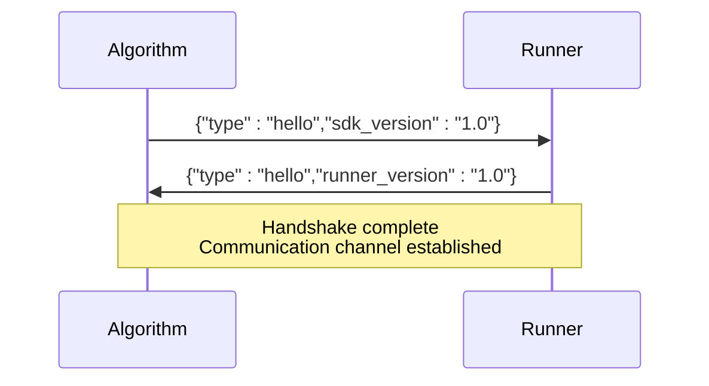
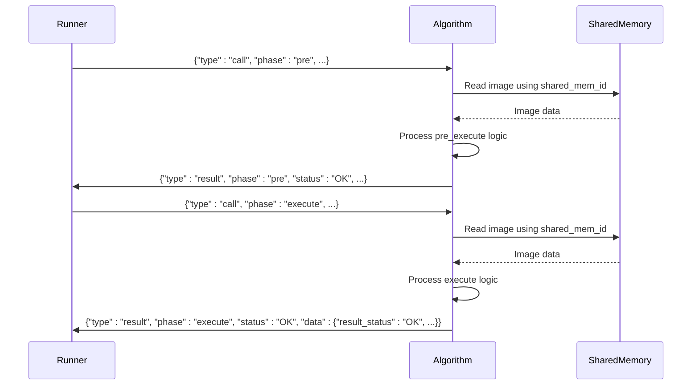
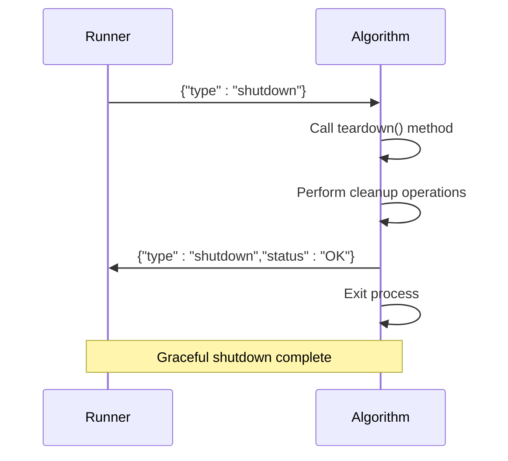
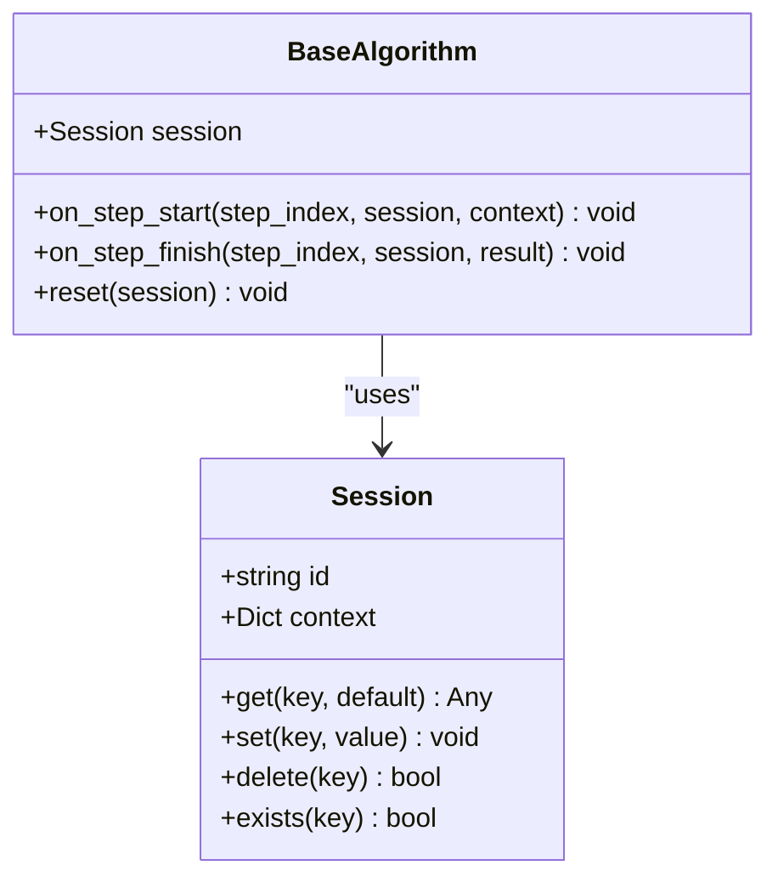

# Process Communication

<cite>
**Referenced Files in This Document**   
- [runner_spec.md](file://runner_spec.md)
- [spec.md](file://spec.md)
- [base.py](file://procvision_algorithm_sdk/base.py)
- [session.py](file://procvision_algorithm_sdk/session.py)
- [logger.py](file://procvision_algorithm_sdk/logger.py)
- [shared_memory.py](file://procvision_algorithm_sdk/shared_memory.py)
- [main.py](file://algorithm-example/algorithm_example/main.py)
- [manifest.json](file://algorithm-example/manifest.json)
</cite>

## Table of Contents
1. [Introduction](#introduction)
2. [Communication Protocol Overview](#communication-protocol-overview)
3. [Message Framing and Stream Management](#message-framing-and-stream-management)
4. [Handshake Protocol](#handshake-protocol)
5. [Message Types and Lifecycle](#message-types-and-lifecycle)
6. [Call/Result Exchange](#callresult-exchange)
7. [Shutdown Sequence](#shutdown-sequence)
8. [Error Handling and Diagnostics](#error-handling-and-diagnostics)
9. [Session and State Management](#session-and-state-management)
10. [Shared Memory Integration](#shared-memory-integration)
11. [Conclusion](#conclusion)

## Introduction
The ProcVision Algorithm SDK implements a robust process communication integration pattern between the algorithm and the host platform (Runner). This document details the bidirectional communication protocol that enables reliable message exchange through stdin/stdout pipes. The architecture ensures message integrity through length-prefixed framing, establishes a formal handshake mechanism, and maintains strict separation between protocol messages and logging output. The communication pattern supports the complete lifecycle of algorithm execution, from initialization to shutdown, while providing mechanisms for health monitoring, error reporting, and state management.

## Communication Protocol Overview
The communication between the ProcVision Algorithm SDK and the host platform follows a well-defined protocol using stdin and stdout pipes for bidirectional message exchange. The protocol is designed to ensure reliable, unambiguous communication between the algorithm process and the Runner, preventing common issues such as message framing errors and stream contamination. The architecture separates concerns by using stdout exclusively for protocol messages and stderr for structured logging, ensuring that diagnostic information does not interfere with the command-response cycle.

```mermaid
graph TB
subgraph "Host Platform (Runner)"
R[Runner Process]
R --> |stdin| A
R <--|stdout| A
R <--|stderr| A
end
subgraph "Algorithm Process"
A[Algorithm SDK]
A --> |stdout| R
A --> |stderr| R
A --> |stdin| R
end
style R fill:#f9f,stroke:#333
style A fill:#bbf,stroke:#333
```

**Diagram sources**
- [runner_spec.md](file://runner_spec.md#L0-L28)
- [spec.md](file://spec.md#L615-L633)

## Message Framing and Stream Management
The communication protocol employs a 4-byte big-endian length-prefixed UTF-8 JSON frame format to prevent message framing issues. Each message is encoded as a frame consisting of a 4-byte header containing the length of the JSON payload in big-endian byte order, followed by the UTF-8 encoded JSON content. This framing mechanism ensures that the receiver can accurately determine message boundaries, eliminating the risk of message concatenation or fragmentation.

The protocol strictly separates communication channels to prevent stream contamination:
- **stdout**: Dedicated exclusively to protocol messages (hello, result, pong, etc.)
- **stdin**: Receives commands and requests from the Runner (call, ping, shutdown, etc.)
- **stderr**: Reserved for structured logging output, ensuring logs do not interfere with the protocol stream

This separation ensures that diagnostic information and operational messages do not corrupt the communication protocol, maintaining reliability and predictability in message exchange.

**Section sources**
- [runner_spec.md](file://runner_spec.md#L70-L75)
- [spec.md](file://spec.md#L615-L617)

## Handshake Protocol
The communication lifecycle begins with a formal handshake protocol that establishes the connection between the algorithm and the Runner. Upon startup, the algorithm process immediately outputs a hello message to stdout, signaling its readiness to communicate. The Runner responds with its own hello message, completing the handshake and establishing a valid communication channel.

The handshake sequence follows these steps:
1. Algorithm process starts and initializes its components
2. Algorithm writes hello message to stdout: `{"type":"hello","sdk_version":"1.0"}`
3. Runner detects the hello message and validates the SDK version
4. Runner responds with hello message within 2 seconds: `{"type":"hello","runner_version":"1.0"}`
5. Communication channel is established, and the algorithm enters the ready state

Until the handshake is completed, the Runner will not send any business messages to the algorithm, ensuring that the algorithm is fully initialized before processing requests.



**Diagram sources**
- [runner_spec.md](file://runner_spec.md#L50-L55)
- [spec.md](file://spec.md#L625-L627)

**Section sources**
- [runner_spec.md](file://runner_spec.md#L50-L55)
- [spec.md](file://spec.md#L625-L627)

## Message Types and Lifecycle
The communication protocol defines several message types that govern the complete lifecycle of algorithm execution. Each message type serves a specific purpose in the interaction between the algorithm and the Runner, enabling a rich set of capabilities including health monitoring, command execution, and error reporting.

### Message Types
- **hello**: Establishes the communication channel during startup
- **call**: Instructs the algorithm to execute a specific operation (pre_execute or execute)
- **result**: Returns the outcome of a call operation, including status and data
- **ping**: Health check message sent by the Runner to verify algorithm responsiveness
- **pong**: Response to a ping message, confirming algorithm health
- **error**: Reports exceptional conditions that prevent normal operation
- **shutdown**: Signals the algorithm to terminate gracefully

The message lifecycle follows a stateful pattern where the algorithm transitions through different phases of operation. After the initial handshake, the algorithm enters a ready state where it can receive call messages. The Runner sends periodic ping messages to monitor health, and the algorithm responds with pong messages. When a processing request arrives, the Runner sends a call message, and the algorithm responds with a result message. Finally, when processing is complete or the system is shutting down, a shutdown message terminates the communication session.

**Section sources**
- [runner_spec.md](file://runner_spec.md#L70-L85)
- [spec.md](file://spec.md#L618-L633)

## Call/Result Exchange
The primary interaction pattern between the Runner and the algorithm is the call/result exchange, which enables the execution of business logic. The Runner initiates this exchange by sending a call message containing the operation parameters, and the algorithm responds with a result message containing the outcome.

The call message structure includes:
- **type**: "call"
- **step_index**: Sequential index of the processing step (starting from 1)
- **pid**: Product identifier specifying the type of product being processed
- **session**: Session context containing persistent state for the processing flow
- **user_params**: User-defined parameters controlling algorithm behavior
- **shared_mem_id**: Identifier for shared memory containing input data
- **image_meta**: Metadata about the input image (dimensions, timestamp, camera ID)
- **phase**: Execution phase ("pre" for pre_execute, "execute" for main processing)

The algorithm processes the call message by:
1. Validating the PID against supported types
2. Reading the input image from shared memory using the provided shared_mem_id
3. Executing the appropriate method (pre_execute or execute) with the provided parameters
4. Generating a result message with the processing outcome

The result message structure varies by phase:
- **pre phase**: Contains calibration information and preparation status, but no business decision
- **execute phase**: Contains the business decision in data.result_status ("OK" or "NG"), with NG results including ng_reason and defect_rects



**Diagram sources**
- [runner_spec.md](file://runner_spec.md#L85-L105)
- [spec.md](file://spec.md#L628-L630)
- [base.py](file://procvision_algorithm_sdk/base.py#L35-L57)

**Section sources**
- [runner_spec.md](file://runner_spec.md#L85-L105)
- [spec.md](file://spec.md#L628-L630)
- [base.py](file://procvision_algorithm_sdk/base.py#L35-L57)

## Shutdown Sequence
The communication protocol includes a graceful shutdown mechanism that allows the algorithm to terminate cleanly while preserving system integrity. The shutdown sequence ensures that any ongoing operations are completed or properly terminated before the process exits.

The shutdown process follows these steps:
1. Runner sends shutdown message to algorithm via stdin: `{"type":"shutdown"}`
2. Algorithm receives shutdown message and calls its teardown() method
3. Algorithm performs cleanup operations (releasing resources, saving state, etc.)
4. Algorithm sends shutdown acknowledgment to Runner: `{"type":"shutdown","status":"OK"}`
5. Algorithm terminates the process

This graceful shutdown mechanism prevents data loss and ensures that the algorithm can release any allocated resources properly. The acknowledgment message allows the Runner to confirm that the algorithm has shut down successfully before considering the process terminated.



**Diagram sources**
- [spec.md](file://spec.md#L634-L637)
- [base.py](file://procvision_algorithm_sdk/base.py#L20-L22)

## Error Handling and Diagnostics
The communication protocol includes comprehensive error handling and diagnostics capabilities to ensure system reliability and facilitate troubleshooting. Errors are categorized and reported through standardized mechanisms that enable consistent handling across the system.

The protocol defines several error types:
- **RecoverableError**: Transient errors that can be resolved through retry
- **FatalError**: Critical errors requiring process restart
- **GPUOutOfMemoryError**: Resource exhaustion errors
- **ProgramError**: Internal logic errors

Error messages follow a standardized format with:
- **status**: "ERROR" to indicate failure
- **message**: Human-readable description of the error
- **error_code**: Standardized error code for programmatic handling
- **data**: Additional context-specific information

The Diagnostics class provides a mechanism for publishing performance metrics and operational data that can be included in result messages under the debug field. This includes latency measurements, model versions, and other relevant information that aids in system monitoring and optimization.

**Section sources**
- [errors.py](file://procvision_algorithm_sdk/errors.py#L1-L13)
- [diagnostics.py](file://procvision_algorithm_sdk/diagnostics.py#L1-L11)
- [runner_spec.md](file://runner_spec.md#L240-L260)

## Session and State Management
The communication protocol incorporates session-based state management to maintain context across multiple processing steps within a single detection flow. The Session class provides a key-value store that persists for the duration of a detection process, enabling algorithms to maintain state between pre_execute and execute phases.

The Session object contains:
- **id**: Unique identifier for the session
- **context**: Immutable context data (product code, trace ID, etc.)
- **state_store**: Mutable key-value store for algorithm state

Algorithms can use the session to:
- Store intermediate results between processing steps
- Maintain state across multiple calls within a single detection flow
- Share data between different components of the algorithm
- Implement step-specific logic based on previous results

The session lifecycle is tied to a single detection flow, with the session being created at the beginning of processing and destroyed or archived at the end. This ensures that state does not persist across unrelated processing tasks while providing sufficient context for multi-step operations.



**Diagram sources**
- [session.py](file://procvision_algorithm_sdk/session.py#L1-L35)
- [base.py](file://procvision_algorithm_sdk/base.py#L1-L57)

**Section sources**
- [session.py](file://procvision_algorithm_sdk/session.py#L1-L35)
- [base.py](file://procvision_algorithm_sdk/base.py#L1-L57)

## Shared Memory Integration
The communication protocol integrates with shared memory to efficiently transfer large data objects, particularly images, between the Runner and the algorithm. This approach avoids the overhead and limitations of passing large binary data through stdin/stdout pipes.

The shared memory integration works as follows:
1. Runner writes image data to shared memory and generates a shared_mem_id
2. Runner includes shared_mem_id in the call message
3. Algorithm reads image data from shared memory using read_image_from_shared_memory()
4. Algorithm processes the image and returns results through the normal result message

The read_image_from_shared_memory() function handles various image formats and automatically converts them to a standardized numpy array format (H x W x 3) for processing. The image_meta parameter provides essential metadata including width, height, timestamp, and camera ID, ensuring the algorithm has all necessary context for processing.

**Section sources**
- [shared_memory.py](file://procvision_algorithm_sdk/shared_memory.py#L1-L52)
- [runner_spec.md](file://runner_spec.md#L170-L180)

## Conclusion
The process communication integration pattern between the ProcVision Algorithm SDK and the host platform provides a robust, reliable foundation for algorithm execution. The 4-byte big-endian length-prefixed UTF-8 JSON frame format ensures message integrity and prevents framing issues. The formal handshake protocol establishes a reliable communication channel before any business messages are exchanged. The strict separation of protocol messages on stdout and structured logging on stderr prevents stream contamination and ensures reliable message parsing.

The comprehensive set of message types (hello, call, result, ping, pong, error, shutdown) supports the complete lifecycle of algorithm execution, from initialization to termination. The call/result exchange pattern enables efficient processing of business logic with proper state management through the Session class. The integration with shared memory allows for efficient transfer of large data objects like images, while the error handling and diagnostics capabilities ensure system reliability and facilitate troubleshooting.

This communication architecture enables the development of robust, production-ready algorithms that can be reliably integrated with the ProcVision platform, supporting the requirements of industrial inspection and quality control applications.