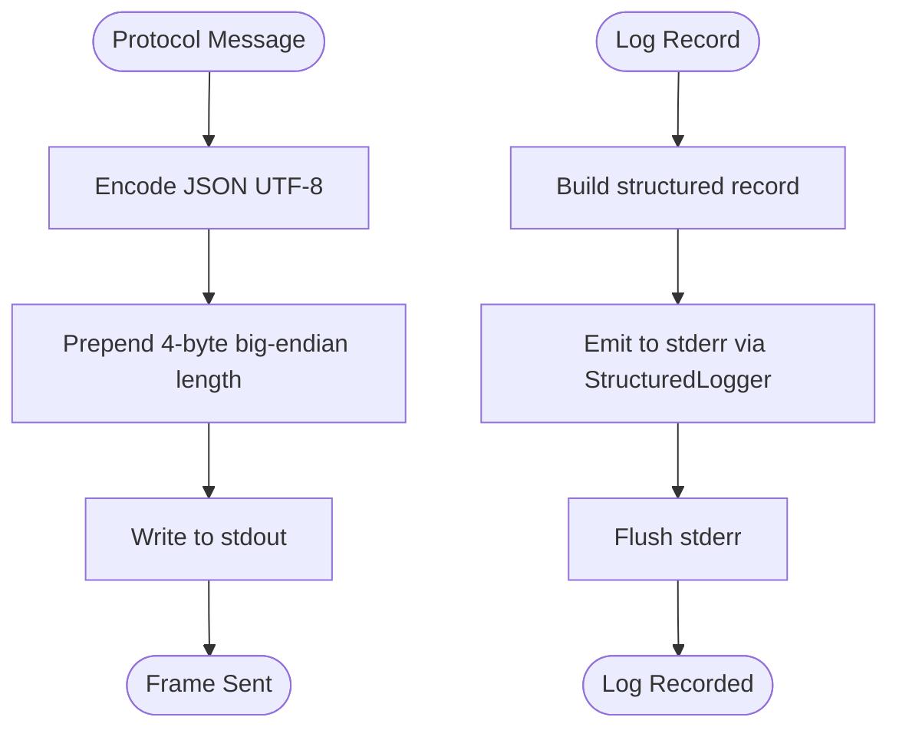

# Stream Separation and Logging

<cite>
**Referenced Files in This Document**
- [README.md](file://README.md)
- [spec.md](file://spec.md)
- [runner_spec.md](file://runner_spec.md)
- [procvision_algorithm_sdk/__init__.py](file://procvision_algorithm_sdk/__init__.py)
- [procvision_algorithm_sdk/base.py](file://procvision_algorithm_sdk/base.py)
- [procvision_algorithm_sdk/logger.py](file://procvision_algorithm_sdk/logger.py)
- [procvision_algorithm_sdk/diagnostics.py](file://procvision_algorithm_sdk/diagnostics.py)
- [procvision_algorithm_sdk/session.py](file://procvision_algorithm_sdk/session.py)
- [procvision_algorithm_sdk/shared_memory.py](file://procvision_algorithm_sdk/shared_memory.py)
</cite>

## Table of Contents
1. [Introduction](#introduction)
2. [Project Structure](#project-structure)
3. [Core Components](#core-components)
4. [Architecture Overview](#architecture-overview)
5. [Detailed Component Analysis](#detailed-component-analysis)
6. [Dependency Analysis](#dependency-analysis)
7. [Performance Considerations](#performance-considerations)
8. [Troubleshooting Guide](#troubleshooting-guide)
9. [Conclusion](#conclusion)

## Introduction
This document explains the strict separation of communication streams in the ProcVision Algorithm SDK integration. It specifies that all protocol messages (hello, call, result, ping, pong, shutdown) must be written exclusively to stdout using the 4-byte big-endian length-prefixed UTF-8 JSON frame format. All logging and diagnostic output must be directed to stderr. The structured logger provided by the SDK must be used for all log output, which automatically writes JSON-formatted logs to stderr. The document also outlines how this separation prevents protocol stream contamination and ensures reliable message framing, and it references the requirements in spec.md and runner_spec.md regarding stream handling and log aggregation by the Runner.

## Project Structure
The SDK exposes a minimal set of components that algorithm authors implement. The key areas relevant to stream separation and logging are:
- Logger: Provides a structured logger that emits JSON records to stderr by default.
- Diagnostics: Provides a mechanism to collect diagnostic fields that can be included in algorithm responses.
- Session: Provides a session object used during algorithm execution; logs should not be emitted here.
- Shared memory helpers: Provide development-time helpers for writing images to a simulated shared memory region.

**Diagram sources**
- [procvision_algorithm_sdk/logger.py](file://procvision_algorithm_sdk/logger.py#L1-L24)
- [procvision_algorithm_sdk/diagnostics.py](file://procvision_algorithm_sdk/diagnostics.py#L1-L12)
- [procvision_algorithm_sdk/session.py](file://procvision_algorithm_sdk/session.py#L1-L36)
- [procvision_algorithm_sdk/shared_memory.py](file://procvision_algorithm_sdk/shared_memory.py#L1-L53)
- [procvision_algorithm_sdk/base.py](file://procvision_algorithm_sdk/base.py#L1-L58)

**Section sources**
- [README.md](file://README.md#L1-L116)
- [procvision_algorithm_sdk/__init__.py](file://procvision_algorithm_sdk/__init__.py#L1-L20)

## Core Components
- StructuredLogger: Emits JSON records with standardized fields to stderr by default. This is the canonical way to produce logs in algorithm code.
- Diagnostics: Collects key-value pairs that can be included in algorithm responses to support Runner-side aggregation.
- BaseAlgorithm: Exposes logger and diagnostics instances to algorithm implementations. Algorithm authors should use these for all logging and diagnostics.
- Session: Provides a session object used during pre_execute and execute. Logs should not be emitted from this component.

Key requirements for stream separation:
- Protocol frames (hello, call, result, ping, pong, shutdown) must be written to stdout using the 4-byte big-endian length-prefixed UTF-8 JSON frame format.
- All logs and diagnostics must be written to stderr via the structured logger.
- The Runner expects this separation and aggregates stderr logs for analysis.

**Section sources**
- [procvision_algorithm_sdk/logger.py](file://procvision_algorithm_sdk/logger.py#L1-L24)
- [procvision_algorithm_sdk/diagnostics.py](file://procvision_algorithm_sdk/diagnostics.py#L1-L12)
- [procvision_algorithm_sdk/base.py](file://procvision_algorithm_sdk/base.py#L1-L58)
- [spec.md](file://spec.md#L615-L637)
- [runner_spec.md](file://runner_spec.md#L1-L120)

## Architecture Overview
The Runner communicates with the algorithm process over stdin/stdout. The protocol uses a strict frame format to prevent message framing ambiguity. The algorithm must strictly separate protocol messages (stdout) from logs (stderr).

**Diagram sources**
- [spec.md](file://spec.md#L615-L637)
- [runner_spec.md](file://runner_spec.md#L1-L120)

## Detailed Component Analysis

### StructuredLogger
The StructuredLogger is the canonical logging facility for algorithm code. It writes JSON records to stderr by default, ensuring logs are separated from protocol frames on stdout.

- Emits records with standardized fields including level and timestamp_ms.
- Uses JSON serialization and flushes after each record.
- Designed to be used via BaseAlgorithm.logger.

**Diagram sources**
- [procvision_algorithm_sdk/logger.py](file://procvision_algorithm_sdk/logger.py#L1-L24)

**Section sources**
- [procvision_algorithm_sdk/logger.py](file://procvision_algorithm_sdk/logger.py#L1-L24)
- [procvision_algorithm_sdk/base.py](file://procvision_algorithm_sdk/base.py#L1-L58)

### Diagnostics
Diagnostics provides a simple key-value store for collecting metrics and debug fields that can be included in algorithm responses.

- publish(key, value): Adds a field to the collection.
- get(): Returns a copy of the collected items.

**Diagram sources**
- [procvision_algorithm_sdk/diagnostics.py](file://procvision_algorithm_sdk/diagnostics.py#L1-L12)

**Section sources**
- [procvision_algorithm_sdk/diagnostics.py](file://procvision_algorithm_sdk/diagnostics.py#L1-L12)
- [procvision_algorithm_sdk/base.py](file://procvision_algorithm_sdk/base.py#L1-L58)

### Session
Session encapsulates per-detection-session state and context. It is used to share data across steps and to carry context such as product code and trace identifiers.

- get(key, default): Retrieve a stored value.
- set(key, value): Store a JSON-serializable value.
- delete(key): Remove a stored value.
- exists(key): Check existence.

**Diagram sources**
- [procvision_algorithm_sdk/session.py](file://procvision_algorithm_sdk/session.py#L1-L36)

**Section sources**
- [procvision_algorithm_sdk/session.py](file://procvision_algorithm_sdk/session.py#L1-L36)

### Protocol Frame Format and Stream Separation
The protocol requires:
- stdout: All protocol frames (hello, call, result, ping, pong, shutdown) using 4-byte big-endian length prefix plus UTF-8 JSON.
- stderr: All logs and diagnostics produced by the structured logger.
- The Runner enforces this separation and aggregates stderr logs.

**Diagram sources**
- [spec.md](file://spec.md#L615-L637)
- [runner_spec.md](file://runner_spec.md#L1-L120)
- [procvision_algorithm_sdk/logger.py](file://procvision_algorithm_sdk/logger.py#L1-L24)

**Section sources**
- [spec.md](file://spec.md#L615-L637)
- [runner_spec.md](file://runner_spec.md#L1-L120)
- [procvision_algorithm_sdk/logger.py](file://procvision_algorithm_sdk/logger.py#L1-L24)

## Dependency Analysis
The SDK composes these components to enable clean separation:
- BaseAlgorithm provides logger and diagnostics instances to algorithm implementations.
- StructuredLogger writes to stderr by default, preventing accidental contamination of stdout protocol frames.
- Diagnostics integrates with algorithm responses to support Runner-side aggregation.

**Diagram sources**
- [procvision_algorithm_sdk/base.py](file://procvision_algorithm_sdk/base.py#L1-L58)
- [procvision_algorithm_sdk/logger.py](file://procvision_algorithm_sdk/logger.py#L1-L24)
- [procvision_algorithm_sdk/diagnostics.py](file://procvision_algorithm_sdk/diagnostics.py#L1-L12)
- [procvision_algorithm_sdk/session.py](file://procvision_algorithm_sdk/session.py#L1-L36)

**Section sources**
- [procvision_algorithm_sdk/base.py](file://procvision_algorithm_sdk/base.py#L1-L58)
- [procvision_algorithm_sdk/__init__.py](file://procvision_algorithm_sdk/__init__.py#L1-L20)

## Performance Considerations
- Using stderr for logs avoids blocking stdout and eliminates the risk of interleaving protocol frames with log lines.
- The 4-byte length prefix ensures robust framing without relying on newline-delimited parsing, reducing overhead and complexity.
- Structured logging enables efficient aggregation and filtering by the Runner.

[No sources needed since this section provides general guidance]

## Troubleshooting Guide
Common issues and their causes:
- Protocol parsing failures: Occur when logs are accidentally written to stdout or when protocol frames are malformed (e.g., missing length prefix or invalid JSON). The Runner relies on strict framing and will fail to parse messages if logs contaminate stdout.
- Heartbeat timeouts: If algorithm logs are written to stdout, they can interfere with the ping/pong exchange, causing timeouts and forced termination by the Runner.
- Log aggregation gaps: If logs bypass the structured logger and are not written to stderr, the Runner cannot collect them for diagnostics.

Correct usage examples:
- Use the structured logger for all logs; it writes to stderr by default.
- Emit protocol frames only to stdout using the 4-byte big-endian length-prefixed UTF-8 JSON format.
- Include diagnostic fields via Diagnostics.publish and include them in algorithm responses.

Incorrect usage examples:
- Writing logs directly to stdout (e.g., print statements) contaminates the protocol stream.
- Writing protocol frames to stderr instead of stdout.
- Mixing arbitrary text or binary output with protocol frames.

Consequences of mixing streams:
- Protocol parsing failures leading to runtime errors and process termination.
- Heartbeat failures and timeouts.
- Incomplete or missing logs in Runner-side aggregation.

**Section sources**
- [spec.md](file://spec.md#L615-L637)
- [runner_spec.md](file://runner_spec.md#L1-L120)
- [procvision_algorithm_sdk/logger.py](file://procvision_algorithm_sdk/logger.py#L1-L24)

## Conclusion
Strict separation of stdout (protocol frames) and stderr (logs) is a core requirement for reliable algorithm-Runner communication. The SDK provides a structured logger and diagnostics facilities to enforce this separation and to support Runner-side log aggregation. By adhering to the 4-byte big-endian length-prefixed UTF-8 JSON frame format on stdout and using the structured logger for all logs on stderr, algorithm authors ensure robust, predictable, and maintainable integration with the ProcVision platform.