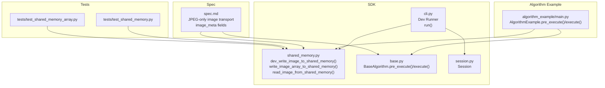
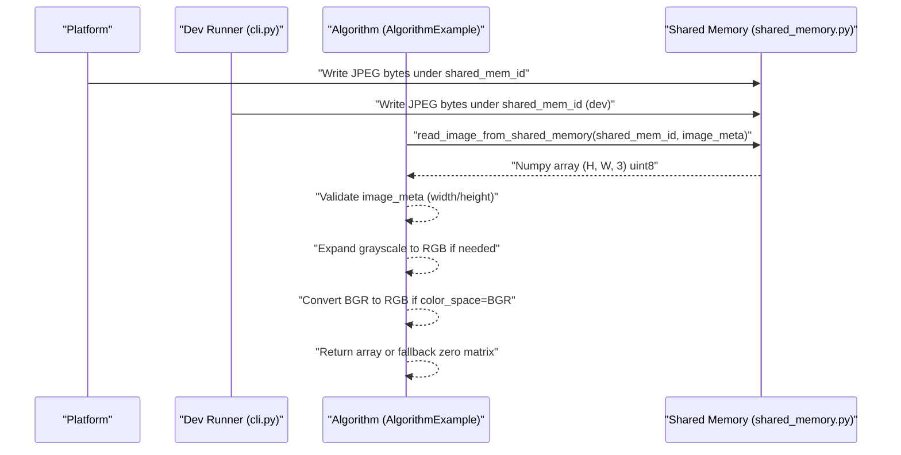
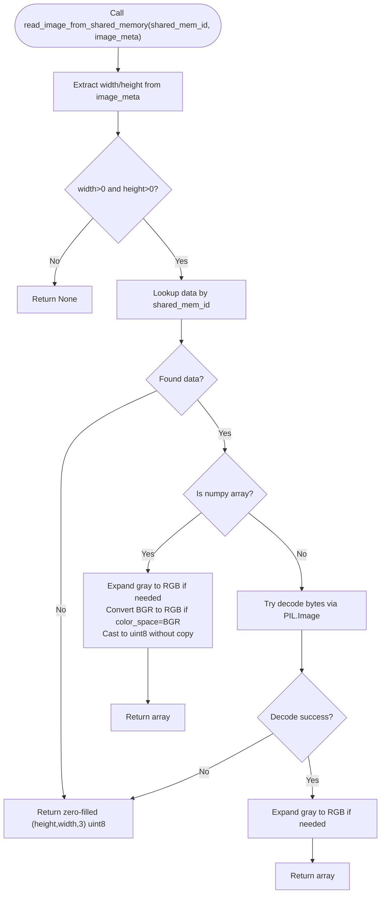
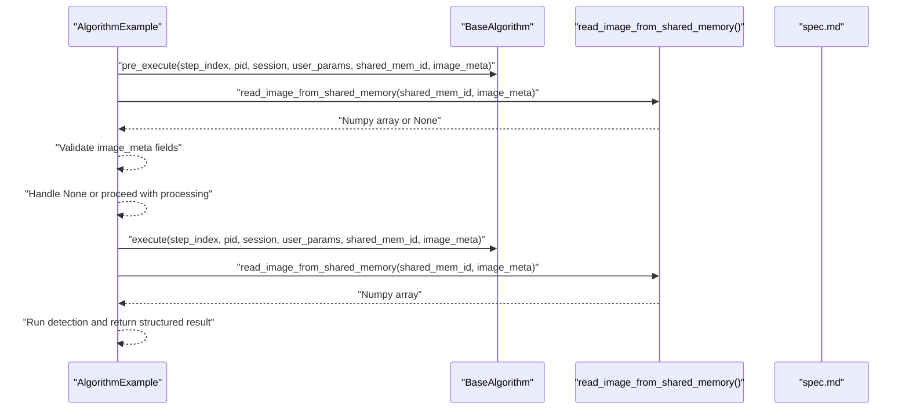
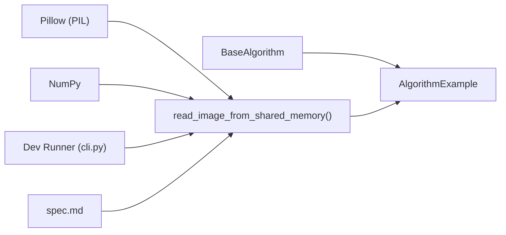

# Data Transfer Mechanism

<cite>
**Referenced Files in This Document**
- [shared_memory.py](file://procvision_algorithm_sdk/shared_memory.py)
- [base.py](file://procvision_algorithm_sdk/base.py)
- [cli.py](file://procvision_algorithm_sdk/cli.py)
- [session.py](file://procvision_algorithm_sdk/session.py)
- [spec.md](file://spec.md)
- [test_shared_memory.py](file://tests/test_shared_memory.py)
- [test_shared_memory_array.py](file://tests/test_shared_memory_array.py)
- [algorithm_example/main.py](file://algorithm-example/algorithm_example/main.py)
- [algorithm_dev_tutorial.md](file://algorithm_dev_tutorial.md)
- [algorithm_dev_quickstart.md](file://algorithm_dev_quickstart.md)
</cite>

## Table of Contents
1. [Introduction](#introduction)
2. [Project Structure](#project-structure)
3. [Core Components](#core-components)
4. [Architecture Overview](#architecture-overview)
5. [Detailed Component Analysis](#detailed-component-analysis)
6. [Dependency Analysis](#dependency-analysis)
7. [Performance Considerations](#performance-considerations)
8. [Troubleshooting Guide](#troubleshooting-guide)
9. [Conclusion](#conclusion)

## Introduction
This document explains the shared memory data transfer mechanism used by the platform to deliver JPEG-encoded image data to algorithms. It covers how the platform writes image bytes into a shared memory segment and passes a shared_mem_id plus image_meta to the algorithm, and how the algorithm retrieves the image using read_image_from_shared_memory(). It also documents validation of image_meta fields, handling of both raw bytes (JPEG) and numpy arrays, color space conversions (BGR to RGB), grayscale to RGB expansion, and robust fallback behavior for invalid or missing data. Finally, it discusses performance implications of zero-copy transfers and memory layout considerations.

## Project Structure
The shared memory mechanism spans several SDK modules and tests:
- Shared memory utilities for development and runtime image retrieval
- Algorithm base interface defining how algorithms receive shared_mem_id and image_meta
- CLI for local simulation and validation
- Session for cross-step state management
- Specification defining JPEG-only image transport and image_meta contract
- Tests validating array and byte-path behavior

**Diagram sources**
- [shared_memory.py](file://procvision_algorithm_sdk/shared_memory.py#L1-L53)
- [base.py](file://procvision_algorithm_sdk/base.py#L1-L58)
- [cli.py](file://procvision_algorithm_sdk/cli.py#L1-L615)
- [session.py](file://procvision_algorithm_sdk/session.py#L1-L36)
- [spec.md](file://spec.md#L1-L799)
- [test_shared_memory.py](file://tests/test_shared_memory.py#L1-L16)
- [test_shared_memory_array.py](file://tests/test_shared_memory_array.py#L1-L39)
- [algorithm_example/main.py](file://algorithm-example/algorithm_example/main.py#L1-L150)

**Section sources**
- [shared_memory.py](file://procvision_algorithm_sdk/shared_memory.py#L1-L53)
- [base.py](file://procvision_algorithm_sdk/base.py#L1-L58)
- [cli.py](file://procvision_algorithm_sdk/cli.py#L1-L615)
- [session.py](file://procvision_algorithm_sdk/session.py#L1-L36)
- [spec.md](file://spec.md#L1-L799)
- [test_shared_memory.py](file://tests/test_shared_memory.py#L1-L16)
- [test_shared_memory_array.py](file://tests/test_shared_memory_array.py#L1-L39)
- [algorithm_example/main.py](file://algorithm-example/algorithm_example/main.py#L1-L150)

## Core Components
- Shared memory utilities:
  - dev_write_image_to_shared_memory(): stores bytes under a shared_mem_id for development/testing
  - write_image_array_to_shared_memory(): stores numpy arrays under a shared_mem_id for development/testing
  - read_image_from_shared_memory(): retrieves image data from shared memory given shared_mem_id and image_meta
- Algorithm base interface:
  - BaseAlgorithm.pre_execute() and BaseAlgorithm.execute() accept shared_mem_id and image_meta
- CLI:
  - Dev Runner writes a local image file into shared memory and invokes algorithm hooks
- Session:
  - Provides lightweight state sharing across steps during a detection session
- Specification:
  - Defines JPEG-only image transport and minimal image_meta fields

Key responsibilities:
- Platform writes JPEG bytes to shared memory and passes shared_mem_id + image_meta to algorithm
- Algorithm calls read_image_from_shared_memory() to obtain a numpy array (H, W, 3) uint8
- Validation of image_meta fields (width, height, timestamp_ms, camera_id) occurs inside read_image_from_shared_memory()
- Robust fallback to zero-filled array when data is missing or decoding fails

**Section sources**
- [shared_memory.py](file://procvision_algorithm_sdk/shared_memory.py#L1-L53)
- [base.py](file://procvision_algorithm_sdk/base.py#L1-L58)
- [cli.py](file://procvision_algorithm_sdk/cli.py#L1-L615)
- [session.py](file://procvision_algorithm_sdk/session.py#L1-L36)
- [spec.md](file://spec.md#L1-L799)

## Architecture Overview
The platform performs JPEG-only image transport via shared memory. The algorithm receives shared_mem_id and image_meta and uses read_image_from_shared_memory() to retrieve the image. The function supports two data sources:
- Raw bytes (JPEG/PNG) decoded into a numpy array
- Numpy arrays directly passed as (H, W, 3) or grayscale (H, W)/(H, W, 1)

**Diagram sources**
- [cli.py](file://procvision_algorithm_sdk/cli.py#L1-L615)
- [shared_memory.py](file://procvision_algorithm_sdk/shared_memory.py#L1-L53)
- [algorithm_example/main.py](file://algorithm-example/algorithm_example/main.py#L1-L150)

## Detailed Component Analysis

### Shared Memory Utilities
The shared memory utilities provide a simple in-memory store keyed by shared_mem_id and a retrieval function with validation and conversion logic.

Behavior highlights:
- image_meta validation: width and height must be positive integers; otherwise return None
- Data source priority:
  - If stored as numpy array:
    - Grayscale (H, W) or single-channel (H, W, 1) expanded to (H, W, 3)
    - If color_space is "BGR", swap channel order to RGB
    - Cast to uint8 without copying
  - Else if stored as bytes:
    - Attempt to decode with PIL; expand grayscale to RGB
    - On failure, fall back to zero-filled array
- Fallback: return a zero-filled (height, width, 3) uint8 array when data is missing or decoding fails

Edge cases covered by tests:
- Non-image bytes with valid dimensions return a zero-filled array
- Gray arrays expand to RGB
- BGR arrays convert to RGB
- RGB arrays pass through unchanged

**Section sources**
- [shared_memory.py](file://procvision_algorithm_sdk/shared_memory.py#L1-L53)
- [test_shared_memory.py](file://tests/test_shared_memory.py#L1-L16)
- [test_shared_memory_array.py](file://tests/test_shared_memory_array.py#L1-L39)

### Algorithm Integration Points
Algorithms receive shared_mem_id and image_meta in BaseAlgorithm.pre_execute() and BaseAlgorithm.execute(), and should call read_image_from_shared_memory() to obtain the image.

Notes:
- The algorithm should validate that image_meta contains width and height and handle None returns gracefully
- The algorithm should not assume color space; rely on read_image_from_shared_memory() to normalize to RGB when applicable

**Diagram sources**
- [base.py](file://procvision_algorithm_sdk/base.py#L1-L58)
- [shared_memory.py](file://procvision_algorithm_sdk/shared_memory.py#L1-L53)
- [spec.md](file://spec.md#L1-L799)
- [algorithm_example/main.py](file://algorithm-example/algorithm_example/main.py#L1-L150)

**Section sources**
- [base.py](file://procvision_algorithm_sdk/base.py#L1-L58)
- [shared_memory.py](file://procvision_algorithm_sdk/shared_memory.py#L1-L53)
- [spec.md](file://spec.md#L1-L799)
- [algorithm_example/main.py](file://algorithm-example/algorithm_example/main.py#L1-L150)

### JPEG-only Transport and image_meta Contract
- The platform writes JPEG-encoded image data into shared memory and passes shared_mem_id + image_meta to the algorithm
- image_meta must include width, height, timestamp_ms, and camera_id; color_space is optional and defaults to RGB
- The specification enforces JPEG-only transport for Phase 01

Validation and usage examples:
- Minimum image_meta fields: width, height, timestamp_ms, camera_id
- Optional color_space: RGB or BGR
- The algorithm should not rely on color_space unless it needs to interpret BGR inputs

**Section sources**
- [spec.md](file://spec.md#L1-L799)
- [algorithm_dev_tutorial.md](file://algorithm_dev_tutorial.md#L103-L127)
- [algorithm_dev_quickstart.md](file://algorithm_dev_quickstart.md#L89-L120)

### Development and Testing Utilities
- Dev Runner writes a local image file into shared memory and simulates a detection step
- Tests demonstrate:
  - Fallback behavior when bytes are not decodable
  - Array path behavior for RGB, grayscale, and BGR inputs

**Section sources**
- [cli.py](file://procvision_algorithm_sdk/cli.py#L1-L615)
- [test_shared_memory.py](file://tests/test_shared_memory.py#L1-L16)
- [test_shared_memory_array.py](file://tests/test_shared_memory_array.py#L1-L39)

## Dependency Analysis
The shared memory mechanism depends on:
- numpy for array creation and manipulation
- Pillow (PIL) for decoding bytes into arrays
- Algorithm base interface for receiving shared_mem_id and image_meta
- CLI for development-time simulation

**Diagram sources**
- [shared_memory.py](file://procvision_algorithm_sdk/shared_memory.py#L1-L53)
- [base.py](file://procvision_algorithm_sdk/base.py#L1-L58)
- [cli.py](file://procvision_algorithm_sdk/cli.py#L1-L615)
- [spec.md](file://spec.md#L1-L799)

**Section sources**
- [shared_memory.py](file://procvision_algorithm_sdk/shared_memory.py#L1-L53)
- [base.py](file://procvision_algorithm_sdk/base.py#L1-L58)
- [cli.py](file://procvision_algorithm_sdk/cli.py#L1-L615)
- [spec.md](file://spec.md#L1-L799)

## Performance Considerations
- Zero-copy transfer:
  - When the platform passes a numpy array directly, read_image_from_shared_memory() returns a uint8 view without copying the underlying buffer, minimizing CPU and memory overhead
  - When bytes are decoded, a new numpy array is created; however, the function still returns a contiguous uint8 array suitable for immediate processing
- Memory layout:
  - Output is guaranteed to be (H, W, 3) uint8 RGB
  - Grayscale inputs are expanded to 3 channels; BGR inputs are converted to RGB
- Fallback cost:
  - Returning a zero-filled array is inexpensive and avoids expensive re-decoding attempts
- Practical tips:
  - Prefer passing numpy arrays from the platform when possible to leverage zero-copy
  - Avoid unnecessary copies in algorithm code; operate directly on the returned array
  - Validate image_meta early to short-circuit invalid requests

[No sources needed since this section provides general guidance]

## Troubleshooting Guide
Common issues and resolutions:
- Invalid image_meta:
  - If width or height are non-positive, read_image_from_shared_memory() returns None; algorithms should handle None gracefully
- Missing data:
  - If shared_mem_id is not found or decoding fails, the function returns a zero-filled (height, width, 3) uint8 array
- Non-image bytes:
  - When bytes cannot be decoded, the function falls back to a zero-filled array
- Color space confusion:
  - If the platform supplies BGR data, set color_space="BGR" in image_meta so the function converts to RGB
- JPEG-only constraint:
  - Ensure the platform writes JPEG bytes; PNG is also supported via decoding, but the spec mandates JPEG for Phase 01

Validation references:
- Tests confirm fallback behavior for non-image bytes and array conversions for grayscale and BGR inputs
- Quickstart and tutorial documents enumerate supported data sources and behaviors

**Section sources**
- [shared_memory.py](file://procvision_algorithm_sdk/shared_memory.py#L1-L53)
- [test_shared_memory.py](file://tests/test_shared_memory.py#L1-L16)
- [test_shared_memory_array.py](file://tests/test_shared_memory_array.py#L1-L39)
- [algorithm_dev_tutorial.md](file://algorithm_dev_tutorial.md#L103-L127)
- [algorithm_dev_quickstart.md](file://algorithm_dev_quickstart.md#L89-L120)

## Conclusion
The shared memory data transfer mechanism provides a standardized, efficient way for the platform to deliver JPEG-encoded images to algorithms. By validating image_meta fields, supporting both raw bytes and numpy arrays, and performing automatic color space and shape normalization, read_image_from_shared_memory() enables robust, zero-copy image retrieval. Algorithms should validate inputs, handle None returns, and rely on the function to normalize data into a consistent (H, W, 3) uint8 RGB format ready for downstream processing.