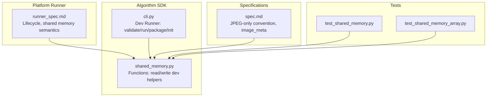
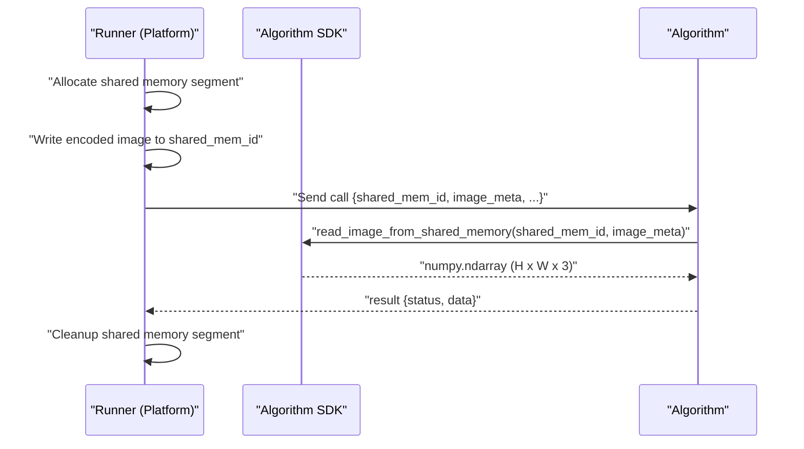
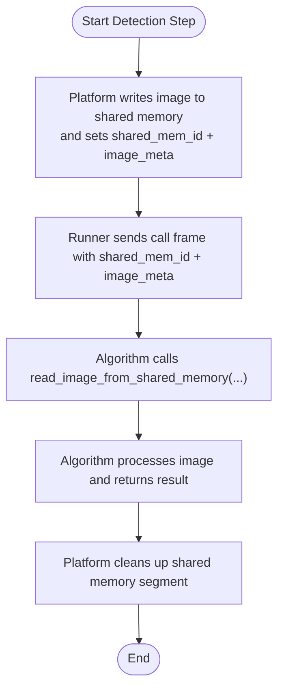
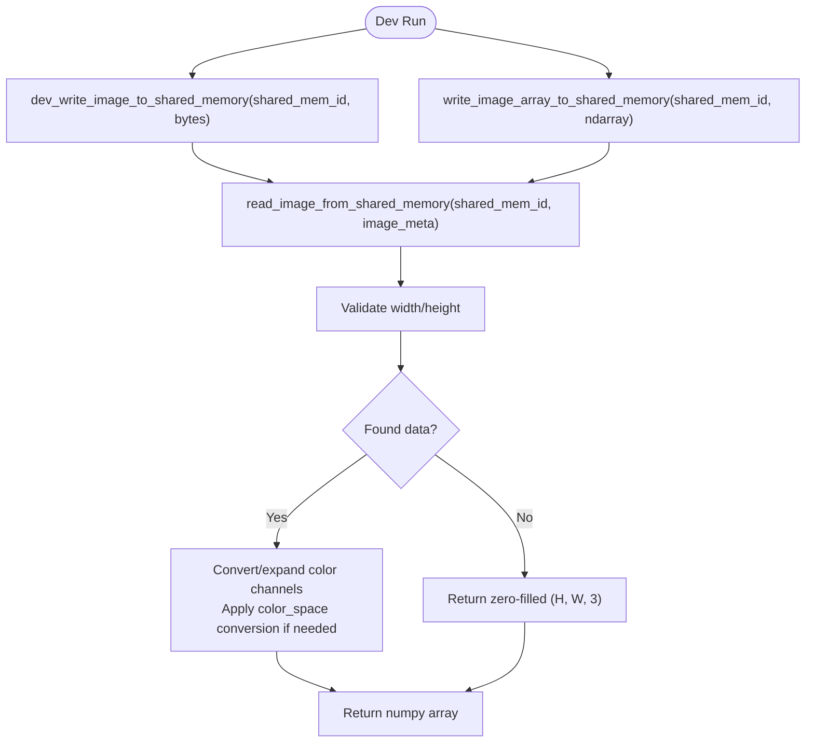
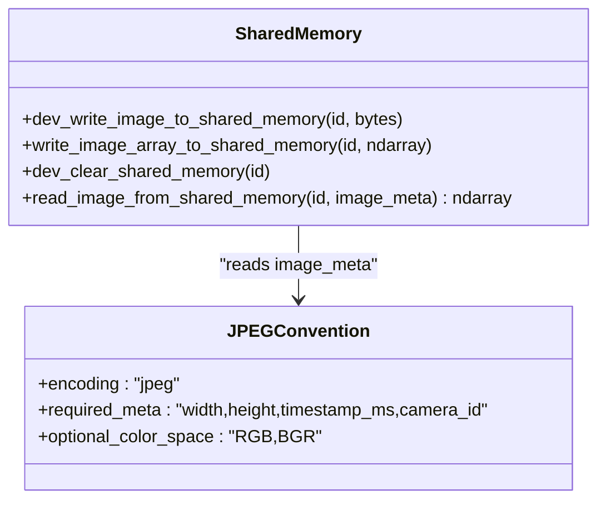
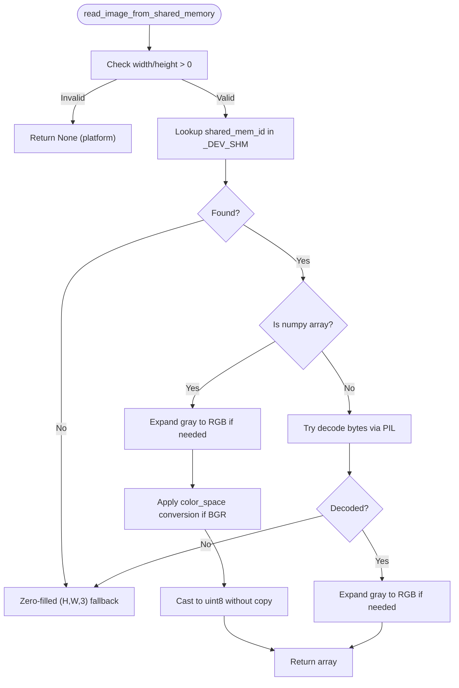
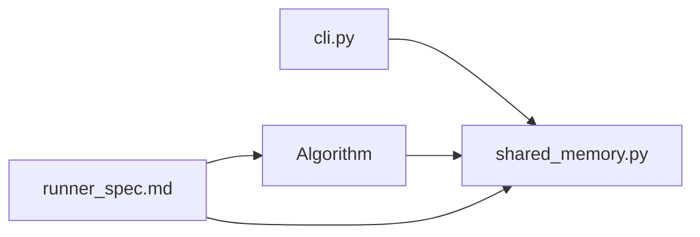

# Memory Lifecycle and Ownership

<cite>
**Referenced Files in This Document**
- [shared_memory.py](file://procvision_algorithm_sdk/shared_memory.py)
- [runner_spec.md](file://runner_spec.md)
- [spec.md](file://spec.md)
- [cli.py](file://procvision_algorithm_sdk/cli.py)
- [test_shared_memory.py](file://tests/test_shared_memory.py)
- [test_shared_memory_array.py](file://tests/test_shared_memory_array.py)
- [algorithm_dev_tutorial.md](file://algorithm_dev_tutorial.md)
</cite>

## Table of Contents
1. [Introduction](#introduction)
2. [Project Structure](#project-structure)
3. [Core Components](#core-components)
4. [Architecture Overview](#architecture-overview)
5. [Detailed Component Analysis](#detailed-component-analysis)
6. [Dependency Analysis](#dependency-analysis)
7. [Performance Considerations](#performance-considerations)
8. [Troubleshooting Guide](#troubleshooting-guide)
9. [Conclusion](#conclusion)
10. [Appendices](#appendices)

## Introduction
This document explains the shared memory lifecycle and ownership model for the algorithm SDK. It clarifies that platform-side Runner allocates and writes to shared memory, while algorithms read images and do not manage cleanup. It also documents the development-time _DEV_SHM dictionary, JPEG-only convention, race conditions and consistency guarantees, error handling for missing or corrupted segments, and best practices for safe and efficient memory access.

## Project Structure
The shared memory lifecycle is centered around the SDK’s shared memory utilities and the Runner specification. The development workflow uses a local dictionary (_DEV_SHM) to simulate platform-provided shared memory during local testing.

**Diagram sources**
- [shared_memory.py](file://procvision_algorithm_sdk/shared_memory.py#L1-L52)
- [runner_spec.md](file://runner_spec.md#L1-L200)
- [spec.md](file://spec.md#L1-L200)
- [cli.py](file://procvision_algorithm_sdk/cli.py#L1-L200)
- [test_shared_memory.py](file://tests/test_shared_memory.py#L1-L16)
- [test_shared_memory_array.py](file://tests/test_shared_memory_array.py#L1-L39)

**Section sources**
- [shared_memory.py](file://procvision_algorithm_sdk/shared_memory.py#L1-L52)
- [runner_spec.md](file://runner_spec.md#L1-L200)
- [spec.md](file://spec.md#L1-L200)
- [cli.py](file://procvision_algorithm_sdk/cli.py#L1-L200)
- [test_shared_memory.py](file://tests/test_shared_memory.py#L1-L16)
- [test_shared_memory_array.py](file://tests/test_shared_memory_array.py#L1-L39)

## Core Components
- Shared memory read/write utilities:
  - Platform-side: Runner writes encoded images to shared memory and injects shared_mem_id and image_meta.
  - Algorithm-side: read_image_from_shared_memory consumes shared_mem_id and image_meta to produce a numpy array.
- Development-time helpers:
  - _DEV_SHM dictionary stores test data keyed by shared_mem_id.
  - dev_write_image_to_shared_memory and write_image_array_to_shared_memory populate _DEV_SHM.
  - dev_clear_shared_memory removes entries from _DEV_SHM.
- JPEG-only convention:
  - Platform encodes images as JPEG; SDK expects width/height/timestamp_ms/camera_id plus optional color_space.
- Ownership and cleanup:
  - Platform allocates and writes; algorithm reads and does not manage cleanup.
  - After algorithm processing completes, platform performs cleanup.

**Section sources**
- [shared_memory.py](file://procvision_algorithm_sdk/shared_memory.py#L1-L52)
- [runner_spec.md](file://runner_spec.md#L1-L200)
- [spec.md](file://spec.md#L1-L200)

## Architecture Overview
The platform and algorithm communicate over stdin/stdout. During a detection step, the Runner:
- Allocates and writes the image to shared memory.
- Injects shared_mem_id and image_meta into the call payload.
- The algorithm reads the image via SDK and returns results.

**Diagram sources**
- [runner_spec.md](file://runner_spec.md#L1-L200)
- [shared_memory.py](file://procvision_algorithm_sdk/shared_memory.py#L1-L52)

**Section sources**
- [runner_spec.md](file://runner_spec.md#L1-L200)
- [shared_memory.py](file://procvision_algorithm_sdk/shared_memory.py#L1-L52)

## Detailed Component Analysis

### Shared Memory Utilities and Ownership Model
- Platform responsibilities:
  - Allocate and write image data to shared memory.
  - Generate shared_mem_id and inject minimal image_meta (width, height, timestamp_ms, camera_id).
  - Cleanup shared memory after algorithm processing completes.
- Algorithm responsibilities:
  - Read image via read_image_from_shared_memory using shared_mem_id and image_meta.
  - Do not allocate, write, or free shared memory.
  - Return results; platform handles resource cleanup.

**Diagram sources**
- [runner_spec.md](file://runner_spec.md#L1-L200)
- [shared_memory.py](file://procvision_algorithm_sdk/shared_memory.py#L1-L52)

**Section sources**
- [runner_spec.md](file://runner_spec.md#L1-L200)
- [shared_memory.py](file://procvision_algorithm_sdk/shared_memory.py#L1-L52)

### Development-Time _DEV_SHM Dictionary
- Purpose: Simulate platform shared memory during local development and testing.
- Behavior:
  - dev_write_image_to_shared_memory stores bytes under shared_mem_id.
  - write_image_array_to_shared_memory stores numpy arrays under shared_mem_id.
  - dev_clear_shared_memory removes entries.
  - read_image_from_shared_memory:
    - Validates width/height from image_meta.
    - Returns a numpy array shaped (H, W, 3) with color conversions and expansions as needed.
    - Falls back to zero-filled array if data is missing or decoding fails.

**Diagram sources**
- [shared_memory.py](file://procvision_algorithm_sdk/shared_memory.py#L1-L52)
- [test_shared_memory.py](file://tests/test_shared_memory.py#L1-L16)
- [test_shared_memory_array.py](file://tests/test_shared_memory_array.py#L1-L39)

**Section sources**
- [shared_memory.py](file://procvision_algorithm_sdk/shared_memory.py#L1-L52)
- [test_shared_memory.py](file://tests/test_shared_memory.py#L1-L16)
- [test_shared_memory_array.py](file://tests/test_shared_memory_array.py#L1-L39)
- [algorithm_dev_tutorial.md](file://algorithm_dev_tutorial.md#L103-L127)

### JPEG-Only Convention and image_meta
- Platform encodes images as JPEG and writes to shared memory.
- Minimal image_meta required: width, height, timestamp_ms, camera_id.
- Optional color_space: RGB or BGR. When BGR is specified, the SDK converts to RGB.
- Gray-to-RGB expansion is supported for grayscale arrays.

**Diagram sources**
- [spec.md](file://spec.md#L1-L200)
- [shared_memory.py](file://procvision_algorithm_sdk/shared_memory.py#L1-L52)

**Section sources**
- [spec.md](file://spec.md#L1-L200)
- [shared_memory.py](file://procvision_algorithm_sdk/shared_memory.py#L1-L52)

### Race Conditions and Data Consistency
- Shared memory segments are keyed by shared_mem_id. The platform controls allocation and cleanup timing.
- Algorithms must read within the window where the platform has written and before cleanup occurs.
- The development _DEV_SHM dictionary is a simple in-memory mapping keyed by shared_mem_id. It is not thread-safe and should not be used concurrently by multiple threads in production.
- Best practice:
  - Use the platform’s shared memory segments for production.
  - In development, ensure only one algorithm process reads a given shared_mem_id at a time.
  - Avoid relying on _DEV_SHM for concurrency guarantees.

**Section sources**
- [runner_spec.md](file://runner_spec.md#L1-L200)
- [shared_memory.py](file://procvision_algorithm_sdk/shared_memory.py#L1-L52)

### Error Handling: Missing or Corrupted Segments
- If image_meta lacks valid width/height, read_image_from_shared_memory returns None (platform-side) or falls back to a zero-filled array (development-side).
- If the shared memory segment is missing or decoding fails, development mode returns a zero-filled array sized by image_meta.
- Algorithms should check for None or unexpected shapes and return appropriate error responses with standardized error codes.

**Diagram sources**
- [shared_memory.py](file://procvision_algorithm_sdk/shared_memory.py#L1-L52)
- [test_shared_memory.py](file://tests/test_shared_memory.py#L1-L16)
- [test_shared_memory_array.py](file://tests/test_shared_memory_array.py#L1-L39)

**Section sources**
- [shared_memory.py](file://procvision_algorithm_sdk/shared_memory.py#L1-L52)
- [test_shared_memory.py](file://tests/test_shared_memory.py#L1-L16)
- [test_shared_memory_array.py](file://tests/test_shared_memory_array.py#L1-L39)

### Best Practices for Algorithms
- Always pass the exact image_meta provided by the platform to read_image_from_shared_memory.
- Validate image_meta fields before reading.
- Treat None or zero-filled arrays as error conditions and return ERROR with a descriptive message and error_code.
- Do not assume color_space; rely on image_meta to determine conversion needs.
- Avoid long-lived allocations in the algorithm; rely on platform cleanup of shared memory segments.
- For development, use the Dev Runner to populate _DEV_SHM and test robustness against missing/corrupted data.

**Section sources**
- [cli.py](file://procvision_algorithm_sdk/cli.py#L1-L200)
- [algorithm_dev_tutorial.md](file://algorithm_dev_tutorial.md#L103-L127)
- [shared_memory.py](file://procvision_algorithm_sdk/shared_memory.py#L1-L52)

## Dependency Analysis
- The algorithm depends on shared_memory.read_image_from_shared_memory for image access.
- The Dev Runner uses dev_write_image_to_shared_memory to populate _DEV_SHM for local testing.
- Runner responsibilities (allocation, cleanup) are defined in runner_spec.md and enforced by the platform.

**Diagram sources**
- [cli.py](file://procvision_algorithm_sdk/cli.py#L1-L200)
- [shared_memory.py](file://procvision_algorithm_sdk/shared_memory.py#L1-L52)
- [runner_spec.md](file://runner_spec.md#L1-L200)

**Section sources**
- [cli.py](file://procvision_algorithm_sdk/cli.py#L1-L200)
- [shared_memory.py](file://procvision_algorithm_sdk/shared_memory.py#L1-L52)
- [runner_spec.md](file://runner_spec.md#L1-L200)

## Performance Considerations
- Prefer JPEG encoding for compactness and fast transfer.
- Avoid unnecessary copies; read_image_from_shared_memory returns a view when possible (copy=False).
- Keep image_meta minimal; only include width, height, timestamp_ms, camera_id.
- In development, avoid large images to reduce memory pressure in _DEV_SHM.

[No sources needed since this section provides general guidance]

## Troubleshooting Guide
Common issues and resolutions:
- Missing shared_mem_id or wrong id:
  - Symptom: None returned or zero-filled array.
  - Action: Verify Runner injection and algorithm usage.
- Invalid image_meta (non-positive width/height):
  - Symptom: None returned (platform) or fallback to zeros (development).
  - Action: Ensure platform supplies correct width/height.
- Corrupted or unsupported image bytes:
  - Symptom: Decoding failure leads to fallback to zeros.
  - Action: Validate platform encoding pipeline; confirm JPEG-only convention.
- Unexpected color_space:
  - Symptom: Channel order mismatch.
  - Action: Set color_space in image_meta to match platform expectations.

**Section sources**
- [shared_memory.py](file://procvision_algorithm_sdk/shared_memory.py#L1-L52)
- [test_shared_memory.py](file://tests/test_shared_memory.py#L1-L16)
- [test_shared_memory_array.py](file://tests/test_shared_memory_array.py#L1-L39)
- [spec.md](file://spec.md#L1-L200)

## Conclusion
The shared memory lifecycle is strictly owned by the platform: it allocates, writes, and cleans up. Algorithms read via SDK functions and must handle missing or corrupted segments gracefully. The _DEV_SHM dictionary is for development and testing only. The JPEG-only convention and minimal image_meta simplify integration and ensure consistent behavior across environments.

[No sources needed since this section summarizes without analyzing specific files]

## Appendices
- Development workflow:
  - Use Dev Runner to populate _DEV_SHM and validate algorithm behavior.
  - Confirm zero-fallback behavior and color conversions.

**Section sources**
- [cli.py](file://procvision_algorithm_sdk/cli.py#L1-L200)
- [algorithm_dev_tutorial.md](file://algorithm_dev_tutorial.md#L103-L127)