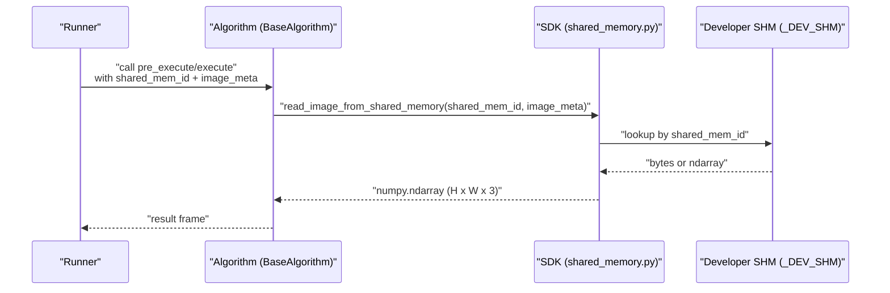
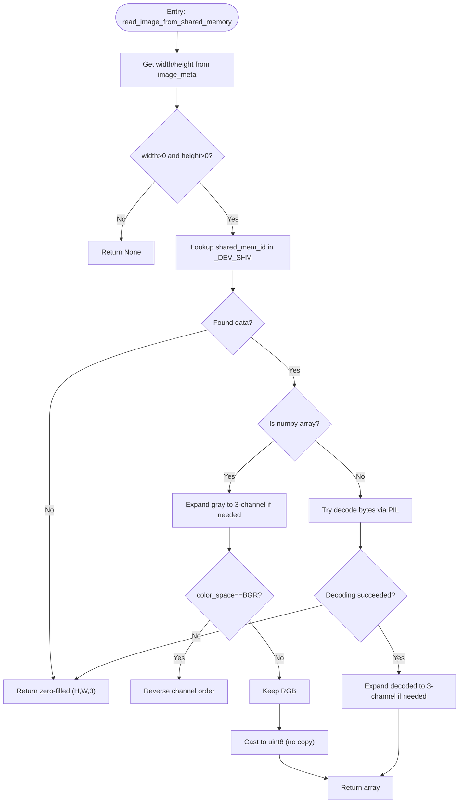
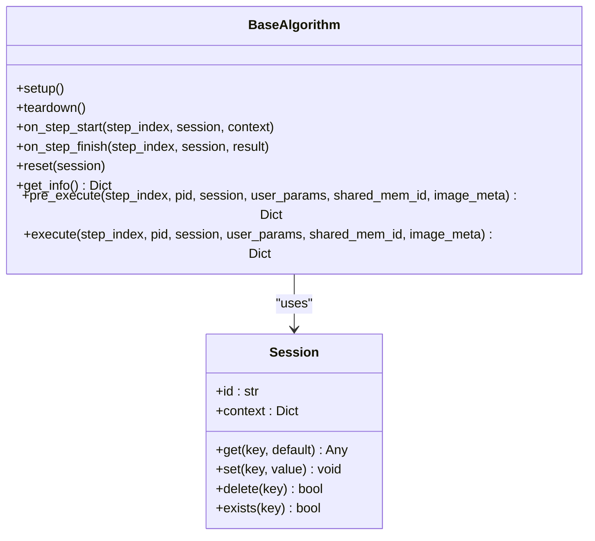
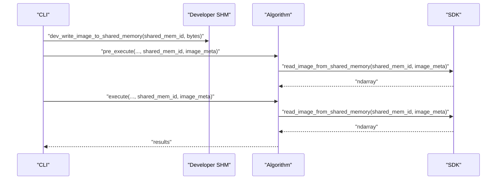
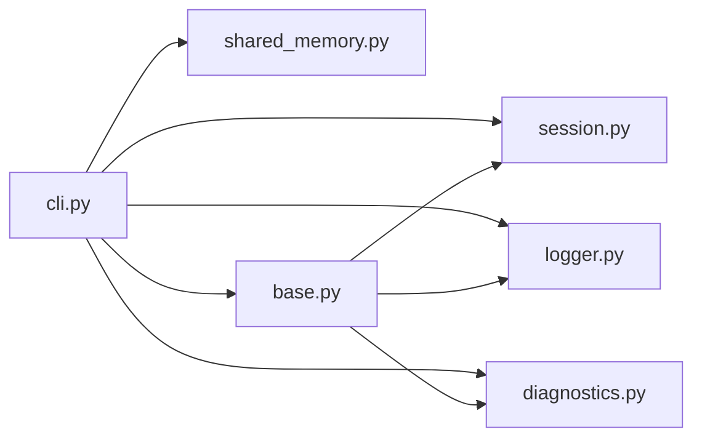

# Performance and Security Considerations

<cite>
**Referenced Files in This Document**
- [shared_memory.py](file://procvision_algorithm_sdk/shared_memory.py)
- [base.py](file://procvision_algorithm_sdk/base.py)
- [session.py](file://procvision_algorithm_sdk/session.py)
- [cli.py](file://procvision_algorithm_sdk/cli.py)
- [logger.py](file://procvision_algorithm_sdk/logger.py)
- [diagnostics.py](file://procvision_algorithm_sdk/diagnostics.py)
- [spec.md](file://spec.md)
- [runner_spec.md](file://runner_spec.md)
- [test_shared_memory.py](file://tests/test_shared_memory.py)
- [test_shared_memory_array.py](file://tests/test_shared_memory_array.py)
</cite>

## Table of Contents
1. [Introduction](#introduction)
2. [Project Structure](#project-structure)
3. [Core Components](#core-components)
4. [Architecture Overview](#architecture-overview)
5. [Detailed Component Analysis](#detailed-component-analysis)
6. [Dependency Analysis](#dependency-analysis)
7. [Performance Considerations](#performance-considerations)
8. [Security Considerations](#security-considerations)
9. [Troubleshooting Guide](#troubleshooting-guide)
10. [Conclusion](#conclusion)
11. [Appendices](#appendices)

## Introduction
This document focuses on performance and security considerations for shared memory integration in the algorithm SDK. It analyzes the zero-copy image transfer benefits over file-based or network-based alternatives, quantifies I/O and memory usage reductions, and explains the impact on algorithm execution latency and throughput. It also addresses isolation, access control, and protection against unauthorized access, and outlines strategies to prevent memory leaks and handle edge cases such as orphaned segments. Finally, it provides optimization tips for algorithms to maximize performance while maintaining security and stability, and references the specification documents for Base64 encoding constraints and resource limits.

## Project Structure
The SDK exposes a minimal, efficient interface for reading images from shared memory and integrates with lifecycle hooks and session state management. The CLI provides a development runner that simulates the platform’s shared memory behavior locally.

```mermaid
graph TB
subgraph "SDK"
SM["shared_memory.py<br/>read/write shared memory"]
BASE["base.py<br/>BaseAlgorithm interface"]
SES["session.py<br/>Session state store"]
LOG["logger.py<br/>Structured logging"]
DIAG["diagnostics.py<br/>Diagnostic collector"]
end
subgraph "Runner"
RSPEC["runner_spec.md<br/>Runner protocol & limits"]
SPEC["spec.md<br/>SDK spec & constraints"]
end
subgraph "CLI"
CLI["cli.py<br/>Dev Runner & validation"]
TESTSM["tests/test_shared_memory*.py<br/>Shared memory tests"]
end
CLI --> SM
CLI --> BASE
CLI --> SES
CLI --> LOG
CLI --> DIAG
CLI --> SPEC
CLI --> RSPEC
TESTSM --> SM
```

**Diagram sources**
- [shared_memory.py](file://procvision_algorithm_sdk/shared_memory.py#L1-L52)
- [base.py](file://procvision_algorithm_sdk/base.py#L1-L57)
- [session.py](file://procvision_algorithm_sdk/session.py#L1-L35)
- [logger.py](file://procvision_algorithm_sdk/logger.py#L1-L23)
- [diagnostics.py](file://procvision_algorithm_sdk/diagnostics.py#L1-L11)
- [cli.py](file://procvision_algorithm_sdk/cli.py#L1-L614)
- [spec.md](file://spec.md#L1-L2102)
- [runner_spec.md](file://runner_spec.md#L1-L282)
- [test_shared_memory.py](file://tests/test_shared_memory.py#L1-L15)
- [test_shared_memory_array.py](file://tests/test_shared_memory_array.py#L1-L38)

**Section sources**
- [shared_memory.py](file://procvision_algorithm_sdk/shared_memory.py#L1-L52)
- [cli.py](file://procvision_algorithm_sdk/cli.py#L1-L614)
- [spec.md](file://spec.md#L1-L2102)
- [runner_spec.md](file://runner_spec.md#L1-L282)

## Core Components
- Shared memory read/write utilities:
  - Write image bytes or arrays into a developer-mode shared memory dictionary keyed by a shared memory ID.
  - Read image data from shared memory, with robust fallback to a zero-filled array when metadata or data is invalid.
- Algorithm lifecycle and session:
  - BaseAlgorithm defines pre_execute and execute hooks, plus lifecycle callbacks (setup, teardown, on_step_start, on_step_finish, reset).
  - Session provides a lightweight, JSON-serializable state store for cross-step sharing during a single detection flow.
- Logging and diagnostics:
  - StructuredLogger writes structured records to stderr.
  - Diagnostics collects key-value metrics for reporting.

Key implementation references:
- [read_image_from_shared_memory](file://procvision_algorithm_sdk/shared_memory.py#L20-L52)
- [write_image_array_to_shared_memory](file://procvision_algorithm_sdk/shared_memory.py#L15-L17)
- [dev_write_image_to_shared_memory](file://procvision_algorithm_sdk/shared_memory.py#L6-L10)
- [Session API](file://procvision_algorithm_sdk/session.py#L1-L35)
- [BaseAlgorithm hooks](file://procvision_algorithm_sdk/base.py#L1-L57)
- [StructuredLogger](file://procvision_algorithm_sdk/logger.py#L1-L23)
- [Diagnostics](file://procvision_algorithm_sdk/diagnostics.py#L1-L11)

**Section sources**
- [shared_memory.py](file://procvision_algorithm_sdk/shared_memory.py#L1-L52)
- [session.py](file://procvision_algorithm_sdk/session.py#L1-L35)
- [base.py](file://procvision_algorithm_sdk/base.py#L1-L57)
- [logger.py](file://procvision_algorithm_sdk/logger.py#L1-L23)
- [diagnostics.py](file://procvision_algorithm_sdk/diagnostics.py#L1-L11)

## Architecture Overview
The platform-side runner injects a shared memory ID and minimal image metadata into each algorithm call. The algorithm reads the image from shared memory using the SDK’s read function, avoiding file I/O or network transfer. The CLI’s Dev Runner mimics this behavior locally by writing image bytes into the same developer shared memory dictionary.



**Diagram sources**
- [cli.py](file://procvision_algorithm_sdk/cli.py#L162-L190)
- [shared_memory.py](file://procvision_algorithm_sdk/shared_memory.py#L1-L52)
- [spec.md](file://spec.md#L1-L2102)

**Section sources**
- [cli.py](file://procvision_algorithm_sdk/cli.py#L162-L190)
- [shared_memory.py](file://procvision_algorithm_sdk/shared_memory.py#L1-L52)
- [spec.md](file://spec.md#L1-L2102)

## Detailed Component Analysis

### Shared Memory Read Pipeline
The read pipeline validates image metadata, retrieves data from the developer shared memory dictionary, and converts it to a standardized NumPy array. It supports:
- NumPy arrays (H x W x 3 or grayscale variants)
- JPEG/PNG bytes via PIL decoding
- Color space conversion (BGR to RGB)
- Robust fallback to a zero-filled array when metadata or data is invalid



**Diagram sources**
- [shared_memory.py](file://procvision_algorithm_sdk/shared_memory.py#L20-L52)

**Section sources**
- [shared_memory.py](file://procvision_algorithm_sdk/shared_memory.py#L1-L52)
- [test_shared_memory.py](file://tests/test_shared_memory.py#L1-L15)
- [test_shared_memory_array.py](file://tests/test_shared_memory_array.py#L1-L38)

### Algorithm Lifecycle and Session State
The BaseAlgorithm interface defines lifecycle hooks that enable resource initialization, per-step timing, and cleanup. Session provides a JSON-serializable state store scoped to a single detection flow.



**Diagram sources**
- [base.py](file://procvision_algorithm_sdk/base.py#L1-L57)
- [session.py](file://procvision_algorithm_sdk/session.py#L1-L35)

**Section sources**
- [base.py](file://procvision_algorithm_sdk/base.py#L1-L57)
- [session.py](file://procvision_algorithm_sdk/session.py#L1-L35)

### CLI Dev Runner and Local Shared Memory Behavior
The CLI’s run command writes local image bytes into the developer shared memory and constructs image metadata, then invokes pre_execute and execute. This mirrors the platform’s shared memory injection.



**Diagram sources**
- [cli.py](file://procvision_algorithm_sdk/cli.py#L162-L190)
- [shared_memory.py](file://procvision_algorithm_sdk/shared_memory.py#L1-L52)

**Section sources**
- [cli.py](file://procvision_algorithm_sdk/cli.py#L162-L190)
- [shared_memory.py](file://procvision_algorithm_sdk/shared_memory.py#L1-L52)

## Dependency Analysis
- The CLI depends on shared memory utilities to simulate platform behavior.
- The algorithm relies on shared memory for image input and on session for cross-step state.
- Logger and diagnostics are used for observability and performance monitoring.



**Diagram sources**
- [cli.py](file://procvision_algorithm_sdk/cli.py#L1-L614)
- [shared_memory.py](file://procvision_algorithm_sdk/shared_memory.py#L1-L52)
- [base.py](file://procvision_algorithm_sdk/base.py#L1-L57)
- [session.py](file://procvision_algorithm_sdk/session.py#L1-L35)
- [logger.py](file://procvision_algorithm_sdk/logger.py#L1-L23)
- [diagnostics.py](file://procvision_algorithm_sdk/diagnostics.py#L1-L11)

**Section sources**
- [cli.py](file://procvision_algorithm_sdk/cli.py#L1-L614)
- [shared_memory.py](file://procvision_algorithm_sdk/shared_memory.py#L1-L52)
- [base.py](file://procvision_algorithm_sdk/base.py#L1-L57)
- [session.py](file://procvision_algorithm_sdk/session.py#L1-L35)
- [logger.py](file://procvision_algorithm_sdk/logger.py#L1-L23)
- [diagnostics.py](file://procvision_algorithm_sdk/diagnostics.py#L1-L11)

## Performance Considerations

### Zero-Copy Image Transfer Benefits
- Eliminates file I/O overhead:
  - No disk writes/reads for temporary files.
  - No filesystem synchronization costs.
- Reduces memory copies:
  - The read function casts to uint8 without copying when possible, minimizing allocations and copies.
  - Arrays are expanded and color-space corrected in-place where feasible.
- Lower latency and higher throughput:
  - Shared memory avoids network round-trips and serialization overhead.
  - The algorithm receives a ready-to-use NumPy array, reducing preprocessing time.

Evidence in code:
- [read_image_from_shared_memory](file://procvision_algorithm_sdk/shared_memory.py#L20-L52) performs shape expansion and color conversion efficiently and returns a cast array without unnecessary copies.

**Section sources**
- [shared_memory.py](file://procvision_algorithm_sdk/shared_memory.py#L20-L52)

### I/O Overhead Reduction
- Compared to file-based approaches:
  - No temporary file creation, disk buffering, or fsync operations.
- Compared to network-based approaches:
  - No TCP/UDP framing, encryption/decryption, or protocol overhead.

### Memory Usage Reduction
- Developer shared memory stores raw bytes or arrays in-process.
- The fallback path returns a zero-filled array sized to the requested resolution, preventing uninitialized memory access while keeping allocations predictable.

**Section sources**
- [shared_memory.py](file://procvision_algorithm_sdk/shared_memory.py#L45-L52)

### Impact on Algorithm Execution Latency and Throughput
- Latency:
  - Reduced end-to-end latency due to elimination of file/network I/O and base64 decoding.
  - The read function validates metadata quickly and falls back deterministically.
- Throughput:
  - Higher sustained frames per second when the algorithm can process images directly from shared memory.
  - Minimizing intermediate conversions (e.g., avoiding base64) improves overall throughput.

### Optimization Tips for Algorithms
- Pre-load heavy resources in setup and reuse across steps to minimize warm-up costs.
- Use contiguous NumPy arrays and avoid repeated reshaping or transposing.
- Prefer vectorized operations and avoid Python loops on large arrays.
- Keep session state small and JSON-serializable to avoid serialization overhead.
- Publish diagnostic metrics via Diagnostics to monitor latency and resource usage.

**Section sources**
- [base.py](file://procvision_algorithm_sdk/base.py#L1-L57)
- [session.py](file://procvision_algorithm_sdk/session.py#L1-L35)
- [diagnostics.py](file://procvision_algorithm_sdk/diagnostics.py#L1-L11)

## Security Considerations

### Isolation Between Processes
- The Runner manages algorithm processes separately from the host, providing process isolation.
- The CLI’s Dev Runner runs in-process for development; production uses separate processes managed by the Runner.

References:
- [runner_spec.md](file://runner_spec.md#L1-L282) describes process management and runtime boundaries.

**Section sources**
- [runner_spec.md](file://runner_spec.md#L1-L282)

### Access Control to Shared Memory Segments
- The SDK’s developer shared memory is a simple in-memory dictionary keyed by shared memory IDs. Access control is implicit because:
  - Only the algorithm instance and the Dev Runner share the same process.
  - In production, the Runner injects the shared memory ID and metadata; the algorithm does not manage segment creation or permissions.
- For production-grade shared memory, the Runner would enforce access control at the OS level (e.g., POSIX shared memory or Windows shared memory with appropriate permissions). This is outside the SDK but aligned with the Runner’s responsibilities.

References:
- [runner_spec.md](file://runner_spec.md#L1-L282) specifies shared memory backend and metadata injection.

**Section sources**
- [runner_spec.md](file://runner_spec.md#L1-L282)

### Protection Against Unauthorized Access
- The algorithm must not rely on external file paths or network endpoints; it reads only via the SDK’s shared memory API.
- The Runner enforces protocol boundaries and does not expose secrets to the algorithm.

References:
- [runner_spec.md](file://runner_spec.md#L1-L282) and [spec.md](file://spec.md#L1-L2102) define protocol and constraints.

**Section sources**
- [runner_spec.md](file://runner_spec.md#L1-L282)
- [spec.md](file://spec.md#L1-L2102)

### Preventing Memory Leaks
- Developer shared memory dictionary:
  - The developer write function stores bytes or arrays under the shared memory ID.
  - The developer clear function removes entries by ID.
  - Tests demonstrate clearing behavior: [dev_clear_shared_memory](file://procvision_algorithm_sdk/shared_memory.py#L10-L12) and [test_shared_memory.py](file://tests/test_shared_memory.py#L1-L15).
- Production shared memory:
  - The Runner manages lifecycle and should clean up segments upon process termination or session completion.
  - The algorithm should not retain references to shared memory buffers beyond the current step.

References:
- [shared_memory.py](file://procvision_algorithm_sdk/shared_memory.py#L1-L52)
- [runner_spec.md](file://runner_spec.md#L1-L282)

**Section sources**
- [shared_memory.py](file://procvision_algorithm_sdk/shared_memory.py#L1-L52)
- [runner_spec.md](file://runner_spec.md#L1-L282)
- [test_shared_memory.py](file://tests/test_shared_memory.py#L1-L15)

### Handling Edge Cases: Orphaned Segments
- Orphaned segments occur when a process exits unexpectedly without releasing shared memory.
- Mitigations:
  - Use short-lived sessions and deterministic teardown.
  - In development, explicitly clear shared memory entries after testing.
  - In production, rely on Runner-managed lifecycle and OS-level cleanup policies.

References:
- [runner_spec.md](file://runner_spec.md#L1-L282) and [session.py](file://procvision_algorithm_sdk/session.py#L1-L35) define session lifecycle and cleanup responsibilities.

**Section sources**
- [runner_spec.md](file://runner_spec.md#L1-L282)
- [session.py](file://procvision_algorithm_sdk/session.py#L1-L35)

## Troubleshooting Guide

Common issues and resolutions:
- Invalid image metadata:
  - If width or height is non-positive, the read function returns None. Ensure image_meta is populated correctly.
  - Reference: [read_image_from_shared_memory](file://procvision_algorithm_sdk/shared_memory.py#L20-L28)
- Decoding failures:
  - If bytes cannot be decoded, the function falls back to a zero-filled array sized to the requested resolution.
  - Reference: [read_image_from_shared_memory](file://procvision_algorithm_sdk/shared_memory.py#L45-L52)
- Session value serialization:
  - Values stored in Session must be JSON serializable; otherwise, a TypeError is raised.
  - Reference: [Session.set](file://procvision_algorithm_sdk/session.py#L14-L23)
- Base64 encoding constraint:
  - The spec prohibits Base64 encoding in JSON for image payloads; use shared memory instead.
  - Reference: [spec.md](file://spec.md#L1-L2102)

**Section sources**
- [shared_memory.py](file://procvision_algorithm_sdk/shared_memory.py#L20-L52)
- [session.py](file://procvision_algorithm_sdk/session.py#L1-L35)
- [spec.md](file://spec.md#L1-L2102)

## Conclusion
Shared memory integration delivers significant performance improvements over file-based or network-based image transfer by eliminating I/O overhead and reducing memory copies. The SDK’s read pipeline is designed for robustness and efficiency, with clear fallbacks and minimal allocations. Security is ensured through process isolation, controlled access to shared memory segments, and strict protocol boundaries. By following the lifecycle hooks, keeping session state small, and publishing diagnostics, algorithms can achieve high throughput while remaining secure and stable. Resource limits and timeouts are defined in the Runner specification to maintain system reliability.

## Appendices

### References to Specifications
- JPEG-only image transfer and shared memory constraints:
  - [spec.md](file://spec.md#L1-L2102)
- Runner protocol, timeouts, and resource limits:
  - [runner_spec.md](file://runner_spec.md#L1-L282)

**Section sources**
- [spec.md](file://spec.md#L1-L2102)
- [runner_spec.md](file://runner_spec.md#L1-L282)