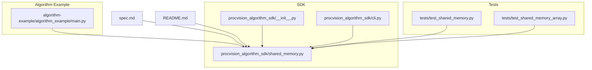
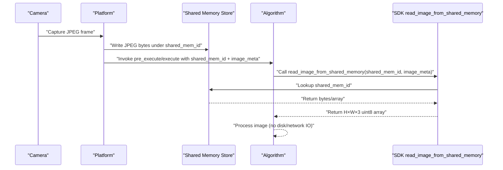
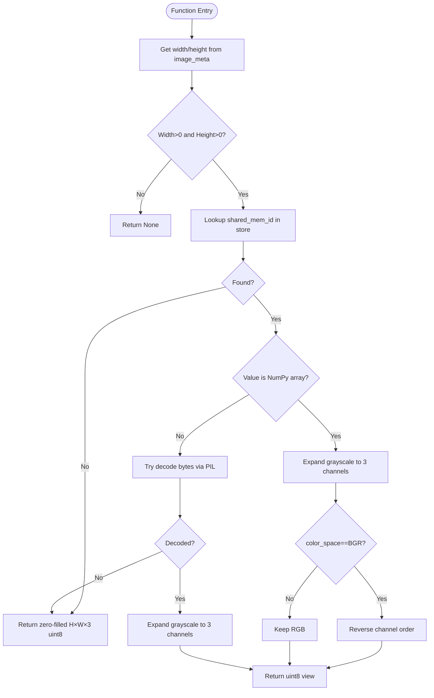
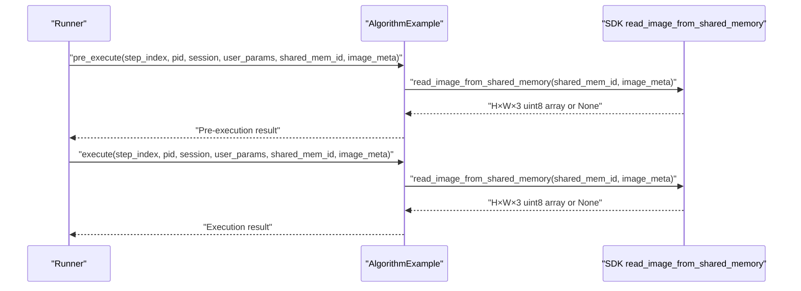
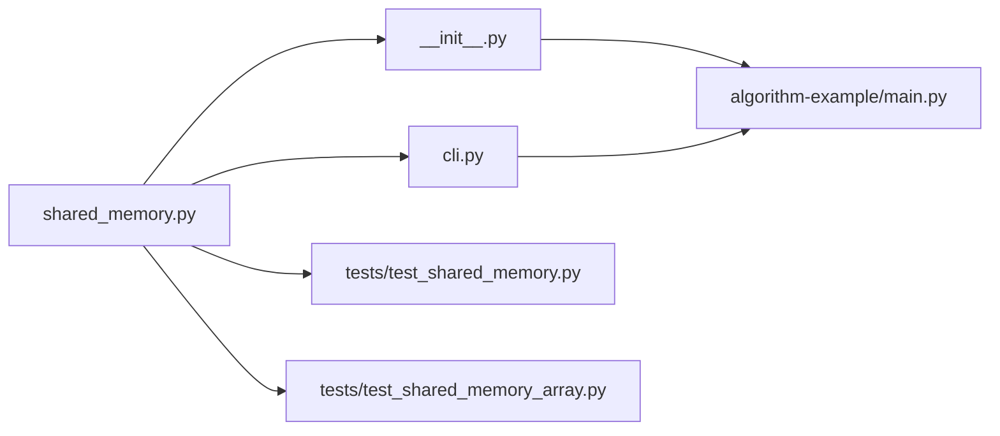
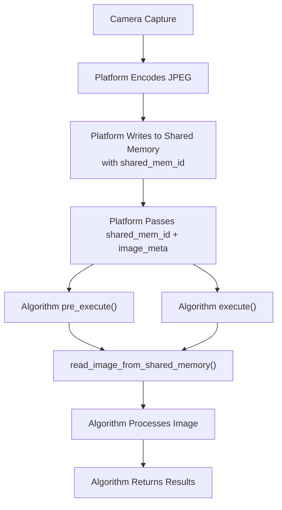

# Shared Memory Integration

<cite>
**Referenced Files in This Document**
- [README.md](file://README.md)
- [spec.md](file://spec.md)
- [procvision_algorithm_sdk/__init__.py](file://procvision_algorithm_sdk/__init__.py)
- [procvision_algorithm_sdk/shared_memory.py](file://procvision_algorithm_sdk/shared_memory.py)
- [procvision_algorithm_sdk/cli.py](file://procvision_algorithm_sdk/cli.py)
- [algorithm-example/algorithm_example/main.py](file://algorithm-example/algorithm_example/main.py)
- [tests/test_shared_memory.py](file://tests/test_shared_memory.py)
- [tests/test_shared_memory_array.py](file://tests/test_shared_memory_array.py)
- [algorithm_dev_quickstart.md](file://algorithm_dev_quickstart.md)
- [algorithm_dev_tutorial.md](file://algorithm_dev_tutorial.md)
</cite>

## Table of Contents
1. [Introduction](#introduction)
2. [Project Structure](#project-structure)
3. [Core Components](#core-components)
4. [Architecture Overview](#architecture-overview)
5. [Detailed Component Analysis](#detailed-component-analysis)
6. [Dependency Analysis](#dependency-analysis)
7. [Performance Considerations](#performance-considerations)
8. [Security and Race Conditions](#security-and-race-conditions)
9. [Troubleshooting Guide](#troubleshooting-guide)
10. [Conclusion](#conclusion)
11. [Appendices](#appendices)

## Introduction
This document explains the shared memory integration pattern used for high-performance image data transfer between the platform and the algorithm. The platform writes JPEG-encoded images into shared memory segments and passes a shared_mem_id plus image_meta to the algorithm. The algorithm reads the image via read_image_from_shared_memory(), which handles both raw JPEG bytes and NumPy arrays. The spec defines JPEG-only semantics and the minimal image_meta fields required for decoding and shape validation.

## Project Structure
The SDK exposes the shared memory read API and integrates it into the algorithm lifecycle. The CLI provides development-time helpers to simulate shared memory usage locally.

**Diagram sources**
- [procvision_algorithm_sdk/shared_memory.py](file://procvision_algorithm_sdk/shared_memory.py#L1-L53)
- [procvision_algorithm_sdk/__init__.py](file://procvision_algorithm_sdk/__init__.py#L1-L19)
- [procvision_algorithm_sdk/cli.py](file://procvision_algorithm_sdk/cli.py#L1-L615)
- [algorithm-example/algorithm_example/main.py](file://algorithm-example/algorithm_example/main.py#L1-L150)
- [tests/test_shared_memory.py](file://tests/test_shared_memory.py#L1-L16)
- [tests/test_shared_memory_array.py](file://tests/test_shared_memory_array.py#L1-L37)
- [spec.md](file://spec.md#L1-L2102)
- [README.md](file://README.md#L1-L116)

**Section sources**
- [README.md](file://README.md#L1-L116)
- [spec.md](file://spec.md#L1-L2102)

## Core Components
- read_image_from_shared_memory(shared_mem_id, image_meta): The primary API for accessing image data from shared memory. It validates width/height, supports JPEG bytes and NumPy arrays, expands grayscale to 3 channels, and converts BGR to RGB when requested.
- write_image_array_to_shared_memory(shared_mem_id, image_array): Platform-side writer for array-backed images.
- dev_write_image_to_shared_memory(shared_mem_id, image_bytes): Development-time writer for local testing.
- dev_clear_shared_memory(shared_mem_id): Development-time cleanup.
- image_meta: Minimal metadata required for decoding and shape validation. JPEG-only convention applies.

Key responsibilities:
- Platform: Write JPEG bytes into shared memory under a unique shared_mem_id and provide image_meta (width, height, timestamp_ms, camera_id). Optionally include color_space for BGR→RGB conversion.
- Algorithm: Call read_image_from_shared_memory() with the provided shared_mem_id and image_meta. Return None if invalid or decode failure; otherwise return a H×W×3 uint8 NumPy array.

**Section sources**
- [procvision_algorithm_sdk/shared_memory.py](file://procvision_algorithm_sdk/shared_memory.py#L1-L53)
- [procvision_algorithm_sdk/__init__.py](file://procvision_algorithm_sdk/__init__.py#L1-L19)
- [spec.md](file://spec.md#L1-L2102)
- [algorithm_dev_quickstart.md](file://algorithm_dev_quickstart.md#L89-L120)
- [algorithm_dev_tutorial.md](file://algorithm_dev_tutorial.md#L103-L127)

## Architecture Overview
The shared memory integration follows a zero-copy, in-memory pipeline. The platform writes JPEG-encoded images into a dictionary-backed shared memory store keyed by shared_mem_id. The algorithm reads the image using read_image_from_shared_memory(), which decodes JPEG bytes or consumes array data, performs shape/color conversions, and returns a NumPy array.

**Diagram sources**
- [procvision_algorithm_sdk/shared_memory.py](file://procvision_algorithm_sdk/shared_memory.py#L1-L53)
- [procvision_algorithm_sdk/cli.py](file://procvision_algorithm_sdk/cli.py#L1-L615)
- [spec.md](file://spec.md#L1-L2102)

## Detailed Component Analysis

### read_image_from_shared_memory() Implementation
Behavior summary:
- Validates width/height from image_meta; returns None if invalid.
- Looks up shared_mem_id in the internal store.
- If the stored value is a NumPy array:
  - Expands grayscale to 3 channels.
  - Converts BGR to RGB when color_space is "BGR".
  - Returns a uint8 view without copying when possible.
- If the stored value is bytes:
  - Attempts to decode as an image via PIL.
  - Expands grayscale to 3 channels.
  - Returns the decoded array.
- Fallback:
  - Returns a zero-filled H×W×3 uint8 array when no data or decode fails.

**Diagram sources**
- [procvision_algorithm_sdk/shared_memory.py](file://procvision_algorithm_sdk/shared_memory.py#L1-L53)

**Section sources**
- [procvision_algorithm_sdk/shared_memory.py](file://procvision_algorithm_sdk/shared_memory.py#L1-L53)
- [tests/test_shared_memory.py](file://tests/test_shared_memory.py#L1-L16)
- [tests/test_shared_memory_array.py](file://tests/test_shared_memory_array.py#L1-L37)
- [algorithm_dev_tutorial.md](file://algorithm_dev_tutorial.md#L103-L127)
- [algorithm_dev_quickstart.md](file://algorithm_dev_quickstart.md#L89-L120)

### Algorithm Usage Pattern
The algorithm receives shared_mem_id and image_meta from the platform and calls read_image_from_shared_memory() in both pre_execute() and execute(). The example demonstrates:
- Validating pid and calling read_image_from_shared_memory().
- Returning structured results with status and debug fields.
- Using image_meta.width/height for logging or downstream logic.

**Diagram sources**
- [algorithm-example/algorithm_example/main.py](file://algorithm-example/algorithm_example/main.py#L1-L150)
- [procvision_algorithm_sdk/shared_memory.py](file://procvision_algorithm_sdk/shared_memory.py#L1-L53)

**Section sources**
- [algorithm-example/algorithm_example/main.py](file://algorithm-example/algorithm_example/main.py#L1-L150)
- [procvision_algorithm_sdk/cli.py](file://procvision_algorithm_sdk/cli.py#L1-L615)

### Development-Time Shared Memory Helpers
- dev_write_image_to_shared_memory(): Writes bytes into the internal store for local testing.
- write_image_array_to_shared_memory(): Writes NumPy arrays for array-based tests.
- dev_clear_shared_memory(): Removes entries during cleanup.

These are used by the CLI’s Dev Runner to simulate platform behavior locally.

**Section sources**
- [procvision_algorithm_sdk/shared_memory.py](file://procvision_algorithm_sdk/shared_memory.py#L1-L53)
- [procvision_algorithm_sdk/cli.py](file://procvision_algorithm_sdk/cli.py#L1-L615)
- [algorithm_dev_quickstart.md](file://algorithm_dev_quickstart.md#L89-L120)

## Dependency Analysis
The SDK exports read_image_from_shared_memory and write_image_array_to_shared_memory, while the CLI depends on these APIs for local simulation. Tests validate both byte and array paths.

**Diagram sources**
- [procvision_algorithm_sdk/shared_memory.py](file://procvision_algorithm_sdk/shared_memory.py#L1-L53)
- [procvision_algorithm_sdk/__init__.py](file://procvision_algorithm_sdk/__init__.py#L1-L19)
- [procvision_algorithm_sdk/cli.py](file://procvision_algorithm_sdk/cli.py#L1-L615)
- [tests/test_shared_memory.py](file://tests/test_shared_memory.py#L1-L16)
- [tests/test_shared_memory_array.py](file://tests/test_shared_memory_array.py#L1-L37)
- [algorithm-example/algorithm_example/main.py](file://algorithm-example/algorithm_example/main.py#L1-L150)

**Section sources**
- [procvision_algorithm_sdk/__init__.py](file://procvision_algorithm_sdk/__init__.py#L1-L19)
- [procvision_algorithm_sdk/cli.py](file://procvision_algorithm_sdk/cli.py#L1-L615)
- [tests/test_shared_memory.py](file://tests/test_shared_memory.py#L1-L16)
- [tests/test_shared_memory_array.py](file://tests/test_shared_memory_array.py#L1-L37)

## Performance Considerations
- Zero-copy advantages:
  - No disk IO or network overhead.
  - No intermediate file creation or serialization.
  - Direct in-memory access via NumPy arrays or PIL decoding.
- JPEG-only convention:
  - Ensures consistent encoding and decoding behavior across platforms.
  - Reduces ambiguity compared to multiple formats.
- Shape and color handling:
  - Automatic grayscale expansion and BGR→RGB conversion minimize post-processing in the algorithm.
- Fallback behavior:
  - Zero-filled fallback avoids crashes and allows graceful degradation.

[No sources needed since this section provides general guidance]

## Security and Race Conditions
- Access control:
  - The internal store is a dictionary scoped to the process. Restrict shared_mem_id generation and access to trusted components.
- Concurrency:
  - Avoid concurrent writes to the same shared_mem_id. Use unique IDs per frame and enforce single-writer/single-reader semantics.
- Data integrity:
  - Validate image_meta.width/height before reading to prevent malformed access.
  - Treat decode failures as transient and rely on fallback behavior.
- Isolation:
  - Keep shared memory separate from external IPC mechanisms to avoid cross-process contamination.

[No sources needed since this section provides general guidance]

## Troubleshooting Guide
Common issues and resolutions:
- Invalid width/height:
  - Symptom: read_image_from_shared_memory() returns None.
  - Resolution: Ensure image_meta contains positive width and height.
- Decode failure:
  - Symptom: read_image_from_shared_memory() returns zero-filled array.
  - Resolution: Verify JPEG bytes are valid; confirm platform wrote the correct format.
- Wrong color space:
  - Symptom: Unexpected blue/red channel ordering.
  - Resolution: Set color_space appropriately in image_meta (e.g., "BGR" to convert to "RGB").
- Array vs bytes mismatch:
  - Symptom: Unexpected behavior depending on platform writer.
  - Resolution: Confirm whether platform writes bytes or arrays; adjust algorithm accordingly.

Validation references:
- JPEG-only convention and image_meta fields are defined in the spec.
- Development helpers and tests demonstrate expected behavior.

**Section sources**
- [procvision_algorithm_sdk/shared_memory.py](file://procvision_algorithm_sdk/shared_memory.py#L1-L53)
- [tests/test_shared_memory.py](file://tests/test_shared_memory.py#L1-L16)
- [tests/test_shared_memory_array.py](file://tests/test_shared_memory_array.py#L1-L37)
- [spec.md](file://spec.md#L1-L2102)

## Conclusion
The shared memory integration enables high-throughput, zero-copy image transfer between the platform and algorithm. The platform writes JPEG-encoded frames into shared memory and supplies image_meta; the algorithm uses read_image_from_shared_memory() to obtain a ready-to-use H×W×3 uint8 array. This design improves performance, simplifies deployment, and maintains strong security boundaries when combined with careful ID management and concurrency controls.

[No sources needed since this section summarizes without analyzing specific files]

## Appendices

### Data Flow Lifecycle Diagram
End-to-end lifecycle from capture to processing.

**Diagram sources**
- [procvision_algorithm_sdk/shared_memory.py](file://procvision_algorithm_sdk/shared_memory.py#L1-L53)
- [algorithm-example/algorithm_example/main.py](file://algorithm-example/algorithm_example/main.py#L1-L150)
- [spec.md](file://spec.md#L1-L2102)

### API and Metadata References
- read_image_from_shared_memory(shared_mem_id, image_meta)
- write_image_array_to_shared_memory(shared_mem_id, image_array)
- dev_write_image_to_shared_memory(shared_mem_id, image_bytes)
- dev_clear_shared_memory(shared_mem_id)
- image_meta fields: width, height, timestamp_ms, camera_id, optional color_space

**Section sources**
- [procvision_algorithm_sdk/shared_memory.py](file://procvision_algorithm_sdk/shared_memory.py#L1-L53)
- [procvision_algorithm_sdk/__init__.py](file://procvision_algorithm_sdk/__init__.py#L1-L19)
- [spec.md](file://spec.md#L1-L2102)
- [algorithm_dev_quickstart.md](file://algorithm_dev_quickstart.md#L89-L120)
- [algorithm_dev_tutorial.md](file://algorithm_dev_tutorial.md#L103-L127)