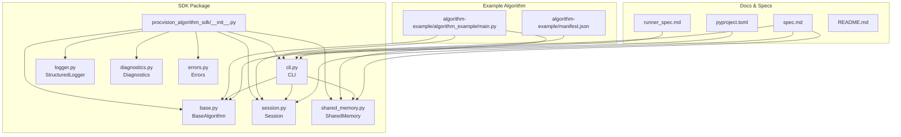
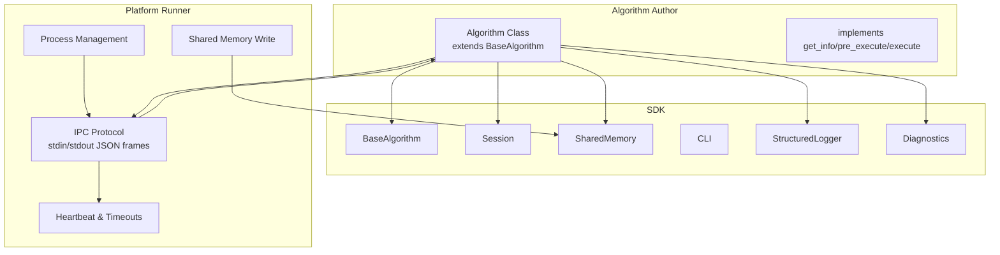
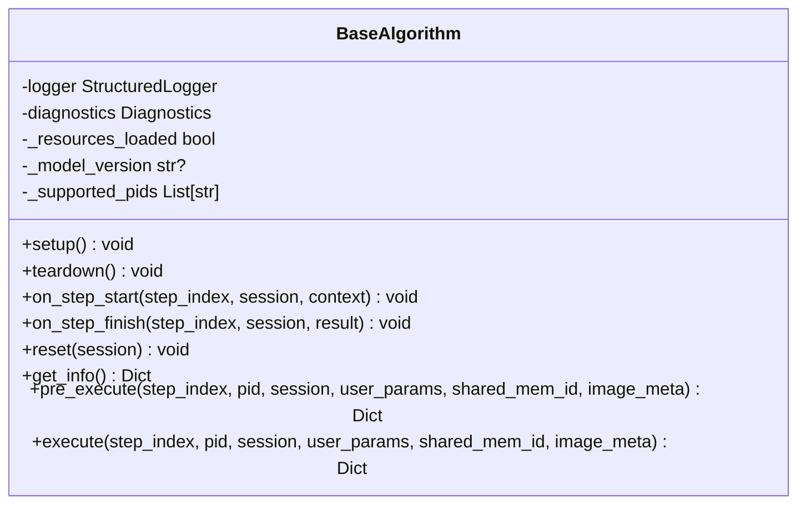
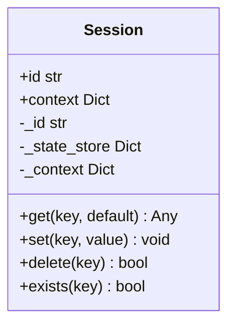
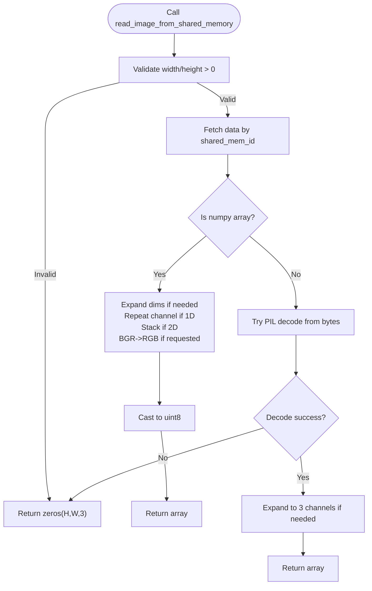
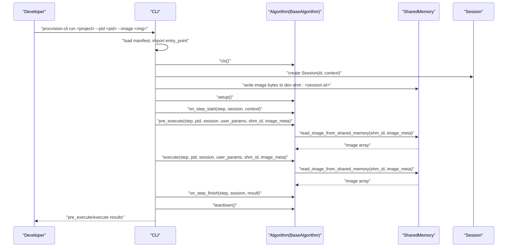
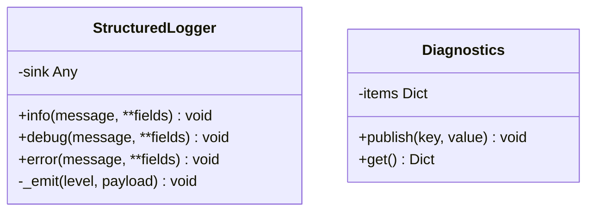
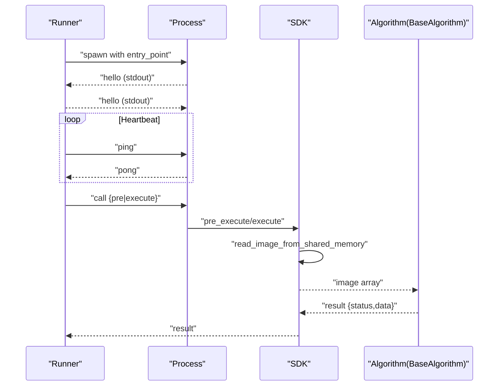
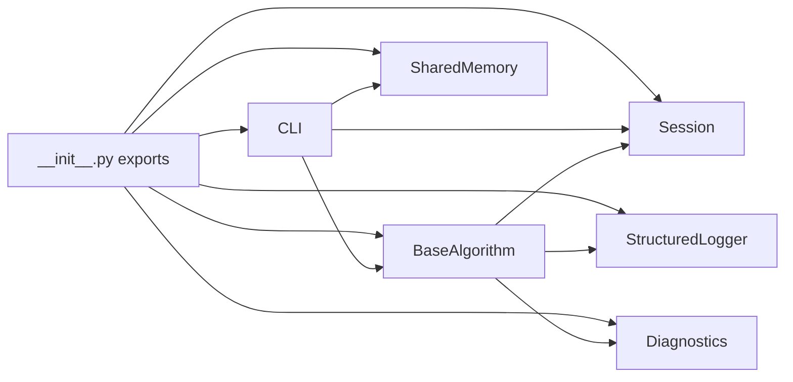
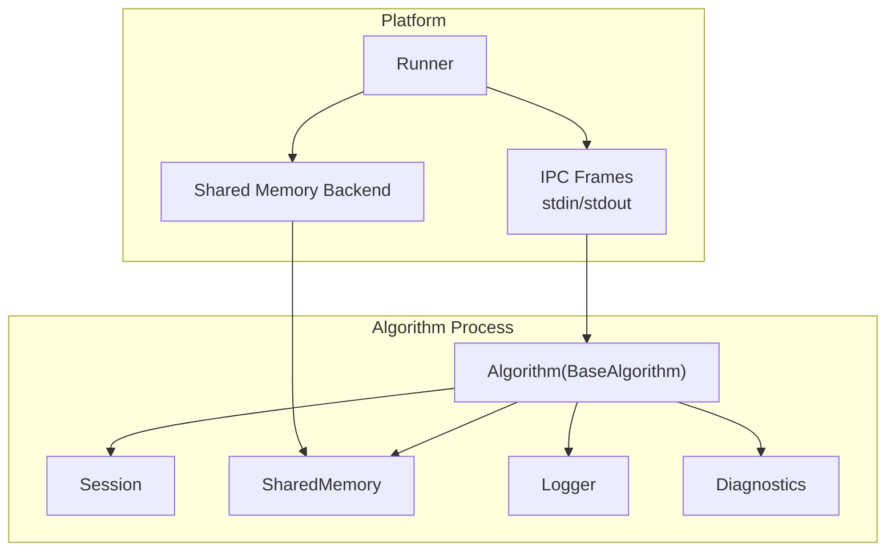

# SDK Architecture

<cite>
**Referenced Files in This Document**
- [README.md](file://README.md)
- [spec.md](file://spec.md)
- [runner_spec.md](file://runner_spec.md)
- [pyproject.toml](file://pyproject.toml)
- [procvision_algorithm_sdk/__init__.py](file://procvision_algorithm_sdk/__init__.py)
- [procvision_algorithm_sdk/base.py](file://procvision_algorithm_sdk/base.py)
- [procvision_algorithm_sdk/session.py](file://procvision_algorithm_sdk/session.py)
- [procvision_algorithm_sdk/shared_memory.py](file://procvision_algorithm_sdk/shared_memory.py)
- [procvision_algorithm_sdk/cli.py](file://procvision_algorithm_sdk/cli.py)
- [procvision_algorithm_sdk/logger.py](file://procvision_algorithm_sdk/logger.py)
- [procvision_algorithm_sdk/diagnostics.py](file://procvision_algorithm_sdk/diagnostics.py)
- [procvision_algorithm_sdk/errors.py](file://procvision_algorithm_sdk/errors.py)
- [algorithm-example/manifest.json](file://algorithm-example/manifest.json)
- [algorithm-example/algorithm_example/main.py](file://algorithm-example/algorithm_example/main.py)
- [tests/test_shared_memory.py](file://tests/test_shared_memory.py)
- [tests/test_shared_memory_array.py](file://tests/test_shared_memory_array.py)
- [tests/test_session.py](file://tests/test_session.py)
</cite>

## Table of Contents
1. [Introduction](#introduction)
2. [Project Structure](#project-structure)
3. [Core Components](#core-components)
4. [Architecture Overview](#architecture-overview)
5. [Detailed Component Analysis](#detailed-component-analysis)
6. [Dependency Analysis](#dependency-analysis)
7. [Performance Considerations](#performance-considerations)
8. [Troubleshooting Guide](#troubleshooting-guide)
9. [Conclusion](#conclusion)
10. [Appendices](#appendices)

## Introduction
This document describes the ProcVision Algorithm SDK as a modular framework designed for industrial vision applications. The SDK separates concerns into four pillars:
- Interface: BaseAlgorithm defines the contract for algorithm implementations.
- State: Session encapsulates per-run state and context.
- Data Transfer: SharedMemory provides a JPEG-only, metadata-driven image transport abstraction.
- Tooling: CLI offers validation, local simulation, packaging, and scaffolding for algorithm development.

It also documents integration patterns with the ProcVision platform, including lifecycle hooks, IPC via shared memory, and standardized result objects. Cross-cutting concerns include structured logging to stderr, diagnostic data collection, and error handling via standardized result objects. Infrastructure requirements such as shared memory support and Python version compatibility are highlighted.

## Project Structure
The repository is organized around a core SDK package and example/demo artifacts:
- procvision_algorithm_sdk: Core SDK modules (BaseAlgorithm, Session, SharedMemory, CLI, Logger, Diagnostics, Errors).
- algorithm-example: A minimal example algorithm demonstrating manifest, entry point, and implementation.
- Tests: Unit tests validating Session serialization, SharedMemory array/bgr/bytes behavior.
- Specifications: spec.md (algorithm interface and protocol) and runner_spec.md (platform runtime behavior).
- Packaging: pyproject.toml defines scripts, dependencies, and Python version requirement.

**Diagram sources**
- [procvision_algorithm_sdk/__init__.py](file://procvision_algorithm_sdk/__init__.py#L1-L20)
- [procvision_algorithm_sdk/base.py](file://procvision_algorithm_sdk/base.py#L1-L58)
- [procvision_algorithm_sdk/session.py](file://procvision_algorithm_sdk/session.py#L1-L36)
- [procvision_algorithm_sdk/shared_memory.py](file://procvision_algorithm_sdk/shared_memory.py#L1-L53)
- [procvision_algorithm_sdk/cli.py](file://procvision_algorithm_sdk/cli.py#L1-L615)
- [procvision_algorithm_sdk/logger.py](file://procvision_algorithm_sdk/logger.py#L1-L24)
- [procvision_algorithm_sdk/diagnostics.py](file://procvision_algorithm_sdk/diagnostics.py#L1-L12)
- [procvision_algorithm_sdk/errors.py](file://procvision_algorithm_sdk/errors.py#L1-L14)
- [algorithm-example/manifest.json](file://algorithm-example/manifest.json#L1-L25)
- [algorithm-example/algorithm_example/main.py](file://algorithm-example/algorithm_example/main.py#L1-L150)
- [spec.md](file://spec.md#L1-L2102)
- [runner_spec.md](file://runner_spec.md#L1-L283)
- [pyproject.toml](file://pyproject.toml#L1-L36)

**Section sources**
- [README.md](file://README.md#L1-L116)
- [pyproject.toml](file://pyproject.toml#L1-L36)

## Core Components
- BaseAlgorithm: Abstract base class enforcing get_info, pre_execute, execute, plus optional lifecycle hooks (setup, teardown, on_step_start, on_step_finish, reset). It embeds StructuredLogger and Diagnostics and tracks internal state.
- Session: Lightweight JSON-serializable state container with id, context, and a state_store. Enforces JSON-serializability on set().
- SharedMemory: Provides read/write helpers for images via shared memory identifiers and metadata. Supports both bytes (JPEG/PNG) and numpy arrays, with color-space normalization and fallback behavior.
- CLI: Provides validate, run, package, and init commands for local development and packaging. Implements smoke tests against BaseAlgorithm contracts.
- Logger: StructuredLogger writes JSON records to stderr with timestamp_ms and level.
- Diagnostics: Diagnostics publishes key-value metrics for reporting and UI.
- Errors: Typed exceptions for recoverable/fatal conditions.

**Section sources**
- [procvision_algorithm_sdk/base.py](file://procvision_algorithm_sdk/base.py#L1-L58)
- [procvision_algorithm_sdk/session.py](file://procvision_algorithm_sdk/session.py#L1-L36)
- [procvision_algorithm_sdk/shared_memory.py](file://procvision_algorithm_sdk/shared_memory.py#L1-L53)
- [procvision_algorithm_sdk/cli.py](file://procvision_algorithm_sdk/cli.py#L1-L615)
- [procvision_algorithm_sdk/logger.py](file://procvision_algorithm_sdk/logger.py#L1-L24)
- [procvision_algorithm_sdk/diagnostics.py](file://procvision_algorithm_sdk/diagnostics.py#L1-L12)
- [procvision_algorithm_sdk/errors.py](file://procvision_algorithm_sdk/errors.py#L1-L14)

## Architecture Overview
The SDK is a thin, protocol-aligned wrapper enabling algorithm authors to implement a deterministic, JSON-structured pipeline. Platform integration is achieved via:
- Lifecycle hooks invoked by the platform’s Runner.
- IPC via shared memory identifiers and metadata.
- Standardized result objects with status, message, and data fields.
- Structured logging to stderr and diagnostic publishing.

**Diagram sources**
- [procvision_algorithm_sdk/base.py](file://procvision_algorithm_sdk/base.py#L1-L58)
- [procvision_algorithm_sdk/session.py](file://procvision_algorithm_sdk/session.py#L1-L36)
- [procvision_algorithm_sdk/shared_memory.py](file://procvision_algorithm_sdk/shared_memory.py#L1-L53)
- [procvision_algorithm_sdk/cli.py](file://procvision_algorithm_sdk/cli.py#L1-L615)
- [runner_spec.md](file://runner_spec.md#L1-L283)

## Detailed Component Analysis

### BaseAlgorithm and Lifecycle Hooks
BaseAlgorithm enforces a strict contract while offering optional lifecycle hooks. It initializes logger, diagnostics, and internal flags. The abstract methods define the execution surface, and optional hooks enable instrumentation and cleanup.

**Diagram sources**
- [procvision_algorithm_sdk/base.py](file://procvision_algorithm_sdk/base.py#L1-L58)

**Section sources**
- [procvision_algorithm_sdk/base.py](file://procvision_algorithm_sdk/base.py#L1-L58)
- [spec.md](file://spec.md#L1-L2102)

### Session: JSON-Serializable State
Session encapsulates per-run identity and context, and provides a JSON-serializable state store. It validates values during set() to ensure portability across IPC boundaries.

**Diagram sources**
- [procvision_algorithm_sdk/session.py](file://procvision_algorithm_sdk/session.py#L1-L36)

**Section sources**
- [procvision_algorithm_sdk/session.py](file://procvision_algorithm_sdk/session.py#L1-L36)
- [tests/test_session.py](file://tests/test_session.py#L1-L24)

### SharedMemory: Image Transport Abstraction
SharedMemory exposes read/write helpers for images. It supports:
- Writing bytes (e.g., JPEG/PNG) or numpy arrays.
- Normalizing color spaces (RGB/BGR) and expanding grayscale to 3-channel.
- Returning zero-filled fallback arrays when data is unavailable.

**Diagram sources**
- [procvision_algorithm_sdk/shared_memory.py](file://procvision_algorithm_sdk/shared_memory.py#L1-L53)

**Section sources**
- [procvision_algorithm_sdk/shared_memory.py](file://procvision_algorithm_sdk/shared_memory.py#L1-L53)
- [tests/test_shared_memory.py](file://tests/test_shared_memory.py#L1-L16)
- [tests/test_shared_memory_array.py](file://tests/test_shared_memory_array.py#L1-L37)

### CLI: Validation, Simulation, Packaging, and Scaffolding
The CLI orchestrates:
- validate: Loads manifest, imports entry_point, verifies subclass of BaseAlgorithm, runs smoke tests against get_info, supported_pids, pre_execute, execute, and on_step_* hooks.
- run: Simulates platform behavior locally by writing image bytes to shared memory and invoking pre_execute/execute with a demo Session and image_meta.
- package: Builds offline zip with source, manifest, requirements, wheels, and assets.
- init: Generates a starter project with manifest and boilerplate algorithm class.

**Diagram sources**
- [procvision_algorithm_sdk/cli.py](file://procvision_algorithm_sdk/cli.py#L1-L615)
- [procvision_algorithm_sdk/base.py](file://procvision_algorithm_sdk/base.py#L1-L58)
- [procvision_algorithm_sdk/session.py](file://procvision_algorithm_sdk/session.py#L1-L36)
- [procvision_algorithm_sdk/shared_memory.py](file://procvision_algorithm_sdk/shared_memory.py#L1-L53)

**Section sources**
- [procvision_algorithm_sdk/cli.py](file://procvision_algorithm_sdk/cli.py#L1-L615)
- [algorithm-example/manifest.json](file://algorithm-example/manifest.json#L1-L25)
- [algorithm-example/algorithm_example/main.py](file://algorithm-example/algorithm_example/main.py#L1-L150)

### Logger and Diagnostics
- StructuredLogger emits JSON records to stderr with level and timestamp_ms, enabling platform-side log aggregation.
- Diagnostics collects key-value metrics for reporting and UI.

**Diagram sources**
- [procvision_algorithm_sdk/logger.py](file://procvision_algorithm_sdk/logger.py#L1-L24)
- [procvision_algorithm_sdk/diagnostics.py](file://procvision_algorithm_sdk/diagnostics.py#L1-L12)

**Section sources**
- [procvision_algorithm_sdk/logger.py](file://procvision_algorithm_sdk/logger.py#L1-L24)
- [procvision_algorithm_sdk/diagnostics.py](file://procvision_algorithm_sdk/diagnostics.py#L1-L12)

### Integration with the ProcVision Platform
- Lifecycle hooks: setup/teardown/on_step_start/on_step_finish/reset are invoked by the Runner at appropriate boundaries.
- IPC via shared memory: Runner writes image bytes to shared memory and passes shared_mem_id and image_meta; algorithm reads via SDK.
- Protocol: Runner communicates via stdin/stdout JSON frames with length-prefixed encoding; stderr carries structured logs.
- Result objects: pre_execute returns reference data; execute returns business result_status and optional NG details.

**Diagram sources**
- [runner_spec.md](file://runner_spec.md#L1-L283)
- [procvision_algorithm_sdk/shared_memory.py](file://procvision_algorithm_sdk/shared_memory.py#L1-L53)
- [procvision_algorithm_sdk/base.py](file://procvision_algorithm_sdk/base.py#L1-L58)

**Section sources**
- [runner_spec.md](file://runner_spec.md#L1-L283)
- [spec.md](file://spec.md#L1-L2102)

## Dependency Analysis
The SDK maintains loose coupling among components:
- BaseAlgorithm depends on Logger, Diagnostics, and Session.
- CLI depends on BaseAlgorithm, Session, and SharedMemory for validation and simulation.
- SharedMemory is a pure utility module with no downstream dependencies.
- Exports in __init__.py centralize public API exposure.

**Diagram sources**
- [procvision_algorithm_sdk/__init__.py](file://procvision_algorithm_sdk/__init__.py#L1-L20)
- [procvision_algorithm_sdk/base.py](file://procvision_algorithm_sdk/base.py#L1-L58)
- [procvision_algorithm_sdk/session.py](file://procvision_algorithm_sdk/session.py#L1-L36)
- [procvision_algorithm_sdk/shared_memory.py](file://procvision_algorithm_sdk/shared_memory.py#L1-L53)
- [procvision_algorithm_sdk/cli.py](file://procvision_algorithm_sdk/cli.py#L1-L615)
- [procvision_algorithm_sdk/logger.py](file://procvision_algorithm_sdk/logger.py#L1-L24)
- [procvision_algorithm_sdk/diagnostics.py](file://procvision_algorithm_sdk/diagnostics.py#L1-L12)

**Section sources**
- [procvision_algorithm_sdk/__init__.py](file://procvision_algorithm_sdk/__init__.py#L1-L20)

## Performance Considerations
- SharedMemory read path: Prefer passing numpy arrays when available to avoid decoding overhead; SDK normalizes arrays and handles color spaces efficiently.
- JSON-serializable state: Keep Session state small (<100KB) to minimize IPC overhead.
- Logging: StructuredLogger flushes immediately; avoid excessive logging in tight loops.
- Timeouts: Runner enforces heartbeat and call timeouts; keep pre_execute/execute responsive to avoid termination.

[No sources needed since this section provides general guidance]

## Troubleshooting Guide
Common issues and resolutions:
- Unsupported PID: pre_execute/execute should return ERROR with error_code 1001 when pid is not in supported_pids.
- Image load failures: ERROR with error_code 1002 when image_meta is missing or image data is empty/unreadable.
- Non-JSON-serializable Session values: set() raises TypeError; ensure stored values are JSON serializable.
- SharedMemory fallback: When data is unavailable, read returns zeros(H,W,3); verify image_meta and shared_mem_id.
- CLI validation failures: Use procvision-cli validate to diagnose manifest, entry_point, supported_pids, and smoke execution.

**Section sources**
- [procvision_algorithm_sdk/session.py](file://procvision_algorithm_sdk/session.py#L1-L36)
- [procvision_algorithm_sdk/shared_memory.py](file://procvision_algorithm_sdk/shared_memory.py#L1-L53)
- [procvision_algorithm_sdk/cli.py](file://procvision_algorithm_sdk/cli.py#L1-L615)
- [spec.md](file://spec.md#L1-L2102)

## Conclusion
The ProcVision Algorithm SDK provides a clean, protocol-aligned framework for building industrial vision algorithms. By enforcing a strict BaseAlgorithm contract, managing JSON-serializable state via Session, abstracting image transport through SharedMemory, and offering robust CLI tooling, it enables reliable integration with the platform’s Runner. Cross-cutting concerns like structured logging and diagnostics are first-class, and the design supports lifecycle hooks and standardized result objects essential for production-grade deployments.

[No sources needed since this section summarizes without analyzing specific files]

## Appendices

### System Context Diagram
This diagram shows the algorithm running in isolation with platform interfaces.

**Diagram sources**
- [runner_spec.md](file://runner_spec.md#L1-L283)
- [procvision_algorithm_sdk/base.py](file://procvision_algorithm_sdk/base.py#L1-L58)
- [procvision_algorithm_sdk/session.py](file://procvision_algorithm_sdk/session.py#L1-L36)
- [procvision_algorithm_sdk/shared_memory.py](file://procvision_algorithm_sdk/shared_memory.py#L1-L53)
- [procvision_algorithm_sdk/logger.py](file://procvision_algorithm_sdk/logger.py#L1-L24)
- [procvision_algorithm_sdk/diagnostics.py](file://procvision_algorithm_sdk/diagnostics.py#L1-L12)

### Infrastructure Requirements
- Python version: Requires Python >=3.10 as per packaging configuration.
- Dependencies: numpy>=1.21, pillow>=10.0.0.
- Shared memory backend: Native in-memory implementation for development; platform uses a production backend for IPC.
- Offline deployment: Algorithms must ship wheels and requirements with the algorithm package.

**Section sources**
- [pyproject.toml](file://pyproject.toml#L1-L36)
- [README.md](file://README.md#L1-L116)
- [runner_spec.md](file://runner_spec.md#L1-L283)

### Example Algorithm References
- Manifest fields: name, version, entry_point, supported_pids, steps.
- Implementation example: AlgorithmExample demonstrates lifecycle hooks, pre_execute/execute, and diagnostic publishing.

**Section sources**
- [algorithm-example/manifest.json](file://algorithm-example/manifest.json#L1-L25)
- [algorithm-example/algorithm_example/main.py](file://algorithm-example/algorithm_example/main.py#L1-L150)