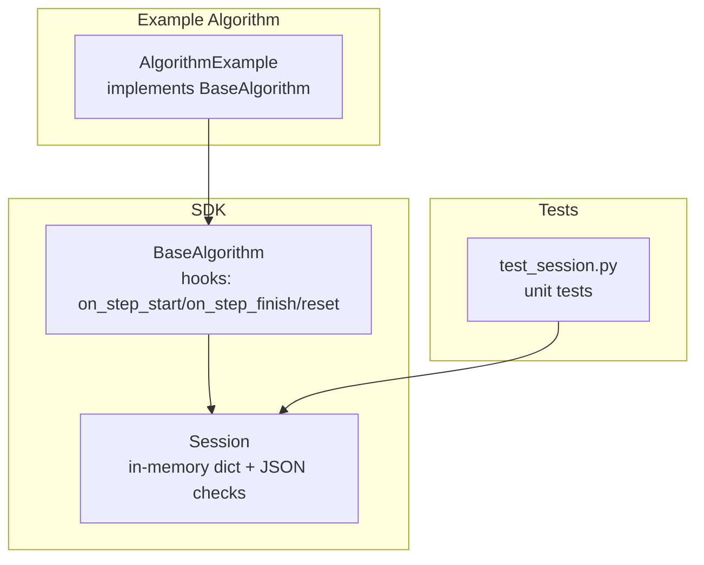
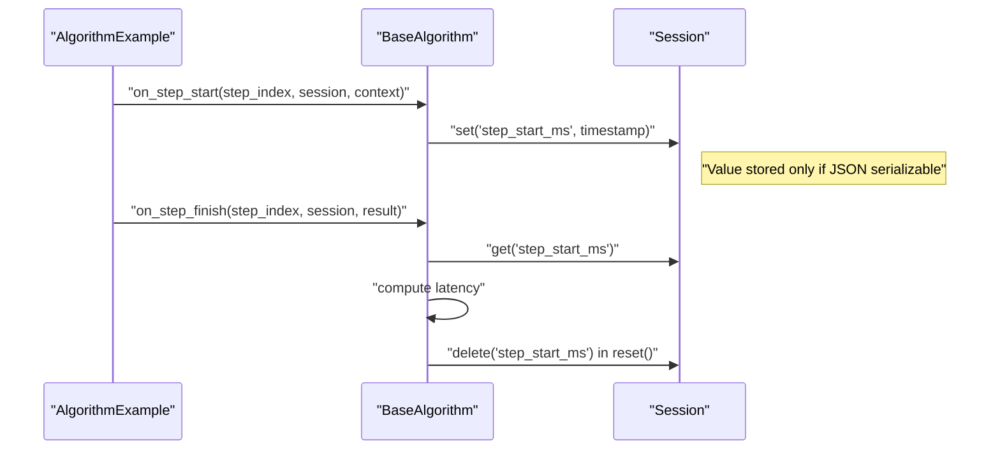
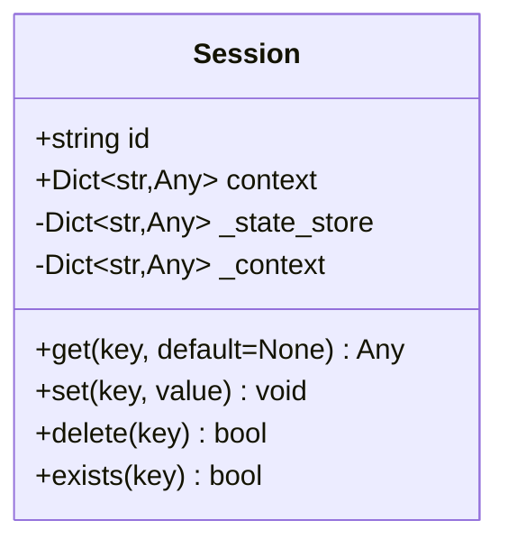
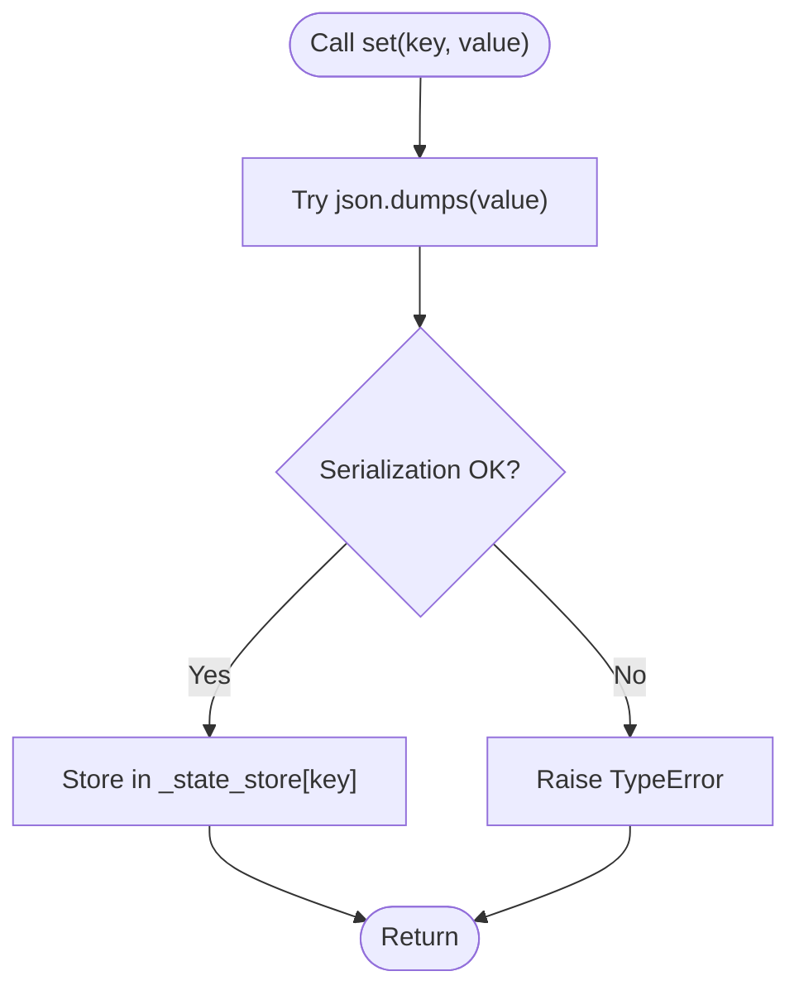
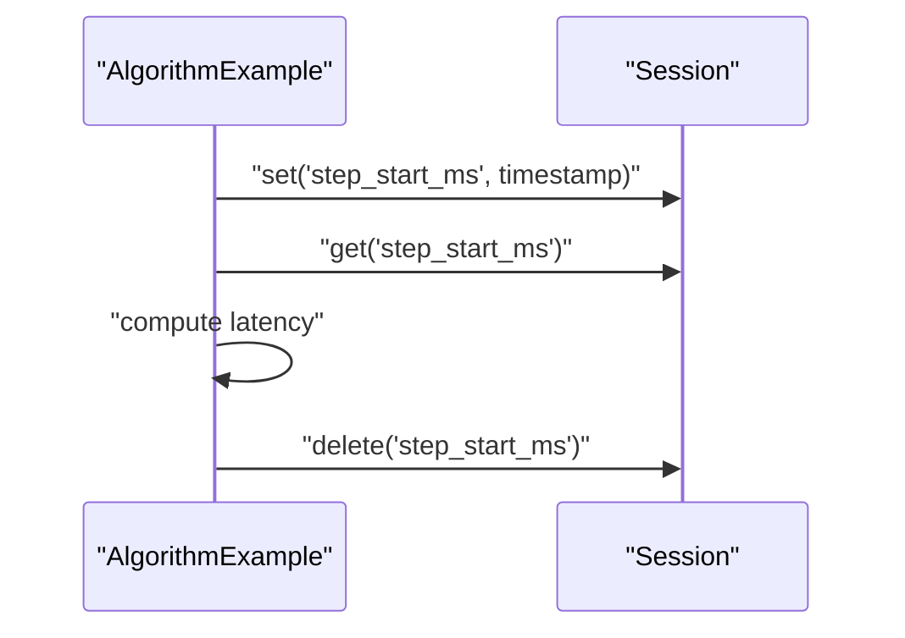
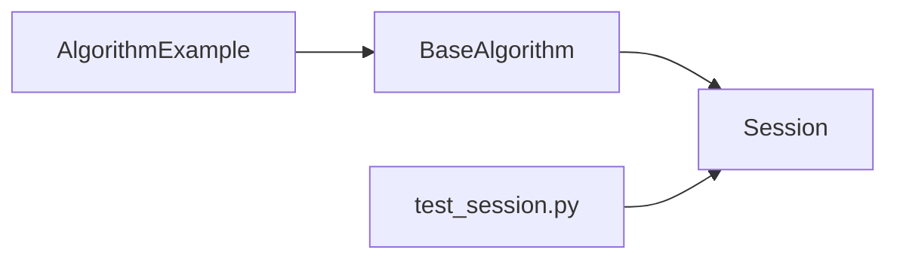

# Session Management

<cite>
**Referenced Files in This Document**
- [session.py](file://procvision_algorithm_sdk/session.py)
- [base.py](file://procvision_algorithm_sdk/base.py)
- [main.py](file://algorithm-example/algorithm_example/main.py)
- [test_session.py](file://tests/test_session.py)
- [spec.md](file://spec.md)
- [algorithm_dev_tutorial.md](file://algorithm_dev_tutorial.md)
</cite>

## Table of Contents
1. [Introduction](#introduction)
2. [Project Structure](#project-structure)
3. [Core Components](#core-components)
4. [Architecture Overview](#architecture-overview)
5. [Detailed Component Analysis](#detailed-component-analysis)
6. [Dependency Analysis](#dependency-analysis)
7. [Performance Considerations](#performance-considerations)
8. [Troubleshooting Guide](#troubleshooting-guide)
9. [Conclusion](#conclusion)
10. [Appendices](#appendices)

## Introduction
This document explains the Session component responsible for state persistence across algorithm execution steps. The Session provides an in-memory key-value store with JSON serialization enforcement for values, a read-only context property for execution-scoped metadata, and lifecycle boundaries aligned with a single algorithm execution. It is designed to be used by algorithms implementing the BaseAlgorithm interface, enabling patterns such as recording timestamps in on_step_start and computing latency in on_step_finish.

## Project Structure
The Session lives in the SDK package and is consumed by algorithms and tests. The example algorithm demonstrates typical usage patterns.

**Diagram sources**
- [session.py](file://procvision_algorithm_sdk/session.py#L1-L36)
- [base.py](file://procvision_algorithm_sdk/base.py#L1-L58)
- [main.py](file://algorithm-example/algorithm_example/main.py#L1-L150)
- [test_session.py](file://tests/test_session.py#L1-L24)

**Section sources**
- [session.py](file://procvision_algorithm_sdk/session.py#L1-L36)
- [base.py](file://procvision_algorithm_sdk/base.py#L1-L58)
- [main.py](file://algorithm-example/algorithm_example/main.py#L1-L150)
- [test_session.py](file://tests/test_session.py#L1-L24)

## Core Components
- Session: In-memory state store with JSON-serialization enforcement for values, plus a read-only context copy.
- BaseAlgorithm: Provides lifecycle hooks where algorithms can read/write session state.
- Example Algorithm: Demonstrates storing timestamps in on_step_start and computing latency in on_step_finish.

Key responsibilities:
- Session.get/set/delete/exists: manage in-memory key-value pairs.
- Session.context: read-only access to execution-scoped metadata.
- BaseAlgorithm.on_step_start/on_step_finish/reset: integrate session usage in execution lifecycle.

**Section sources**
- [session.py](file://procvision_algorithm_sdk/session.py#L1-L36)
- [base.py](file://procvision_algorithm_sdk/base.py#L1-L58)
- [main.py](file://algorithm-example/algorithm_example/main.py#L1-L150)

## Architecture Overview
The Session is passed into algorithm lifecycle hooks. Algorithms can persist transient data across steps and access read-only context metadata.

**Diagram sources**
- [base.py](file://procvision_algorithm_sdk/base.py#L1-L58)
- [session.py](file://procvision_algorithm_sdk/session.py#L1-L36)
- [main.py](file://algorithm-example/algorithm_example/main.py#L1-L150)

## Detailed Component Analysis

### Session Class
The Session class encapsulates:
- id: immutable identifier for the session.
- context: read-only copy of execution-scoped metadata.
- state_store: in-memory dictionary for transient state.

Methods:
- get(key, default=None): retrieves a value or default.
- set(key, value): enforces JSON serializability before storing.
- delete(key): removes a key if present, returns whether deletion occurred.
- exists(key): checks presence of a key.

**Diagram sources**
- [session.py](file://procvision_algorithm_sdk/session.py#L1-L36)

**Section sources**
- [session.py](file://procvision_algorithm_sdk/session.py#L1-L36)
- [spec.md](file://spec.md#L408-L485)
- [algorithm_dev_tutorial.md](file://algorithm_dev_tutorial.md#L96-L101)

### JSON Serialization Enforcement
- set(value) validates that the value is JSON serializable by attempting to serialize it.
- If serialization fails, a TypeError is raised with a descriptive message.
- This ensures that persisted state remains portable and consistent across execution boundaries.

**Diagram sources**
- [session.py](file://procvision_algorithm_sdk/session.py#L1-L36)

**Section sources**
- [session.py](file://procvision_algorithm_sdk/session.py#L1-L36)
- [test_session.py](file://tests/test_session.py#L1-L24)

### Context Property (Read-Only Access)
- context returns a shallow copy of the internal context dictionary.
- This prevents external mutation of the session’s context while allowing algorithms to read execution-scoped metadata such as product_code or trace_id.

Usage patterns:
- Read-only access to metadata during on_step_start/on_step_finish.
- Avoid mutating context; treat it as read-only.

**Section sources**
- [session.py](file://procvision_algorithm_sdk/session.py#L1-L36)
- [base.py](file://procvision_algorithm_sdk/base.py#L1-L58)
- [main.py](file://algorithm-example/algorithm_example/main.py#L1-L150)

### Lifecycle Boundaries and Isolation
- Session instances are created per execution and scoped to that execution.
- Values are not retained across separate detections; they are cleared when the algorithm resets or completes.
- Reset hook can be used to clean up transient state.

Evidence:
- BaseAlgorithm exposes a reset(session) hook.
- The example deletes the step_start_ms key in reset.

**Section sources**
- [base.py](file://procvision_algorithm_sdk/base.py#L1-L58)
- [main.py](file://algorithm-example/algorithm_example/main.py#L1-L150)
- [spec.md](file://spec.md#L408-L485)

### Thread Safety Considerations
- The Session class uses a plain in-memory dictionary and does not implement explicit locking.
- If algorithms execute concurrently within a single process, consider synchronizing access to the same Session instance or isolating sessions per thread.
- For multi-process scenarios, each process should own its Session instance.

[No sources needed since this section provides general guidance]

### Usage Patterns
Common patterns demonstrated by the example algorithm:
- on_step_start: store a millisecond timestamp under a stable key.
- on_step_finish: compute latency by subtracting the stored timestamp from the current time and publish diagnostics.
- reset: remove temporary keys to keep the session clean.

**Diagram sources**
- [main.py](file://algorithm-example/algorithm_example/main.py#L1-L150)
- [session.py](file://procvision_algorithm_sdk/session.py#L1-L36)

**Section sources**
- [main.py](file://algorithm-example/algorithm_example/main.py#L1-L150)

### Valid and Invalid State Values
Valid values (JSON serializable):
- Numbers, strings, booleans, lists, dicts, null.
- Numpy scalars and arrays are not inherently JSON serializable; convert to native Python types or lists before setting.

Invalid values (non-serializable):
- Sets, frozensets, custom objects without a JSON encoder.
- Numpy arrays directly.

Tests confirm that non-serializable values raise TypeError.

**Section sources**
- [test_session.py](file://tests/test_session.py#L1-L24)
- [session.py](file://procvision_algorithm_sdk/session.py#L1-L36)

## Dependency Analysis
- BaseAlgorithm depends on Session for state persistence during lifecycle hooks.
- Example Algorithm implements BaseAlgorithm and uses Session in practice.
- Tests validate Session behavior and serialization enforcement.

**Diagram sources**
- [base.py](file://procvision_algorithm_sdk/base.py#L1-L58)
- [session.py](file://procvision_algorithm_sdk/session.py#L1-L36)
- [main.py](file://algorithm-example/algorithm_example/main.py#L1-L150)
- [test_session.py](file://tests/test_session.py#L1-L24)

**Section sources**
- [base.py](file://procvision_algorithm_sdk/base.py#L1-L58)
- [session.py](file://procvision_algorithm_sdk/session.py#L1-L36)
- [main.py](file://algorithm-example/algorithm_example/main.py#L1-L150)
- [test_session.py](file://tests/test_session.py#L1-L24)

## Performance Considerations
- In-memory dictionary operations are O(1) average-case for get/set/delete.
- JSON serialization cost scales with value size; avoid storing extremely large objects.
- Prefer compact, primitive-native structures for frequent updates.
- Minimize cross-step state to reduce contention and memory footprint.

[No sources needed since this section provides general guidance]

## Troubleshooting Guide
Common issues and resolutions:
- Serialization errors when setting values:
  - Cause: Non-JSON-serializable types (e.g., sets, custom objects).
  - Resolution: Convert to JSON-compatible types (lists/dicts/primitives) before calling set.
  - Reference: [session.py](file://procvision_algorithm_sdk/session.py#L1-L36), [test_session.py](file://tests/test_session.py#L1-L24)

- Missing keys in on_step_finish:
  - Cause: Key was not set or was deleted/reset.
  - Resolution: Ensure on_step_start sets the key and on_step_finish handles missing values gracefully.

- Context mutation attempts:
  - Cause: Attempting to modify the returned context dictionary.
  - Resolution: Treat context as read-only; mutate only within the session initialization.

- State isolation between runs:
  - Cause: Reusing the same Session instance across executions.
  - Resolution: Create a new Session per execution; rely on reset to clear state.

**Section sources**
- [session.py](file://procvision_algorithm_sdk/session.py#L1-L36)
- [test_session.py](file://tests/test_session.py#L1-L24)
- [main.py](file://algorithm-example/algorithm_example/main.py#L1-L150)

## Conclusion
The Session component provides a simple, robust mechanism for transient state persistence across algorithm execution steps. Its JSON serialization enforcement ensures portability and reliability, while the read-only context offers safe access to execution-scoped metadata. By following the usage patterns and best practices outlined here, developers can implement reliable state management with predictable lifecycle boundaries.

## Appendices

### API Summary
- Session(id: str, context: Optional[Dict[str, Any]] = None)
- id: immutable session identifier
- context: read-only copy of execution metadata
- get(key: str, default: Any = None) -> Any
- set(key: str, value: Any) -> None
- delete(key: str) -> bool
- exists(key: str) -> bool

**Section sources**
- [session.py](file://procvision_algorithm_sdk/session.py#L1-L36)
- [spec.md](file://spec.md#L408-L485)
- [algorithm_dev_tutorial.md](file://algorithm_dev_tutorial.md#L96-L101)