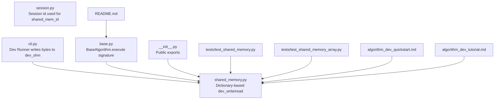
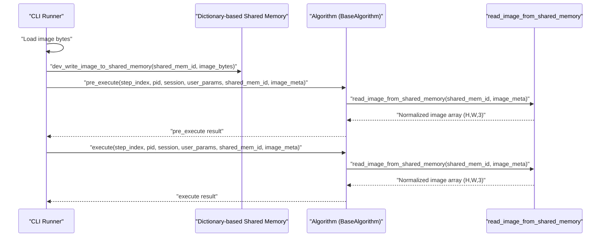
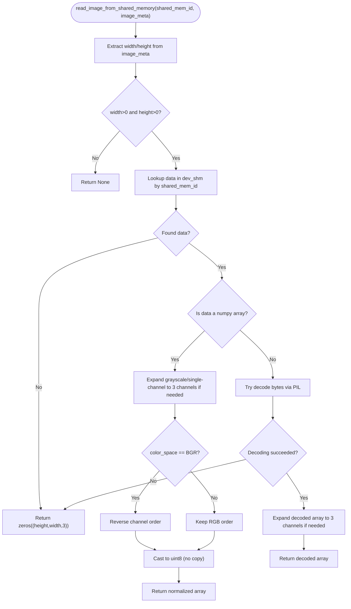
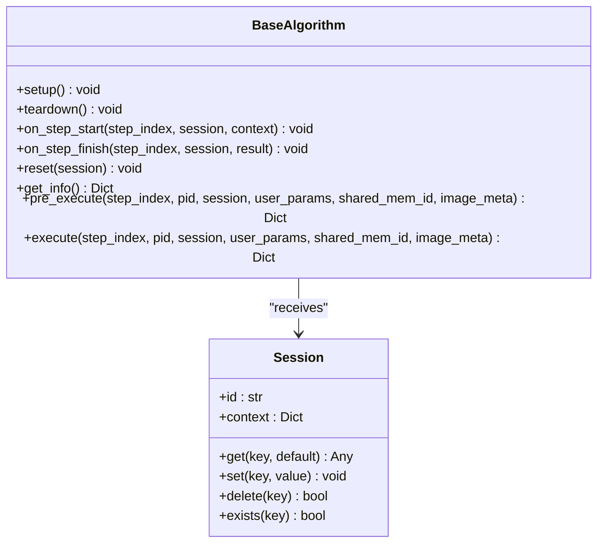
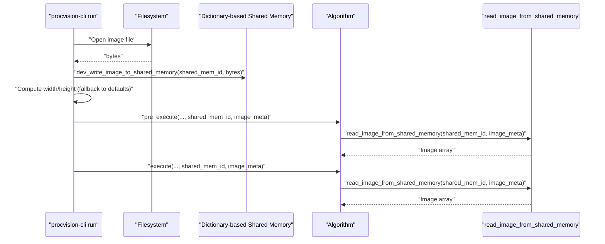
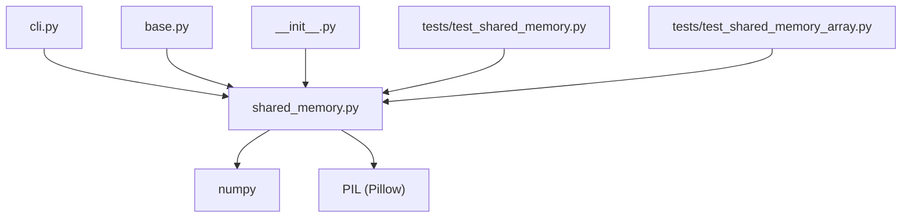

# Shared Memory

<cite>
**Referenced Files in This Document**
- [shared_memory.py](file://procvision_algorithm_sdk/shared_memory.py)
- [base.py](file://procvision_algorithm_sdk/base.py)
- [cli.py](file://procvision_algorithm_sdk/cli.py)
- [session.py](file://procvision_algorithm_sdk/session.py)
- [__init__.py](file://procvision_algorithm_sdk/__init__.py)
- [test_shared_memory.py](file://tests/test_shared_memory.py)
- [test_shared_memory_array.py](file://tests/test_shared_memory_array.py)
- [README.md](file://README.md)
- [algorithm_dev_quickstart.md](file://algorithm_dev_quickstart.md)
- [algorithm_dev_tutorial.md](file://algorithm_dev_tutorial.md)
</cite>

## Table of Contents
1. [Introduction](#introduction)
2. [Project Structure](#project-structure)
3. [Core Components](#core-components)
4. [Architecture Overview](#architecture-overview)
5. [Detailed Component Analysis](#detailed-component-analysis)
6. [Dependency Analysis](#dependency-analysis)
7. [Performance Considerations](#performance-considerations)
8. [Troubleshooting Guide](#troubleshooting-guide)
9. [Conclusion](#conclusion)
10. [Appendices](#appendices)

## Introduction
This document explains the shared memory system used by the ProcVision platform to efficiently transfer image data between the platform and algorithms during development and testing. The implementation currently uses a dictionary-based mechanism for development (dev_write and read), with a clear expectation that production deployments will migrate to true shared memory. It focuses on:
- How images are written to and read from shared memory during development
- The read_image_from_shared_memory function’s handling of image metadata (width, height, channels, dtype, color_space)
- Automatic format conversions (grayscale to RGB, BGR to RGB)
- The write_image_array_to_shared_memory function for output images
- Performance considerations for large image transfers and memory management
- How execute methods consume images from shared memory
- Limitations of the current stub implementation and expectations for production
- Troubleshooting tips for image shape mismatches and color space issues

## Project Structure
The shared memory system is implemented in a dedicated module and integrated with the algorithm base class and CLI runner. Key files:
- Shared memory utilities: [shared_memory.py](file://procvision_algorithm_sdk/shared_memory.py)
- Algorithm interface: [base.py](file://procvision_algorithm_sdk/base.py)
- CLI runner: [cli.py](file://procvision_algorithm_sdk/cli.py)
- Session state: [session.py](file://procvision_algorithm_sdk/session.py)
- Public exports: [__init__.py](file://procvision_algorithm_sdk/__init__.py)
- Tests: [test_shared_memory.py](file://tests/test_shared_memory.py), [test_shared_memory_array.py](file://tests/test_shared_memory_array.py)
- Documentation: [README.md](file://README.md), [algorithm_dev_quickstart.md](file://algorithm_dev_quickstart.md), [algorithm_dev_tutorial.md](file://algorithm_dev_tutorial.md)

**Diagram sources**
- [shared_memory.py](file://procvision_algorithm_sdk/shared_memory.py#L1-L53)
- [base.py](file://procvision_algorithm_sdk/base.py#L1-L58)
- [cli.py](file://procvision_algorithm_sdk/cli.py#L170-L180)
- [session.py](file://procvision_algorithm_sdk/session.py#L1-L36)
- [__init__.py](file://procvision_algorithm_sdk/__init__.py#L1-L19)
- [test_shared_memory.py](file://tests/test_shared_memory.py#L1-L16)
- [test_shared_memory_array.py](file://tests/test_shared_memory_array.py#L1-L39)
- [README.md](file://README.md#L1-L116)
- [algorithm_dev_quickstart.md](file://algorithm_dev_quickstart.md#L89-L120)
- [algorithm_dev_tutorial.md](file://algorithm_dev_tutorial.md#L103-L127)

**Section sources**
- [shared_memory.py](file://procvision_algorithm_sdk/shared_memory.py#L1-L53)
- [base.py](file://procvision_algorithm_sdk/base.py#L1-L58)
- [cli.py](file://procvision_algorithm_sdk/cli.py#L170-L180)
- [session.py](file://procvision_algorithm_sdk/session.py#L1-L36)
- [__init__.py](file://procvision_algorithm_sdk/__init__.py#L1-L19)
- [README.md](file://README.md#L1-L116)
- [algorithm_dev_quickstart.md](file://algorithm_dev_quickstart.md#L89-L120)
- [algorithm_dev_tutorial.md](file://algorithm_dev_tutorial.md#L103-L127)

## Core Components
- Dictionary-based dev_write and read:
  - Development writer: [dev_write_image_to_shared_memory](file://procvision_algorithm_sdk/shared_memory.py#L7-L10)
  - Array writer: [write_image_array_to_shared_memory](file://procvision_algorithm_sdk/shared_memory.py#L15-L17)
  - Reader: [read_image_from_shared_memory](file://procvision_algorithm_sdk/shared_memory.py#L19-L51)
- Algorithm interface:
  - Execute signature consumes shared_mem_id and image_meta: [BaseAlgorithm.execute](file://procvision_algorithm_sdk/base.py#L33-L58)
- CLI integration:
  - Writes bytes to dev_shm and constructs image_meta: [cli.py](file://procvision_algorithm_sdk/cli.py#L170-L180)
- Public exports:
  - Exposes read/write APIs: [__init__.py](file://procvision_algorithm_sdk/__init__.py#L1-L19)

Key behaviors:
- image_meta minimal set: width, height, timestamp_ms, camera_id; optional color_space ∈ {RGB, BGR}
- Supports both bytes (e.g., JPEG/PNG) and numpy arrays (uint8, H×W×3)
- Automatic conversions:
  - Grayscale (H,W) and single-channel (H,W,1) expand to 3 channels
  - BGR to RGB when color_space is BGR
- Fallback: returns zeros(H, W, 3) when data missing or decoding fails

**Section sources**
- [shared_memory.py](file://procvision_algorithm_sdk/shared_memory.py#L1-L53)
- [base.py](file://procvision_algorithm_sdk/base.py#L1-L58)
- [cli.py](file://procvision_algorithm_sdk/cli.py#L170-L180)
- [__init__.py](file://procvision_algorithm_sdk/__init__.py#L1-L19)
- [README.md](file://README.md#L1-L116)
- [algorithm_dev_quickstart.md](file://algorithm_dev_quickstart.md#L89-L120)
- [algorithm_dev_tutorial.md](file://algorithm_dev_tutorial.md#L103-L127)

## Architecture Overview
The development flow uses a dictionary as a shared memory store. The CLI runner writes image bytes into dev_shm under a session-scoped shared_mem_id, while algorithms read images using image_meta. The BaseAlgorithm.execute method receives shared_mem_id and image_meta and uses the reader to obtain a normalized numpy array.

**Diagram sources**
- [cli.py](file://procvision_algorithm_sdk/cli.py#L170-L180)
- [shared_memory.py](file://procvision_algorithm_sdk/shared_memory.py#L1-L53)
- [base.py](file://procvision_algorithm_sdk/base.py#L33-L58)

**Section sources**
- [cli.py](file://procvision_algorithm_sdk/cli.py#L170-L180)
- [shared_memory.py](file://procvision_algorithm_sdk/shared_memory.py#L1-L53)
- [base.py](file://procvision_algorithm_sdk/base.py#L1-L58)

## Detailed Component Analysis

### Shared Memory Utilities
The shared memory utilities define the development-time dictionary-based mechanism and the read/write APIs used by algorithms.

**Diagram sources**
- [shared_memory.py](file://procvision_algorithm_sdk/shared_memory.py#L19-L51)

Implementation highlights:
- Width/height validation: invalid sizes return None
- Array path:
  - Grayscale (2D) and single-channel (3D with 1 channel) expanded to 3 channels
  - BGR-to-RGB conversion when color_space is BGR
  - Casting to uint8 without copying
- Bytes path:
  - Attempts PIL decoding; expands 2D results to 3 channels
- Fallback:
  - Returns zeros(H, W, 3) with uint8 dtype when no data or decoding fails

**Section sources**
- [shared_memory.py](file://procvision_algorithm_sdk/shared_memory.py#L1-L53)
- [test_shared_memory.py](file://tests/test_shared_memory.py#L1-L16)
- [test_shared_memory_array.py](file://tests/test_shared_memory_array.py#L1-L39)

### Algorithm Integration
Algorithms implement BaseAlgorithm and consume images via shared_mem_id and image_meta in execute and pre_execute.

**Diagram sources**
- [base.py](file://procvision_algorithm_sdk/base.py#L1-L58)
- [session.py](file://procvision_algorithm_sdk/session.py#L1-L36)

Usage in execute:
- Algorithms call read_image_from_shared_memory with shared_mem_id and image_meta
- They validate the returned image and proceed with detection logic
- Example usage appears in the README and quickstart documentation

**Section sources**
- [base.py](file://procvision_algorithm_sdk/base.py#L1-L58)
- [session.py](file://procvision_algorithm_sdk/session.py#L1-L36)
- [README.md](file://README.md#L53-L59)
- [algorithm_dev_quickstart.md](file://algorithm_dev_quickstart.md#L89-L120)

### CLI Integration and Development Workflow
The CLI runner writes image bytes into dev_shm and constructs image_meta with width, height, timestamp_ms, and camera_id. It then invokes algorithm hooks.

**Diagram sources**
- [cli.py](file://procvision_algorithm_sdk/cli.py#L170-L180)
- [shared_memory.py](file://procvision_algorithm_sdk/shared_memory.py#L1-L53)

**Section sources**
- [cli.py](file://procvision_algorithm_sdk/cli.py#L170-L180)
- [algorithm_dev_quickstart.md](file://algorithm_dev_quickstart.md#L89-L120)

## Dependency Analysis
- shared_memory.py depends on numpy for array operations and PIL for bytes decoding
- base.py defines the execute signature that algorithms must implement
- cli.py depends on shared_memory for dev_write and on PIL for width/height inference
- __init__.py exposes read_image_from_shared_memory and write_image_array_to_shared_memory for public consumption
- Tests validate behavior for arrays and fallback scenarios

**Diagram sources**
- [shared_memory.py](file://procvision_algorithm_sdk/shared_memory.py#L1-L53)
- [base.py](file://procvision_algorithm_sdk/base.py#L1-L58)
- [cli.py](file://procvision_algorithm_sdk/cli.py#L170-L180)
- [__init__.py](file://procvision_algorithm_sdk/__init__.py#L1-L19)
- [test_shared_memory.py](file://tests/test_shared_memory.py#L1-L16)
- [test_shared_memory_array.py](file://tests/test_shared_memory_array.py#L1-L39)

**Section sources**
- [shared_memory.py](file://procvision_algorithm_sdk/shared_memory.py#L1-L53)
- [base.py](file://procvision_algorithm_sdk/base.py#L1-L58)
- [cli.py](file://procvision_algorithm_sdk/cli.py#L170-L180)
- [__init__.py](file://procvision_algorithm_sdk/__init__.py#L1-L19)
- [test_shared_memory.py](file://tests/test_shared_memory.py#L1-L16)
- [test_shared_memory_array.py](file://tests/test_shared_memory_array.py#L1-L39)

## Performance Considerations
Current development implementation:
- Uses a dictionary in process memory; no inter-process sharing
- read_image_from_shared_memory performs:
  - Shape checks and conversions (expand grayscale, single-channel to 3 channels)
  - Optional BGR-to-RGB reversal
  - Casting to uint8 without copying
- Fallback to zeros(H, W, 3) avoids expensive decoding failures

Guidelines for large image transfers:
- Prefer passing image arrays directly via write_image_array_to_shared_memory to avoid decoding overhead
- Ensure arrays are contiguous and dtype is uint8 to minimize conversion costs
- Avoid unnecessary copies; leverage the no-copy cast path
- Validate image_meta width/height early to prevent wasted work
- For repeated steps, reuse shared_mem_id and image_meta consistently

Production migration expectations:
- Replace dictionary-based dev_write/dev_read with true shared memory (e.g., OS-level shared memory segments)
- Ensure cross-process synchronization and alignment guarantees
- Validate buffer sizes and handle partial reads/writes
- Consider zero-copy pathways and pinned memory for GPU acceleration

[No sources needed since this section provides general guidance]

## Troubleshooting Guide
Common issues and resolutions:
- Image shape mismatch:
  - Cause: image_meta.width/height incorrect or missing
  - Resolution: Ensure width/height are positive integers; otherwise, the reader returns None or zeros fallback
  - Reference: [read_image_from_shared_memory](file://procvision_algorithm_sdk/shared_memory.py#L19-L26)
- Grayscale to RGB conversion:
  - Behavior: Grayscale (H,W) and single-channel (H,W,1) automatically expand to 3 channels
  - Validation: Tests confirm expansion to (H,W,3)
  - Reference: [test_shared_memory_array.py](file://tests/test_shared_memory_array.py#L10-L23)
- BGR to RGB conversion:
  - Behavior: When color_space is BGR, channels are reversed to RGB
  - Validation: Tests confirm BGR pixel values mapped to expected RGB
  - Reference: [test_shared_memory_array.py](file://tests/test_shared_memory_array.py#L26-L37)
- Fallback to zeros:
  - Behavior: When no data or decoding fails, returns zeros(H, W, 3)
  - Validation: Tests confirm fallback shape
  - Reference: [test_shared_memory.py](file://tests/test_shared_memory.py#L1-L16)
- Algorithm returns None:
  - Cause: image_meta invalid or reader could not produce a valid image
  - Resolution: Validate image_meta and ensure dev_write was called with correct shared_mem_id
  - Reference: [README.md](file://README.md#L53-L59)

**Section sources**
- [shared_memory.py](file://procvision_algorithm_sdk/shared_memory.py#L19-L51)
- [test_shared_memory.py](file://tests/test_shared_memory.py#L1-L16)
- [test_shared_memory_array.py](file://tests/test_shared_memory_array.py#L1-L39)
- [README.md](file://README.md#L53-L59)

## Conclusion
The current shared memory system provides a robust development-time mechanism for image transfer between the ProcVision platform and algorithms. It supports both bytes and numpy arrays, performs automatic format conversions, and offers predictable fallback behavior. While the implementation is dictionary-based for development, the documented signatures and tests prepare algorithms for production migration to true shared memory. By validating image_meta, leveraging array paths, and following the troubleshooting guidance, developers can achieve reliable and efficient image handling during both development and production.

[No sources needed since this section summarizes without analyzing specific files]

## Appendices

### API Reference
- Read image from shared memory:
  - [read_image_from_shared_memory](file://procvision_algorithm_sdk/shared_memory.py#L19-L51)
- Write image array to shared memory:
  - [write_image_array_to_shared_memory](file://procvision_algorithm_sdk/shared_memory.py#L15-L17)
- Development write (bytes):
  - [dev_write_image_to_shared_memory](file://procvision_algorithm_sdk/shared_memory.py#L7-L10)
- Clear shared memory:
  - [dev_clear_shared_memory](file://procvision_algorithm_sdk/shared_memory.py#L11-L14)
- Algorithm execute signature:
  - [BaseAlgorithm.execute](file://procvision_algorithm_sdk/base.py#L33-L58)
- CLI integration:
  - [cli.py](file://procvision_algorithm_sdk/cli.py#L170-L180)

**Section sources**
- [shared_memory.py](file://procvision_algorithm_sdk/shared_memory.py#L1-L53)
- [base.py](file://procvision_algorithm_sdk/base.py#L1-L58)
- [cli.py](file://procvision_algorithm_sdk/cli.py#L170-L180)