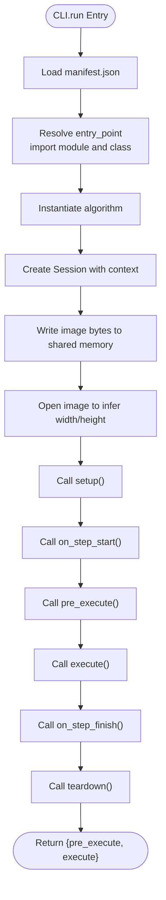

# Integration Testing

<cite>
**Referenced Files in This Document**
- [cli.py](file://procvision_algorithm_sdk/cli.py)
- [base.py](file://procvision_algorithm_sdk/base.py)
- [session.py](file://procvision_algorithm_sdk/session.py)
- [shared_memory.py](file://procvision_algorithm_sdk/shared_memory.py)
- [logger.py](file://procvision_algorithm_sdk/logger.py)
- [diagnostics.py](file://procvision_algorithm_sdk/diagnostics.py)
- [test_cli.py](file://tests/test_cli.py)
- [test_cli_validate.py](file://tests/test_cli_validate.py)
- [test_shared_memory.py](file://tests/test_shared_memory.py)
- [test_session.py](file://tests/test_session.py)
- [manifest.json](file://algorithm-example/manifest.json)
- [main.py](file://algorithm-example/algorithm_example/main.py)
- [README.md](file://README.md)
- [algorithm_dev_tutorial.md](file://algorithm_dev_tutorial.md)
- [spec.md](file://spec.md)
</cite>

## Table of Contents
1. [Introduction](#introduction)
2. [Project Structure](#project-structure)
3. [Core Components](#core-components)
4. [Architecture Overview](#architecture-overview)
5. [Detailed Component Analysis](#detailed-component-analysis)
6. [Dependency Analysis](#dependency-analysis)
7. [Performance Considerations](#performance-considerations)
8. [Troubleshooting Guide](#troubleshooting-guide)
9. [Conclusion](#conclusion)
10. [Appendices](#appendices)

## Introduction
This document explains how to develop integration tests using the CLI’s run command to simulate real-world execution scenarios. It focuses on how test_cli.py and test_cli_validate.py validate end-to-end workflows by:
- Loading actual algorithm implementations via manifest.json entry points
- Initializing sessions with context data
- Writing real image data to shared memory
- Triggering pre_execute and execute lifecycle methods
- Inspecting and verifying output structure (status, data, result_status, defect_rects)
It also demonstrates how integration tests validate the interaction between manifest.json configuration, entry point resolution, PID matching, and parameter passing, including both successful execution paths and error conditions such as unsupported PIDs or malformed images. Finally, it provides best practices for organizing test assets and validating diagnostic outputs.

## Project Structure
The repository organizes the SDK, example algorithm, and tests as follows:
- SDK core: CLI, base algorithm interface, session, shared memory, logging, and diagnostics
- Example algorithm: manifest.json and a minimal algorithm implementation
- Tests: unit and integration-style tests for CLI and shared memory/session behavior

**Diagram sources**
- [cli.py](file://procvision_algorithm_sdk/cli.py#L1-L615)
- [base.py](file://procvision_algorithm_sdk/base.py#L1-L58)
- [session.py](file://procvision_algorithm_sdk/session.py#L1-L36)
- [shared_memory.py](file://procvision_algorithm_sdk/shared_memory.py#L1-L53)
- [logger.py](file://procvision_algorithm_sdk/logger.py#L1-L24)
- [diagnostics.py](file://procvision_algorithm_sdk/diagnostics.py#L1-L12)
- [test_cli.py](file://tests/test_cli.py#L1-L20)
- [test_cli_validate.py](file://tests/test_cli_validate.py#L1-L11)
- [test_shared_memory.py](file://tests/test_shared_memory.py#L1-L16)
- [test_session.py](file://tests/test_session.py#L1-L24)
- [manifest.json](file://algorithm-example/manifest.json#L1-L25)
- [main.py](file://algorithm-example/algorithm_example/main.py#L1-L150)

**Section sources**
- [README.md](file://README.md#L1-L116)
- [algorithm_dev_tutorial.md](file://algorithm_dev_tutorial.md#L137-L156)
- [spec.md](file://spec.md#L823-L852)

## Core Components
- CLI run command orchestrates end-to-end execution:
  - Loads manifest.json and resolves entry_point to import the algorithm class
  - Initializes a Session with context data
  - Writes real image bytes to shared memory
  - Calls setup/on_step_start/pre_execute/execute/on_step_finish/teardown
  - Returns structured results for assertions
- Shared memory abstraction:
  - Provides dev_write_image_to_shared_memory and read_image_from_shared_memory
  - Handles fallback to zero-filled arrays when metadata is invalid or image parsing fails
- Session:
  - Stores id, context, and transient state with JSON-serializable constraints
- BaseAlgorithm:
  - Defines lifecycle hooks and required methods for pre_execute and execute
- Logger and Diagnostics:
  - Structured logging and diagnostic publishing for observability

Key integration test responsibilities:
- Validate manifest.json presence and structure
- Verify entry point resolution and inheritance from BaseAlgorithm
- Confirm supported_pids alignment between manifest and algorithm.get_info
- Exercise pre_execute and execute return shapes
- Validate error handling for unsupported PIDs and malformed images
- Inspect output structure: status, data, result_status, defect_rects/ng_reason

**Section sources**
- [cli.py](file://procvision_algorithm_sdk/cli.py#L1-L615)
- [shared_memory.py](file://procvision_algorithm_sdk/shared_memory.py#L1-L53)
- [session.py](file://procvision_algorithm_sdk/session.py#L1-L36)
- [base.py](file://procvision_algorithm_sdk/base.py#L1-L58)
- [logger.py](file://procvision_algorithm_sdk/logger.py#L1-L24)
- [diagnostics.py](file://procvision_algorithm_sdk/diagnostics.py#L1-L12)

## Architecture Overview
The integration test flow simulates a real execution pipeline from CLI to algorithm implementation.

**Diagram sources**
- [cli.py](file://procvision_algorithm_sdk/cli.py#L163-L226)
- [cli.py](file://procvision_algorithm_sdk/cli.py#L286-L326)
- [shared_memory.py](file://procvision_algorithm_sdk/shared_memory.py#L1-L53)
- [session.py](file://procvision_algorithm_sdk/session.py#L1-L36)
- [base.py](file://procvision_algorithm_sdk/base.py#L1-L58)

## Detailed Component Analysis

### CLI Integration Workflow
- Manifest loading and entry point resolution:
  - Validates manifest existence and loads JSON
  - Splits entry_point into module and class, imports, and verifies subclass of BaseAlgorithm
- Session initialization:
  - Creates a unique session id and context including product_code, operator, and trace_id
- Shared memory write:
  - Reads raw image bytes and writes to dev shared memory under a deterministic id
- Image metadata:
  - Attempts to parse image dimensions; falls back to defaults if parsing fails
- Lifecycle orchestration:
  - Calls setup, on_step_start, pre_execute, execute, on_step_finish, teardown
- Output:
  - Returns a dictionary containing pre_execute and execute results for assertion

**Diagram sources**
- [cli.py](file://procvision_algorithm_sdk/cli.py#L163-L226)
- [cli.py](file://procvision_algorithm_sdk/cli.py#L286-L326)

**Section sources**
- [cli.py](file://procvision_algorithm_sdk/cli.py#L1-L615)

### Algorithm Implementation Under Test
The example algorithm demonstrates:
- Supported PIDs and get_info steps
- Pre-execution preparation returning calibration_rects and debug info
- Execution returning OK/NG with result_status, defect_rects/ng_reason, and position_rects
- Lifecycle hooks for timing and diagnostics

**Diagram sources**
- [base.py](file://procvision_algorithm_sdk/base.py#L1-L58)
- [main.py](file://algorithm-example/algorithm_example/main.py#L1-L150)

**Section sources**
- [main.py](file://algorithm-example/algorithm_example/main.py#L1-L150)
- [manifest.json](file://algorithm-example/manifest.json#L1-L25)

### Shared Memory Behavior
- dev_write_image_to_shared_memory stores bytes or arrays under a shared_mem_id
- read_image_from_shared_memory:
  - Returns a 3-channel uint8 array when metadata is valid and data is compatible
  - Parses PIL-compatible bytes into arrays
  - Falls back to zero-filled arrays when metadata is invalid or parsing fails

**Diagram sources**
- [shared_memory.py](file://procvision_algorithm_sdk/shared_memory.py#L1-L53)

**Section sources**
- [shared_memory.py](file://procvision_algorithm_sdk/shared_memory.py#L1-L53)
- [test_shared_memory.py](file://tests/test_shared_memory.py#L1-L16)

### Session State Management
- Session holds id, context, and a JSON-serializable state store
- set/get/delete/exists enforce JSON serializability
- Used to pass context and persist step timing for diagnostics

**Diagram sources**
- [session.py](file://procvision_algorithm_sdk/session.py#L1-L36)

**Section sources**
- [session.py](file://procvision_algorithm_sdk/session.py#L1-L36)
- [test_session.py](file://tests/test_session.py#L1-L24)

### CLI Validation Workflow
The validate command performs a comprehensive smoke test:
- Manifest existence and loadability
- Required fields presence
- Entry point import and subclass verification
- get_info correctness and supported_pids match
- Smoke execution of pre_execute and execute, checking return shapes and statuses
- Optional offline zip validation for wheels/requirements presence

**Diagram sources**
- [cli.py](file://procvision_algorithm_sdk/cli.py#L1-L161)
- [cli.py](file://procvision_algorithm_sdk/cli.py#L163-L212)

**Section sources**
- [cli.py](file://procvision_algorithm_sdk/cli.py#L1-L161)
- [cli.py](file://procvision_algorithm_sdk/cli.py#L163-L212)

## Dependency Analysis
- CLI depends on:
  - BaseAlgorithm for lifecycle and method contracts
  - Session for state/context
  - Shared memory for image transport
  - Logger and Diagnostics for observability
- Algorithm under test depends on BaseAlgorithm and shared memory utilities
- Tests depend on CLI functions and example algorithm assets

**Diagram sources**
- [cli.py](file://procvision_algorithm_sdk/cli.py#L1-L615)
- [base.py](file://procvision_algorithm_sdk/base.py#L1-L58)
- [session.py](file://procvision_algorithm_sdk/session.py#L1-L36)
- [shared_memory.py](file://procvision_algorithm_sdk/shared_memory.py#L1-L53)
- [logger.py](file://procvision_algorithm_sdk/logger.py#L1-L24)
- [diagnostics.py](file://procvision_algorithm_sdk/diagnostics.py#L1-L12)
- [main.py](file://algorithm-example/algorithm_example/main.py#L1-L150)
- [test_cli.py](file://tests/test_cli.py#L1-L20)
- [test_cli_validate.py](file://tests/test_cli_validate.py#L1-L11)
- [test_shared_memory.py](file://tests/test_shared_memory.py#L1-L16)
- [test_session.py](file://tests/test_session.py#L1-L24)

**Section sources**
- [cli.py](file://procvision_algorithm_sdk/cli.py#L1-L615)
- [base.py](file://procvision_algorithm_sdk/base.py#L1-L58)
- [session.py](file://procvision_algorithm_sdk/session.py#L1-L36)
- [shared_memory.py](file://procvision_algorithm_sdk/shared_memory.py#L1-L53)
- [main.py](file://algorithm-example/algorithm_example/main.py#L1-L150)
- [test_cli.py](file://tests/test_cli.py#L1-L20)
- [test_cli_validate.py](file://tests/test_cli_validate.py#L1-L11)
- [test_shared_memory.py](file://tests/test_shared_memory.py#L1-L16)
- [test_session.py](file://tests/test_session.py#L1-L24)

## Performance Considerations
- Image parsing and conversion:
  - Prefer valid JPEG/PNG files to avoid fallback costs
  - Large images increase pre_execute/execute latency; keep test assets reasonably sized
- Shared memory reads:
  - Ensure width/height metadata is correct to avoid fallback to zero-filled arrays
- Lifecycle hooks:
  - Avoid heavy operations in setup/teardown for fast iteration during integration tests
- CLI exit codes:
  - Use exit code 0 for OK and 1 for ERROR to integrate with CI pipelines

[No sources needed since this section provides general guidance]

## Troubleshooting Guide
Common issues and resolutions:
- Unsupported PID:
  - Symptom: pre_execute/execute returns ERROR with a specific error_code
  - Cause: pid not in supported_pids
  - Fix: update manifest.json supported_pids or pass a supported pid
- Malformed image:
  - Symptom: pre_execute/execute returns ERROR with a message indicating empty image data
  - Cause: invalid image path or corrupted image bytes
  - Fix: provide a valid JPEG/PNG file; ensure image metadata is correct
- Missing manifest or project directory:
  - Symptom: CLI reports missing manifest or project directory
  - Fix: ensure manifest.json exists in the project root and the path is correct
- JSON parameter validation:
  - Symptom: CLI rejects --params argument
  - Fix: pass a valid JSON string for user_params
- Shared memory fallback:
  - Symptom: unexpected zero-filled arrays
  - Cause: invalid width/height metadata or unparsable image bytes
  - Fix: ensure correct metadata and valid image bytes

**Section sources**
- [cli.py](file://procvision_algorithm_sdk/cli.py#L559-L584)
- [cli.py](file://procvision_algorithm_sdk/cli.py#L163-L226)
- [shared_memory.py](file://procvision_algorithm_sdk/shared_memory.py#L1-L53)
- [test_shared_memory.py](file://tests/test_shared_memory.py#L1-L16)

## Conclusion
Integration tests using the CLI’s run command provide a robust way to validate end-to-end workflows. By leveraging manifest.json configuration, entry point resolution, session initialization, and shared memory image transport, tests can exercise pre_execute and execute lifecycles, verify output structures, and handle both success and error paths. The provided examples demonstrate how to organize test assets and interpret diagnostic outputs for reliable algorithm validation.

[No sources needed since this section summarizes without analyzing specific files]

## Appendices

### Best Practices for Integration Testing
- Organize test assets:
  - Place small JPEG/PNG images in a dedicated test-assets directory
  - Use distinct PIDs aligned with manifest.json supported_pids
- Validate output structure:
  - Assert status is OK or ERROR appropriately
  - For NG results, verify result_status, ng_reason, and defect_rects
  - For OK results, verify presence of expected keys (e.g., position_rects)
- Parameterized tests:
  - Test multiple PIDs and user_params combinations
- Error condition coverage:
  - Unsupported PID
  - Malformed images
  - Missing manifest/project directory
  - Invalid JSON params
- Observability:
  - Capture and assert on diagnostic metrics published via Diagnostics
  - Use structured logs for traceability

**Section sources**
- [README.md](file://README.md#L1-L116)
- [algorithm_dev_tutorial.md](file://algorithm_dev_tutorial.md#L137-L156)
- [spec.md](file://spec.md#L823-L852)

### Example Test Scenarios
- Successful execution:
  - Use a valid PID from manifest.json
  - Provide a valid JPEG/PNG image
  - Assert pre_execute status OK and execute status OK
  - For step_index 1, expect result_status OK and position_rects
- Error conditions:
  - Unsupported PID: assert pre_execute/execute status ERROR with error_code
  - Malformed image: assert pre_execute/execute status ERROR with image empty message
  - Missing project: assert CLI reports missing manifest or project directory
  - Invalid params JSON: assert CLI rejects the argument

**Section sources**
- [test_cli.py](file://tests/test_cli.py#L1-L20)
- [test_cli_validate.py](file://tests/test_cli_validate.py#L1-L11)
- [cli.py](file://procvision_algorithm_sdk/cli.py#L559-L584)
- [manifest.json](file://algorithm-example/manifest.json#L1-L25)
- [main.py](file://algorithm-example/algorithm_example/main.py#L1-L150)