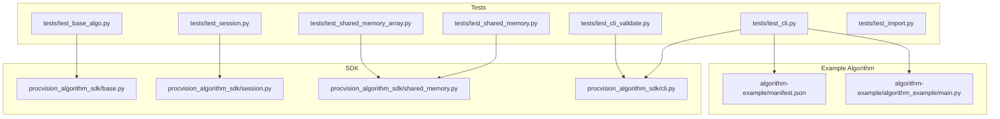
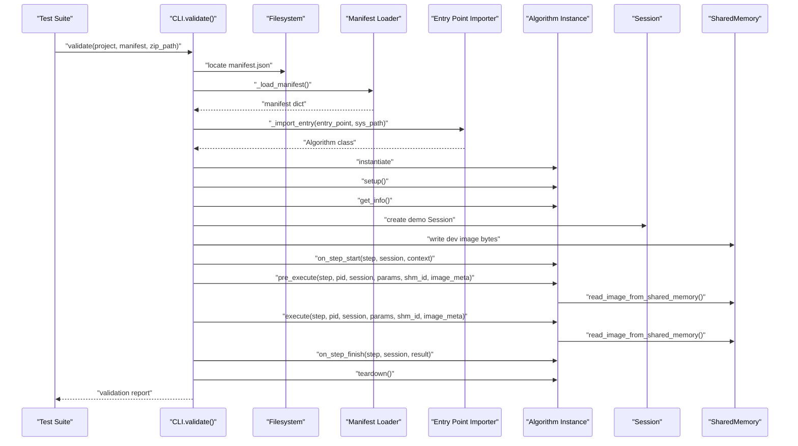
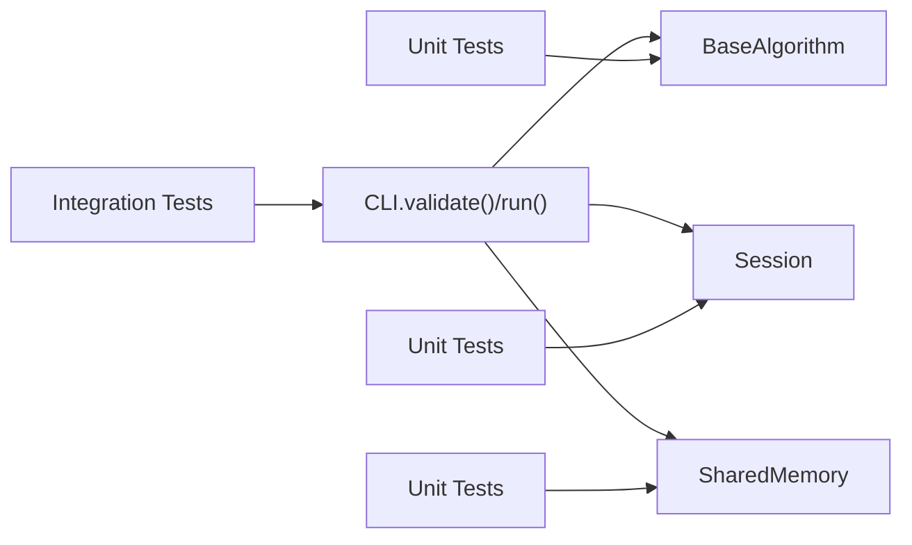

# Testing and Validation

<cite>
**Referenced Files in This Document**
- [README.md](file://README.md)
- [pyproject.toml](file://pyproject.toml)
- [procvision_algorithm_sdk/base.py](file://procvision_algorithm_sdk/base.py)
- [procvision_algorithm_sdk/session.py](file://procvision_algorithm_sdk/session.py)
- [procvision_algorithm_sdk/shared_memory.py](file://procvision_algorithm_sdk/shared_memory.py)
- [procvision_algorithm_sdk/cli.py](file://procvision_algorithm_sdk/cli.py)
- [tests/test_base_algo.py](file://tests/test_base_algo.py)
- [tests/test_session.py](file://tests/test_session.py)
- [tests/test_shared_memory.py](file://tests/test_shared_memory.py)
- [tests/test_shared_memory_array.py](file://tests/test_shared_memory_array.py)
- [tests/test_cli.py](file://tests/test_cli.py)
- [tests/test_cli_validate.py](file://tests/test_cli_validate.py)
- [tests/test_import.py](file://tests/test_import.py)
- [algorithm-example/manifest.json](file://algorithm-example/manifest.json)
- [algorithm-example/algorithm_example/main.py](file://algorithm-example/algorithm_example/main.py)
</cite>

## Table of Contents
1. [Introduction](#introduction)
2. [Project Structure](#project-structure)
3. [Core Components](#core-components)
4. [Architecture Overview](#architecture-overview)
5. [Detailed Component Analysis](#detailed-component-analysis)
6. [Dependency Analysis](#dependency-analysis)
7. [Performance Considerations](#performance-considerations)
8. [Troubleshooting Guide](#troubleshooting-guide)
9. [Conclusion](#conclusion)
10. [Appendices](#appendices)

## Introduction
This document explains testing and validation practices for the ProcVision Algorithm SDK. It covers:
- Unit testing strategies for algorithm logic, session behavior, and shared memory operations
- Integration testing with the CLI’s run command using real image files
- Validation via procvision-cli validate, including manifest checks, entry point resolution, and smoke testing of lifecycle hooks
- Test structure examples from the tests/ directory
- Guidance on mocking shared memory and session objects
- Best practices for edge cases, error conditions, and performance boundaries
- How to interpret validation reports and troubleshoot failures
- The critical requirement to match supported_pids between manifest and get_info

## Project Structure
The repository organizes tests under tests/, with focused suites for:
- Algorithm base behavior and lifecycle
- Session state management
- Shared memory read/write and array handling
- CLI validate and run commands
- Import correctness and basic smoke tests

**Diagram sources**
- [procvision_algorithm_sdk/base.py](file://procvision_algorithm_sdk/base.py#L1-L58)
- [procvision_algorithm_sdk/session.py](file://procvision_algorithm_sdk/session.py#L1-L36)
- [procvision_algorithm_sdk/shared_memory.py](file://procvision_algorithm_sdk/shared_memory.py#L1-L53)
- [procvision_algorithm_sdk/cli.py](file://procvision_algorithm_sdk/cli.py#L1-L615)
- [tests/test_base_algo.py](file://tests/test_base_algo.py#L1-L65)
- [tests/test_session.py](file://tests/test_session.py#L1-L24)
- [tests/test_shared_memory.py](file://tests/test_shared_memory.py#L1-L16)
- [tests/test_shared_memory_array.py](file://tests/test_shared_memory_array.py#L1-L39)
- [tests/test_cli.py](file://tests/test_cli.py#L1-L20)
- [tests/test_cli_validate.py](file://tests/test_cli_validate.py#L1-L11)
- [tests/test_import.py](file://tests/test_import.py#L1-L15)
- [algorithm-example/manifest.json](file://algorithm-example/manifest.json#L1-L25)
- [algorithm-example/algorithm_example/main.py](file://algorithm-example/algorithm_example/main.py#L1-L150)

**Section sources**
- [README.md](file://README.md#L1-L116)
- [pyproject.toml](file://pyproject.toml#L1-L36)

## Core Components
- BaseAlgorithm: Defines the abstract interface and lifecycle hooks used by algorithm implementations. See [BaseAlgorithm](file://procvision_algorithm_sdk/base.py#L1-L58).
- Session: Provides a JSON-serializable state store and context for cross-step sharing. See [Session](file://procvision_algorithm_sdk/session.py#L1-L36).
- SharedMemory: Provides dev-time read/write helpers for images stored in memory. See [SharedMemory](file://procvision_algorithm_sdk/shared_memory.py#L1-L53).
- CLI: Implements validate and run commands, including manifest loading, entry point import, and smoke execution. See [CLI](file://procvision_algorithm_sdk/cli.py#L1-L615).

Key testing responsibilities:
- Unit tests validate algorithm logic, session semantics, and shared memory behavior independently.
- Integration tests exercise CLI run with real images and validate manifests and entry points.

**Section sources**
- [procvision_algorithm_sdk/base.py](file://procvision_algorithm_sdk/base.py#L1-L58)
- [procvision_algorithm_sdk/session.py](file://procvision_algorithm_sdk/session.py#L1-L36)
- [procvision_algorithm_sdk/shared_memory.py](file://procvision_algorithm_sdk/shared_memory.py#L1-L53)
- [procvision_algorithm_sdk/cli.py](file://procvision_algorithm_sdk/cli.py#L1-L615)

## Architecture Overview
The validation pipeline performs manifest checks, imports the entry point, instantiates the algorithm, and runs a smoke test of lifecycle hooks and execution methods.

**Diagram sources**
- [procvision_algorithm_sdk/cli.py](file://procvision_algorithm_sdk/cli.py#L1-L615)
- [procvision_algorithm_sdk/shared_memory.py](file://procvision_algorithm_sdk/shared_memory.py#L1-L53)
- [procvision_algorithm_sdk/session.py](file://procvision_algorithm_sdk/session.py#L1-L36)
- [procvision_algorithm_sdk/base.py](file://procvision_algorithm_sdk/base.py#L1-L58)

## Detailed Component Analysis

### Unit Testing Strategies

#### Algorithm Logic and Lifecycle Hooks
- Objective: Verify algorithm behavior for supported_pids, pre_execute, execute, and lifecycle hooks.
- Tests demonstrate:
  - get_info returns a dictionary with supported_pids and steps
  - pre_execute validates pid and image availability
  - execute returns OK/ERROR and structured data
  - Lifecycle hooks are invoked during validate/run smoke test

References:
- [DummyAlgo](file://tests/test_base_algo.py#L1-L65)
- [BaseAlgorithm](file://procvision_algorithm_sdk/base.py#L1-L58)

Best practices:
- Test supported_pids alignment between manifest and get_info
- Validate error paths (invalid pid, empty image)
- Ensure deterministic debug fields and result schemas

**Section sources**
- [tests/test_base_algo.py](file://tests/test_base_algo.py#L1-L65)
- [procvision_algorithm_sdk/base.py](file://procvision_algorithm_sdk/base.py#L1-L58)

#### Session Behavior
- Objective: Validate state store semantics and serialization constraints.
- Tests verify:
  - Setting and retrieving keys
  - Existence checks and deletion
  - Non-serializable values raise TypeError

References:
- [Session](file://procvision_algorithm_sdk/session.py#L1-L36)
- [Session tests](file://tests/test_session.py#L1-L24)

Mocking guidance:
- Replace Session with a minimal stub that records calls and returns controlled values for state queries.

**Section sources**
- [tests/test_session.py](file://tests/test_session.py#L1-L24)
- [procvision_algorithm_sdk/session.py](file://procvision_algorithm_sdk/session.py#L1-L36)

#### Shared Memory Operations
- Objective: Validate read/write behavior for bytes and arrays, color space conversions, and fallbacks.
- Tests cover:
  - Writing bytes and reading back a valid image array
  - Passing NumPy arrays directly (RGB, grayscale, BGR)
  - Color space conversion from BGR to RGB
  - Fallback to zero-filled array when metadata is invalid

References:
- [SharedMemory](file://procvision_algorithm_sdk/shared_memory.py#L1-L53)
- [Bytes fallback test](file://tests/test_shared_memory.py#L1-L16)
- [Array handling tests](file://tests/test_shared_memory_array.py#L1-L39)

Mocking guidance:
- Replace dev_write_image_to_shared_memory and read_image_from_shared_memory with deterministic stubs returning known arrays or None.

**Section sources**
- [tests/test_shared_memory.py](file://tests/test_shared_memory.py#L1-L16)
- [tests/test_shared_memory_array.py](file://tests/test_shared_memory_array.py#L1-L39)
- [procvision_algorithm_sdk/shared_memory.py](file://procvision_algorithm_sdk/shared_memory.py#L1-L53)

### Integration Testing with CLI Run Command
- Objective: Exercise CLI run with a real image file and verify pre_execute/execute outcomes.
- Tests demonstrate:
  - validate against the example algorithm project passes
  - run produces pre_execute and execute results with OK/ERROR statuses

References:
- [CLI validate/run](file://procvision_algorithm_sdk/cli.py#L1-L615)
- [CLI integration tests](file://tests/test_cli.py#L1-L20)
- [Example manifest](file://algorithm-example/manifest.json#L1-L25)
- [Example algorithm](file://algorithm-example/algorithm_example/main.py#L1-L150)

Guidance:
- Use a small JPEG/PNG image for testing
- Ensure pid is in supported_pids
- Validate that image_meta width/height are reasonable

**Section sources**
- [tests/test_cli.py](file://tests/test_cli.py#L1-L20)
- [procvision_algorithm_sdk/cli.py](file://procvision_algorithm_sdk/cli.py#L1-L615)
- [algorithm-example/manifest.json](file://algorithm-example/manifest.json#L1-L25)
- [algorithm-example/algorithm_example/main.py](file://algorithm-example/algorithm_example/main.py#L1-L150)

### Validation via procvision-cli validate
- Manifest checks:
  - manifest.json existence and loadability
  - presence of required fields (name, version, entry_point, supported_pids)
- Entry point resolution:
  - Import entry_point and verify subclass of BaseAlgorithm
- Smoke testing:
  - get_info returns a dict with steps
  - supported_pids match between manifest and get_info
  - on_step_start/on_step_finish lifecycle hooks invoked
  - pre_execute and execute return dicts with valid status values
  - execute data schema validated (result_status, NG reasons, defect_rects limits)
- Zip packaging checks (optional):
  - manifest.json, requirements.txt, and wheels presence

References:
- [CLI validate](file://procvision_algorithm_sdk/cli.py#L1-L615)
- [Validation test](file://tests/test_cli_validate.py#L1-L11)

Interpretation tips:
- Summary status PASS requires all checks to pass
- FAIL indicates at least one check failure
- Inspect individual check messages to pinpoint issues

**Section sources**
- [tests/test_cli_validate.py](file://tests/test_cli_validate.py#L1-L11)
- [procvision_algorithm_sdk/cli.py](file://procvision_algorithm_sdk/cli.py#L1-L615)

### Test Structure Examples from tests/
- [test_base_algo.py](file://tests/test_base_algo.py#L1-L65): Demonstrates a minimal algorithm implementation and lifecycle assertions
- [test_session.py](file://tests/test_session.py#L1-L24): Validates Session state store and serialization constraints
- [test_shared_memory.py](file://tests/test_shared_memory.py#L1-L16): Bytes fallback behavior
- [test_shared_memory_array.py](file://tests/test_shared_memory_array.py#L1-L39): Array handling and color space conversions
- [test_cli.py](file://tests/test_cli.py#L1-L20): CLI validate/run smoke tests
- [test_cli_validate.py](file://tests/test_cli_validate.py#L1-L11): Missing manifest handling
- [test_import.py](file://tests/test_import.py#L1-L15): Basic import correctness

**Section sources**
- [tests/test_base_algo.py](file://tests/test_base_algo.py#L1-L65)
- [tests/test_session.py](file://tests/test_session.py#L1-L24)
- [tests/test_shared_memory.py](file://tests/test_shared_memory.py#L1-L16)
- [tests/test_shared_memory_array.py](file://tests/test_shared_memory_array.py#L1-L39)
- [tests/test_cli.py](file://tests/test_cli.py#L1-L20)
- [tests/test_cli_validate.py](file://tests/test_cli_validate.py#L1-L11)
- [tests/test_import.py](file://tests/test_import.py#L1-L15)

### Mocking Shared Memory and Session Objects
- Shared memory:
  - Replace dev_write_image_to_shared_memory with a stub that stores bytes/arrays in a controlled dict
  - Replace read_image_from_shared_memory with a stub that returns known arrays or None based on metadata
- Session:
  - Provide a minimal stub with id/context and a state store that behaves deterministically
  - Ensure set raises TypeError for non-serializable values

References:
- [SharedMemory](file://procvision_algorithm_sdk/shared_memory.py#L1-L53)
- [Session](file://procvision_algorithm_sdk/session.py#L1-L36)

**Section sources**
- [procvision_algorithm_sdk/shared_memory.py](file://procvision_algorithm_sdk/shared_memory.py#L1-L53)
- [procvision_algorithm_sdk/session.py](file://procvision_algorithm_sdk/session.py#L1-L36)

### Validation Best Practices
- Edge cases:
  - Empty or invalid image_meta (width/height)
  - Unsupported product codes
  - Non-serializable session values
  - Missing manifest fields
- Error conditions:
  - Ensure pre_execute/execute return ERROR with meaningful messages
  - Validate that lifecycle hooks do not crash the algorithm
- Performance boundaries:
  - Measure and log latency via debug fields
  - Validate defect_rects count limits in NG cases
- Manifest and get_info alignment:
  - supported_pids must match exactly between manifest and get_info
- Reproducibility:
  - Use deterministic test images and fixed parameters
  - Clear shared memory between tests

**Section sources**
- [procvision_algorithm_sdk/cli.py](file://procvision_algorithm_sdk/cli.py#L1-L615)
- [procvision_algorithm_sdk/shared_memory.py](file://procvision_algorithm_sdk/shared_memory.py#L1-L53)
- [procvision_algorithm_sdk/session.py](file://procvision_algorithm_sdk/session.py#L1-L36)

## Dependency Analysis
The CLI depends on BaseAlgorithm, Session, and SharedMemory to perform validation and run commands. Tests isolate these dependencies and verify their interactions.

**Diagram sources**
- [procvision_algorithm_sdk/cli.py](file://procvision_algorithm_sdk/cli.py#L1-L615)
- [procvision_algorithm_sdk/base.py](file://procvision_algorithm_sdk/base.py#L1-L58)
- [procvision_algorithm_sdk/session.py](file://procvision_algorithm_sdk/session.py#L1-L36)
- [procvision_algorithm_sdk/shared_memory.py](file://procvision_algorithm_sdk/shared_memory.py#L1-L53)

**Section sources**
- [procvision_algorithm_sdk/cli.py](file://procvision_algorithm_sdk/cli.py#L1-L615)
- [procvision_algorithm_sdk/base.py](file://procvision_algorithm_sdk/base.py#L1-L58)
- [procvision_algorithm_sdk/session.py](file://procvision_algorithm_sdk/session.py#L1-L36)
- [procvision_algorithm_sdk/shared_memory.py](file://procvision_algorithm_sdk/shared_memory.py#L1-L53)

## Performance Considerations
- Minimize image decoding overhead by passing pre-validated image_meta
- Avoid heavy computations in pre_execute; keep it lightweight
- Log latency in debug fields for profiling
- Limit defect_rects counts to prevent excessive payload sizes

[No sources needed since this section provides general guidance]

## Troubleshooting Guide
Common issues and resolutions:
- Manifest not found or unreadable:
  - Ensure manifest.json exists and is valid JSON
  - Use validate with --manifest to point to a specific path
- Entry point import fails:
  - Verify entry_point format and module/class names
  - Confirm sys_path is correct when importing from project
- supported_pids mismatch:
  - Align manifest.supported_pids with algorithm.get_info()["supported_pids"]
- pre_execute/execute errors:
  - Validate pid membership and image availability
  - Check image_meta width/height and color_space
- Session set failures:
  - Ensure values are JSON serializable

Interpreting validation reports:
- Summary status PASS indicates all checks passed
- FAIL indicates at least one check failed; inspect check messages for details
- For zip packaging, confirm manifest.json, requirements.txt, and wheels presence

**Section sources**
- [tests/test_cli_validate.py](file://tests/test_cli_validate.py#L1-L11)
- [procvision_algorithm_sdk/cli.py](file://procvision_algorithm_sdk/cli.py#L1-L615)

## Conclusion
The ProcVision Algorithm SDK provides robust unit and integration tests, along with a comprehensive CLI validate command. By aligning manifest and algorithm metadata, validating lifecycle hooks, and exercising shared memory and session behavior, teams can ensure reliable algorithm deployment and predictable runtime performance.

[No sources needed since this section summarizes without analyzing specific files]

## Appendices

### Example Algorithm Implementation Reference
- Example algorithm demonstrates supported_pids, lifecycle hooks, and structured outputs. See [AlgorithmExample](file://algorithm-example/algorithm_example/main.py#L1-L150).

**Section sources**
- [algorithm-example/algorithm_example/main.py](file://algorithm-example/algorithm_example/main.py#L1-L150)