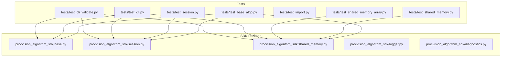
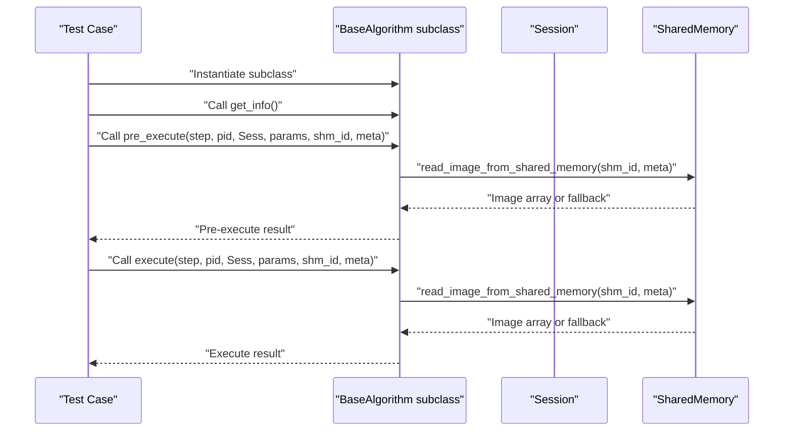
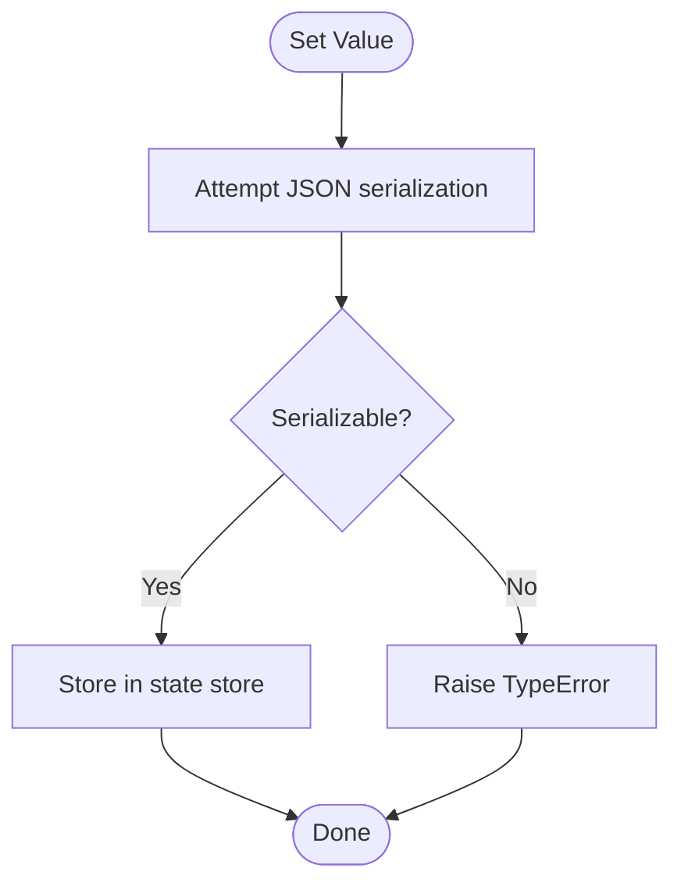
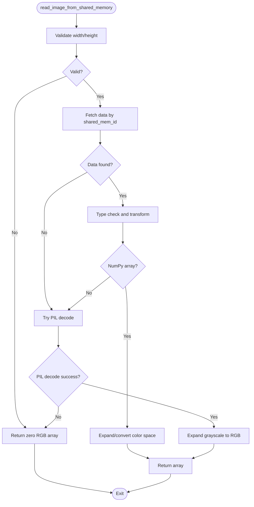
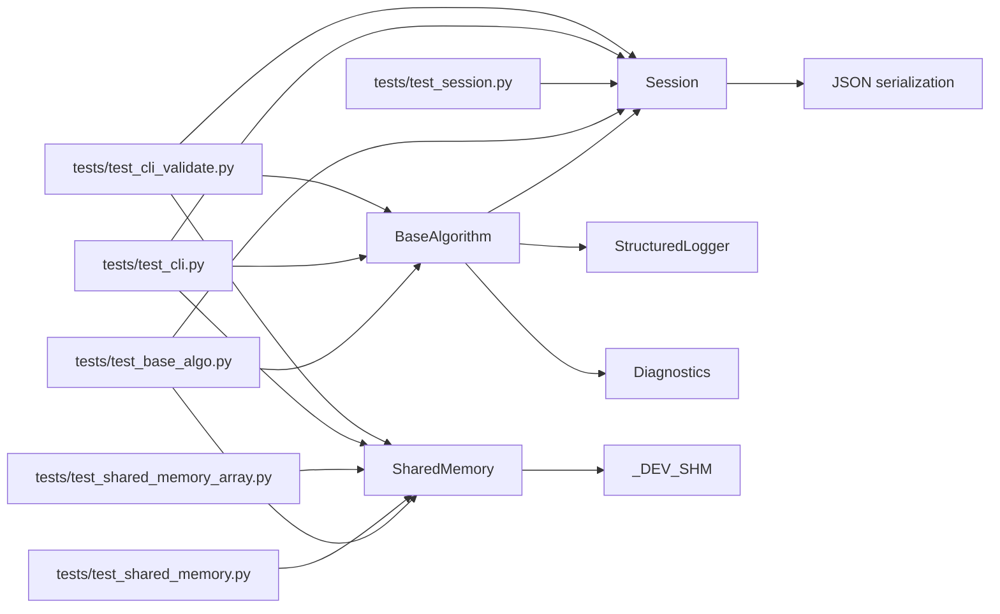

# Unit Testing

<cite>
**Referenced Files in This Document**
- [README.md](file://README.md)
- [pyproject.toml](file://pyproject.toml)
- [procvision_algorithm_sdk/base.py](file://procvision_algorithm_sdk/base.py)
- [procvision_algorithm_sdk/session.py](file://procvision_algorithm_sdk/session.py)
- [procvision_algorithm_sdk/shared_memory.py](file://procvision_algorithm_sdk/shared_memory.py)
- [procvision_algorithm_sdk/logger.py](file://procvision_algorithm_sdk/logger.py)
- [procvision_algorithm_sdk/diagnostics.py](file://procvision_algorithm_sdk/diagnostics.py)
- [tests/test_base_algo.py](file://tests/test_base_algo.py)
- [tests/test_session.py](file://tests/test_session.py)
- [tests/test_shared_memory.py](file://tests/test_shared_memory.py)
- [tests/test_shared_memory_array.py](file://tests/test_shared_memory_array.py)
- [tests/test_import.py](file://tests/test_import.py)
- [tests/test_cli.py](file://tests/test_cli.py)
- [tests/test_cli_validate.py](file://tests/test_cli_validate.py)
</cite>

## Table of Contents
1. [Introduction](#introduction)
2. [Project Structure](#project-structure)
3. [Core Components](#core-components)
4. [Architecture Overview](#architecture-overview)
5. [Detailed Component Analysis](#detailed-component-analysis)
6. [Dependency Analysis](#dependency-analysis)
7. [Performance Considerations](#performance-considerations)
8. [Troubleshooting Guide](#troubleshooting-guide)
9. [Conclusion](#conclusion)
10. [Appendices](#appendices)

## Introduction
This document provides practical guidance for unit testing the ProcVision Algorithm SDK. It focuses on validating:
- BaseAlgorithm lifecycle methods and abstract method implementations
- Session state operations (get, set, delete, exists) and JSON serialization constraints
- SharedMemory image transfer mechanisms and fallback behavior
- Edge cases such as invalid keys, non-serializable values, and missing manifest entries

The examples reference concrete test files and highlight how to instantiate algorithm classes, mock dependencies, and assert expected behaviors. Guidance is included on structuring test files, using fixtures, and ensuring full coverage of public interfaces.

## Project Structure
The SDK organizes tests under the tests/ directory and core modules under procvision_algorithm_sdk/. The README outlines the package’s purpose and interface expectations, while pyproject.toml defines build metadata and scripts.

**Diagram sources**
- [procvision_algorithm_sdk/base.py](file://procvision_algorithm_sdk/base.py#L1-L58)
- [procvision_algorithm_sdk/session.py](file://procvision_algorithm_sdk/session.py#L1-L36)
- [procvision_algorithm_sdk/shared_memory.py](file://procvision_algorithm_sdk/shared_memory.py#L1-L53)
- [tests/test_base_algo.py](file://tests/test_base_algo.py#L1-L65)
- [tests/test_session.py](file://tests/test_session.py#L1-L24)
- [tests/test_shared_memory.py](file://tests/test_shared_memory.py#L1-L16)
- [tests/test_shared_memory_array.py](file://tests/test_shared_memory_array.py#L1-L39)
- [tests/test_import.py](file://tests/test_import.py#L1-L15)
- [tests/test_cli.py](file://tests/test_cli.py#L1-L20)
- [tests/test_cli_validate.py](file://tests/test_cli_validate.py#L1-L11)

**Section sources**
- [README.md](file://README.md#L1-L116)
- [pyproject.toml](file://pyproject.toml#L1-L36)

## Core Components
- BaseAlgorithm: Defines lifecycle hooks and abstract methods that subclasses must implement. It integrates logging and diagnostics and exposes supported product identifiers.
- Session: Manages per-run state with JSON-serialization constraints and provides context for the algorithm.
- SharedMemory: Provides development-time helpers to write and read images to/from a dictionary-backed store, including fallback behavior and color-space conversions.

Key responsibilities:
- BaseAlgorithm enforces contract compliance via abstract methods and lifecycle hooks.
- Session ensures state is JSON serializable and offers CRUD-like operations.
- SharedMemory encapsulates image transfer semantics and handles various input formats.

**Section sources**
- [procvision_algorithm_sdk/base.py](file://procvision_algorithm_sdk/base.py#L1-L58)
- [procvision_algorithm_sdk/session.py](file://procvision_algorithm_sdk/session.py#L1-L36)
- [procvision_algorithm_sdk/shared_memory.py](file://procvision_algorithm_sdk/shared_memory.py#L1-L53)

## Architecture Overview
The tests exercise the SDK’s public interfaces and validate behavior across components. The CLI tests demonstrate end-to-end validation and execution flows that rely on BaseAlgorithm, Session, and SharedMemory.

**Diagram sources**
- [tests/test_base_algo.py](file://tests/test_base_algo.py#L1-L65)
- [procvision_algorithm_sdk/base.py](file://procvision_algorithm_sdk/base.py#L1-L58)
- [procvision_algorithm_sdk/session.py](file://procvision_algorithm_sdk/session.py#L1-L36)
- [procvision_algorithm_sdk/shared_memory.py](file://procvision_algorithm_sdk/shared_memory.py#L1-L53)

## Detailed Component Analysis

### BaseAlgorithm Lifecycle and Abstract Methods
- Purpose: Enforce a consistent contract for algorithm implementations, including lifecycle hooks and abstract methods.
- Key behaviors to test:
  - Proper implementation of get_info(), pre_execute(), and execute().
  - Lifecycle hooks (setup, teardown, on_step_start, on_step_finish, reset) are callable and do not raise unexpected exceptions.
  - Subclasses define supported product identifiers and steps.

Recommended testing approach:
- Instantiate a minimal subclass that implements abstract methods.
- Verify get_info() returns a dictionary with required fields.
- Exercise pre_execute() and execute() with a valid Session and shared memory identifier.
- Assert expected status values and presence of required keys in results.

Edge cases:
- Unsupported product ID should yield an error result.
- Missing or invalid image data should yield an error result.

Example references:
- [DummyAlgo class and test flow](file://tests/test_base_algo.py#L1-L65)
- [BaseAlgorithm abstract contract](file://procvision_algorithm_sdk/base.py#L1-L58)

**Section sources**
- [tests/test_base_algo.py](file://tests/test_base_algo.py#L1-L65)
- [procvision_algorithm_sdk/base.py](file://procvision_algorithm_sdk/base.py#L1-L58)

### Session State Operations and JSON Serialization Constraints
- Purpose: Provide a per-run context and state store with JSON-serialization constraints.
- Key behaviors to test:
  - CRUD operations: get(key), set(key, value), delete(key), exists(key).
  - Non-serializable values should raise a TypeError during set().
  - Context is accessible and copied safely.

Recommended testing approach:
- Initialize Session with an ID and optional context.
- Store and retrieve values; assert equality.
- Delete a key and confirm existence is false.
- Attempt to set a non-serializable value and assert TypeError.

Edge cases:
- Using invalid keys (e.g., non-existent keys) should return defaults gracefully.
- Setting values that are not JSON serializable should raise TypeError.

Example references:
- [Session state tests](file://tests/test_session.py#L1-L24)
- [Session implementation](file://procvision_algorithm_sdk/session.py#L1-L36)

**Diagram sources**
- [procvision_algorithm_sdk/session.py](file://procvision_algorithm_sdk/session.py#L1-L36)

**Section sources**
- [tests/test_session.py](file://tests/test_session.py#L1-L24)
- [procvision_algorithm_sdk/session.py](file://procvision_algorithm_sdk/session.py#L1-L36)

### SharedMemory Image Transfer Mechanisms and Fallback Behavior
- Purpose: Provide development-time image transfer helpers and robust fallback behavior.
- Key behaviors to test:
  - Writing raw bytes and reading back as an image array.
  - Writing NumPy arrays and verifying shape, color space conversion, and expansion from grayscale.
  - Fallback to zero-filled RGB array when metadata is invalid or data is unreadable.

Recommended testing approach:
- Write non-image bytes and assert fallback produces a valid RGB array with expected dimensions.
- Write a NumPy array (RGB) and assert identity.
- Write a grayscale array and assert expansion to RGB.
- Write a BGR array and assert conversion to RGB.
- Validate color_space handling and dimension checks.

Edge cases:
- Missing width/height or non-positive dimensions should return None from read path.
- Unreadable image bytes should fall back to zero-filled RGB array.

Example references:
- [Fallback behavior test](file://tests/test_shared_memory.py#L1-L16)
- [Array handling tests](file://tests/test_shared_memory_array.py#L1-L39)
- [SharedMemory implementation](file://procvision_algorithm_sdk/shared_memory.py#L1-L53)

**Diagram sources**
- [procvision_algorithm_sdk/shared_memory.py](file://procvision_algorithm_sdk/shared_memory.py#L1-L53)

**Section sources**
- [tests/test_shared_memory.py](file://tests/test_shared_memory.py#L1-L16)
- [tests/test_shared_memory_array.py](file://tests/test_shared_memory_array.py#L1-L39)
- [procvision_algorithm_sdk/shared_memory.py](file://procvision_algorithm_sdk/shared_memory.py#L1-L53)

### CLI Validation and Execution Smoke Tests
- Purpose: Validate algorithm packages and perform smoke execution against example algorithms.
- Key behaviors to test:
  - Manifest validation returns PASS or FAIL depending on presence/validity.
  - Run command executes pre_execute and execute and validates result shapes.

Recommended testing approach:
- Call validate() on a valid example project and assert PASS.
- Call validate() on a non-existing directory and assert FAIL.
- Run algorithm example and assert pre_execute and execute statuses are OK or ERROR.

Example references:
- [CLI validation test](file://tests/test_cli_validate.py#L1-L11)
- [CLI run and validate tests](file://tests/test_cli.py#L1-L20)

**Section sources**
- [tests/test_cli_validate.py](file://tests/test_cli_validate.py#L1-L11)
- [tests/test_cli.py](file://tests/test_cli.py#L1-L20)

## Dependency Analysis
- BaseAlgorithm depends on Session for state and context, and integrates logger and diagnostics.
- Session depends on JSON serialization for state storage.
- SharedMemory is a dictionary-backed store used for development and testing.
- CLI tests depend on BaseAlgorithm, Session, and SharedMemory to validate end-to-end behavior.

**Diagram sources**
- [procvision_algorithm_sdk/base.py](file://procvision_algorithm_sdk/base.py#L1-L58)
- [procvision_algorithm_sdk/session.py](file://procvision_algorithm_sdk/session.py#L1-L36)
- [procvision_algorithm_sdk/shared_memory.py](file://procvision_algorithm_sdk/shared_memory.py#L1-L53)
- [tests/test_base_algo.py](file://tests/test_base_algo.py#L1-L65)
- [tests/test_session.py](file://tests/test_session.py#L1-L24)
- [tests/test_shared_memory.py](file://tests/test_shared_memory.py#L1-L16)
- [tests/test_shared_memory_array.py](file://tests/test_shared_memory_array.py#L1-L39)
- [tests/test_cli.py](file://tests/test_cli.py#L1-L20)
- [tests/test_cli_validate.py](file://tests/test_cli_validate.py#L1-L11)

**Section sources**
- [procvision_algorithm_sdk/base.py](file://procvision_algorithm_sdk/base.py#L1-L58)
- [procvision_algorithm_sdk/session.py](file://procvision_algorithm_sdk/session.py#L1-L36)
- [procvision_algorithm_sdk/shared_memory.py](file://procvision_algorithm_sdk/shared_memory.py#L1-L53)
- [tests/test_base_algo.py](file://tests/test_base_algo.py#L1-L65)
- [tests/test_session.py](file://tests/test_session.py#L1-L24)
- [tests/test_shared_memory.py](file://tests/test_shared_memory.py#L1-L16)
- [tests/test_shared_memory_array.py](file://tests/test_shared_memory_array.py#L1-L39)
- [tests/test_cli.py](file://tests/test_cli.py#L1-L20)
- [tests/test_cli_validate.py](file://tests/test_cli_validate.py#L1-L11)

## Performance Considerations
- Prefer dictionary-backed SharedMemory for fast in-memory tests; avoid heavy I/O.
- Minimize repeated image decoding by caching small test assets.
- Use deterministic image_meta with known dimensions to reduce branching in read paths.
- Keep tests focused on behavior rather than performance; reserve performance profiling for integration tests.

[No sources needed since this section provides general guidance]

## Troubleshooting Guide
Common issues and resolutions:
- Non-serializable values in Session.set(): Ensure values are JSON serializable (lists, dicts, primitives). If not, handle serialization upstream or use alternative storage.
  - Reference: [Session.set() raises TypeError for non-serializable values](file://tests/test_session.py#L1-L24), [Session implementation](file://procvision_algorithm_sdk/session.py#L1-L36)
- Unsupported product ID in BaseAlgorithm: Return an error result with appropriate status and message.
  - Reference: [DummyAlgo error handling for unsupported PID](file://tests/test_base_algo.py#L1-L65)
- Missing or invalid image data: Expect None or fallback behavior; assert fallback produces a valid RGB array.
  - Reference: [Fallback behavior](file://tests/test_shared_memory.py#L1-L16), [SharedMemory fallback](file://procvision_algorithm_sdk/shared_memory.py#L1-L53)
- CLI validation failures: Confirm manifest.json exists and is valid; ensure entry_point points to a subclass of BaseAlgorithm.
  - Reference: [CLI validate behavior](file://tests/test_cli_validate.py#L1-L11), [CLI run behavior](file://tests/test_cli.py#L1-L20)

**Section sources**
- [tests/test_session.py](file://tests/test_session.py#L1-L24)
- [procvision_algorithm_sdk/session.py](file://procvision_algorithm_sdk/session.py#L1-L36)
- [tests/test_base_algo.py](file://tests/test_base_algo.py#L1-L65)
- [tests/test_shared_memory.py](file://tests/test_shared_memory.py#L1-L16)
- [procvision_algorithm_sdk/shared_memory.py](file://procvision_algorithm_sdk/shared_memory.py#L1-L53)
- [tests/test_cli_validate.py](file://tests/test_cli_validate.py#L1-L11)
- [tests/test_cli.py](file://tests/test_cli.py#L1-L20)

## Conclusion
The ProcVision Algorithm SDK provides a clear contract for algorithm implementations and robust testing utilities. By focusing on BaseAlgorithm lifecycle, Session state constraints, and SharedMemory image transfer, developers can ensure correctness across edge cases. The existing tests serve as templates for structuring new unit tests, mocking dependencies, and asserting expected outcomes.

[No sources needed since this section summarizes without analyzing specific files]

## Appendices

### How to Structure Test Files
- Place tests under tests/ with descriptive names (e.g., test_<component>.py).
- Use unittest.TestCase subclasses for each logical component.
- Keep tests isolated and deterministic; use development helpers for shared memory.

References:
- [BaseAlgorithm tests](file://tests/test_base_algo.py#L1-L65)
- [Session tests](file://tests/test_session.py#L1-L24)
- [SharedMemory tests](file://tests/test_shared_memory.py#L1-L16)
- [SharedMemory array tests](file://tests/test_shared_memory_array.py#L1-L39)

### Using Fixtures
- For reusable setup (e.g., Session instances), define setUp() to initialize common state.
- For shared memory fixtures, write helper functions to populate _DEV_SHM with test images.
- Keep fixtures small and deterministic; avoid external dependencies.

References:
- [Session fixture pattern](file://tests/test_session.py#L1-L24)
- [SharedMemory fixture pattern](file://tests/test_shared_memory.py#L1-L16)

### Ensuring Full Coverage of Public Interfaces
- Validate BaseAlgorithm subclasses implement get_info(), pre_execute(), and execute().
- Exercise Session CRUD operations and JSON serialization constraints.
- Verify SharedMemory read/write paths and fallback behavior.
- Include CLI validation and run smoke tests for end-to-end coverage.

References:
- [BaseAlgorithm contract](file://procvision_algorithm_sdk/base.py#L1-L58)
- [Session public API](file://procvision_algorithm_sdk/session.py#L1-L36)
- [SharedMemory public API](file://procvision_algorithm_sdk/shared_memory.py#L1-L53)
- [CLI tests](file://tests/test_cli.py#L1-L20), [CLI validate test](file://tests/test_cli_validate.py#L1-L11)