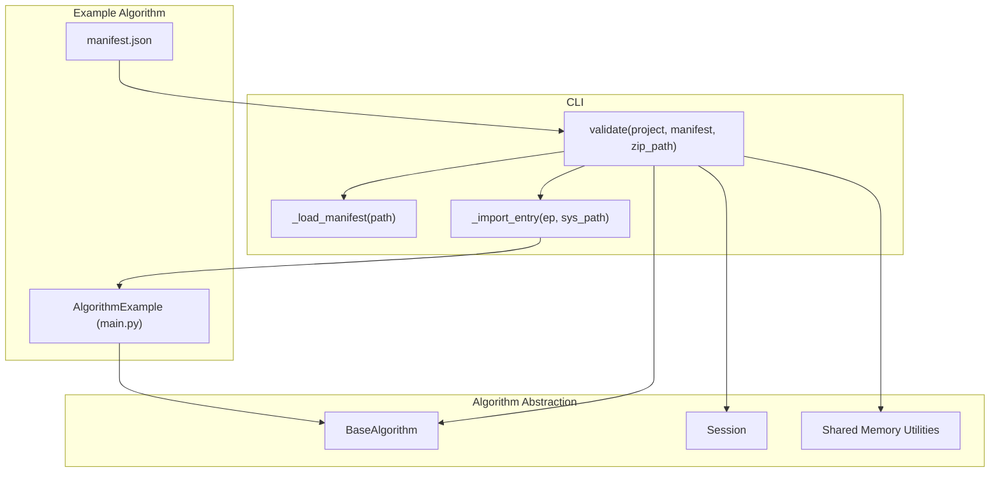
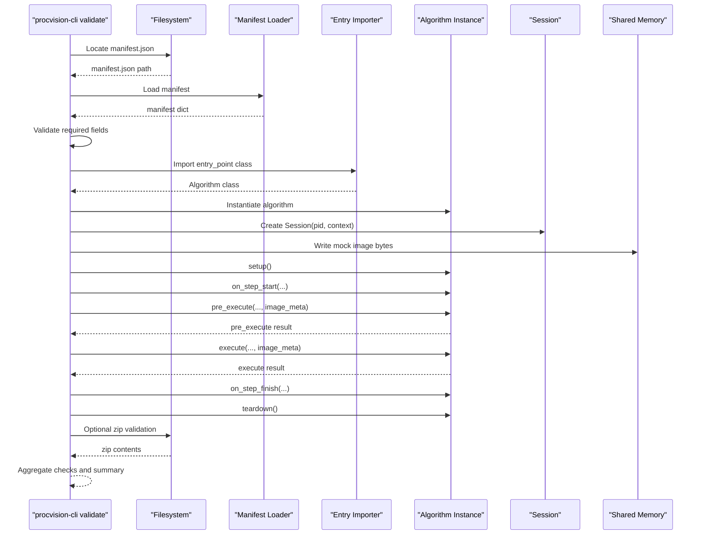
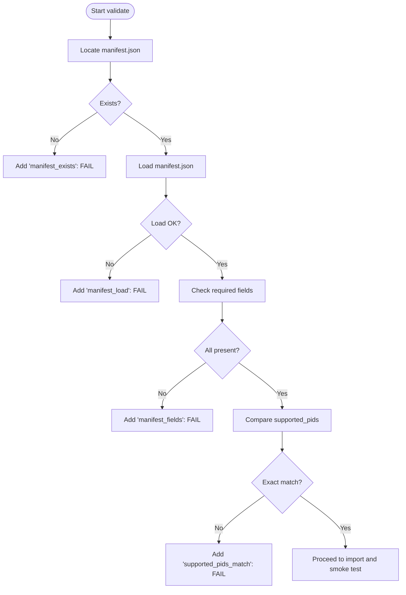
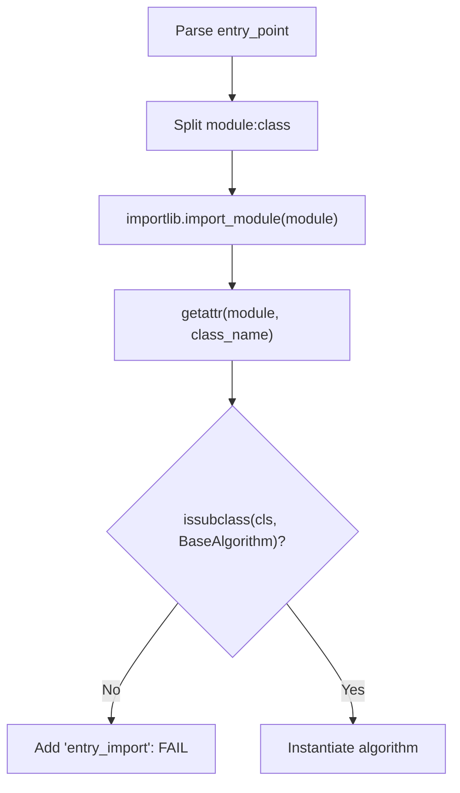
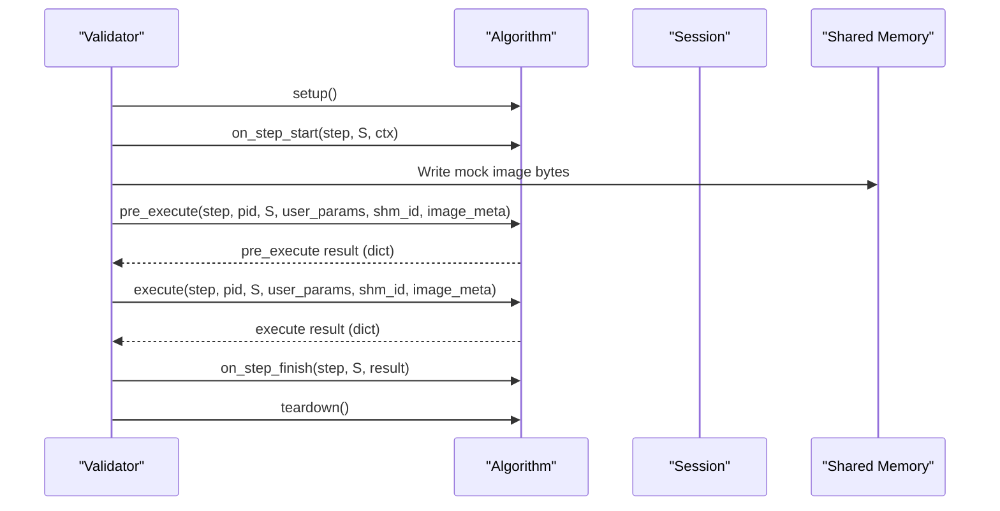
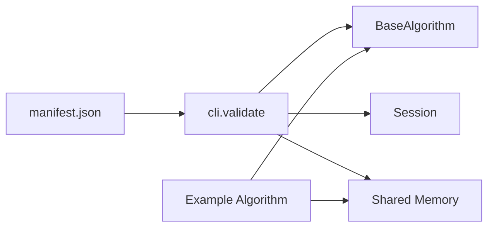

# Validation Process

<cite>
**Referenced Files in This Document**
- [cli.py](file://procvision_algorithm_sdk/cli.py)
- [base.py](file://procvision_algorithm_sdk/base.py)
- [session.py](file://procvision_algorithm_sdk/session.py)
- [shared_memory.py](file://procvision_algorithm_sdk/shared_memory.py)
- [manifest.json](file://algorithm-example/manifest.json)
- [main.py](file://algorithm-example/algorithm_example/main.py)
- [test_cli_validate.py](file://tests/test_cli_validate.py)
- [README.md](file://README.md)
- [spec.md](file://spec.md)
</cite>

## Table of Contents
1. [Introduction](#introduction)
2. [Project Structure](#project-structure)
3. [Core Components](#core-components)
4. [Architecture Overview](#architecture-overview)
5. [Detailed Component Analysis](#detailed-component-analysis)
6. [Dependency Analysis](#dependency-analysis)
7. [Performance Considerations](#performance-considerations)
8. [Troubleshooting Guide](#troubleshooting-guide)
9. [Conclusion](#conclusion)
10. [Appendices](#appendices)

## Introduction
This document explains the validation process performed by procvision-cli validate. It covers how the validator loads and checks manifest.json for required fields, imports the algorithm class via entry_point, verifies inheritance from BaseAlgorithm, performs smoke testing by instantiating the algorithm and invoking lifecycle and execution methods, enforces strict supported_pids matching, validates return types and structures, and checks offline zip packaging requirements. It also provides guidance on interpreting validation reports and troubleshooting common failures.

## Project Structure
The validation logic resides in the CLI module and relies on the BaseAlgorithm abstraction and shared memory utilities. Example algorithm and manifest demonstrate the expected structure and behavior.

**Diagram sources**
- [cli.py](file://procvision_algorithm_sdk/cli.py#L35-L120)
- [base.py](file://procvision_algorithm_sdk/base.py#L1-L58)
- [session.py](file://procvision_algorithm_sdk/session.py#L1-L36)
- [shared_memory.py](file://procvision_algorithm_sdk/shared_memory.py#L1-L53)
- [manifest.json](file://algorithm-example/manifest.json#L1-L25)
- [main.py](file://algorithm-example/algorithm_example/main.py#L1-L150)

**Section sources**
- [cli.py](file://procvision_algorithm_sdk/cli.py#L35-L120)
- [README.md](file://README.md#L1-L116)

## Core Components
- Manifest loader: Loads and parses manifest.json.
- Entry importer: Imports the algorithm class from entry_point and verifies it subclasses BaseAlgorithm.
- Smoke tester: Instantiates the algorithm, calls lifecycle and execution methods, and validates return structures.
- Zip validator: Checks for required files inside an offline zip package.
- Report generator: Aggregates PASS/FAIL outcomes and produces a human-readable or JSON report.

Key responsibilities:
- Manifest validation: existence, loadability, required fields, supported_pids alignment.
- Algorithm import and inheritance verification.
- Lifecycle and execution smoke test with mock session and image metadata.
- Return structure validation for pre_execute and execute.
- Offline zip packaging checks.

**Section sources**
- [cli.py](file://procvision_algorithm_sdk/cli.py#L35-L220)
- [base.py](file://procvision_algorithm_sdk/base.py#L1-L58)

## Architecture Overview
The validator orchestrates a series of checks against the algorithm project. It reads manifest.json, imports the algorithm class, constructs a Session, writes a mock image to shared memory, and executes pre_execute and execute. It also validates offline zip packaging when provided.

**Diagram sources**
- [cli.py](file://procvision_algorithm_sdk/cli.py#L35-L220)
- [session.py](file://procvision_algorithm_sdk/session.py#L1-L36)
- [shared_memory.py](file://procvision_algorithm_sdk/shared_memory.py#L1-L53)
- [main.py](file://algorithm-example/algorithm_example/main.py#L1-L150)

## Detailed Component Analysis

### Manifest Validation
- Required fields checked: name, version, entry_point, supported_pids.
- The validator ensures manifest.json exists and is loadable; otherwise, it fails early.
- supported_pids from manifest must exactly match supported_pids from get_info().

**Diagram sources**
- [cli.py](file://procvision_algorithm_sdk/cli.py#L35-L120)
- [manifest.json](file://algorithm-example/manifest.json#L1-L25)

**Section sources**
- [cli.py](file://procvision_algorithm_sdk/cli.py#L35-L120)
- [manifest.json](file://algorithm-example/manifest.json#L1-L25)

### Algorithm Import and BaseAlgorithm Verification
- The entry_point is split into module and class name, then imported dynamically.
- The validator checks that the imported class is a subclass of BaseAlgorithm.
- If import fails or inheritance is incorrect, the validator records a failure and stops further smoke testing for that algorithm.

**Diagram sources**
- [cli.py](file://procvision_algorithm_sdk/cli.py#L1-L34)
- [base.py](file://procvision_algorithm_sdk/base.py#L1-L58)

**Section sources**
- [cli.py](file://procvision_algorithm_sdk/cli.py#L1-L34)
- [base.py](file://procvision_algorithm_sdk/base.py#L1-L58)

### Smoke Testing Sequence
The validator performs a minimal end-to-end smoke test using a mock Session and image metadata. It calls lifecycle and execution methods and validates return structures.

Checks performed during smoke test:
- get_info returns a dict with a steps array.
- supported_pids from manifest equals supported_pids from get_info.
- pre_execute returns a dict with status in {"OK","ERROR"} and a message.
- execute returns a dict with status in {"OK","ERROR"}.
- When status is "OK", data includes result_status in {"OK","NG",None}; if NG, ng_reason must be present and defect_rects must be a list with length ≤ 20.

**Diagram sources**
- [cli.py](file://procvision_algorithm_sdk/cli.py#L120-L220)
- [session.py](file://procvision_algorithm_sdk/session.py#L1-L36)
- [shared_memory.py](file://procvision_algorithm_sdk/shared_memory.py#L1-L53)

**Section sources**
- [cli.py](file://procvision_algorithm_sdk/cli.py#L120-L220)
- [session.py](file://procvision_algorithm_sdk/session.py#L1-L36)
- [shared_memory.py](file://procvision_algorithm_sdk/shared_memory.py#L1-L53)

### Return Types and Structures
- Both pre_execute and execute must return a dictionary.
- status must be one of {"OK","ERROR"}.
- When status == "OK":
  - data may include result_status ∈ {"OK","NG",None}.
  - If result_status == "NG", data must include ng_reason and defect_rects as a list.
  - defect_rects length must be ≤ 20.
- The validator records PASS/FAIL for each of these checks.

**Section sources**
- [cli.py](file://procvision_algorithm_sdk/cli.py#L150-L220)
- [spec.md](file://spec.md#L1829-L1840)

### Supported PIDs Matching
- The validator compares manifest.supported_pids with info.supported_pids exactly.
- Any mismatch triggers a FAIL for supported_pids_match.
- The example algorithm demonstrates aligning supported_pids in both manifest and get_info.

**Section sources**
- [cli.py](file://procvision_algorithm_sdk/cli.py#L140-L160)
- [manifest.json](file://algorithm-example/manifest.json#L1-L25)
- [main.py](file://algorithm-example/algorithm_example/main.py#L1-L150)

### Zip Package Validation
- When a zip_path is provided, the validator opens the archive and checks for:
  - At least one manifest.json
  - At least one requirements.txt
  - Presence of wheels directory (either named "wheels" or containing "/wheels/")
- Failures are recorded under zip_* checks.

**Section sources**
- [cli.py](file://procvision_algorithm_sdk/cli.py#L220-L260)

### Example Algorithm Behavior
The example algorithm illustrates:
- Supported PIDs aligned with manifest.
- get_info returning supported_pids and steps.
- pre_execute validating PID and image availability, returning OK with calibration_rects.
- execute returning OK with either OK or NG result_status and appropriate data.

**Section sources**
- [manifest.json](file://algorithm-example/manifest.json#L1-L25)
- [main.py](file://algorithm-example/algorithm_example/main.py#L1-L150)

## Dependency Analysis
The validator depends on BaseAlgorithm for type checking and on Session/shared memory utilities for smoke testing. The example algorithm depends on BaseAlgorithm and uses shared memory helpers.

**Diagram sources**
- [cli.py](file://procvision_algorithm_sdk/cli.py#L35-L220)
- [base.py](file://procvision_algorithm_sdk/base.py#L1-L58)
- [session.py](file://procvision_algorithm_sdk/session.py#L1-L36)
- [shared_memory.py](file://procvision_algorithm_sdk/shared_memory.py#L1-L53)
- [manifest.json](file://algorithm-example/manifest.json#L1-L25)

**Section sources**
- [cli.py](file://procvision_algorithm_sdk/cli.py#L35-L220)
- [base.py](file://procvision_algorithm_sdk/base.py#L1-L58)

## Performance Considerations
- The validator intentionally performs minimal work to keep validation fast.
- It does not execute heavy model inference during validation; it focuses on structural correctness and basic return shape validation.
- Shared memory image loading is lightweight for validation purposes.

[No sources needed since this section provides general guidance]

## Troubleshooting Guide
Common validation failures and how to address them:

- Manifest not found or unreadable
  - Ensure manifest.json exists in the project root or is provided via --manifest.
  - Confirm required fields: name, version, entry_point, supported_pids.
  - See [cli.py](file://procvision_algorithm_sdk/cli.py#L35-L120).

- Missing required fields
  - Add name, version, entry_point, supported_pids to manifest.json.
  - See [manifest.json](file://algorithm-example/manifest.json#L1-L25).

- Import errors or wrong entry_point
  - Verify entry_point format: module:class.
  - Ensure the module is importable from the project directory.
  - Confirm the class is a subclass of BaseAlgorithm.
  - See [cli.py](file://procvision_algorithm_sdk/cli.py#L1-L34) and [base.py](file://procvision_algorithm_sdk/base.py#L1-L58).

- Inheritance failure
  - The imported class must inherit from BaseAlgorithm.
  - See [cli.py](file://procvision_algorithm_sdk/cli.py#L60-L90) and [base.py](file://procvision_algorithm_sdk/base.py#L1-L58).

- supported_pids mismatch
  - manifest.supported_pids must equal info.supported_pids exactly.
  - Align both values in manifest and get_info().
  - See [cli.py](file://procvision_algorithm_sdk/cli.py#L140-L160) and [manifest.json](file://algorithm-example/manifest.json#L1-L25).

- pre_execute or execute return type issues
  - Must return a dict with status ∈ {"OK","ERROR"}.
  - When status == "OK", data must include result_status ∈ {"OK","NG",None}.
  - If result_status == "NG", include ng_reason and defect_rects as a list with length ≤ 20.
  - See [cli.py](file://procvision_algorithm_sdk/cli.py#L150-L220) and [spec.md](file://spec.md#L1829-L1840).

- Non-serializable state in Session
  - Session.set requires JSON-serializable values; ensure stored values are serializable.
  - See [session.py](file://procvision_algorithm_sdk/session.py#L1-L36).

- Zip packaging issues
  - Ensure the zip contains manifest.json, requirements.txt, and wheels directory.
  - See [cli.py](file://procvision_algorithm_sdk/cli.py#L220-L260).

Interpreting validation reports:
- summary.status is PASS only if all checks pass.
- checks contains individual PASS/FAIL entries with messages indicating the cause.
- Use --json to output machine-readable results.
- See [cli.py](file://procvision_algorithm_sdk/cli.py#L260-L340).

**Section sources**
- [cli.py](file://procvision_algorithm_sdk/cli.py#L35-L340)
- [session.py](file://procvision_algorithm_sdk/session.py#L1-L36)
- [spec.md](file://spec.md#L1829-L1840)

## Conclusion
procvision-cli validate provides a robust, repeatable way to verify algorithm packages. It ensures manifest completeness, correct algorithm import and inheritance, functional smoke testing, strict supported_pids alignment, and adherence to return type contracts. It also validates offline zip packaging. By following the troubleshooting guidance and aligning manifests and algorithm implementations accordingly, teams can ensure compliance before deployment.

[No sources needed since this section summarizes without analyzing specific files]

## Appendices

### Quick Reference: What validate Checks
- Manifest existence and loadability
- Required fields: name, version, entry_point, supported_pids
- Algorithm import and BaseAlgorithm inheritance
- get_info returns a dict with steps array
- supported_pids exact match between manifest and get_info
- pre_execute returns dict with status ∈ {"OK","ERROR"} and message
- execute returns dict with status ∈ {"OK","ERROR"}
- When execute status == "OK": data must include result_status ∈ {"OK","NG",None}; if NG, include ng_reason and defect_rects as a list with length ≤ 20
- Optional zip validation: manifest.json, requirements.txt, wheels directory present

**Section sources**
- [cli.py](file://procvision_algorithm_sdk/cli.py#L35-L260)
- [spec.md](file://spec.md#L1829-L1840)