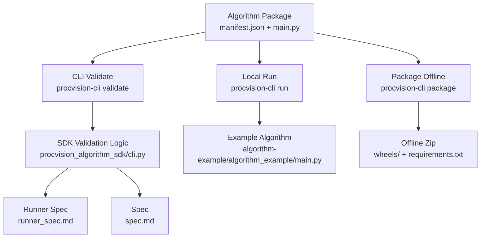
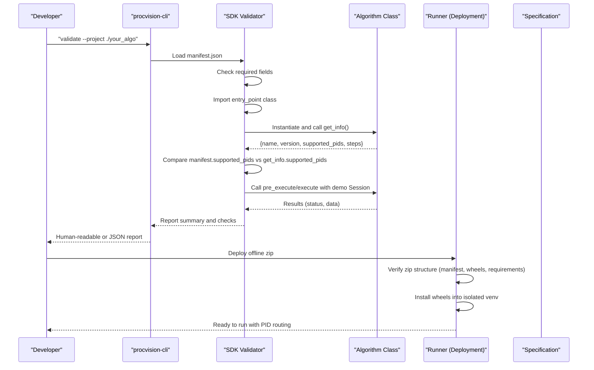
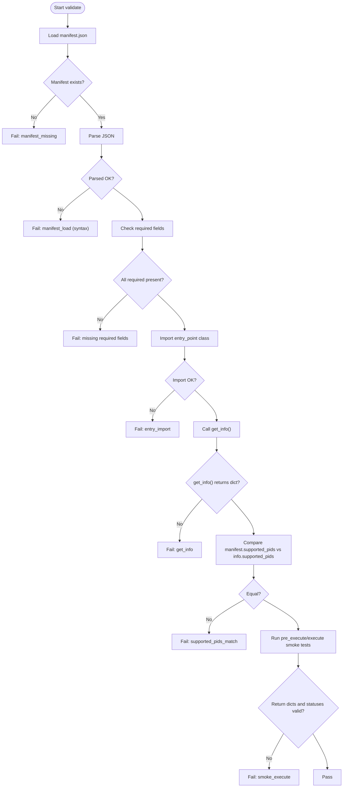
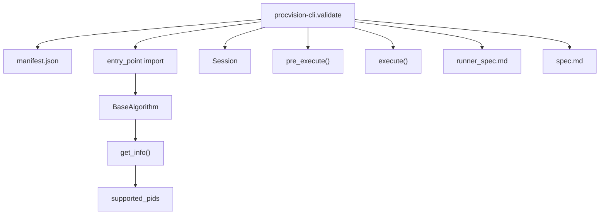

# Configuration Issues

<cite>
**Referenced Files in This Document**
- [README.md](file://README.md)
- [spec.md](file://spec.md)
- [runner_spec.md](file://runner_spec.md)
- [procvision_algorithm_sdk/cli.py](file://procvision_algorithm_sdk/cli.py)
- [procvision_algorithm_sdk/base.py](file://procvision_algorithm_sdk/base.py)
- [procvision_algorithm_sdk/errors.py](file://procvision_algorithm_sdk/errors.py)
- [algorithm-example/manifest.json](file://algorithm-example/manifest.json)
- [algorithm-example/algorithm_example/main.py](file://algorithm-example/algorithm_example/main.py)
- [tests/test_cli_validate.py](file://tests/test_cli_validate.py)
</cite>

## Table of Contents
1. [Introduction](#introduction)
2. [Project Structure](#project-structure)
3. [Core Components](#core-components)
4. [Architecture Overview](#architecture-overview)
5. [Detailed Component Analysis](#detailed-component-analysis)
6. [Dependency Analysis](#dependency-analysis)
7. [Performance Considerations](#performance-considerations)
8. [Troubleshooting Guide](#troubleshooting-guide)
9. [Conclusion](#conclusion)
10. [Appendices](#appendices)

## Introduction
This document focuses on configuration-related issues encountered during ProcVision algorithm development and deployment. It covers manifest.json validation failures, incorrect entry_point specification, supported_pids mismatch between manifest.json and get_info(), parameter schema definition errors, wheel compatibility and Python version mismatches, and how to interpret configuration error codes (2001–2007) reported by the runner. It also provides practical guidance on validating configurations against the specification and using the example algorithm as a reference.

## Project Structure
The repository provides:
- An SDK with base interfaces and CLI tools for validation, local simulation, packaging, and scaffolding
- A specification document defining the algorithm contract and error codes
- A runner specification describing deployment and runtime behavior
- An example algorithm demonstrating correct manifest.json and implementation patterns

**Diagram sources**
- [procvision_algorithm_sdk/cli.py](file://procvision_algorithm_sdk/cli.py#L35-L159)
- [runner_spec.md](file://runner_spec.md#L1-L120)
- [spec.md](file://spec.md#L1-L120)
- [algorithm-example/algorithm_example/main.py](file://algorithm-example/algorithm_example/main.py#L1-L60)

**Section sources**
- [README.md](file://README.md#L1-L116)
- [procvision_algorithm_sdk/cli.py](file://procvision_algorithm_sdk/cli.py#L35-L159)
- [runner_spec.md](file://runner_spec.md#L1-L120)
- [spec.md](file://spec.md#L1-L120)

## Core Components
- CLI validation validates manifest.json presence and structure, imports the entry_point class, ensures supported_pids match between manifest.json and get_info(), and runs smoke tests for pre_execute and execute.
- The example algorithm demonstrates correct manifest.json and implementation patterns for supported_pids, steps, and parameter schema.
- The runner specification defines offline package requirements and error codes used during deployment and runtime.

Key responsibilities:
- Manifest validation: presence, required fields, entry_point importability, supported_pids consistency, and return value shape.
- Local simulation: writing images to shared memory and invoking pre_execute/execute.
- Packaging: downloading wheels matching target platform and Python version, sanitizing requirements, and assembling the offline zip.

**Section sources**
- [procvision_algorithm_sdk/cli.py](file://procvision_algorithm_sdk/cli.py#L35-L159)
- [algorithm-example/manifest.json](file://algorithm-example/manifest.json#L1-L25)
- [algorithm-example/algorithm_example/main.py](file://algorithm-example/algorithm_example/main.py#L1-L149)
- [runner_spec.md](file://runner_spec.md#L1-L120)

## Architecture Overview
The configuration validation pipeline integrates CLI, SDK, and specification:

**Diagram sources**
- [procvision_algorithm_sdk/cli.py](file://procvision_algorithm_sdk/cli.py#L35-L159)
- [spec.md](file://spec.md#L1829-L1840)
- [runner_spec.md](file://runner_spec.md#L120-L282)

## Detailed Component Analysis

### Manifest.json Validation Failures
Common issues:
- Missing required fields: name, version, entry_point, supported_pids
- Malformed JSON (syntax errors)
- Incorrect entry_point format or import failure
- supported_pids mismatch between manifest.json and get_info() return value
- Steps parameter schema errors (types, defaults, constraints)

How the CLI validates:
- Loads manifest.json and reports load failures
- Checks for required keys
- Imports the entry_point class and verifies subclass of BaseAlgorithm
- Calls get_info() and compares supported_pids
- Executes pre_execute and execute with a demo Session to validate return shapes

**Diagram sources**
- [procvision_algorithm_sdk/cli.py](file://procvision_algorithm_sdk/cli.py#L35-L159)
- [procvision_algorithm_sdk/base.py](file://procvision_algorithm_sdk/base.py#L1-L58)

**Section sources**
- [procvision_algorithm_sdk/cli.py](file://procvision_algorithm_sdk/cli.py#L35-L159)
- [procvision_algorithm_sdk/base.py](file://procvision_algorithm_sdk/base.py#L1-L58)

### Incorrect entry_point Specification
Symptoms:
- Import errors during validation
- Class not found or wrong module/class name
- Not subclassing BaseAlgorithm

Resolution steps:
- Ensure entry_point follows the format "<module>:<ClassName>"
- Confirm the module is importable from the project root or sys.path is adjusted
- Verify the class inherits from BaseAlgorithm and implements required methods

**Section sources**
- [procvision_algorithm_sdk/cli.py](file://procvision_algorithm_sdk/cli.py#L1-L34)
- [procvision_algorithm_sdk/base.py](file://procvision_algorithm_sdk/base.py#L1-L58)

### Supported_pids Mismatch Between manifest.json and get_info()
Symptoms:
- Validation fails with supported_pids_match
- Runner rejects deployment with activation_conflict

Resolution steps:
- Align manifest.json supported_pids with the list returned by get_info()
- Keep supported_pids minimal and consistent across both sources
- Use the example algorithm as a reference for correct structure

**Section sources**
- [procvision_algorithm_sdk/cli.py](file://procvision_algorithm_sdk/cli.py#L90-L120)
- [algorithm-example/manifest.json](file://algorithm-example/manifest.json#L1-L25)
- [algorithm-example/algorithm_example/main.py](file://algorithm-example/algorithm_example/main.py#L1-L40)
- [runner_spec.md](file://runner_spec.md#L180-L240)

### Parameter Schema Definition Errors
Symptoms:
- Runner reports invalid_params
- Pre_execute/execute returns ERROR with message indicating invalid fields

Resolution steps:
- Define steps with index, name, and params arrays
- Use supported parameter types and constraints as per the specification
- Ensure required fields are marked and defaults are provided when applicable
- Validate with the example algorithm’s steps schema as a reference

**Section sources**
- [spec.md](file://spec.md#L1829-L1840)
- [algorithm-example/manifest.json](file://algorithm-example/manifest.json#L1-L25)
- [algorithm-example/algorithm_example/main.py](file://algorithm-example/algorithm_example/main.py#L40-L120)

### Wheel Compatibility and Python Version Mismatches
Symptoms:
- pip download fails with “No matching distribution found”
- Runner reports incompatible_python during installation
- Runtime crashes due to ABI mismatch

Resolution steps:
- Generate requirements.txt in the target Python version (e.g., 3.10) and platform (e.g., cp310)
- Use procvision-cli package to download wheels with matching --platform, --python-version, --implementation, and --abi
- Ensure wheels are included in the offline zip and that the runner installs only from wheels
- Validate the .procvision_env.json or inferred target environment matches the wheels

**Section sources**
- [procvision_algorithm_sdk/cli.py](file://procvision_algorithm_sdk/cli.py#L259-L298)
- [runner_spec.md](file://runner_spec.md#L200-L282)
- [README.md](file://README.md#L60-L116)

### Interpreting Configuration Error Codes (2001–2007)
Runner error codes for package management:
- 2001 invalid_zip: zip file is corrupted or missing required files
- 2002 manifest_missing: manifest.json not found
- 2003 incompatible_python: Python/ABI does not match wheels
- 2004 wheels_missing: missing wheels directory or key dependencies
- 2005 install_failed: installation error (see message)
- 2006 activation_conflict: PID not in supported_pids or conflict with existing mapping
- 2007 unsafe_uninstall: package is active or in use

Resolution steps:
- Fix zip structure and ensure manifest.json, requirements.txt, and wheels are present
- Align Python version and ABI with wheels
- Verify supported_pids includes the PID being activated
- Uninstall only after deactivating or using safe uninstall policy

**Section sources**
- [runner_spec.md](file://runner_spec.md#L180-L282)

## Dependency Analysis
The CLI validator depends on:
- Manifest parsing and entry_point import
- Algorithm class instantiation and method invocation
- Session creation for smoke tests
- Runner specification for offline packaging expectations

**Diagram sources**
- [procvision_algorithm_sdk/cli.py](file://procvision_algorithm_sdk/cli.py#L35-L159)
- [procvision_algorithm_sdk/base.py](file://procvision_algorithm_sdk/base.py#L1-L58)
- [runner_spec.md](file://runner_spec.md#L1-L120)
- [spec.md](file://spec.md#L1-L120)

**Section sources**
- [procvision_algorithm_sdk/cli.py](file://procvision_algorithm_sdk/cli.py#L35-L159)
- [procvision_algorithm_sdk/base.py](file://procvision_algorithm_sdk/base.py#L1-L58)
- [runner_spec.md](file://runner_spec.md#L1-L120)
- [spec.md](file://spec.md#L1-L120)

## Performance Considerations
- Keep supported_pids lists concise to simplify validation and reduce initialization overhead
- Avoid heavy resource loading in get_info(); defer to setup() if needed
- Ensure parameter schema constraints are reasonable to prevent excessive validation overhead
- Use the example algorithm’s patterns for efficient image reads and minimal debug payload sizes

[No sources needed since this section provides general guidance]

## Troubleshooting Guide

### Manifest.json Validation Failures
- Missing manifest.json: The CLI reports manifest_exists FAIL. Ensure manifest.json is present in the project root.
- JSON syntax errors: The CLI reports manifest_load FAIL with error details. Validate JSON formatting.
- Missing required fields: The CLI reports manifest_fields FAIL with missing keys. Add name, version, entry_point, supported_pids.
- Import errors for entry_point: The CLI reports entry_import FAIL. Verify module path and class name.
- supported_pids mismatch: The CLI reports supported_pids_match FAIL. Align manifest.json and get_info() supported_pids.
- Return value shape issues: The CLI reports get_info, step_schema, pre_execute_return_dict, pre_status_valid, execute_return_dict, execute_status_valid, or smoke_execute FAIL. Review return structures and statuses.

**Section sources**
- [procvision_algorithm_sdk/cli.py](file://procvision_algorithm_sdk/cli.py#L35-L159)
- [tests/test_cli_validate.py](file://tests/test_cli_validate.py#L1-L11)

### Incorrect entry_point Specification
- Symptom: entry_import FAIL
- Resolution: Correct module path and class name; ensure the class is importable and subclasses BaseAlgorithm.

**Section sources**
- [procvision_algorithm_sdk/cli.py](file://procvision_algorithm_sdk/cli.py#L1-L34)
- [procvision_algorithm_sdk/base.py](file://procvision_algorithm_sdk/base.py#L1-L58)

### Supported_pids Mismatch
- Symptom: supported_pids_match FAIL
- Resolution: Ensure manifest.json supported_pids equals get_info().supported_pids. Use the example algorithm as a reference.

**Section sources**
- [procvision_algorithm_sdk/cli.py](file://procvision_algorithm_sdk/cli.py#L90-L120)
- [algorithm-example/manifest.json](file://algorithm-example/manifest.json#L1-L25)
- [algorithm-example/algorithm_example/main.py](file://algorithm-example/algorithm_example/main.py#L1-L40)

### Parameter Schema Definition Errors
- Symptom: Runner reports invalid_params
- Resolution: Define steps with correct param types and constraints; refer to the example algorithm’s steps schema.

**Section sources**
- [spec.md](file://spec.md#L1829-L1840)
- [algorithm-example/manifest.json](file://algorithm-example/manifest.json#L1-L25)
- [algorithm-example/algorithm_example/main.py](file://algorithm-example/algorithm_example/main.py#L40-L120)

### Wheel Compatibility and Python Version Mismatches
- Symptom: pip download fails or incompatible_python during install
- Resolution: Generate requirements.txt in the target Python version and platform; use procvision-cli package with matching --python-version, --implementation, and --abi; ensure wheels are included in the offline zip.

**Section sources**
- [procvision_algorithm_sdk/cli.py](file://procvision_algorithm_sdk/cli.py#L259-L298)
- [runner_spec.md](file://runner_spec.md#L200-L282)
- [README.md](file://README.md#L60-L116)

### Interpreting Configuration Error Codes (2001–2007)
- 2001 invalid_zip: Rebuild the offline zip with manifest.json, requirements.txt, and wheels.
- 2002 manifest_missing: Add manifest.json to the package.
- 2003 incompatible_python: Align Python version and ABI with wheels.
- 2004 wheels_missing: Include wheels directory and required dependencies.
- 2005 install_failed: Inspect the message and fix environment or dependencies.
- 2006 activation_conflict: Ensure the PID is in supported_pids and not bound to another package.
- 2007 unsafe_uninstall: Deactivate the package before uninstalling.

**Section sources**
- [runner_spec.md](file://runner_spec.md#L180-L282)

## Conclusion
Configuration issues in ProcVision algorithm development primarily stem from manifest.json misconfiguration, entry_point import problems, supported_pids inconsistencies, parameter schema errors, and wheel/Python version mismatches. The CLI provides robust validation and smoke testing to catch these issues early. By aligning manifest.json with get_info(), using the example algorithm as a reference, and ensuring wheels match the target environment, developers can resolve most configuration-related problems efficiently.

[No sources needed since this section summarizes without analyzing specific files]

## Appendices

### Using the Example Algorithm as a Reference
- Compare your manifest.json with the example’s structure and supported_pids.
- Mirror the steps schema and parameter definitions shown in the example’s get_info().
- Validate your implementation using the CLI’s smoke tests.

**Section sources**
- [algorithm-example/manifest.json](file://algorithm-example/manifest.json#L1-L25)
- [algorithm-example/algorithm_example/main.py](file://algorithm-example/algorithm_example/main.py#L1-L149)