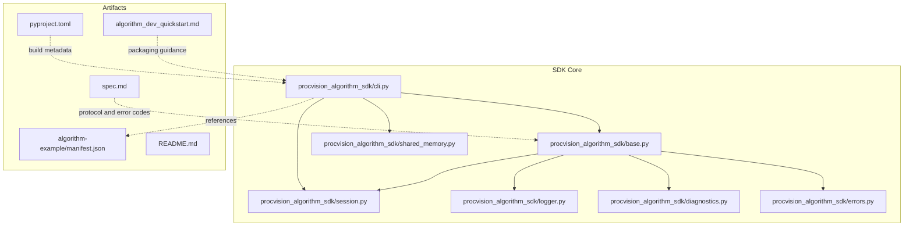
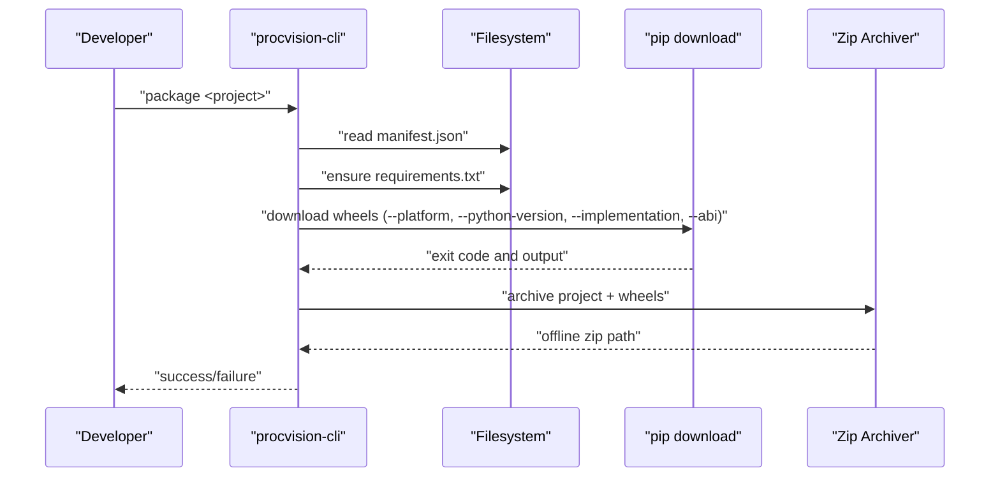
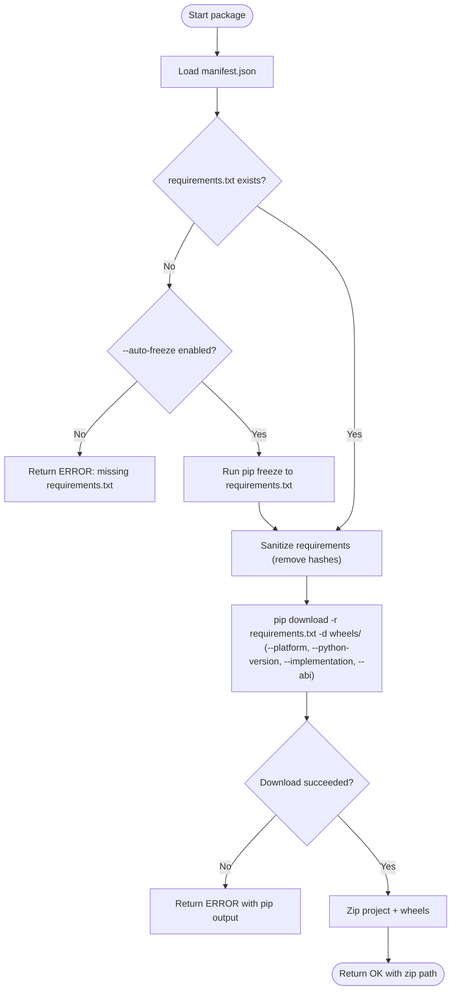
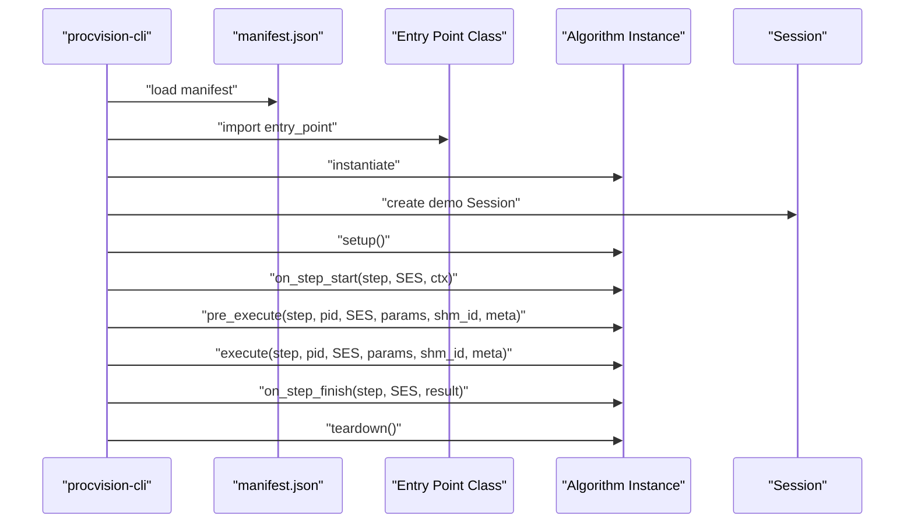
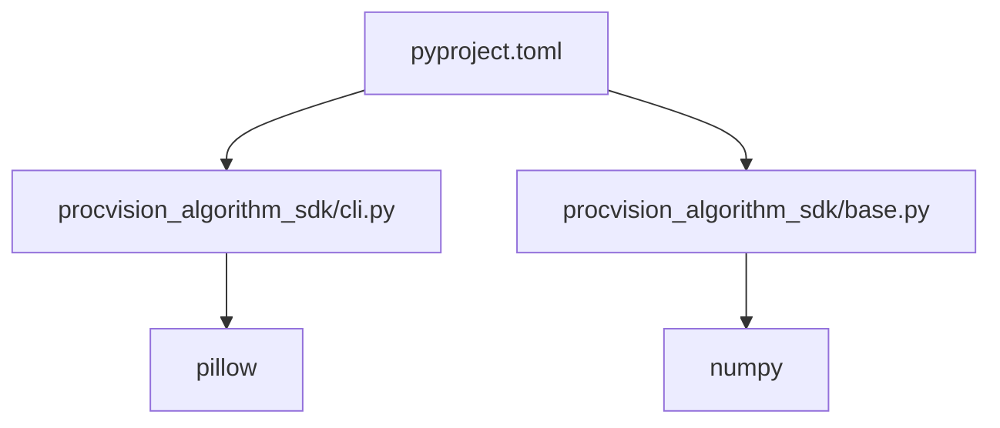

# Deployment and Packaging

<cite>
**Referenced Files in This Document**
- [README.md](file://README.md)
- [pyproject.toml](file://pyproject.toml)
- [procvision_algorithm_sdk/cli.py](file://procvision_algorithm_sdk/cli.py)
- [procvision_algorithm_sdk/base.py](file://procvision_algorithm_sdk/base.py)
- [procvision_algorithm_sdk/session.py](file://procvision_algorithm_sdk/session.py)
- [procvision_algorithm_sdk/logger.py](file://procvision_algorithm_sdk/logger.py)
- [procvision_algorithm_sdk/shared_memory.py](file://procvision_algorithm_sdk/shared_memory.py)
- [procvision_algorithm_sdk/diagnostics.py](file://procvision_algorithm_sdk/diagnostics.py)
- [procvision_algorithm_sdk/errors.py](file://procvision_algorithm_sdk/errors.py)
- [algorithm-example/manifest.json](file://algorithm-example/manifest.json)
- [algorithm_dev_quickstart.md](file://algorithm_dev_quickstart.md)
- [spec.md](file://spec.md)
</cite>

## Table of Contents
1. [Introduction](#introduction)
2. [Project Structure](#project-structure)
3. [Core Components](#core-components)
4. [Architecture Overview](#architecture-overview)
5. [Detailed Component Analysis](#detailed-component-analysis)
6. [Dependency Analysis](#dependency-analysis)
7. [Performance Considerations](#performance-considerations)
8. [Troubleshooting Guide](#troubleshooting-guide)
9. [Conclusion](#conclusion)
10. [Appendices](#appendices)

## Introduction
This document provides comprehensive troubleshooting guidance for deploying and packaging ProcVision algorithms using the ProcVision Algorithm SDK. It focuses on:
- Packaging issues with the procvision-cli package command (missing dependencies, incorrect wheel installation, invalid package structure)
- Offline deployment challenges (environment compatibility, Python version mismatches, missing system libraries)
- Runner startup failures, handshake protocol errors, and heartbeat mechanism problems
- Diagnosing process management issues, stdin/stdout communication errors, and logging configuration problems
- Troubleshooting algorithm activation, switching, and rollback processes in production environments

## Project Structure
The repository is organized around the ProcVision Algorithm SDK and example artifacts:
- SDK core: CLI, base algorithm interface, session/state, structured logging, diagnostics, shared memory helpers, and error types
- Example algorithm project and manifest
- Build configuration and developer quickstart documentation

**Diagram sources**
- [procvision_algorithm_sdk/cli.py](file://procvision_algorithm_sdk/cli.py#L1-L615)
- [procvision_algorithm_sdk/base.py](file://procvision_algorithm_sdk/base.py#L1-L58)
- [procvision_algorithm_sdk/session.py](file://procvision_algorithm_sdk/session.py#L1-L36)
- [procvision_algorithm_sdk/logger.py](file://procvision_algorithm_sdk/logger.py#L1-L24)
- [procvision_algorithm_sdk/diagnostics.py](file://procvision_algorithm_sdk/diagnostics.py#L1-L12)
- [procvision_algorithm_sdk/shared_memory.py](file://procvision_algorithm_sdk/shared_memory.py#L1-L53)
- [procvision_algorithm_sdk/errors.py](file://procvision_algorithm_sdk/errors.py#L1-L14)
- [algorithm-example/manifest.json](file://algorithm-example/manifest.json#L1-L25)
- [pyproject.toml](file://pyproject.toml#L1-L36)
- [README.md](file://README.md#L1-L116)
- [algorithm_dev_quickstart.md](file://algorithm_dev_quickstart.md#L220-L268)
- [spec.md](file://spec.md#L1800-L2000)

**Section sources**
- [README.md](file://README.md#L1-L116)
- [pyproject.toml](file://pyproject.toml#L1-L36)
- [procvision_algorithm_sdk/cli.py](file://procvision_algorithm_sdk/cli.py#L1-L615)
- [procvision_algorithm_sdk/base.py](file://procvision_algorithm_sdk/base.py#L1-L58)
- [procvision_algorithm_sdk/session.py](file://procvision_algorithm_sdk/session.py#L1-L36)
- [procvision_algorithm_sdk/logger.py](file://procvision_algorithm_sdk/logger.py#L1-L24)
- [procvision_algorithm_sdk/diagnostics.py](file://procvision_algorithm_sdk/diagnostics.py#L1-L12)
- [procvision_algorithm_sdk/shared_memory.py](file://procvision_algorithm_sdk/shared_memory.py#L1-L53)
- [procvision_algorithm_sdk/errors.py](file://procvision_algorithm_sdk/errors.py#L1-L14)
- [algorithm-example/manifest.json](file://algorithm-example/manifest.json#L1-L25)
- [algorithm_dev_quickstart.md](file://algorithm_dev_quickstart.md#L220-L268)
- [spec.md](file://spec.md#L1800-L2000)

## Core Components
- CLI: Provides commands to validate algorithm packages, run locally, package offline deliverables, and initialize scaffolding. It enforces manifest correctness, imports the algorithm entry point, and executes lifecycle hooks.
- BaseAlgorithm: Defines the abstract interface for algorithms, including lifecycle hooks (setup, on_step_start, pre_execute, execute, on_step_finish, teardown) and access to structured logging and diagnostics.
- Session: Manages per-run state and context, ensuring JSON-serializable values and safe state operations.
- StructuredLogger: Emits structured log records to stderr, keeping protocol frames on stdout clean.
- Diagnostics: Captures diagnostic metrics keyed by string identifiers.
- SharedMemory Helpers: Provide development-time image transfer via shared memory identifiers and conversion utilities.
- Errors: Standardized exception types for recoverable and fatal conditions.

Key responsibilities and integration points:
- CLI orchestrates packaging and validation, invoking BaseAlgorithm lifecycle methods and reading manifest entries.
- BaseAlgorithm integrates with Session and Logger/Diagnostics to produce deterministic outputs and logs.
- SharedMemory helpers support image ingestion for local runs and validations.

**Section sources**
- [procvision_algorithm_sdk/cli.py](file://procvision_algorithm_sdk/cli.py#L1-L615)
- [procvision_algorithm_sdk/base.py](file://procvision_algorithm_sdk/base.py#L1-L58)
- [procvision_algorithm_sdk/session.py](file://procvision_algorithm_sdk/session.py#L1-L36)
- [procvision_algorithm_sdk/logger.py](file://procvision_algorithm_sdk/logger.py#L1-L24)
- [procvision_algorithm_sdk/diagnostics.py](file://procvision_algorithm_sdk/diagnostics.py#L1-L12)
- [procvision_algorithm_sdk/shared_memory.py](file://procvision_algorithm_sdk/shared_memory.py#L1-L53)
- [procvision_algorithm_sdk/errors.py](file://procvision_algorithm_sdk/errors.py#L1-L14)

## Architecture Overview
The packaging and deployment pipeline centers on the CLI’s package command, which:
- Reads manifest.json
- Generates or sanitizes requirements.txt
- Downloads platform-matched wheels into a wheels/ folder
- Packages source, manifest, requirements, wheels, and optional assets into an offline zip

Offline runtime relies on:
- Algorithm entry point resolution from manifest
- Lifecycle hooks invoked by the runner
- Structured logging to stderr and protocol frames on stdout
- Heartbeat and shutdown semantics defined by the specification

**Diagram sources**
- [procvision_algorithm_sdk/cli.py](file://procvision_algorithm_sdk/cli.py#L228-L326)
- [algorithm_dev_quickstart.md](file://algorithm_dev_quickstart.md#L220-L268)

**Section sources**
- [procvision_algorithm_sdk/cli.py](file://procvision_algorithm_sdk/cli.py#L228-L326)
- [algorithm_dev_quickstart.md](file://algorithm_dev_quickstart.md#L220-L268)

## Detailed Component Analysis

### CLI Packaging Workflow
The package command performs:
- Manifest loading and validation
- Requirements handling (generation or sanitization)
- Wheel downloads with platform and ABI constraints
- Zip creation including wheels and project contents

Common pitfalls and remedies:
- Missing requirements.txt: Use --auto-freeze to generate it from the current environment.
- Platform mismatch: Align --platform, --python-version, --implementation, and --abi with the target environment.
- Wheel download failures: Inspect pip download output; ensure versions are available for the specified target.
- Invalid package structure: Verify wheels/ presence and required files in the offline zip.

**Diagram sources**
- [procvision_algorithm_sdk/cli.py](file://procvision_algorithm_sdk/cli.py#L228-L326)
- [algorithm_dev_quickstart.md](file://algorithm_dev_quickstart.md#L220-L268)

**Section sources**
- [procvision_algorithm_sdk/cli.py](file://procvision_algorithm_sdk/cli.py#L228-L326)
- [algorithm_dev_quickstart.md](file://algorithm_dev_quickstart.md#L220-L268)

### Algorithm Lifecycle and Validation
The CLI validates algorithms by importing the entry point, instantiating the class, and invoking lifecycle hooks with a demo Session and image metadata. It also checks return structures and supported PID alignment.

Common validation failures:
- Unsupported PID: Ensure supported_pids in manifest matches get_info().
- Missing required keys: pre_execute and execute must return status and appropriate data.
- Invalid result_status: Must be OK/NG or None; NG requires ng_reason and defect_rects constraints.

**Diagram sources**
- [procvision_algorithm_sdk/cli.py](file://procvision_algorithm_sdk/cli.py#L1-L200)
- [algorithm-example/manifest.json](file://algorithm-example/manifest.json#L1-L25)

**Section sources**
- [procvision_algorithm_sdk/cli.py](file://procvision_algorithm_sdk/cli.py#L1-L200)
- [algorithm-example/manifest.json](file://algorithm-example/manifest.json#L1-L25)

### Logging and Protocol Separation
- Logs must go to stderr via StructuredLogger; protocol frames must remain on stdout.
- This separation prevents protocol corruption and ensures runner reliability.

**Section sources**
- [procvision_algorithm_sdk/logger.py](file://procvision_algorithm_sdk/logger.py#L1-L24)
- [spec.md](file://spec.md#L634-L637)

### Session State Management
- Session stores JSON-serializable state and context.
- Values must be JSON serializable; otherwise, set() raises an error.

**Section sources**
- [procvision_algorithm_sdk/session.py](file://procvision_algorithm_sdk/session.py#L1-L36)

### Diagnostics and Error Codes
- Diagnostics items are key-value pairs captured by the algorithm.
- The specification defines standardized error codes for common issues (invalid_pid, image_load_failed, model_not_found, gpu_oom, timeout, invalid_params, coordinate_invalid, unknown_error).

**Section sources**
- [procvision_algorithm_sdk/diagnostics.py](file://procvision_algorithm_sdk/diagnostics.py#L1-L12)
- [spec.md](file://spec.md#L1800-L2000)

## Dependency Analysis
Build and runtime dependencies:
- Build system: setuptools and wheel
- Runtime dependencies: numpy and pillow
- CLI entry point registered via pyproject configuration

**Diagram sources**
- [pyproject.toml](file://pyproject.toml#L1-L36)
- [procvision_algorithm_sdk/base.py](file://procvision_algorithm_sdk/base.py#L1-L58)
- [procvision_algorithm_sdk/cli.py](file://procvision_algorithm_sdk/cli.py#L1-L615)

**Section sources**
- [pyproject.toml](file://pyproject.toml#L1-L36)
- [procvision_algorithm_sdk/base.py](file://procvision_algorithm_sdk/base.py#L1-L58)
- [procvision_algorithm_sdk/cli.py](file://procvision_algorithm_sdk/cli.py#L1-L615)

## Performance Considerations
- Prefer binary wheels for dependencies to minimize install time and ensure reproducibility.
- Keep wheels aligned with target platform and Python version to avoid costly rebuilds.
- Limit defect_rects count to reduce payload overhead and improve throughput.
- Use structured logging sparingly in hot paths; excessive writes can impact latency.

[No sources needed since this section provides general guidance]

## Troubleshooting Guide

### Packaging Issues with procvision-cli package
Symptoms and resolutions:
- Missing requirements.txt
  - Cause: requirements.txt not present and --auto-freeze disabled.
  - Resolution: Enable --auto-freeze or provide --requirements path.
  - Evidence: Package command returns ERROR with a message indicating missing requirements.txt.
  - Section sources
    - [procvision_algorithm_sdk/cli.py](file://procvision_algorithm_sdk/cli.py#L228-L262)

- Incorrect wheel installation
  - Cause: Target platform or Python version mismatch.
  - Resolution: Align --platform, --python-version, --implementation, and --abi with the target environment. Re-run pip download with corrected parameters.
  - Evidence: pip download fails with “No matching distribution found” or similar; package returns ERROR with pip output.
  - Section sources
    - [procvision_algorithm_sdk/cli.py](file://procvision_algorithm_sdk/cli.py#L297-L326)
    - [algorithm_dev_quickstart.md](file://algorithm_dev_quickstart.md#L220-L268)

- Invalid package structure
  - Cause: Missing wheels/, manifest.json, or requirements.txt in the offline zip.
  - Resolution: Ensure wheels/ exists and is included; verify manifest.json and requirements.txt are present.
  - Evidence: CLI validate with --zip checks for presence of manifest.json, requirements.txt, and wheels/; failing checks indicate missing files.
  - Section sources
    - [procvision_algorithm_sdk/cli.py](file://procvision_algorithm_sdk/cli.py#L127-L159)

- Sanitization of requirements
  - Cause: Hashes and extra markers causing conflicts.
  - Resolution: Allow automatic sanitization to remove hash markers and extra options; ensure only pinned versions remain.
  - Section sources
    - [procvision_algorithm_sdk/cli.py](file://procvision_algorithm_sdk/cli.py#L259-L298)

### Offline Deployment Problems
Symptoms and resolutions:
- Environment compatibility
  - Cause: Mismatch between build environment and target environment.
  - Resolution: Build wheels in a virtual environment matching the target Python version and platform. Use --python-version, --platform, --implementation, and --abi consistently.
  - Section sources
    - [algorithm_dev_quickstart.md](file://algorithm_dev_quickstart.md#L220-L268)
    - [procvision_algorithm_sdk/cli.py](file://procvision_algorithm_sdk/cli.py#L297-L326)

- Python version mismatches
  - Cause: Using incompatible Python interpreter.
  - Resolution: Match the target Python version exactly; regenerate requirements.txt in the target environment.
  - Section sources
    - [README.md](file://README.md#L1-L116)
    - [pyproject.toml](file://pyproject.toml#L1-L36)

- Missing system libraries
  - Cause: Native dependencies not bundled in wheels.
  - Resolution: Ensure wheels include all native dependencies or pre-install system libraries on the target machine. Confirm ABI compatibility.
  - Section sources
    - [procvision_algorithm_sdk/cli.py](file://procvision_algorithm_sdk/cli.py#L297-L326)

### Runner Startup Failures
Symptoms and resolutions:
- Manifest not found or invalid
  - Cause: Missing or malformed manifest.json.
  - Resolution: Validate manifest.json against the specification; ensure entry_point resolves to a subclass of BaseAlgorithm.
  - Section sources
    - [procvision_algorithm_sdk/cli.py](file://procvision_algorithm_sdk/cli.py#L1-L120)
    - [algorithm-example/manifest.json](file://algorithm-example/manifest.json#L1-L25)

- Entry point import failure
  - Cause: Wrong module path or class name.
  - Resolution: Verify entry_point format and that the class inherits BaseAlgorithm.
  - Section sources
    - [procvision_algorithm_sdk/cli.py](file://procvision_algorithm_sdk/cli.py#L1-L120)

- Supported PID mismatch
  - Cause: pid not in supported_pids.
  - Resolution: Align supported_pids in manifest.json with get_info() and validate with CLI.
  - Section sources
    - [procvision_algorithm_sdk/cli.py](file://procvision_algorithm_sdk/cli.py#L1-L200)
    - [spec.md](file://spec.md#L1800-L2000)

### Handshake Protocol and Heartbeat
Symptoms and resolutions:
- Protocol frame corruption
  - Cause: Writing logs to stdout instead of stderr.
  - Resolution: Ensure StructuredLogger writes to stderr; keep protocol frames on stdout only.
  - Section sources
    - [procvision_algorithm_sdk/logger.py](file://procvision_algorithm_sdk/logger.py#L1-L24)
    - [spec.md](file://spec.md#L634-L637)

- Shutdown semantics
  - Cause: Not invoking teardown() or not responding to shutdown requests.
  - Resolution: Implement teardown() and handle shutdown protocol as defined by the specification.
  - Section sources
    - [spec.md](file://spec.md#L634-L637)

- Heartbeat mechanism
  - Cause: No heartbeat observed by runner.
  - Resolution: Follow the heartbeat and shutdown semantics defined in the specification.
  - Section sources
    - [spec.md](file://spec.md#L634-L637)

### Process Management and Communication
Symptoms and resolutions:
- stdin/stdout communication errors
  - Cause: Mixing logs with protocol frames or blocking I/O.
  - Resolution: Separate logs to stderr and protocol frames to stdout; avoid blocking operations in lifecycle hooks.
  - Section sources
    - [procvision_algorithm_sdk/logger.py](file://procvision_algorithm_sdk/logger.py#L1-L24)
    - [spec.md](file://spec.md#L634-L637)

- Lifecycle hook exceptions
  - Cause: Unhandled exceptions in setup/on_step_start/pre_execute/execute/on_step_finish/teardown.
  - Resolution: Catch exceptions and return ERROR with error_code; ensure resource cleanup in teardown.
  - Section sources
    - [procvision_algorithm_sdk/base.py](file://procvision_algorithm_sdk/base.py#L1-L58)
    - [spec.md](file://spec.md#L1800-L2000)

### Logging Configuration Problems
Symptoms and resolutions:
- Logs not appearing or corrupted
  - Cause: Writing to stdout or using non-structured logs.
  - Resolution: Use StructuredLogger to emit structured records to stderr; include timestamps and context.
  - Section sources
    - [procvision_algorithm_sdk/logger.py](file://procvision_algorithm_sdk/logger.py#L1-L24)

- Excessive logging
  - Cause: High-frequency logs in tight loops.
  - Resolution: Reduce log verbosity in hot paths; batch diagnostics where appropriate.
  - Section sources
    - [procvision_algorithm_sdk/logger.py](file://procvision_algorithm_sdk/logger.py#L1-L24)

### Algorithm Activation, Switching, and Rollback
Symptoms and resolutions:
- Activation failures
  - Cause: Unsupported PID or missing assets.
  - Resolution: Validate supported_pids and required assets; return standardized ERROR with error_code.
  - Section sources
    - [spec.md](file://spec.md#L1800-L2000)

- Switching between PIDs
  - Cause: Hardcoded asset paths or lack of dynamic configuration loading.
  - Resolution: Load assets dynamically based on pid; ensure required_assets mapping is correct.
  - Section sources
    - [spec.md](file://spec.md#L1800-L2000)

- Rollback processes
  - Cause: Improper resource cleanup or inconsistent state.
  - Resolution: Implement teardown() to release resources; reset internal state as needed; ensure deterministic behavior across switches.
  - Section sources
    - [procvision_algorithm_sdk/base.py](file://procvision_algorithm_sdk/base.py#L1-L58)

## Conclusion
This guide consolidates actionable troubleshooting steps for packaging and deploying ProcVision algorithms. By aligning build parameters with target environments, validating manifests and lifecycle outputs, and adhering to protocol and logging separation, teams can reliably deliver robust algorithm packages and ensure smooth runner interactions.

[No sources needed since this section summarizes without analyzing specific files]

## Appendices

### Quick Reference: CLI Commands and Options
- validate: Validates manifest, entry point, supported_pids, and lifecycle outputs.
- run: Simulates a local run with a test image and prints results.
- package: Builds an offline zip with wheels and project contents.
- init: Scaffolds a new algorithm project with manifest and boilerplate code.

**Section sources**
- [procvision_algorithm_sdk/cli.py](file://procvision_algorithm_sdk/cli.py#L515-L529)

### Packaging Checklist
- Ensure manifest.json is valid and entry_point resolves to BaseAlgorithm subclass
- Generate requirements.txt in the target Python environment
- Download wheels with matching platform and ABI
- Include wheels/, manifest.json, requirements.txt, and assets in the offline zip
- Validate the offline zip with CLI

**Section sources**
- [procvision_algorithm_sdk/cli.py](file://procvision_algorithm_sdk/cli.py#L127-L159)
- [algorithm_dev_quickstart.md](file://algorithm_dev_quickstart.md#L220-L268)