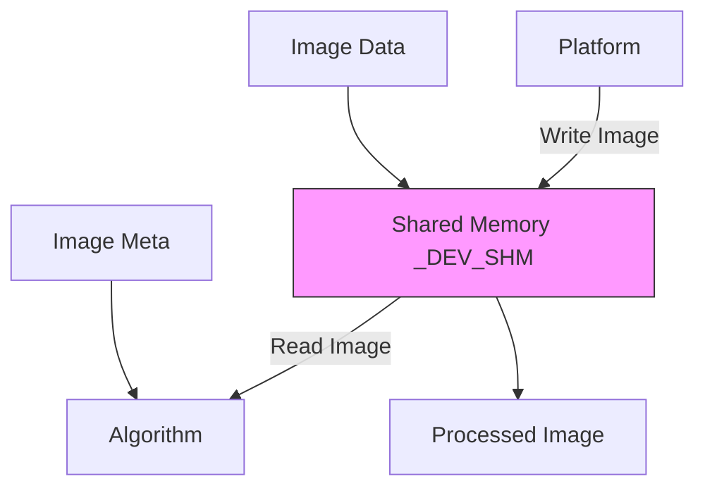
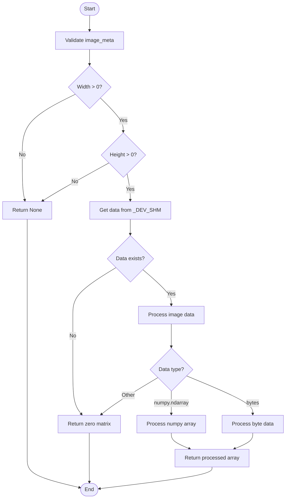
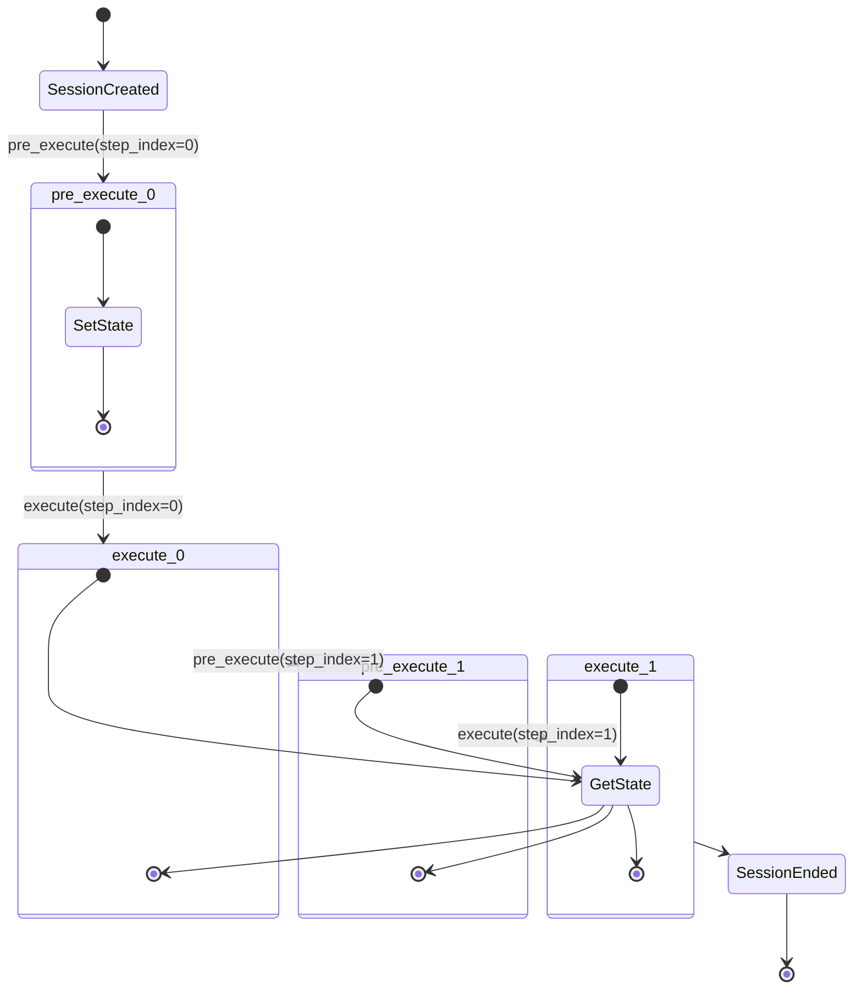
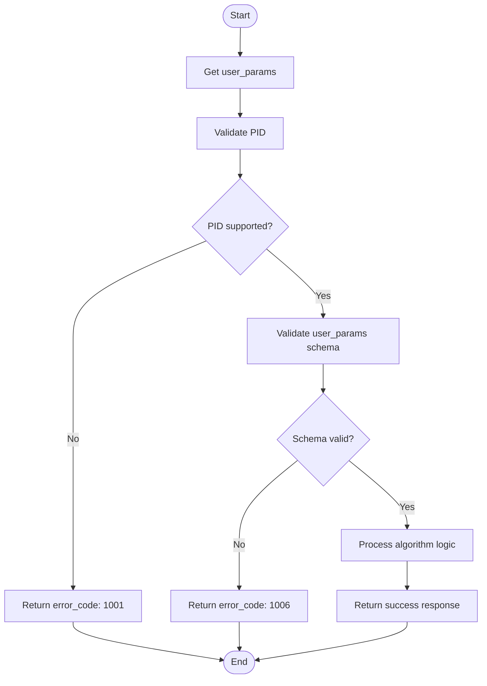
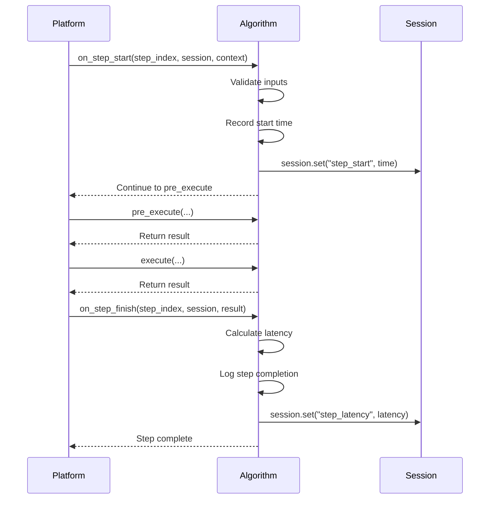
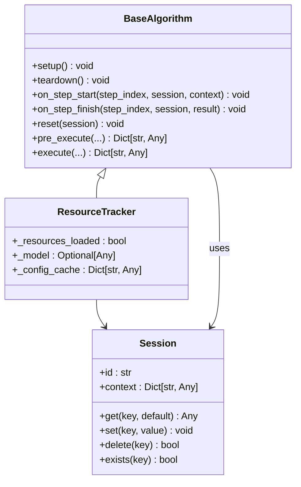
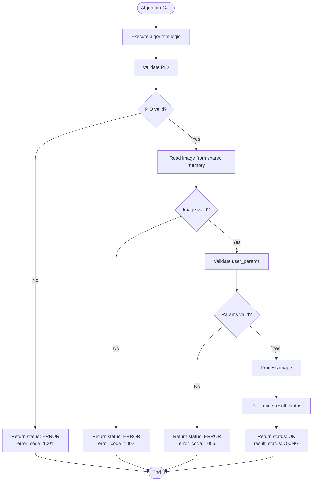

# Execution Problems

<cite>
**Referenced Files in This Document**   
- [base.py](file://procvision_algorithm_sdk/base.py)
- [session.py](file://procvision_algorithm_sdk/session.py)
- [shared_memory.py](file://procvision_algorithm_sdk/shared_memory.py)
- [errors.py](file://procvision_algorithm_sdk/errors.py)
- [diagnostics.py](file://procvision_algorithm_sdk/diagnostics.py)
- [logger.py](file://procvision_algorithm_sdk/logger.py)
- [test_shared_memory.py](file://tests/test_shared_memory.py)
- [test_session.py](file://tests/test_session.py)
- [test_base_algo.py](file://tests/test_base_algo.py)
- [spec.md](file://spec.md)
- [README.md](file://README.md)
- [algorithm_dev_tutorial.md](file://algorithm_dev_tutorial.md)
</cite>

## Table of Contents
1. [Introduction](#introduction)
2. [Core Components](#core-components)
3. [Shared Memory Image Access Issues](#shared-memory-image-access-issues)
4. [Session and State Management Problems](#session-and-state-management-problems)
5. [Parameter Validation and Schema Errors](#parameter-validation-and-schema-errors)
6. [Algorithm Lifecycle and Hook Execution](#algorithm-lifecycle-and-hook-execution)
7. [State Persistence and Resource Management](#state-persistence-and-resource-management)
8. [Status Machine and Error Handling](#status-machine-and-error-handling)
9. [Troubleshooting Guide](#troubleshooting-guide)
10. [Conclusion](#conclusion)

## Introduction
This document provides comprehensive troubleshooting guidance for execution-related issues in ProcVision algorithms. It addresses common problems encountered during algorithm execution, including shared memory image access failures, session serialization exceptions, parameter validation errors, and issues with the algorithm lifecycle. The document explains the correct implementation of the two-layer status machine (status vs result_status) and error handling patterns. By following the diagnostic techniques and solutions provided, developers can effectively identify and resolve issues related to image_meta data, PID validation, user_params schema violations, state persistence, and resource management.

## Core Components
The ProcVision algorithm SDK consists of several core components that work together to enable algorithm execution. The BaseAlgorithm class provides the foundation for all algorithms, defining the interface and lifecycle methods. The Session class enables state sharing across steps, while the shared memory system facilitates image data transfer. The error handling system provides a structured approach to managing different types of failures, and the logging and diagnostics components support debugging and monitoring.

**Section sources**
- [base.py](file://procvision_algorithm_sdk/base.py#L1-L57)
- [session.py](file://procvision_algorithm_sdk/session.py#L1-L35)
- [shared_memory.py](file://procvision_algorithm_sdk/shared_memory.py#L1-L52)
- [errors.py](file://procvision_algorithm_sdk/errors.py#L1-L13)

## Shared Memory Image Access Issues

### Understanding Shared Memory Architecture
The ProcVision SDK uses a shared memory system to transfer image data between the platform and algorithms. The system supports both byte data (JPEG/PNG) and numpy arrays, with automatic conversion and color space handling. The shared memory implementation uses an in-memory dictionary `_DEV_SHM` to store image data, with functions for writing and reading data.

**Diagram sources**
- [shared_memory.py](file://procvision_algorithm_sdk/shared_memory.py#L1-L52)

### Common Image Read Failures
Shared memory image read failures are one of the most common execution issues. These failures typically occur when the shared memory ID is incorrect, the image data is not properly written, or the image_meta contains invalid dimensions. The `read_image_from_shared_memory` function returns a zero matrix when data cannot be read, which can mask underlying issues.

The function requires at least width, height, timestamp_ms, and camera_id in the image_meta. If width or height is less than or equal to zero, the function returns None. When data is present in shared memory, the function attempts to process it based on its type (numpy array or bytes). For numpy arrays, it handles different dimensionalities and color spaces, converting BGR to RGB when specified.

**Section sources**
- [shared_memory.py](file://procvision_algorithm_sdk/shared_memory.py#L15-L51)
- [test_shared_memory.py](file://tests/test_shared_memory.py#L1-L15)
- [algorithm_dev_tutorial.md](file://algorithm_dev_tutorial.md#L103-L127)

### Diagnosing Image Meta Data Issues
Incorrect image_meta data is a frequent cause of image processing problems. The image_meta must contain valid width and height values, as these are used to create fallback images when data cannot be read. Issues with image_meta often manifest as zero matrices being returned from `read_image_from_shared_memory`, even when valid image data exists in shared memory.

To diagnose image_meta issues, verify that all required fields (width, height, timestamp_ms, camera_id) are present and contain valid values. The width and height must be positive integers. The optional color_space field should be either "RGB" or "BGR" (case-insensitive). When color_space is "BGR", the function automatically converts the image to RGB.

**Diagram sources**
- [shared_memory.py](file://procvision_algorithm_sdk/shared_memory.py#L15-L51)

## Session and State Management Problems

### Session Serialization Exceptions
Session serialization exceptions occur when attempting to store non-JSON-serializable objects in the session state store. The Session class validates that all values can be serialized to JSON before storing them, raising a TypeError if serialization fails. This is a common issue when developers attempt to store complex objects like sets, custom classes, or numpy arrays directly in the session.

The session implementation uses `json.dumps()` to validate serializability, which supports basic types (dict, list, str, int, float, bool, None) but not numpy types or custom objects without proper serialization methods. When a TypeError is raised, it includes information about the type of the non-serializable value.

**Section sources**
- [session.py](file://procvision_algorithm_sdk/session.py#L1-L35)
- [test_session.py](file://tests/test_session.py#L1-L23)

### State Persistence Across Steps
Proper state persistence is critical for multi-step algorithms. The Session object provides a state store that persists across pre_execute and execute calls within a single detection flow. However, this state is not preserved across different detection sessions or algorithm restarts.

Common issues with state persistence include:
- Attempting to store large amounts of data (>100KB) in the session
- Storing references to objects that cannot be serialized
- Assuming state persists across different product detections
- Not properly initializing state in pre_execute before use in execute

The session state store is designed for lightweight data sharing, such as configuration parameters, intermediate results, or counters. For larger data sets or persistent storage needs, algorithms should use file storage or database solutions.

**Diagram sources**
- [session.py](file://procvision_algorithm_sdk/session.py#L1-L35)
- [spec.md](file://spec.md#L1-L2102)

## Parameter Validation and Schema Errors

### PID Validation Failures
PID validation failures occur when an algorithm receives a product ID (PID) that it does not support. The BaseAlgorithm class includes a `_supported_pids` field that should be populated with all supported product IDs. In the pre_execute and execute methods, algorithms should validate that the provided PID is in this list and return an appropriate error response if not.

The standard error response for unsupported PIDs includes status "ERROR", a descriptive message, and error_code "1001". This validation should be one of the first checks performed in both pre_execute and execute methods to prevent unnecessary processing.

**Section sources**
- [base.py](file://procvision_algorithm_sdk/base.py#L1-L57)
- [test_base_algo.py](file://tests/test_base_algo.py#L1-L64)
- [spec.md](file://spec.md#L1-L2102)

### User Params Schema Violations
User parameters schema violations occur when the user_params dictionary contains keys or values that do not conform to the schema defined in the algorithm's get_info method. The Dev Runner performs schema validation before calling pre_execute and execute, but algorithms should also validate parameters internally for robustness.

Common schema violations include:
- Missing required parameters
- Parameters with incorrect types (e.g., string instead of float)
- Values outside min/max ranges for numeric parameters
- Invalid choices for enum parameters
- String values exceeding length limits

The standard error response for invalid parameters includes status "ERROR", a descriptive message, and error_code "1006". Algorithms should provide clear error messages that indicate which parameter is invalid and what the expected format or range is.

**Diagram sources**
- [base.py](file://procvision_algorithm_sdk/base.py#L1-L57)
- [spec.md](file://spec.md#L1-L2102)

## Algorithm Lifecycle and Hook Execution

### Setup and Teardown Issues
The setup and teardown methods provide hooks for resource management at the algorithm instance level. Issues with these methods typically involve improper resource initialization or cleanup.

Common setup issues include:
- Loading models or configurations that fail due to missing files
- Not setting _resources_loaded flag after successful initialization
- Throwing exceptions instead of returning None on failure

Common teardown issues include:
- Not properly releasing GPU memory or other resources
- Not cleaning up temporary files or connections
- Throwing exceptions during cleanup

The setup method should be idempotent and safe to call multiple times. If resources are already loaded, it should return immediately. The teardown method should handle cases where resources were never loaded or partially loaded.

**Section sources**
- [base.py](file://procvision_algorithm_sdk/base.py#L1-L57)
- [spec.md](file://spec.md#L1-L2102)

### On Step Start and Finish Hooks
The on_step_start and on_step_finish hooks allow algorithms to perform actions at the beginning and end of each step. Issues with these hooks typically involve performance impacts or state management problems.

Best practices for these hooks include:
- Keeping processing lightweight to avoid affecting step timing
- Using on_step_start for input validation and timestamp recording
- Using on_step_finish for logging, performance measurement, and state cleanup
- Not performing long-running operations that could cause timeouts

These hooks receive the step_index, session, and context parameters, allowing access to the current execution state. They should not modify the session state in ways that affect the main algorithm logic unless specifically designed to do so.

**Diagram sources**
- [base.py](file://procvision_algorithm_sdk/base.py#L1-L57)

### Reset Functionality Problems
The reset method is called when the platform triggers a re-detection or interruption. Issues with reset functionality typically involve improper cleanup of temporary state or accidental release of persistent resources.

The reset method should:
- Clear algorithm-specific temporary caches or buffers
- Reset step-specific counters or flags
- Not release model instances or other resources that should persist across detections
- Not modify the session object, as it is managed by the SDK

A common mistake is releasing GPU memory or unloading models in reset, which should only be done in teardown. The reset method is intended for cleaning up per-detection state, not per-instance resources.

**Section sources**
- [base.py](file://procvision_algorithm_sdk/base.py#L1-L57)
- [spec.md](file://spec.md#L1-L2102)

## State Persistence and Resource Management

### State Persistence Challenges
State persistence across steps relies on the Session object's state store. Challenges with state persistence include understanding the lifecycle of session data and managing data size limitations.

Key points about session state persistence:
- Data persists only within a single detection flow
- Data is not shared between different product detections
- Data is lost when the algorithm process restarts
- The recommended size limit is 100KB per session
- Only JSON-serializable data can be stored

Algorithms should initialize any required state in pre_execute rather than assuming it exists from previous steps. When storing complex data, consider using efficient serialization formats or storing only essential information.

**Section sources**
- [session.py](file://procvision_algorithm_sdk/session.py#L1-L35)
- [spec.md](file://spec.md#L1-L2102)

### Resource Management Best Practices
Proper resource management is critical for stable algorithm execution. This includes managing memory, GPU resources, file handles, and other system resources.

Best practices include:
- Loading heavy resources (models, large configurations) in setup, not __init__
- Releasing resources in teardown, with proper error handling
- Using context managers for file and network resources
- Monitoring GPU memory usage and handling OOM errors gracefully
- Implementing lazy loading for resources that are not always needed

The SDK provides the setup and teardown hooks specifically for resource management, allowing algorithms to initialize and clean up resources at the appropriate times in the instance lifecycle.

**Diagram sources**
- [base.py](file://procvision_algorithm_sdk/base.py#L1-L57)
- [session.py](file://procvision_algorithm_sdk/session.py#L1-L35)

## Status Machine and Error Handling

### Two-Layer Status Machine
The ProcVision SDK implements a two-layer status machine that separates technical execution status from business result status. This design provides clear separation between system-level issues and product quality determinations.

The two layers are:
1. **status**: Technical execution status (OK/ERROR) indicating whether the algorithm call succeeded
2. **result_status**: Business result status (OK/NG) indicating whether the product passed quality inspection

This separation allows the platform to handle technical failures (like image loading errors) differently from quality failures (like defect detection). The status field is used by the platform to determine if the algorithm executed successfully, while result_status is used to determine product disposition.

**Section sources**
- [base.py](file://procvision_algorithm_sdk/base.py#L1-L57)
- [spec.md](file://spec.md#L1-L2102)

### Error Handling Patterns
The SDK defines several error types to handle different categories of failures. Proper error handling is essential for robust algorithm execution.

The main error types are:
- **RecoverableError**: Errors that can be resolved by retrying or user intervention
- **FatalError**: Errors that require algorithm restart or manual intervention
- **GPUOutOfMemoryError**: Specific error for GPU memory exhaustion
- **ProgramError**: General program errors (file not found, etc.)

Algorithms should return structured error responses rather than throwing exceptions. The standard error response includes:
- status: "ERROR"
- message: Human-readable error description
- error_code: Machine-readable error code (e.g., "1001" for invalid PID)

The error_code field uses a standardized numbering system:
- 1001: invalid_pid
- 1002: image_load_failed
- 1003: model_not_found
- 1004: gpu_oom
- 1005: timeout
- 1006: invalid_params
- 1007: coordinate_invalid
- 9999: unknown_error

**Diagram sources**
- [errors.py](file://procvision_algorithm_sdk/errors.py#L1-L13)
- [spec.md](file://spec.md#L1-L2102)

## Troubleshooting Guide

### Diagnostic Techniques
Effective troubleshooting of ProcVision algorithm issues requires a systematic approach. The following techniques can help identify and resolve common problems:

1. **Log Analysis**: Use the StructuredLogger to output detailed information about algorithm execution. Log key events, parameter values, and processing times.

2. **Input Validation**: Verify that all inputs (PID, user_params, image_meta) are valid before processing. Check for required fields and valid ranges.

3. **Step-by-Step Execution**: Use the Dev Runner to test algorithms step by step, isolating issues to specific methods.

4. **State Inspection**: Use session.get() to inspect the state store at different points in execution.

5. **Resource Monitoring**: Monitor memory and GPU usage, especially during setup and execution.

**Section sources**
- [logger.py](file://procvision_algorithm_sdk/logger.py#L1-L23)
- [diagnostics.py](file://procvision_algorithm_sdk/diagnostics.py#L1-L11)
- [spec.md](file://spec.md#L1-L2102)

### Common Solutions
The following solutions address common execution problems:

**Shared Memory Issues**:
- Verify shared_mem_id matches between platform and algorithm
- Ensure image_meta contains valid width and height
- Check that image data is properly written to shared memory
- Use dev_write_image_to_shared_memory for testing

**Session Issues**:
- Ensure all stored values are JSON-serializable
- Initialize state in pre_execute before use
- Keep session data size under 100KB
- Use session.get() with defaults for optional values

**Parameter Issues**:
- Validate PID against _supported_pids list
- Check user_params against schema in get_info
- Provide clear error messages for invalid parameters
- Use default values for optional parameters

**Lifecycle Issues**:
- Implement setup for heavy resource loading
- Implement teardown for proper resource cleanup
- Use reset for temporary state cleanup only
- Keep on_step_start/on_step_finish lightweight

## Conclusion
This document has provided comprehensive guidance for troubleshooting execution-related issues in ProcVision algorithms. By understanding the shared memory system, session management, parameter validation, algorithm lifecycle, and error handling patterns, developers can effectively diagnose and resolve common problems. The two-layer status machine design provides clear separation between technical execution status and business result status, enabling robust error handling and system integration. Following the best practices and diagnostic techniques outlined in this document will help ensure reliable and maintainable algorithm implementations.