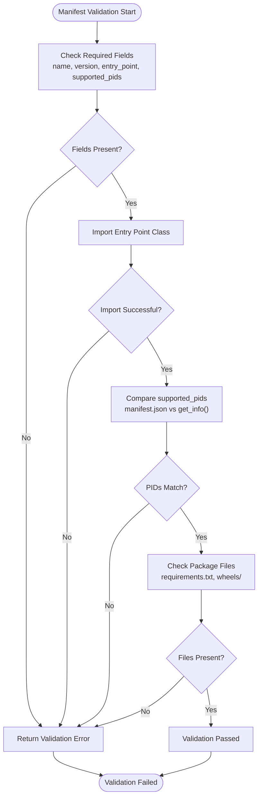
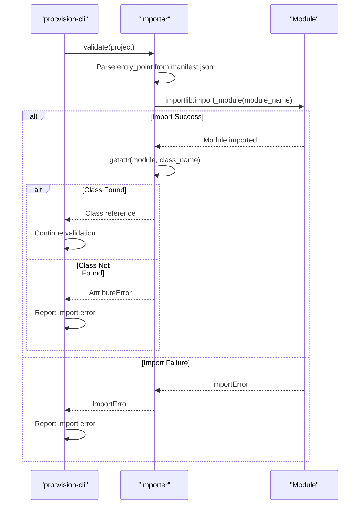
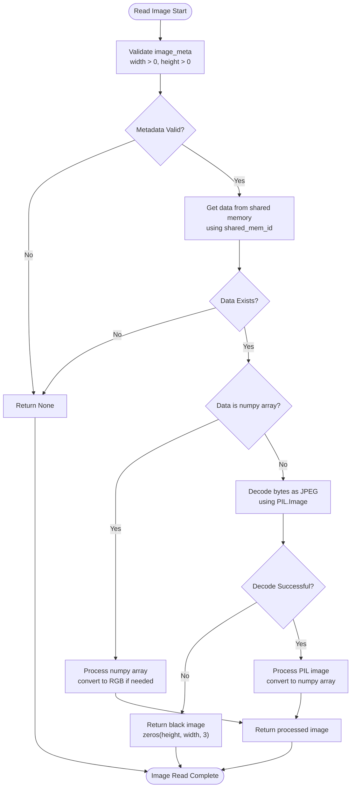
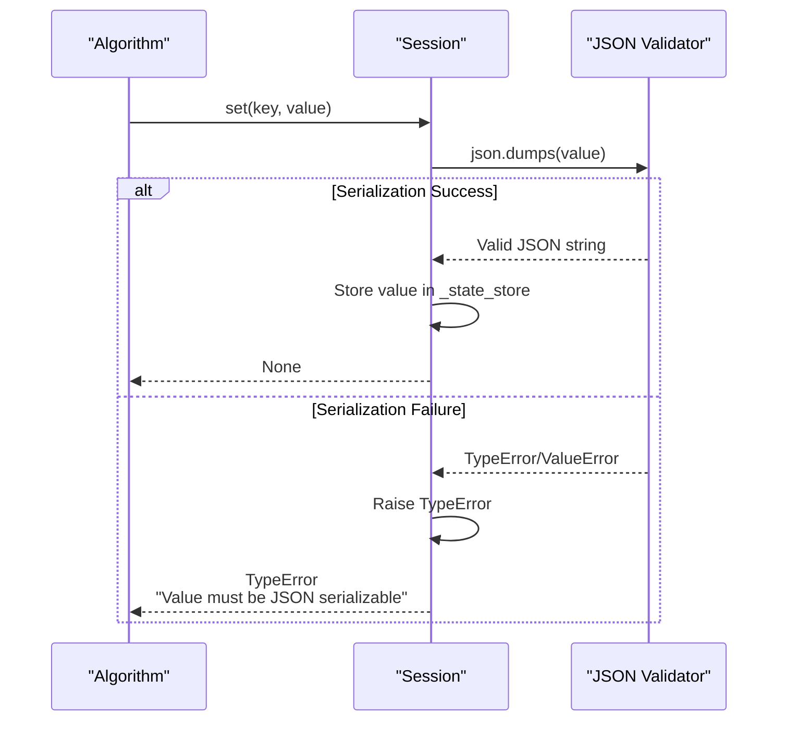
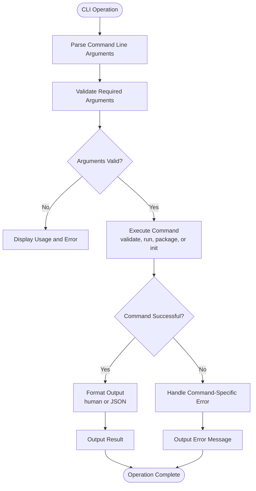
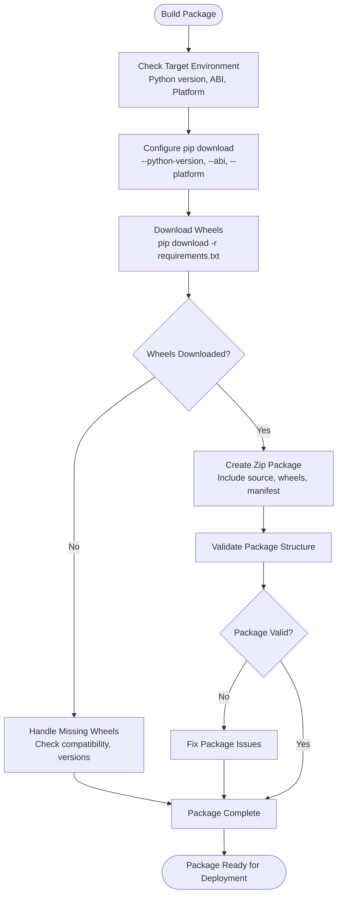
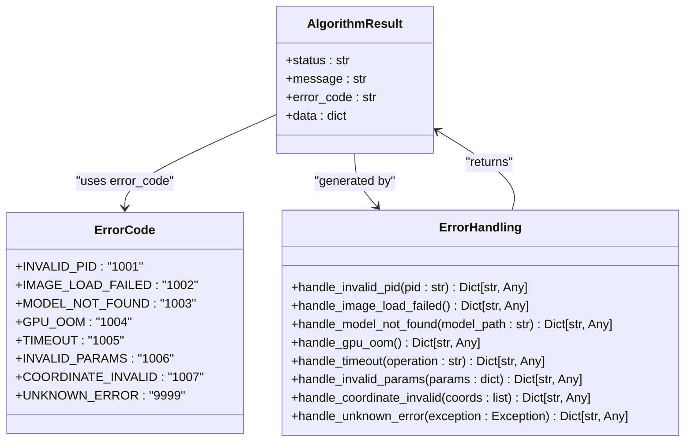
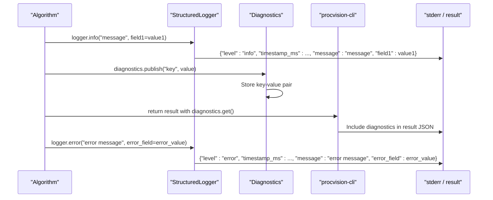

# Troubleshooting

<cite>
**Referenced Files in This Document**   
- [README.md](file://README.md)
- [spec.md](file://spec.md)
- [runner_spec.md](file://runner_spec.md)
- [cli.py](file://procvision_algorithm_sdk/cli.py)
- [base.py](file://procvision_algorithm_sdk/base.py)
- [errors.py](file://procvision_algorithm_sdk/errors.py)
- [logger.py](file://procvision_algorithm_sdk/logger.py)
- [session.py](file://procvision_algorithm_sdk/session.py)
- [shared_memory.py](file://procvision_algorithm_sdk/shared_memory.py)
- [manifest.json](file://algorithm-example/manifest.json)
- [main.py](file://algorithm-example/algorithm_example/main.py)
</cite>

## Table of Contents
1. [Introduction](#introduction)
2. [Manifest Validation Failures](#manifest-validation-failures)
3. [Entry Point Import Errors](#entry-point-import-errors)
4. [Shared Memory Image Read Failures](#shared-memory-image-read-failures)
5. [Session Serialization Exceptions](#session-serialization-exceptions)
6. [CLI Operation Errors](#cli-operation-errors)
7. [Platform-Specific Compatibility Issues](#platform-specific-compatibility-issues)
8. [Error Code Interpretation](#error-code-interpretation)
9. [Debugging Techniques](#debugging-techniques)
10. [Using the Example Algorithm](#using-the-example-algorithm)
11. [Support Resources](#support-resources)

## Introduction
This document provides comprehensive troubleshooting guidance for common issues encountered when developing and deploying ProcVision algorithms. It covers validation failures, import errors, shared memory issues, session serialization problems, and CLI operation errors. The document also addresses platform-specific compatibility concerns, error code interpretation, and debugging techniques using structured logs and diagnostic data. Reference is made to spec.md and runner_spec.md for protocol and environment requirements, and guidance is provided on using the example algorithm for comparison and validation.

**Section sources**
- [README.md](file://README.md#L1-L115)
- [spec.md](file://spec.md#L1-L799)

## Manifest Validation Failures
Manifest validation failures occur when the manifest.json file does not meet the required structure or contains inconsistent information. Common issues include missing required fields, mismatched supported_pids between manifest and get_info(), or incorrect entry_point formatting.

The validation process checks for the presence of required fields such as name, version, entry_point, and supported_pids. It also verifies that the entry_point can be imported and that the supported_pids in the manifest.json exactly match those returned by the get_info() method. Additionally, the validation checks for the presence of necessary files in the algorithm package, including requirements.txt and the wheels/ directory.

**Diagram sources**
- [cli.py](file://procvision_algorithm_sdk/cli.py#L20-L150)
- [spec.md](file://spec.md#L1-L799)

**Section sources**
- [cli.py](file://procvision_algorithm_sdk/cli.py#L20-L150)
- [spec.md](file://spec.md#L1-L799)

## Entry Point Import Errors
Entry point import errors occur when the algorithm's entry point cannot be successfully imported by the ProcVision platform. This typically happens due to incorrect entry_point formatting in manifest.json, module import failures, or class definition issues.

The entry_point field in manifest.json must follow the format "module_path:class_name", where module_path is the Python import path relative to the package root, and class_name is the name of the algorithm class that inherits from BaseAlgorithm. Common issues include typos in the module path or class name, missing __init__.py files in package directories, or the algorithm class not being properly defined or exported.

**Diagram sources**
- [cli.py](file://procvision_algorithm_sdk/cli.py#L20-L150)
- [base.py](file://procvision_algorithm_sdk/base.py#L1-L57)

**Section sources**
- [cli.py](file://procvision_algorithm_sdk/cli.py#L20-L150)
- [base.py](file://procvision_algorithm_sdk/base.py#L1-L57)

## Shared Memory Image Read Failures
Shared memory image read failures occur when the algorithm cannot successfully read image data from the shared memory location specified by shared_mem_id. This can happen due to incorrect image_meta information, missing or corrupted image data in shared memory, or issues with the image decoding process.

The read_image_from_shared_memory function attempts to read image data from shared memory using the provided shared_mem_id and image_meta. It first checks that the width and height in image_meta are valid, then retrieves the raw bytes from shared memory. If the data is a numpy array, it is processed directly. Otherwise, it attempts to decode the bytes as a JPEG image using PIL. If decoding fails, a fallback black image of the specified dimensions is returned.

**Diagram sources**
- [shared_memory.py](file://procvision_algorithm_sdk/shared_memory.py#L1-L52)
- [spec.md](file://spec.md#L1-L799)

**Section sources**
- [shared_memory.py](file://procvision_algorithm_sdk/shared_memory.py#L1-L52)
- [spec.md](file://spec.md#L1-L799)

## Session Serialization Exceptions
Session serialization exceptions occur when attempting to store non-JSON-serializable objects in the Session object using the set() method. The Session object requires all stored values to be JSON-serializable to ensure proper state persistence and transmission.

The Session class validates that any value passed to set() can be serialized to JSON by attempting to call json.dumps() on the value. If this fails with a TypeError or ValueError, a TypeError is raised indicating that the value must be JSON-serializable. This constraint ensures that session data can be reliably stored, transmitted, and reconstructed across different execution contexts.

**Diagram sources**
- [session.py](file://procvision_algorithm_sdk/session.py#L1-L23)
- [spec.md](file://spec.md#L1-L799)

**Section sources**
- [session.py](file://procvision_algorithm_sdk/session.py#L1-L23)
- [spec.md](file://spec.md#L1-L799)

## CLI Operation Errors
CLI operation errors occur during validate, run, and package operations using the procvision-cli tool. These errors can stem from incorrect command usage, missing required arguments, or failures in the underlying operations.

The procvision-cli provides several subcommands for algorithm development and testing:
- validate: Checks the algorithm package structure, manifest.json, entry point, and supported_pids consistency
- run: Simulates algorithm execution with a local image written to shared memory
- package: Creates an offline delivery zip package with all dependencies
- init: Initializes a new algorithm project scaffold

Common errors include missing required arguments (e.g., --pid and --image for run), invalid JSON in --params, or missing manifest.json in the project directory. The CLI provides both human-readable and JSON output formats for easier integration with automated systems.

**Diagram sources**
- [cli.py](file://procvision_algorithm_sdk/cli.py#L152-L614)
- [README.md](file://README.md#L1-L115)

**Section sources**
- [cli.py](file://procvision_algorithm_sdk/cli.py#L152-L614)
- [README.md](file://README.md#L1-L115)

## Platform-Specific Compatibility Issues
Platform-specific compatibility issues arise from differences between the development and target deployment environments, particularly regarding Python version, wheel compatibility, and operating system dependencies.

The algorithm package must be built with wheels compatible with the target platform's Python version, implementation, and ABI. For example, a wheel built for Python 3.10 on Windows (cp310-win_amd64) will not work on Python 3.11 or on Linux. The package command uses pip download with platform-specific flags to ensure compatible wheels are downloaded.

Common issues include:
- Python version mismatch between development and target environments
- ABI incompatibility (e.g., cp310 vs cp311)
- Platform-specific wheels (e.g., win_amd64 vs manylinux)
- Missing native dependencies in the target environment

**Diagram sources**
- [cli.py](file://procvision_algorithm_sdk/cli.py#L400-L500)
- [runner_spec.md](file://runner_spec.md#L1-L282)

**Section sources**
- [cli.py](file://procvision_algorithm_sdk/cli.py#L400-L500)
- [runner_spec.md](file://runner_spec.md#L1-L282)

## Error Code Interpretation
Error codes provide standardized indicators of specific failure conditions in ProcVision algorithms. Understanding these codes is essential for effective troubleshooting and debugging.

The system defines standard error codes that should be used consistently across algorithms:
- 1001: invalid_pid - The requested PID is not supported by the algorithm
- 1002: image_load_failed - Failed to load or decode the input image
- 1003: model_not_found - Required model file is missing
- 1004: gpu_oom - GPU out of memory during inference
- 1005: timeout - Operation exceeded allowed time limit
- 1006: invalid_params - User parameters failed validation
- 1007: coordinate_invalid - Generated coordinates are invalid
- 9999: unknown_error - Generic error when no specific code applies

These error codes should be returned in the error_code field of the result dictionary when status is "ERROR". They enable consistent error handling and user feedback across different algorithms and platforms.

**Diagram sources**
- [spec.md](file://spec.md#L1-L799)
- [runner_spec.md](file://runner_spec.md#L1-L282)
- [errors.py](file://procvision_algorithm_sdk/errors.py#L1-L13)

**Section sources**
- [spec.md](file://spec.md#L1-L799)
- [runner_spec.md](file://runner_spec.md#L1-L282)
- [errors.py](file://procvision_algorithm_sdk/errors.py#L1-L13)

## Debugging Techniques
Effective debugging of ProcVision algorithms involves using structured logs, diagnostic data, and the built-in CLI tools to identify and resolve issues.

The SDK provides a StructuredLogger that outputs JSON-formatted log records to stderr with fields including timestamp_ms, level, message, and additional context-specific fields. This structured format enables easy parsing and analysis of log data. Algorithms should use the logger to record important events, errors, and performance metrics.

Diagnostic data can be published using the Diagnostics object's publish() method, which stores key-value pairs that can be included in the algorithm's result for visualization in the platform UI. This is useful for exposing internal state, confidence scores, processing times, and other debugging information.

**Diagram sources**
- [logger.py](file://procvision_algorithm_sdk/logger.py#L1-L23)
- [diagnostics.py](file://procvision_algorithm_sdk/diagnostics.py#L1-L11)
- [cli.py](file://procvision_algorithm_sdk/cli.py#L152-L614)

**Section sources**
- [logger.py](file://procvision_algorithm_sdk/logger.py#L1-L23)
- [diagnostics.py](file://procvision_algorithm_sdk/diagnostics.py#L1-L11)
- [cli.py](file://procvision_algorithm_sdk/cli.py#L152-L614)

## Using the Example Algorithm
The example algorithm provided in the algorithm-example directory serves as a reference implementation for developing new ProcVision algorithms. It demonstrates proper implementation of the BaseAlgorithm interface, use of shared memory for image access, session state management, and structured logging.

The example algorithm includes a complete manifest.json file, a main.py implementation with all required methods (get_info, pre_execute, execute), and demonstrates the use of lifecycle hooks (setup, teardown, on_step_start, on_step_finish, reset). It also shows how to handle user parameters, publish diagnostic data, and generate appropriate return values for both successful execution and error conditions.

Developers should use the example algorithm as a template for their own implementations, ensuring that their code follows the same patterns and conventions. The example can also be used for testing the development environment and CLI tools before implementing custom algorithm logic.

**Section sources**
- [algorithm-example/manifest.json](file://algorithm-example/manifest.json#L1-L24)
- [algorithm-example/algorithm_example/main.py](file://algorithm-example/algorithm_example/main.py#L1-L149)
- [README.md](file://README.md#L1-L115)

## Support Resources
When encountering issues that cannot be resolved through the troubleshooting steps outlined in this document, developers should consult the following resources:

1. **spec.md**: The primary specification document that defines the algorithm interface, data structures, and protocol requirements.
2. **runner_spec.md**: Details the platform-side runtime behavior, communication protocol, and error handling strategies.
3. **README.md**: Provides installation instructions, quick start guide, and usage examples for the SDK.
4. **algorithm_dev_quickstart.md**: Step-by-step guide for getting started with algorithm development.
5. **algorithm_dev_tutorial.md**: Comprehensive tutorial covering advanced development topics.

For unresolved issues, contact the ProcVision support team with detailed information including:
- Algorithm package version
- Target platform specifications
- Complete error messages and logs
- Steps to reproduce the issue
- Expected vs. actual behavior

**Section sources**
- [spec.md](file://spec.md#L1-L799)
- [runner_spec.md](file://runner_spec.md#L1-L282)
- [README.md](file://README.md#L1-L115)
- [algorithm_dev_quickstart.md](file://algorithm_dev_quickstart.md)
- [algorithm_dev_tutorial.md](file://algorithm_dev_tutorial.md)