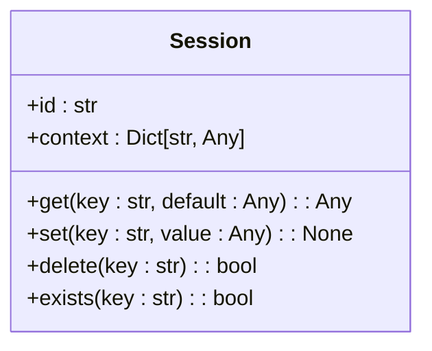
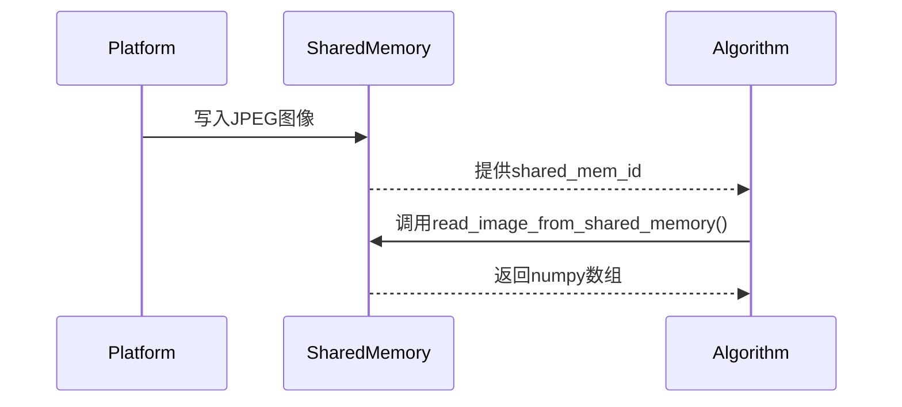
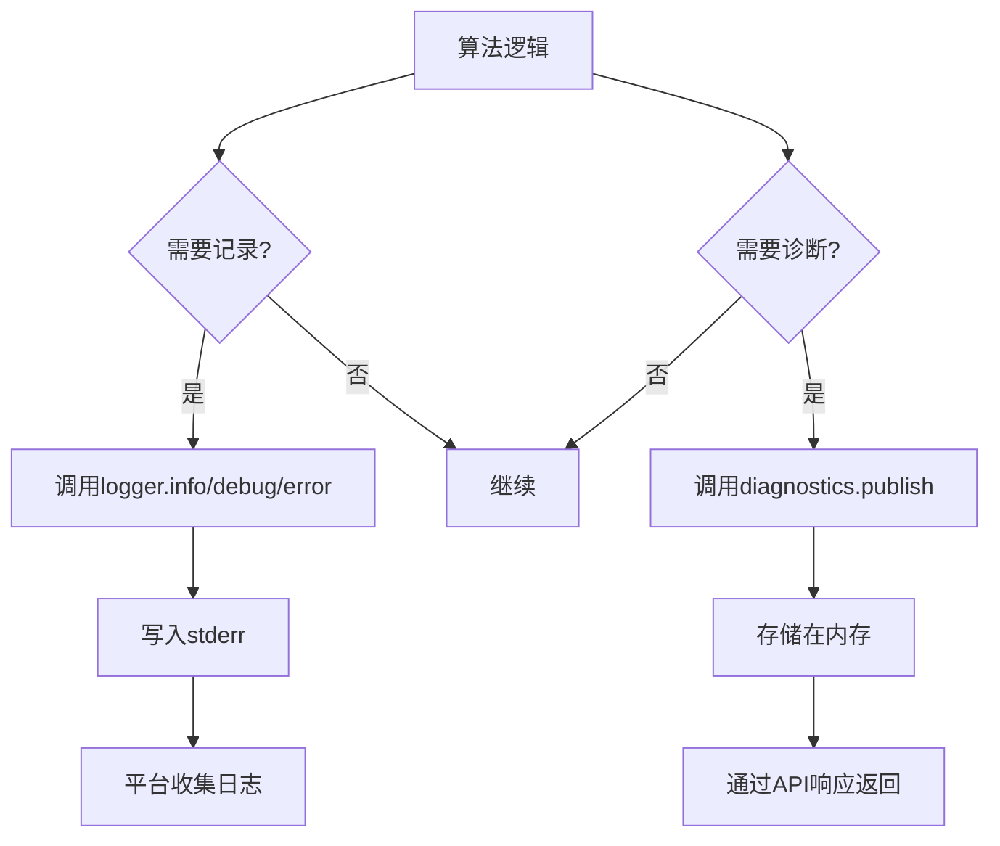
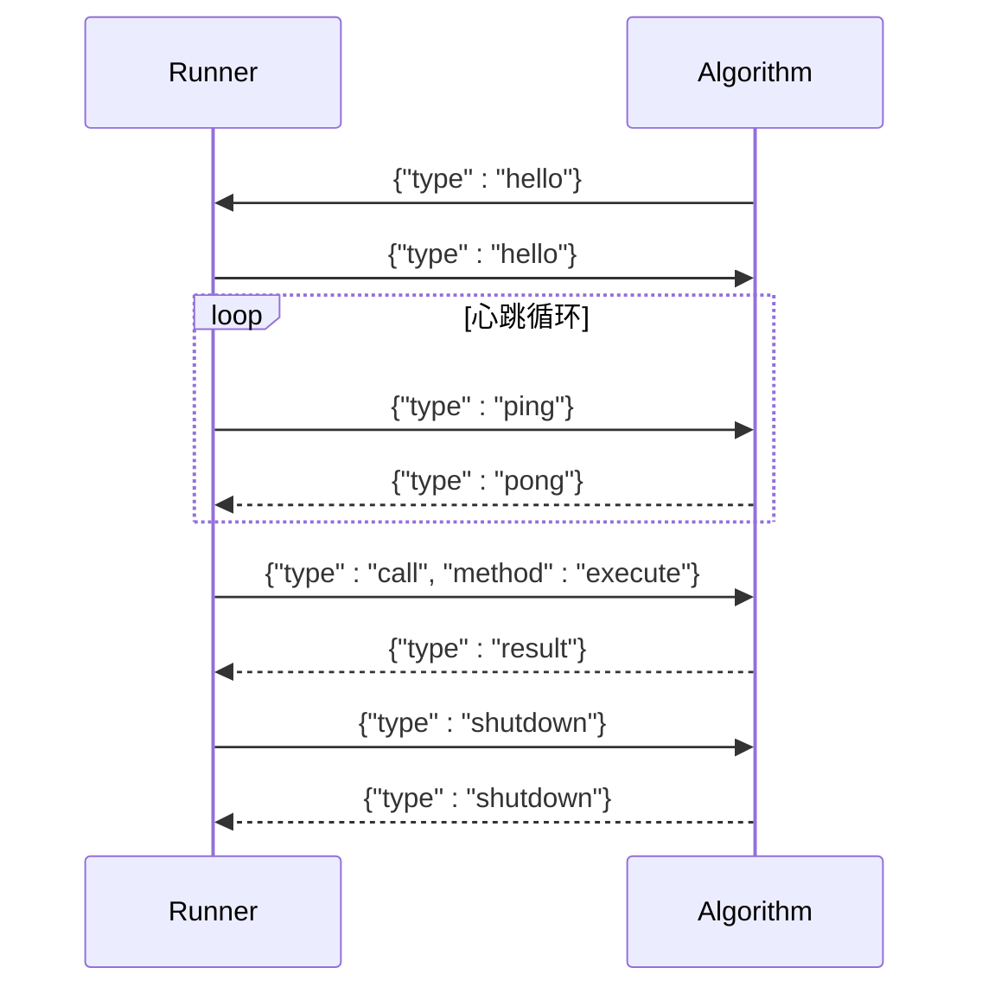

# API参考

<cite>
**本文档引用的文件**   
- [README.md](file://README.md)
- [spec.md](file://spec.md)
- [base.py](file://procvision_algorithm_sdk/base.py)
- [session.py](file://procvision_algorithm_sdk/session.py)
- [shared_memory.py](file://procvision_algorithm_sdk/shared_memory.py)
- [logger.py](file://procvision_algorithm_sdk/logger.py)
- [diagnostics.py](file://procvision_algorithm_sdk/diagnostics.py)
- [errors.py](file://procvision_algorithm_sdk/errors.py)
- [cli.py](file://procvision_algorithm_sdk/cli.py)
- [manifest.json](file://algorithm-example/manifest.json)
- [main.py](file://algorithm-example/algorithm_example/main.py)
</cite>

## 目录
1. [简介](#简介)
2. [核心API端点](#核心api端点)
3. [Session状态共享](#session状态共享)
4. [图像传输与共享内存](#图像传输与共享内存)
5. [日志与诊断](#日志与诊断)
6. [错误处理](#错误处理)
7. [进程间通信协议](#进程间通信协议)
8. [开发工具与CLI](#开发工具与cli)
9. [常见用例与实现指南](#常见用例与实现指南)
10. [性能优化技巧](#性能优化技巧)
11. [调试与监控](#调试与监控)
12. [版本控制与兼容性](#版本控制与兼容性)

## 简介

工业视觉平台ProcVision算法SDK为算法开发者提供了一套标准化的接口规范，用于实现与主平台解耦的算法模块。该SDK通过定义清晰的公共API，支持动态热加载、环境隔离和离线部署，确保算法模块在不同产品型号间的灵活适配与稳定运行。

SDK的核心设计哲学是“一对多实例-PID”，即单个算法实例可支持多个产品型号（PID），通过调用参数传递当前产品型号，实现配置差异化适配。这种设计减少了内存占用，提升了初始化效率，避免了代码冗余。

本文档详细记录了SDK的公共API，包括接口定义、数据流、通信协议、错误处理、日志诊断等关键机制，并提供了实现指南和最佳实践。

**Section sources**
- [README.md](file://README.md#L1-L115)
- [spec.md](file://spec.md#L1-L799)

## 核心API端点

### get_info()

**用途**：返回算法的元信息与步骤配置，包括可调参数的Schema。

**HTTP方法**：N/A（本地方法调用）

**URL模式**：N/A

**请求/响应模式**：
```json
{
  "name": "string",
  "version": "string",
  "description": "string",
  "supported_pids": ["string"],
  "steps": [
    {
      "index": 0,
      "name": "string",
      "params": [
        {
          "key": "string",
          "type": "int|float|rect|enum|bool|string",
          "required": true,
          "default": "any",
          "min": "number",
          "max": "number",
          "choices": ["string"],
          "unit": "string",
          "description": "string"
        }
      ]
    }
  ]
}
```

**认证方法**：N/A

**IPC/Pipe通信**：N/A

**数据流**：平台在加载算法时调用此方法，用于获取算法支持的产品型号、步骤信息和参数配置。

**消息传递**：直接方法调用，返回字典结构。

**进程同步**：同步调用，在算法初始化时执行。

**安全注意事项**：返回的`supported_pids`必须与`manifest.json`中的字段完全一致，否则平台将拒绝加载。

**版本控制**：语义化版本号，必须与`manifest.json`中的版本一致。

**Section sources**
- [spec.md](file://spec.md#L300-L350)
- [base.py](file://procvision_algorithm_sdk/base.py#L20-L25)

### pre_execute()

**用途**：在执行核心检测前调用，用于产出参考信息（如模板、ROI等）。

**HTTP方法**：N/A（本地方法调用）

**URL模式**：N/A

**请求参数**：
- `step_index`: 步骤索引（从1开始）
- `pid`: 产品型号编码
- `session`: 会话对象
- `user_params`: 用户可调参数
- `shared_mem_id`: 共享内存ID
- `image_meta`: 图像元信息

**响应模式**：
```json
{
  "status": "OK|ERROR",
  "message": "string",
  "data": {
    "calibration_rects": [
      {"x": 0, "y": 0, "width": 0, "height": 0, "label": "string"}
    ],
    "debug": {"latency_ms": 0.0}
  }
}
```

**认证方法**：N/A

**IPC/Pipe通信**：通过`stdin/stdout`管道通信，使用“4字节大端长度 + UTF-8 JSON”帧格式。

**数据流**：平台发送`call`帧，算法处理后返回`result`帧。

**消息传递**：`type="call"`，`method="pre_execute"`，`payload`包含所有参数。

**进程同步**：同步调用，有10秒超时限制。

**安全注意事项**：不应抛出异常，所有错误应通过返回值中的`status="ERROR"`表示。

**版本控制**：v0.2.1版本统一使用`timestamp_ms`时间戳。

**Section sources**
- [spec.md](file://spec.md#L351-L400)
- [base.py](file://procvision_algorithm_sdk/base.py#L27-L41)

### execute()

**用途**：执行核心检测或引导逻辑，返回检测结果。

**HTTP方法**：N/A（本地方法调用）

**URL模式**：N/A

**请求参数**：同`pre_execute()`

**响应模式**：
```json
{
  "status": "OK|ERROR",
  "message": "string",
  "data": {
    "result_status": "OK|NG",
    "ng_reason": "string",
    "defect_rects": [
      {"x": 0, "y": 0, "width": 0, "height": 0, "label": "string", "score": 0.0}
    ],
    "position_rects": [
      {"x": 0, "y": 0, "width": 0, "height": 0, "label": "string"}
    ],
    "debug": {
      "latency_ms": 0.0,
      "confidence": 0.0,
      "brightness": 0.0,
      "model_version": "string"
    }
  }
}
```

**认证方法**：N/A

**IPC/Pipe通信**：同`pre_execute()`，通过双工管道通信。

**数据流**：平台发送`call`帧，算法处理后返回`result`帧。

**消息传递**：`type="call"`，`method="execute"`，`payload`包含所有参数。

**进程同步**：同步调用，有30秒超时限制。

**安全注意事项**：`defect_rects`最多返回20个元素，避免数据过大。

**版本控制**：v0.2.1版本删除了`overlay`字段，统一不支持。

**Section sources**
- [spec.md](file://spec.md#L401-L450)
- [base.py](file://procvision_algorithm_sdk/base.py#L43-L57)

## Session状态共享

### Session API

**用途**：在单次检测流程中跨步骤共享数据。

**属性**：
- `id`: 会话唯一标识
- `context`: 只读上下文信息（产品信息、操作员等）

**方法**：
- `get(key, default=None)`: 获取值
- `set(key, value)`: 设置值（必须JSON可序列化）
- `delete(key)`: 删除值
- `exists(key)`: 检查键是否存在

**数据流**：平台在每次工艺流程开始时创建`Session`对象，并在整个流程中透传给所有API调用。

**消息传递**：作为参数传递给`pre_execute`和`execute`。

**进程同步**：同步访问，线程安全。

**安全注意事项**：不要存储大量数据（建议<100KB），数据仅在单次检测流程内有效。

**性能优化**：避免频繁的序列化操作，尽量使用轻量级数据结构。



**Diagram sources**
- [session.py](file://procvision_algorithm_sdk/session.py#L1-L36)

**Section sources**
- [spec.md](file://spec.md#L451-L500)
- [session.py](file://procvision_algorithm_sdk/session.py#L1-L36)

## 图像传输与共享内存

### read_image_from_shared_memory()

**用途**：从共享内存读取JPEG编码的图像数据。

**参数**：
- `shared_mem_id`: 共享内存ID
- `image_meta`: 图像元信息（`width`, `height`, `timestamp_ms`, `camera_id`）

**返回值**：`numpy.ndarray`格式的图像数组（HxWx3）

**数据流**：平台将JPEG图像写入共享内存，算法通过此函数读取。

**消息传递**：`shared_mem_id`通过API参数传递，`image_meta`提供解码所需元信息。

**进程同步**：同步调用，确保数据一致性。

**安全注意事项**：必须使用SDK提供的函数读取，禁止直接访问共享内存。

**性能优化**：避免重复解码，可缓存解码结果。

### write_image_array_to_shared_memory()

**用途**：将图像数组写入共享内存（开发模式）。

**参数**：
- `shared_mem_id`: 共享内存ID
- `image_array`: 图像数组

**数据流**：仅用于开发测试，模拟平台写入图像。

**消息传递**：N/A

**进程同步**：同步写入。



**Diagram sources**
- [shared_memory.py](file://procvision_algorithm_sdk/shared_memory.py#L1-L53)

**Section sources**
- [spec.md](file://spec.md#L501-L550)
- [shared_memory.py](file://procvision_algorithm_sdk/shared_memory.py#L1-L53)

## 日志与诊断

### StructuredLogger

**用途**：输出结构化日志到`stderr`。

**方法**：
- `info(message, **fields)`
- `debug(message, **fields)`
- `error(message, **fields)`

**数据流**：日志写入`stderr`，由平台收集。

**消息传递**：JSON格式，包含`level`, `timestamp_ms`, `message`等字段。

**进程同步**：异步写入，不影响主流程。

**安全注意事项**：所有日志必须通过此接口输出，禁止使用`print`。

### Diagnostics

**用途**：上报诊断数据用于UI展示和远程排查。

**方法**：
- `publish(key, value)`: 发布诊断数据
- `get()`: 获取所有诊断数据

**数据流**：诊断数据存储在内存中，可通过`data.debug`返回。

**消息传递**：作为`debug`字段包含在API响应中。



**Diagram sources**
- [logger.py](file://procvision_algorithm_sdk/logger.py#L1-L24)
- [diagnostics.py](file://procvision_algorithm_sdk/diagnostics.py#L1-L12)

**Section sources**
- [spec.md](file://spec.md#L551-L600)
- [logger.py](file://procvision_algorithm_sdk/logger.py#L1-L24)
- [diagnostics.py](file://procvision_algorithm_sdk/diagnostics.py#L1-L12)

## 错误处理

### 错误分类

| 错误类型 | 含义 | 处理方式 |
|---------|------|---------|
| 程序异常 | 代码/环境/资源问题 | `status="ERROR"` + `message` |
| 业务异常 | 条件未准备好 | `status="ERROR"` + `message` |
| 检测NG | 产品不合格 | `status="OK"` + `data.result_status="NG"` |

### 标准错误码

| 错误码 | 含义 |
|-------|------|
| 1001 | 不支持的产品型号 |
| 1002 | 图像数据为空 |
| 1003 | 未找到模板 |

**最佳实践**：
- 不应抛出异常，所有错误通过返回值表示
- `status="ERROR"`表示调用失败，`data.result_status="NG"`表示业务不合格
- 提供人类可读的`message`

**Section sources**
- [spec.md](file://spec.md#L601-L650)
- [errors.py](file://procvision_algorithm_sdk/errors.py#L1-L14)

## 进程间通信协议

### 通信机制

**方式**：`stdin/stdout`双向管道

**帧格式**：“4字节大端长度 + UTF-8 JSON”

**消息类型**：
- `hello`: 握手
- `call`: 调用API
- `result`: 返回结果
- `ping`: 心跳请求
- `pong`: 心跳响应
- `shutdown`: 关闭

### 心跳机制

**目的**：监控算法进程健康状态

**参数**：
- `ping`间隔：5秒
- 心跳超时：2秒
- 最大重试：2次
- `execute`超时：30秒

**流程**：
1. 算法启动后发送`hello`
2. 平台回复`hello`
3. 平台定期发送`ping`
4. 算法必须在2秒内回复`pong`
5. 超时则判定为进程僵死



**Diagram sources**
- [spec.md](file://spec.md#L651-L750)
- [cli.py](file://procvision_algorithm_sdk/cli.py#L1-L615)

**Section sources**
- [spec.md](file://spec.md#L651-L750)
- [cli.py](file://procvision_algorithm_sdk/cli.py#L1-L615)

## 开发工具与CLI

### procvision-cli

**用途**：开发运行器，用于本地验证和测试。

**命令**：
- `validate`: 验证算法包结构
- `run`: 本地模拟运行
- `package`: 构建离线交付包
- `init`: 初始化算法脚手架

**参数验证**：自动校验`manifest.json`、`supported_pids`一致性、返回结构等。

**离线交付**：生成包含源码、`requirements.txt`、`wheels/`的zip包。

**Section sources**
- [README.md](file://README.md#L100-L115)
- [cli.py](file://procvision_algorithm_sdk/cli.py#L1-L615)

## 常见用例与实现指南

### 实现步骤

1. 继承`BaseAlgorithm`
2. 实现`get_info()`返回元信息
3. 实现`pre_execute()`和`execute()`核心逻辑
4. 使用`Session`跨步骤共享数据
5. 通过`read_image_from_shared_memory()`获取图像
6. 使用`StructuredLogger`输出日志

### 参数处理

```python
threshold = float(user_params.get("threshold", 0.5))
roi = user_params.get("roi")  # rect类型
if not roi:
    return {"status": "ERROR", "message": "ROI参数缺失"}
```

### 跨步骤状态管理

```python
# 步骤1: 存储模板
session.set("template", template_image)

# 步骤2: 读取模板
template = session.get("template")
if template is None:
    return {"status": "ERROR", "message": "未找到模板"}
```

**Section sources**
- [main.py](file://algorithm-example/algorithm_example/main.py#L1-L150)
- [spec.md](file://spec.md#L300-L450)

## 性能优化技巧

### 内存管理

- 在`setup()`中加载模型，在`teardown()`中释放
- 避免在`pre_execute`/`execute`中重复加载资源
- 使用`Session`缓存跨步骤数据

### 计算优化

- 复用图像解码结果
- 批量处理相似操作
- 使用`numpy`向量化计算

### 通信优化

- 减少`Session`中存储的数据量
- 避免在`debug`字段中返回大对象
- 合理设置超时参数

**Section sources**
- [spec.md](file://spec.md#L751-L799)
- [main.py](file://algorithm-example/algorithm_example/main.py#L1-L150)

## 调试与监控

### 调试工具

- `procvision-cli validate`: 验证包结构
- `procvision-cli run`: 本地模拟运行
- 结构化日志：通过`logger`输出调试信息
- 诊断数据：通过`diagnostics`上报关键指标

### 监控指标

- 调用耗时：`debug.latency_ms`
- 图像质量：`debug.brightness`
- 模型版本：`debug.model_version`
- 置信度：`debug.confidence`

**Section sources**
- [spec.md](file://spec.md#L551-L600)
- [cli.py](file://procvision_algorithm_sdk/cli.py#L1-L615)

## 版本控制与兼容性

### 版本兼容性

- **v0.2.1**: 当前版本，统一`timestamp_ms`，简化参数类型
- **v0.2.0**: 引入`pid`参数动态传递，支持一对多实例-PID
- **v0.1.0**: 算法实例绑定单个PID

### 迁移指南

从v0.1.0迁移至v0.2.0+：
1. 移除`__init__`中的`pid`参数
2. 在`pre_execute`和`execute`中添加`pid`参数
3. 更新`get_info()`中的`supported_pids`
4. 确保`manifest.json`与代码中`supported_pids`一致

### 向后兼容性

- 保持`pre_execute`和`execute`的参数顺序
- 维持`status`/`message`/`data`的返回结构
- `Session` API保持稳定

**Section sources**
- [spec.md](file://spec.md#L1-L100)
- [README.md](file://README.md#L1-L115)