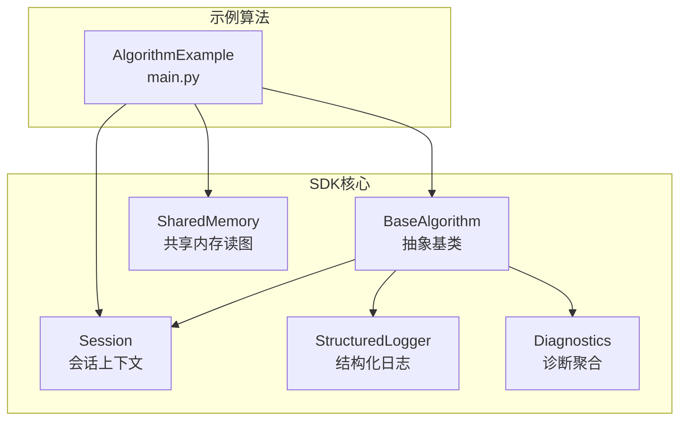
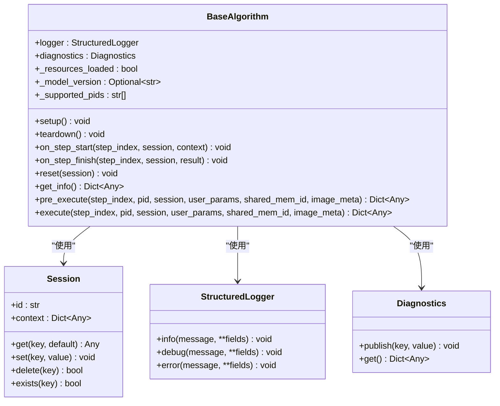
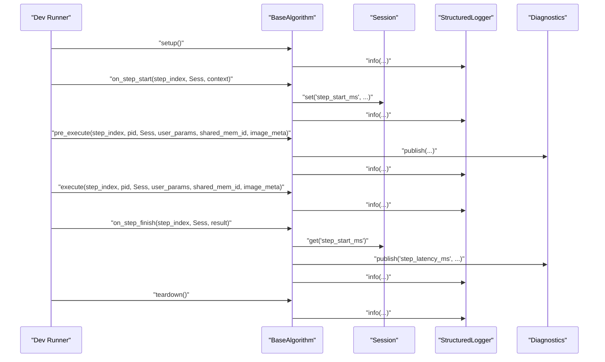
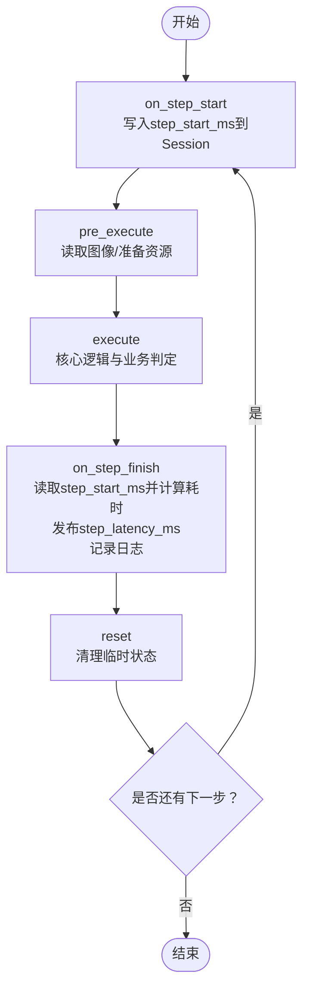
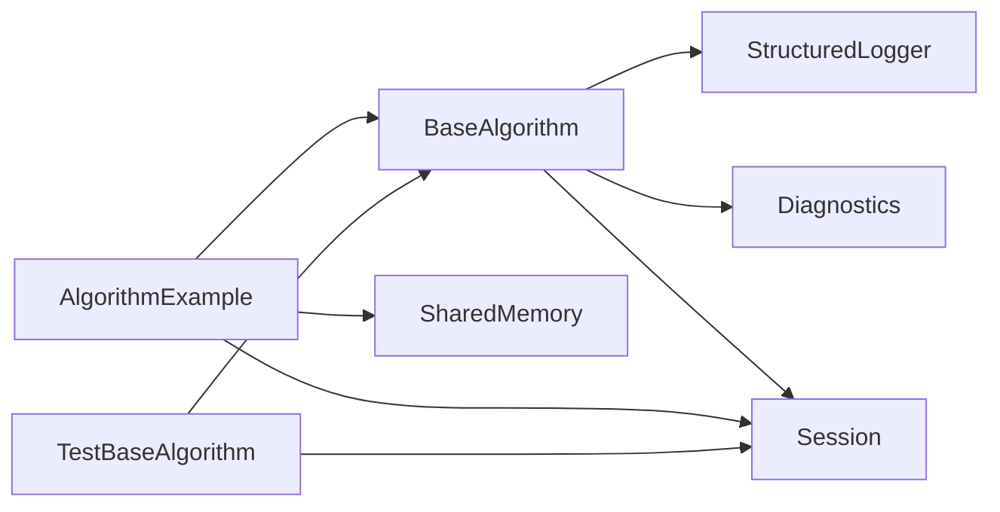

# BaseAlgorithm API

<cite>
**本文引用的文件**
- [base.py](file://procvision_algorithm_sdk/base.py)
- [session.py](file://procvision_algorithm_sdk/session.py)
- [shared_memory.py](file://procvision_algorithm_sdk/shared_memory.py)
- [logger.py](file://procvision_algorithm_sdk/logger.py)
- [diagnostics.py](file://procvision_algorithm_sdk/diagnostics.py)
- [main.py](file://algorithm-example/algorithm_example/main.py)
- [test_base_algo.py](file://tests/test_base_algo.py)
- [README.md](file://README.md)
- [algorithm_dev_tutorial.md](file://algorithm_dev_tutorial.md)
</cite>

## 目录
1. [简介](#简介)
2. [项目结构](#项目结构)
3. [核心组件](#核心组件)
4. [架构总览](#架构总览)
5. [详细组件分析](#详细组件分析)
6. [依赖关系分析](#依赖关系分析)
7. [性能考虑](#性能考虑)
8. [故障排查指南](#故障排查指南)
9. [结论](#结论)
10. [附录](#附录)

## 简介
本文件面向工业视觉平台算法SDK中的BaseAlgorithm抽象基类，提供系统化、可操作的API文档。重点阐述其作为所有算法实现的基础接口，说明在算法生命周期管理中的核心地位；记录初始化阶段的日志记录器、诊断工具与资源状态标志等属性；全面描述setup、teardown、on_step_start、on_step_finish、reset等生命周期钩子的调用时机与最佳实践；重点文档化三个抽象方法：get_info（返回算法元信息，如支持的PID列表）、pre_execute（预执行处理，可用于资源加载）、execute（核心执行逻辑）及其参数与返回结构；结合algorithm-example中的main.py提供具体实现示例；解释错误处理机制（未实现抽象方法时的NotImplementedError）；给出性能优化建议（如在pre_execute中加载模型以避免重复初始化）；说明与Session对象和共享内存的集成方式，以及如何通过结构化日志记录调试信息。

## 项目结构
- 核心SDK位于procvision_algorithm_sdk目录，包含BaseAlgorithm抽象基类、Session会话、共享内存读图、结构化日志与诊断等模块。
- 示例算法位于algorithm-example目录，提供一个完整的继承BaseAlgorithm的实现main.py，展示生命周期钩子与三个抽象方法的典型用法。
- 测试用例位于tests目录，包含对BaseAlgorithm最小实现流程的验证。

图表来源
- [base.py](file://procvision_algorithm_sdk/base.py#L1-L58)
- [session.py](file://procvision_algorithm_sdk/session.py#L1-L36)
- [shared_memory.py](file://procvision_algorithm_sdk/shared_memory.py#L1-L53)
- [logger.py](file://procvision_algorithm_sdk/logger.py#L1-L24)
- [diagnostics.py](file://procvision_algorithm_sdk/diagnostics.py#L1-L12)
- [main.py](file://algorithm-example/algorithm_example/main.py#L1-L150)

章节来源
- [README.md](file://README.md#L1-L116)
- [algorithm_dev_tutorial.md](file://algorithm_dev_tutorial.md#L1-L348)

## 核心组件
- BaseAlgorithm：抽象基类，定义算法生命周期钩子与三个必须实现的抽象方法，提供日志记录器、诊断工具与资源状态标志等基础设施。
- Session：会话上下文，提供只读上下文与KV状态存储，支持JSON可序列化值的存取。
- SharedMemory：共享内存读图接口，支持字节数据与numpy数组两种输入形式，自动进行颜色空间与通道变换。
- StructuredLogger：结构化日志输出，统一输出格式，便于平台采集与分析。
- Diagnostics：诊断数据聚合，提供publish/get接口，便于在生命周期钩子中输出关键指标。

章节来源
- [base.py](file://procvision_algorithm_sdk/base.py#L1-L58)
- [session.py](file://procvision_algorithm_sdk/session.py#L1-L36)
- [shared_memory.py](file://procvision_algorithm_sdk/shared_memory.py#L1-L53)
- [logger.py](file://procvision_algorithm_sdk/logger.py#L1-L24)
- [diagnostics.py](file://procvision_algorithm_sdk/diagnostics.py#L1-L12)

## 架构总览
BaseAlgorithm作为所有算法实现的基础接口，向上承接平台调用，向下协调Session、SharedMemory、StructuredLogger与Diagnostics。生命周期钩子贯穿一次执行的全过程，抽象方法负责算法的核心逻辑与元信息。

图表来源
- [base.py](file://procvision_algorithm_sdk/base.py#L1-L58)
- [session.py](file://procvision_algorithm_sdk/session.py#L1-L36)
- [logger.py](file://procvision_algorithm_sdk/logger.py#L1-L24)
- [diagnostics.py](file://procvision_algorithm_sdk/diagnostics.py#L1-L12)

## 详细组件分析

### BaseAlgorithm抽象基类
- 初始化属性
  - logger：结构化日志记录器，用于输出结构化日志，统一包含level、timestamp_ms、message及自定义字段。
  - diagnostics：诊断工具，用于在生命周期钩子中发布关键指标，便于平台采集。
  - _resources_loaded：资源状态标志，用于标记是否已加载模型等资源，避免重复初始化。
  - _model_version：模型版本标识，可在setup中设置，便于追踪与审计。
  - _supported_pids：支持的产品型号列表，应在子类中设置，用于get_info返回与pre_execute/execute校验。
- 生命周期钩子
  - setup：算法实例级初始化，适合加载模型、缓存与句柄，设置_model_version等。
  - teardown：释放资源，关闭句柄与缓存，确保无泄漏。
  - on_step_start：步骤开始回调，记录上下文、复位计时与状态，通常在Session中存取临时指标。
  - on_step_finish：步骤结束回调，输出诊断、汇总耗时与指标，通常发布step_latency_ms等。
  - reset：流程级复位，清理会话内与算法内部的易变状态。
- 抽象方法
  - get_info：返回算法元信息，包括name、version、description、supported_pids、steps等。
  - pre_execute：预执行处理，用于资源加载、图像读取与准备工作，返回结构包含status、message、data、debug等。
  - execute：核心执行逻辑，返回结构包含status、data.result_status（OK/NG）、可选defect_rects/position_rects等业务结果与debug信息。

章节来源
- [base.py](file://procvision_algorithm_sdk/base.py#L1-L58)
- [logger.py](file://procvision_algorithm_sdk/logger.py#L1-L24)
- [diagnostics.py](file://procvision_algorithm_sdk/diagnostics.py#L1-L12)

### Session会话上下文
- 提供只读上下文与KV状态存储，支持get/set/delete/exists操作。
- set要求值必须可JSON序列化，否则抛出TypeError。
- 在生命周期钩子中常用于存取临时指标（如step_start_ms）与跨步骤状态。

章节来源
- [session.py](file://procvision_algorithm_sdk/session.py#L1-L36)

### SharedMemory共享内存读图
- 提供read_image_from_shared_memory接口，支持字节数据（JPEG/PNG）与numpy数组（uint8，形状(H,W,3)）。
- 自动进行颜色空间与通道变换（如BGR转RGB），灰度自动扩展为三通道。
- 读取失败或无数据时返回形状(H,W,3)的零矩阵，便于上层逻辑兜底。

章节来源
- [shared_memory.py](file://procvision_algorithm_sdk/shared_memory.py#L1-L53)

### StructuredLogger结构化日志
- 输出单行JSON，包含level、timestamp_ms、message与自定义字段，便于平台侧采集与检索。

章节来源
- [logger.py](file://procvision_algorithm_sdk/logger.py#L1-L24)

### Diagnostics诊断聚合
- 提供publish/get接口，用于在生命周期钩子中发布关键指标（如step_latency_ms），并在返回结构中携带debug信息。

章节来源
- [diagnostics.py](file://procvision_algorithm_sdk/diagnostics.py#L1-L12)

### 生命周期钩子调用时序
以下序列图展示了Dev Runner中的调用顺序，便于理解各钩子的触发时机与最佳实践。

图表来源
- [base.py](file://procvision_algorithm_sdk/base.py#L1-L58)
- [session.py](file://procvision_algorithm_sdk/session.py#L1-L36)
- [logger.py](file://procvision_algorithm_sdk/logger.py#L1-L24)
- [diagnostics.py](file://procvision_algorithm_sdk/diagnostics.py#L1-L12)
- [algorithm_dev_tutorial.md](file://algorithm_dev_tutorial.md#L1-L348)

### 三个抽象方法详解

#### get_info
- 作用：返回算法元信息，包括name、version、description、supported_pids、steps等。
- 典型使用场景：清单校验、平台UI展示、参数schema生成。
- 实现示例：参见示例算法的get_info实现，包含supported_pids与steps参数schema。

章节来源
- [base.py](file://procvision_algorithm_sdk/base.py#L1-L58)
- [main.py](file://algorithm-example/algorithm_example/main.py#L1-L150)
- [algorithm_dev_tutorial.md](file://algorithm_dev_tutorial.md#L1-L348)

#### pre_execute
- 作用：预执行处理，通常用于资源加载、图像读取与准备工作。
- 参数语义：
  - step_index：当前步骤索引（平台与Dev Runner从1开始）。
  - pid：产品型号，用于校验与分支逻辑。
  - session：会话上下文，用于存取临时状态。
  - user_params：用户参数，来自平台侧传入。
  - shared_mem_id：共享内存标识，用于读取图像。
  - image_meta：图像元信息，至少包含width/height/timestamp_ms/camera_id。
- 返回结构：
  - 必含：status（OK/ERROR）。
  - 可选：message、debug、data.calibration_rects等。
  - 禁止：data.result_status/defect_rects（仅在execute中给出业务判定）。
- 实现示例：参见示例算法的pre_execute实现，包含PID校验、图像读取与随机标定框生成。

章节来源
- [base.py](file://procvision_algorithm_sdk/base.py#L1-L58)
- [shared_memory.py](file://procvision_algorithm_sdk/shared_memory.py#L1-L53)
- [main.py](file://algorithm-example/algorithm_example/main.py#L1-L150)
- [algorithm_dev_tutorial.md](file://algorithm_dev_tutorial.md#L1-L348)

#### execute
- 作用：核心执行逻辑，返回业务判定结果与辅助信息。
- 参数语义：同pre_execute。
- 返回结构：
  - 必含：status（OK/ERROR）；当status=OK时必须包含data.result_status（OK/NG）。
  - 当result_status=NG：需包含ng_reason与defect_rects（数量≤20）。
  - 可选：position_rects、debug等业务辅助输出。
- 实现示例：参见示例算法的execute实现，包含PID校验、图像读取、随机缺陷/定位框生成与debug信息。

章节来源
- [base.py](file://procvision_algorithm_sdk/base.py#L1-L58)
- [shared_memory.py](file://procvision_algorithm_sdk/shared_memory.py#L1-L53)
- [main.py](file://algorithm-example/algorithm_example/main.py#L1-L150)
- [algorithm_dev_tutorial.md](file://algorithm_dev_tutorial.md#L1-L348)

### 生命周期钩子详解

#### setup
- 调用时机：算法实例初始化后，首次进入步骤前。
- 典型用途：加载模型、缓存与句柄，设置_model_version，记录日志。
- 最佳实践：幂等设计，避免重复初始化；资源管理统一在teardown释放。

章节来源
- [base.py](file://procvision_algorithm_sdk/base.py#L1-L58)
- [main.py](file://algorithm-example/algorithm_example/main.py#L1-L150)
- [algorithm_dev_tutorial.md](file://algorithm_dev_tutorial.md#L1-L348)

#### teardown
- 调用时机：一次完整生命周期结束后。
- 典型用途：释放模型、句柄与缓存，确保无泄漏。
- 最佳实践：与setup对应，幂等设计。

章节来源
- [base.py](file://procvision_algorithm_sdk/base.py#L1-L58)
- [main.py](file://algorithm-example/algorithm_example/main.py#L1-L150)
- [algorithm_dev_tutorial.md](file://algorithm_dev_tutorial.md#L1-L348)

#### on_step_start
- 调用时机：每一步骤开始前。
- 典型用途：记录上下文、复位计时与状态（如写入step_start_ms）。
- 最佳实践：轻量化，避免重计算；与on_step_finish配合输出诊断。

章节来源
- [base.py](file://procvision_algorithm_sdk/base.py#L1-L58)
- [session.py](file://procvision_algorithm_sdk/session.py#L1-L36)
- [main.py](file://algorithm-example/algorithm_example/main.py#L1-L150)
- [algorithm_dev_tutorial.md](file://algorithm_dev_tutorial.md#L1-L348)

#### on_step_finish
- 调用时机：每一步骤结束后。
- 典型用途：汇总耗时（如step_latency_ms）、发布诊断、记录日志。
- 最佳实践：从Session读取临时指标，发布到Diagnostics，输出结构化日志。

章节来源
- [base.py](file://procvision_algorithm_sdk/base.py#L1-L58)
- [session.py](file://procvision_algorithm_sdk/session.py#L1-L36)
- [diagnostics.py](file://procvision_algorithm_sdk/diagnostics.py#L1-L12)
- [main.py](file://algorithm-example/algorithm_example/main.py#L1-L150)
- [algorithm_dev_tutorial.md](file://algorithm_dev_tutorial.md#L1-L348)

#### reset
- 调用时机：流程级复位，通常在多步或多轮执行之间。
- 典型用途：清理会话内与算法内部的易变状态。
- 最佳实践：与on_step_start配合，保证每步开始时的干净状态。

章节来源
- [base.py](file://procvision_algorithm_sdk/base.py#L1-L58)
- [session.py](file://procvision_algorithm_sdk/session.py#L1-L36)
- [main.py](file://algorithm-example/algorithm_example/main.py#L1-L150)
- [algorithm_dev_tutorial.md](file://algorithm_dev_tutorial.md#L1-L348)

### 跨步骤状态管理流程
以下流程图展示了如何利用Session在步骤间传递状态，以及在生命周期钩子中进行诊断与日志记录。

图表来源
- [base.py](file://procvision_algorithm_sdk/base.py#L1-L58)
- [session.py](file://procvision_algorithm_sdk/session.py#L1-L36)
- [diagnostics.py](file://procvision_algorithm_sdk/diagnostics.py#L1-L12)
- [main.py](file://algorithm-example/algorithm_example/main.py#L1-L150)

### 错误处理机制
- 未实现抽象方法：当子类未实现get_info、pre_execute或execute时，调用将抛出NotImplementedError。
- 返回结构错误：pre_execute禁止包含业务判定（如result_status/defect_rects），execute必须包含status与data.result_status（OK/NG）。
- 图像读取失败：read_image_from_shared_memory在无数据或读取失败时返回零矩阵，子类应根据返回值进行错误处理并返回status="ERROR"。

章节来源
- [base.py](file://procvision_algorithm_sdk/base.py#L1-L58)
- [shared_memory.py](file://procvision_algorithm_sdk/shared_memory.py#L1-L53)
- [algorithm_dev_tutorial.md](file://algorithm_dev_tutorial.md#L1-L348)
- [test_base_algo.py](file://tests/test_base_algo.py#L1-L65)

### 与Session和共享内存的集成
- Session：用于跨步骤状态管理（如计时、开关、中间结果），set要求值可JSON序列化。
- 共享内存：通过shared_mem_id与image_meta读取图像，支持字节数据与numpy数组，自动进行颜色空间与通道变换。
- 结构化日志：统一输出格式，便于平台采集与分析。

章节来源
- [session.py](file://procvision_algorithm_sdk/session.py#L1-L36)
- [shared_memory.py](file://procvision_algorithm_sdk/shared_memory.py#L1-L53)
- [logger.py](file://procvision_algorithm_sdk/logger.py#L1-L24)
- [algorithm_dev_tutorial.md](file://algorithm_dev_tutorial.md#L1-L348)

### 具体实现示例
- 示例算法AlgorithmExample展示了：
  - 在setup中设置_model_version并记录日志。
  - 在on_step_start中写入step_start_ms到Session，在on_step_finish中读取并发布step_latency_ms。
  - 在pre_execute中校验pid、读取图像、生成随机标定框并返回debug信息。
  - 在execute中校验pid、读取图像、生成随机缺陷/定位框并返回业务结果与debug信息。
- 测试用例test_base_algo展示了最小实现流程，验证get_info、pre_execute与execute的基本返回结构。

章节来源
- [main.py](file://algorithm-example/algorithm_example/main.py#L1-L150)
- [test_base_algo.py](file://tests/test_base_algo.py#L1-L65)
- [algorithm_dev_tutorial.md](file://algorithm_dev_tutorial.md#L1-L348)

## 依赖关系分析
- BaseAlgorithm依赖StructuredLogger、Diagnostics与Session，形成算法与基础设施的耦合。
- 示例算法AlgorithmExample继承BaseAlgorithm，依赖Session与SharedMemory进行图像读取与状态管理。
- 测试用例依赖BaseAlgorithm与Session，验证最小实现流程。

图表来源
- [base.py](file://procvision_algorithm_sdk/base.py#L1-L58)
- [session.py](file://procvision_algorithm_sdk/session.py#L1-L36)
- [shared_memory.py](file://procvision_algorithm_sdk/shared_memory.py#L1-L53)
- [logger.py](file://procvision_algorithm_sdk/logger.py#L1-L24)
- [diagnostics.py](file://procvision_algorithm_sdk/diagnostics.py#L1-L12)
- [test_base_algo.py](file://tests/test_base_algo.py#L1-L65)
- [main.py](file://algorithm-example/algorithm_example/main.py#L1-L150)

章节来源
- [base.py](file://procvision_algorithm_sdk/base.py#L1-L58)
- [test_base_algo.py](file://tests/test_base_algo.py#L1-L65)
- [main.py](file://algorithm-example/algorithm_example/main.py#L1-L150)

## 性能考虑
- 在pre_execute中加载模型以避免重复初始化，减少execute阶段的开销。
- 轻量化生命周期钩子，避免在on_step_start/finish中进行重计算，重工作放在pre_execute/execute。
- 合理使用Diagnostics与StructuredLogger记录关键指标与调试信息，便于平台侧采集与分析。
- 共享内存读图时尽量复用已有的numpy数组，减少不必要的拷贝与类型转换。

章节来源
- [algorithm_dev_tutorial.md](file://algorithm_dev_tutorial.md#L1-L348)
- [shared_memory.py](file://procvision_algorithm_sdk/shared_memory.py#L1-L53)

## 故障排查指南
- 未实现抽象方法：检查子类是否实现了get_info、pre_execute与execute，否则将抛出NotImplementedError。
- 返回结构错误：确认pre_execute不包含业务判定，execute必须包含status与data.result_status（OK/NG）。
- 图像读取失败：检查shared_mem_id与image_meta是否正确，read_image_from_shared_memory在无数据时返回零矩阵，需在子类中进行错误处理。
- Session set失败：确保存入的值可JSON序列化，否则抛出TypeError。
- 日志与诊断：统一使用StructuredLogger输出结构化日志，使用Diagnostics发布关键指标，便于平台侧采集与分析。

章节来源
- [base.py](file://procvision_algorithm_sdk/base.py#L1-L58)
- [shared_memory.py](file://procvision_algorithm_sdk/shared_memory.py#L1-L53)
- [session.py](file://procvision_algorithm_sdk/session.py#L1-L36)
- [logger.py](file://procvision_algorithm_sdk/logger.py#L1-L24)
- [diagnostics.py](file://procvision_algorithm_sdk/diagnostics.py#L1-L12)
- [algorithm_dev_tutorial.md](file://algorithm_dev_tutorial.md#L1-L348)

## 结论
BaseAlgorithm作为算法SDK的核心抽象，提供了标准化的生命周期管理与返回结构规范，结合Session、SharedMemory、StructuredLogger与Diagnostics，能够支撑工业视觉平台的稳定集成与高效交付。通过遵循本文档的实现规范与最佳实践，开发者可以快速、可靠地完成算法开发与维护。

## 附录
- 快速开始与接口要点：参见README与algorithm_dev_tutorial中的“接口要点”与“快速开始”部分。
- CLI参考：参见algorithm_dev_tutorial中的CLI子命令说明，涵盖validate、run、package、init等命令。

章节来源
- [README.md](file://README.md#L1-L116)
- [algorithm_dev_tutorial.md](file://algorithm_dev_tutorial.md#L1-L348)