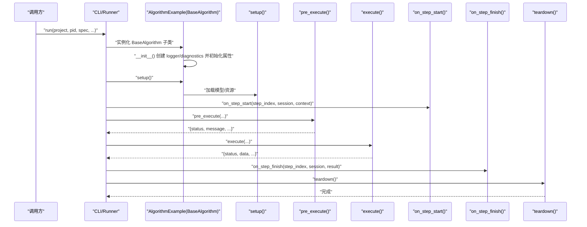
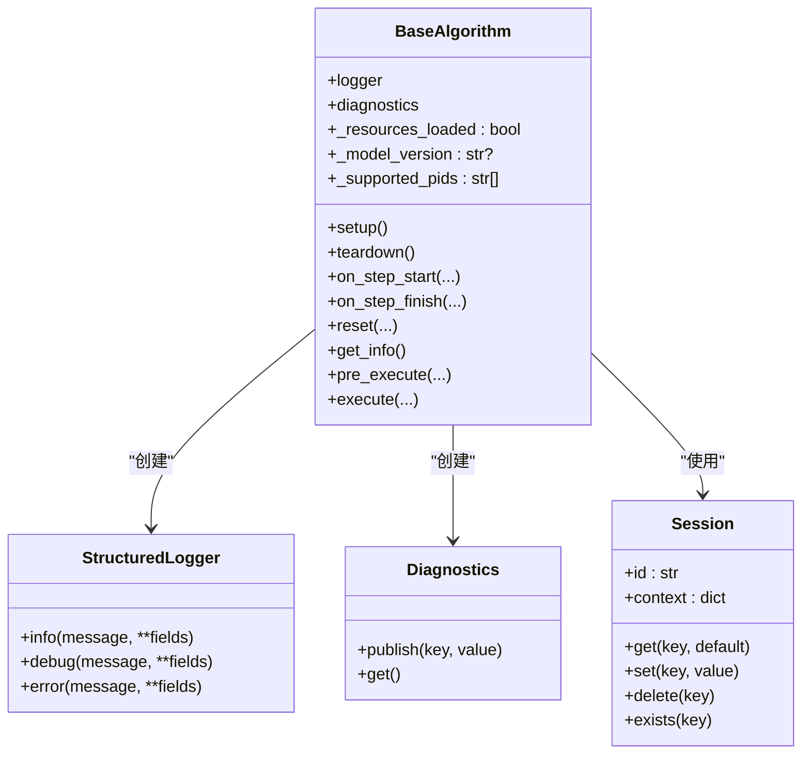

# __init__ 方法

<cite>
**本文引用的文件**
- [procvision_algorithm_sdk/base.py](file://procvision_algorithm_sdk/base.py)
- [procvision_algorithm_sdk/logger.py](file://procvision_algorithm_sdk/logger.py)
- [procvision_algorithm_sdk/diagnostics.py](file://procvision_algorithm_sdk/diagnostics.py)
- [procvision_algorithm_sdk/session.py](file://procvision_algorithm_sdk/session.py)
- [algorithm-example/algorithm_example/main.py](file://algorithm-example/algorithm_example/main.py)
- [tests/test_base_algo.py](file://tests/test_base_algo.py)
- [procvision_algorithm_sdk/cli.py](file://procvision_algorithm_sdk/cli.py)
</cite>

## 目录
1. [简介](#简介)
2. [项目结构](#项目结构)
3. [核心组件](#核心组件)
4. [架构总览](#架构总览)
5. [详细组件分析](#详细组件分析)
6. [依赖关系分析](#依赖关系分析)
7. [性能考量](#性能考量)
8. [故障排查指南](#故障排查指南)
9. [结论](#结论)

## 简介
本节聚焦于 BaseAlgorithm 抽象基类的 __init__ 初始化流程，系统性阐述其在实例化时自动创建 StructuredLogger 和 Diagnostics 实例的作用，以及如何为子类提供统一的日志记录与诊断能力。同时，解释私有属性 _resources_loaded（资源是否已加载）、_model_version（可选的模型版本标识）与 _supported_pids（支持的 PID 列表）的用途、默认值及在算法生命周期中的典型使用场景，包括在 pre_execute 中依据 _resources_loaded 避免重复加载模型。最后说明 __init__ 与 setup 方法的互补关系、线程安全注意事项与最佳实践建议。

## 项目结构
围绕 BaseAlgorithm 的初始化逻辑，以下文件与其职责密切相关：
- 基类与生命周期钩子：procvision_algorithm_sdk/base.py
- 日志与诊断：procvision_algorithm_sdk/logger.py、procvision_algorithm_sdk/diagnostics.py
- 会话上下文：procvision_algorithm_sdk/session.py
- 使用示例与测试：algorithm-example/algorithm_example/main.py、tests/test_base_algo.py
- CLI 调用链路：procvision_algorithm_sdk/cli.py

```mermaid
graph TB
subgraph "SDK 核心"
BA["BaseAlgorithm<br/>初始化与生命周期"]
SL["StructuredLogger<br/>结构化日志"]
DG["Diagnostics<br/>诊断指标"]
SS["Session<br/>会话上下文"]
end
subgraph "示例与测试"
EX["AlgorithmExample<br/>继承 BaseAlgorithm"]
TB["测试用例<br/>test_base_algo.py"]
end
subgraph "CLI"
CLI["CLI 运行流程<br/>validate/run"]
end
BA --> SL
BA --> DG
BA --> SS
EX --> BA
TB --> BA
CLI --> BA
```

图表来源
- [procvision_algorithm_sdk/base.py](file://procvision_algorithm_sdk/base.py#L1-L58)
- [procvision_algorithm_sdk/logger.py](file://procvision_algorithm_sdk/logger.py#L1-L24)
- [procvision_algorithm_sdk/diagnostics.py](file://procvision_algorithm_sdk/diagnostics.py#L1-L12)
- [procvision_algorithm_sdk/session.py](file://procvision_algorithm_sdk/session.py#L1-L36)
- [algorithm-example/algorithm_example/main.py](file://algorithm-example/algorithm_example/main.py#L1-L150)
- [tests/test_base_algo.py](file://tests/test_base_algo.py#L1-L65)
- [procvision_algorithm_sdk/cli.py](file://procvision_algorithm_sdk/cli.py#L64-L100)

章节来源
- [procvision_algorithm_sdk/base.py](file://procvision_algorithm_sdk/base.py#L1-L58)
- [procvision_algorithm_sdk/logger.py](file://procvision_algorithm_sdk/logger.py#L1-L24)
- [procvision_algorithm_sdk/diagnostics.py](file://procvision_algorithm_sdk/diagnostics.py#L1-L12)
- [procvision_algorithm_sdk/session.py](file://procvision_algorithm_sdk/session.py#L1-L36)
- [algorithm-example/algorithm_example/main.py](file://algorithm-example/algorithm_example/main.py#L1-L150)
- [tests/test_base_algo.py](file://tests/test_base_algo.py#L1-L65)
- [procvision_algorithm_sdk/cli.py](file://procvision_algorithm_sdk/cli.py#L64-L100)

## 核心组件
- BaseAlgorithm.__init__：在实例化时创建日志器与诊断器，初始化资源加载标记、模型版本与支持的 PID 列表。
- StructuredLogger：提供结构化日志输出能力，便于统一格式与后续采集。
- Diagnostics：提供键值对式诊断指标发布与读取能力，便于统计与监控。
- Session：提供会话上下文与状态存储，支持 JSON 可序列化值的存取。

章节来源
- [procvision_algorithm_sdk/base.py](file://procvision_algorithm_sdk/base.py#L1-L58)
- [procvision_algorithm_sdk/logger.py](file://procvision_algorithm_sdk/logger.py#L1-L24)
- [procvision_algorithm_sdk/diagnostics.py](file://procvision_algorithm_sdk/diagnostics.py#L1-L12)
- [procvision_algorithm_sdk/session.py](file://procvision_algorithm_sdk/session.py#L1-L36)

## 架构总览
BaseAlgorithm 的初始化与生命周期如下图所示，强调 __init__ 在实例化阶段提供的基础设施，以及后续 setup/teardown、on_step_start/on_step_finish 等钩子如何与之配合。



图表来源
- [procvision_algorithm_sdk/base.py](file://procvision_algorithm_sdk/base.py#L1-L58)
- [algorithm-example/algorithm_example/main.py](file://algorithm-example/algorithm_example/main.py#L1-L150)
- [procvision_algorithm_sdk/cli.py](file://procvision_algorithm_sdk/cli.py#L192-L225)

## 详细组件分析

### BaseAlgorithm.__init__ 初始化逻辑
- 自动创建 StructuredLogger 实例并赋给 self.logger，用于统一的日志输出。
- 自动创建 Diagnostics 实例并赋给 self.diagnostics，用于收集诊断指标。
- 初始化私有属性：
  - _resources_loaded：布尔型，默认 False，用于标记资源是否已加载，常在 pre_execute 中判断以避免重复加载。
  - _model_version：字符串或 None，默认 None，用于标识模型版本，可在 setup 中设置并在日志中输出。
  - _supported_pids：字符串列表，默认空列表，用于声明该算法支持的产品型号集合，常在 get_info 中返回并在 pre_execute 中校验。
- 以上初始化确保子类在首次执行前拥有统一的日志与诊断能力，并通过属性约定约束生命周期行为。

章节来源
- [procvision_algorithm_sdk/base.py](file://procvision_algorithm_sdk/base.py#L1-L58)

### StructuredLogger 与 Diagnostics 的作用
- StructuredLogger：提供 info/debug/error 等方法，内部将级别、时间戳与字段合并后输出到指定 sink，默认输出到标准错误流。这保证了日志格式的一致性与可解析性。
- Diagnostics：提供 publish/get 接口，将诊断指标以键值对形式暂存，便于在 on_step_finish 等阶段汇总输出或上报。

章节来源
- [procvision_algorithm_sdk/logger.py](file://procvision_algorithm_sdk/logger.py#L1-L24)
- [procvision_algorithm_sdk/diagnostics.py](file://procvision_algorithm_sdk/diagnostics.py#L1-L12)

### 私有属性的用途与默认值
- _resources_loaded（布尔，默认 False）：用于标记资源是否已加载。在 pre_execute 中可据此判断是否需要执行昂贵的加载操作，避免重复加载。
- _model_version（字符串或 None，默认 None）：用于标识模型版本。通常在 setup 中设置，随后可通过 logger 输出，便于追踪版本差异。
- _supported_pids（字符串列表，默认 []）：用于声明该算法支持的产品型号。get_info 返回该列表，CLI/Runner 会据此校验输入 PID 是否合法；pre_execute 中也会进行校验。

章节来源
- [procvision_algorithm_sdk/base.py](file://procvision_algorithm_sdk/base.py#L1-L58)
- [algorithm-example/algorithm_example/main.py](file://algorithm-example/algorithm_example/main.py#L1-L150)
- [procvision_algorithm_sdk/cli.py](file://procvision_algorithm_sdk/cli.py#L64-L100)

### 生命周期中的使用场景
- 在 pre_execute 中依据 _resources_loaded 避免重复加载模型：若资源尚未加载，则在 setup 或此处进行加载并将 _resources_loaded 置为 True；后续调用直接复用已加载资源。
- 在 setup 中设置 _model_version 并记录日志：通过 logger 输出模型版本信息，便于审计与排障。
- 在 get_info 中返回 _supported_pids：CLI/Runner 会读取该信息并与 manifest 中的 supported_pids 对比，确保一致性。
- 在 on_step_finish 中使用 Diagnostics 发布指标：例如计算并发布“步延迟”等指标，便于性能监控。

章节来源
- [algorithm-example/algorithm_example/main.py](file://algorithm-example/algorithm_example/main.py#L1-L150)
- [procvision_algorithm_sdk/cli.py](file://procvision_algorithm_sdk/cli.py#L64-L100)

### 与 setup 方法的互补关系
- __init__：负责创建日志与诊断基础设施，初始化资源加载标记与版本/支持列表等属性，确保实例具备统一能力。
- setup：负责实际的资源加载与初始化，如加载模型、建立连接、缓存数据等。通常在 CLI/Runner 执行流程中先调用 setup，再进入具体步骤。
- 两者互补：__init__ 提供“软基础设施”，setup 提供“硬资源”。二者共同构成算法实例的完整生命周期起点。

章节来源
- [procvision_algorithm_sdk/base.py](file://procvision_algorithm_sdk/base.py#L1-L58)
- [procvision_algorithm_sdk/cli.py](file://procvision_algorithm_sdk/cli.py#L192-L225)

### 线程安全性考虑
- 属性访问本身是轻量级操作，但在多线程环境下，若 setup 中涉及共享资源（如全局模型对象、缓存），应确保：
  - 对共享资源的并发访问采用互斥锁保护；
  - 对 _resources_loaded 的更新与读取遵循原子性或加锁策略；
  - 对 _model_version 的写入与读取采用不可变替换或同步机制，避免竞态条件。
- 日志与诊断的输出通常由各自模块内部处理，但若自定义 sink 或共享存储，也需考虑并发安全。

章节来源
- [procvision_algorithm_sdk/base.py](file://procvision_algorithm_sdk/base.py#L1-L58)
- [procvision_algorithm_sdk/logger.py](file://procvision_algorithm_sdk/logger.py#L1-L24)
- [procvision_algorithm_sdk/diagnostics.py](file://procvision_algorithm_sdk/diagnostics.py#L1-L12)

### 最佳实践建议
- 不应在 __init__ 中执行耗时操作：如模型加载、网络请求、大文件读取等，应推迟至 setup 或按需在 pre_execute 中惰性加载，以确保实例化快速完成。
- 将资源加载逻辑集中在 setup，并结合 _resources_loaded 防止重复加载。
- 使用 logger 记录关键事件（如 setup/teardown、on_step_start/on_step_finish），并使用 Diagnostics 发布性能与业务指标。
- 在 get_info 中明确返回 supported_pids，确保与 manifest 保持一致，减少运行期校验失败。

章节来源
- [procvision_algorithm_sdk/base.py](file://procvision_algorithm_sdk/base.py#L1-L58)
- [algorithm-example/algorithm_example/main.py](file://algorithm-example/algorithm_example/main.py#L1-L150)

## 依赖关系分析
BaseAlgorithm 的初始化依赖关系如下图所示，展示了 __init__ 如何创建日志与诊断实例，并被子类与 CLI 流程所使用。



图表来源
- [procvision_algorithm_sdk/base.py](file://procvision_algorithm_sdk/base.py#L1-L58)
- [procvision_algorithm_sdk/logger.py](file://procvision_algorithm_sdk/logger.py#L1-L24)
- [procvision_algorithm_sdk/diagnostics.py](file://procvision_algorithm_sdk/diagnostics.py#L1-L12)
- [procvision_algorithm_sdk/session.py](file://procvision_algorithm_sdk/session.py#L1-L36)

章节来源
- [procvision_algorithm_sdk/base.py](file://procvision_algorithm_sdk/base.py#L1-L58)
- [procvision_algorithm_sdk/logger.py](file://procvision_algorithm_sdk/logger.py#L1-L24)
- [procvision_algorithm_sdk/diagnostics.py](file://procvision_algorithm_sdk/diagnostics.py#L1-L12)
- [procvision_algorithm_sdk/session.py](file://procvision_algorithm_sdk/session.py#L1-L36)

## 性能考量
- 快速实例化：避免在 __init__ 中执行阻塞操作，将重任务推迟到 setup/pre_execute。
- 惰性加载：结合 _resources_loaded，在首次需要时加载资源，减少冷启动成本。
- 日志与诊断开销：StructuredLogger 与 Diagnostics 为轻量级封装，但在高频调用场景下仍需控制字段数量与输出频率。

[本节为通用指导，无需列出章节来源]

## 故障排查指南
- PID 不匹配导致 pre_execute 失败：确认 _supported_pids 与 manifest 中 supported_pids 一致，CLI/Runner 会在验证阶段进行对比。
- 图像数据为空：pre_execute 与 execute 中均会校验共享内存读取结果，返回 ERROR 并附带错误码与消息。
- 资源重复加载：若发现多次加载模型，检查 _resources_loaded 标记与 setup/预执行逻辑，确保只在必要时加载。
- 诊断指标缺失：确认在 on_step_finish 中调用了 Diagnostics.publish，并在需要时读取 Diagnostics.get。

章节来源
- [tests/test_base_algo.py](file://tests/test_base_algo.py#L1-L65)
- [procvision_algorithm_sdk/cli.py](file://procvision_algorithm_sdk/cli.py#L64-L100)
- [algorithm-example/algorithm_example/main.py](file://algorithm-example/algorithm_example/main.py#L1-L150)

## 结论
BaseAlgorithm.__init__ 在实例化阶段提供了统一的日志与诊断基础设施，并初始化关键属性以支撑算法生命周期管理。通过与 setup 的分工协作，以及在 pre_execute 中利用 _resources_loaded 避免重复加载，可显著提升实例化速度与运行效率。遵循“__init__ 不做重活”的最佳实践，有助于构建高性能、可维护的算法实现。