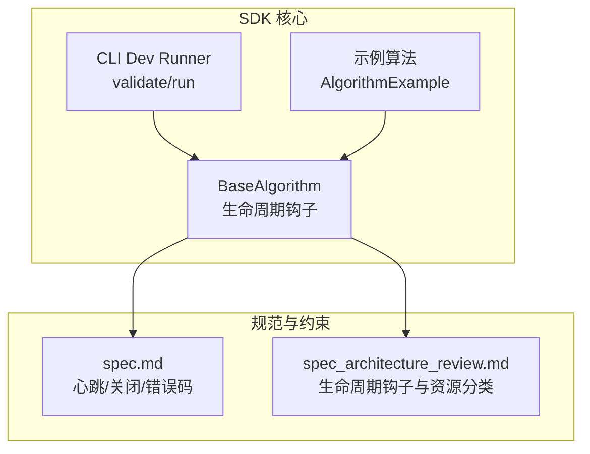
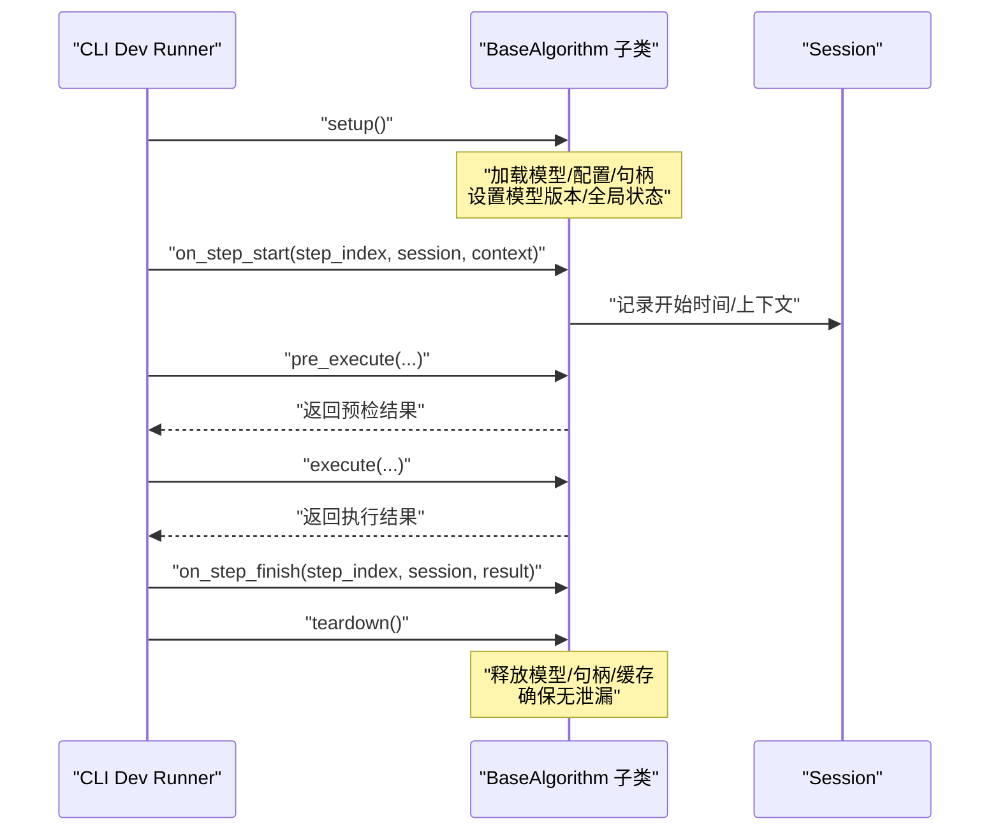
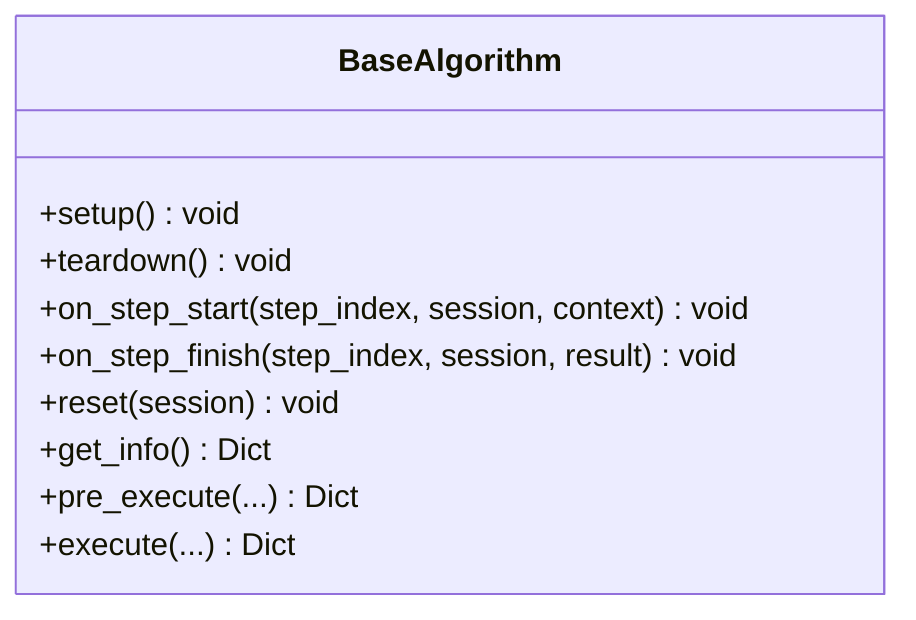
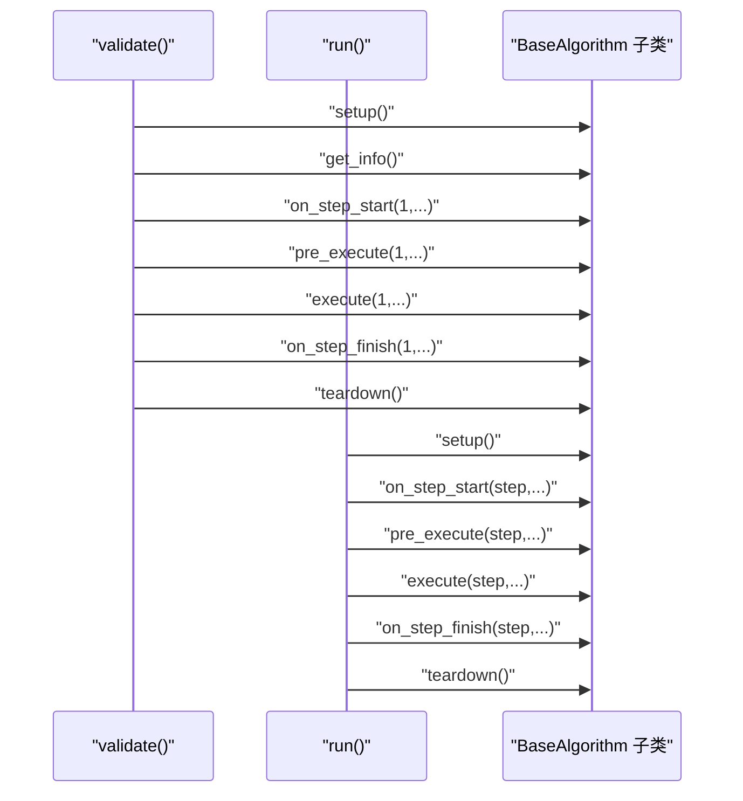
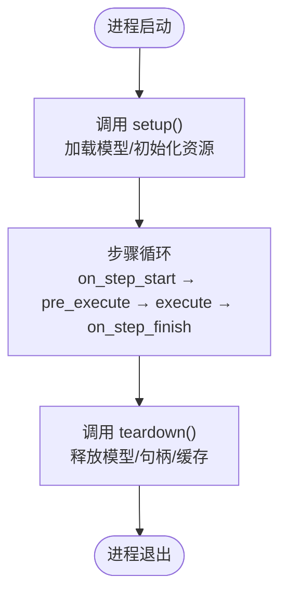
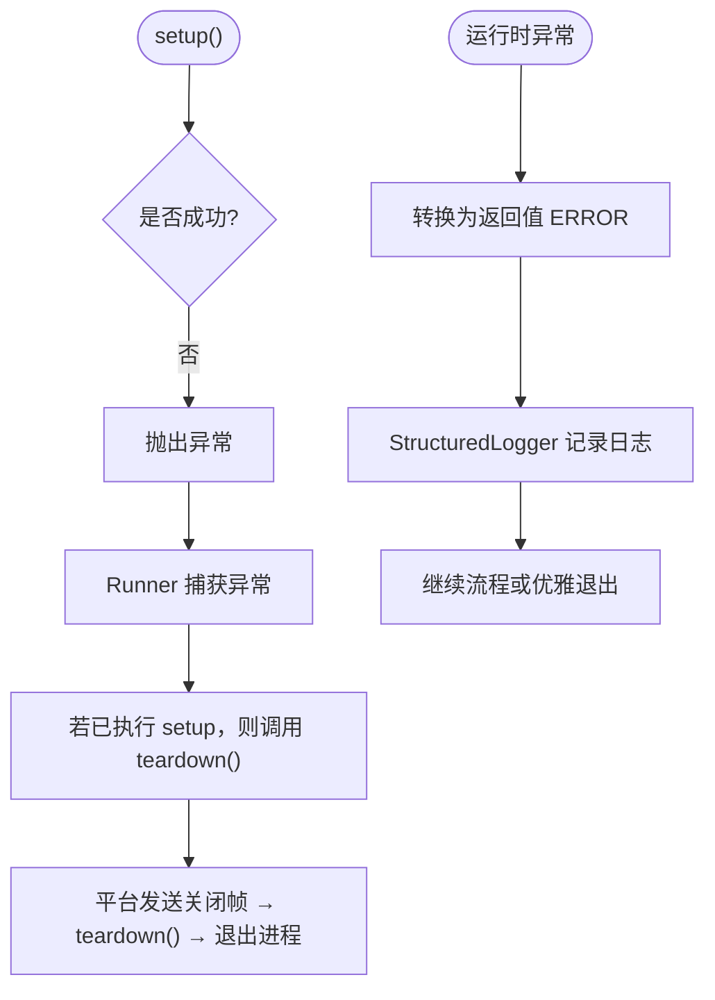
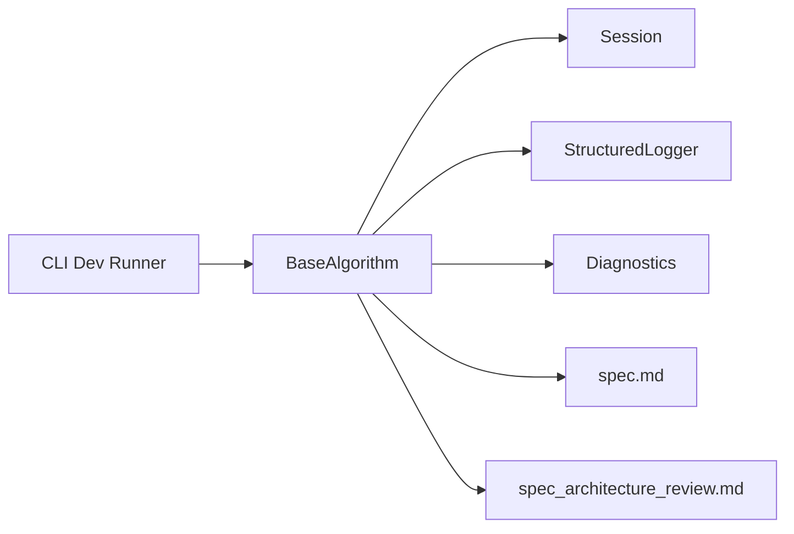

# setup 与 teardown 方法

<cite>
**本文引用的文件**
- [procvision_algorithm_sdk/base.py](file://procvision_algorithm_sdk/base.py)
- [procvision_algorithm_sdk/cli.py](file://procvision_algorithm_sdk/cli.py)
- [algorithm-example/algorithm_example/main.py](file://algorithm-example/algorithm_example/main.py)
- [spec.md](file://spec.md)
- [spec_architecture_review.md](file://spec_architecture_review.md)
- [README.md](file://README.md)
</cite>

## 目录
1. [简介](#简介)
2. [项目结构](#项目结构)
3. [核心组件](#核心组件)
4. [架构总览](#架构总览)
5. [详细组件分析](#详细组件分析)
6. [依赖关系分析](#依赖关系分析)
7. [性能考量](#性能考量)
8. [故障排查指南](#故障排查指南)
9. [结论](#结论)

## 简介
本文件聚焦于 BaseAlgorithm 中的 setup 与 teardown 生命周期钩子，系统性阐述它们在算法进程启动与退出阶段的职责、调用时机、最佳实践与异常处理策略。结合工业视觉场景，给出在 setup 中加载深度学习模型、在 teardown 中显式释放 GPU 内存的实践建议与调用流程说明。强调这两个方法由平台控制调用，通常在整个算法生命周期中各执行一次，且对资源管理具有决定性影响。

## 项目结构
围绕 BaseAlgorithm 的生命周期钩子，SDK 提供了最小但完整的抽象与配套能力：
- BaseAlgorithm：定义生命周期钩子（setup/teardown/on_step_start/on_step_finish/reset）与核心执行接口（get_info/pre_execute/execute）
- CLI Dev Runner：演示了 setup/teardown 在 validate/run 流程中的调用顺序
- 示例算法：展示如何在 setup 中设置模型版本、在 teardown 中输出清理日志
- 规范文档：明确了心跳、关闭流程、错误处理与资源管理原则

图表来源
- [procvision_algorithm_sdk/base.py](file://procvision_algorithm_sdk/base.py#L1-L58)
- [procvision_algorithm_sdk/cli.py](file://procvision_algorithm_sdk/cli.py#L1-L120)
- [algorithm-example/algorithm_example/main.py](file://algorithm-example/algorithm_example/main.py#L1-L150)
- [spec.md](file://spec.md#L600-L799)
- [spec_architecture_review.md](file://spec_architecture_review.md#L653-L685)

章节来源
- [procvision_algorithm_sdk/base.py](file://procvision_algorithm_sdk/base.py#L1-L58)
- [procvision_algorithm_sdk/cli.py](file://procvision_algorithm_sdk/cli.py#L1-L120)
- [algorithm-example/algorithm_example/main.py](file://algorithm-example/algorithm_example/main.py#L1-L150)
- [spec.md](file://spec.md#L600-L799)
- [spec_architecture_review.md](file://spec_architecture_review.md#L653-L685)

## 核心组件
- BaseAlgorithm：提供生命周期钩子与执行接口。其中 setup/teardown 为算法实例级初始化与收尾入口，适合加载/释放重量级资源（如模型、句柄、共享内存池等）。
- CLI Dev Runner：在 validate 与 run 两种模式下，均严格遵循“setup → 步骤执行 → teardown”的顺序，体现平台对生命周期的控制。
- 示例算法：AlgorithmExample 展示了在 setup 中设置模型版本、在 teardown 中输出清理日志的最小实践。

章节来源
- [procvision_algorithm_sdk/base.py](file://procvision_algorithm_sdk/base.py#L1-L58)
- [procvision_algorithm_sdk/cli.py](file://procvision_algorithm_sdk/cli.py#L1-L120)
- [algorithm-example/algorithm_example/main.py](file://algorithm-example/algorithm_example/main.py#L1-L150)

## 架构总览
以下序列图展示了 Dev Runner 在 validate 与 run 两种模式下的调用顺序，明确 setup/teardown 的调用时机与职责边界。

图表来源
- [procvision_algorithm_sdk/cli.py](file://procvision_algorithm_sdk/cli.py#L1-L120)
- [procvision_algorithm_sdk/base.py](file://procvision_algorithm_sdk/base.py#L1-L58)

章节来源
- [procvision_algorithm_sdk/cli.py](file://procvision_algorithm_sdk/cli.py#L1-L120)
- [procvision_algorithm_sdk/base.py](file://procvision_algorithm_sdk/base.py#L1-L58)

## 详细组件分析

### BaseAlgorithm 类与生命周期钩子
BaseAlgorithm 定义了生命周期钩子与执行接口，其中 setup/teardown 为算法实例级初始化与收尾入口，适合加载/释放重量级资源。其他钩子（on_step_start/on_step_finish/reset）分别承担步骤级日志/监控与流程级复位职责。

图表来源
- [procvision_algorithm_sdk/base.py](file://procvision_algorithm_sdk/base.py#L1-L58)

章节来源
- [procvision_algorithm_sdk/base.py](file://procvision_algorithm_sdk/base.py#L1-L58)

### Dev Runner 中的调用时机与顺序
CLI Dev Runner 在 validate 与 run 两种模式下，均严格遵循“setup → 步骤执行 → teardown”的顺序，体现了平台对生命周期的控制。validate 侧重静态校验，run 更贴近真实执行。

图表来源
- [procvision_algorithm_sdk/cli.py](file://procvision_algorithm_sdk/cli.py#L1-L120)

章节来源
- [procvision_algorithm_sdk/cli.py](file://procvision_algorithm_sdk/cli.py#L1-L120)

### 工业视觉场景：在 setup 中加载深度学习模型，在 teardown 中释放 GPU 内存
- setup 阶段：加载深度学习模型、初始化推理引擎、缓存权重与配置，设置模型版本标识，确保后续 execute 阶段无需重复加载。
- teardown 阶段：显式释放模型对象、关闭句柄、清空缓存，确保无泄漏；在 GPU 环境下，释放显存占用，避免进程退出后仍占用显存。
- 调用时机：由平台控制，通常在进程启动时调用一次 setup，在进程退出前调用一次 teardown。

图表来源
- [procvision_algorithm_sdk/cli.py](file://procvision_algorithm_sdk/cli.py#L1-L120)
- [spec_architecture_review.md](file://spec_architecture_review.md#L653-L685)

章节来源
- [procvision_algorithm_sdk/cli.py](file://procvision_algorithm_sdk/cli.py#L1-L120)
- [spec_architecture_review.md](file://spec_architecture_review.md#L653-L685)

### 异常处理策略与平台处理机制
- setup 失败：应在 setup 中抛出异常以阻止算法启动。平台在 validate/run 中捕获异常并记录，随后调用 teardown（若已执行 setup）以清理残留资源。
- 运行时异常：建议将异常转换为返回值中的 ERROR（包含状态、消息与错误码），并通过日志记录上下文，避免进程崩溃。
- 关闭流程：平台通过发送关闭帧触发 teardown，算法需在返回关闭确认后退出进程。

图表来源
- [procvision_algorithm_sdk/cli.py](file://procvision_algorithm_sdk/cli.py#L1-L120)
- [spec.md](file://spec.md#L600-L799)

章节来源
- [procvision_algorithm_sdk/cli.py](file://procvision_algorithm_sdk/cli.py#L1-L120)
- [spec.md](file://spec.md#L600-L799)

### 示例算法中的最小实践
示例算法 AlgorithmExample 展示了在 setup 中设置模型版本、在 teardown 中输出清理日志的最小实践，便于理解钩子职责与调用顺序。

章节来源
- [algorithm-example/algorithm_example/main.py](file://algorithm-example/algorithm_example/main.py#L1-L150)

## 依赖关系分析
- BaseAlgorithm 依赖 Session、StructuredLogger、Diagnostics 等配套能力，为生命周期钩子提供日志与诊断支持。
- CLI Dev Runner 通过导入算法入口类并实例化，严格遵循生命周期顺序调用钩子。
- 规范文档对心跳、关闭流程、错误码与资源管理提出明确要求，指导算法实现与平台处理策略。

图表来源
- [procvision_algorithm_sdk/cli.py](file://procvision_algorithm_sdk/cli.py#L1-L120)
- [procvision_algorithm_sdk/base.py](file://procvision_algorithm_sdk/base.py#L1-L58)
- [spec.md](file://spec.md#L600-L799)
- [spec_architecture_review.md](file://spec_architecture_review.md#L653-L685)

章节来源
- [procvision_algorithm_sdk/cli.py](file://procvision_algorithm_sdk/cli.py#L1-L120)
- [procvision_algorithm_sdk/base.py](file://procvision_algorithm_sdk/base.py#L1-L58)
- [spec.md](file://spec.md#L600-L799)
- [spec_architecture_review.md](file://spec_architecture_review.md#L653-L685)

## 性能考量
- setup/teardown 的幂等性：允许重复调用，需正确处理重复初始化/释放，避免资源泄漏。
- 轻量化钩子：on_step_start/finish 不应做重计算，重工作放在 pre_execute/execute。
- 资源管理：统一在 setup/teardown/reset 管理模型与句柄；避免在 execute 中延迟加载。
- 诊断输出：在钩子中通过 Diagnostics.publish 与 StructuredLogger.info 输出关键指标与事件，便于性能分析与问题定位。

章节来源
- [algorithm-example/algorithm_example/main.py](file://algorithm-example/algorithm_example/main.py#L1-L150)
- [README.md](file://README.md#L1-L116)

## 故障排查指南
- setup 失败：检查模型文件是否存在、权限是否正确、GPU 显存是否充足；必要时在 setup 中抛出异常以阻止启动。
- 运行时异常：将异常转换为返回值 ERROR，附带详细 message 与 error_code，并通过 StructuredLogger 记录上下文。
- 关闭流程：确保在收到关闭帧后调用 teardown 并返回确认，避免进程僵死。
- 资源泄漏：在 teardown 中显式释放模型、句柄与缓存；在 reset 中清理会话内易变状态。

章节来源
- [spec.md](file://spec.md#L600-L799)
- [spec_architecture_review.md](file://spec_architecture_review.md#L653-L685)

## 结论
BaseAlgorithm 的 setup/teardown 是算法生命周期的关键入口点，分别负责一次性资源准备与退出清理。在工业视觉场景中，setup 适合加载深度学习模型，teardown 适合释放 GPU 内存与句柄，确保资源可控、可回收。平台严格控制调用时机，通常各执行一次；异常处理应以抛出异常阻止启动、以返回值 ERROR 处理运行时错误为主，配合日志与诊断提升可观测性与可维护性。