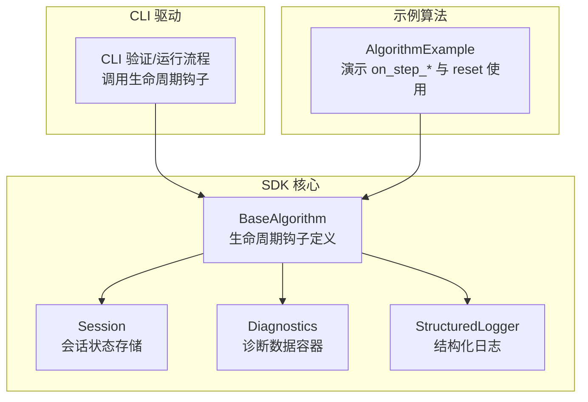
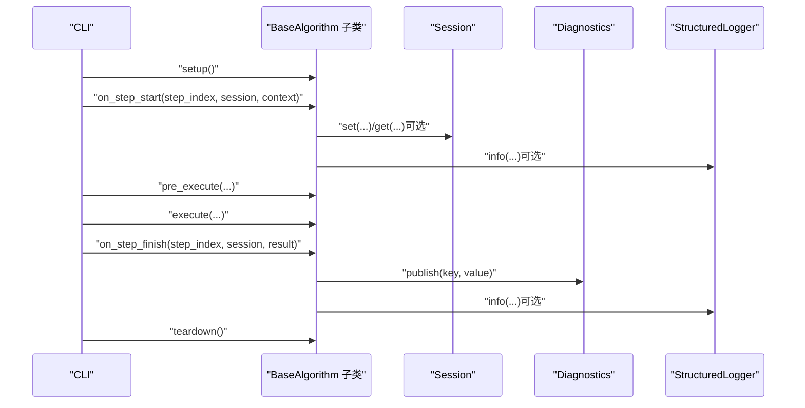
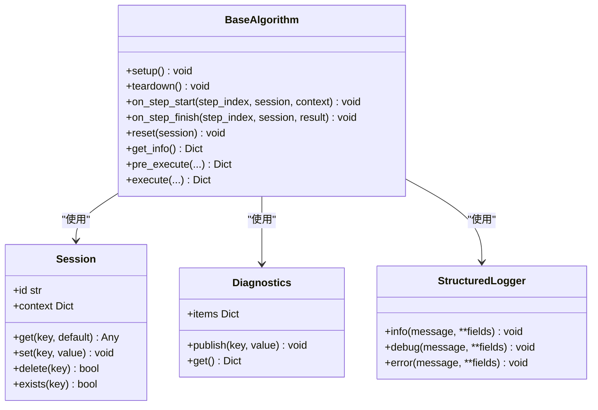

# 生命周期钩子方法

<cite>
**本文引用的文件列表**
- [base.py](file://procvision_algorithm_sdk/base.py)
- [session.py](file://procvision_algorithm_sdk/session.py)
- [diagnostics.py](file://procvision_algorithm_sdk/diagnostics.py)
- [logger.py](file://procvision_algorithm_sdk/logger.py)
- [cli.py](file://procvision_algorithm_sdk/cli.py)
- [algorithm_example/main.py](file://algorithm-example/algorithm_example/main.py)
- [tests/test_base_algo.py](file://tests/test_base_algo.py)
- [tests/test_session.py](file://tests/test_session.py)
- [algorithm_dev_tutorial.md](file://algorithm_dev_tutorial.md)
- [spec_architecture_review.md](file://spec_architecture_review.md)
</cite>

## 目录
1. [简介](#简介)
2. [项目结构](#项目结构)
3. [核心组件](#核心组件)
4. [架构总览](#架构总览)
5. [详细组件分析](#详细组件分析)
6. [依赖关系分析](#依赖关系分析)
7. [性能考量](#性能考量)
8. [故障排查指南](#故障排查指南)
9. [结论](#结论)
10. [附录](#附录)

## 简介
本文围绕 BaseAlgorithm 提供的生命周期钩子方法进行系统化文档化，重点覆盖：
- on_step_start：在每个处理步骤开始时调用，适合进行步骤级初始化、状态检查与上下文记录。
- on_step_finish：在步骤执行完成后调用，适合进行结果分析、性能统计、状态持久化与诊断数据发布。
- reset：用于重置算法内部状态，通常在会话重用或参数变更时由平台触发，确保幂等与可重复性。

同时，结合 Session 机制，给出在 on_step_start 中记录时间戳并在 on_step_finish 中计算执行耗时的示例；说明这些钩子如何增强算法可观测性，并与 Diagnostics 工具集成以生成性能报告；最后讨论 reset 方法的幂等性要求与实现注意事项。

## 项目结构
SDK 提供了算法基类、会话管理、诊断与日志等基础设施，配合 CLI 在开发与验证阶段驱动生命周期钩子的调用。

图表来源
- [base.py](file://procvision_algorithm_sdk/base.py#L1-L57)
- [session.py](file://procvision_algorithm_sdk/session.py#L1-L35)
- [diagnostics.py](file://procvision_algorithm_sdk/diagnostics.py#L1-L11)
- [logger.py](file://procvision_algorithm_sdk/logger.py#L1-L23)
- [cli.py](file://procvision_algorithm_sdk/cli.py#L70-L120)
- [algorithm_example/main.py](file://algorithm-example/algorithm_example/main.py#L1-L149)

章节来源
- [base.py](file://procvision_algorithm_sdk/base.py#L1-L57)
- [cli.py](file://procvision_algorithm_sdk/cli.py#L70-L120)

## 核心组件
- BaseAlgorithm：定义生命周期钩子 on_step_start、on_step_finish、reset，以及 get_info、pre_execute、execute 等抽象方法。实例内持有 StructuredLogger 与 Diagnostics，便于在钩子中输出日志与诊断数据。
- Session：提供会话级键值存储与只读上下文，支持 JSON 可序列化值的存取与存在性判断。
- Diagnostics：提供键值对形式的诊断数据容器，支持发布与获取。
- StructuredLogger：提供结构化日志输出能力，统一时间戳字段格式。

章节来源
- [base.py](file://procvision_algorithm_sdk/base.py#L1-L57)
- [session.py](file://procvision_algorithm_sdk/session.py#L1-L35)
- [diagnostics.py](file://procvision_algorithm_sdk/diagnostics.py#L1-L11)
- [logger.py](file://procvision_algorithm_sdk/logger.py#L1-L23)

## 架构总览
生命周期钩子在 CLI 的验证与运行流程中被显式调用，形成稳定的步骤执行闭环。

图表来源
- [cli.py](file://procvision_algorithm_sdk/cli.py#L70-L120)
- [cli.py](file://procvision_algorithm_sdk/cli.py#L180-L230)
- [base.py](file://procvision_algorithm_sdk/base.py#L1-L57)
- [diagnostics.py](file://procvision_algorithm_sdk/diagnostics.py#L1-L11)
- [logger.py](file://procvision_algorithm_sdk/logger.py#L1-L23)

## 详细组件分析

### 生命周期钩子：on_step_start
- 调用时机：每步开始时，位于 pre_execute 之前。
- 主要用途：
  - 步骤级初始化：如准备中间状态、校验上下文、记录时间戳等。
  - 状态检查：确认会话中是否存在必要的前置数据。
  - 上下文记录：将平台提供的上下文写入日志或会话状态，便于后续 on_step_finish 使用。
- 示例行为（来自示例算法）：
  - 在 on_step_start 中向 Session 写入“步骤开始时间戳”，以便在 on_step_finish 中计算耗时。
- 注意事项：
  - 钩子应保持轻量，避免重计算或阻塞操作。
  - 异常不应中断流程，建议使用 StructuredLogger 记录错误并在后续执行中给出明确的状态反馈。

章节来源
- [base.py](file://procvision_algorithm_sdk/base.py#L1-L57)
- [cli.py](file://procvision_algorithm_sdk/cli.py#L70-L120)
- [algorithm_example/main.py](file://algorithm-example/algorithm_example/main.py#L1-L149)

### 生命周期钩子：on_step_finish
- 调用时机：每步结束时，位于 execute 之后。
- 主要用途：
  - 结果分析：根据返回结果进行统计或分类。
  - 性能统计：计算耗时、吞吐等指标，并通过 Diagnostics 发布。
  - 状态持久化：将中间结果或诊断数据写入 Session 或 Diagnostics。
  - 清理收尾：删除临时状态、释放轻量资源。
- 示例行为（来自示例算法）：
  - 从 Session 读取“步骤开始时间戳”，计算耗时并发布到 Diagnostics。
  - 输出结构化日志，记录耗时与步骤索引。
- 注意事项：
  - 钩子应保证幂等性，避免重复执行导致副作用。
  - 对于可能缺失的时间戳等数据，应进行健壮性检查。

章节来源
- [base.py](file://procvision_algorithm_sdk/base.py#L1-L57)
- [cli.py](file://procvision_algorithm_sdk/cli.py#L70-L120)
- [algorithm_example/main.py](file://algorithm-example/algorithm_example/main.py#L1-L149)
- [diagnostics.py](file://procvision_algorithm_sdk/diagnostics.py#L1-L11)
- [logger.py](file://procvision_algorithm_sdk/logger.py#L1-L23)

### 生命周期钩子：reset
- 调用时机：通常在会话重用或参数变更时由平台触发，用于清理会话内与算法内部的易变状态。
- 主要用途：
  - 清理会话状态：删除步骤级临时键值。
  - 重置算法内部状态：确保后续步骤不会受历史状态影响。
- 幂等性要求与实现注意事项：
  - reset 必须幂等：多次调用应产生相同效果，避免重复清理导致异常。
  - 仅清理易变状态：不要破坏 setup/teardown 管理的重量级资源。
  - 与 Session 协同：优先通过 Session.delete 删除步骤级键值，确保跨步骤的一致性。
- 示例行为（来自示例算法）：
  - 在 reset 中删除步骤开始时间戳键，确保下一次步骤开始时重新记录。

章节来源
- [base.py](file://procvision_algorithm_sdk/base.py#L1-L57)
- [algorithm_example/main.py](file://algorithm-example/algorithm_example/main.py#L1-L149)
- [session.py](file://procvision_algorithm_sdk/session.py#L1-L35)
- [spec_architecture_review.md](file://spec_architecture_review.md#L653-L685)

### 与 Session 的协作
- Session 提供：
  - 键值存储：通过 set/get/delete/exists 管理步骤级状态。
  - 只读上下文：context 字段提供只读的步骤上下文，便于 on_step_start/on_step_finish 使用。
- 在生命周期钩子中的常见用法：
  - on_step_start：写入“步骤开始时间戳”等临时键。
  - on_step_finish：读取临时键并计算耗时，发布诊断数据。
  - reset：删除临时键，确保幂等。

章节来源
- [session.py](file://procvision_algorithm_sdk/session.py#L1-L35)
- [algorithm_example/main.py](file://algorithm-example/algorithm_example/main.py#L1-L149)

### 与 Diagnostics 的集成
- Diagnostics 提供键值对形式的诊断数据容器，支持 publish 与 get。
- 在生命周期钩子中：
  - on_step_finish：发布耗时、吞吐、错误率等指标，便于生成性能报告。
  - reset：可选择清空诊断项，确保报告粒度与步骤边界一致。
- 与 StructuredLogger 协同：
  - 使用 StructuredLogger 输出结构化日志，统一时间戳字段，便于审计与排障。

章节来源
- [diagnostics.py](file://procvision_algorithm_sdk/diagnostics.py#L1-L11)
- [logger.py](file://procvision_algorithm_sdk/logger.py#L1-L23)
- [algorithm_example/main.py](file://algorithm-example/algorithm_example/main.py#L1-L149)

### 调用流程与最佳实践
- CLI 验证/运行流程中显式调用生命周期钩子，确保每一步都被可观测。
- 最佳实践：
  - 幂等：钩子允许重复调用，需正确处理重复初始化/释放。
  - 轻量化：on_step_start/finish 不做重计算，重工作放在 pre_execute/execute。
  - 资源管理：统一在 setup/teardown/reset 管理模型与句柄。
  - 诊断输出：在钩子中通过 Diagnostics.publish 与 StructuredLogger.info 输出关键指标与事件。

章节来源
- [cli.py](file://procvision_algorithm_sdk/cli.py#L70-L120)
- [cli.py](file://procvision_algorithm_sdk/cli.py#L180-L230)
- [algorithm_dev_tutorial.md](file://algorithm_dev_tutorial.md#L56-L94)

## 依赖关系分析
生命周期钩子与 Session、Diagnostics、Logger 的依赖关系如下：

图表来源
- [base.py](file://procvision_algorithm_sdk/base.py#L1-L57)
- [session.py](file://procvision_algorithm_sdk/session.py#L1-L35)
- [diagnostics.py](file://procvision_algorithm_sdk/diagnostics.py#L1-L11)
- [logger.py](file://procvision_algorithm_sdk/logger.py#L1-L23)

## 性能考量
- on_step_start/on_step_finish 应保持轻量，避免引入额外开销。
- 将重计算与 IO 放在 pre_execute/execute 中，减少钩子中的阻塞。
- 使用 Diagnostics 发布关键指标（如 step_latency_ms），便于生成性能报告与趋势分析。
- 在 reset 中确保幂等，避免重复清理带来的额外成本。

## 故障排查指南
- 钩子异常不影响整体流程：CLI 对钩子调用进行了异常捕获，建议在钩子中使用 StructuredLogger 记录错误并在后续执行中给出明确的状态反馈。
- 会话状态异常：
  - 若 on_step_finish 无法读取时间戳，检查 on_step_start 是否成功写入，以及 reset 是否提前删除。
  - 使用 Session.exists 检查键是否存在，避免因键缺失导致的空值问题。
- 诊断数据缺失：
  - 确认 Diagnostics.publish 是否在 on_step_finish 中调用，且键名一致。
  - 使用 Diagnostics.get 获取当前诊断项，核对是否被后续步骤覆盖或清理。

章节来源
- [cli.py](file://procvision_algorithm_sdk/cli.py#L70-L120)
- [tests/test_session.py](file://tests/test_session.py#L1-L23)
- [algorithm_example/main.py](file://algorithm-example/algorithm_example/main.py#L1-L149)

## 结论
生命周期钩子 on_step_start、on_step_finish 与 reset 为算法提供了强大的可观测性与可控性。通过与 Session、Diagnostics 和 Logger 的协同，开发者可以在步骤级进行初始化、统计与清理，从而生成可靠的性能报告并确保状态一致性。遵循幂等性与轻量化原则，结合 CLI 的验证流程，可以显著提升算法的稳定性与可维护性。

## 附录
- 示例算法展示了 on_step_* 与 reset 的典型用法，包括在 on_step_start 中记录时间戳、在 on_step_finish 中计算耗时并发布诊断、在 reset 中清理临时状态。
- 测试用例验证了 Session 的基本能力与 BaseAlgorithm 的最小实现流程。

章节来源
- [algorithm_example/main.py](file://algorithm-example/algorithm_example/main.py#L1-L149)
- [tests/test_session.py](file://tests/test_session.py#L1-L23)
- [tests/test_base_algo.py](file://tests/test_base_algo.py#L1-L64)