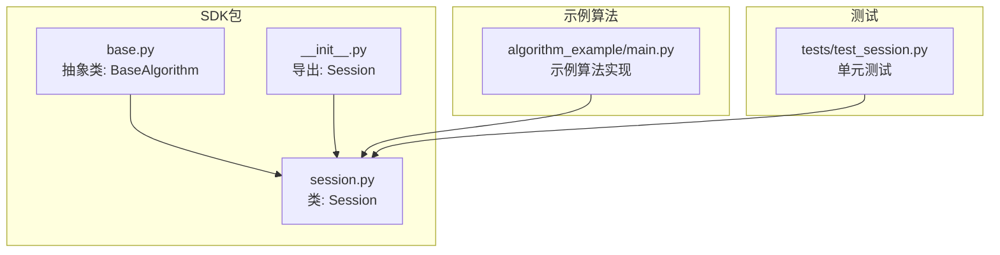
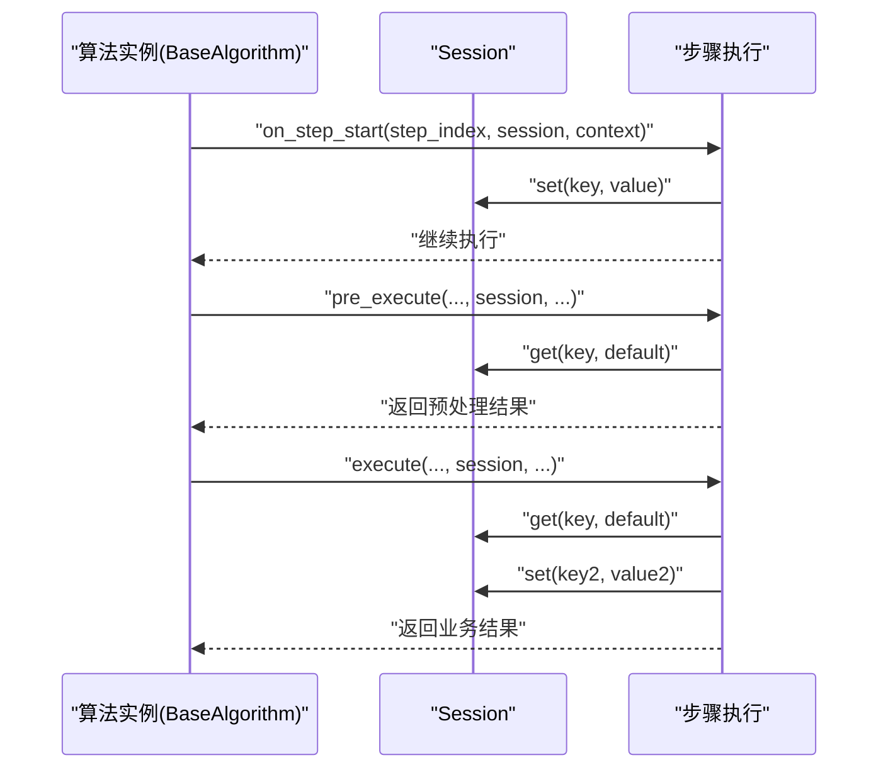
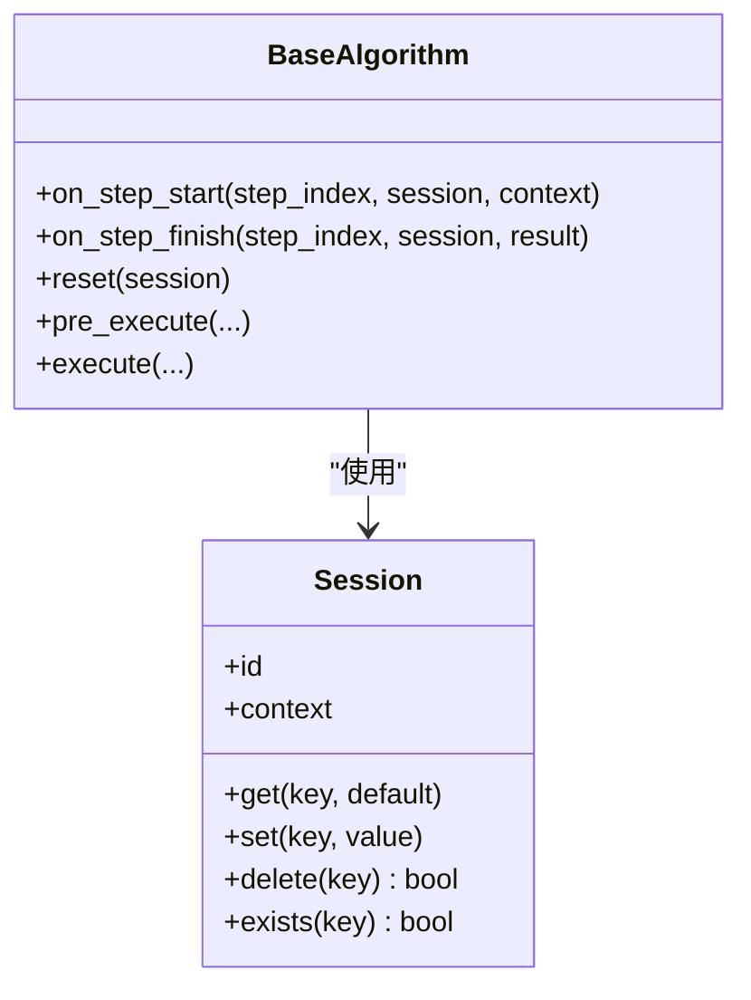

# Session API

<cite>
**本文引用的文件**
- [session.py](file://procvision_algorithm_sdk/session.py)
- [base.py](file://procvision_algorithm_sdk/base.py)
- [__init__.py](file://procvision_algorithm_sdk/__init__.py)
- [test_session.py](file://tests/test_session.py)
- [main.py](file://algorithm-example/algorithm_example/main.py)
- [README.md](file://README.md)
</cite>

## 目录
1. [简介](#简介)
2. [项目结构](#项目结构)
3. [核心组件](#核心组件)
4. [架构总览](#架构总览)
5. [详细组件分析](#详细组件分析)
6. [依赖关系分析](#依赖关系分析)
7. [性能考量](#性能考量)
8. [故障排查指南](#故障排查指南)
9. [结论](#结论)
10. [附录](#附录)

## 简介
本文件为工业视觉平台算法SDK中的Session类提供权威API文档。Session作为跨算法步骤的状态管理核心组件，通过唯一ID（id）标识会话实例，并利用内存中的键值存储（_state_store）在步骤之间持久化数据。它还提供只读上下文（context）字典，用于注入不可变的外部配置或元数据。Session的核心方法包括：get（支持默认值）、set（强制JSON可序列化）、delete（返回布尔）、exists（存在性检查）。本文将系统阐述其构造参数、属性行为、方法语义、内部实现机制、与BaseAlgorithm的协作方式、在分布式/热加载环境下的生命周期管理建议，以及最佳实践。

## 项目结构
Session位于SDK包的会话模块中，与BaseAlgorithm共同构成算法生命周期与状态管理的基础能力。示例算法展示了Session在pre_execute与execute之间的典型使用方式。

图表来源
- [session.py](file://procvision_algorithm_sdk/session.py#L1-L36)
- [base.py](file://procvision_algorithm_sdk/base.py#L1-L58)
- [__init__.py](file://procvision_algorithm_sdk/__init__.py#L1-L20)
- [main.py](file://algorithm-example/algorithm_example/main.py#L1-L150)
- [test_session.py](file://tests/test_session.py#L1-L24)

章节来源
- [session.py](file://procvision_algorithm_sdk/session.py#L1-L36)
- [base.py](file://procvision_algorithm_sdk/base.py#L1-L58)
- [__init__.py](file://procvision_algorithm_sdk/__init__.py#L1-L20)
- [README.md](file://README.md#L1-L116)

## 核心组件
- Session类：提供会话级状态管理，包含唯一ID、只读上下文、内存键值存储。
- BaseAlgorithm：算法基类，定义生命周期钩子与pre_execute/execute接口，接收Session实例。
- 示例算法：展示在on_step_start/on_step_finish中使用Session进行中间结果共享。

章节来源
- [session.py](file://procvision_algorithm_sdk/session.py#L1-L36)
- [base.py](file://procvision_algorithm_sdk/base.py#L1-L58)
- [main.py](file://algorithm-example/algorithm_example/main.py#L1-L150)

## 架构总览
Session与BaseAlgorithm的交互贯穿算法执行周期。BaseAlgorithm在每个步骤开始时通过on_step_start传入Session与context，在步骤结束时通过on_step_finish消费Session中的中间结果。pre_execute与execute之间也可通过Session共享中间数据（如模型输出、特征向量等）。

图表来源
- [base.py](file://procvision_algorithm_sdk/base.py#L1-L58)
- [session.py](file://procvision_algorithm_sdk/session.py#L1-L36)
- [main.py](file://algorithm-example/algorithm_example/main.py#L1-L150)

## 详细组件分析

### Session类定义与职责
- 唯一标识：通过构造参数id标识会话实例，用于区分不同执行上下文。
- 上下文隔离：构造参数context为只读视图（返回副本），防止外部修改污染内部状态。
- 内存状态：内部使用字典作为键值存储，支持get/set/delete/exists操作。
- 序列化约束：set方法对值进行JSON可序列化校验，确保状态可持久化与跨进程传递。

章节来源
- [session.py](file://procvision_algorithm_sdk/session.py#L1-L36)
- [test_session.py](file://tests/test_session.py#L1-L24)

### 构造函数与属性
- 构造函数参数
  - id: 字符串，会话唯一标识。
  - context: 可选字典，作为只读上下文注入。
- 只读属性
  - id: 返回会话ID。
  - context: 返回上下文副本，避免外部直接修改。

章节来源
- [session.py](file://procvision_algorithm_sdk/session.py#L1-L36)
- [test_session.py](file://tests/test_session.py#L1-L24)

### 核心方法详解
- get(key, default=None)
  - 功能：从状态存储中读取键对应的值，若不存在则返回默认值。
  - 复杂度：O(1)平均时间。
- set(key, value)
  - 功能：将值写入状态存储。
  - 约束：值必须是JSON可序列化的，否则抛出TypeError。
  - 实现机制：通过json.dumps进行序列化验证。
  - 复杂度：O(1)平均时间，序列化开销取决于值大小。
- delete(key)
  - 功能：删除键。
  - 返回：布尔值，表示是否成功删除。
  - 复杂度：O(1)平均时间。
- exists(key)
  - 功能：检查键是否存在。
  - 返回：布尔值。
  - 复杂度：O(1)平均时间。

章节来源
- [session.py](file://procvision_algorithm_sdk/session.py#L1-L36)
- [test_session.py](file://tests/test_session.py#L1-L24)

### 内部实现机制
- JSON序列化验证：set方法在写入前尝试将值序列化为JSON字符串，若失败则抛出TypeError，从而保证状态可持久化与跨进程传递的可靠性。
- 上下文副本：context属性返回字典副本，避免外部直接修改导致的副作用。
- 键值存储：内部字典用于内存中保存中间结果，适合轻量级数据共享。

章节来源
- [session.py](file://procvision_algorithm_sdk/session.py#L1-L36)

### 与BaseAlgorithm的协作
- 生命周期钩子：BaseAlgorithm提供on_step_start/on_step_finish/reset等钩子，算法可在这些阶段读写Session。
- 步骤接口：pre_execute/execute均接收Session实例，用于在步骤间共享中间结果。
- 示例：示例算法在on_step_start中设置起始时间戳，在on_step_finish中读取并计算延迟，同时在reset中清理临时键。

章节来源
- [base.py](file://procvision_algorithm_sdk/base.py#L1-L58)
- [main.py](file://algorithm-example/algorithm_example/main.py#L1-L150)

### 使用示例（路径指引）
以下为在pre_execute与execute之间共享中间结果的示例路径指引：
- 在pre_execute中读取共享内存并将中间结果写入Session：[示例路径](file://algorithm-example/algorithm_example/main.py#L1-L150)
- 在execute中从Session读取中间结果并继续推理：[示例路径](file://algorithm-example/algorithm_example/main.py#L1-L150)
- 在on_step_start/on_step_finish中使用Session进行计时与诊断：[示例路径](file://algorithm-example/algorithm_example/main.py#L1-L150)

章节来源
- [main.py](file://algorithm-example/algorithm_example/main.py#L1-L150)

### 分布式与热加载环境下的生命周期管理
- 会话生命周期：Session随算法实例的步骤执行而存在，通常在一次任务或一次进程内有效。
- 平台重启/热加载：若平台需要在不中断服务的情况下热加载算法包，建议在reset钩子中清理Session中的临时键，避免残留状态影响新版本逻辑。
- 与Runner协作：Runner可能保持进程常驻以复用资源，Session仅承载步骤间的短期状态，不替代持久化存储。

章节来源
- [README.md](file://README.md#L1-L116)
- [base.py](file://procvision_algorithm_sdk/base.py#L1-L58)

### 最佳实践
- 避免存储大型二进制数据：Session的_state_store为内存字典，存储大对象可能导致内存膨胀。
- 仅存储JSON可序列化数据：遵循set的序列化约束，确保状态可跨进程传递与持久化。
- 控制键命名与作用域：为不同步骤或模块定义清晰的键前缀，避免冲突。
- 使用context传递只读配置：将外部配置放入context并在属性中读取副本，避免误改。
- 及时清理临时键：在reset或on_step_finish中删除不再需要的中间结果。

章节来源
- [session.py](file://procvision_algorithm_sdk/session.py#L1-L36)
- [base.py](file://procvision_algorithm_sdk/base.py#L1-L58)

## 依赖关系分析
Session与BaseAlgorithm之间存在直接依赖：BaseAlgorithm在生命周期钩子与步骤接口中显式使用Session；__init__.py导出Session供外部使用；示例算法与测试用例进一步验证了Session的行为。

图表来源
- [base.py](file://procvision_algorithm_sdk/base.py#L1-L58)
- [session.py](file://procvision_algorithm_sdk/session.py#L1-L36)

章节来源
- [base.py](file://procvision_algorithm_sdk/base.py#L1-L58)
- [session.py](file://procvision_algorithm_sdk/session.py#L1-L36)
- [__init__.py](file://procvision_algorithm_sdk/__init__.py#L1-L20)

## 性能考量
- get/set/delete/exists均为字典操作，平均O(1)时间复杂度。
- set方法的json.dumps开销与值大小成正比，建议避免频繁写入大型对象。
- Session仅适用于步骤间短期共享，不适合长期持久化存储。

章节来源
- [session.py](file://procvision_algorithm_sdk/session.py#L1-L36)

## 故障排查指南
- set抛出TypeError：检查写入值是否为JSON可序列化类型（如dict、list、str、int、float、bool、None等），避免集合、类实例等不可序列化对象。
- context被修改无效：context属性返回副本，外部对副本的修改不会影响Session内部上下文，如需变更请通过构造参数或平台提供的更新机制。
- delete返回False：确认键是否存在，或检查是否被其他步骤提前删除。
- exists返回False：确认键拼写与作用域，或检查是否在正确的步骤中写入。

章节来源
- [test_session.py](file://tests/test_session.py#L1-L24)
- [session.py](file://procvision_algorithm_sdk/session.py#L1-L36)

## 结论
Session为算法SDK提供了简洁而强大的跨步骤状态管理能力。通过唯一ID标识、只读上下文隔离、内存键值存储与严格的JSON序列化约束，Session确保了状态的一致性与可传递性。结合BaseAlgorithm的生命周期钩子与步骤接口，Session能够高效地在pre_execute与execute之间共享中间结果。在分布式或热加载环境下，建议配合reset钩子进行状态清理，并遵循最佳实践避免内存膨胀与状态污染。

## 附录
- 导出入口：Session通过包导出供外部使用。
- 示例算法：展示了Session在步骤开始/结束与执行过程中的典型用法。
- 规范参考：README中明确了接口契约与Runner行为，有助于理解Session在整个平台中的定位。

章节来源
- [__init__.py](file://procvision_algorithm_sdk/__init__.py#L1-L20)
- [main.py](file://algorithm-example/algorithm_example/main.py#L1-L150)
- [README.md](file://README.md#L1-L116)