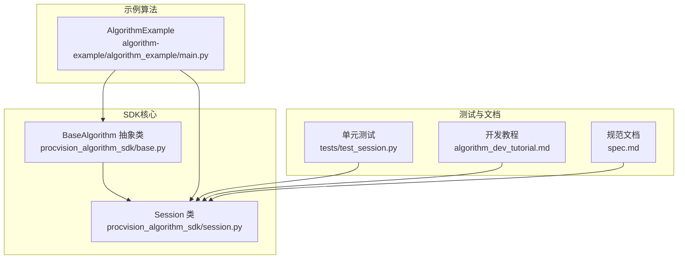
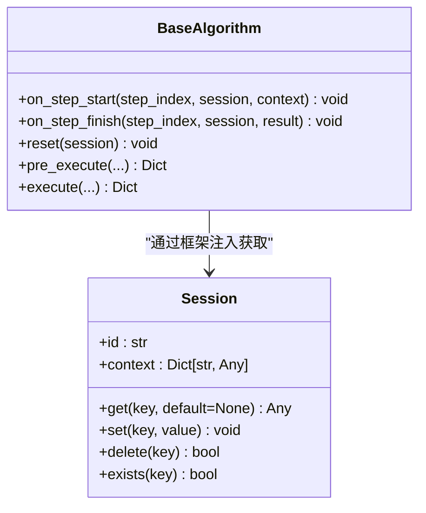
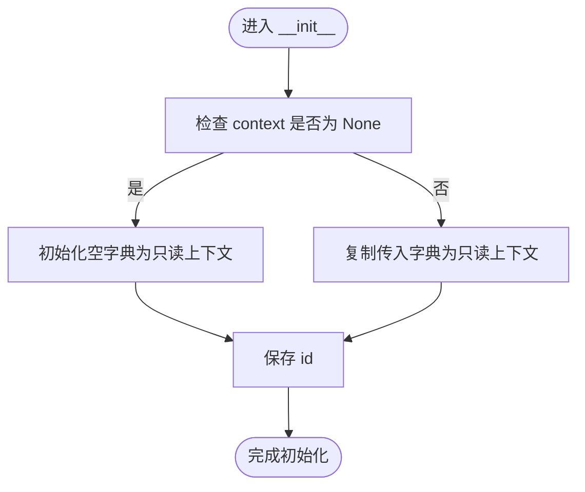
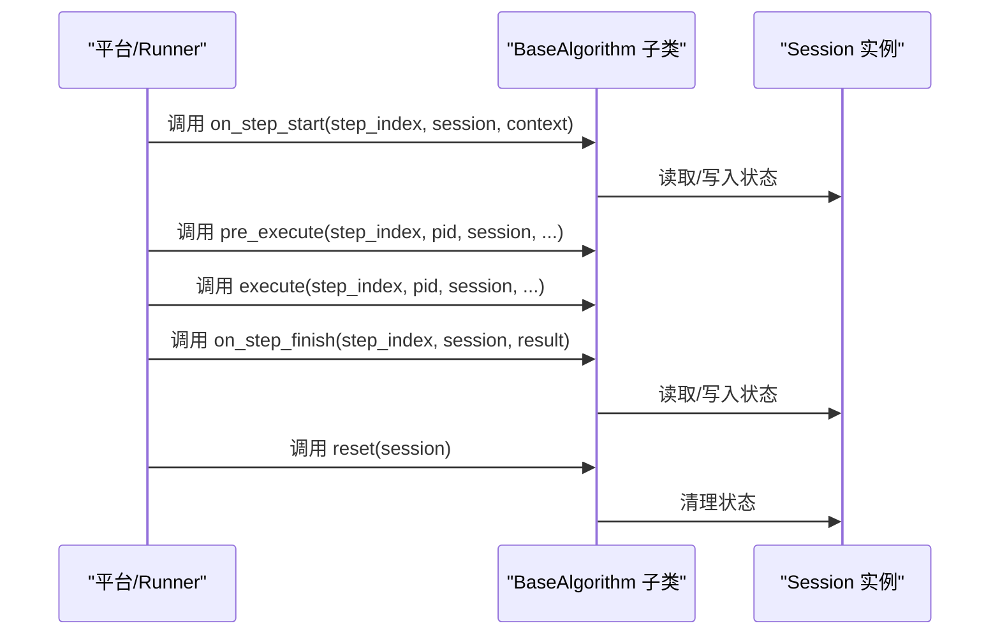
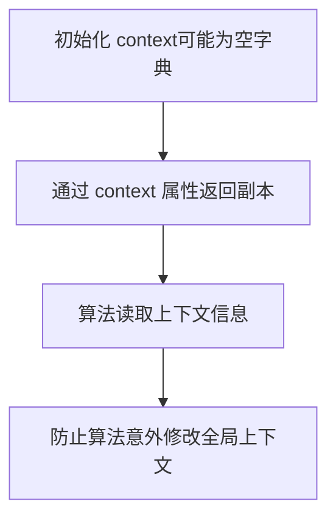
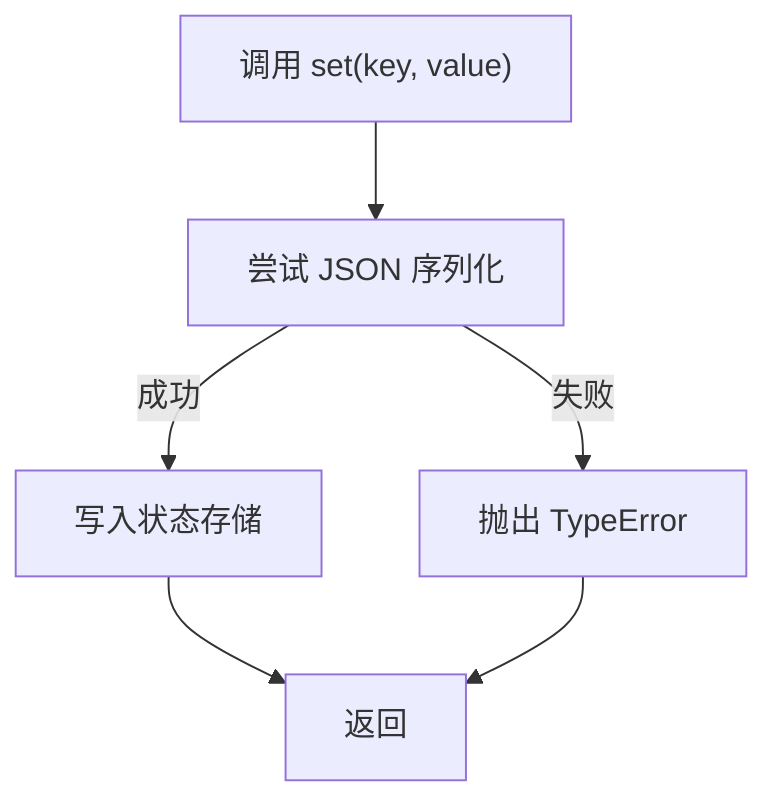
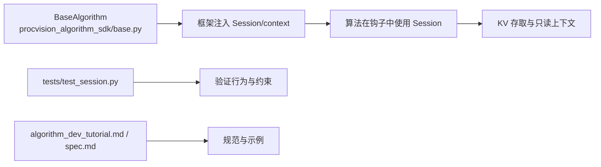

# Session 初始化

<cite>
**本文引用的文件**
- [session.py](file://procvision_algorithm_sdk/session.py)
- [base.py](file://procvision_algorithm_sdk/base.py)
- [test_session.py](file://tests/test_session.py)
- [algorithm_example/main.py](file://algorithm-example/algorithm_example/main.py)
- [algorithm_dev_tutorial.md](file://algorithm_dev_tutorial.md)
- [spec.md](file://spec.md)
</cite>

## 目录
1. [简介](#简介)
2. [项目结构](#项目结构)
3. [核心组件](#核心组件)
4. [架构概览](#架构概览)
5. [详细组件分析](#详细组件分析)
6. [依赖分析](#依赖分析)
7. [性能考虑](#性能考虑)
8. [故障排查指南](#故障排查指南)
9. [结论](#结论)

## 简介
本节聚焦于 Session 类的初始化方法 __init__，系统阐述其两个参数的职责与行为：
- id：会话的唯一标识符，用于区分不同会话实例；
- context：只读的上下文字典，通常由平台注入运行时环境信息（如设备ID、用户配置等），可选，默认为 None，表示初始化为空字典。

同时说明该方法的内部调用性质：开发者通常不应直接手动实例化 Session，而应通过框架注入的方式在 BaseAlgorithm 的生命周期钩子中获取 Session 实例。最后解释 context 的不可变性设计意图，防止算法逻辑意外修改全局上下文。

## 项目结构
围绕 Session 初始化的相关文件与角色如下：
- Session 定义与行为：procvision_algorithm_sdk/session.py
- BaseAlgorithm 生命周期钩子：procvision_algorithm_sdk/base.py
- 使用示例与注入方式：algorithm-example/algorithm_example/main.py
- 单元测试：tests/test_session.py
- 教程与规范文档：algorithm_dev_tutorial.md、spec.md

图表来源
- [session.py](file://procvision_algorithm_sdk/session.py#L1-L36)
- [base.py](file://procvision_algorithm_sdk/base.py#L1-L58)
- [algorithm_example/main.py](file://algorithm-example/algorithm_example/main.py#L1-L150)
- [test_session.py](file://tests/test_session.py#L1-L24)
- [algorithm_dev_tutorial.md](file://algorithm_dev_tutorial.md#L1-L347)
- [spec.md](file://spec.md#L450-L649)

章节来源
- [session.py](file://procvision_algorithm_sdk/session.py#L1-L36)
- [base.py](file://procvision_algorithm_sdk/base.py#L1-L58)
- [algorithm_example/main.py](file://algorithm-example/algorithm_example/main.py#L1-L150)
- [test_session.py](file://tests/test_session.py#L1-L24)
- [algorithm_dev_tutorial.md](file://algorithm_dev_tutorial.md#L1-L347)
- [spec.md](file://spec.md#L450-L649)

## 核心组件
- Session.__init__(id: str, context: Optional[Dict[str, Any]] = None)
  - id：会话唯一标识符，用于区分不同会话实例；
  - context：只读上下文字典，可选，默认 None，表示初始化为空字典；
  - 内部行为：保存 id；初始化空的状态存储；将 context 复制为只读视图（通过 context 属性返回副本）。
- BaseAlgorithm 生命周期钩子
  - on_step_start(step_index, session: Session, context: Dict[str, Any])：每步开始时接收注入的 Session 与只读 context；
  - on_step_finish(step_index, session: Session, result: Dict[str, Any])：每步结束时接收注入的 Session 与结果；
  - reset(session: Session)：流程级复位时接收注入的 Session；
  - pre_execute/execute：同样接收注入的 Session 与上下文信息。

章节来源
- [session.py](file://procvision_algorithm_sdk/session.py#L1-L36)
- [base.py](file://procvision_algorithm_sdk/base.py#L1-L58)

## 架构概览
Session 在 SDK 中承担两类职责：
- 会话标识与状态存储：通过 id 识别会话，通过内部状态存储实现跨步骤的数据共享；
- 只读上下文隔离：通过 context 属性返回上下文副本，保证算法逻辑不会意外修改全局上下文。

图表来源
- [session.py](file://procvision_algorithm_sdk/session.py#L1-L36)
- [base.py](file://procvision_algorithm_sdk/base.py#L1-L58)

## 详细组件分析

### Session.__init__ 参数与行为
- 参数 id
  - 作用：作为会话的唯一标识符，用于区分不同会话实例；
  - 设计意图：确保在多产品或多流程场景下，每个会话拥有独立的上下文与状态空间。
- 参数 context
  - 作用：只读的上下文字典，通常由平台注入运行时环境信息（如设备ID、用户配置等）；
  - 可选性：默认 None；
  - 默认行为：当 context 为 None 时，初始化为空字典；
  - 不可变性：通过 context 属性返回副本，防止算法逻辑意外修改全局上下文。

图表来源
- [session.py](file://procvision_algorithm_sdk/session.py#L1-L36)

章节来源
- [session.py](file://procvision_algorithm_sdk/session.py#L1-L36)

### 框架注入与使用方式
- 开发者不应直接调用 Session.__init__，而应通过框架注入获取 Session 实例；
- 在 BaseAlgorithm 的生命周期钩子中，框架会传入 Session 与 context，算法可在这些钩子中进行状态读写与上下文访问；
- 示例：AlgorithmExample 在 on_step_start 中通过 session.set 写入状态，在 on_step_finish 中通过 session.get 读取状态并发布诊断。

图表来源
- [base.py](file://procvision_algorithm_sdk/base.py#L1-L58)
- [algorithm_example/main.py](file://algorithm-example/algorithm_example/main.py#L1-L150)

章节来源
- [base.py](file://procvision_algorithm_sdk/base.py#L1-L58)
- [algorithm_example/main.py](file://algorithm-example/algorithm_example/main.py#L1-L150)

### context 数据结构与典型内容
- context 通常包含平台注入的运行时环境信息，例如产品代码、操作员、追踪ID等；
- 在教程与规范文档中提供了 context 的典型结构示例，用于说明只读上下文的设计意图；
- 测试用例展示了 context 的读取与 KV 存取的基本行为。

图表来源
- [algorithm_dev_tutorial.md](file://algorithm_dev_tutorial.md#L1-L347)
- [spec.md](file://spec.md#L450-L649)
- [test_session.py](file://tests/test_session.py#L1-L24)

章节来源
- [algorithm_dev_tutorial.md](file://algorithm_dev_tutorial.md#L1-L347)
- [spec.md](file://spec.md#L450-L649)
- [test_session.py](file://tests/test_session.py#L1-L24)

### set 值的 JSON 可序列化约束
- Session.set 在写入前会验证值是否可 JSON 序列化，否则抛出 TypeError；
- 这一约束确保会话状态存储的数据具备稳定的序列化与传输能力，符合 SDK 的跨步骤与跨进程协作需求。

图表来源
- [session.py](file://procvision_algorithm_sdk/session.py#L1-L36)
- [spec.md](file://spec.md#L450-L649)

章节来源
- [session.py](file://procvision_algorithm_sdk/session.py#L1-L36)
- [spec.md](file://spec.md#L450-L649)

## 依赖分析
- Session 与 BaseAlgorithm 的关系
  - BaseAlgorithm 通过框架注入向算法提供 Session 与 context；
  - 算法在生命周期钩子中使用 Session 进行状态读写与上下文访问；
  - 测试用例验证了 Session 的 KV 存取与序列化约束；
  - 教程与规范文档明确了 Session 的职责、使用方式与约束。

图表来源
- [base.py](file://procvision_algorithm_sdk/base.py#L1-L58)
- [session.py](file://procvision_algorithm_sdk/session.py#L1-L36)
- [test_session.py](file://tests/test_session.py#L1-L24)
- [algorithm_dev_tutorial.md](file://algorithm_dev_tutorial.md#L1-L347)
- [spec.md](file://spec.md#L450-L649)

章节来源
- [base.py](file://procvision_algorithm_sdk/base.py#L1-L58)
- [session.py](file://procvision_algorithm_sdk/session.py#L1-L36)
- [test_session.py](file://tests/test_session.py#L1-L24)
- [algorithm_dev_tutorial.md](file://algorithm_dev_tutorial.md#L1-L347)
- [spec.md](file://spec.md#L450-L649)

## 性能考虑
- Session 的状态存储为内存字典，适合存放轻量级数据；
- 建议单次会话数据大小控制在合理范围以内，避免占用过多内存；
- 由于 context 通过属性返回副本，读取时会有浅拷贝开销，但能确保上下文不可变性，避免并发与副作用风险。

## 故障排查指南
- set 抛出 TypeError
  - 现象：尝试写入不可 JSON 序列化的值；
  - 处理：确保写入的值为可序列化类型（如基本类型、列表、字典等）；
  - 参考：单元测试对非序列化值的断言。
- context 读取不到预期值
  - 现象：算法读取 context 为空或与预期不符；
  - 处理：确认框架是否正确注入 context；检查 context 是否被算法意外修改（因为 context 属性返回副本，不会影响全局上下文）；
  - 参考：教程与规范文档对 context 的只读设计说明。

章节来源
- [test_session.py](file://tests/test_session.py#L1-L24)
- [algorithm_dev_tutorial.md](file://algorithm_dev_tutorial.md#L1-L347)
- [spec.md](file://spec.md#L450-L649)

## 结论
- Session.__init__ 的两个参数分别承担“会话标识”和“只读上下文”的职责；
- context 默认 None 时初始化为空字典，且通过 context 属性返回副本，确保上下文不可变；
- 开发者应通过框架注入获取 Session 实例，而非直接调用 __init__；
- set 的 JSON 可序列化约束保障了状态存储的稳定性与可传输性；
- 在 BaseAlgorithm 的生命周期钩子中使用 Session，可安全地进行跨步骤状态共享与上下文访问。