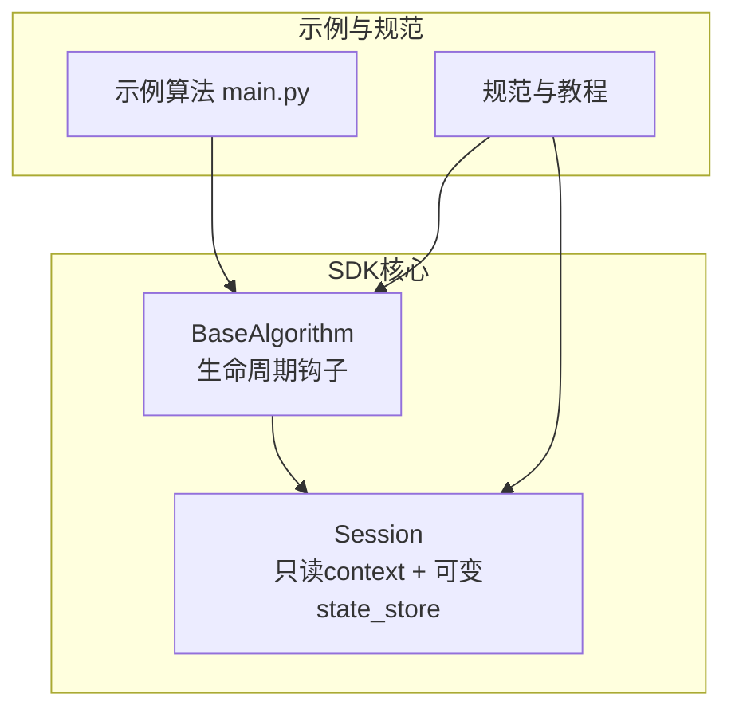
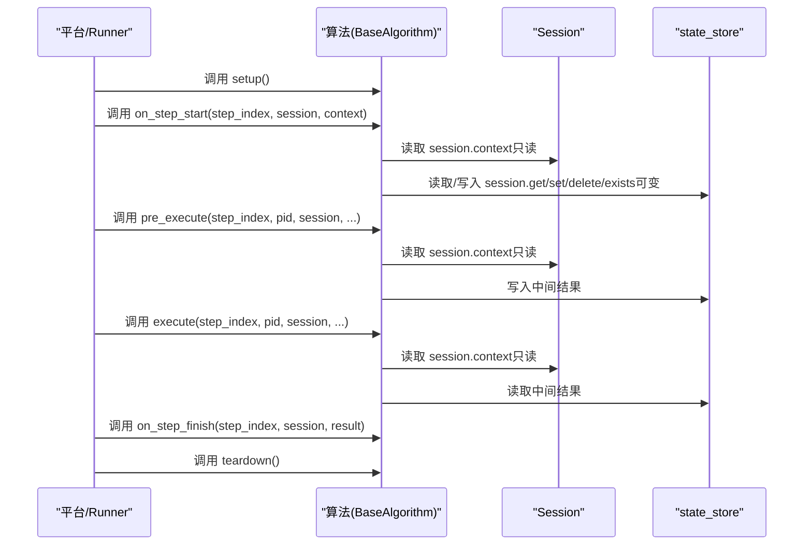
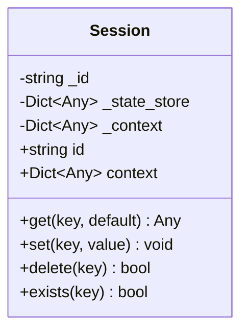
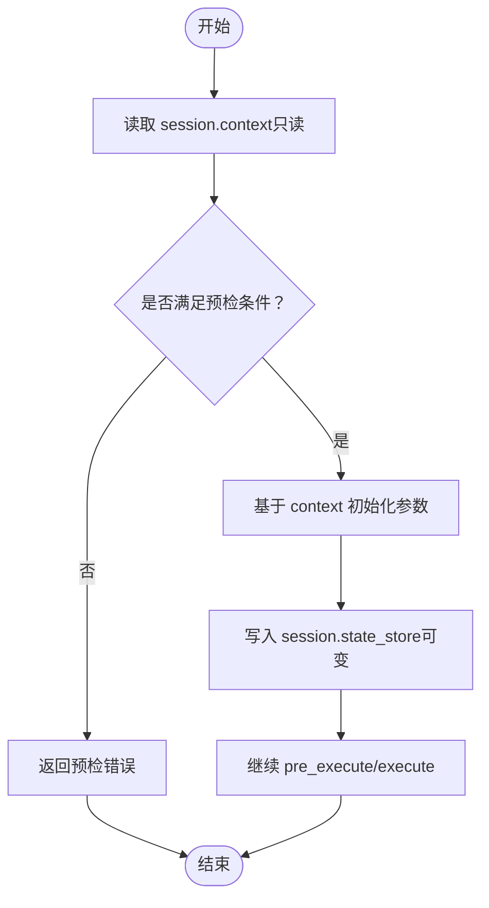
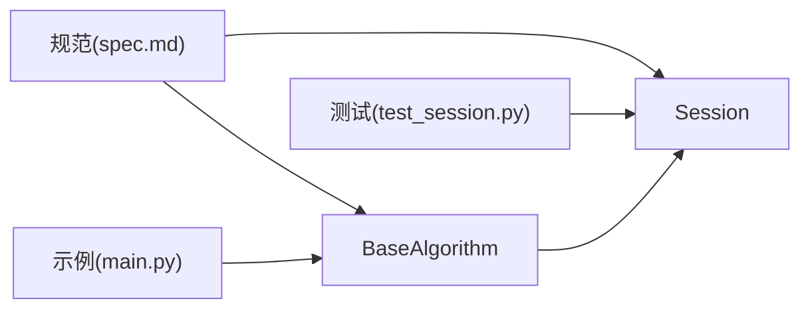

# 上下文 (context)

<cite>
**本文引用的文件列表**
- [session.py](file://procvision_algorithm_sdk/session.py)
- [base.py](file://procvision_algorithm_sdk/base.py)
- [test_session.py](file://tests/test_session.py)
- [spec.md](file://spec.md)
- [algorithm_dev_tutorial.md](file://algorithm_dev_tutorial.md)
- [README.md](file://README.md)
- [main.py](file://algorithm-example/algorithm_example/main.py)
</cite>

## 目录
1. [简介](#简介)
2. [项目结构](#项目结构)
3. [核心组件](#核心组件)
4. [架构概览](#架构概览)
5. [详细组件分析](#详细组件分析)
6. [依赖关系分析](#依赖关系分析)
7. [性能考量](#性能考量)
8. [故障排查指南](#故障排查指南)
9. [结论](#结论)
10. [附录](#附录)

## 简介
本篇文档聚焦于 Session 类的 context 属性，系统阐述其作为“平台向算法传递只读运行时信息”的通道机制。context 以字典形式承载产线编号、工位配置、用户权限、产品信息等只读上下文数据，算法在 pre_execute 等阶段通过 session.context 读取这些信息，用于初始化参数、决策与校验。为保障系统稳定性，context 在对外暴露时返回内部字典的副本，避免算法代码意外修改原始上下文数据。

## 项目结构
围绕 Session 与 context 的相关文件与职责如下：
- Session 定义与实现位于会话模块，提供只读 context 属性与可变状态存储（state_store）。
- BaseAlgorithm 定义了算法生命周期钩子，其中 on_step_start 接收一个独立的 context 参数，用于步骤级别的上下文传递。
- 规范文档与教程明确了 context 的只读语义、使用方式与最佳实践。
- 示例算法展示了如何在 on_step_start 中读取 context 并结合 session.state_store 进行状态管理。

图表来源
- [session.py](file://procvision_algorithm_sdk/session.py#L1-L36)
- [base.py](file://procvision_algorithm_sdk/base.py#L1-L58)
- [algorithm_dev_tutorial.md](file://algorithm_dev_tutorial.md#L96-L101)
- [spec.md](file://spec.md#L400-L460)

章节来源
- [session.py](file://procvision_algorithm_sdk/session.py#L1-L36)
- [base.py](file://procvision_algorithm_sdk/base.py#L1-L58)
- [algorithm_dev_tutorial.md](file://algorithm_dev_tutorial.md#L96-L101)
- [spec.md](file://spec.md#L400-L460)

## 核心组件
- Session.context：只读上下文通道，返回内部字典的副本，防止外部修改原始数据。
- Session.state_store：可变状态存储，用于跨步骤的数据共享与临时状态管理。
- BaseAlgorithm.on_step_start(step_index, session, context)：步骤级上下文接收点，与 session.context 互补。

章节来源
- [session.py](file://procvision_algorithm_sdk/session.py#L1-L36)
- [base.py](file://procvision_algorithm_sdk/base.py#L17-L30)
- [algorithm_dev_tutorial.md](file://algorithm_dev_tutorial.md#L96-L101)

## 架构概览
Session 在每次检测流程开始时由平台创建并贯穿整个流程，pre_execute/execute/生命周期钩子均可访问。context 由平台注入且只读，state_store 由算法自身管理且可变。

图表来源
- [base.py](file://procvision_algorithm_sdk/base.py#L17-L58)
- [session.py](file://procvision_algorithm_sdk/session.py#L1-L36)
- [spec.md](file://spec.md#L400-L460)

## 详细组件分析

### Session.context 的实现机制与只读语义
- context 作为只读通道，返回内部字典的副本，避免算法直接修改原始上下文，从而保障系统稳定性与一致性。
- 该机制在 Session 的 context 属性中通过 copy() 实现，确保外部拿到的是隔离的快照。

图表来源
- [session.py](file://procvision_algorithm_sdk/session.py#L1-L36)

章节来源
- [session.py](file://procvision_algorithm_sdk/session.py#L1-L36)
- [spec.md](file://spec.md#L400-L460)

### context 常见键值对示例
根据规范文档与教程，以下键通常出现在 context 中（示例键名，非穷举）：
- 产线与工位：例如 "line_id"、"station_name"、"workcell_id"
- 用户与权限：例如 "operator"、"user_role"、"permissions"
- 产品与批次：例如 "product_code"、"batch_no"、"order_id"
- 运行参数：例如 "speed_setting"、"inspection_mode"
- 追踪与审计：例如 "trace_id"、"session_id"

注意：以上为常见键的示例，具体键集由平台注入，算法应以只读方式读取并按需使用。

章节来源
- [spec.md](file://spec.md#L400-L460)
- [algorithm_dev_tutorial.md](file://algorithm_dev_tutorial.md#L96-L101)

### 在 pre_execute 中读取 context 初始化算法参数
- 在 pre_execute 阶段，算法可从 session.context 读取只读上下文，结合 user_params 与 image_meta 初始化检测参数。
- 示例流程（概念性描述，不展示具体代码）：
  - 读取 "line_id"、"station_name" 等工位信息，决定检测策略或阈值。
  - 读取 "operator"、"permissions" 等用户信息，进行权限校验与审计记录。
  - 读取 "product_code"、"batch_no" 等产品信息，选择对应模型或模板。
  - 读取 "speed_setting" 等运行参数，动态调整检测速度与灵敏度。
  - 若上下文缺失或不符合预期，返回预检错误，阻止进入 execute。

章节来源
- [base.py](file://procvision_algorithm_sdk/base.py#L36-L58)
- [session.py](file://procvision_algorithm_sdk/session.py#L1-L36)
- [spec.md](file://spec.md#L400-L460)

### 与 Session 状态存储（state_store）的区别
- context
  - 由平台提供，算法只能读取，不可修改。
  - 作用域：流程级只读上下文，包含运行时信息（产线、工位、用户、产品等）。
- state_store
  - 由算法自身管理，可读写，用于跨步骤的数据共享与临时状态。
  - 作用域：单次检测流程内的键值存储，仅在流程内有效，重启或切换产品会重新初始化。

图表来源
- [session.py](file://procvision_algorithm_sdk/session.py#L1-L36)
- [base.py](file://procvision_algorithm_sdk/base.py#L17-L58)

章节来源
- [session.py](file://procvision_algorithm_sdk/session.py#L1-L36)
- [base.py](file://procvision_algorithm_sdk/base.py#L17-L58)
- [spec.md](file://spec.md#L400-L460)

### 示例：在 on_step_start 中读取 context 并结合 state_store
- 示例算法在 on_step_start 中读取 context 并将起始时间写入 state_store，用于后续 on_step_finish 计算耗时。
- 这体现了 context 的只读特性与 state_store 的可变特性在同一生命周期钩子中的协同使用。

章节来源
- [main.py](file://algorithm-example/algorithm_example/main.py#L1-L150)

## 依赖关系分析
- BaseAlgorithm 依赖 Session，生命周期钩子与 pre_execute/execute 均接收 session 参数。
- Session 本身不依赖 BaseAlgorithm，但被 BaseAlgorithm 的方法广泛使用。
- 规范与教程对 Session 的只读语义与使用方式进行约束与指导。

图表来源
- [base.py](file://procvision_algorithm_sdk/base.py#L1-L58)
- [session.py](file://procvision_algorithm_sdk/session.py#L1-L36)
- [test_session.py](file://tests/test_session.py#L1-L24)
- [spec.md](file://spec.md#L400-L460)
- [main.py](file://algorithm-example/algorithm_example/main.py#L1-L150)

章节来源
- [base.py](file://procvision_algorithm_sdk/base.py#L1-L58)
- [session.py](file://procvision_algorithm_sdk/session.py#L1-L36)
- [test_session.py](file://tests/test_session.py#L1-L24)
- [spec.md](file://spec.md#L400-L460)
- [main.py](file://algorithm-example/algorithm_example/main.py#L1-L150)

## 性能考量
- context 返回副本（copy）的开销极低，通常为浅拷贝字典的复制，对性能影响可忽略。
- 建议避免在 context 中存放大型结构，保持只读上下文轻量，以降低序列化与传输成本。
- state_store 仅在单次流程内有效，避免在其中存放大量数据，建议控制在较小内存占用范围内。

章节来源
- [session.py](file://procvision_algorithm_sdk/session.py#L1-L36)
- [spec.md](file://spec.md#L400-L460)

## 故障排查指南
- 预检失败（status="ERROR"）
  - 当 context 缺失关键字段或不符合预期时，应在 pre_execute 中返回预检错误，阻止进入 execute。
- 非法参数类型
  - state_store 的 set 操作要求值为 JSON 可序列化，否则抛出类型错误。请确保写入的数据结构可被序列化。
- 上下文篡改风险
  - 由于 context 返回副本，算法不应尝试修改其内容；若出现异常行为，检查是否直接对 session.context 的返回值进行了写操作。

章节来源
- [test_session.py](file://tests/test_session.py#L1-L24)
- [session.py](file://procvision_algorithm_sdk/session.py#L1-L36)
- [spec.md](file://spec.md#L400-L460)

## 结论
Session.context 是平台向算法传递只读运行时信息的标准通道，通过返回字典副本确保数据安全与一致性。算法应在 pre_execute/生命周期钩子中读取 context，结合 user_params 与 state_store 完成参数初始化与跨步骤状态管理。与 state_store 的可变特性形成互补：context 提供稳定、可信的运行时输入，state_store 提供灵活的中间态存储。

## 附录
- 快速参考
  - 只读上下文：session.context（返回副本）
  - 可变状态：session.get/set/delete/exists
  - 生命周期钩子：on_step_start(step_index, session, context)
  - 规范与示例：参见 README、spec.md、algorithm_dev_tutorial.md、algorithm-example/main.py

章节来源
- [README.md](file://README.md#L1-L116)
- [spec.md](file://spec.md#L400-L460)
- [algorithm_dev_tutorial.md](file://algorithm_dev_tutorial.md#L96-L101)
- [main.py](file://algorithm-example/algorithm_example/main.py#L1-L150)