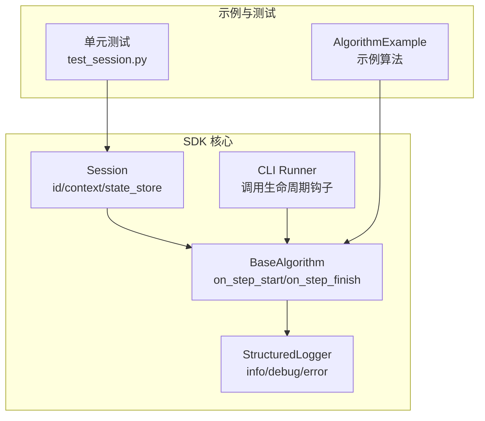
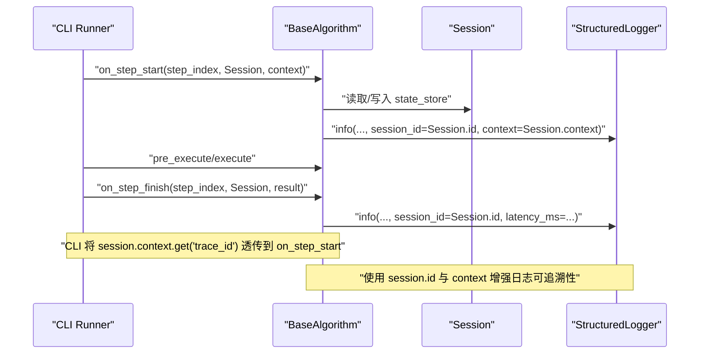
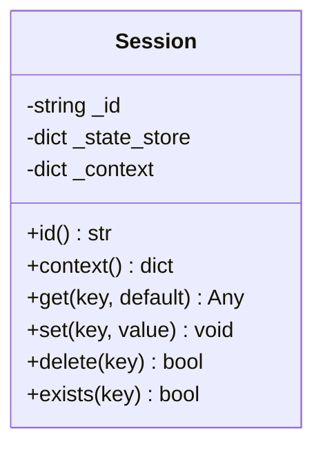
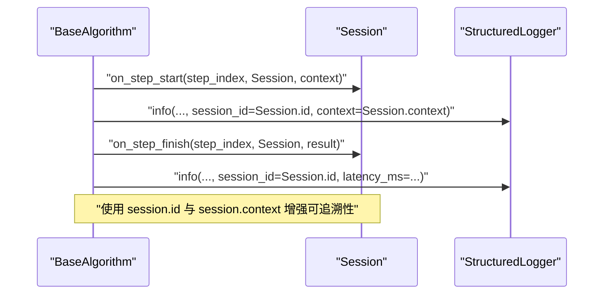
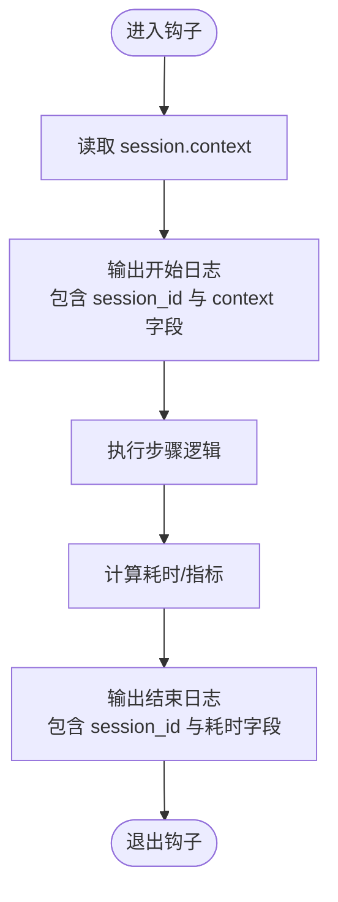
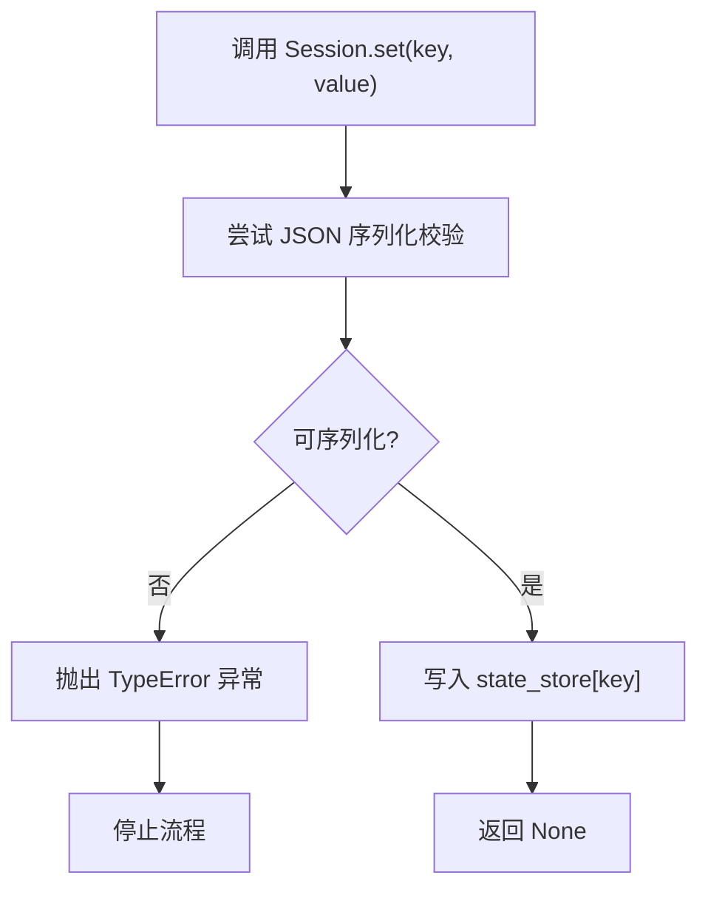
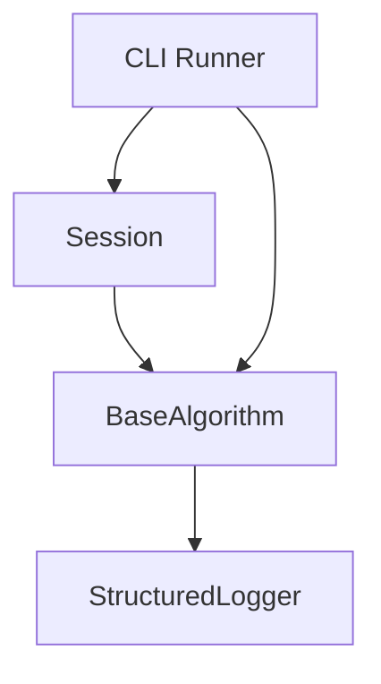

# 会话ID (id)

<cite>
**本文引用的文件**
- [session.py](file://procvision_algorithm_sdk/session.py)
- [base.py](file://procvision_algorithm_sdk/base.py)
- [logger.py](file://procvision_algorithm_sdk/logger.py)
- [cli.py](file://procvision_algorithm_sdk/cli.py)
- [test_session.py](file://tests/test_session.py)
- [main.py](file://algorithm-example/algorithm_example/main.py)
- [README.md](file://README.md)
- [algorithm_dev_tutorial.md](file://algorithm_dev_tutorial.md)
- [spec.md](file://spec.md)
</cite>

## 目录
1. [简介](#简介)
2. [项目结构](#项目结构)
3. [核心组件](#核心组件)
4. [架构总览](#架构总览)
5. [详细组件分析](#详细组件分析)
6. [依赖关系分析](#依赖关系分析)
7. [性能考量](#性能考量)
8. [故障排查指南](#故障排查指南)
9. [结论](#结论)
10. [附录](#附录)

## 简介
本节聚焦于 Session 类的 id 只读属性，说明其作为会话唯一字符串标识符在日志记录、调试与多会话管理中的作用，并阐述其在分布式环境中的会话路由与状态关联价值。文档还给出在日志中输出 session.id 以增强可追溯性的实践方法，并强调其只读特性对会话状态一致性的重要意义。最后，结合 BaseAlgorithm 的 on_step_start 与 on_step_finish 钩子，展示如何利用 session.id 实现跨步骤的执行流程跟踪。

## 项目结构
围绕会话 ID 的关键文件与模块如下：
- 会话与状态管理：Session 类位于 session.py，提供 id 只读属性、context 只读字典以及 state_store 的读写接口。
- 算法基类与生命周期钩子：BaseAlgorithm 在 base.py 中定义了 on_step_start 与 on_step_finish 等钩子，接收 Session 实例，用于在步骤开始与结束时进行状态记录与诊断输出。
- 结构化日志：StructuredLogger 在 logger.py 中提供 info/debug/error 输出能力，统一携带 timestamp_ms 字段，便于日志聚合与检索。
- 运行器与上下文传递：CLI 在 cli.py 中调用算法生命周期钩子，并将 session.context 中的 trace_id 等字段透传给 on_step_start，从而在分布式场景下建立端到端的会话关联。
- 示例与测试：algorithm-example/main.py 展示了在 on_step_start/on_step_finish 中使用 session 的典型模式；tests/test_session.py 验证了 id 的只读性与状态存储的可用性；README.md 与 tutorial 文档提供了接口与最佳实践说明；spec.md 描述了 Session 的字段与使用示例。

图表来源
- [session.py](file://procvision_algorithm_sdk/session.py#L1-L36)
- [base.py](file://procvision_algorithm_sdk/base.py#L1-L58)
- [logger.py](file://procvision_algorithm_sdk/logger.py#L1-L24)
- [cli.py](file://procvision_algorithm_sdk/cli.py#L192-L225)
- [main.py](file://algorithm-example/algorithm_example/main.py#L1-L150)
- [test_session.py](file://tests/test_session.py#L1-L24)

章节来源
- [session.py](file://procvision_algorithm_sdk/session.py#L1-L36)
- [base.py](file://procvision_algorithm_sdk/base.py#L1-L58)
- [logger.py](file://procvision_algorithm_sdk/logger.py#L1-L24)
- [cli.py](file://procvision_algorithm_sdk/cli.py#L192-L225)
- [README.md](file://README.md#L1-L116)
- [algorithm_dev_tutorial.md](file://algorithm_dev_tutorial.md#L56-L80)

## 核心组件
- Session.id：只读属性，返回会话的唯一字符串标识符。该标识符用于在日志记录、调试与多会话管理中追踪特定会话的生命周期。
- Session.context：只读字典副本，提供只读隔离的上下文，常包含 trace_id、产品编码等跨步骤共享信息。
- Session.state_store：可序列化的键值存储，用于跨步骤共享数据；写入前会进行 JSON 可序列化校验。
- BaseAlgorithm 钩子：on_step_start 与 on_step_finish 接收 Session 实例，可在步骤开始与结束时记录状态、计算耗时并输出诊断信息。
- StructuredLogger：提供 info/debug/error 输出，统一包含 level、timestamp_ms 与自定义字段，便于日志聚合与检索。

章节来源
- [session.py](file://procvision_algorithm_sdk/session.py#L1-L36)
- [base.py](file://procvision_algorithm_sdk/base.py#L1-L58)
- [logger.py](file://procvision_algorithm_sdk/logger.py#L1-L24)
- [cli.py](file://procvision_algorithm_sdk/cli.py#L192-L225)
- [spec.md](file://spec.md#L486-L531)

## 架构总览
下图展示了会话 ID 在分布式环境中的路由与状态关联路径：CLI 将 session.context 中的 trace_id 透传至 on_step_start，算法在钩子中使用 session.id 与 session.context 进行日志与诊断输出，形成端到端的可追溯性。

图表来源
- [cli.py](file://procvision_algorithm_sdk/cli.py#L192-L225)
- [base.py](file://procvision_algorithm_sdk/base.py#L1-L58)
- [logger.py](file://procvision_algorithm_sdk/logger.py#L1-L24)
- [session.py](file://procvision_algorithm_sdk/session.py#L1-L36)

## 详细组件分析

### Session.id 只读属性
- 定义与行为
  - Session.id 是只读属性，返回构造时传入的唯一字符串标识符。
  - 该标识符在会话生命周期内保持不变，确保跨步骤、跨模块的稳定引用。
- 分布式路由与状态关联
  - 在分布式环境中，session.id 可作为路由键，将同一会话的请求、中间状态与最终结果关联在一起。
  - 结合 session.context 中的 trace_id，可实现端到端的链路追踪与跨服务的状态关联。
- 可追溯性与日志输出
  - 在日志输出中包含 session.id，有助于在海量日志中快速定位特定会话的全链路行为。
  - StructuredLogger 统一输出格式，便于日志系统进行聚合与检索。

图表来源
- [session.py](file://procvision_algorithm_sdk/session.py#L1-L36)

章节来源
- [session.py](file://procvision_algorithm_sdk/session.py#L1-L36)
- [spec.md](file://spec.md#L486-L531)

### BaseAlgorithm 生命周期钩子与 session.id
- on_step_start
  - 在步骤开始时，算法可读取 session.context（例如 trace_id），并使用 session.id 进行日志与诊断输出。
  - 可在此阶段初始化会话内的计时、计数等状态，为后续 on_step_finish 的耗时统计提供基础。
- on_step_finish
  - 在步骤结束时，算法可基于 session.id 与 session.context 输出诊断信息，计算耗时并发布到 Diagnostics。
  - 可根据需要清理会话内临时状态，保证会话的幂等性与一致性。

图表来源
- [base.py](file://procvision_algorithm_sdk/base.py#L1-L58)
- [logger.py](file://procvision_algorithm_sdk/logger.py#L1-L24)
- [cli.py](file://procvision_algorithm_sdk/cli.py#L192-L225)

章节来源
- [base.py](file://procvision_algorithm_sdk/base.py#L1-L58)
- [cli.py](file://procvision_algorithm_sdk/cli.py#L192-L225)
- [algorithm_dev_tutorial.md](file://algorithm_dev_tutorial.md#L56-L80)

### 日志输出中的 session.id 实践
- 在 on_step_start 与 on_step_finish 中，使用 StructuredLogger 的 info/debug/error 输出时，将 session.id 作为自定义字段传入，以便在日志中显式标注会话标识。
- 同时输出 session.context 中的关键字段（如 trace_id），以建立端到端的链路关联。
- 通过统一的 timestamp_ms 字段，便于日志系统的排序与聚合。

图表来源
- [logger.py](file://procvision_algorithm_sdk/logger.py#L1-L24)
- [base.py](file://procvision_algorithm_sdk/base.py#L1-L58)
- [cli.py](file://procvision_algorithm_sdk/cli.py#L192-L225)

章节来源
- [logger.py](file://procvision_algorithm_sdk/logger.py#L1-L24)
- [algorithm_example/main.py](file://algorithm-example/algorithm_example/main.py#L1-L150)

### 只读特性与状态一致性
- id 只读
  - Session.id 为只读属性，防止外部修改导致会话状态混乱与不可追踪。
  - 测试用例验证了 id 的只读性与状态存储的可用性。
- 状态存储与序列化
  - Session.set 在写入前进行 JSON 可序列化校验，确保 state_store 中的数据可被稳定持久化与跨模块传输。
  - 删除与存在性检查提供幂等操作，便于在复杂流程中安全地管理会话状态。

图表来源
- [session.py](file://procvision_algorithm_sdk/session.py#L1-L36)
- [test_session.py](file://tests/test_session.py#L1-L24)

章节来源
- [session.py](file://procvision_algorithm_sdk/session.py#L1-L36)
- [test_session.py](file://tests/test_session.py#L1-L24)

## 依赖关系分析
- Session 与 BaseAlgorithm
  - BaseAlgorithm 的生命周期钩子接收 Session 实例，算法通过 session.id 与 session.context 实现跨步骤的可追溯性。
- Session 与 StructuredLogger
  - 算法在钩子中使用 StructuredLogger 输出日志，统一包含 timestamp_ms 与自定义字段，便于日志聚合与检索。
- CLI 与 Session.context
  - CLI 在调用 on_step_start 时，将 session.context.get("trace_id") 透传给算法，从而在分布式环境中建立端到端的会话关联。

图表来源
- [base.py](file://procvision_algorithm_sdk/base.py#L1-L58)
- [logger.py](file://procvision_algorithm_sdk/logger.py#L1-L24)
- [cli.py](file://procvision_algorithm_sdk/cli.py#L192-L225)
- [session.py](file://procvision_algorithm_sdk/session.py#L1-L36)

章节来源
- [base.py](file://procvision_algorithm_sdk/base.py#L1-L58)
- [logger.py](file://procvision_algorithm_sdk/logger.py#L1-L24)
- [cli.py](file://procvision_algorithm_sdk/cli.py#L192-L225)
- [session.py](file://procvision_algorithm_sdk/session.py#L1-L36)

## 性能考量
- 会话 ID 的生成与使用
  - 会话 ID 仅作为标识符，不涉及复杂计算，读取与输出开销极低。
- 日志输出
  - StructuredLogger 采用单行 JSON 输出，包含 timestamp_ms 与自定义字段，便于日志系统高效处理。
- 状态存储
  - state_store 的读写为简单字典操作，序列化校验仅在写入时进行，整体性能开销可控。

[本节为通用性能讨论，无需列出具体文件来源]

## 故障排查指南
- 会话 ID 丢失或为空
  - 确认在创建 Session 时传入了有效的 id；在日志中输出 session.id 以验证其存在性。
- 日志中缺少会话标识
  - 检查是否在 on_step_start 与 on_step_finish 中将 session.id 作为自定义字段输出。
- 分布式链路不完整
  - 确认 CLI 在调用 on_step_start 时将 session.context.get("trace_id") 透传；在日志中同时输出 trace_id 与 session.id。
- 状态存储失败
  - 若写入非 JSON 可序列化对象，将抛出 TypeError；请确保写入的数据类型符合要求。

章节来源
- [cli.py](file://procvision_algorithm_sdk/cli.py#L192-L225)
- [logger.py](file://procvision_algorithm_sdk/logger.py#L1-L24)
- [session.py](file://procvision_algorithm_sdk/session.py#L1-L36)
- [test_session.py](file://tests/test_session.py#L1-L24)

## 结论
Session.id 作为会话的唯一标识符，在日志记录、调试与多会话管理中发挥关键作用。其只读特性确保了会话状态的一致性与可追踪性。结合 BaseAlgorithm 的生命周期钩子与 StructuredLogger 的统一日志输出，算法可以在步骤开始与结束时利用 session.id 与 session.context 实现跨步骤的执行流程跟踪，并在分布式环境中通过 trace_id 建立端到端的链路关联。建议在所有关键日志输出中包含 session.id，以提升系统的可观测性与可维护性。

[本节为总结性内容，无需列出具体文件来源]

## 附录
- 实际代码示例路径（不直接展示代码内容）
  - 在生命周期钩子中输出 session.id 与 context 的示例：[AlgorithmExample.on_step_start/on_step_finish](file://algorithm-example/algorithm_example/main.py#L1-L150)
  - 验证 id 只读与状态存储的单元测试：[tests.test_session](file://tests/test_session.py#L1-L24)
  - CLI 透传 trace_id 到 on_step_start 的调用点：[cli._run_one_step](file://procvision_algorithm_sdk/cli.py#L192-L225)
  - Session 字段与使用示例（含 trace_id）：[spec.md Session 字段示例](file://spec.md#L486-L531)

章节来源
- [main.py](file://algorithm-example/algorithm_example/main.py#L1-L150)
- [test_session.py](file://tests/test_session.py#L1-L24)
- [cli.py](file://procvision_algorithm_sdk/cli.py#L192-L225)
- [spec.md](file://spec.md#L486-L531)