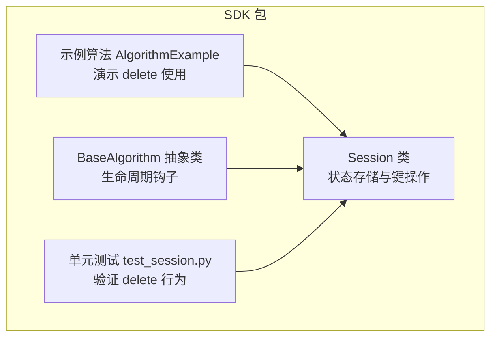
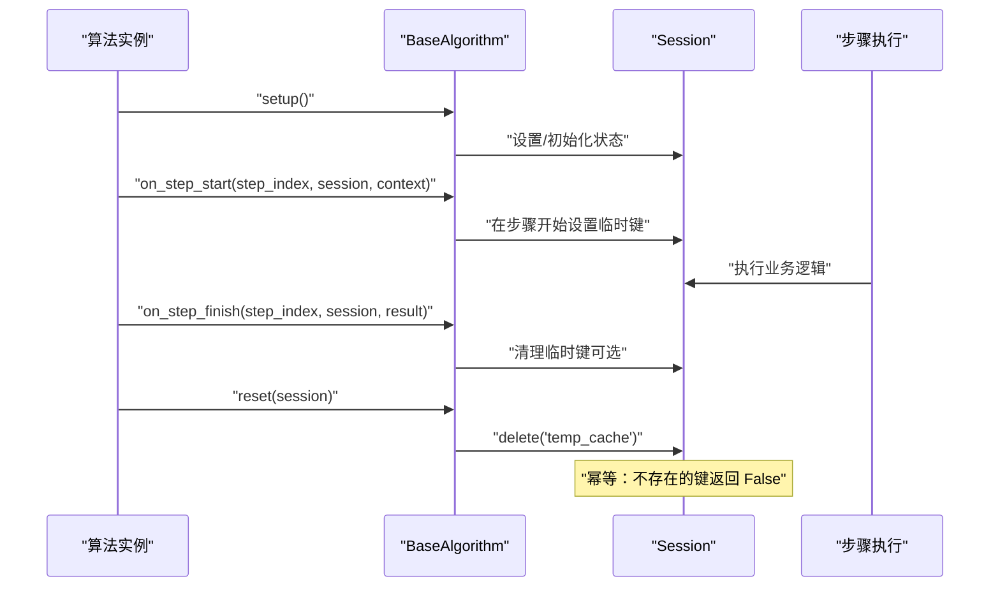
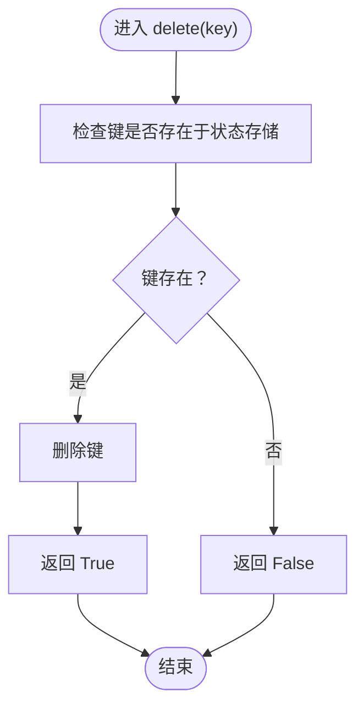
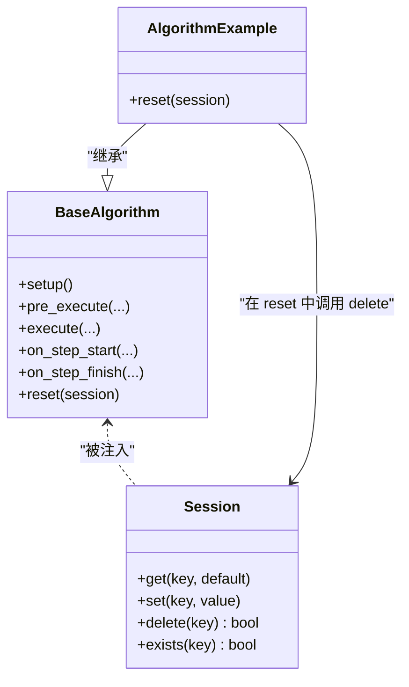

# 删除状态 (delete)

<cite>
**本文引用的文件**
- [session.py](file://procvision_algorithm_sdk/session.py)
- [test_session.py](file://tests/test_session.py)
- [main.py](file://algorithm-example/algorithm_example/main.py)
- [base.py](file://procvision_algorithm_sdk/base.py)
</cite>

## 目录
1. [简介](#简介)
2. [项目结构](#项目结构)
3. [核心组件](#核心组件)
4. [架构总览](#架构总览)
5. [详细组件分析](#详细组件分析)
6. [依赖关系分析](#依赖关系分析)
7. [性能考量](#性能考量)
8. [故障排查指南](#故障排查指南)
9. [结论](#结论)
10. [附录](#附录)

## 简介
本篇文档聚焦于 Session.delete 方法，系统性说明其从状态存储中移除指定键的行为与返回值语义。根据实现与测试，该方法返回布尔类型：True 表示键存在且已成功删除；False 表示键不存在。这一返回值可用于条件逻辑，例如仅在存在旧缓存时才执行清理操作。文档还给出在 setup 或 pre_execute 生命周期阶段使用 session.delete('temp_cache') 清理临时数据的实践建议，并强调其幂等性：删除不存在的键不会抛出异常，而是安全地返回 False。最后，对比 Python 内置 del 语句，突出 Session.delete 的安全性与返回状态带来的可编程优势。

## 项目结构
- Session 类位于会话状态管理模块，提供 get/set/delete/exists 等方法，用于在算法生命周期内跨步骤共享与清理状态数据。
- 示例算法展示了在 reset 阶段使用 delete 清理临时键的实践。
- 测试用例覆盖了 delete 的基本行为与 JSON 序列化约束。

图表来源
- [session.py](file://procvision_algorithm_sdk/session.py#L1-L36)
- [base.py](file://procvision_algorithm_sdk/base.py#L1-L58)
- [main.py](file://algorithm-example/algorithm_example/main.py#L1-L150)
- [test_session.py](file://tests/test_session.py#L1-L24)

章节来源
- [session.py](file://procvision_algorithm_sdk/session.py#L1-L36)
- [test_session.py](file://tests/test_session.py#L1-L24)
- [main.py](file://algorithm-example/algorithm_example/main.py#L1-L150)
- [base.py](file://procvision_algorithm_sdk/base.py#L1-L58)

## 核心组件
- Session.delete(key: str) -> bool
  - 功能：尝试从内部状态存储中删除指定键。
  - 返回值：布尔类型。True 表示键存在且已删除；False 表示键不存在。
  - 幂等性：对不存在的键重复调用不会抛出异常，始终返回 False。
  - 适用场景：条件清理、幂等清理、与 exists 组合进行安全删除。

章节来源
- [session.py](file://procvision_algorithm_sdk/session.py#L1-L36)
- [test_session.py](file://tests/test_session.py#L1-L24)

## 架构总览
Session 在算法生命周期中作为状态容器，贯穿 setup、pre_execute、execute、on_step_start/finish、reset 等阶段。delete 作为状态管理的一部分，常用于在 reset 或 on_step_finish 等节点清理临时键，确保后续步骤不会误用旧状态。

图表来源
- [base.py](file://procvision_algorithm_sdk/base.py#L1-L58)
- [session.py](file://procvision_algorithm_sdk/session.py#L1-L36)
- [main.py](file://algorithm-example/algorithm_example/main.py#L1-L150)

## 详细组件分析

### Session.delete 实现与行为
- 实现要点
  - 通过键存在性判断决定是否删除。
  - 删除成功返回 True，否则返回 False。
  - 无异常抛出，保证幂等性。
- 复杂度
  - 键存在性检查与字典删除均为平均 O(1)。
- 边界与约束
  - 仅对内部状态存储生效，不影响只读 context。
  - 与 set 的 JSON 序列化约束无关，但 set 的序列化失败会抛出异常，这与 delete 的行为边界清晰分离。

图表来源
- [session.py](file://procvision_algorithm_sdk/session.py#L1-L36)

章节来源
- [session.py](file://procvision_algorithm_sdk/session.py#L1-L36)

### 与 Python 内置 del 的对比
- 语义差异
  - 内置 del：直接删除键，若键不存在则抛出异常。
  - Session.delete：返回布尔值指示删除是否发生，不存在时安全返回 False。
- 可靠性
  - Session.delete 更适合在不确定键是否存在的情况下进行清理，避免异常传播。
- 可编程性
  - 返回值可用于条件逻辑，便于编写幂等与可重试的清理流程。

章节来源
- [session.py](file://procvision_algorithm_sdk/session.py#L1-L36)

### 在生命周期中的使用示例
- 示例一：在 reset 阶段清理临时键
  - 在示例算法中，reset 钩子调用 delete 清理临时键，确保会话重置后无残留状态。
  - 参考路径：[示例算法 reset](file://algorithm-example/algorithm_example/main.py#L1-L150)
- 示例二：在 setup/pre_execute 阶段清理临时数据
  - 在 setup 或 pre_execute 中，先检查并删除可能存在的临时键，再写入新值，确保幂等与一致性。
  - 参考路径：[BaseAlgorithm 生命周期钩子](file://procvision_algorithm_sdk/base.py#L1-L58)

章节来源
- [main.py](file://algorithm-example/algorithm_example/main.py#L1-L150)
- [base.py](file://procvision_algorithm_sdk/base.py#L1-L58)

### 测试验证
- 测试覆盖
  - set/get/exists/delete 的组合验证：先 set，再 exists/get，再 delete，最后确认不存在。
  - 非可序列化值 set 抛错：验证 set 的 JSON 序列化约束与 delete 的行为边界。
- 参考路径
  - [测试用例：delete 行为](file://tests/test_session.py#L1-L24)

章节来源
- [test_session.py](file://tests/test_session.py#L1-L24)

## 依赖关系分析
- Session 与 BaseAlgorithm
  - BaseAlgorithm 提供生命周期钩子，Session 作为状态容器被注入到各阶段。
  - 示例算法在 reset 中调用 delete，体现两者协作。
- Session 与示例算法
  - 示例算法在 on_step_start 设置临时键，在 reset 中删除，展示 delete 的典型用法。

图表来源
- [base.py](file://procvision_algorithm_sdk/base.py#L1-L58)
- [session.py](file://procvision_algorithm_sdk/session.py#L1-L36)
- [main.py](file://algorithm-example/algorithm_example/main.py#L1-L150)

章节来源
- [base.py](file://procvision_algorithm_sdk/base.py#L1-L58)
- [session.py](file://procvision_algorithm_sdk/session.py#L1-L36)
- [main.py](file://algorithm-example/algorithm_example/main.py#L1-L150)

## 性能考量
- 时间复杂度
  - delete 的平均时间复杂度为 O(1)，适合在高频清理场景使用。
- 空间复杂度
  - 删除键后释放对应存储空间，有助于控制会话状态大小。
- 幂等性收益
  - 幂等删除避免重复清理导致的异常与分支逻辑，简化调用端代码。

## 故障排查指南
- 现象：调用 delete 后仍怀疑键是否被删除
  - 建议：配合 exists 进行断言，或在测试中复用现有测试模式验证。
  - 参考路径：[测试用例：delete 行为](file://tests/test_session.py#L1-L24)
- 现象：希望在不确定键是否存在时安全清理
  - 建议：直接使用 delete，依据返回值决定后续逻辑，无需 try/except。
  - 参考路径：[Session.delete 实现](file://procvision_algorithm_sdk/session.py#L1-L36)
- 现象：与内置 del 语义混淆
  - 建议：理解 Session.delete 的返回布尔值与幂等特性，必要时在调用前使用 exists 判断，或直接依赖 delete 的返回值。

章节来源
- [test_session.py](file://tests/test_session.py#L1-L24)
- [session.py](file://procvision_algorithm_sdk/session.py#L1-L36)

## 结论
Session.delete 提供了安全、幂等且可编程的状态删除能力。其布尔返回值使调用端能够以简洁的方式表达“仅在存在时删除”的意图，非常适合在 setup、pre_execute、reset 等阶段进行临时数据清理。与 Python 内置 del 的差异在于：前者不抛异常、返回状态，后者在键不存在时抛异常。推荐在需要健壮清理逻辑的场景优先使用 Session.delete，并结合 exists 或返回值进行条件处理。

## 附录
- 使用建议
  - 条件清理：先判断键是否存在，再决定是否调用 delete。
  - 幂等清理：直接调用 delete，忽略返回值或基于返回值做轻量分支。
  - 生命周期清理：在 reset 或 on_step_finish 中清理临时键，避免状态泄漏。
- 参考路径
  - [Session.delete 实现](file://procvision_algorithm_sdk/session.py#L1-L36)
  - [示例算法 reset 中的 delete 使用](file://algorithm-example/algorithm_example/main.py#L1-L150)
  - [BaseAlgorithm 生命周期钩子](file://procvision_algorithm_sdk/base.py#L1-L58)
  - [测试用例：delete 行为](file://tests/test_session.py#L1-L24)