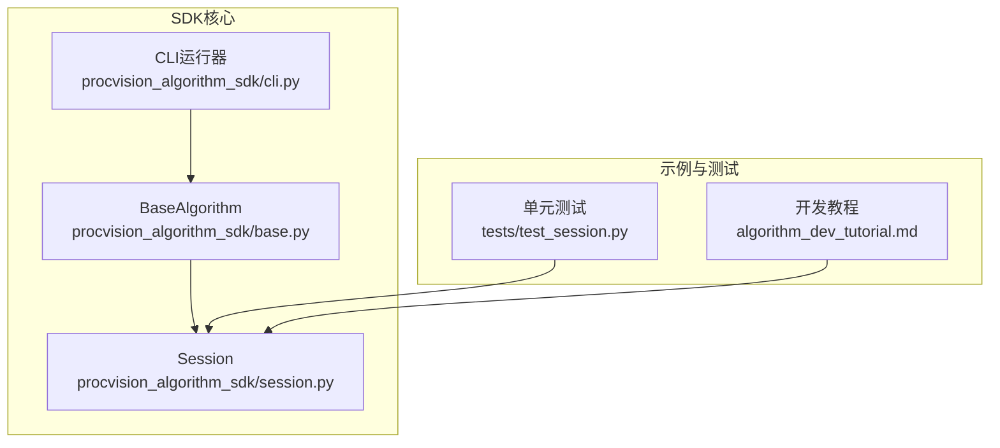
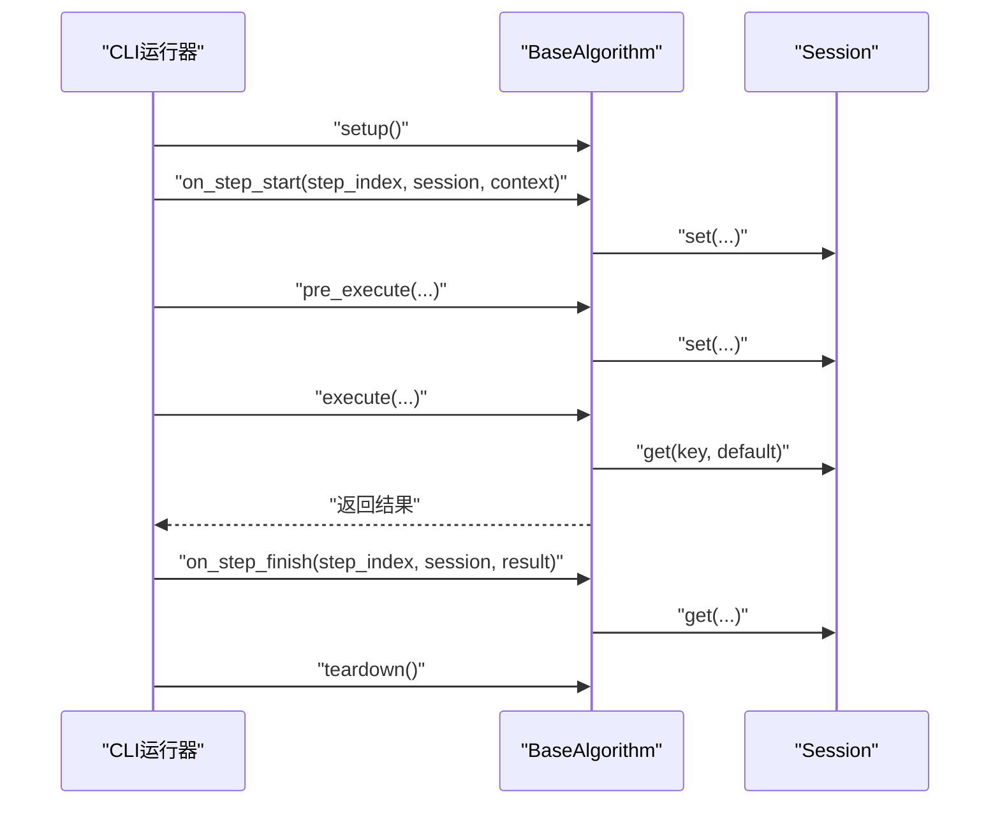
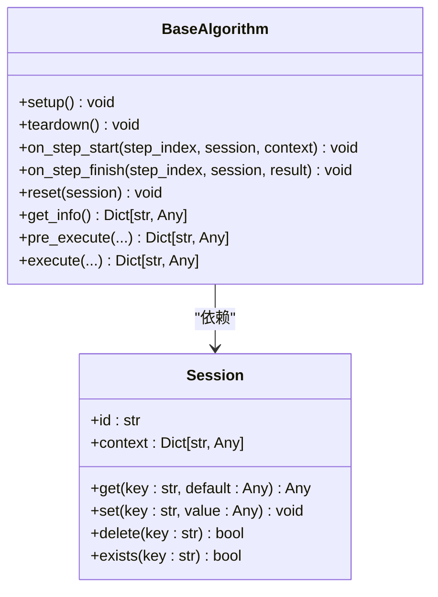
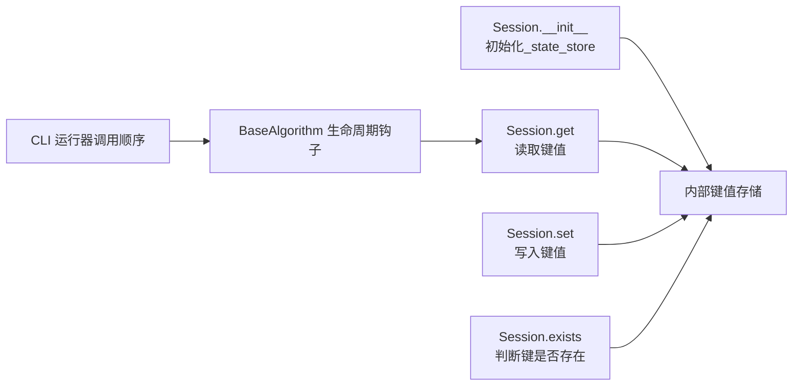

# 获取状态 (get)

<cite>
**本文引用的文件**
- [session.py](file://procvision_algorithm_sdk/session.py)
- [base.py](file://procvision_algorithm_sdk/base.py)
- [cli.py](file://procvision_algorithm_sdk/cli.py)
- [test_session.py](file://tests/test_session.py)
- [algorithm_dev_tutorial.md](file://algorithm_dev_tutorial.md)
</cite>

## 目录
1. [简介](#简介)
2. [项目结构](#项目结构)
3. [核心组件](#核心组件)
4. [架构概览](#架构概览)
5. [详细组件分析](#详细组件分析)
6. [依赖分析](#依赖分析)
7. [性能考虑](#性能考虑)
8. [故障排查指南](#故障排查指南)
9. [结论](#结论)
10. [附录](#附录)

## 简介
本篇文档聚焦于 Session.get 方法的 API 说明与使用指导。该方法用于从会话的内部键值存储中检索指定键对应的值，若键不存在则返回默认值，从而避免 KeyError 异常。其行为与 Python 字典的 get 方法一致，便于算法开发者以熟悉的语义进行状态读取。

此外，文档还提供在 execute 方法中使用 session.get('previous_result', None) 获取 pre_execute 阶段存储的中间结果的典型用例，并举例说明 default 参数在处理可选配置或初始化状态时的实用性，例如 session.get('threshold', 0.5)。

## 项目结构
围绕 Session.get 的相关代码与示例分布如下：
- 会话与状态存储：procvision_algorithm_sdk/session.py
- 算法生命周期与调用链：procvision_algorithm_sdk/base.py
- CLI 运行器对生命周期的调用顺序：procvision_algorithm_sdk/cli.py
- 单元测试覆盖 KV 操作与序列化约束：tests/test_session.py
- 教程与示例中对 Session 的使用说明：algorithm_dev_tutorial.md

图表来源
- [session.py](file://procvision_algorithm_sdk/session.py#L1-L36)
- [base.py](file://procvision_algorithm_sdk/base.py#L1-L58)
- [cli.py](file://procvision_algorithm_sdk/cli.py#L192-L225)
- [test_session.py](file://tests/test_session.py#L1-L24)
- [algorithm_dev_tutorial.md](file://algorithm_dev_tutorial.md#L96-L101)

章节来源
- [session.py](file://procvision_algorithm_sdk/session.py#L1-L36)
- [base.py](file://procvision_algorithm_sdk/base.py#L1-L58)
- [cli.py](file://procvision_algorithm_sdk/cli.py#L192-L225)
- [test_session.py](file://tests/test_session.py#L1-L24)
- [algorithm_dev_tutorial.md](file://algorithm_dev_tutorial.md#L96-L101)

## 核心组件
- Session 类提供会话级键值存储与只读上下文，其中 get 方法即为本次文档关注的 API。
- BaseAlgorithm 定义了算法生命周期钩子与 execute/pre_execute 等抽象方法，CLI 运行器按固定顺序调用这些方法，形成“pre_execute → execute”的状态流转。
- 单元测试验证了 KV 存取与 JSON 序列化约束，间接体现了 get 的使用方式与预期行为。

章节来源
- [session.py](file://procvision_algorithm_sdk/session.py#L1-L36)
- [base.py](file://procvision_algorithm_sdk/base.py#L17-L58)
- [cli.py](file://procvision_algorithm_sdk/cli.py#L192-L225)
- [test_session.py](file://tests/test_session.py#L1-L24)

## 架构概览
Session.get 在算法生命周期中的典型使用路径如下：
- 在 on_step_start 中设置中间状态（如计时戳）
- 在 pre_execute 中进行准备并可能写入中间结果
- 在 execute 中通过 session.get 读取中间状态或可选配置
- 在 on_step_finish 中读取并汇总诊断指标

图表来源
- [cli.py](file://procvision_algorithm_sdk/cli.py#L192-L225)
- [base.py](file://procvision_algorithm_sdk/base.py#L17-L58)
- [session.py](file://procvision_algorithm_sdk/session.py#L1-L36)

## 详细组件分析

### Session.get 方法 API 说明
- 方法签名与语义
  - get(self, key: str, default: Any = None) -> Any
  - 作用：从内部键值存储中检索指定键的值；若键不存在，则返回 default。
  - 行为：与 Python 字典的 get 一致，避免 KeyError。
- 数据存储与约束
  - 内部使用字典作为键值存储，键为字符串，值为任意类型。
  - set 值必须可 JSON 序列化，否则抛出类型错误；这保证了 get 返回的值在跨步骤/跨阶段传递时具备稳定的数据形态。
- 与 Python 字典 get 的一致性
  - 语义一致：键不存在时返回默认值，不会抛出异常。
  - 适用场景一致：用于安全地读取可选配置或中间状态。

章节来源
- [session.py](file://procvision_algorithm_sdk/session.py#L1-L36)
- [test_session.py](file://tests/test_session.py#L1-L24)

### 典型用例：在 execute 中读取 pre_execute 阶段的中间结果
- 场景描述
  - 在 pre_execute 中完成准备工作并将中间结果写入 session（例如 calibration_rects、阈值推导结果等）。
  - 在 execute 中通过 session.get('previous_result', None) 安全读取该中间结果，避免因键缺失导致异常。
- 代码片段路径
  - [Session.get](file://procvision_algorithm_sdk/session.py#L19-L21)
  - [CLI 生命周期调用顺序](file://procvision_algorithm_sdk/cli.py#L192-L225)

章节来源
- [session.py](file://procvision_algorithm_sdk/session.py#L19-L21)
- [cli.py](file://procvision_algorithm_sdk/cli.py#L192-L225)

### 典型用例：使用 default 参数处理可选配置或初始化状态
- 场景描述
  - 用户参数中可能未提供某些可选配置，此时通过 default 提供合理的默认值，确保算法在不同部署环境下都能稳定运行。
  - 示例：session.get('threshold', 0.5) 为阈值提供默认值。
- 代码片段路径
  - [Session.get](file://procvision_algorithm_sdk/session.py#L19-L21)
  - [教程中对 Session 的使用说明](file://algorithm_dev_tutorial.md#L96-L101)

章节来源
- [session.py](file://procvision_algorithm_sdk/session.py#L19-L21)
- [algorithm_dev_tutorial.md](file://algorithm_dev_tutorial.md#L96-L101)

### 与 Python 字典 get 的一致性与差异
- 一致性
  - 语义一致：键不存在返回默认值，避免 KeyError。
  - 适用场景一致：读取可选值或中间状态。
- 差异
  - 存储介质：Session.get 从会话内部字典读取；Python 字典 get 从字典对象读取。
  - 序列化约束：Session.set 要求值可 JSON 序列化，这在跨步骤/跨阶段传递时提供了更强的一致性保障。

章节来源
- [session.py](file://procvision_algorithm_sdk/session.py#L1-L36)

### 类关系与依赖

图表来源
- [session.py](file://procvision_algorithm_sdk/session.py#L1-L36)
- [base.py](file://procvision_algorithm_sdk/base.py#L1-L58)

## 依赖分析
- Session.get 依赖于 Session._state_store 字典存储，该存储在 Session.__init__ 中初始化。
- BaseAlgorithm 在生命周期钩子中通过 session.get 读取状态，CLI 运行器按固定顺序调用这些钩子，形成稳定的控制流。
- 单元测试覆盖了 KV 存取与 JSON 序列化约束，确保 get 的行为与预期一致。

图表来源
- [session.py](file://procvision_algorithm_sdk/session.py#L1-L36)
- [base.py](file://procvision_algorithm_sdk/base.py#L17-L58)
- [cli.py](file://procvision_algorithm_sdk/cli.py#L192-L225)

章节来源
- [session.py](file://procvision_algorithm_sdk/session.py#L1-L36)
- [base.py](file://procvision_algorithm_sdk/base.py#L17-L58)
- [cli.py](file://procvision_algorithm_sdk/cli.py#L192-L225)

## 性能考虑
- get 操作的时间复杂度为 O(1)，适用于高频读取场景。
- 由于 set 值需可 JSON 序列化，建议避免在 session 中存储大型不可序列化对象，以减少序列化开销与潜在的传输/持久化成本。
- 在 execute 中频繁读取同一键时，可考虑在局部变量中缓存结果，降低多次访问的开销。

## 故障排查指南
- 键不存在
  - 现象：get 返回 default，不会抛出异常。
  - 处理：确认键是否在 pre_execute 或 on_step_start 中正确 set；检查键名拼写与大小写。
- 值类型不符合预期
  - 现象：get 返回的值类型与预期不符（例如期望整数却得到字符串）。
  - 处理：在 set 时确保值类型正确；在 get 后进行必要的类型转换或校验。
- JSON 序列化错误
  - 现象：set 时抛出类型错误，提示值必须是 JSON 可序列化的。
  - 处理：将值转换为可 JSON 序列化的类型（如 dict/list/基本类型）；避免使用集合、自定义类等不可序列化对象。
- 生命周期顺序问题
  - 现象：execute 中读取不到 pre_execute 设置的状态。
  - 处理：确认 CLI 运行器的调用顺序（setup → on_step_start → pre_execute → execute → on_step_finish → teardown）；确保在 pre_execute 中已 set，在 execute 中才 get。

章节来源
- [test_session.py](file://tests/test_session.py#L1-L24)
- [session.py](file://procvision_algorithm_sdk/session.py#L1-L36)
- [cli.py](file://procvision_algorithm_sdk/cli.py#L192-L225)

## 结论
Session.get 提供了与 Python 字典 get 一致的安全读取能力，适合在算法生命周期中读取中间状态与可选配置。通过 default 参数，开发者可以优雅地处理键缺失的情况，避免异常并提升健壮性。结合 CLI 的生命周期调用顺序，可以在 pre_execute 中写入中间结果，在 execute 中安全读取，从而实现稳定的跨阶段状态共享。

## 附录
- 代码片段路径
  - [Session.get](file://procvision_algorithm_sdk/session.py#L19-L21)
  - [CLI 生命周期调用顺序](file://procvision_algorithm_sdk/cli.py#L192-L225)
  - [教程中对 Session 的使用说明](file://algorithm_dev_tutorial.md#L96-L101)
  - [单元测试覆盖 KV 操作与序列化约束](file://tests/test_session.py#L1-L24)