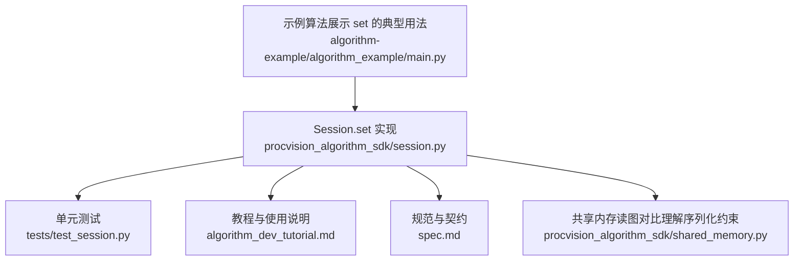
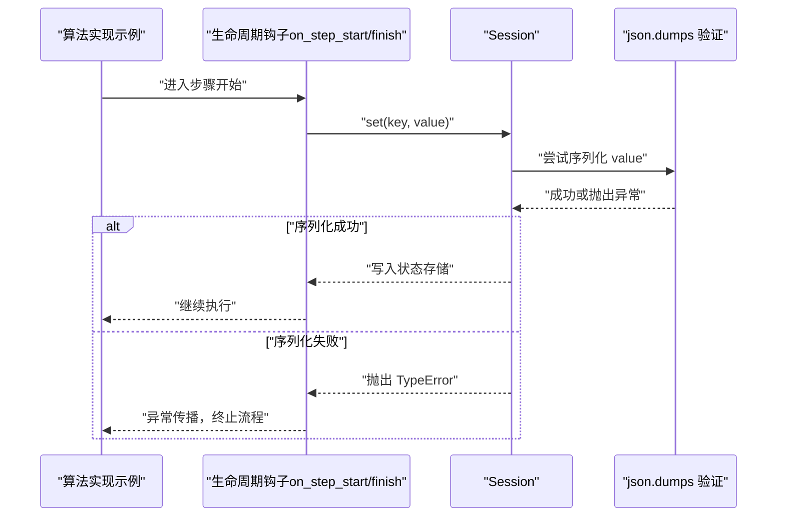
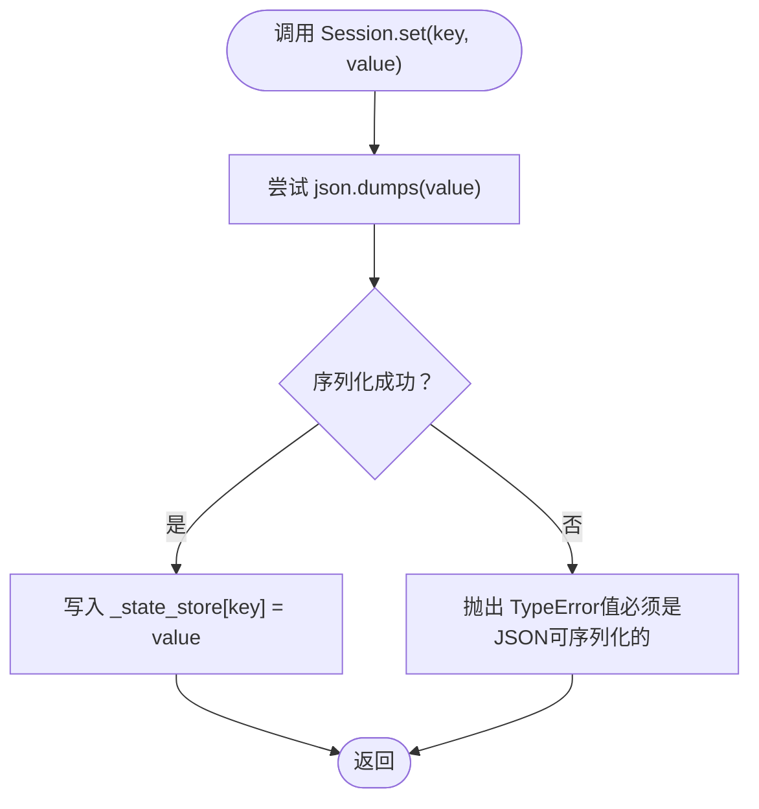
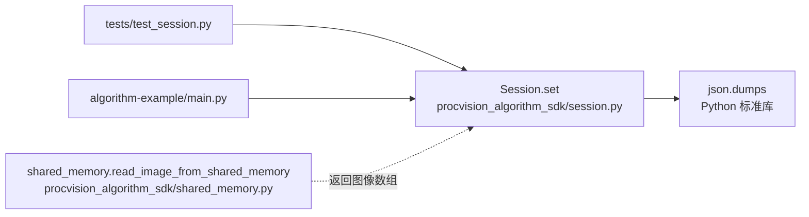

# 设置状态（set）

<cite>
**本文引用的文件列表**
- [session.py](file://procvision_algorithm_sdk/session.py)
- [test_session.py](file://tests/test_session.py)
- [algorithm_dev_tutorial.md](file://algorithm_dev_tutorial.md)
- [spec.md](file://spec.md)
- [shared_memory.py](file://procvision_algorithm_sdk/shared_memory.py)
- [main.py](file://algorithm-example/algorithm_example/main.py)
</cite>

## 目录
1. [简介](#简介)
2. [项目结构](#项目结构)
3. [核心组件](#核心组件)
4. [架构概览](#架构概览)
5. [详细组件分析](#详细组件分析)
6. [依赖关系分析](#依赖关系分析)
7. [性能考量](#性能考量)
8. [故障排查指南](#故障排查指南)
9. [结论](#结论)
10. [附录](#附录)

## 简介
本章节聚焦于 Session.set 方法，系统阐述其将键值对存入会话状态存储的核心功能，并重点强调关键约束：value 必须是 JSON 可序列化的对象。内部通过 json.dumps 进行序列化验证，若失败则抛出 TypeError 异常，从而确保状态能在不同进程或重启后持久化。文档还列举了支持与禁止的数据类型，并提供将模型预测结果（如字典形式的检测框坐标）存储到 session.set('detections', result_dict) 的示例与反例，指导开发者应存储图像路径或特征向量而非原始图像数据。

## 项目结构
围绕 Session.set 的相关文件与职责如下：
- 会话与状态存储：procvision_algorithm_sdk/session.py
- 单元测试：tests/test_session.py
- 教程与使用说明：algorithm_dev_tutorial.md
- 规范与契约：spec.md
- 共享内存读图（与 set 的数据持久化约束相关）：procvision_algorithm_sdk/shared_memory.py
- 示例算法（展示 set 的典型用法）：algorithm-example/algorithm_example/main.py

图表来源
- [session.py](file://procvision_algorithm_sdk/session.py#L1-L36)
- [test_session.py](file://tests/test_session.py#L1-L24)
- [algorithm_dev_tutorial.md](file://algorithm_dev_tutorial.md#L96-L101)
- [spec.md](file://spec.md#L408-L485)
- [shared_memory.py](file://procvision_algorithm_sdk/shared_memory.py#L1-L52)
- [main.py](file://algorithm-example/algorithm_example/main.py#L1-L150)

章节来源
- [session.py](file://procvision_algorithm_sdk/session.py#L1-L36)
- [test_session.py](file://tests/test_session.py#L1-L24)
- [algorithm_dev_tutorial.md](file://algorithm_dev_tutorial.md#L96-L101)
- [spec.md](file://spec.md#L408-L485)
- [shared_memory.py](file://procvision_algorithm_sdk/shared_memory.py#L1-L52)
- [main.py](file://algorithm-example/algorithm_example/main.py#L1-L150)

## 核心组件
- Session.set：将键值对存入会话状态存储，内部通过 json.dumps 验证 value 的 JSON 可序列化性，失败则抛出 TypeError。
- Session.get / delete / exists：配套的键值存取与存在性判断，支撑跨步骤的状态共享。
- 测试用例：验证 set 的基本行为与非序列化对象的异常抛出。
- 教程与规范：明确 set 的约束与使用方式，作为开发者的权威参考。

章节来源
- [session.py](file://procvision_algorithm_sdk/session.py#L1-L36)
- [test_session.py](file://tests/test_session.py#L1-L24)
- [algorithm_dev_tutorial.md](file://algorithm_dev_tutorial.md#L96-L101)
- [spec.md](file://spec.md#L408-L485)

## 架构概览
Session.set 在算法生命周期钩子中被广泛使用，用于在步骤间传递轻量级数据。由于 set 内部强制 JSON 可序列化，因此它适合存放结构化数据（如字典、列表、字符串、整数、浮点数、布尔值），而不适合存放二进制或复杂对象（如 numpy.ndarray、自定义类实例、文件句柄等）。

图表来源
- [session.py](file://procvision_algorithm_sdk/session.py#L1-L36)
- [main.py](file://algorithm-example/algorithm_example/main.py#L1-L150)

## 详细组件分析

### Session.set 方法详解
- 功能概述
  - 将键值对存入会话状态存储，键为字符串，值为任意类型。
  - 内部通过 json.dumps 对 value 进行序列化验证，确保值可被 JSON 编码。
  - 若验证失败，抛出 TypeError，错误信息包含值的类型信息。
- 数据类型约束
  - 支持类型：dict、list、str、int、float、bool。
  - 禁止类型：numpy.ndarray、自定义类实例、文件句柄等不可 JSON 序列化的对象。
- 典型用法
  - 将模型预测结果（如字典形式的检测框坐标）存储到 session.set('detections', result_dict)。
  - 将中间态指标（如时间戳、阈值、计数器）存储到 session 中，供后续步骤使用。
- 反例与规避
  - 传递 OpenCV 图像（np.ndarray）会导致序列化失败，应改为存储图像路径或特征向量。
  - 传递文件句柄、自定义类实例也会导致序列化失败。

图表来源
- [session.py](file://procvision_algorithm_sdk/session.py#L1-L36)
- [test_session.py](file://tests/test_session.py#L1-L24)

章节来源
- [session.py](file://procvision_algorithm_sdk/session.py#L1-L36)
- [test_session.py](file://tests/test_session.py#L1-L24)
- [algorithm_dev_tutorial.md](file://algorithm_dev_tutorial.md#L96-L101)
- [spec.md](file://spec.md#L408-L485)

### 支持与禁止的数据类型
- 支持类型
  - dict：键为字符串，值为支持类型。
  - list：元素为支持类型。
  - str、int、float、bool：基础类型。
- 禁止类型
  - numpy.ndarray：无法直接 JSON 序列化。
  - 自定义类实例：除非显式实现可 JSON 序列化的接口，否则不可序列化。
  - 文件句柄：不可序列化。
- 依据
  - 教程与规范均明确指出 set 的值必须是 JSON 可序列化的，否则抛出 TypeError。

章节来源
- [algorithm_dev_tutorial.md](file://algorithm_dev_tutorial.md#L96-L101)
- [spec.md](file://spec.md#L408-L485)

### 将模型预测结果存储到 Session
- 场景
  - 将检测框坐标等结构化结果存储到 session.set('detections', result_dict)，以便后续步骤读取。
- 示例参考
  - 示例算法在 on_step_start 中设置时间戳，在 on_step_finish 中读取并发布诊断指标，展示了 session.set 的典型用法。
- 注意事项
  - 不要直接存储图像数组或图像对象，应存储图像路径或特征向量等可序列化数据。

章节来源
- [main.py](file://algorithm-example/algorithm_example/main.py#L1-L150)

### 反例：传递非序列化对象（如 OpenCV 图像）
- 现象
  - 当调用 session.set('image', img_ndarray) 且 img_ndarray 为 numpy.ndarray 时，会触发 TypeError。
- 处理建议
  - 存储图像路径或特征向量，而非原始图像数据。
  - 如需跨模块传递图像，优先使用共享内存接口读取图像，或在上层平台以 JSON 可序列化的方式传递元数据。

章节来源
- [test_session.py](file://tests/test_session.py#L1-L24)
- [shared_memory.py](file://procvision_algorithm_sdk/shared_memory.py#L1-L52)

## 依赖关系分析
- Session.set 依赖 json.dumps 进行序列化验证。
- 测试用例依赖 Session.set 的行为，验证 set 的基本功能与异常路径。
- 示例算法依赖 Session.set 在生命周期钩子中进行状态共享。
- 共享内存模块与 set 的约束形成对比：共享内存读图返回图像数组，但 set 要求 JSON 可序列化，因此不能直接将图像数组存入 session。

图表来源
- [session.py](file://procvision_algorithm_sdk/session.py#L1-L36)
- [test_session.py](file://tests/test_session.py#L1-L24)
- [main.py](file://algorithm-example/algorithm_example/main.py#L1-L150)
- [shared_memory.py](file://procvision_algorithm_sdk/shared_memory.py#L1-L52)

章节来源
- [session.py](file://procvision_algorithm_sdk/session.py#L1-L36)
- [test_session.py](file://tests/test_session.py#L1-L24)
- [main.py](file://algorithm-example/algorithm_example/main.py#L1-L150)
- [shared_memory.py](file://procvision_algorithm_sdk/shared_memory.py#L1-L52)

## 性能考量
- 序列化开销
  - json.dumps 的调用带来一次序列化成本，通常较小，但在高频写入场景下应避免存储大型不可序列化对象。
- 数据体积
  - 仅存储必要的结构化数据，避免在 session 中保存大体量的二进制数据。
- 可维护性
  - 将图像或大对象的路径/元数据存入 session，减少内存占用与序列化负担。

## 故障排查指南
- 常见错误
  - TypeError：值必须是 JSON 可序列化的。检查传入的 value 是否为 dict、list、str、int、float、bool。
- 排查步骤
  - 确认 value 的类型是否在支持列表中。
  - 若 value 为 numpy.ndarray 或自定义类实例，将其转换为可序列化形式（如列表、字典、路径或特征向量）。
  - 使用单元测试思路编写最小复现，定位具体类型问题。
- 参考测试
  - 测试用例验证了 set 的基本行为与非序列化对象的异常路径，可作为排错对照。

章节来源
- [test_session.py](file://tests/test_session.py#L1-L24)
- [session.py](file://procvision_algorithm_sdk/session.py#L1-L36)

## 结论
Session.set 是算法跨步骤共享轻量级结构化数据的关键接口。其严格的数据类型约束确保了状态的可持久化与跨进程兼容性。开发者应遵循 JSON 可序列化原则，优先存储字典、列表、字符串、整数、浮点数、布尔值等基础类型，避免将图像数组、文件句柄等不可序列化对象直接存入 session。对于图像数据，推荐存储路径或特征向量，以满足 set 的约束并提升系统的稳定性与可维护性。

## 附录
- 相关实现与规范
  - Session.set 的实现与约束：[session.py](file://procvision_algorithm_sdk/session.py#L1-L36)
  - 教程与规范中的 set 约束说明：[algorithm_dev_tutorial.md](file://algorithm_dev_tutorial.md#L96-L101)、[spec.md](file://spec.md#L408-L485)
  - 示例算法中 set 的典型用法：[main.py](file://algorithm-example/algorithm_example/main.py#L1-L150)
  - 共享内存读图（对比理解 set 的序列化约束）：[shared_memory.py](file://procvision_algorithm_sdk/shared_memory.py#L1-L52)