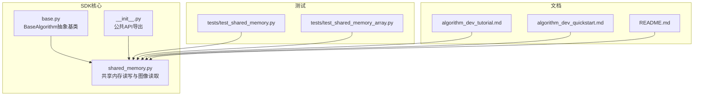
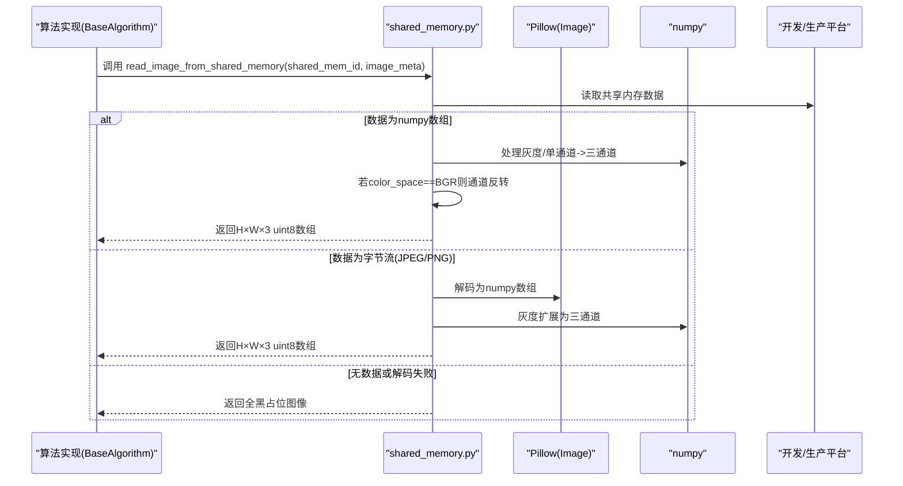
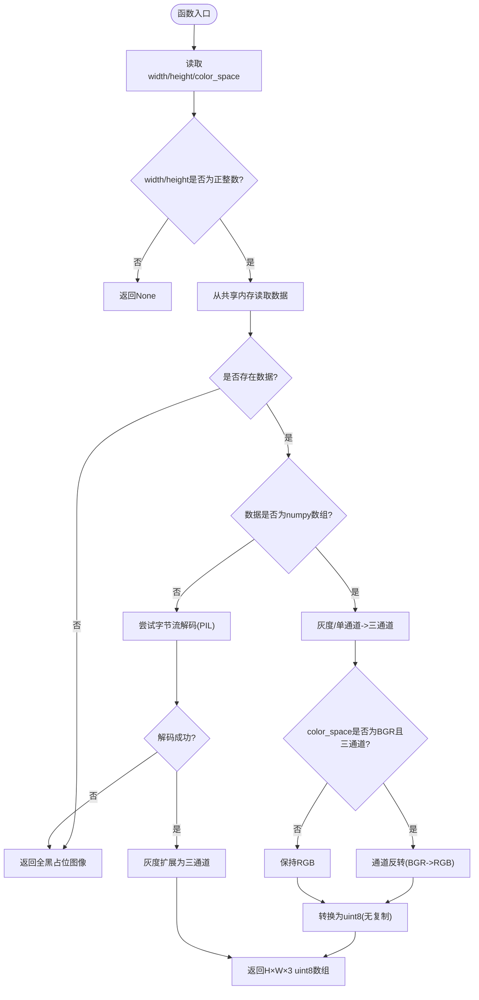
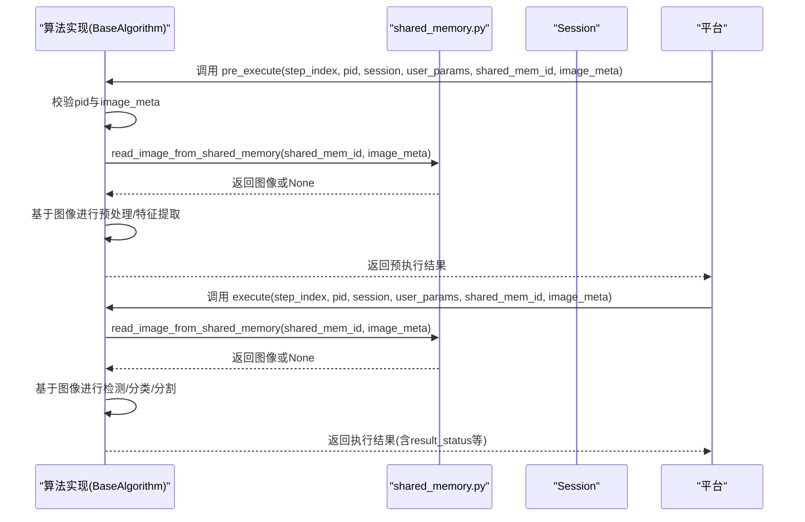
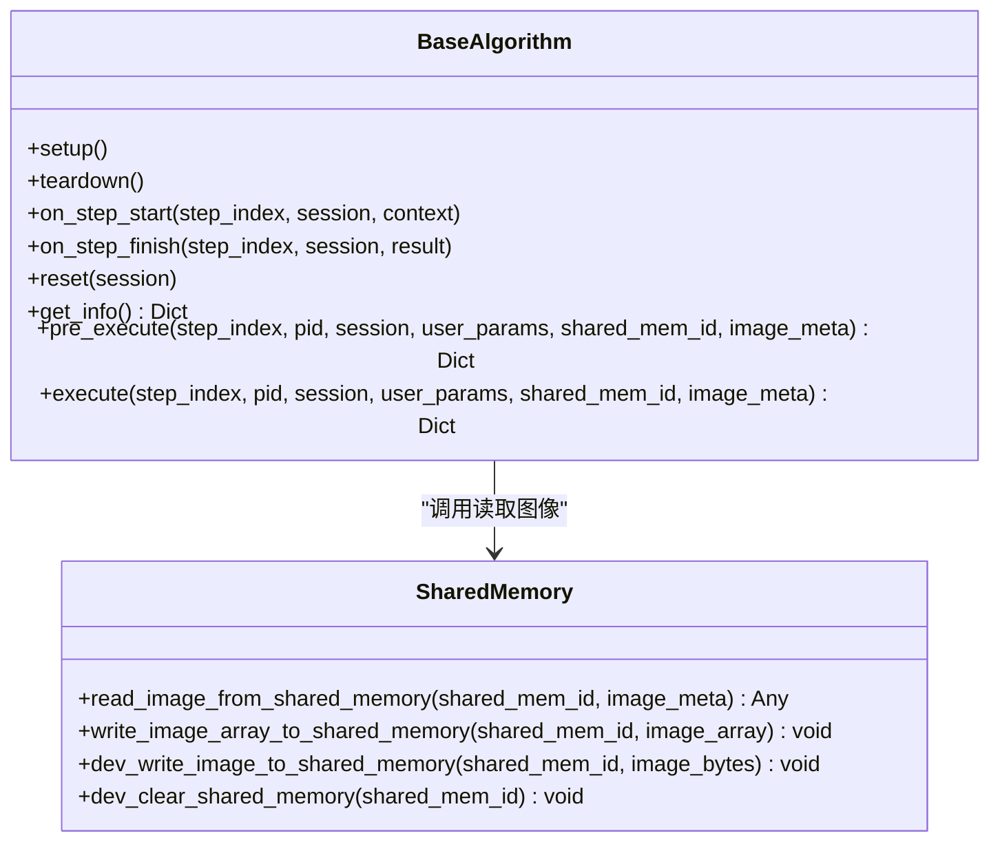
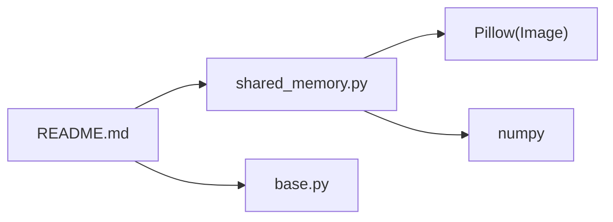

# 共享内存图像读取API

<cite>
**本文引用的文件**
- [shared_memory.py](file://procvision_algorithm_sdk/shared_memory.py)
- [base.py](file://procvision_algorithm_sdk/base.py)
- [__init__.py](file://procvision_algorithm_sdk/__init__.py)
- [test_shared_memory.py](file://tests/test_shared_memory.py)
- [test_shared_memory_array.py](file://tests/test_shared_memory_array.py)
- [algorithm_dev_tutorial.md](file://algorithm_dev_tutorial.md)
- [algorithm_dev_quickstart.md](file://algorithm_dev_quickstart.md)
- [README.md](file://README.md)
</cite>

## 目录
1. [简介](#简介)
2. [项目结构](#项目结构)
3. [核心组件](#核心组件)
4. [架构概览](#架构概览)
5. [详细组件分析](#详细组件分析)
6. [依赖关系分析](#依赖关系分析)
7. [性能考量](#性能考量)
8. [故障排查指南](#故障排查指南)
9. [结论](#结论)
10. [附录](#附录)

## 简介
本文件为工业视觉平台算法SDK中的 read_image_from_shared_memory 函数提供权威API文档。该函数是平台与算法之间高效图像数据传输的关键桥梁：通过共享内存ID（shared_mem_id）与图像元数据（image_meta）从共享内存区域读取图像数据。它支持两种数据源：
- 开发模式下的字节数组（如JPEG/PNG），通过PIL解码为H×W×3的uint8数组；
- 生产模式下的numpy数组（uint8，形状(H,W,3)或灰度(H,W)/(H,W,1)，自动扩展为三通道）。

函数还负责将BGR色彩空间（如OpenCV格式）自动转换为RGB，并在数据不存在或解码失败时返回全黑占位图像，确保算法鲁棒性。

## 项目结构
SDK采用模块化组织，核心API集中在 procvision_algorithm_sdk 包中：
- shared_memory.py：共享内存读写与图像读取实现
- base.py：BaseAlgorithm抽象基类，定义算法生命周期钩子与预执行/执行接口
- __init__.py：对外导出的公共API集合
- tests：单元测试覆盖共享内存读取、数组形态与颜色空间转换等场景
- 文档：algorithm_dev_tutorial.md、algorithm_dev_quickstart.md、README.md

图表来源
- [shared_memory.py](file://procvision_algorithm_sdk/shared_memory.py#L1-L53)
- [base.py](file://procvision_algorithm_sdk/base.py#L1-L58)
- [__init__.py](file://procvision_algorithm_sdk/__init__.py#L1-L19)
- [test_shared_memory.py](file://tests/test_shared_memory.py#L1-L16)
- [test_shared_memory_array.py](file://tests/test_shared_memory_array.py#L1-L39)
- [algorithm_dev_tutorial.md](file://algorithm_dev_tutorial.md#L1-L348)
- [algorithm_dev_quickstart.md](file://algorithm_dev_quickstart.md#L1-L269)
- [README.md](file://README.md#L1-L116)

章节来源
- [shared_memory.py](file://procvision_algorithm_sdk/shared_memory.py#L1-L53)
- [base.py](file://procvision_algorithm_sdk/base.py#L1-L58)
- [__init__.py](file://procvision_algorithm_sdk/__init__.py#L1-L19)
- [test_shared_memory.py](file://tests/test_shared_memory.py#L1-L16)
- [test_shared_memory_array.py](file://tests/test_shared_memory_array.py#L1-L39)
- [algorithm_dev_tutorial.md](file://algorithm_dev_tutorial.md#L1-L348)
- [algorithm_dev_quickstart.md](file://algorithm_dev_quickstart.md#L1-L269)
- [README.md](file://README.md#L1-L116)

## 核心组件
- read_image_from_shared_memory(shared_mem_id: str, image_meta: Dict[str, Any]) -> Any
  - 功能：根据共享内存ID与图像元数据读取图像，返回H×W×3的uint8数组
  - 数据源兼容：字节数组（JPEG/PNG）与numpy数组（H×W×3或灰度H×W、H×W×1）
  - 形态与颜色空间处理：灰度自动扩展为三通道；BGR自动转换为RGB
  - 容错：当image_meta不合法或读取失败时返回全黑占位图像
- BaseAlgorithm接口
  - 在pre_execute与execute中接收shared_mem_id与image_meta，并调用read_image_from_shared_memory
- 公共API导出
  - 通过__init__.py导出read_image_from_shared_memory等常用API

章节来源
- [shared_memory.py](file://procvision_algorithm_sdk/shared_memory.py#L15-L52)
- [base.py](file://procvision_algorithm_sdk/base.py#L21-L58)
- [__init__.py](file://procvision_algorithm_sdk/__init__.py#L1-L19)

## 架构概览
read_image_from_shared_memory在SDK中的角色与调用链如下：

图表来源
- [shared_memory.py](file://procvision_algorithm_sdk/shared_memory.py#L15-L52)
- [base.py](file://procvision_algorithm_sdk/base.py#L21-L58)

## 详细组件分析

### 函数：read_image_from_shared_memory
- 输入参数
  - shared_mem_id: str，共享内存标识
  - image_meta: Dict[str, Any]，图像元数据，至少包含width、height、timestamp_ms、camera_id；可选color_space∈{RGB,BGR}
- 返回值
  - H×W×3的uint8数组；若image_meta不合法或读取失败，返回全黑占位图像
- 双重读取逻辑
  - 优先尝试直接获取numpy数组（开发模式下的模拟）
  - 否则尝试获取字节流并使用PIL进行JPEG/PNG解码（生产环境）
- 形态与颜色空间处理
  - 灰度图与单通道：自动扩展为三通道
  - BGR到RGB：当color_space为BGR且为三通道时自动转换
- 容错设计
  - 当image_meta.width或image_meta.height非正时，返回None
  - 当共享内存无数据或解码失败时，返回全黑占位图像

图表来源
- [shared_memory.py](file://procvision_algorithm_sdk/shared_memory.py#L15-L52)

章节来源
- [shared_memory.py](file://procvision_algorithm_sdk/shared_memory.py#L15-L52)
- [test_shared_memory.py](file://tests/test_shared_memory.py#L1-L16)
- [test_shared_memory_array.py](file://tests/test_shared_memory_array.py#L1-L39)
- [algorithm_dev_tutorial.md](file://algorithm_dev_tutorial.md#L103-L127)
- [algorithm_dev_quickstart.md](file://algorithm_dev_quickstart.md#L89-L120)

### BaseAlgorithm中调用示例
- 在pre_execute或execute中调用read_image_from_shared_memory，通常紧随参数校验之后
- 典型流程：校验pid与image_meta合法性→读取图像→执行算法→返回结果

图表来源
- [base.py](file://procvision_algorithm_sdk/base.py#L21-L58)
- [shared_memory.py](file://procvision_algorithm_sdk/shared_memory.py#L15-L52)
- [algorithm_dev_quickstart.md](file://algorithm_dev_quickstart.md#L122-L199)

章节来源
- [base.py](file://procvision_algorithm_sdk/base.py#L21-L58)
- [algorithm_dev_quickstart.md](file://algorithm_dev_quickstart.md#L122-L199)

### 类关系与依赖
- BaseAlgorithm定义了算法生命周期与接口，算法实现通过调用shared_memory中的read_image_from_shared_memory获取图像
- __init__.py导出read_image_from_shared_memory等API，便于算法直接导入

图表来源
- [base.py](file://procvision_algorithm_sdk/base.py#L1-L58)
- [shared_memory.py](file://procvision_algorithm_sdk/shared_memory.py#L1-L53)
- [__init__.py](file://procvision_algorithm_sdk/__init__.py#L1-L19)

章节来源
- [base.py](file://procvision_algorithm_sdk/base.py#L1-L58)
- [shared_memory.py](file://procvision_algorithm_sdk/shared_memory.py#L1-L53)
- [__init__.py](file://procvision_algorithm_sdk/__init__.py#L1-L19)

## 依赖关系分析
- Pillow（PIL）：用于字节流解码（JPEG/PNG）
- numpy：用于数组处理（灰度扩展、BGR→RGB、类型转换）
- 依赖约束
  - README明确共享内存传图为JPEG-only
  - image_meta最小集合：width/height/timestamp_ms/camera_id；可选color_space∈{RGB,BGR}

图表来源
- [shared_memory.py](file://procvision_algorithm_sdk/shared_memory.py#L15-L52)
- [README.md](file://README.md#L1-L116)

章节来源
- [shared_memory.py](file://procvision_algorithm_sdk/shared_memory.py#L15-L52)
- [README.md](file://README.md#L1-L116)

## 性能考量
- 共享内存避免了大数据的复制开销：生产环境直接读取numpy数组，无需额外拷贝
- 开发模式下通过字节数组解码，仍避免了进程间频繁I/O
- 形态与颜色空间处理均为原地或轻量操作，尽量减少内存分配

章节来源
- [algorithm_dev_tutorial.md](file://algorithm_dev_tutorial.md#L103-L127)
- [algorithm_dev_quickstart.md](file://algorithm_dev_quickstart.md#L89-L120)

## 故障排查指南
- 返回全黑图像的常见原因
  - shared_mem_id不正确或平台未成功写入图像
  - image_meta不合法（width/height非正）
  - 字节流不是JPEG/PNG或损坏
- 建议排查步骤
  - 确认shared_mem_id与平台侧约定一致
  - 确认平台已按约定写入图像（字节或数组）
  - 检查image_meta的width/height是否为正整数
  - 若为BGR，请在image_meta中设置color_space为BGR
  - 使用单元测试覆盖场景进行验证

章节来源
- [test_shared_memory.py](file://tests/test_shared_memory.py#L1-L16)
- [test_shared_memory_array.py](file://tests/test_shared_memory_array.py#L1-L39)
- [algorithm_dev_tutorial.md](file://algorithm_dev_tutorial.md#L103-L127)
- [algorithm_dev_quickstart.md](file://algorithm_dev_quickstart.md#L89-L120)

## 结论
read_image_from_shared_memory是SDK中连接平台与算法的核心接口，具备以下关键特性：
- 双重读取逻辑适配开发与生产环境
- 自动处理灰度与单通道扩展、BGR→RGB转换
- 容错设计确保在异常情况下返回全黑占位图像
- 与BaseAlgorithm生命周期钩子无缝集成，便于在pre_execute/execute中使用

## 附录
- API签名与行为
  - read_image_from_shared_memory(shared_mem_id: str, image_meta: Dict[str, Any]) -> Any
  - 数据源：字节流（JPEG/PNG）或numpy数组（H×W×3或灰度H×W、H×W×1）
  - 形态与颜色空间：灰度自动扩展为三通道；BGR自动转换为RGB
  - 容错：width/height非正返回None；无数据或解码失败返回全黑占位图像
- 在BaseAlgorithm中的典型调用位置
  - pre_execute与execute中紧随参数校验之后读取图像
- 依赖与限制
  - Pillow与numpy为必需依赖
  - 仅支持JPEG格式（README明确说明）

章节来源
- [shared_memory.py](file://procvision_algorithm_sdk/shared_memory.py#L15-L52)
- [base.py](file://procvision_algorithm_sdk/base.py#L21-L58)
- [README.md](file://README.md#L1-L116)
- [algorithm_dev_tutorial.md](file://algorithm_dev_tutorial.md#L103-L127)
- [algorithm_dev_quickstart.md](file://algorithm_dev_quickstart.md#L89-L120)