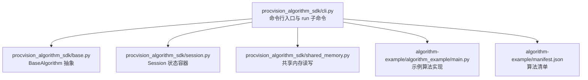
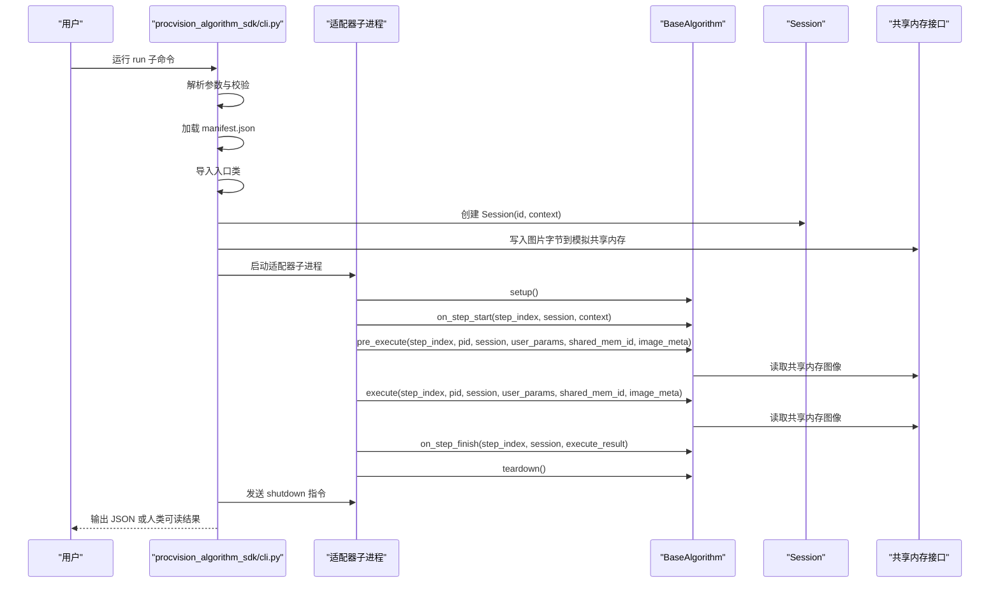
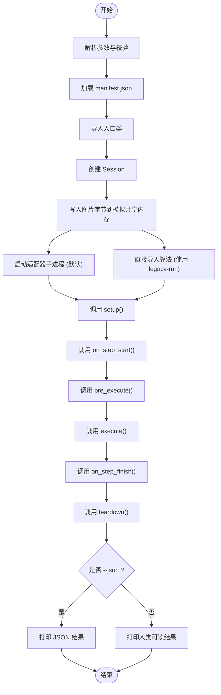
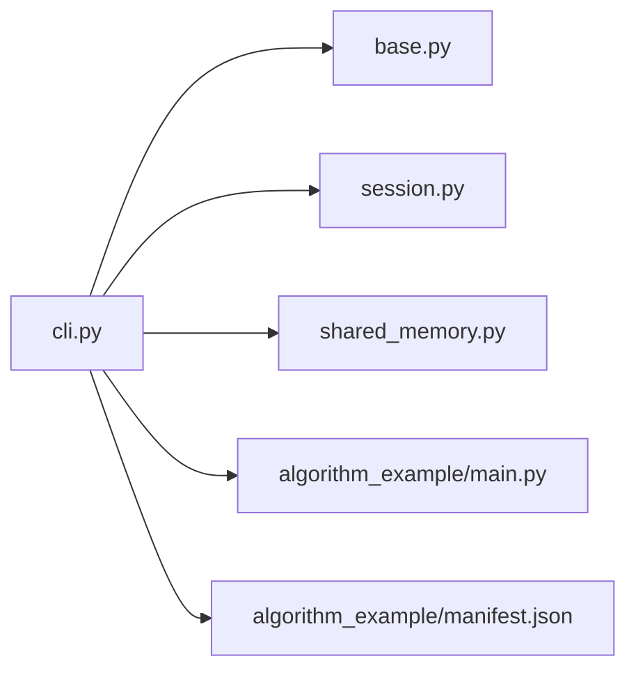
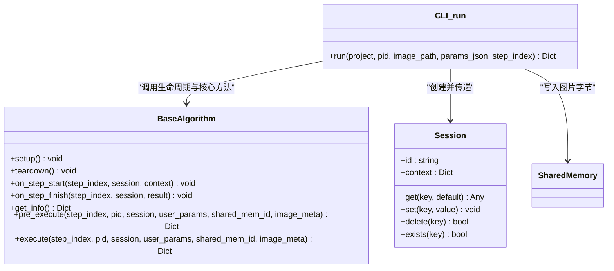

# run 命令

<cite>
**本文引用的文件**
- [cli.py](file://procvision_algorithm_sdk/cli.py)
- [session.py](file://procvision_algorithm_sdk/session.py)
- [base.py](file://procvision_algorithm_sdk/base.py)
- [shared_memory.py](file://procvision_algorithm_sdk/shared_memory.py)
- [algorithm_example/main.py](file://algorithm-example/algorithm_example/main.py)
- [algorithm_example/manifest.json](file://algorithm-example/manifest.json)
- [README.md](file://README.md)
- [algorithm_dev_tutorial.md](file://algorithm_dev_tutorial.md)
- [algorithm_dev_quickstart.md](file://algorithm_dev_quickstart.md)
- [test_cli.py](file://tests/test_cli.py)
- [runner_spec.md](file://runner_spec.md)
- [protocol_adapter_spec.md](file://protocol_adapter_spec.md)
</cite>

## 更新摘要
**变更内容**
- 在“详细组件分析”和“参数详解”部分新增了关于 `--legacy-run` 标志的说明。
- 更新了“架构总览”时序图，以反映适配器子进程模式作为默认执行方式。
- 在“开发调试中的作用”部分补充了关于 `--tail-logs` 标志的说明。
- 更新了“故障排查指南”，以包含与适配器模式相关的错误。

## 目录
1. [简介](#简介)
2. [项目结构](#项目结构)
3. [核心组件](#核心组件)
4. [架构总览](#架构总览)
5. [详细组件分析](#详细组件分析)
6. [依赖关系分析](#依赖关系分析)
7. [性能考量](#性能考量)
8. [故障排查指南](#故障排查指南)
9. [结论](#结论)
10. [附录](#附录)

## 简介
本文件面向算法开发者，系统化阐述 procvision-cli 的 run 命令：如何在本地模拟生产环境运行算法，包括从本地图片文件读取数据并写入模拟共享内存、加载算法入口类、创建 Session 对象并依次调用 pre_execute 和 execute 的完整流程。文档还详细说明参数含义（project、--pid、--image、--step、--params），解释内部如何构造测试上下文（image_meta）并捕获执行结果；提供使用示例与 JSON/人类可读两种输出格式的对比；最后给出在开发调试中的作用与性能/逻辑验证建议。

## 项目结构
- 命令行入口与子命令定义集中在 CLI 模块中，run 子命令负责本地模拟运行。
- 算法基类与生命周期钩子位于 base 模块，Session 提供状态与上下文容器。
- 共享内存读写接口位于 shared_memory 模块，Dev Runner 在本地将图片字节写入模拟共享内存。
- 示例算法与清单文件位于 algorithm-example，便于对照理解参数与返回结构。

图表来源
- [cli.py](file://procvision_algorithm_sdk/cli.py#L461-L584)
- [base.py](file://procvision_algorithm_sdk/base.py#L1-L58)
- [session.py](file://procvision_algorithm_sdk/session.py#L1-L36)
- [shared_memory.py](file://procvision_algorithm_sdk/shared_memory.py#L1-L53)
- [algorithm_example/main.py](file://algorithm-example/algorithm_example/main.py#L1-L150)
- [algorithm_example/manifest.json](file://algorithm-example/manifest.json#L1-L25)

章节来源
- [cli.py](file://procvision_algorithm_sdk/cli.py#L461-L584)
- [README.md](file://README.md#L1-L116)

## 核心组件
- run 子命令：解析参数、校验输入、加载 manifest、导入入口类、构造 Session、写入模拟共享内存、调用算法生命周期与核心方法、返回结果。
- BaseAlgorithm：定义 get_info、pre_execute、execute 与生命周期钩子，作为算法实现契约。
- Session：提供会话标识、上下文复制、键值状态存储（JSON 可序列化）。
- 共享内存接口：dev_write_image_to_shared_memory 将图片字节写入模拟共享内存；read_image_from_shared_memory 读取并兼容多种数据源与颜色空间。

章节来源
- [cli.py](file://procvision_algorithm_sdk/cli.py#L558-L584)
- [base.py](file://procvision_algorithm_sdk/base.py#L1-L58)
- [session.py](file://procvision_algorithm_sdk/session.py#L1-L36)
- [shared_memory.py](file://procvision_algorithm_sdk/shared_memory.py#L1-L53)

## 架构总览
下面的时序图展示了 run 命令从参数解析到最终输出的关键调用链路。自 v0.0.6 版本起，`run` 命令默认使用适配器子进程模式（`run_adapter`）执行，以更真实地模拟生产环境。开发者可通过 `--legacy-run` 标志回退到旧的直接导入模式。

图表来源
- [cli.py](file://procvision_algorithm_sdk/cli.py#L558-L584)
- [cli.py](file://procvision_algorithm_sdk/cli.py#L1-L120)
- [base.py](file://procvision_algorithm_sdk/base.py#L1-L58)
- [session.py](file://procvision_algorithm_sdk/session.py#L1-L36)
- [shared_memory.py](file://procvision_algorithm_sdk/shared_memory.py#L1-L53)
- [runner_spec.md](file://runner_spec.md#L1-L292)
- [protocol_adapter_spec.md](file://protocol_adapter_spec.md#L1-L184)

## 详细组件分析

### run 子命令工作流
- 参数解析与校验
  - 校验项目目录存在、manifest.json 存在、图片文件存在。
  - 校验 --params 是否为合法 JSON 字符串。
- 加载清单与入口类
  - 读取 manifest.json，解析 entry_point 并动态导入算法入口类。
- 构造 Session 与共享内存
  - 创建 Session，设置 product_code/operator/trace_id 等上下文。
  - 将本地图片字节写入模拟共享内存，ID 形如 dev-shm:<session_id>。
- 构造 image_meta
  - 从图片推断宽高（若无法打开则回退默认值），记录时间戳与相机标识。
- 生命周期与核心调用
  - 调用 setup/on_step_start/pre_execute/execute/on_step_finish/teardown。
  - 捕获并返回 pre_execute 与 execute 的结果字典。
- 输出
  - --json 输出 JSON；否则输出人类可读格式（包含 pre/status/message、execute/status/result_status 等）。

图表来源
- [cli.py](file://procvision_algorithm_sdk/cli.py#L558-L584)
- [cli.py](file://procvision_algorithm_sdk/cli.py#L1-L120)

章节来源
- [cli.py](file://procvision_algorithm_sdk/cli.py#L494-L513)
- [cli.py](file://procvision_algorithm_sdk/cli.py#L558-L584)
- [cli.py](file://procvision_algorithm_sdk/cli.py#L1-L120)

### 参数详解
- project（项目路径）
  - 算法项目根目录，需包含 manifest.json 与源码。
- --pid（产品型号）
  - 必填，必须出现在 manifest 的 supported_pids 中。
- --image（图像路径）
  - 必填，本地图片路径（JPEG/PNG），会被写入模拟共享内存。
- --step（步骤索引）
  - 默认 1，平台从 1 开始计数。
- --params（用户参数 JSON）
  - JSON 字符串形式的用户参数，例如 {"threshold":0.8}。
- --json
  - 以 JSON 输出结果，便于自动化处理与二次分析。
- --legacy-run
  - **新增说明**：使用旧的本地直接导入执行路径。默认情况下，`run` 命令使用 `run_adapter` 函数在子进程中通过协议适配器执行算法，以更真实地模拟生产环境。使用此标志可回退到旧的 `run` 函数，该函数直接在主进程中导入并调用算法类。此标志主要用于调试适配器本身或与旧版本兼容。
- --tail-logs
  - 在适配器模式下实时输出子进程日志。此标志仅在未使用 `--legacy-run` 时有效。

章节来源
- [cli.py](file://procvision_algorithm_sdk/cli.py#L494-L513)
- [cli.py](file://procvision_algorithm_sdk/cli.py#L558-L584)
- [runner_spec.md](file://runner_spec.md#L1-L292)
- [protocol_adapter_spec.md](file://protocol_adapter_spec.md#L1-L184)

### 内部上下文与数据流
- Session 上下文
  - 包含 product_code/operator/trace_id 等，用于算法侧记录与追踪。
- image_meta
  - 至少包含 width/height/timestamp_ms/camera_id；可选 color_space（RGB/BGR）。
  - 由 run 子命令根据图片推断宽高，若无法打开图片则回退默认宽高。
- 共享内存 ID
  - 形如 dev-shm:<session_id>，用于区分不同会话的图像数据。
- 生命周期钩子
  - setup/teardown：资源准备与释放。
  - on_step_start/on_step_finish：记录步长耗时等诊断信息。
  - pre_execute/execute：算法核心逻辑入口，返回约定格式的结果字典。

章节来源
- [session.py](file://procvision_algorithm_sdk/session.py#L1-L36)
- [shared_memory.py](file://procvision_algorithm_sdk/shared_memory.py#L1-L53)
- [cli.py](file://procvision_algorithm_sdk/cli.py#L1-L120)
- [README.md](file://README.md#L1-L116)

### 示例与输出格式对比
- 使用示例
  - procvision-cli run ./algorithm-example --pid p001 --image ./test.jpg --params '{"threshold":0.8}'
  - procvision-cli run ./algorithm-example --pid p001 --image ./test.jpg --legacy-run --params '{"threshold":0.8}' (使用旧模式)
- 输出格式
  - JSON：便于程序解析与自动化测试。
  - 人类可读：包含 pre_execute 的 status/message，execute 的 status/result_status，以及 NG 时的 ng_reason 与 defect_rects 数量等关键信息。

章节来源
- [cli.py](file://procvision_algorithm_sdk/cli.py#L461-L513)
- [cli.py](file://procvision_algorithm_sdk/cli.py#L558-L584)

### 开发调试中的作用
- 快速验证算法入口类与清单一致性（入口类继承 BaseAlgorithm、get_info 返回结构正确）。
- 本地模拟生产环境，验证 pre_execute/execute 的返回结构与业务语义（result_status/defect_rects/ng_reason 等）。
- 通过 --json 输出便于集成到 CI/CD 流水线，进行回归与性能回归测试。
- 结合 on_step_start/on_step_finish 记录的诊断数据，评估算法耗时与稳定性。
- **新增说明**：使用 `--tail-logs` 标志可以实时查看适配器子进程的日志输出，这对于调试算法内部逻辑和诊断通信问题非常有帮助。

章节来源
- [README.md](file://README.md#L1-L116)
- [algorithm_dev_tutorial.md](file://algorithm_dev_tutorial.md#L103-L127)
- [algorithm_dev_quickstart.md](file://algorithm_dev_quickstart.md#L89-L120)

## 依赖关系分析
- run 子命令依赖
  - CLI 模块：参数解析、校验、调用 run 函数。
  - BaseAlgorithm：算法契约与生命周期钩子。
  - Session：会话状态与上下文。
  - 共享内存接口：本地写入图片字节并被算法读取。
- 示例算法依赖
  - 示例算法实现位于 algorithm-example，展示如何使用共享内存读取图像、返回标准结果结构。

图表来源
- [cli.py](file://procvision_algorithm_sdk/cli.py#L461-L584)
- [base.py](file://procvision_algorithm_sdk/base.py#L1-L58)
- [session.py](file://procvision_algorithm_sdk/session.py#L1-L36)
- [shared_memory.py](file://procvision_algorithm_sdk/shared_memory.py#L1-L53)
- [algorithm_example/main.py](file://algorithm-example/algorithm_example/main.py#L1-L150)
- [algorithm_example/manifest.json](file://algorithm-example/manifest.json#L1-L25)

章节来源
- [cli.py](file://procvision_algorithm_sdk/cli.py#L461-L584)
- [base.py](file://procvision_algorithm_sdk/base.py#L1-L58)
- [session.py](file://procvision_algorithm_sdk/session.py#L1-L36)
- [shared_memory.py](file://procvision_algorithm_sdk/shared_memory.py#L1-L53)
- [algorithm_example/main.py](file://algorithm-example/algorithm_example/main.py#L1-L150)
- [algorithm_example/manifest.json](file://algorithm-example/manifest.json#L1-L25)

## 性能考量
- 图像读取与解码
  - 本地写入图片字节后，算法侧通过共享内存读取图像；若图片过大或解码失败，可能影响整体耗时。
- 步骤耗时统计
  - 建议在 on_step_start/on_step_finish 中记录耗时，结合诊断模块发布指标，辅助性能优化。
- JSON 输出与解析
  - --json 输出便于自动化处理，但需注意网络/磁盘 I/O 对吞吐的影响。

章节来源
- [algorithm_dev_tutorial.md](file://algorithm_dev_tutorial.md#L103-L127)
- [algorithm_dev_quickstart.md](file://algorithm_dev_quickstart.md#L89-L120)

## 故障排查指南
- 常见错误与提示
  - 项目目录不存在：检查 project 路径。
  - 未找到 manifest.json：确认项目根目录包含清单文件。
  - 图片文件不存在：检查 --image 路径。
  - --params 不是合法 JSON：修正为合法 JSON 字符串。
  - **新增说明**：如果在适配器模式下遇到问题，如“adapter hello missing”或“pre 超时”，请检查 `procvision_algorithm_sdk.adapter` 模块是否正确安装，并尝试使用 `--legacy-run` 标志排除适配器问题。
- 结果状态判断
  - run 命令根据 execute 的 status 判定退出码：status==OK 时退出码为 0，否则为非 0。
- 测试用例参考
  - 单元测试覆盖了 validate 与 run 的基本行为，可作为行为预期的参考。

章节来源
- [cli.py](file://procvision_algorithm_sdk/cli.py#L558-L584)
- [test_cli.py](file://tests/test_cli.py#L1-L20)

## 结论
run 命令为算法开发者提供了贴近生产的本地验证能力：通过 manifest 入口类加载、Session 生命周期管理、共享内存图像模拟与标准结果结构，帮助在开发阶段快速定位问题、验证逻辑正确性与性能表现。配合 --json 输出，可无缝接入自动化测试与持续集成流程。自 v0.0.6 版本起，该命令默认采用适配器子进程模式执行，以更真实地模拟生产环境的通信协议和进程隔离，同时保留 `--legacy-run` 标志以确保向后兼容。

## 附录

### 使用示例
- 基本用法
  - procvision-cli run ./algorithm-example --pid p001 --image ./test.jpg --params '{"threshold":0.8}'
- 输出对比
  - --json：输出完整的 JSON 结果，适合自动化与二次分析。
  - 人类可读：输出关键字段（pre/status/message、execute/status/result_status 等），便于人工审阅。

章节来源
- [cli.py](file://procvision_algorithm_sdk/cli.py#L461-L513)
- [cli.py](file://procvision_algorithm_sdk/cli.py#L558-L584)

### 类关系图（代码级）

图表来源
- [base.py](file://procvision_algorithm_sdk/base.py#L1-L58)
- [session.py](file://procvision_algorithm_sdk/session.py#L1-L36)
- [cli.py](file://procvision_algorithm_sdk/cli.py#L1-L120)
- [shared_memory.py](file://procvision_algorithm_sdk/shared_memory.py#L1-L53)