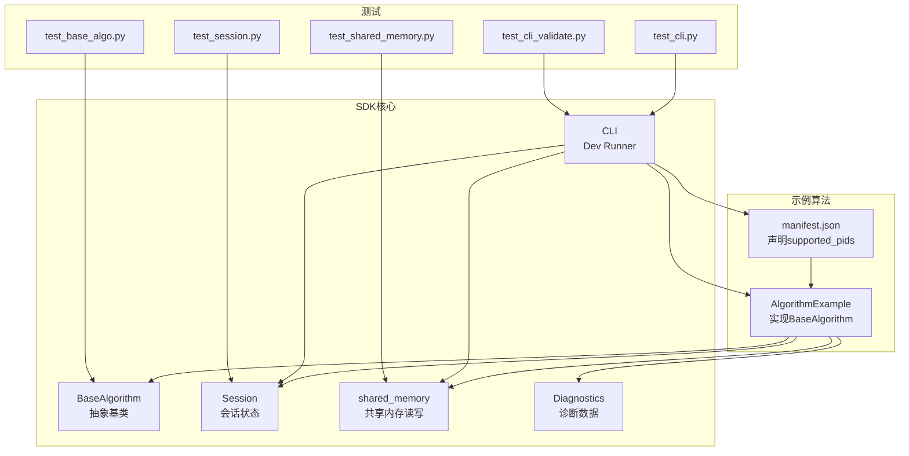
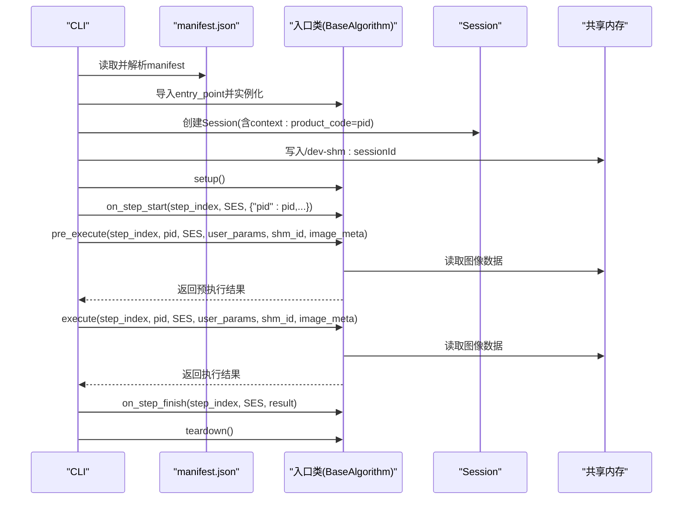
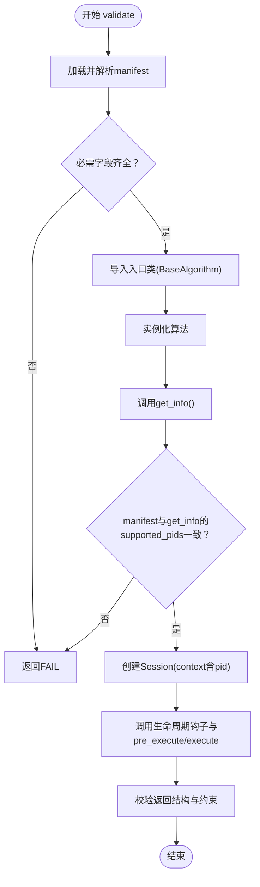
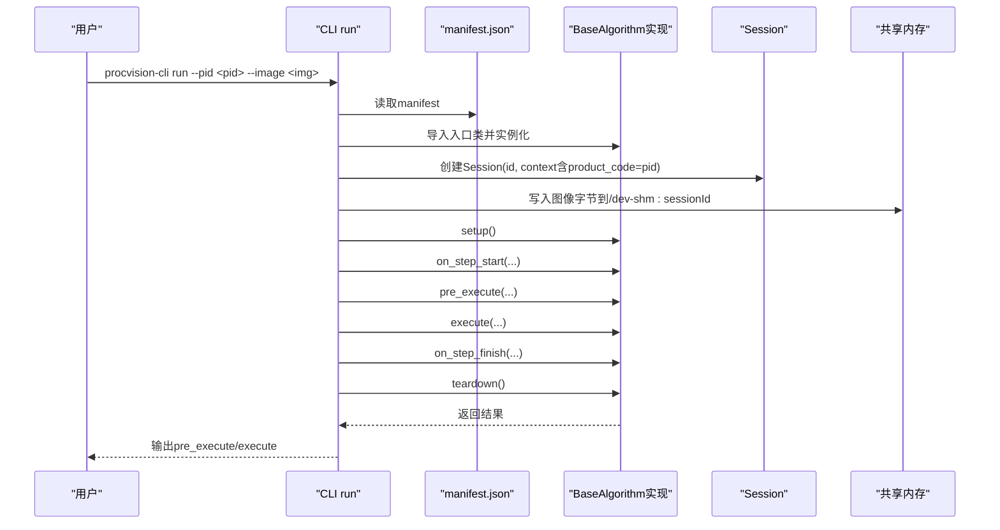
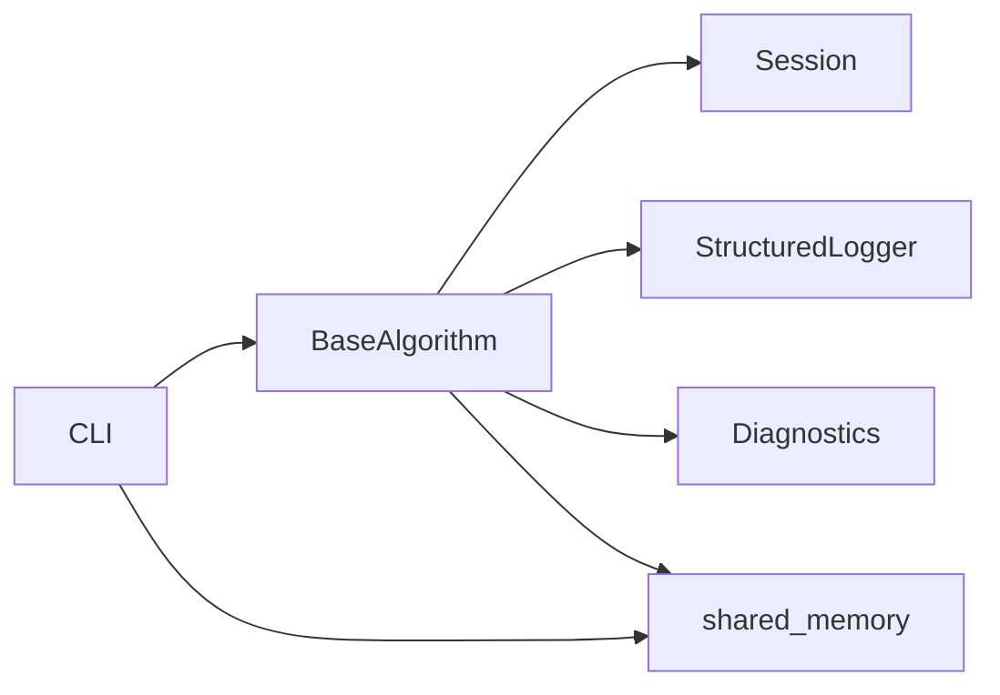

# 多PID支持

<cite>
**本文引用的文件**
- [README.md](file://README.md)
- [spec.md](file://spec.md)
- [procvision_algorithm_sdk/base.py](file://procvision_algorithm_sdk/base.py)
- [procvision_algorithm_sdk/cli.py](file://procvision_algorithm_sdk/cli.py)
- [procvision_algorithm_sdk/session.py](file://procvision_algorithm_sdk/session.py)
- [procvision_algorithm_sdk/shared_memory.py](file://procvision_algorithm_sdk/shared_memory.py)
- [procvision_algorithm_sdk/diagnostics.py](file://procvision_algorithm_sdk/diagnostics.py)
- [algorithm-example/manifest.json](file://algorithm-example/manifest.json)
- [algorithm-example/algorithm_example/main.py](file://algorithm-example/algorithm_example/main.py)
- [tests/test_base_algo.py](file://tests/test_base_algo.py)
- [tests/test_cli.py](file://tests/test_cli.py)
- [tests/test_cli_validate.py](file://tests/test_cli_validate.py)
- [tests/test_session.py](file://tests/test_session.py)
- [tests/test_shared_memory.py](file://tests/test_shared_memory.py)
</cite>

## 目录
1. [简介](#简介)
2. [项目结构](#项目结构)
3. [核心组件](#核心组件)
4. [架构总览](#架构总览)
5. [详细组件分析](#详细组件分析)
6. [依赖关系分析](#依赖关系分析)
7. [性能考量](#性能考量)
8. [故障排查指南](#故障排查指南)
9. [结论](#结论)
10. [附录](#附录)

## 简介
本文件围绕“多PID（Process ID）算法配置支持机制”展开，结合manifest.json中的supported_pids字段，系统阐述：
- 如何在manifest.json中声明算法支持的工艺流程变体（PID）
- 在BaseAlgorithm实现中如何依据传入的pid进行参数或执行路径的动态调整
- 在pre_execute与execute中基于PID的初始化与条件处理示例
- CLI工具在validate与run命令中如何模拟不同PID环境
- 强调状态隔离的重要性，确保不同PID间Session数据不混用
- 提供多PID测试策略，覆盖边界值与配置一致性验证

## 项目结构
该SDK采用“抽象基类+CLI工具+会话与共享内存”的分层组织方式，配合示例工程与单元测试，形成从声明到实现再到验证的闭环。

图表来源
- [procvision_algorithm_sdk/base.py](file://procvision_algorithm_sdk/base.py#L1-L58)
- [procvision_algorithm_sdk/cli.py](file://procvision_algorithm_sdk/cli.py#L1-L615)
- [procvision_algorithm_sdk/session.py](file://procvision_algorithm_sdk/session.py#L1-L36)
- [procvision_algorithm_sdk/shared_memory.py](file://procvision_algorithm_sdk/shared_memory.py#L1-L53)
- [procvision_algorithm_sdk/diagnostics.py](file://procvision_algorithm_sdk/diagnostics.py#L1-L12)
- [algorithm-example/manifest.json](file://algorithm-example/manifest.json#L1-L25)
- [algorithm-example/algorithm_example/main.py](file://algorithm-example/algorithm_example/main.py#L1-L150)
- [tests/test_base_algo.py](file://tests/test_base_algo.py#L1-L65)
- [tests/test_cli.py](file://tests/test_cli.py#L1-L20)
- [tests/test_cli_validate.py](file://tests/test_cli_validate.py#L1-L11)
- [tests/test_session.py](file://tests/test_session.py#L1-L24)
- [tests/test_shared_memory.py](file://tests/test_shared_memory.py#L1-L16)

章节来源
- [README.md](file://README.md#L1-L116)
- [procvision_algorithm_sdk/base.py](file://procvision_algorithm_sdk/base.py#L1-L58)
- [procvision_algorithm_sdk/cli.py](file://procvision_algorithm_sdk/cli.py#L1-L615)
- [procvision_algorithm_sdk/session.py](file://procvision_algorithm_sdk/session.py#L1-L36)
- [procvision_algorithm_sdk/shared_memory.py](file://procvision_algorithm_sdk/shared_memory.py#L1-L53)
- [procvision_algorithm_sdk/diagnostics.py](file://procvision_algorithm_sdk/diagnostics.py#L1-L12)
- [algorithm-example/manifest.json](file://algorithm-example/manifest.json#L1-L25)
- [algorithm-example/algorithm_example/main.py](file://algorithm-example/algorithm_example/main.py#L1-L150)
- [tests/test_base_algo.py](file://tests/test_base_algo.py#L1-L65)
- [tests/test_cli.py](file://tests/test_cli.py#L1-L20)
- [tests/test_cli_validate.py](file://tests/test_cli_validate.py#L1-L11)
- [tests/test_session.py](file://tests/test_session.py#L1-L24)
- [tests/test_shared_memory.py](file://tests/test_shared_memory.py#L1-L16)

## 核心组件
- BaseAlgorithm：定义算法生命周期钩子与抽象接口，其中pre_execute与execute接收pid参数，用于在单实例中区分不同PID的执行路径。
- Session：提供每步执行的上下文与状态存储，确保不同PID下的状态隔离。
- shared_memory：提供本地开发阶段的图像数据读写接口，支持模拟不同图像尺寸与颜色空间。
- Diagnostics：提供轻量级诊断数据收集，便于统计不同PID的性能指标。
- CLI（Dev Runner）：validate与run命令分别用于校验与本地模拟运行，均以pid作为关键输入，确保与manifest声明一致。

章节来源
- [procvision_algorithm_sdk/base.py](file://procvision_algorithm_sdk/base.py#L1-L58)
- [procvision_algorithm_sdk/session.py](file://procvision_algorithm_sdk/session.py#L1-L36)
- [procvision_algorithm_sdk/shared_memory.py](file://procvision_algorithm_sdk/shared_memory.py#L1-L53)
- [procvision_algorithm_sdk/diagnostics.py](file://procvision_algorithm_sdk/diagnostics.py#L1-L12)
- [procvision_algorithm_sdk/cli.py](file://procvision_algorithm_sdk/cli.py#L1-L615)

## 架构总览
下面的序列图展示了CLI在validate与run命令中如何加载manifest、导入入口类、构造Session并调用算法生命周期钩子，同时演示了基于pid的初始化与执行路径选择。

图表来源
- [procvision_algorithm_sdk/cli.py](file://procvision_algorithm_sdk/cli.py#L1-L615)
- [procvision_algorithm_sdk/base.py](file://procvision_algorithm_sdk/base.py#L1-L58)
- [procvision_algorithm_sdk/session.py](file://procvision_algorithm_sdk/session.py#L1-L36)
- [procvision_algorithm_sdk/shared_memory.py](file://procvision_algorithm_sdk/shared_memory.py#L1-L53)
- [algorithm-example/manifest.json](file://algorithm-example/manifest.json#L1-L25)
- [algorithm-example/algorithm_example/main.py](file://algorithm-example/algorithm_example/main.py#L1-L150)

## 详细组件分析

### manifest.json中的PID声明与一致性校验
- supported_pids字段用于声明算法支持的PID列表，CLI在validate命令中会读取该字段并与get_info返回的supported_pids进行比对，确保二者一致。
- CLI还会构造一个包含product_code=pid的Session上下文，用于模拟不同PID环境下的调用。

章节来源
- [algorithm-example/manifest.json](file://algorithm-example/manifest.json#L1-L25)
- [procvision_algorithm_sdk/cli.py](file://procvision_algorithm_sdk/cli.py#L35-L125)

### BaseAlgorithm中的PID参数与状态隔离
- BaseAlgorithm的pre_execute与execute均接收pid参数，算法可在内部根据pid决定参数加载、模型选择或执行分支。
- Session提供get/set/delete/exists等方法，确保不同PID的中间态数据相互隔离，避免跨PID污染。
- on_step_start/on_step_finish中可利用Session存储每步开始时间等信息，便于统计不同PID的性能差异。

章节来源
- [procvision_algorithm_sdk/base.py](file://procvision_algorithm_sdk/base.py#L1-L58)
- [procvision_algorithm_sdk/session.py](file://procvision_algorithm_sdk/session.py#L1-L36)
- [algorithm-example/algorithm_example/main.py](file://algorithm-example/algorithm_example/main.py#L1-L150)

### CLI validate命令中的PID模拟与一致性验证
- validate命令会：
  - 加载manifest并校验必需字段（含supported_pids）
  - 导入入口类并实例化
  - 读取get_info，提取steps与supported_pids
  - 构造Session(context含product_code=pid)，并调用on_step_start/pre_execute/execute/on_step_finish/teardown
  - 校验返回结构（status、data、result_status等），并比较manifest与get_info中的supported_pids

图表来源
- [procvision_algorithm_sdk/cli.py](file://procvision_algorithm_sdk/cli.py#L35-L125)
- [algorithm-example/manifest.json](file://algorithm-example/manifest.json#L1-L25)
- [algorithm-example/algorithm_example/main.py](file://algorithm-example/algorithm_example/main.py#L1-L150)

章节来源
- [procvision_algorithm_sdk/cli.py](file://procvision_algorithm_sdk/cli.py#L35-L125)
- [tests/test_cli_validate.py](file://tests/test_cli_validate.py#L1-L11)

### CLI run命令中的PID模拟与执行流程
- run命令会：
  - 读取manifest并导入入口类
  - 以--pid参数构造Session(context含product_code=pid)
  - 将本地图片写入/dev-shm:sessionId
  - 调用setup/on_step_start/pre_execute/execute/on_step_finish/teardown
  - 返回pre_execute与execute的结果

图表来源
- [procvision_algorithm_sdk/cli.py](file://procvision_algorithm_sdk/cli.py#L126-L214)
- [procvision_algorithm_sdk/shared_memory.py](file://procvision_algorithm_sdk/shared_memory.py#L1-L53)
- [algorithm-example/manifest.json](file://algorithm-example/manifest.json#L1-L25)
- [algorithm-example/algorithm_example/main.py](file://algorithm-example/algorithm_example/main.py#L1-L150)

章节来源
- [procvision_algorithm_sdk/cli.py](file://procvision_algorithm_sdk/cli.py#L126-L214)
- [tests/test_cli.py](file://tests/test_cli.py#L1-L20)

### 示例：基于PID的初始化与条件处理
- 在AlgorithmExample中，构造函数中维护_supported_pids，get_info返回相同列表，确保声明与实现一致。
- 在pre_execute与execute中，先校验pid是否在_supported_pids中，不在则返回ERROR；在则继续读取图像并执行业务逻辑。
- execute中可根据step_index与pid组合决定返回OK/NG及附加字段（如defect_rects、position_rects等）。

章节来源
- [algorithm-example/algorithm_example/main.py](file://algorithm-example/algorithm_example/main.py#L1-L150)
- [tests/test_base_algo.py](file://tests/test_base_algo.py#L1-L65)

### 状态隔离与Session数据管理
- Session提供set/get/delete/exists，且要求存储值可JSON序列化，避免跨PID状态污染。
- on_step_start设置step_start_ms，on_step_finish计算延迟并发布到Diagnostics，reset用于清理中间态。
- 通过为每个PID创建独立Session（或至少独立的context），确保不同PID间不会共享状态。

章节来源
- [procvision_algorithm_sdk/session.py](file://procvision_algorithm_sdk/session.py#L1-L36)
- [procvision_algorithm_sdk/diagnostics.py](file://procvision_algorithm_sdk/diagnostics.py#L1-L12)
- [algorithm-example/algorithm_example/main.py](file://algorithm-example/algorithm_example/main.py#L1-L150)
- [tests/test_session.py](file://tests/test_session.py#L1-L24)

### 共享内存与图像数据读取
- CLI在run中将本地图片字节写入/dev-shm:sessionId，算法通过read_image_from_shared_memory读取。
- shared_memory支持多种输入（字节流、NumPy数组、PIL Image），并在meta缺失时提供回退策略（如返回零矩阵）。

章节来源
- [procvision_algorithm_sdk/cli.py](file://procvision_algorithm_sdk/cli.py#L126-L214)
- [procvision_algorithm_sdk/shared_memory.py](file://procvision_algorithm_sdk/shared_memory.py#L1-L53)
- [tests/test_shared_memory.py](file://tests/test_shared_memory.py#L1-L16)

## 依赖关系分析
- BaseAlgorithm依赖Session、StructuredLogger与Diagnostics，提供统一的生命周期钩子。
- CLI依赖BaseAlgorithm与Session，负责manifest解析、入口类导入、生命周期调用与结果输出。
- shared_memory与Diagnostics为辅助模块，前者提供图像数据读写，后者提供诊断数据收集。

图表来源
- [procvision_algorithm_sdk/cli.py](file://procvision_algorithm_sdk/cli.py#L1-L615)
- [procvision_algorithm_sdk/base.py](file://procvision_algorithm_sdk/base.py#L1-L58)
- [procvision_algorithm_sdk/session.py](file://procvision_algorithm_sdk/session.py#L1-L36)
- [procvision_algorithm_sdk/shared_memory.py](file://procvision_algorithm_sdk/shared_memory.py#L1-L53)
- [procvision_algorithm_sdk/diagnostics.py](file://procvision_algorithm_sdk/diagnostics.py#L1-L12)

章节来源
- [procvision_algorithm_sdk/cli.py](file://procvision_algorithm_sdk/cli.py#L1-L615)
- [procvision_algorithm_sdk/base.py](file://procvision_algorithm_sdk/base.py#L1-L58)
- [procvision_algorithm_sdk/session.py](file://procvision_algorithm_sdk/session.py#L1-L36)
- [procvision_algorithm_sdk/shared_memory.py](file://procvision_algorithm_sdk/shared_memory.py#L1-L53)
- [procvision_algorithm_sdk/diagnostics.py](file://procvision_algorithm_sdk/diagnostics.py#L1-L12)

## 性能考量
- 单实例多PID：通过在execute/pre_execute中按pid分支，避免重复加载模型或资源，降低内存占用与初始化开销。
- 图像读取：shared_memory在meta缺失或解码失败时提供回退，减少异常路径对主流程的影响。
- 诊断数据：Diagnostics用于统计不同PID的延迟等指标，便于后续优化。

章节来源
- [README.md](file://README.md#L1-L116)
- [procvision_algorithm_sdk/shared_memory.py](file://procvision_algorithm_sdk/shared_memory.py#L1-L53)
- [procvision_algorithm_sdk/diagnostics.py](file://procvision_algorithm_sdk/diagnostics.py#L1-L12)

## 故障排查指南
- manifest缺失或字段不全：validate会报告FAIL并指出缺失项。
- pid不在supported_pids：算法应返回ERROR并携带错误码；CLI也会在validate中校验一致性。
- 图像数据为空或解码失败：返回ERROR并提示检查图像完整性。
- 非JSON可序列化值：Session.set会抛出TypeError，需确保存储值可序列化。
- 验证失败样例：可通过tests/test_cli_validate.py观察validate对缺失manifest的处理。

章节来源
- [procvision_algorithm_sdk/cli.py](file://procvision_algorithm_sdk/cli.py#L35-L125)
- [procvision_algorithm_sdk/session.py](file://procvision_algorithm_sdk/session.py#L1-L36)
- [tests/test_cli_validate.py](file://tests/test_cli_validate.py#L1-L11)
- [spec.md](file://spec.md#L1777-L1804)

## 结论
- manifest.json的supported_pids是多PID支持的核心声明，CLI在validate与run中均以该字段为基准进行一致性校验与环境模拟。
- BaseAlgorithm通过pre_execute/execute的pid参数实现“单实例多PID”，结合Session的状态隔离与shared_memory的图像读取，形成稳定的执行链路。
- 通过规范化的生命周期钩子与诊断数据，可有效追踪不同PID的性能与稳定性。
- 建议在算法实现中严格遵循“声明—实现—校验”的闭环，确保配置一致性与边界条件覆盖。

## 附录

### 多PID测试策略（实践建议）
- 边界值覆盖
  - 支持的PID：使用manifest中声明的所有PID逐一运行，验证get_info与pre_execute/execute均返回OK。
  - 不支持的PID：传入不在supported_pids中的pid，验证返回ERROR且包含明确的错误码与消息。
  - 图像异常：传入空字节或非法尺寸meta，验证返回ERROR并提示检查图像。
- 配置一致性验证
  - validate命令：确保manifest字段齐全、入口类可导入、get_info返回的supported_pids与manifest一致。
  - run命令：针对每个PID，验证pre_execute与execute返回结构符合规范（status、data、result_status等）。
- 状态隔离验证
  - 在on_step_start中写入step_start_ms，在on_step_finish中读取并发布诊断，确保不同PID的延迟统计互不影响。
  - 使用不同的Session id与context，验证中间态数据不会跨PID共享。

章节来源
- [procvision_algorithm_sdk/cli.py](file://procvision_algorithm_sdk/cli.py#L35-L125)
- [procvision_algorithm_sdk/session.py](file://procvision_algorithm_sdk/session.py#L1-L36)
- [tests/test_cli.py](file://tests/test_cli.py#L1-L20)
- [tests/test_base_algo.py](file://tests/test_base_algo.py#L1-L65)
- [tests/test_session.py](file://tests/test_session.py#L1-L24)
- [tests/test_shared_memory.py](file://tests/test_shared_memory.py#L1-L16)