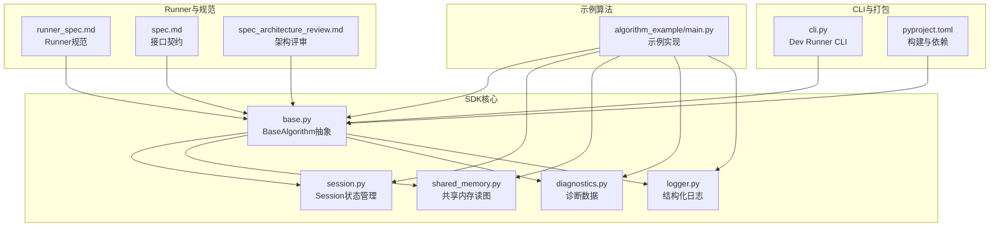
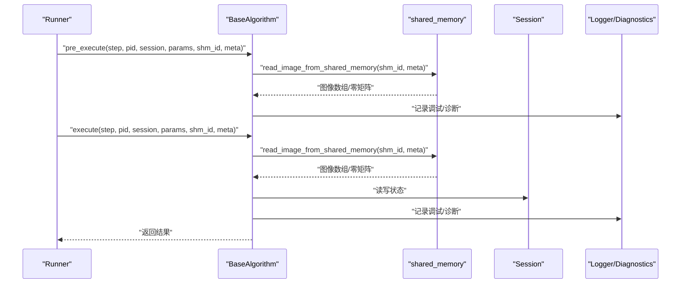
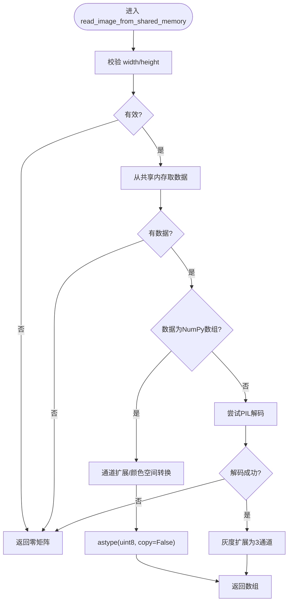
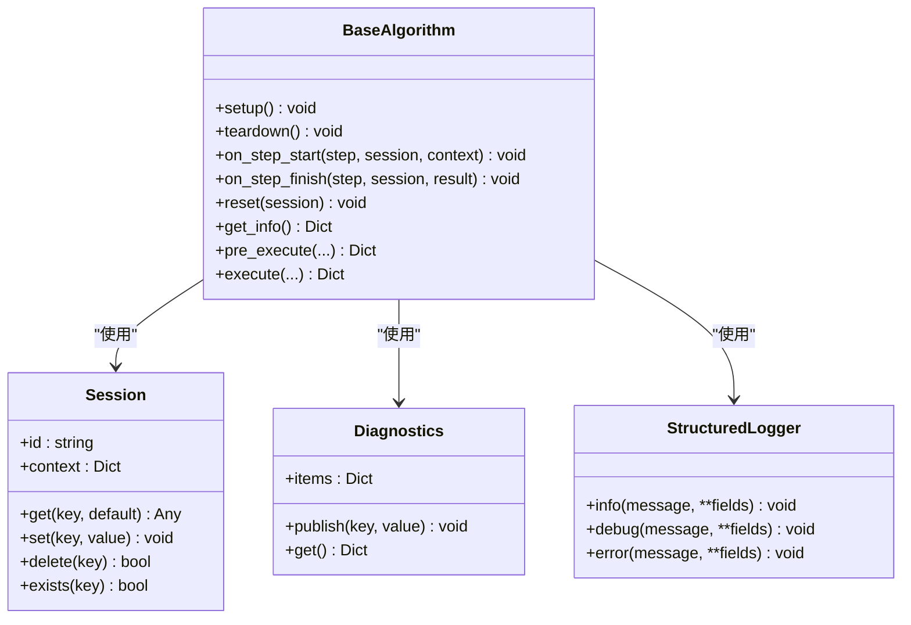
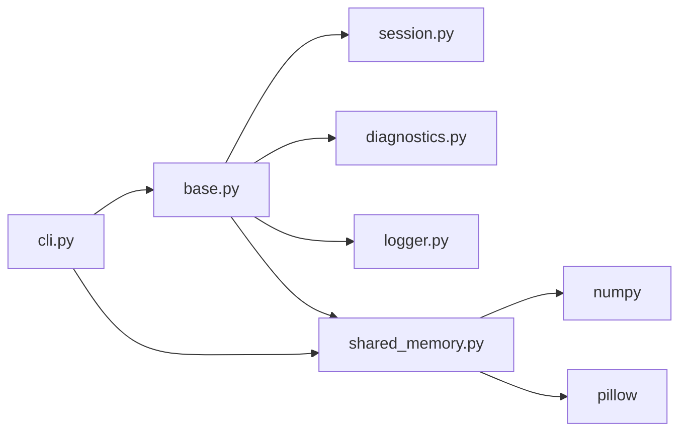

# 性能优化

<cite>
**本文引用的文件**
- [README.md](file://README.md)
- [procvision_algorithm_sdk/shared_memory.py](file://procvision_algorithm_sdk/shared_memory.py)
- [procvision_algorithm_sdk/session.py](file://procvision_algorithm_sdk/session.py)
- [procvision_algorithm_sdk/base.py](file://procvision_algorithm_sdk/base.py)
- [procvision_algorithm_sdk/diagnostics.py](file://procvision_algorithm_sdk/diagnostics.py)
- [procvision_algorithm_sdk/logger.py](file://procvision_algorithm_sdk/logger.py)
- [procvision_algorithm_sdk/cli.py](file://procvision_algorithm_sdk/cli.py)
- [algorithm-example/algorithm_example/main.py](file://algorithm-example/algorithm_example/main.py)
- [tests/test_shared_memory.py](file://tests/test_shared_memory.py)
- [tests/test_shared_memory_array.py](file://tests/test_shared_memory_array.py)
- [tests/test_session.py](file://tests/test_session.py)
- [runner_spec.md](file://runner_spec.md)
- [spec_architecture_review.md](file://spec_architecture_review.md)
- [spec.md](file://spec.md)
- [pyproject.toml](file://pyproject.toml)
</cite>

## 目录
1. [简介](#简介)
2. [项目结构](#项目结构)
3. [核心组件](#核心组件)
4. [架构总览](#架构总览)
5. [详细组件分析](#详细组件分析)
6. [依赖关系分析](#依赖关系分析)
7. [性能考量](#性能考量)
8. [故障排查指南](#故障排查指南)
9. [结论](#结论)
10. [附录](#附录)

## 简介
本文件系统性总结算法性能优化的关键策略，围绕以下主题展开：
- 共享内存图像读取：深入解析 read_image_from_shared_memory 的底层机制与性能优势，对比传统文件I/O。
- 会话状态管理：减少Session序列化开销、跨步骤复用状态、避免重复初始化。
- 计算资源利用：结合生命周期钩子与Runner常驻进程特性，最大化资源复用与吞吐。
- 多PID场景：通过缓存与预加载提升吞吐，结合Runner预热与进程常驻。
- 基准测试：使用time.time()进行微秒级测量与诊断数据上报执行耗时。
- 性能陷阱：避免在execute中执行阻塞操作或频繁创建临时对象。

## 项目结构
SDK采用模块化组织，核心能力集中在基础抽象、会话管理、共享内存读图、诊断与日志等模块，配合Runner规范与CLI工具形成完整的开发与运行链路。

图表来源
- [procvision_algorithm_sdk/base.py](file://procvision_algorithm_sdk/base.py#L1-L58)
- [procvision_algorithm_sdk/session.py](file://procvision_algorithm_sdk/session.py#L1-L36)
- [procvision_algorithm_sdk/shared_memory.py](file://procvision_algorithm_sdk/shared_memory.py#L1-L53)
- [procvision_algorithm_sdk/diagnostics.py](file://procvision_algorithm_sdk/diagnostics.py#L1-L12)
- [procvision_algorithm_sdk/logger.py](file://procvision_algorithm_sdk/logger.py#L1-L24)
- [algorithm-example/algorithm_example/main.py](file://algorithm-example/algorithm_example/main.py#L1-L33)
- [runner_spec.md](file://runner_spec.md#L81-L86)
- [spec.md](file://spec.md#L678-L689)
- [spec_architecture_review.md](file://spec_architecture_review.md#L653-L685)
- [procvision_algorithm_sdk/cli.py](file://procvision_algorithm_sdk/cli.py#L500-L614)
- [pyproject.toml](file://pyproject.toml#L1-L36)

章节来源
- [README.md](file://README.md#L1-L116)
- [procvision_algorithm_sdk/__init__.py](file://procvision_algorithm_sdk/__init__.py#L1-L18)

## 核心组件
- BaseAlgorithm：定义算法生命周期钩子与抽象接口，提供日志、诊断与会话对象。
- Session：提供KV状态存储与上下文隔离，支持JSON可序列化值的设置与存在性检查。
- shared_memory：提供共享内存图像读取与写入接口，兼容字节流与NumPy数组。
- Diagnostics：轻量级诊断数据容器，支持publish/get。
- StructuredLogger：结构化日志输出，统一timestamp_ms字段。
- CLI：Dev Runner本地运行与校验工具，支持参数化运行与JSON输出。

章节来源
- [procvision_algorithm_sdk/base.py](file://procvision_algorithm_sdk/base.py#L1-L58)
- [procvision_algorithm_sdk/session.py](file://procvision_algorithm_sdk/session.py#L1-L36)
- [procvision_algorithm_sdk/shared_memory.py](file://procvision_algorithm_sdk/shared_memory.py#L1-L53)
- [procvision_algorithm_sdk/diagnostics.py](file://procvision_algorithm_sdk/diagnostics.py#L1-L12)
- [procvision_algorithm_sdk/logger.py](file://procvision_algorithm_sdk/logger.py#L1-L24)
- [procvision_algorithm_sdk/cli.py](file://procvision_algorithm_sdk/cli.py#L500-L614)

## 架构总览
SDK通过BaseAlgorithm抽象与Runner解耦，算法通过pre_execute/execute与共享内存交互；Session贯穿多步骤状态共享；Diagnostics与Logger提供可观测性；CLI用于本地验证与基准。

图表来源
- [procvision_algorithm_sdk/base.py](file://procvision_algorithm_sdk/base.py#L1-L58)
- [procvision_algorithm_sdk/shared_memory.py](file://procvision_algorithm_sdk/shared_memory.py#L1-L53)
- [procvision_algorithm_sdk/session.py](file://procvision_algorithm_sdk/session.py#L1-L36)
- [procvision_algorithm_sdk/logger.py](file://procvision_algorithm_sdk/logger.py#L1-L24)
- [procvision_algorithm_sdk/diagnostics.py](file://procvision_algorithm_sdk/diagnostics.py#L1-L12)
- [runner_spec.md](file://runner_spec.md#L81-L86)

## 详细组件分析

### 共享内存图像读取：read_image_from_shared_memory
- 设计目标
  - 通过共享内存避免磁盘I/O，降低延迟与拷贝开销。
  - 统一image_meta字段，简化调用与平台写入一致性。
- 底层机制
  - 输入：shared_mem_id与image_meta（width/height/color_space等）。
  - 优先路径：若共享内存中为NumPy数组，则按ndim与color_space进行通道扩展与BGR→RGB转换，最后以无复制方式转为uint8。
  - 回退路径：若为字节流（如JPEG/PNG），使用PIL解码为数组，灰度自动扩展为3通道。
  - 异常与边界：meta无效或无数据时返回零矩阵，保证调用方安全。
- 性能优势
  - 避免文件系统与磁盘IO，显著降低延迟。
  - NumPy数组路径支持copy=False，避免额外内存分配与拷贝。
  - 与Runner常驻进程配合，减少进程启动与初始化成本。
- 使用建议
  - 优先写入NumPy数组，减少PIL解码开销。
  - 在image_meta中正确设置color_space，避免额外转换。
  - 对灰度图提供3通道输入，减少运行时扩展。

图表来源
- [procvision_algorithm_sdk/shared_memory.py](file://procvision_algorithm_sdk/shared_memory.py#L1-L53)
- [tests/test_shared_memory.py](file://tests/test_shared_memory.py#L1-L16)
- [tests/test_shared_memory_array.py](file://tests/test_shared_memory_array.py#L1-L39)

章节来源
- [procvision_algorithm_sdk/shared_memory.py](file://procvision_algorithm_sdk/shared_memory.py#L1-L53)
- [tests/test_shared_memory.py](file://tests/test_shared_memory.py#L1-L16)
- [tests/test_shared_memory_array.py](file://tests/test_shared_memory_array.py#L1-L39)
- [README.md](file://README.md#L1-L116)
- [runner_spec.md](file://runner_spec.md#L102-L107)

### 会话状态管理：减少序列化开销与复用
- Session设计
  - state_store提供KV存储，context为只读上下文。
  - set在写入前进行JSON可序列化检查，避免不可序列化对象导致的运行时错误。
- 优化技巧
  - 将跨步骤共享的状态放入state_store，避免重复初始化。
  - 使用exists/get组合减少不必要的写入与序列化。
  - 在on_step_start/on_step_finish中记录时间戳，结合Diagnostics上报延迟。
  - 在reset中清理临时状态，避免累积占用。
- 示例实践
  - 示例算法在on_step_start写入step_start_ms，在on_step_finish计算并上报step_latency_ms。

图表来源
- [procvision_algorithm_sdk/session.py](file://procvision_algorithm_sdk/session.py#L1-L36)
- [procvision_algorithm_sdk/diagnostics.py](file://procvision_algorithm_sdk/diagnostics.py#L1-L12)
- [procvision_algorithm_sdk/logger.py](file://procvision_algorithm_sdk/logger.py#L1-L24)
- [procvision_algorithm_sdk/base.py](file://procvision_algorithm_sdk/base.py#L1-L58)
- [algorithm-example/algorithm_example/main.py](file://algorithm-example/algorithm_example/main.py#L1-L33)

章节来源
- [procvision_algorithm_sdk/session.py](file://procvision_algorithm_sdk/session.py#L1-L36)
- [tests/test_session.py](file://tests/test_session.py#L1-L24)
- [algorithm-example/algorithm_example/main.py](file://algorithm-example/algorithm_example/main.py#L1-L33)

### 计算资源利用：生命周期与Runner常驻
- 生命周期钩子
  - setup：进程启动时加载模型与重量级资源，仅执行一次。
  - pre_execute：每步执行前进行条件验证与参考信息准备。
  - execute：核心检测逻辑，应避免阻塞与频繁创建临时对象。
  - on_step_start/on_step_finish：记录时间戳与诊断数据。
  - reset：重新检测时清理会话数据。
  - teardown：进程退出前释放资源。
- Runner常驻与预热
  - Runner保持进程常驻以复用，执行完成后返回结果帧，避免频繁启动。
  - Runner预热阶段加载模型与资源，降低首次执行延迟。
- 多PID场景
  - 通过manifest.json配置supported_pids，Runner按PID选择算法实例，实现多PID下的实例复用与吞吐提升。

章节来源
- [spec_architecture_review.md](file://spec_architecture_review.md#L653-L685)
- [runner_spec.md](file://runner_spec.md#L81-L86)
- [runner_spec.md](file://runner_spec.md#L143-L161)
- [runner_spec.md](file://runner_spec.md#L161-L182)
- [procvision_algorithm_sdk/base.py](file://procvision_algorithm_sdk/base.py#L1-L58)

### 基准测试与诊断
- 微秒级测量
  - 使用time.time()计算执行耗时，示例算法在on_step_finish中计算step_latency_ms并上报。
  - 在execute中返回debug字段包含latency_ms，便于Runner聚合与分析。
- 诊断数据上报
  - Diagnostics.publish用于发布键值对，get返回当前快照，便于集中收集。
- CLI基准
  - CLI支持--json输出，便于自动化收集与分析结果。

章节来源
- [algorithm-example/algorithm_example/main.py](file://algorithm-example/algorithm_example/main.py#L1-L33)
- [algorithm-example/algorithm_example/main.py](file://algorithm-example/algorithm_example/main.py#L115-L149)
- [procvision_algorithm_sdk/diagnostics.py](file://procvision_algorithm_sdk/diagnostics.py#L1-L12)
- [procvision_algorithm_sdk/cli.py](file://procvision_algorithm_sdk/cli.py#L500-L614)

## 依赖关系分析
- 内部依赖
  - BaseAlgorithm依赖Session、Diagnostics、Logger。
  - shared_memory为无外部依赖的纯函数模块，内部使用NumPy与PIL。
  - CLI依赖SDK模块与文件系统。
- 外部依赖
  - numpy与pillow为共享内存读图与图像处理的基础。
  - 构建工具setuptools与wheel用于打包。

图表来源
- [procvision_algorithm_sdk/base.py](file://procvision_algorithm_sdk/base.py#L1-L58)
- [procvision_algorithm_sdk/session.py](file://procvision_algorithm_sdk/session.py#L1-L36)
- [procvision_algorithm_sdk/diagnostics.py](file://procvision_algorithm_sdk/diagnostics.py#L1-L12)
- [procvision_algorithm_sdk/logger.py](file://procvision_algorithm_sdk/logger.py#L1-L24)
- [procvision_algorithm_sdk/shared_memory.py](file://procvision_algorithm_sdk/shared_memory.py#L1-L53)
- [procvision_algorithm_sdk/cli.py](file://procvision_algorithm_sdk/cli.py#L500-L614)
- [pyproject.toml](file://pyproject.toml#L1-L36)

章节来源
- [pyproject.toml](file://pyproject.toml#L1-L36)

## 性能考量

### 共享内存图像读取的性能优势
- 相比传统文件I/O
  - 避免磁盘寻道与顺序读取，显著降低延迟。
  - NumPy数组路径支持copy=False，避免额外内存分配与拷贝。
  - 与Runner常驻进程配合，减少进程启动与初始化成本。
- 最佳实践
  - 优先写入NumPy数组，减少PIL解码开销。
  - 正确设置image_meta.color_space，避免运行时颜色空间转换。
  - 对灰度图提供3通道输入，减少运行时扩展。

章节来源
- [procvision_algorithm_sdk/shared_memory.py](file://procvision_algorithm_sdk/shared_memory.py#L1-L53)
- [runner_spec.md](file://runner_spec.md#L102-L107)

### 减少Session序列化开销
- 使用exists/get避免不必要的写入。
- 将跨步骤共享的状态放入state_store，避免重复初始化。
- 在reset中清理临时状态，防止累积占用。

章节来源
- [procvision_algorithm_sdk/session.py](file://procvision_algorithm_sdk/session.py#L1-L36)
- [tests/test_session.py](file://tests/test_session.py#L1-L24)

### 复用NumPy数组内存
- 在共享内存中直接写入NumPy数组，避免PIL解码。
- 使用astype(uint8, copy=False)进行无复制类型转换。
- 对灰度图提供3通道输入，减少运行时扩展。

章节来源
- [procvision_algorithm_sdk/shared_memory.py](file://procvision_algorithm_sdk/shared_memory.py#L1-L53)
- [tests/test_shared_memory_array.py](file://tests/test_shared_memory_array.py#L1-L39)

### 避免重复初始化
- 将重量级资源放在setup中加载，teardown中释放。
- 将轻量级资源放在__init__或setup中初始化，避免每步重复创建。
- 使用Runner常驻进程与预热，减少进程启动与初始化成本。

章节来源
- [spec_architecture_review.md](file://spec_architecture_review.md#L653-L685)
- [runner_spec.md](file://runner_spec.md#L81-L86)
- [runner_spec.md](file://runner_spec.md#L143-L161)

### 多PID场景的缓存与预加载
- 通过manifest.json配置supported_pids，Runner按PID选择算法实例，实现多PID下的实例复用。
- Runner预热阶段加载模型与资源，降低首次执行延迟。
- 在pre_execute中进行条件验证与参考信息准备，避免execute中的重复工作。

章节来源
- [runner_spec.md](file://runner_spec.md#L161-L182)
- [procvision_algorithm_sdk/base.py](file://procvision_algorithm_sdk/base.py#L1-L58)

### 基准测试方法
- 使用time.time()进行微秒级测量，示例算法在on_step_finish中计算step_latency_ms并上报。
- 在execute中返回debug字段包含latency_ms，便于Runner聚合与分析。
- CLI支持--json输出，便于自动化收集与分析结果。

章节来源
- [algorithm-example/algorithm_example/main.py](file://algorithm-example/algorithm_example/main.py#L1-L33)
- [algorithm-example/algorithm_example/main.py](file://algorithm-example/algorithm_example/main.py#L115-L149)
- [procvision_algorithm_sdk/cli.py](file://procvision_algorithm_sdk/cli.py#L500-L614)

### 常见性能陷阱
- 在execute中执行阻塞操作：可能导致Runner超时或进程被终止。
- 频繁创建临时对象：增加GC压力与内存碎片。
- 不必要的图像解码：优先使用NumPy数组路径，避免PIL解码。
- 未复用Session状态：导致重复初始化与序列化开销。

章节来源
- [spec.md](file://spec.md#L678-L689)
- [spec_architecture_review.md](file://spec_architecture_review.md#L495-L546)

## 故障排查指南
- 共享内存读取失败
  - 检查image_meta的width/height是否有效。
  - 若为字节流，确认JPEG/PNG格式正确。
  - 若无数据，返回零矩阵，需检查上游写入逻辑。
- Session序列化错误
  - set时抛出TypeError，检查值是否为JSON可序列化。
- 基准测试异常
  - 确认debug字段包含latency_ms，检查time.time()调用位置。
  - 使用CLI --json输出，便于自动化分析。

章节来源
- [procvision_algorithm_sdk/shared_memory.py](file://procvision_algorithm_sdk/shared_memory.py#L1-L53)
- [tests/test_shared_memory.py](file://tests/test_shared_memory.py#L1-L16)
- [procvision_algorithm_sdk/session.py](file://procvision_algorithm_sdk/session.py#L1-L36)
- [algorithm-example/algorithm_example/main.py](file://algorithm-example/algorithm_example/main.py#L1-L33)

## 结论
通过共享内存读图、会话状态复用、生命周期资源管理与Runner常驻预热，可在多PID场景下显著提升吞吐与稳定性。结合微秒级基准测试与诊断数据上报，可量化性能收益并持续优化。避免阻塞与重复初始化等常见陷阱，是保障高吞吐与低延迟的关键。

## 附录
- 关键接口与路径
  - 共享内存读取：[read_image_from_shared_memory](file://procvision_algorithm_sdk/shared_memory.py#L1-L53)
  - 会话状态：[Session](file://procvision_algorithm_sdk/session.py#L1-L36)
  - 基础抽象：[BaseAlgorithm](file://procvision_algorithm_sdk/base.py#L1-L58)
  - 诊断数据：[Diagnostics](file://procvision_algorithm_sdk/diagnostics.py#L1-L12)
  - 结构化日志：[StructuredLogger](file://procvision_algorithm_sdk/logger.py#L1-L24)
  - CLI基准：[cli.py](file://procvision_algorithm_sdk/cli.py#L500-L614)
  - 示例算法：[algorithm_example/main.py](file://algorithm-example/algorithm_example/main.py#L1-L33)