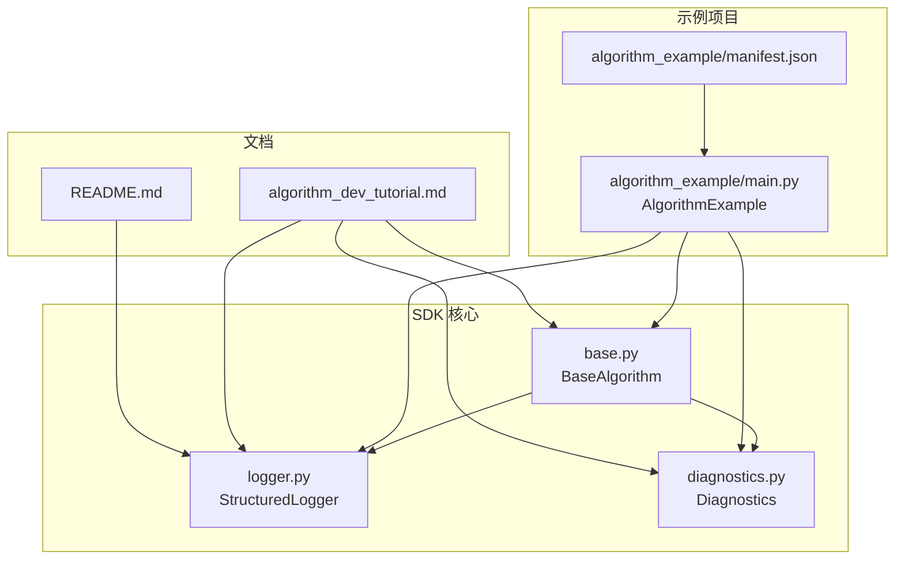
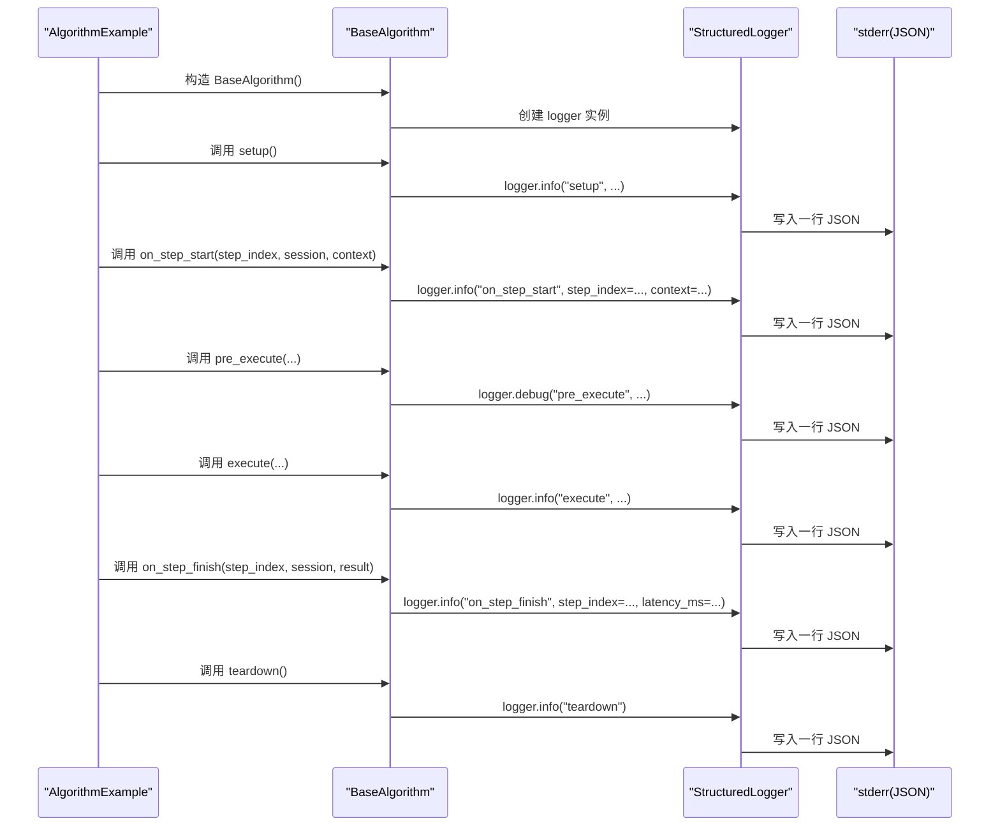
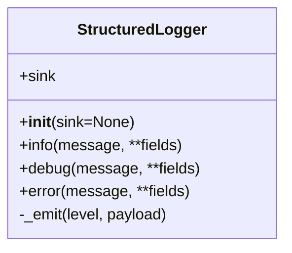
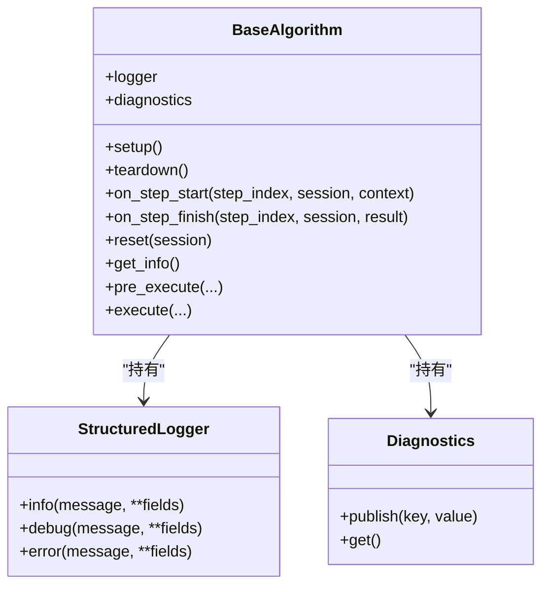
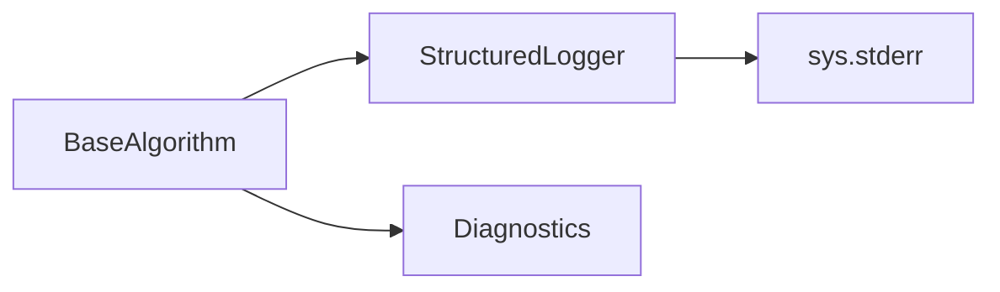

# 日志记录

<cite>
**本文引用的文件**
- [logger.py](file://procvision_algorithm_sdk/logger.py)
- [base.py](file://procvision_algorithm_sdk/base.py)
- [diagnostics.py](file://procvision_algorithm_sdk/diagnostics.py)
- [algorithm_dev_tutorial.md](file://algorithm_dev_tutorial.md)
- [README.md](file://README.md)
- [main.py](file://algorithm-example/algorithm_example/main.py)
- [manifest.json](file://algorithm-example/manifest.json)
</cite>

## 目录
1. [简介](#简介)
2. [项目结构](#项目结构)
3. [核心组件](#核心组件)
4. [架构总览](#架构总览)
5. [详细组件分析](#详细组件分析)
6. [依赖关系分析](#依赖关系分析)
7. [性能考量](#性能考量)
8. [故障排查指南](#故障排查指南)
9. [结论](#结论)
10. [附录](#附录)

## 简介
本章节面向算法开发者，系统讲解 StructuredLogger 的设计与使用方法，涵盖 info、debug、error 三个日志级别的调用方式与适用场景；结合 BaseAlgorithm 实现示例，说明如何在算法生命周期钩子与执行流程中注入并使用 logger 进行结构化日志输出；解释日志字段（level、timestamp_ms、message 等）的格式规范及其在生产环境中的可观察性价值；说明日志输出到 stderr 的机制及与平台日志收集系统的集成方式；最后提供性能敏感场景下的日志采样与批量写入优化建议，并对比调试模式与生产模式的日志策略差异，同时解决初学者常见的日志丢失、编码错误等问题。

## 项目结构
SDK 中与日志相关的核心文件与示例如下：
- 日志核心：StructuredLogger 类位于 logger.py，提供 info/debug/error 三类接口与统一的 JSON 输出格式。
- 算法基类：BaseAlgorithm 在构造时创建 StructuredLogger 实例，作为算法实例的 logger 属性，便于在生命周期钩子与执行流程中直接使用。
- 诊断数据：Diagnostics 提供轻量级的键值聚合，常与 logger.info 配合输出关键指标，便于平台采集。
- 教程与示例：algorithm_dev_tutorial.md 与 algorithm-example 展示了 logger 的典型用法与字段组织方式。
- 规范说明：README.md 明确了 timestamp_ms 字段统一约定，强调结构化日志与诊断数据的重要性。

图表来源
- [logger.py](file://procvision_algorithm_sdk/logger.py#L1-L24)
- [base.py](file://procvision_algorithm_sdk/base.py#L1-L58)
- [diagnostics.py](file://procvision_algorithm_sdk/diagnostics.py#L1-L12)
- [main.py](file://algorithm-example/algorithm_example/main.py#L1-L150)
- [manifest.json](file://algorithm-example/manifest.json#L1-L25)
- [algorithm_dev_tutorial.md](file://algorithm_dev_tutorial.md#L1-L348)
- [README.md](file://README.md#L1-L116)

章节来源
- [logger.py](file://procvision_algorithm_sdk/logger.py#L1-L24)
- [base.py](file://procvision_algorithm_sdk/base.py#L1-L58)
- [diagnostics.py](file://procvision_algorithm_sdk/diagnostics.py#L1-L12)
- [algorithm_dev_tutorial.md](file://algorithm_dev_tutorial.md#L1-L348)
- [README.md](file://README.md#L1-L116)
- [main.py](file://algorithm-example/algorithm_example/main.py#L1-L150)
- [manifest.json](file://algorithm-example/manifest.json#L1-L25)

## 核心组件
- StructuredLogger
  - 职责：提供结构化日志输出，统一 JSON 格式，包含 level、timestamp_ms、message 与任意自定义字段；默认输出到 stderr，也可替换为其他可写对象。
  - 方法：
    - info(message, **fields): 输出 info 级别日志
    - debug(message, **fields): 输出 debug 级别日志
    - error(message, **fields): 输出 error 级别日志
  - 输出格式：每条日志为一行 JSON，字段包括 level、timestamp_ms、message 与用户自定义字段；使用 ensure_ascii=False 支持非 ASCII 字符。
  - 冲刷策略：每次写入后立即 flush，保证日志及时可见。
- BaseAlgorithm
  - 职责：算法抽象基类，构造时创建 StructuredLogger 实例并赋给 self.logger，便于在生命周期钩子与执行流程中直接使用。
  - 生命周期钩子：setup、teardown、on_step_start、on_step_finish、reset，均适合输出结构化日志与诊断指标。
- Diagnostics
  - 职责：轻量级键值聚合容器，提供 publish/get 方法，便于在执行前后汇总关键指标（如耗时、版本号等），再通过 logger.info 输出。

章节来源
- [logger.py](file://procvision_algorithm_sdk/logger.py#L1-L24)
- [base.py](file://procvision_algorithm_sdk/base.py#L1-L58)
- [diagnostics.py](file://procvision_algorithm_sdk/diagnostics.py#L1-L12)

## 架构总览
下图展示了日志在算法生命周期中的流向与集成方式：

图表来源
- [base.py](file://procvision_algorithm_sdk/base.py#L1-L58)
- [logger.py](file://procvision_algorithm_sdk/logger.py#L1-L24)
- [main.py](file://algorithm-example/algorithm_example/main.py#L1-L150)

## 详细组件分析

### StructuredLogger 类分析
- 设计要点
  - 统一字段：固定包含 level、timestamp_ms、message；其余字段由调用方传入，便于平台侧解析与检索。
  - 输出目标：默认写入 sys.stderr，便于与业务输出分离；也可注入自定义 sink 以适配不同运行环境。
  - 编码与刷新：使用 ensure_ascii=False 支持中文等非 ASCII 字符；每次写入后 flush，确保日志及时可见。
- 数据结构与复杂度
  - 字段合并：_emit 中将 level、timestamp_ms 与 payload 合并为字典，时间复杂度 O(n)（n 为 payload 键数量）。
  - JSON 序列化：每条日志一次序列化，开销与字段数量线性相关。
- 依赖关系
  - 依赖标准库 json、sys、time，耦合度低，易于移植。
- 错误处理
  - JSON 序列化失败通常由不可序列化的字段导致；建议仅传入可 JSON 序列化的字段。
  - flush 失败可能与底层输出设备有关，建议在自定义 sink 中处理异常。

图表来源
- [logger.py](file://procvision_algorithm_sdk/logger.py#L1-L24)

章节来源
- [logger.py](file://procvision_algorithm_sdk/logger.py#L1-L24)

### BaseAlgorithm 与日志集成
- 注入方式
  - BaseAlgorithm 在构造函数中创建 StructuredLogger 实例并赋给 self.logger，算法类无需额外初始化即可直接使用。
- 适用场景
  - setup：输出模型加载、版本号等初始化信息
  - on_step_start：记录步骤开始、上下文、计时起点
  - pre_execute：输出预处理阶段的关键信息与耗时
  - execute：输出推理结果、业务判定与 debug 信息
  - on_step_finish：汇总耗时、发布诊断指标并输出结果
  - teardown：输出资源释放信息
- 示例参考
  - 算法示例 AlgorithmExample 在多个钩子中使用 logger.info/logger.debug 输出关键事件与指标。

图表来源
- [base.py](file://procvision_algorithm_sdk/base.py#L1-L58)
- [logger.py](file://procvision_algorithm_sdk/logger.py#L1-L24)
- [diagnostics.py](file://procvision_algorithm_sdk/diagnostics.py#L1-L12)

章节来源
- [base.py](file://procvision_algorithm_sdk/base.py#L1-L58)
- [main.py](file://algorithm-example/algorithm_example/main.py#L1-L150)

### 日志字段与格式规范
- 字段说明
  - level：日志级别，取值为 "info"、"debug"、"error"
  - timestamp_ms：毫秒级时间戳，统一字段名，便于平台侧统一解析与排序
  - message：日志消息文本，描述事件或状态
  - 自定义字段：由调用方传入，建议包含可检索、可聚合的业务信息（如 step_index、latency_ms、model_version 等）
- 生产环境可观察性价值
  - 结构化 JSON 便于日志收集系统（如 ELK、Prometheus、OpenTelemetry）直接解析与索引
  - 统一的 timestamp_ms 与 level 使跨服务日志关联与排序更简单
  - 自定义字段承载关键指标（如 latency_ms、model_version、ng_reason 等），便于监控与告警
- 编码与字符集
  - 输出使用 ensure_ascii=False，支持中文等非 ASCII 字符，避免乱码
- 参考规范
  - README.md 明确 timestamp_ms 字段统一约定，强调结构化日志与诊断数据的重要性

章节来源
- [logger.py](file://procvision_algorithm_sdk/logger.py#L1-L24)
- [README.md](file://README.md#L1-L116)
- [algorithm_dev_tutorial.md](file://algorithm_dev_tutorial.md#L1-L348)

### 日志输出到 stderr 的机制与平台集成
- 输出机制
  - StructuredLogger 默认将日志写入 sys.stderr，每条日志为一行 JSON，便于日志收集器按行解析
  - flush 策略确保日志及时可见，适合实时观测与调试
- 平台集成
  - 平台侧通常通过容器标准输出/错误流收集 stderr 中的 JSON 日志
  - 建议在容器编排中保留 stderr 流，避免被重定向覆盖
  - 若需要自定义 sink，可在构造 StructuredLogger 时传入自定义对象（需具备 write/close/flush 等方法）

章节来源
- [logger.py](file://procvision_algorithm_sdk/logger.py#L1-L24)
- [algorithm_dev_tutorial.md](file://algorithm_dev_tutorial.md#L1-L348)

### 日志级别与适用场景
- info
  - 适用：关键事件、状态变更、指标汇总、业务结果摘要
  - 示例：on_step_start/on_step_finish/setup/teardown 等钩子中输出步骤索引、耗时、模型版本等
- debug
  - 适用：调试细节、中间过程、临时性信息
  - 示例：pre_execute/execute 中输出预处理耗时、推理耗时等
- error
  - 适用：错误、异常、不可恢复的状态
  - 示例：输入参数非法、图像读取失败、业务判定错误等

章节来源
- [logger.py](file://procvision_algorithm_sdk/logger.py#L1-L24)
- [main.py](file://algorithm-example/algorithm_example/main.py#L1-L150)
- [algorithm_dev_tutorial.md](file://algorithm_dev_tutorial.md#L1-L348)

### 在 BaseAlgorithm 实现中的使用示例
- 示例路径
  - 算法示例 AlgorithmExample 的构造、钩子与执行流程中均使用 logger.info/logger.debug 输出关键事件与指标
  - 该示例展示了如何在 setup 中输出模型版本，在 on_step_start/on_step_finish 中输出步骤与耗时，在 execute 中输出业务结果与 debug 信息
- 参考片段路径
  - [setup 钩子与模型版本输出](file://algorithm-example/algorithm_example/main.py#L1-L150)
  - [on_step_start 与 on_step_finish 的日志输出](file://algorithm-example/algorithm_example/main.py#L1-L150)
  - [execute 中的业务结果与 debug 输出](file://algorithm-example/algorithm_example/main.py#L1-L150)

章节来源
- [main.py](file://algorithm-example/algorithm_example/main.py#L1-L150)
- [manifest.json](file://algorithm-example/manifest.json#L1-L25)

## 依赖关系分析
- 组件耦合
  - BaseAlgorithm 与 StructuredLogger 弱耦合：通过组合关系持有 logger，便于替换与测试
  - BaseAlgorithm 与 Diagnostics 同样弱耦合：通过组合关系持有 diagnostics，便于在钩子中发布指标
- 外部依赖
  - StructuredLogger 仅依赖标准库 json、sys、time，无第三方依赖，部署简单
- 潜在循环依赖
  - 未发现循环依赖；logger 与 base 之间为单向依赖

图表来源
- [base.py](file://procvision_algorithm_sdk/base.py#L1-L58)
- [logger.py](file://procvision_algorithm_sdk/logger.py#L1-L24)
- [diagnostics.py](file://procvision_algorithm_sdk/diagnostics.py#L1-L12)

章节来源
- [base.py](file://procvision_algorithm_sdk/base.py#L1-L58)
- [logger.py](file://procvision_algorithm_sdk/logger.py#L1-L24)
- [diagnostics.py](file://procvision_algorithm_sdk/diagnostics.py#L1-L12)

## 性能考量
- 写入频率与吞吐
  - 每条日志一次 JSON 序列化与一次 flush，频繁调用会增加 I/O 压力
  - 建议在高频路径（如循环内部）减少日志输出，或采用采样策略（如每 N 次记录一次）
- 采样策略
  - 采样率：根据业务重要性与性能预算设定采样率（如 1/N）
  - 分层采样：info 低采样，debug 高采样，error 100% 采样
- 批量写入
  - 若需要更高吞吐，可在自定义 sink 中引入缓冲队列与批量 flush 机制（需自行实现）
- 调试模式 vs 生产模式
  - 调试模式：开启更多 debug 日志，便于定位问题
  - 生产模式：降低 debug 日志频率，优先保留 info 与 error，确保可观测性与性能平衡
- 字段大小控制
  - 避免在 message 或自定义字段中输出超大对象，防止序列化与传输开销过大
- flush 策略权衡
  - flush 保证实时性但增加 I/O；若允许少量延迟换取吞吐，可考虑减少 flush 次数（需评估可接受的延迟）

[本节为通用性能建议，不直接分析具体文件，故无章节来源]

## 故障排查指南
- 常见问题与解决方案
  - 日志丢失
    - 确认容器或进程是否正确收集 stderr；避免将 stderr 重定向到其他位置
    - 检查日志输出是否被上游框架或包装器吞没
  - 编码错误
    - 确保 message 与自定义字段均为可 JSON 序列化类型；避免包含不可序列化对象
    - 使用 ensure_ascii=False 支持中文等非 ASCII 字符，避免乱码
  - 字段缺失
    - 确保包含 level、timestamp_ms、message；必要时补充业务字段（如 step_index、latency_ms、model_version）
  - 性能瓶颈
    - 减少高频路径的日志输出；采用采样策略；必要时引入自定义 sink 的缓冲与批量 flush
- 参考实现
  - README.md 与 algorithm_dev_tutorial.md 提供了结构化日志与诊断数据的最佳实践与字段组织方式

章节来源
- [README.md](file://README.md#L1-L116)
- [algorithm_dev_tutorial.md](file://algorithm_dev_tutorial.md#L1-L348)
- [logger.py](file://procvision_algorithm_sdk/logger.py#L1-L24)

## 结论
StructuredLogger 通过统一的 JSON 格式与标准字段（level、timestamp_ms、message）为算法提供了简洁、可解析、可聚合的日志能力。BaseAlgorithm 将其无缝集成到生命周期钩子与执行流程中，配合 Diagnostics 聚合关键指标，形成完整的可观测性方案。在生产环境中，建议采用采样与批量写入策略平衡可观测性与性能；在调试模式下适度放宽日志密度以提升定位效率。通过遵循本文的字段规范与最佳实践，可显著提升日志质量与平台侧的可观察性价值。

[本节为总结性内容，不直接分析具体文件，故无章节来源]

## 附录
- 字段与示例参考
  - 字段规范与统一 timestamp_ms 约定：参见 [README.md](file://README.md#L1-L116)
  - 日志与诊断使用示例：参见 [algorithm_dev_tutorial.md](file://algorithm_dev_tutorial.md#L1-L348)
  - 算法示例中的 logger 使用：参见 [main.py](file://algorithm-example/algorithm_example/main.py#L1-L150)
  - 清单与入口点参考：参见 [manifest.json](file://algorithm-example/manifest.json#L1-L25)

[本节为参考信息，不直接分析具体文件，故无章节来源]