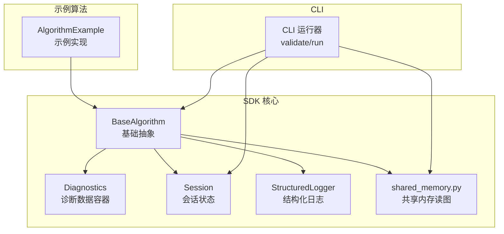
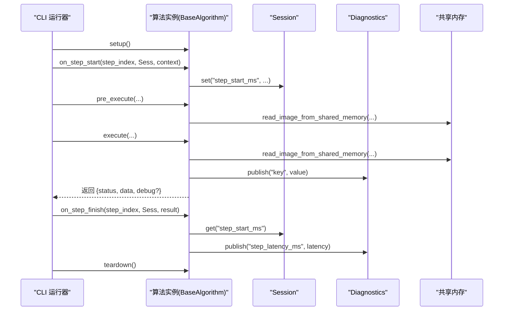
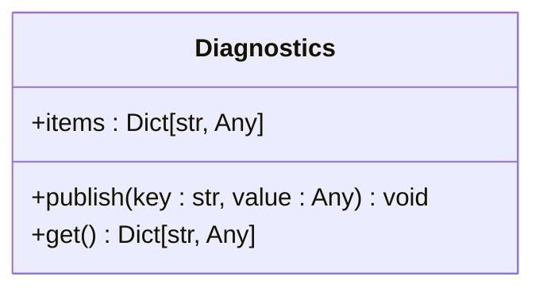
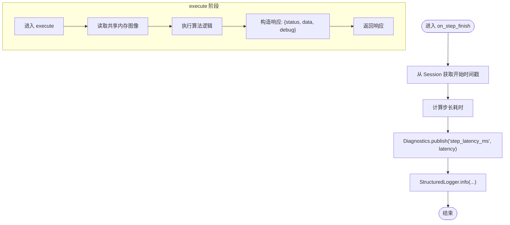
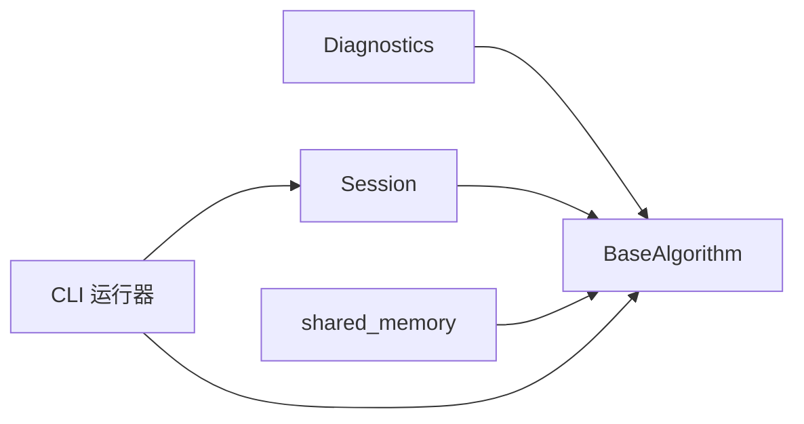

# 诊断信息发布

<cite>
**本文引用的文件列表**
- [diagnostics.py](file://procvision_algorithm_sdk/diagnostics.py)
- [base.py](file://procvision_algorithm_sdk/base.py)
- [session.py](file://procvision_algorithm_sdk/session.py)
- [logger.py](file://procvision_algorithm_sdk/logger.py)
- [cli.py](file://procvision_algorithm_sdk/cli.py)
- [main.py](file://algorithm-example/algorithm_example/main.py)
- [README.md](file://README.md)
- [algorithm_dev_tutorial.md](file://algorithm_dev_tutorial.md)
- [algorithm_dev_quickstart.md](file://algorithm_dev_quickstart.md)
</cite>

## 目录
1. [简介](#简介)
2. [项目结构](#项目结构)
3. [核心组件](#核心组件)
4. [架构总览](#架构总览)
5. [详细组件分析](#详细组件分析)
6. [依赖关系分析](#依赖关系分析)
7. [性能考量](#性能考量)
8. [故障排查指南](#故障排查指南)
9. [结论](#结论)
10. [附录](#附录)

## 简介
本文件围绕 Diagnostics 类的内部机制与使用模式展开，重点阐述其在算法执行过程中对“结构化业务指标”的采集与传递方式，以及与日志记录的区别。文档通过具体示例说明如何在 execute 阶段发布中间结果、置信度分数或性能指标等诊断数据，并解释这些诊断数据如何通过 JSON 响应体返回给主平台，用于可视化与分析。同时给出诊断键名命名规范、数据类型限制与大小控制的最佳实践，帮助开发者安全地利用诊断数据支持远程调试与模型迭代。

## 项目结构
- SDK 核心模块位于 procvision_algorithm_sdk，包含基础抽象、会话状态、诊断、日志与共享内存读图等能力。
- 示例算法位于 algorithm-example，演示了在生命周期钩子中使用 Diagnostics 的典型场景。
- CLI 提供本地验证与运行能力，贯穿 pre_execute/execute 生命周期，最终输出 JSON 结果。

图表来源
- [base.py](file://procvision_algorithm_sdk/base.py#L1-L58)
- [diagnostics.py](file://procvision_algorithm_sdk/diagnostics.py#L1-L12)
- [session.py](file://procvision_algorithm_sdk/session.py#L1-L36)
- [logger.py](file://procvision_algorithm_sdk/logger.py#L1-L24)
- [cli.py](file://procvision_algorithm_sdk/cli.py#L1-L615)
- [main.py](file://algorithm-example/algorithm_example/main.py#L1-L150)

章节来源
- [README.md](file://README.md#L1-L116)
- [cli.py](file://procvision_algorithm_sdk/cli.py#L1-L615)

## 核心组件
- Diagnostics：轻量级字典容器，提供 publish 与 get 方法，用于在算法执行期间收集结构化指标。
- BaseAlgorithm：算法基类，内置 Diagnostics 实例，贯穿生命周期钩子与执行阶段。
- Session：会话状态容器，提供 JSON 可序列化约束的 set/get/delete/exists，保障跨阶段状态安全。
- StructuredLogger：结构化日志输出，面向文本追踪信息，与 Diagnostics 的结构化指标互补。
- shared_memory：提供从共享内存读取图像的能力，作为算法输入数据来源。

章节来源
- [diagnostics.py](file://procvision_algorithm_sdk/diagnostics.py#L1-L12)
- [base.py](file://procvision_algorithm_sdk/base.py#L1-L58)
- [session.py](file://procvision_algorithm_sdk/session.py#L1-L36)
- [logger.py](file://procvision_algorithm_sdk/logger.py#L1-L24)

## 架构总览
Diagnostics 在算法生命周期中扮演“指标采集器”的角色。在 on_step_start/on_step_finish 等钩子中，结合 Session 记录时间戳与状态，计算并发布结构化指标；在 execute 阶段，将诊断数据与业务结果一起封装进 JSON 响应体，由 CLI 或平台消费。

图表来源
- [cli.py](file://procvision_algorithm_sdk/cli.py#L1-L615)
- [base.py](file://procvision_algorithm_sdk/base.py#L1-L58)
- [session.py](file://procvision_algorithm_sdk/session.py#L1-L36)
- [diagnostics.py](file://procvision_algorithm_sdk/diagnostics.py#L1-L12)
- [main.py](file://algorithm-example/algorithm_example/main.py#L1-L150)

## 详细组件分析

### Diagnostics 类
- 设计目标：在算法执行过程中收集结构化指标，支持在任意阶段发布并在最终响应中携带。
- 数据结构：内部维护一个字典 items，键为字符串，值为任意类型。
- 核心方法：
  - publish(key, value)：将键值对存入 items。
  - get()：返回 items 的浅拷贝，避免外部直接修改内部状态。
- 使用建议：
  - 键名采用语义明确的小驼峰命名，避免特殊字符与过长键名。
  - 值类型尽量保持 JSON 可序列化，避免循环引用与不可序列化对象。
  - 控制总量与单键大小，防止内存膨胀与响应过大。

图表来源
- [diagnostics.py](file://procvision_algorithm_sdk/diagnostics.py#L1-L12)

章节来源
- [diagnostics.py](file://procvision_algorithm_sdk/diagnostics.py#L1-L12)

### BaseAlgorithm 与生命周期钩子
- BaseAlgorithm 内置 Diagnostics 实例，便于在各阶段直接使用。
- 生命周期钩子：
  - on_step_start：可在此设置会话状态，如开始时间戳。
  - on_step_finish：可在此计算耗时等指标并发布。
- 执行阶段：
  - pre_execute：准备阶段，返回结构化结果与 debug 字段。
  - execute：核心执行阶段，返回结构化结果与 debug 字段，其中可包含诊断数据。

章节来源
- [base.py](file://procvision_algorithm_sdk/base.py#L1-L58)

### Session 与 JSON 序列化约束
- Session 的 set 方法在写入前尝试进行 JSON 序列化校验，若失败则抛出异常，确保跨阶段状态可被稳定传输。
- get/delete/exists 提供基本的状态查询与清理能力。

章节来源
- [session.py](file://procvision_algorithm_sdk/session.py#L1-L36)

### StructuredLogger 与诊断的区别
- StructuredLogger 输出结构化日志记录，字段包含 level、timestamp_ms 与业务字段，适合文本追踪与审计。
- Diagnostics 存储结构化业务指标，适合性能监控、可视化与分析，二者互补。

章节来源
- [logger.py](file://procvision_algorithm_sdk/logger.py#L1-L24)

### 示例：在 execute 阶段发布诊断数据
- 示例算法在 on_step_finish 中计算步长耗时并发布为诊断指标；在 execute 中返回 debug 字段，其中包含延迟等指标。
- 该模式展示了如何在不同阶段发布不同粒度的诊断数据，并通过 JSON 响应体返回给主平台。

图表来源
- [main.py](file://algorithm-example/algorithm_example/main.py#L1-L150)
- [session.py](file://procvision_algorithm_sdk/session.py#L1-L36)
- [diagnostics.py](file://procvision_algorithm_sdk/diagnostics.py#L1-L12)
- [logger.py](file://procvision_algorithm_sdk/logger.py#L1-L24)

章节来源
- [main.py](file://algorithm-example/algorithm_example/main.py#L1-L150)

### 诊断数据如何通过 JSON 响应体返回给主平台
- CLI 的 run 流程会依次调用 setup/on_step_start/pre_execute/execute/on_step_finish/teardown，并最终返回包含 pre_execute 与 execute 的 JSON。
- execute 的 data 字段可包含 result_status、缺陷框等业务结果，同时可包含 debug 字段承载诊断指标，供主平台解析与可视化。

章节来源
- [cli.py](file://procvision_algorithm_sdk/cli.py#L1-L615)
- [README.md](file://README.md#L1-L116)

## 依赖关系分析
- Diagnostics 与 BaseAlgorithm：Diagnostics 作为 BaseAlgorithm 的成员，贯穿生命周期与执行阶段。
- BaseAlgorithm 与 Session：在生命周期钩子中通过 Session 传递上下文与状态。
- BaseAlgorithm 与 shared_memory：在 pre_execute/execute 中读取图像数据。
- CLI 与 BaseAlgorithm：CLI 负责加载算法、构造 Session 与调用生命周期钩子与执行方法。

图表来源
- [base.py](file://procvision_algorithm_sdk/base.py#L1-L58)
- [diagnostics.py](file://procvision_algorithm_sdk/diagnostics.py#L1-L12)
- [session.py](file://procvision_algorithm_sdk/session.py#L1-L36)
- [cli.py](file://procvision_algorithm_sdk/cli.py#L1-L615)

章节来源
- [base.py](file://procvision_algorithm_sdk/base.py#L1-L58)
- [cli.py](file://procvision_algorithm_sdk/cli.py#L1-L615)

## 性能考量
- 诊断数据体量控制：避免在 execute 中频繁发布大量中间数组或大对象，优先发布聚合指标与统计值。
- 键名与结构设计：采用扁平化键名，减少嵌套层级，降低序列化与传输成本。
- 采样策略：对高频指标采用滑动窗口或抽样发布，避免峰值抖动导致响应过大。
- 内存管理：及时清理不再使用的临时变量，避免闭包持有大对象引用。

## 故障排查指南
- 诊断数据未返回：
  - 检查是否在 on_step_finish 中正确发布诊断数据。
  - 确认 execute 返回的 data.debug 是否包含预期键值。
- JSON 序列化错误：
  - Session.set 会校验值是否可 JSON 序列化，若失败需调整数据类型或结构。
- CLI 输出格式：
  - 使用 --json 参数查看完整 JSON 输出，便于定位问题。

章节来源
- [session.py](file://procvision_algorithm_sdk/session.py#L1-L36)
- [cli.py](file://procvision_algorithm_sdk/cli.py#L1-L615)

## 结论
Diagnostics 为算法执行提供了轻量、灵活且可扩展的结构化指标采集能力。通过在生命周期钩子与 execute 阶段合理发布诊断数据，并将其纳入 JSON 响应体，开发者可以有效支持远程调试与模型迭代。配合 Session 的状态管理与 StructuredLogger 的文本追踪，形成“结构化指标 + 文本日志”的双轨监控体系，提升整体可观测性与可维护性。

## 附录

### 诊断键名命名规范
- 建议采用小驼峰命名，语义清晰，避免特殊字符与过长键名。
- 建议按功能域分层，如 step_、model_、io_ 等前缀区分来源。
- 避免使用保留字或平台关键字，防止冲突。

### 数据类型限制与大小控制最佳实践
- 优先使用 JSON 可序列化类型：字符串、数字、布尔、列表、字典。
- 避免发布大对象（如完整特征向量、原始图像），优先发布统计值（均值、方差、计数）。
- 控制单键大小与总量，必要时进行降采样或分桶聚合。
- 对数组类指标，限定最大长度，避免无限增长。

### 与日志记录的区别
- 诊断数据：结构化业务指标，面向性能、质量与稳定性分析，强调可聚合与可可视化。
- 日志记录：文本追踪信息，面向审计与问题定位，强调可读性与上下文完整性。

章节来源
- [logger.py](file://procvision_algorithm_sdk/logger.py#L1-L24)
- [algorithm_dev_tutorial.md](file://algorithm_dev_tutorial.md#L103-L127)
- [algorithm_dev_quickstart.md](file://algorithm_dev_quickstart.md#L89-L120)