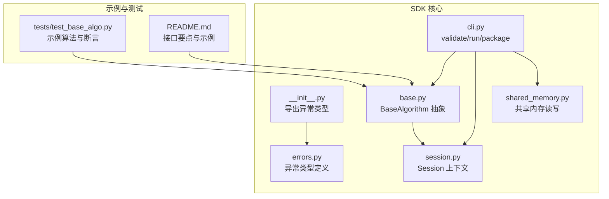
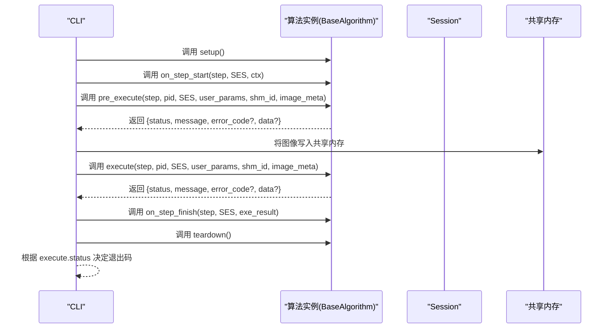
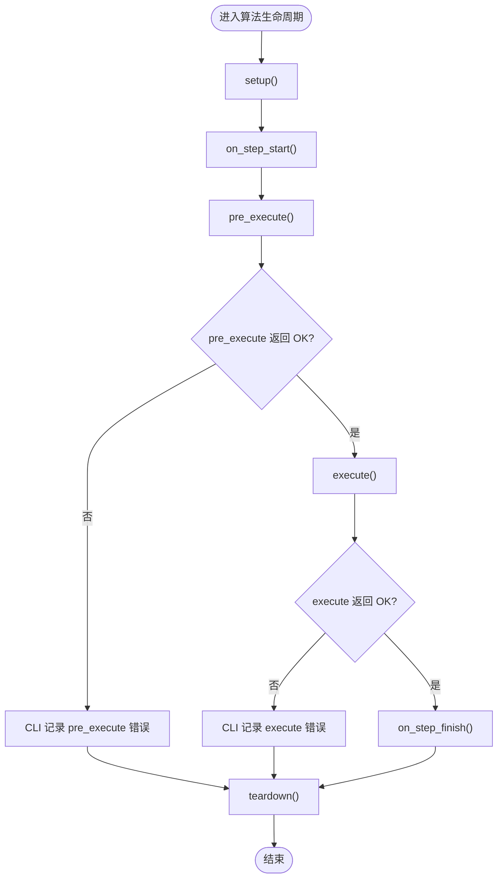
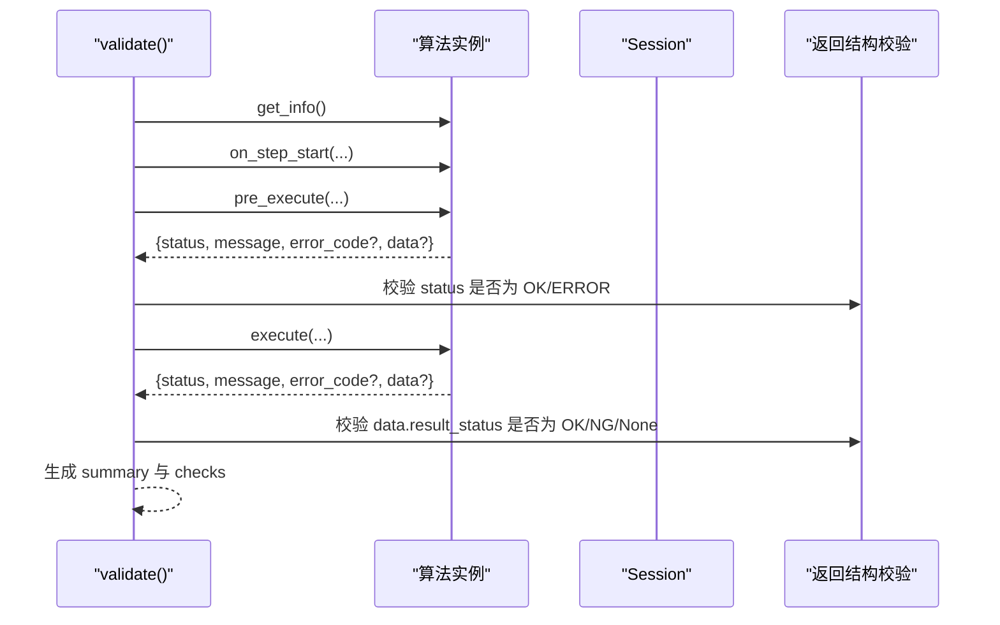
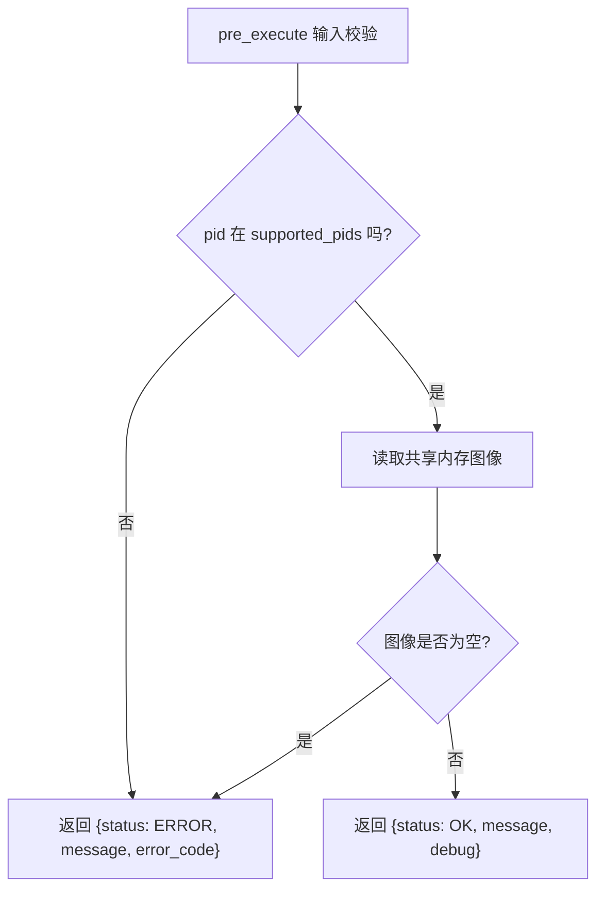
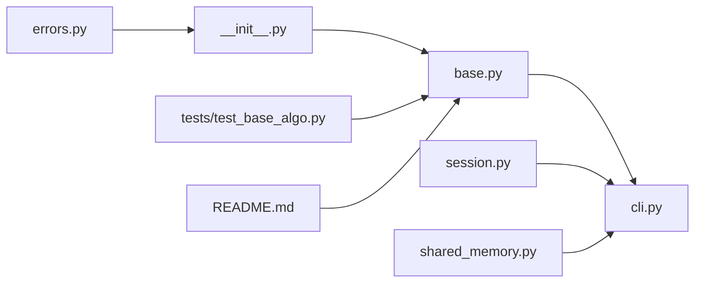

# 错误处理

<cite>
**本文引用的文件列表**
- [errors.py](file://procvision_algorithm_sdk/errors.py)
- [__init__.py](file://procvision_algorithm_sdk/__init__.py)
- [base.py](file://procvision_algorithm_sdk/base.py)
- [cli.py](file://procvision_algorithm_sdk/cli.py)
- [session.py](file://procvision_algorithm_sdk/session.py)
- [shared_memory.py](file://procvision_algorithm_sdk/shared_memory.py)
- [test_base_algo.py](file://tests/test_base_algo.py)
- [README.md](file://README.md)
</cite>

## 目录
1. [简介](#简介)
2. [项目结构](#项目结构)
3. [核心组件](#核心组件)
4. [架构总览](#架构总览)
5. [详细组件分析](#详细组件分析)
6. [依赖关系分析](#依赖关系分析)
7. [性能考量](#性能考量)
8. [故障排查指南](#故障排查指南)
9. [结论](#结论)
10. [附录](#附录)

## 简介
本章节系统性阐述 ProcVision 算法 SDK 中的错误处理机制，聚焦四种自定义异常类型：RecoverableError、FatalError、GPUOutOfMemoryError、ProgramError。我们将结合算法开发流程，说明在 pre_execute 与 execute 方法中如何正确返回错误状态以实现与主平台的通信；并给出最佳实践、生命周期影响、CLI 工具验证与运行结果的关系，以及平台侧的错误恢复策略。最后提供初学者误用规避指南与高级用户的错误注入测试建议。

## 项目结构
围绕错误处理的关键模块包括：
- 异常定义：procvision_algorithm_sdk/errors.py
- 导出入口：procvision_algorithm_sdk/__init__.py
- 算法基类与生命周期钩子：procvision_algorithm_sdk/base.py
- CLI 校验与运行：procvision_algorithm_sdk/cli.py
- 会话与上下文：procvision_algorithm_sdk/session.py
- 共享内存读写：procvision_algorithm_sdk/shared_memory.py
- 示例与测试：tests/test_base_algo.py、README.md

图表来源
- [errors.py](file://procvision_algorithm_sdk/errors.py#L1-L14)
- [__init__.py](file://procvision_algorithm_sdk/__init__.py#L1-L20)
- [base.py](file://procvision_algorithm_sdk/base.py#L1-L58)
- [cli.py](file://procvision_algorithm_sdk/cli.py#L1-L615)
- [session.py](file://procvision_algorithm_sdk/session.py#L1-L36)
- [shared_memory.py](file://procvision_algorithm_sdk/shared_memory.py#L1-L53)
- [test_base_algo.py](file://tests/test_base_algo.py#L1-L65)
- [README.md](file://README.md#L1-L116)

章节来源
- [errors.py](file://procvision_algorithm_sdk/errors.py#L1-L14)
- [__init__.py](file://procvision_algorithm_sdk/__init__.py#L1-L20)
- [base.py](file://procvision_algorithm_sdk/base.py#L1-L58)
- [cli.py](file://procvision_algorithm_sdk/cli.py#L1-L615)
- [session.py](file://procvision_algorithm_sdk/session.py#L1-L36)
- [shared_memory.py](file://procvision_algorithm_sdk/shared_memory.py#L1-L53)
- [test_base_algo.py](file://tests/test_base_algo.py#L1-L65)
- [README.md](file://README.md#L1-L116)

## 核心组件
- RecoverableError：表示可恢复错误，通常由算法侧捕获并转换为标准返回结构中的 ERROR 状态，以便平台进行重试或降级处理。
- FatalError：表示致命错误，通常意味着算法无法继续执行，应通过 ERROR 状态上报，平台据此终止流程并记录严重问题。
- GPUOutOfMemoryError：表示 GPU 内存不足导致的错误，属于可恢复但需要平台侧采取特定措施（如切换 CPU、降低分辨率、减少批大小等）。
- ProgramError：表示程序逻辑错误或非法状态，通常由算法实现不当引起，应通过 ERROR 状态上报并要求修正。

这些异常类型在 SDK 中以类的形式存在，算法开发者可在实现中抛出或捕获，但更推荐通过返回结构中的 status 字段与 message 字段向平台传达错误信息。SDK 在 __init__.py 中导出了这四个异常类型，便于外部使用。

章节来源
- [errors.py](file://procvision_algorithm_sdk/errors.py#L1-L14)
- [__init__.py](file://procvision_algorithm_sdk/__init__.py#L1-L20)

## 架构总览
SDK 的错误处理贯穿 CLI 校验、算法生命周期与平台通信。CLI 的 validate 流程会调用算法的 get_info、pre_execute、execute 等方法，并对返回结构进行严格校验；run 流程则实际执行算法并输出结果。算法通过返回字典中的 status 字段表达 OK/ERROR，配合 message、error_code、data 等字段完成与平台的约定式通信。

图表来源
- [cli.py](file://procvision_algorithm_sdk/cli.py#L1-L615)
- [base.py](file://procvision_algorithm_sdk/base.py#L1-L58)
- [session.py](file://procvision_algorithm_sdk/session.py#L1-L36)
- [shared_memory.py](file://procvision_algorithm_sdk/shared_memory.py#L1-L53)

## 详细组件分析

### 异常类型与用途
- RecoverableError：适用于可恢复错误，例如资源暂时不可用、网络抖动、临时性计算中断等。算法应将其转换为 ERROR 返回结构，平台可选择重试或降级。
- FatalError：适用于致命错误，例如配置缺失、模型加载失败、输入格式不合法且无法修复等。平台应终止流程并记录严重错误。
- GPUOutOfMemoryError：适用于 GPU 内存不足，平台可切换 CPU、调整分辨率或批大小等策略进行恢复。
- ProgramError：适用于程序逻辑错误，例如参数越界、状态机非法、返回结构不符合规范等。平台应拒绝该次执行并要求修正。

这些异常类型在 SDK 中以类形式存在，便于在算法实现中进行类型区分与捕获。SDK 还提供了 __all__ 导出，确保外部可直接导入使用。

章节来源
- [errors.py](file://procvision_algorithm_sdk/errors.py#L1-L14)
- [__init__.py](file://procvision_algorithm_sdk/__init__.py#L1-L20)

### 生命周期与错误传播
- setup/teardown：这两个生命周期钩子用于资源准备与清理。若发生异常，CLI 的 run/validate 会捕获并忽略，不会影响整体流程的继续进行。算法应尽量保证这两个阶段的健壮性。
- on_step_start/on_step_finish：用于单步执行前后的钩子，异常会被 CLI 捕获并忽略，不影响主流程。
- pre_execute：负责预处理与前置校验。若返回 status=ERROR，则 CLI 的 validate 会记录失败；run 会根据返回结构决定后续流程。
- execute：负责核心执行。返回 data.result_status 可为 OK/NG；若返回 status=ERROR，则 CLI 的 run 会将退出码置为非零，表示执行失败。

图表来源
- [cli.py](file://procvision_algorithm_sdk/cli.py#L1-L615)
- [base.py](file://procvision_algorithm_sdk/base.py#L1-L58)

章节来源
- [cli.py](file://procvision_algorithm_sdk/cli.py#L1-L615)
- [base.py](file://procvision_algorithm_sdk/base.py#L1-L58)

### CLI 校验与运行结果
- validate：会调用 get_info、pre_execute、execute，并对返回结构进行严格校验。若 pre_execute/execute 的 status 不在允许集合内，或 data.result_status 不符合规范，validate 会标记为 FAIL。validate 的返回结构包含 summary 与 checks，其中 checks 记录每个校验项的结果与消息。
- run：会实际执行算法，将图像写入共享内存，然后调用 pre_execute 与 execute，并输出结果。CLI 会根据 execute 的 status 决定退出码，OK 为 0，否则为非零。

图表来源
- [cli.py](file://procvision_algorithm_sdk/cli.py#L1-L615)

章节来源
- [cli.py](file://procvision_algorithm_sdk/cli.py#L1-L615)

### 共享内存与图像读取
共享内存读写接口用于在算法与平台之间传递图像数据。当 image_meta 的宽高无效或共享内存中无对应数据时，读取函数会返回 None 或默认零矩阵，算法应在 pre_execute/execute 中对 None 进行判断并返回 ERROR。

章节来源
- [shared_memory.py](file://procvision_algorithm_sdk/shared_memory.py#L1-L53)

### 示例算法与最佳实践
示例算法展示了如何在 pre_execute/execute 中进行错误处理：
- 在 pre_execute 中校验 pid 是否在 supported_pids 中，若不在则返回 ERROR；同时读取共享内存图像，若为空则返回 ERROR。
- 在 execute 中同样进行图像有效性检查，并根据阈值返回 OK/NG 与缺陷矩形等数据。

图表来源
- [test_base_algo.py](file://tests/test_base_algo.py#L1-L65)

章节来源
- [test_base_algo.py](file://tests/test_base_algo.py#L1-L65)

## 依赖关系分析
- errors.py 定义了四种异常类型，__init__.py 将其导出，供外部使用。
- base.py 定义了 BaseAlgorithm 抽象，算法需实现 get_info、pre_execute、execute 等方法。
- cli.py 依赖 base.py、session.py、shared_memory.py 来完成 validate/run/package。
- shared_memory.py 与 session.py 分别提供图像读写与上下文管理能力。
- tests/test_base_algo.py 展示了示例算法的实现方式与断言。

图表来源
- [errors.py](file://procvision_algorithm_sdk/errors.py#L1-L14)
- [__init__.py](file://procvision_algorithm_sdk/__init__.py#L1-L20)
- [base.py](file://procvision_algorithm_sdk/base.py#L1-L58)
- [cli.py](file://procvision_algorithm_sdk/cli.py#L1-L615)
- [session.py](file://procvision_algorithm_sdk/session.py#L1-L36)
- [shared_memory.py](file://procvision_algorithm_sdk/shared_memory.py#L1-L53)
- [test_base_algo.py](file://tests/test_base_algo.py#L1-L65)
- [README.md](file://README.md#L1-L116)

章节来源
- [errors.py](file://procvision_algorithm_sdk/errors.py#L1-L14)
- [__init__.py](file://procvision_algorithm_sdk/__init__.py#L1-L20)
- [base.py](file://procvision_algorithm_sdk/base.py#L1-L58)
- [cli.py](file://procvision_algorithm_sdk/cli.py#L1-L615)
- [session.py](file://procvision_algorithm_sdk/session.py#L1-L36)
- [shared_memory.py](file://procvision_algorithm_sdk/shared_memory.py#L1-L53)
- [test_base_algo.py](file://tests/test_base_algo.py#L1-L65)
- [README.md](file://README.md#L1-L116)

## 性能考量
- 错误处理不应引入额外的 IO 或阻塞操作。pre_execute/execute 应尽量保持轻量，避免在错误分支中做昂贵的计算。
- 当出现 GPUOutOfMemoryError 时，平台可能需要切换到 CPU 或降低分辨率，这会影响吞吐量。算法应尽量避免一次性处理超大图像。
- 在 validate 流程中，CLI 会对 get_info、pre_execute、execute 进行多次调用，算法应保证这些方法的执行时间稳定，避免因错误处理导致超时。

## 故障排查指南
- validate 失败：检查返回结构是否包含 status、message；确认 data.result_status 是否为 OK/NG/None；核对 supported_pids 与 get_info 中的列表一致。
- run 失败：查看 execute 的 status 是否为 OK；若为 ERROR，检查 message 与 error_code；确认共享内存中是否存在有效图像数据。
- 生命周期异常：setup/teardown/on_step_start/on_step_finish 中的异常会被 CLI 捕获并忽略，不会影响主流程，但可能影响日志与诊断数据。
- 共享内存问题：确认 image_meta 的宽高大于 0；确认 shared_mem_id 与写入时一致；确认图像格式为 JPEG。

章节来源
- [cli.py](file://procvision_algorithm_sdk/cli.py#L1-L615)
- [shared_memory.py](file://procvision_algorithm_sdk/shared_memory.py#L1-L53)

## 结论
ProcVision 算法 SDK 通过约定式的返回结构（status/message/error_code/data）与生命周期钩子，实现了与平台的清晰通信。四种自定义异常类型为算法侧提供了语义化标识，但更推荐通过返回结构向平台传达错误信息。CLI 的 validate 与 run 严格校验算法实现，确保交付质量。平台侧可根据错误类型采取不同的恢复策略，如重试、降级或终止流程。

## 附录

### 异常类型与触发场景对照
- RecoverableError：资源暂时不可用、网络抖动、临时性中断等。建议转换为 ERROR 返回结构，携带 message 与可选 error_code。
- FatalError：配置缺失、模型加载失败、输入格式不合法且无法修复等。建议转换为 ERROR 返回结构，并在 message 中明确原因。
- GPUOutOfMemoryError：GPU 内存不足。建议转换为 ERROR 返回结构，并在 message 中提示资源限制；平台可切换 CPU 或降低分辨率。
- ProgramError：程序逻辑错误或非法状态。建议转换为 ERROR 返回结构，并在 message 中指出具体问题，要求修正。

### 在 pre_execute/execute 中抛出异常的最佳实践
- 不直接抛出异常给平台：优先返回 {status: "ERROR", message, error_code?}。
- 明确错误分类：根据错误性质选择合适的 error_code，便于平台识别与恢复。
- 保持返回结构一致：确保包含 status、message；必要时包含 data.result_status、defect_rects、debug 等字段。
- 在 pre_execute 中尽早失败：校验 pid、图像有效性等前置条件，失败即返回 ERROR。
- 在 execute 中区分 OK/NG：根据业务判定设置 data.result_status，并在 NG 时提供 ng_reason 与缺陷信息。

### 生命周期影响
- setup/teardown：异常被 CLI 捕获并忽略，不影响主流程，但会影响资源释放与诊断。
- on_step_start/on_step_finish：异常被 CLI 捕获并忽略，不影响主流程，但会影响日志与上下文。
- pre_execute：返回 ERROR 会导致 validate 标记失败；run 会记录错误并可能终止后续流程。
- execute：返回 ERROR 会使 run 退出码非零；返回 OK/NG 影响最终结果与平台决策。

### 与 CLI 工具验证和运行结果的关联
- validate：严格校验 get_info、pre_execute、execute 的返回结构；失败会体现在 summary 与 checks 中。
- run：实际执行算法，输出 pre_execute 与 execute 的结果；根据 execute.status 设置退出码。

### 平台侧的错误恢复策略建议
- 可恢复错误（RecoverableError）：平台可尝试重试、降级或切换资源。
- 致命错误（FatalError）：平台应终止流程并记录严重错误，避免进一步损失。
- GPU 内存不足（GPUOutOfMemoryError）：平台可切换到 CPU、降低分辨率或批大小。
- 程序错误（ProgramError）：平台应拒绝执行并要求修正，避免污染数据。

### 初学者误用规避指南
- 不要直接抛出异常：使用返回结构表达错误，避免破坏平台的控制流。
- 不要忽略错误码：为每种错误提供明确的 error_code，便于平台识别。
- 不要在 pre_execute 中做昂贵操作：保持轻量，失败即返回 ERROR。
- 不要混淆 OK/NG：仅在 execute 中设置 data.result_status，pre_execute 仅返回 OK/ERROR。

### 高级用户错误注入测试建议
- 使用 CLI 的 validate：编写多组输入（pid 不存在、图像为空、参数非法等），验证返回结构是否符合预期。
- 使用 CLI 的 run：构造不同场景（正常、异常、边界条件），观察退出码与输出。
- 在单元测试中模拟异常：通过 mock 或替换共享内存数据，验证算法对各种错误的处理。
- 使用 Session 的 set/get：在生命周期钩子中注入状态，验证算法对上下文变化的响应。