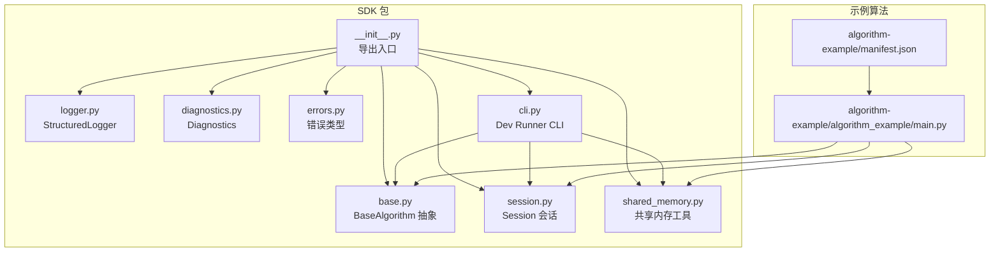
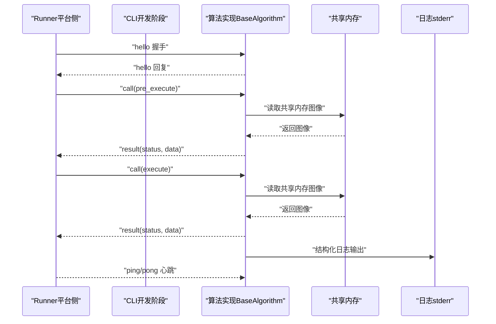
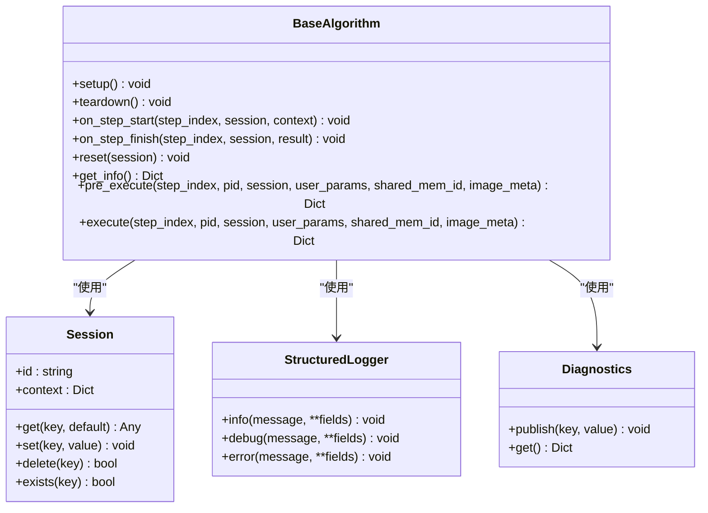
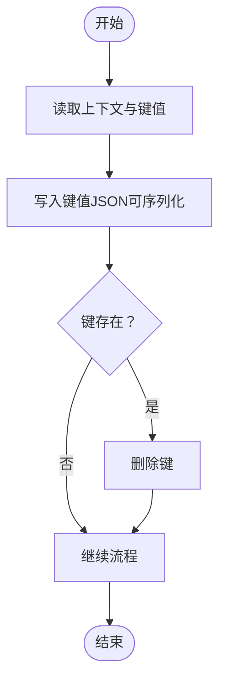
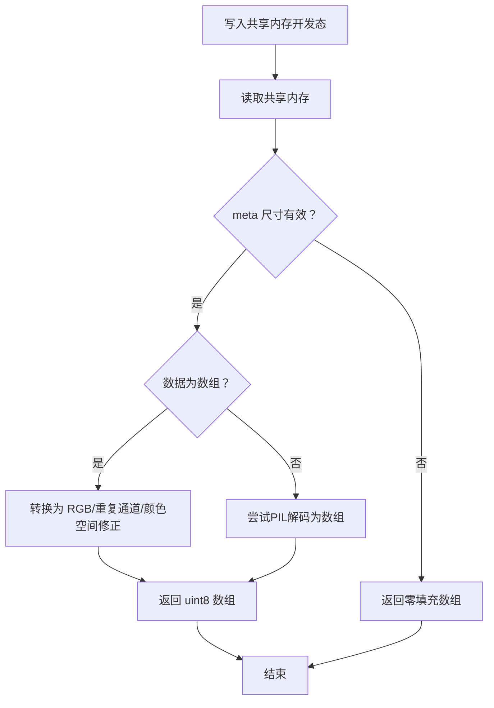
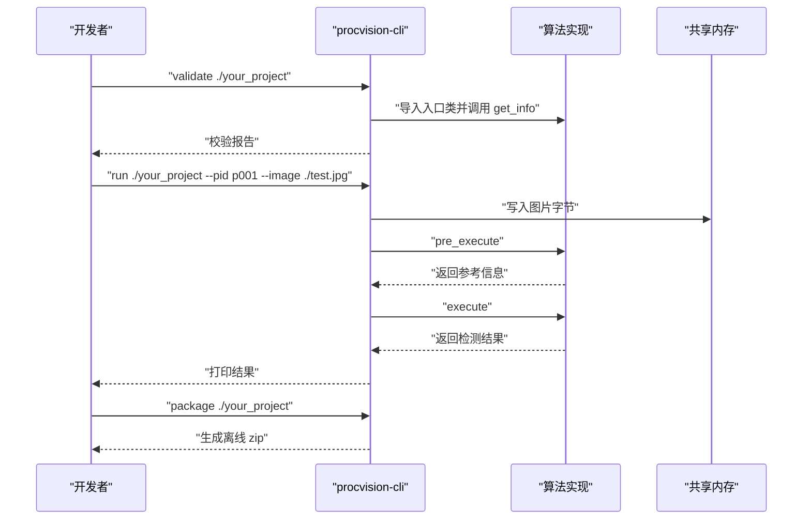
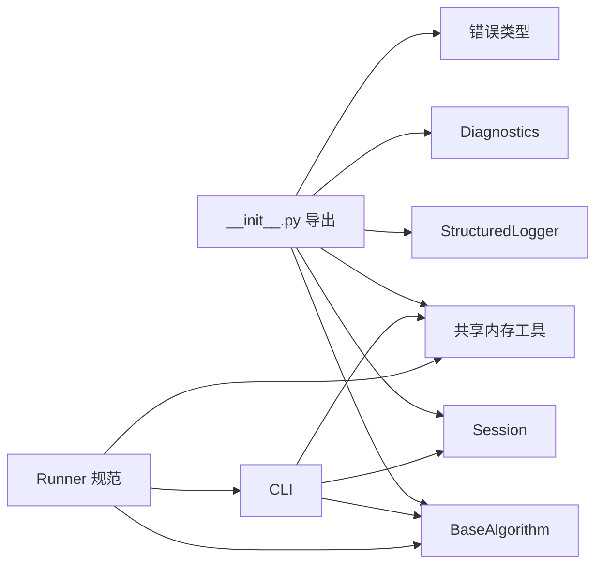

# 快速入门

<cite>
**本文引用的文件**
- [README.md](file://README.md)
- [pyproject.toml](file://pyproject.toml)
- [procvision_algorithm_sdk/__init__.py](file://procvision_algorithm_sdk/__init__.py)
- [procvision_algorithm_sdk/base.py](file://procvision_algorithm_sdk/base.py)
- [procvision_algorithm_sdk/session.py](file://procvision_algorithm_sdk/session.py)
- [procvision_algorithm_sdk/shared_memory.py](file://procvision_algorithm_sdk/shared_memory.py)
- [procvision_algorithm_sdk/logger.py](file://procvision_algorithm_sdk/logger.py)
- [procvision_algorithm_sdk/diagnostics.py](file://procvision_algorithm_sdk/diagnostics.py)
- [procvision_algorithm_sdk/errors.py](file://procvision_algorithm_sdk/errors.py)
- [procvision_algorithm_sdk/cli.py](file://procvision_algorithm_sdk/cli.py)
- [algorithm-example/manifest.json](file://algorithm-example/manifest.json)
- [algorithm-example/algorithm_example/main.py](file://algorithm-example/algorithm_example/main.py)
- [tests/test_import.py](file://tests/test_import.py)
- [tests/test_cli.py](file://tests/test_cli.py)
- [spec.md](file://spec.md)
- [runner_spec.md](file://runner_spec.md)
</cite>

## 目录
1. [简介](#简介)
2. [项目结构](#项目结构)
3. [核心组件](#核心组件)
4. [架构总览](#架构总览)
5. [详细组件分析](#详细组件分析)
6. [依赖关系分析](#依赖关系分析)
7. [性能考虑](#性能考虑)
8. [故障排查指南](#故障排查指南)
9. [结论](#结论)
10. [附录](#附录)

## 简介
本快速入门面向工业视觉平台 ProcVision 的算法开发者，帮助你从零开始掌握 ProcVision Algorithm SDK 的安装、开发、调试与交付流程。文档涵盖 SDK 的目的、架构、与 Runner 的交互契约、核心接口与使用模式，并提供从入门到进阶的实践示例与可视化图示，确保你能快速构建可离线部署、可稳定运行的算法包。

## 项目结构
SDK 以 Python 包形式提供，核心模块围绕“算法抽象基类 + 会话 + 共享内存 + 日志 + 诊断 + CLI 开发工具”组织。示例算法包展示了如何实现 get_info、pre_execute、execute 以及生命周期钩子。

**图表来源**
- [procvision_algorithm_sdk/__init__.py](file://procvision_algorithm_sdk/__init__.py#L1-L20)
- [procvision_algorithm_sdk/base.py](file://procvision_algorithm_sdk/base.py#L1-L58)
- [procvision_algorithm_sdk/session.py](file://procvision_algorithm_sdk/session.py#L1-L36)
- [procvision_algorithm_sdk/shared_memory.py](file://procvision_algorithm_sdk/shared_memory.py#L1-L53)
- [procvision_algorithm_sdk/logger.py](file://procvision_algorithm_sdk/logger.py#L1-L24)
- [procvision_algorithm_sdk/diagnostics.py](file://procvision_algorithm_sdk/diagnostics.py#L1-L12)
- [procvision_algorithm_sdk/errors.py](file://procvision_algorithm_sdk/errors.py#L1-L14)
- [procvision_algorithm_sdk/cli.py](file://procvision_algorithm_sdk/cli.py#L1-L615)
- [algorithm-example/manifest.json](file://algorithm-example/manifest.json#L1-L25)
- [algorithm-example/algorithm_example/main.py](file://algorithm-example/algorithm_example/main.py#L1-L150)

**章节来源**
- [README.md](file://README.md#L1-L116)
- [pyproject.toml](file://pyproject.toml#L1-L36)

## 核心组件
- BaseAlgorithm：算法抽象基类，定义 get_info、pre_execute、execute 三个必须实现的方法，以及可选的 setup/teardown/on_step_start/on_step_finish/reset 生命周期钩子。
- Session：会话上下文，提供 id/context 与键值存储（get/set/delete/exists），用于跨步骤共享状态。
- 共享内存工具：提供读写共享内存的便捷方法，支持开发态写入与读取，返回 numpy 数组或零填充数组。
- StructuredLogger：结构化日志输出，统一字段（level、timestamp_ms、message 等）。
- Diagnostics：诊断数据收集器，用于上报置信度、耗时等指标。
- 错误类型：RecoverableError、FatalError、GPUOutOfMemoryError、ProgramError，用于区分可恢复与致命错误。
- CLI（Dev Runner）：提供 validate/run/package/init 等子命令，用于校验算法包、本地模拟运行与离线交付打包。

**章节来源**
- [procvision_algorithm_sdk/base.py](file://procvision_algorithm_sdk/base.py#L1-L58)
- [procvision_algorithm_sdk/session.py](file://procvision_algorithm_sdk/session.py#L1-L36)
- [procvision_algorithm_sdk/shared_memory.py](file://procvision_algorithm_sdk/shared_memory.py#L1-L53)
- [procvision_algorithm_sdk/logger.py](file://procvision_algorithm_sdk/logger.py#L1-L24)
- [procvision_algorithm_sdk/diagnostics.py](file://procvision_algorithm_sdk/diagnostics.py#L1-L12)
- [procvision_algorithm_sdk/errors.py](file://procvision_algorithm_sdk/errors.py#L1-L14)
- [procvision_algorithm_sdk/cli.py](file://procvision_algorithm_sdk/cli.py#L1-L615)

## 架构总览
SDK 与 Runner 的交互遵循严格的协议与契约，Runner 负责进程管理、通信协议、共享内存写入与调度执行；SDK 提供算法实现所需的基础设施与开发工具。

**图表来源**
- [runner_spec.md](file://runner_spec.md#L1-L283)
- [procvision_algorithm_sdk/cli.py](file://procvision_algorithm_sdk/cli.py#L1-L615)
- [procvision_algorithm_sdk/shared_memory.py](file://procvision_algorithm_sdk/shared_memory.py#L1-L53)
- [procvision_algorithm_sdk/logger.py](file://procvision_algorithm_sdk/logger.py#L1-L24)

## 详细组件分析

### BaseAlgorithm 类与生命周期
- 设计要点
  - 构造函数不绑定 PID，支持多产品型号；重量级资源在 setup 中初始化。
  - 生命周期钩子：setup/teardown/on_step_start/on_step_finish/reset，用于进程级与步骤级的资源管理与统计。
  - get_info 返回算法元信息与步骤 schema，必须与 manifest.json 的 supported_pids 一致。
  - pre_execute 用于产出参考信息（如 calibration_rects），不返回业务判定。
  - execute 返回业务判定（result_status），NG 时需提供 ng_reason 与缺陷框列表。

**图表来源**
- [procvision_algorithm_sdk/base.py](file://procvision_algorithm_sdk/base.py#L1-L58)
- [procvision_algorithm_sdk/session.py](file://procvision_algorithm_sdk/session.py#L1-L36)
- [procvision_algorithm_sdk/logger.py](file://procvision_algorithm_sdk/logger.py#L1-L24)
- [procvision_algorithm_sdk/diagnostics.py](file://procvision_algorithm_sdk/diagnostics.py#L1-L12)

**章节来源**
- [procvision_algorithm_sdk/base.py](file://procvision_algorithm_sdk/base.py#L1-L58)
- [spec.md](file://spec.md#L1-L799)

### Session 会话与状态共享
- Session 提供只读 context 与可序列化 KV 存储 state_store，用于跨步骤共享数据。
- set 会进行 JSON 可序列化校验，避免不可持久化的对象。
- reset 用于清理本次检测流程内的临时状态。

**图表来源**
- [procvision_algorithm_sdk/session.py](file://procvision_algorithm_sdk/session.py#L1-L36)

**章节来源**
- [procvision_algorithm_sdk/session.py](file://procvision_algorithm_sdk/session.py#L1-L36)

### 共享内存与图像读取
- Runner 将图像以 JPEG 写入共享内存，SDK 提供读取工具，返回 numpy 数组（H x W x 3）。
- 开发态支持 dev_write_image_to_shared_memory，便于本地模拟运行。
- 若 meta 尺寸无效或读取失败，返回零填充数组，便于上层容错。

**图表来源**
- [procvision_algorithm_sdk/shared_memory.py](file://procvision_algorithm_sdk/shared_memory.py#L1-L53)

**章节来源**
- [procvision_algorithm_sdk/shared_memory.py](file://procvision_algorithm_sdk/shared_memory.py#L1-L53)

### 结构化日志与诊断
- StructuredLogger 输出统一字段（level、timestamp_ms、message 等），避免直接 print。
- Diagnostics 用于上报调试指标（如耗时、置信度），便于 UI 展示与远程排查。

**章节来源**
- [procvision_algorithm_sdk/logger.py](file://procvision_algorithm_sdk/logger.py#L1-L24)
- [procvision_algorithm_sdk/diagnostics.py](file://procvision_algorithm_sdk/diagnostics.py#L1-L12)

### CLI（Dev Runner）与常见用例
- 校验算法包：validate 子命令检查 manifest、入口类、supported_pids 一致性与返回结构。
- 本地模拟运行：run 子命令写入本地图片到共享内存，调用 pre_execute/execute 并输出结果。
- 离线交付打包：package 子命令下载 wheels、清洗 requirements、打包 zip。
- 初始化脚手架：init 子命令生成 manifest 与包源码目录，便于快速起步。

**图表来源**
- [procvision_algorithm_sdk/cli.py](file://procvision_algorithm_sdk/cli.py#L1-L615)

**章节来源**
- [procvision_algorithm_sdk/cli.py](file://procvision_algorithm_sdk/cli.py#L1-L615)
- [README.md](file://README.md#L1-L116)

### 示例算法：AlgorithmExample
- 展示了 get_info 返回步骤 schema、pre_execute 返回 calibration_rects、execute 返回 result_status 与缺陷框。
- 使用 Session 记录步骤耗时，使用 Diagnostics 上报指标，使用 Logger 输出结构化日志。

**章节来源**
- [algorithm-example/algorithm_example/main.py](file://algorithm-example/algorithm_example/main.py#L1-L150)
- [algorithm-example/manifest.json](file://algorithm-example/manifest.json#L1-L25)

## 依赖关系分析
- SDK 包导出入口集中于 __init__.py，统一暴露 BaseAlgorithm、Session、共享内存工具、日志、诊断与错误类型。
- CLI 依赖 SDK 的 BaseAlgorithm、Session 与共享内存工具，用于本地模拟运行与校验。
- Runner 规范定义了与 SDK 的协议契约，Runner 通过 stdin/stdout 与算法进程通信，共享内存由 Runner 写入，SDK 读取。

**图表来源**
- [procvision_algorithm_sdk/__init__.py](file://procvision_algorithm_sdk/__init__.py#L1-L20)
- [procvision_algorithm_sdk/cli.py](file://procvision_algorithm_sdk/cli.py#L1-L615)
- [runner_spec.md](file://runner_spec.md#L1-L283)

**章节来源**
- [procvision_algorithm_sdk/__init__.py](file://procvision_algorithm_sdk/__init__.py#L1-L20)
- [runner_spec.md](file://runner_spec.md#L1-L283)

## 性能考虑
- 图像读取：优先使用共享内存读取，避免落盘；在 pre_execute 中尽量减少解码与预处理开销。
- 会话状态：Session 仅在单次检测流程内有效，避免在 state_store 中存储大量数据。
- 耗时统计：使用 Diagnostics 上报关键指标（如 latency_ms），便于定位瓶颈。
- 资源管理：setup 中加载模型与资源，teardown 中释放；避免在 execute 中做重量级初始化。

[本节为通用指导，不直接分析具体文件]

## 故障排查指南
- 校验失败
  - 检查 manifest.json 是否存在、字段是否完整、入口类是否可导入、supported_pids 与 get_info 是否一致。
  - 使用 validate 子命令查看详细报告，关注 pre_execute/execute 返回结构与 result_status 合规性。
- 运行失败
  - 确认 pid 在 supported_pids 中；检查 image_meta 尺寸与 camera_id；确保 shared_mem_id 与 Runner 注入一致。
  - 查看结构化日志（stderr），定位错误码与 message。
- 超时与心跳
  - Runner 会在超时后终止进程；确保算法在 pre_execute/execute 中尽快返回，心跳线程不阻塞。
- 离线交付
  - 使用 package 子命令生成离线 zip，确保 wheels 与 requirements 一致；必要时启用 auto-freeze 自动生成 requirements。

**章节来源**
- [procvision_algorithm_sdk/cli.py](file://procvision_algorithm_sdk/cli.py#L1-L615)
- [tests/test_cli.py](file://tests/test_cli.py#L1-L20)
- [runner_spec.md](file://runner_spec.md#L1-L283)

## 结论
通过本快速入门，你已经了解了 ProcVision Algorithm SDK 的核心组件、与 Runner 的交互协议、开发与交付流程。建议结合示例算法包与 CLI 工具，逐步完善你的算法实现，确保 get_info 与 manifest.json 一致、pre_execute/execute 返回结构合规、日志与诊断指标完备，并通过 validate 与 run 子命令完成自测，最后使用 package 生成离线交付包。

[本节为总结性内容，不直接分析具体文件]

## 附录

### 常用命令与用法
- 安装 SDK：pip install procvision_algorithm_sdk
- 校验算法包：procvision-cli validate ./your_project
- 本地模拟运行：procvision-cli run ./your_project --pid p001 --image ./test.jpg
- 离线交付打包：procvision-cli package ./your_project
- 初始化脚手架：procvision-cli init "My Algo" --pids p001,p002

**章节来源**
- [README.md](file://README.md#L1-L116)
- [procvision_algorithm_sdk/cli.py](file://procvision_algorithm_sdk/cli.py#L1-L615)

### 公共接口与参数说明
- BaseAlgorithm
  - get_info(): 返回 name/version/description/supported_pids/steps
  - pre_execute(step_index, pid, session, user_params, shared_mem_id, image_meta): 返回 status/message/data/debug
  - execute(step_index, pid, session, user_params, shared_mem_id, image_meta): 返回 status/data.result_status/ng_reason/defect_rects/debug
- Session
  - id/context/get/set/delete/exists
- 共享内存
  - read_image_from_shared_memory(shared_mem_id, image_meta): 返回 numpy 数组
  - dev_write_image_to_shared_memory(shared_mem_id, image_bytes): 开发态写入
- 日志与诊断
  - StructuredLogger.info/debug/error
  - Diagnostics.publish/get

**章节来源**
- [procvision_algorithm_sdk/base.py](file://procvision_algorithm_sdk/base.py#L1-L58)
- [procvision_algorithm_sdk/session.py](file://procvision_algorithm_sdk/session.py#L1-L36)
- [procvision_algorithm_sdk/shared_memory.py](file://procvision_algorithm_sdk/shared_memory.py#L1-L53)
- [procvision_algorithm_sdk/logger.py](file://procvision_algorithm_sdk/logger.py#L1-L24)
- [procvision_algorithm_sdk/diagnostics.py](file://procvision_algorithm_sdk/diagnostics.py#L1-L12)
- [spec.md](file://spec.md#L1-L799)