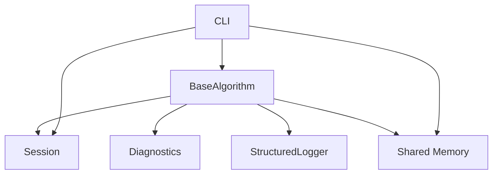
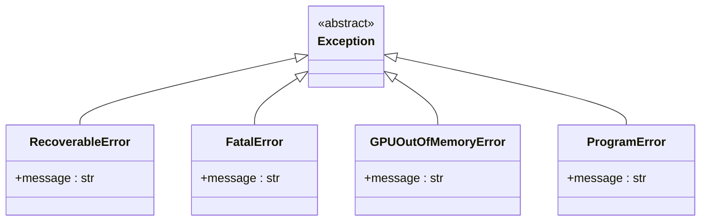
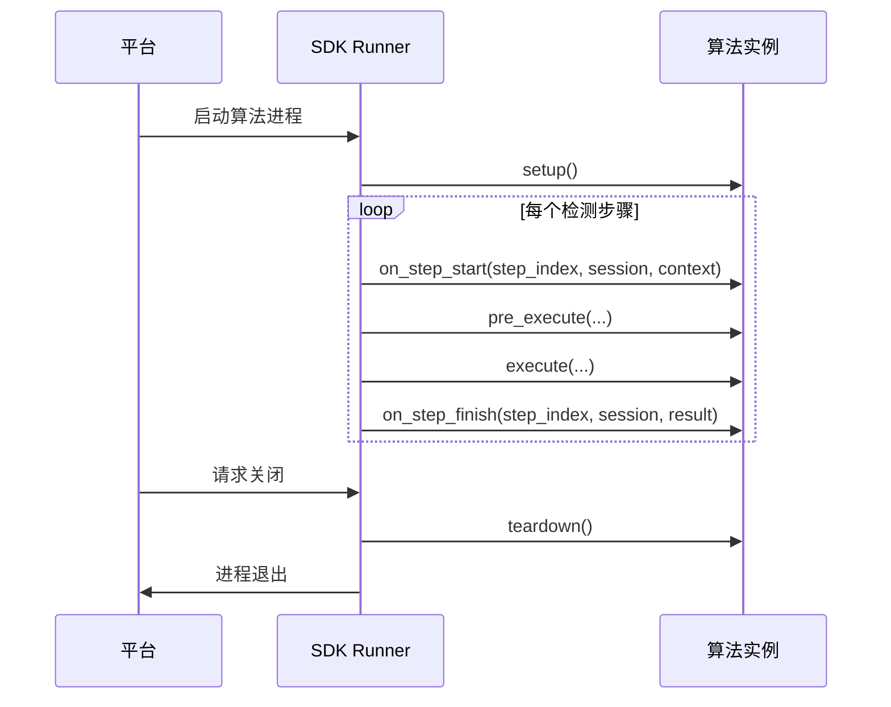

# 故障排除

<cite>
**本文档引用的文件**  
- [errors.py](file://procvision_algorithm_sdk/errors.py)
- [diagnostics.py](file://procvision_algorithm_sdk/diagnostics.py)
- [base.py](file://procvision_algorithm_sdk/base.py)
- [session.py](file://procvision_algorithm_sdk/session.py)
- [logger.py](file://procvision_algorithm_sdk/logger.py)
- [shared_memory.py](file://procvision_algorithm_sdk/shared_memory.py)
- [cli.py](file://procvision_algorithm_sdk/cli.py)
- [README.md](file://README.md)
- [algorithm_dev_tutorial.md](file://algorithm_dev_tutorial.md)
- [spec.md](file://spec.md)
- [algorithm-example/manifest.json](file://algorithm-example/manifest.json)
- [algorithm_example/main.py](file://algorithm-example/algorithm_example/main.py)
- [test_cli.py](file://tests/test_cli.py)
- [test_shared_memory.py](file://tests/test_shared_memory.py)
- [test_session.py](file://tests/test_session.py)
</cite>

## 目录

1. [引言](#引言)
2. [核心组件与领域模型](#核心组件与领域模型)
3. [错误码与异常处理](#错误码与异常处理)
4. [调试指南与诊断工具](#调试指南与诊断工具)
5. [调用关系与生命周期](#调用关系与生命周期)
6. [接口与参数详解](#接口与参数详解)
7. [常见问题与解决方案](#常见问题与解决方案)
8. [配置选项与使用模式](#配置选项与使用模式)
9. [结论](#结论)

## 引言

本文档旨在为使用工业视觉平台ProcVision算法SDK的开发者提供一份全面的故障排除指南。文档深入阐述了SDK的核心组件、错误处理机制、调试工具、调用流程、接口规范以及常见问题的解决方案。通过结合代码库中的具体实现，本文档将帮助开发者，无论是初学者还是有经验的专家，快速定位和解决在开发、测试和部署算法过程中遇到的问题，确保算法的稳定性和可靠性。

## 核心组件与领域模型

ProcVision算法SDK由多个核心组件构成，它们共同定义了算法与平台之间的交互契约。理解这些组件及其领域模型是进行有效故障排除的基础。

### 组件关系图



**图示来源**  
- [base.py](file://procvision_algorithm_sdk/base.py#L1-L58)
- [session.py](file://procvision_algorithm_sdk/session.py#L1-L36)
- [diagnostics.py](file://procvision_algorithm_sdk/diagnostics.py#L1-L12)
- [logger.py](file://procvision_algorithm_sdk/logger.py#L1-L24)
- [shared_memory.py](file://procvision_algorithm_sdk/shared_memory.py#L1-L53)
- [cli.py](file://procvision_algorithm_sdk/cli.py#L1-L615)

### 核心领域模型

| 模型 | 描述 | 关键属性/方法 |
| :--- | :--- | :--- |
| **BaseAlgorithm** | 算法的抽象基类，所有自定义算法必须继承此类。 | `get_info()`, `pre_execute()`, `execute()`, 生命周期钩子 |
| **Session** | 代表一次检测流程的会话，用于在不同步骤间共享状态和数据。 | `id`, `context`, `get()`, `set()`, `delete()`, `exists()` |
| **Diagnostics** | 用于收集和发布诊断信息，如性能指标、模型版本等。 | `publish(key, value)`, `get()` |
| **StructuredLogger** | 提供结构化的日志记录功能，输出JSON格式的日志。 | `info()`, `debug()`, `error()` |
| **Shared Memory** | 处理图像数据在平台与算法间的传输，通过共享内存ID进行访问。 | `read_image_from_shared_memory()`, `dev_write_image_to_shared_memory()` |

**本节来源**  
- [base.py](file://procvision_algorithm_sdk/base.py#L1-L58)
- [session.py](file://procvision_algorithm_sdk/session.py#L1-L36)
- [diagnostics.py](file://procvision_algorithm_sdk/diagnostics.py#L1-L12)
- [logger.py](file://procvision_algorithm_sdk/logger.py#L1-L24)
- [shared_memory.py](file://procvision_algorithm_sdk/shared_memory.py#L1-L53)
- [spec.md](file://spec.md#L1-L2102)

## 错误码与异常处理

SDK定义了一套清晰的错误处理机制，区分了程序性错误和业务逻辑错误，开发者应遵循此规范进行错误报告。

### 标准错误码

根据 `spec.md` 文档，以下是推荐的标准错误码：

| 错误码 | 含义 | 触发场景 |
| :--- | :--- | :--- |
| **1001** | 不支持的产品型号 | `pid` 不在 `supported_pids` 列表中 |
| **1002** | 图像数据为空 | 从共享内存读取图像失败 |
| **1003** | 依赖步骤未完成 | 当前步骤依赖的前置步骤结果不存在 |
| **2001** | 参数校验失败 | `user_params` 中的参数值超出范围或类型错误 |
| **3001** | 模型加载失败 | 模型文件缺失或损坏 |
| **3002** | GPU显存不足 | 执行推理时GPU内存耗尽 |
| **4001** | 网络连接失败 | 算法需要外部网络但环境无外网 |

### 异常类

SDK定义了几个自定义异常类，用于在严重错误时中断流程。



**图示来源**  
- [errors.py](file://procvision_algorithm_sdk/errors.py#L1-L14)

### 错误处理最佳实践

1.  **避免抛出异常**：在 `pre_execute` 和 `execute` 方法中，应捕获所有异常，并通过返回值中的 `status="ERROR"` 和 `message` 字段来报告错误，而不是抛出异常。
2.  **使用标准错误码**：在返回错误信息时，附带 `error_code` 字段，以便平台进行统一处理。
3.  **提供清晰的错误信息**：`message` 字段应包含足够的人类可读信息，帮助快速定位问题。
4.  **记录错误日志**：使用 `StructuredLogger.error()` 记录详细的错误堆栈和上下文。

**本节来源**  
- [errors.py](file://procvision_algorithm_sdk/errors.py#L1-L14)
- [spec.md](file://spec.md#L1-L2102)
- [algorithm_example/main.py](file://algorithm-example/algorithm_example/main.py#L1-L150)

## 调试指南与诊断工具

SDK提供了多种工具来帮助开发者进行调试和性能分析。

### 结构化日志 (StructuredLogger)

`StructuredLogger` 是主要的调试工具。它将日志输出为单行JSON，便于平台采集和分析。

```python
# 在算法中使用
self.logger.info("步骤开始", step_index=step_index, pid=pid)
self.logger.debug("图像处理耗时", latency_ms=latency)
self.logger.error("模型加载失败", error_code="3001", exception=str(e))
```

**本节来源**  
- [logger.py](file://procvision_algorithm_sdk/logger.py#L1-L24)
- [algorithm_example/main.py](file://algorithm-example/algorithm_example/main.py#L1-L150)

### 诊断数据 (Diagnostics)

`Diagnostics` 类用于聚合关键的诊断指标，这些数据可以被平台UI展示。

```python
# 在 on_step_finish 钩子中收集耗时
def on_step_finish(self, step_index, session, result):
    start_ms = session.get("step_start_ms")
    if start_ms:
        latency_ms = int(time.time() * 1000) - int(start_ms)
        self.diagnostics.publish("step_latency_ms", latency_ms)
        self.logger.info("步骤完成", step_index=step_index, latency_ms=latency_ms)
```

**本节来源**  
- [diagnostics.py](file://procvision_algorithm_sdk/diagnostics.py#L1-L12)
- [algorithm_example/main.py](file://algorithm-example/algorithm_example/main.py#L1-L150)

### 开发运行器 (Dev Runner CLI)

`procvision-cli` 是一个强大的本地调试工具，可以模拟平台调用。

#### 常用命令

| 命令 | 用途 | 示例 |
| :--- | :--- | :--- |
| `validate` | 校验算法包结构和接口实现 | `procvision-cli validate ./my_algo` |
| `run` | 本地模拟运行算法 | `procvision-cli run ./my_algo --pid p001 --image ./test.jpg` |
| `package` | 构建离线交付包 | `procvision-cli package ./my_algo` |
| `init` | 初始化算法脚手架 | `procvision-cli init MyAlgo --pids p001` |

**本节来源**  
- [cli.py](file://procvision_algorithm_sdk/cli.py#L1-L615)
- [README.md](file://README.md#L1-L116)
- [algorithm_dev_tutorial.md](file://algorithm_dev_tutorial.md#L1-L348)

## 调用关系与生命周期

理解算法的调用顺序和生命周期对于调试和资源管理至关重要。

### 生命周期钩子调用顺序



**图示来源**  
- [base.py](file://procvision_algorithm_sdk/base.py#L1-L58)
- [cli.py](file://procvision_algorithm_sdk/cli.py#L1-L615)
- [spec.md](file://spec.md#L1-L2102)

### 钩子函数详解

| 钩子 | 调用时机 | 主要用途 |
| :--- | :--- | :--- |
| **setup** | 算法实例启动时调用一次 | 加载模型、初始化资源 |
| **teardown** | 算法实例销毁前调用一次 | 释放模型、清理资源 |
| **on_step_start** | 每个步骤开始前调用 | 记录时间戳、初始化步骤状态 |
| **on_step_finish** | 每个步骤结束后调用 | 计算耗时、输出诊断信息 |
| **reset** | 平台触发重新检测时调用 | 清理本次检测的临时状态 |

**本节来源**  
- [base.py](file://procvision_algorithm_sdk/base.py#L1-L58)
- [algorithm_example/main.py](file://algorithm-example/algorithm_example/main.py#L1-L150)
- [spec.md](file://spec.md#L1-L2102)

## 接口与参数详解

本节详细说明了 `BaseAlgorithm` 的核心接口及其参数。

### get_info() 接口

此方法返回算法的元信息，必须与 `manifest.json` 保持一致。

**返回值结构**:
```json
{
  "name": "string",
  "version": "string",
  "description": "string",
  "supported_pids": ["string"],
  "steps": [
    {
      "index": 0,
      "name": "string",
      "params": [
        {"key": "string", "type": "int|float|rect|enum|bool|string", "default": "any"}
      ]
    }
  ]
}
```

**本节来源**  
- [base.py](file://procvision_algorithm_sdk/base.py#L1-L58)
- [spec.md](file://spec.md#L1-L2102)
- [algorithm_example/main.py](file://algorithm-example/algorithm_example/main.py#L1-L150)

### pre_execute() 接口

此方法用于执行前的准备工作，如ROI生成、参数校验等。

**参数**:
- `step_index`: 步骤索引 (从1开始)
- `pid`: 产品型号编码
- `session`: 会话对象
- `user_params`: 用户配置参数
- `shared_mem_id`: 共享内存ID
- `image_meta`: 图像元信息

**返回值**:
- `status`: "OK" 或 "ERROR"
- `message`: 人类可读信息
- `data`: 业务数据 (如 `calibration_rects`)

**本节来源**  
- [base.py](file://procvision_algorithm_sdk/base.py#L1-L58)
- [spec.md](file://spec.md#L1-L2102)
- [algorithm_example/main.py](file://algorithm-example/algorithm_example/main.py#L1-L150)

### execute() 接口

此方法执行核心的检测逻辑。

**返回值**:
- `status`: "OK" 或 "ERROR"
- `data.result_status`: "OK" 或 "NG"
- `data.ng_reason`: 不合格原因 (当 `result_status` 为 "NG" 时)
- `data.defect_rects`: 缺陷框列表 (最多20个)

**本节来源**  
- [base.py](file://procvision_algorithm_sdk/base.py#L1-L58)
- [spec.md](file://spec.md#L1-L2102)
- [algorithm_example/main.py](file://algorithm-example/algorithm_example/main.py#L1-L150)

## 常见问题与解决方案

本节列举了开发过程中最常见的问题及其解决方案。

### 问题1: `validate` 命令失败，提示 "supported_pids_match"

**现象**: `procvision-cli validate` 报告 `supported_pids_match` 检查失败。

**原因**: `manifest.json` 文件中的 `supported_pids` 列表与 `get_info()` 方法返回的 `supported_pids` 不一致。

**解决方案**:
1.  检查 `manifest.json` 文件。
2.  检查 `get_info()` 方法的返回值。
3.  确保两者完全一致。

**本节来源**  
- [cli.py](file://procvision_algorithm_sdk/cli.py#L1-L615)
- [algorithm_example/main.py](file://algorithm-example/algorithm_example/main.py#L1-L150)
- [algorithm-example/manifest.json](file://algorithm-example/manifest.json#L1-L25)

### 问题2: `run` 命令失败，提示 "图像数据为空"

**现象**: `procvision-cli run` 返回 `{"status": "ERROR", "message": "图像数据为空", "error_code": "1002"}`。

**原因**: `read_image_from_shared_memory` 函数无法从共享内存中读取有效的图像数据。

**解决方案**:
1.  确认 `image_meta` 中的 `width` 和 `height` 是正整数。
2.  确认传入的图片文件是有效的JPEG或PNG格式。
3.  检查 `shared_mem_id` 是否正确传递。

**本节来源**  
- [shared_memory.py](file://procvision_algorithm_sdk/shared_memory.py#L1-L53)
- [cli.py](file://procvision_algorithm_sdk/cli.py#L1-L615)
- [test_shared_memory.py](file://tests/test_shared_memory.py#L1-L16)

### 问题3: `set` 方法抛出 `TypeError`

**现象**: 调用 `session.set("key", value)` 时抛出 `TypeError: 值必须是JSON可序列化的`。

**原因**: 传入的 `value` 对象（如 `set`, `numpy.ndarray` 未处理）无法被 `json.dumps` 序列化。

**解决方案**:
1.  确保存入 `Session` 的数据是JSON可序列化的基本类型（dict, list, str, int, float, bool, None）。
2.  对于复杂对象，先将其转换为字典或列表。

**本节来源**  
- [session.py](file://procvision_algorithm_sdk/session.py#L1-L36)
- [test_session.py](file://tests/test_session.py#L1-L24)

## 配置选项与使用模式

### 配置文件

| 文件 | 用途 |
| :--- | :--- |
| **manifest.json** | 算法包的清单文件，定义名称、版本、入口点等。 |
| **.procvision_env.json** | 开发环境缓存，存储打包时的默认平台参数。 |
| **requirements.txt** | 算法依赖的Python包列表。 |

### 典型使用模式

1.  **初始化**: 使用 `procvision-cli init` 创建脚手架。
2.  **开发**: 实现 `get_info`, `pre_execute`, `execute` 等方法。
3.  **自测**: 使用 `validate` 和 `run` 命令进行本地测试。
4.  **打包**: 使用 `package` 命令构建离线交付包。
5.  **交付**: 将生成的 `.zip` 包交付给平台方。

**本节来源**  
- [cli.py](file://procvision_algorithm_sdk/cli.py#L1-L615)
- [README.md](file://README.md#L1-L116)
- [algorithm_dev_tutorial.md](file://algorithm_dev_tutorial.md#L1-L348)

## 结论

本文档全面介绍了ProcVision算法SDK的故障排除方法。通过理解核心组件、错误处理机制、调试工具和调用生命周期，开发者可以更高效地开发和维护算法。遵循本文档中的最佳实践和解决方案，可以显著减少集成过程中的问题，确保算法的稳定运行。建议在开发过程中充分利用 `procvision-cli` 工具进行自测，并严格遵守接口规范。