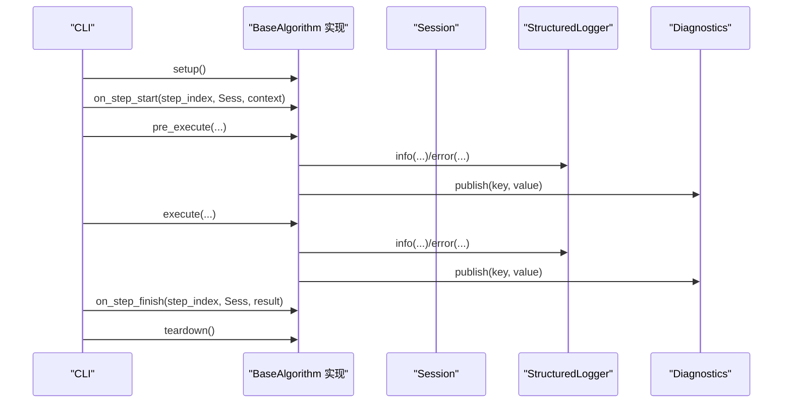
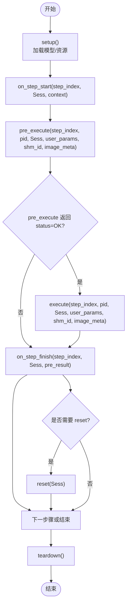
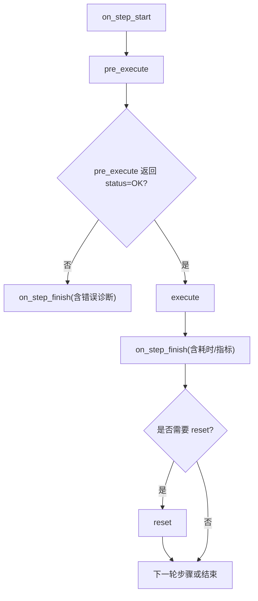
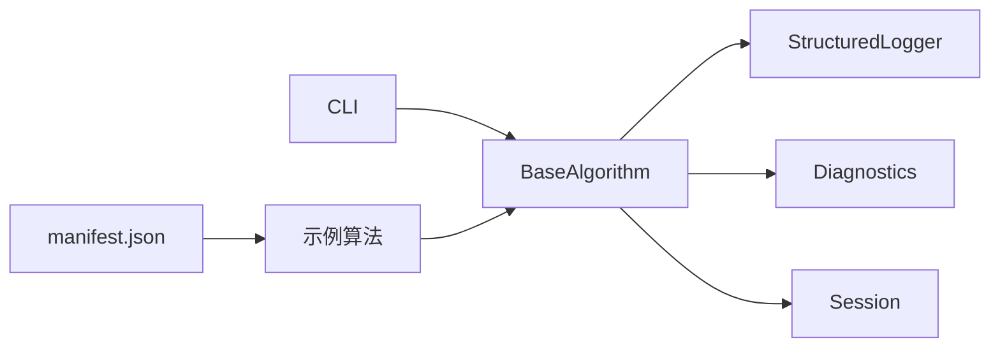

# BaseAlgorithm 生命周期

<cite>
**本文引用的文件**
- [procvision_algorithm_sdk/base.py](file://procvision_algorithm_sdk/base.py)
- [procvision_algorithm_sdk/logger.py](file://procvision_algorithm_sdk/logger.py)
- [procvision_algorithm_sdk/diagnostics.py](file://procvision_algorithm_sdk/diagnostics.py)
- [procvision_algorithm_sdk/session.py](file://procvision_algorithm_sdk/session.py)
- [procvision_algorithm_sdk/shared_memory.py](file://procvision_algorithm_sdk/shared_memory.py)
- [procvision_algorithm_sdk/cli.py](file://procvision_algorithm_sdk/cli.py)
- [algorithm-example/algorithm_example/main.py](file://algorithm-example/algorithm_example/main.py)
- [algorithm-example/manifest.json](file://algorithm-example/manifest.json)
- [tests/test_base_algo.py](file://tests/test_base_algo.py)
- [README.md](file://README.md)
- [algorithm_dev_tutorial.md](file://algorithm_dev_tutorial.md)
- [spec_architecture_review.md](file://spec_architecture_review.md)
</cite>

## 目录
1. [简介](#简介)
2. [项目结构](#项目结构)
3. [核心组件](#核心组件)
4. [架构总览](#架构总览)
5. [详细组件分析](#详细组件分析)
6. [依赖分析](#依赖分析)
7. [性能考虑](#性能考虑)
8. [故障排查指南](#故障排查指南)
9. [结论](#结论)
10. [附录](#附录)

## 简介
本文件系统性阐述 BaseAlgorithm 抽象基类的生命周期管理机制，覆盖初始化、setup、teardown、on_step_start、on_step_finish、reset 等钩子方法的调用时机与职责；解释 get_info、pre_execute、execute 三个抽象方法的设计意图与实现要求；说明 self.logger、self.diagnostics 等内置属性的用途；梳理算法生命周期与平台交互的时序关系，包括资源加载标志（_resources_loaded）、模型版本（_model_version）的管理；给出常见实现模式与错误处理建议，并明确继承 BaseAlgorithm 时必须遵循的约束（如 JSON 可序列化返回值）。

## 项目结构
SDK 提供了算法开发所需的最小能力集：BaseAlgorithm 抽象基类、Session 状态存储、StructuredLogger 结构化日志、Diagnostics 诊断数据容器、共享内存读图接口，以及 CLI 验证与运行流程。

```mermaid
graph TB
subgraph "SDK 核心"
BA["BaseAlgorithm<br/>抽象基类"]
Sess["Session<br/>会话状态/KV"]
Log["StructuredLogger<br/>结构化日志"]
Dia["Diagnostics<br/>诊断数据"]
SM["SharedMemory<br/>读写图像"]
end
subgraph "示例算法"
Demo["AlgorithmExample<br/>示例实现"]
MF["manifest.json<br/>入口与能力声明"]
end
subgraph "CLI"
CLI["CLI 验证/运行"]
end
BA --> Sess
BA --> Log
BA --> Dia
BA --> SM
Demo --> BA
MF --> Demo
CLI --> Demo
CLI --> Sess
```

图表来源
- [procvision_algorithm_sdk/base.py](file://procvision_algorithm_sdk/base.py#L1-L58)
- [procvision_algorithm_sdk/session.py](file://procvision_algorithm_sdk/session.py#L1-L36)
- [procvision_algorithm_sdk/logger.py](file://procvision_algorithm_sdk/logger.py#L1-L24)
- [procvision_algorithm_sdk/diagnostics.py](file://procvision_algorithm_sdk/diagnostics.py#L1-L12)
- [procvision_algorithm_sdk/shared_memory.py](file://procvision_algorithm_sdk/shared_memory.py#L1-L53)
- [algorithm-example/algorithm_example/main.py](file://algorithm-example/algorithm_example/main.py#L1-L59)
- [algorithm-example/manifest.json](file://algorithm-example/manifest.json#L1-L25)
- [procvision_algorithm_sdk/cli.py](file://procvision_algorithm_sdk/cli.py#L64-L100)

章节来源
- [README.md](file://README.md#L1-L116)
- [procvision_algorithm_sdk/__init__.py](file://procvision_algorithm_sdk/__init__.py#L1-L20)

## 核心组件
- BaseAlgorithm：定义生命周期钩子与三个抽象方法，提供日志与诊断能力，维护资源加载与模型版本等内部状态。
- Session：提供只读上下文与可序列化 KV 存储，用于跨步骤的状态共享与校验。
- StructuredLogger：统一结构化日志格式，包含 level、timestamp_ms 等字段。
- Diagnostics：轻量诊断容器，支持 publish/get 获取诊断数据。
- SharedMemory：提供从共享内存读取图像的能力，支持多种输入形态并进行必要的颜色空间与通道变换。
- CLI：负责算法包验证与本地运行，串联生命周期钩子与核心方法。

章节来源
- [procvision_algorithm_sdk/base.py](file://procvision_algorithm_sdk/base.py#L1-L58)
- [procvision_algorithm_sdk/session.py](file://procvision_algorithm_sdk/session.py#L1-L36)
- [procvision_algorithm_sdk/logger.py](file://procvision_algorithm_sdk/logger.py#L1-L24)
- [procvision_algorithm_sdk/diagnostics.py](file://procvision_algorithm_sdk/diagnostics.py#L1-L12)
- [procvision_algorithm_sdk/shared_memory.py](file://procvision_algorithm_sdk/shared_memory.py#L1-L53)
- [procvision_algorithm_sdk/cli.py](file://procvision_algorithm_sdk/cli.py#L64-L100)

## 架构总览
BaseAlgorithm 将“生命周期钩子 + 三类抽象方法”的设计与平台运行器解耦。平台通过 CLI 在验证与运行两种场景下，严格控制生命周期顺序，确保资源加载、步骤级状态与诊断输出的一致性。



图表来源
- [procvision_algorithm_sdk/cli.py](file://procvision_algorithm_sdk/cli.py#L64-L100)
- [procvision_algorithm_sdk/cli.py](file://procvision_algorithm_sdk/cli.py#L192-L225)
- [procvision_algorithm_sdk/base.py](file://procvision_algorithm_sdk/base.py#L1-L58)
- [procvision_algorithm_sdk/logger.py](file://procvision_algorithm_sdk/logger.py#L1-L24)
- [procvision_algorithm_sdk/diagnostics.py](file://procvision_algorithm_sdk/diagnostics.py#L1-L12)

## 详细组件分析

### 生命周期钩子与调用时序
- setup：进程启动时仅调用一次，用于加载模型、缓存与句柄，设置模型版本等重量级资源。
- on_step_start：每步开始时调用，记录上下文、复位计时与状态，适合幂等初始化。
- pre_execute：每步执行前调用，进行条件验证、读取图像、预处理等，返回包含 status 的字典。
- execute：每步执行核心逻辑，返回包含 status 与 data 的字典，data 中的 result_status 表示业务判定。
- on_step_finish：每步结束时调用，输出诊断、汇总耗时与指标，适合幂等清理。
- teardown：进程退出前调用，释放所有资源，确保无泄漏。
- reset：流程级复位，清理会话内与算法内部的易变状态，便于多步或多流程复用。



图表来源
- [procvision_algorithm_sdk/cli.py](file://procvision_algorithm_sdk/cli.py#L64-L100)
- [procvision_algorithm_sdk/cli.py](file://procvision_algorithm_sdk/cli.py#L192-L225)
- [procvision_algorithm_sdk/base.py](file://procvision_algorithm_sdk/base.py#L1-L58)

章节来源
- [algorithm_dev_tutorial.md](file://algorithm_dev_tutorial.md#L56-L80)
- [procvision_algorithm_sdk/cli.py](file://procvision_algorithm_sdk/cli.py#L64-L100)
- [procvision_algorithm_sdk/cli.py](file://procvision_algorithm_sdk/cli.py#L192-L225)

### get_info 设计意图与实现要求
- 设计意图：向平台暴露算法元信息，包括名称、版本、描述、支持的产品型号（supported_pids）、步骤定义（steps）等，用于清单校验与运行配置。
- 实现要求：
  - 返回字典，包含 steps 列表且每个元素包含 index、name、params 等字段。
  - supported_pids 必须与 manifest.json 中声明一致。
  - params 描述参数类型、默认值、范围与单位等，便于前端与平台校验。
- 示例参考：[get_info 实现](file://algorithm-example/algorithm_example/main.py#L32-L59)，[清单声明](file://algorithm-example/manifest.json#L1-L25)。

章节来源
- [procvision_algorithm_sdk/base.py](file://procvision_algorithm_sdk/base.py#L1-L58)
- [algorithm-example/algorithm_example/main.py](file://algorithm-example/algorithm_example/main.py#L32-L59)
- [algorithm-example/manifest.json](file://algorithm-example/manifest.json#L1-L25)

### pre_execute 设计意图与实现要求
- 设计意图：在执行前进行条件验证与预处理，避免在 execute 中重复校验与昂贵操作。
- 实现要求：
  - 输入包含 step_index、pid、session、user_params、shared_mem_id、image_meta。
  - 读取图像并进行必要预处理（如尺寸检查、颜色空间转换），返回包含 status 的字典。
  - 若失败，返回 status="ERROR"，并提供 message 与 error_code 等字段，便于平台展示与追踪。
- 常见实现模式：
  - 在 pre_execute 中预处理图像（如归一化、裁剪、通道变换），并将中间结果写入 session 或返回给 execute。
  - 通过 self.logger 记录关键事件，通过 self.diagnostics.publish 记录耗时等指标。
- 示例参考：[DummyAlgo.pre_execute](file://tests/test_base_algo.py#L1-L64)。

章节来源
- [procvision_algorithm_sdk/base.py](file://procvision_algorithm_sdk/base.py#L1-L58)
- [procvision_algorithm_sdk/shared_memory.py](file://procvision_algorithm_sdk/shared_memory.py#L1-L53)
- [tests/test_base_algo.py](file://tests/test_base_algo.py#L1-L64)

### execute 设计意图与实现要求
- 设计意图：执行核心检测逻辑，返回包含 status 与 data 的字典，其中 data.result_status 表示业务判定（如 OK/NG）。
- 实现要求：
  - 读取图像并执行推理，返回包含 status 的字典。
  - data 中可包含缺陷框、置信度、调试信息等，但必须保持 JSON 可序列化。
  - 严禁在 execute 中进行重计算或资源加载，应将重工作放在 setup/pre_execute。
- 常见实现模式：
  - 在 execute 中执行推理，返回包含 result_status、defect_rects 等字段的结果字典。
  - 使用 self.logger 记录关键事件，使用 self.diagnostics.publish 记录耗时与指标。
- 示例参考：[DummyAlgo.execute](file://tests/test_base_algo.py#L1-L64)。

章节来源
- [procvision_algorithm_sdk/base.py](file://procvision_algorithm_sdk/base.py#L1-L58)
- [procvision_algorithm_sdk/shared_memory.py](file://procvision_algorithm_sdk/shared_memory.py#L1-L53)
- [tests/test_base_algo.py](file://tests/test_base_algo.py#L1-L64)

### 内置属性与工具
- self.logger（StructuredLogger）
  - 用途：统一结构化日志输出，包含 level、timestamp_ms 等字段，便于平台采集与检索。
  - 常用方法：info/debug/error，支持附加字段。
  - 示例参考：[logger 实现](file://procvision_algorithm_sdk/logger.py#L1-L24)。
- self.diagnostics（Diagnostics）
  - 用途：轻量诊断容器，支持 publish(key, value) 与 get() 获取诊断数据。
  - 常用场景：在 on_step_start/on_step_finish 中记录耗时、命中率等指标。
  - 示例参考：[diagnostics 实现](file://procvision_algorithm_sdk/diagnostics.py#L1-L12)。
- self._resources_loaded（布尔）
  - 用途：标记资源是否已加载，便于幂等判断与二次加载保护。
  - 注意：该字段在 SDK 中存在，但未在 CLI 中直接使用，算法实现可自行约定。
- self._model_version（字符串）
  - 用途：记录模型版本，便于平台与日志关联。
  - 示例参考：[示例算法设置模型版本](file://algorithm-example/algorithm_example/main.py#L1-L33)。

章节来源
- [procvision_algorithm_sdk/base.py](file://procvision_algorithm_sdk/base.py#L1-L58)
- [procvision_algorithm_sdk/logger.py](file://procvision_algorithm_sdk/logger.py#L1-L24)
- [procvision_algorithm_sdk/diagnostics.py](file://procvision_algorithm_sdk/diagnostics.py#L1-L12)
- [algorithm-example/algorithm_example/main.py](file://algorithm-example/algorithm_example/main.py#L1-L33)

### 生命周期与平台交互时序
- 验证（validate）时序：setup → on_step_start(1) → pre_execute(1) → execute(1) → on_step_finish(1) → teardown。
- 运行（run）时序：setup → on_step_start(step_index) → pre_execute(step_index) → execute(step_index) → on_step_finish(step_index) → teardown。
- Session 的 KV 存储：通过 session.set(key, value) 写入 JSON 可序列化值，便于跨步骤共享状态。
- 示例参考：[CLI 验证流程](file://procvision_algorithm_sdk/cli.py#L64-L100)，[CLI 运行流程](file://procvision_algorithm_sdk/cli.py#L192-L225)。

章节来源
- [procvision_algorithm_sdk/cli.py](file://procvision_algorithm_sdk/cli.py#L64-L100)
- [procvision_algorithm_sdk/cli.py](file://procvision_algorithm_sdk/cli.py#L192-L225)
- [procvision_algorithm_sdk/session.py](file://procvision_algorithm_sdk/session.py#L1-L36)

### 数据流与状态转换
- 数据流：
  - 图像通过共享内存读取，支持多种输入形态并进行必要的颜色空间与通道变换。
  - pre_execute 返回包含 status 的字典，作为 execute 的前置条件。
  - execute 返回包含 status 与 data 的字典，data 中的 result_status 表示业务判定。
- 状态转换：
  - 步骤开始：on_step_start 复位计时与状态，记录上下文。
  - 步骤结束：on_step_finish 汇总耗时与指标，输出诊断。
  - 流程复位：reset 清理会话内与算法内部的易变状态。



图表来源
- [procvision_algorithm_sdk/base.py](file://procvision_algorithm_sdk/base.py#L1-L58)
- [procvision_algorithm_sdk/cli.py](file://procvision_algorithm_sdk/cli.py#L64-L100)
- [procvision_algorithm_sdk/cli.py](file://procvision_algorithm_sdk/cli.py#L192-L225)

## 依赖分析
- BaseAlgorithm 依赖：
  - StructuredLogger：用于结构化日志输出。
  - Diagnostics：用于诊断数据收集。
  - Session：用于会话状态与上下文传递。
- CLI 依赖：
  - BaseAlgorithm：通过反射导入算法类并调用生命周期钩子与核心方法。
  - Session：构造会话并传递给钩子与核心方法。
- 示例算法依赖：
  - BaseAlgorithm：继承并实现抽象方法。
  - manifest.json：声明入口点与能力。



图表来源
- [procvision_algorithm_sdk/cli.py](file://procvision_algorithm_sdk/cli.py#L64-L100)
- [procvision_algorithm_sdk/base.py](file://procvision_algorithm_sdk/base.py#L1-L58)
- [algorithm-example/algorithm_example/main.py](file://algorithm-example/algorithm_example/main.py#L1-L33)
- [algorithm-example/manifest.json](file://algorithm-example/manifest.json#L1-L25)

章节来源
- [procvision_algorithm_sdk/__init__.py](file://procvision_algorithm_sdk/__init__.py#L1-L20)
- [procvision_algorithm_sdk/cli.py](file://procvision_algorithm_sdk/cli.py#L64-L100)

## 性能考虑
- 资源管理：
  - 重量级资源（模型、GPU 显存、共享内存池）应在 setup 中加载，teardown 中释放。
  - 轻量级资源（配置、模板图像）可在 __init__ 或 setup 中初始化，无需显式释放。
  - 会话级资源（临时缓存、中间结果）在 on_step_start 初始化，在 on_step_finish 或 reset 清理。
- 幂等性：
  - setup/teardown/reset 应能安全地重复调用，避免重复初始化与泄漏。
- 轻量化钩子：
  - on_step_start/finish 不应进行重计算，重工作放在 pre_execute/execute。
- 诊断与日志：
  - 使用 Diagnostics.publish 与 StructuredLogger.info 记录关键指标，便于性能分析与问题定位。

章节来源
- [spec_architecture_review.md](file://spec_architecture_review.md#L653-L685)
- [algorithm_dev_tutorial.md](file://algorithm_dev_tutorial.md#L56-L80)
- [algorithm-example/algorithm_example/main.py](file://algorithm-example/algorithm_example/main.py#L1-L33)

## 故障排查指南
- 返回值校验：
  - get_info 必须返回字典且 steps 为列表。
  - pre_execute/execute 必须返回包含 status 的字典，status 为 "OK" 或 "ERROR"。
  - data 字段必须 JSON 可序列化。
- Session 值校验：
  - 通过 session.set(key, value) 写入的值必须 JSON 可序列化，否则抛出异常。
- 常见错误与修复：
  - 图像为空：在 pre_execute/execute 中检测并返回 status="ERROR"，提供 message 与 error_code。
  - 不支持的产品型号：在 pre_execute 中校验 pid 并返回错误。
  - 资源泄漏：确保在 teardown 中释放所有资源；在 reset 中清理会话内易变状态。
- 示例参考：
  - [DummyAlgo 错误处理](file://tests/test_base_algo.py#L1-L64)
  - [Session JSON 可序列化校验](file://procvision_algorithm_sdk/session.py#L1-L36)

章节来源
- [tests/test_base_algo.py](file://tests/test_base_algo.py#L1-L64)
- [procvision_algorithm_sdk/session.py](file://procvision_algorithm_sdk/session.py#L1-L36)

## 结论
BaseAlgorithm 通过“生命周期钩子 + 三类抽象方法”的设计，将算法实现与平台运行器解耦，形成稳定的执行时序与数据流。开发者应遵循以下原则：
- 在 setup 中完成资源加载，在 teardown 中释放资源。
- 在 pre_execute 中进行条件验证与预处理，避免在 execute 中重复校验。
- 在 execute 中返回包含 status 与 data 的字典，data 中的 result_status 表示业务判定。
- 使用 self.logger 与 self.diagnostics 输出结构化日志与诊断数据。
- 遵循 JSON 可序列化约束，确保返回值与 session.set 的值均可被平台处理。

## 附录
- 常见实现模式：
  - 在 on_step_start 中记录起始时间，在 on_step_finish 中计算耗时并发布诊断。
  - 在 pre_execute 中读取图像并进行预处理，将中间结果写入 session 或返回给 execute。
  - 在 execute 中执行推理，返回包含 result_status、缺陷框等字段的结果字典。
- 约束与最佳实践：
  - 幂等：钩子允许重复调用，需正确处理重复初始化/释放。
  - 轻量化：on_step_start/finish 不应做重计算。
  - 资源管理：统一在 setup/teardown/reset 管理模型与句柄。
  - 诊断输出：在钩子中通过 Diagnostics.publish 与 StructuredLogger.info 输出关键指标与事件。

章节来源
- [algorithm-example/algorithm_example/main.py](file://algorithm-example/algorithm_example/main.py#L1-L59)
- [README.md](file://README.md#L1-L116)
- [algorithm_dev_tutorial.md](file://algorithm_dev_tutorial.md#L56-L80)