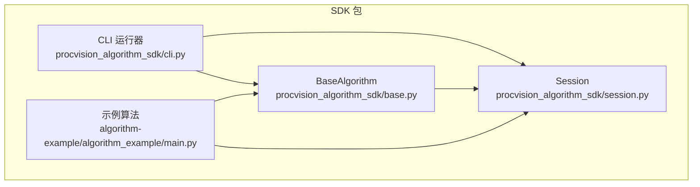
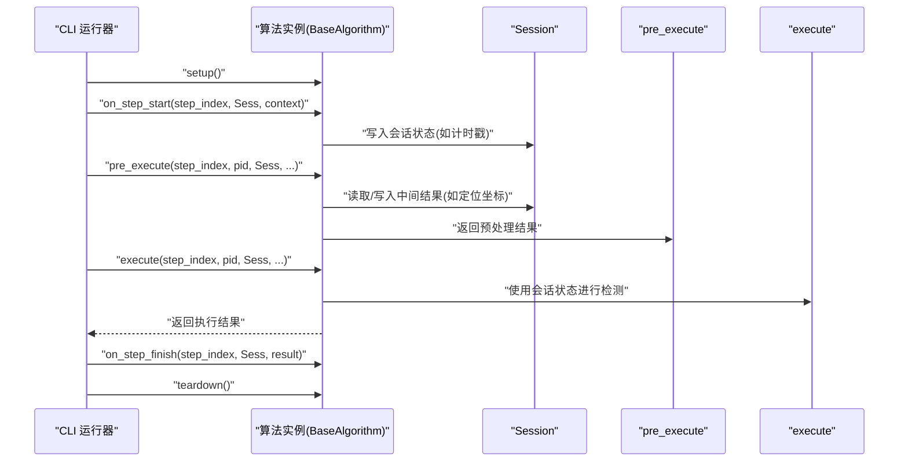
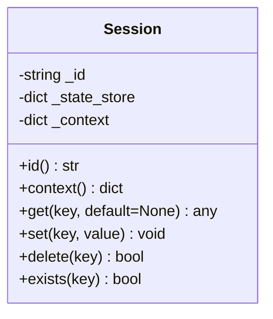
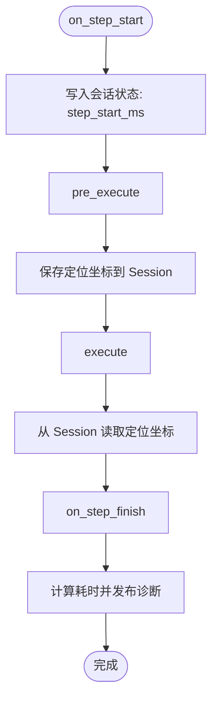
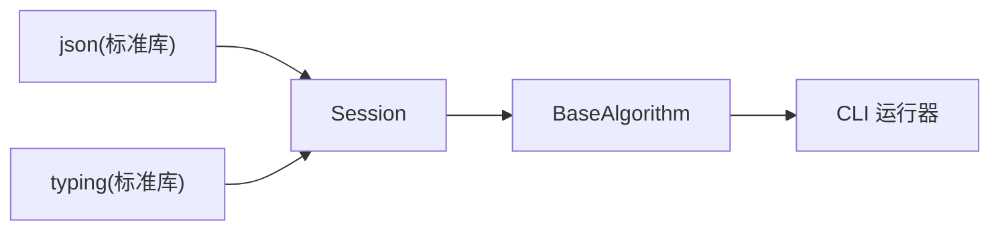

# Session 状态管理

<cite>
**本文引用的文件**
- [session.py](file://procvision_algorithm_sdk/session.py)
- [base.py](file://procvision_algorithm_sdk/base.py)
- [cli.py](file://procvision_algorithm_sdk/cli.py)
- [algorithm_example/main.py](file://algorithm-example/algorithm_example/main.py)
- [test_session.py](file://tests/test_session.py)
- [README.md](file://README.md)
- [algorithm_dev_tutorial.md](file://algorithm_dev_tutorial.md)
- [spec_architecture_review.md](file://spec_architecture_review.md)
</cite>

## 目录
1. [简介](#简介)
2. [项目结构](#项目结构)
3. [核心组件](#核心组件)
4. [架构总览](#架构总览)
5. [详细组件分析](#详细组件分析)
6. [依赖分析](#依赖分析)
7. [性能考量](#性能考量)
8. [故障排查指南](#故障排查指南)
9. [结论](#结论)
10. [附录](#附录)

## 简介
本文件围绕 Session 类在跨步骤算法执行中的状态管理能力展开，系统梳理其构造参数 id 与 context 的作用、内部状态存储 _state_store 的键值存储机制，以及 get、set、delete、exists 方法的行为特征。重点阐释 set 方法对 JSON 可序列化的要求与类型检查逻辑，说明 id 属性的只读特性与 context 上下文的不可变拷贝策略，并结合实际用例展示 Session 在 pre_execute 与 execute 之间共享中间结果（如定位坐标）的实践方式。同时阐明 Session 与算法实例的生命周期关系，以及平台如何注入与传递 Session 对象，最后给出最佳实践建议（命名规范、数据结构选择与性能注意事项）。

## 项目结构
- Session 实现位于 SDK 包内，作为状态共享与只读上下文的核心载体。
- BaseAlgorithm 定义了算法生命周期钩子与 pre_execute/execute 接口，均以 Session 作为参数之一。
- CLI 运行器负责在每步执行前后调用 on_step_start/on_step_finish，并将 Session 注入到 pre_execute/execute。
- 示例算法展示了在 on_step_start 中写入会话状态，在后续步骤中读取并用于诊断或流程控制。

图表来源
- [session.py](file://procvision_algorithm_sdk/session.py#L1-L36)
- [base.py](file://procvision_algorithm_sdk/base.py#L1-L58)
- [cli.py](file://procvision_algorithm_sdk/cli.py#L192-L225)
- [algorithm_example/main.py](file://algorithm-example/algorithm_example/main.py#L1-L150)

章节来源
- [README.md](file://README.md#L1-L116)
- [algorithm_dev_tutorial.md](file://algorithm_dev_tutorial.md#L56-L80)

## 核心组件
- Session：提供只读 id、不可变 context 拷贝、键值存储 _state_store，以及 get/set/delete/exists 等状态管理接口。
- BaseAlgorithm：定义 pre_execute/execute 生命周期钩子，接收 Session 作为参数，便于在不同步骤间共享状态。
- CLI：在每步执行前后调用 on_step_start/on_step_finish，并将 Session 注入到 pre_execute/execute。

章节来源
- [session.py](file://procvision_algorithm_sdk/session.py#L1-L36)
- [base.py](file://procvision_algorithm_sdk/base.py#L1-L58)
- [cli.py](file://procvision_algorithm_sdk/cli.py#L192-L225)

## 架构总览
Session 在算法执行流程中的角色如下：
- 平台/运行器创建 Session 并将其注入到每一步的生命周期钩子与执行阶段。
- on_step_start 可写入会话状态（如计时戳），on_step_finish 读取并用于诊断。
- pre_execute 与 execute 可通过 Session 共享中间结果（如定位坐标），实现跨步骤的数据传递。
- reset 钩子用于清理会话内易变状态，保证幂等性与一致性。

图表来源
- [cli.py](file://procvision_algorithm_sdk/cli.py#L192-L225)
- [base.py](file://procvision_algorithm_sdk/base.py#L1-L58)
- [algorithm_example/main.py](file://algorithm-example/algorithm_example/main.py#L1-L150)

## 详细组件分析

### Session 类
- 构造函数参数
  - id：会话标识符，用于区分不同执行会话，且为只读属性。
  - context：可选字典，作为只读上下文，对外提供不可变拷贝，防止外部修改影响内部状态。
- 内部状态存储
  - _state_store：字典形式的键值存储，用于跨步骤共享中间结果。
- 接口与行为
  - id：只读属性，返回构造时传入的 id。
  - context：返回 context 的浅拷贝，确保外部无法直接修改内部字典。
  - get(key, default=None)：从 _state_store 获取值，不存在则返回默认值。
  - set(key, value)：写入 _state_store 前进行 JSON 可序列化检查，若不可序列化则抛出类型错误；否则写入。
  - delete(key)：删除指定键，存在则返回 True，否则 False。
  - exists(key)：判断键是否存在。

图表来源
- [session.py](file://procvision_algorithm_sdk/session.py#L1-L36)

章节来源
- [session.py](file://procvision_algorithm_sdk/session.py#L1-L36)
- [test_session.py](file://tests/test_session.py#L1-L24)

### set 方法的 JSON 可序列化要求与类型检查
- set 在写入前尝试对值进行 JSON 序列化，若抛出类型错误或值错误，则拒绝写入并抛出异常，提示值必须是 JSON 可序列化的。
- 这一约束确保了跨步骤、跨模块的状态存储具备稳定的数据交换基础，避免复杂对象导致的序列化/反序列化问题。

章节来源
- [session.py](file://procvision_algorithm_sdk/session.py#L1-L36)
- [test_session.py](file://tests/test_session.py#L1-L24)

### id 属性的只读特性与 context 的不可变拷贝策略
- id 为只读属性，防止在运行过程中被意外修改，保证会话标识的稳定性。
- context 返回的是内部字典的拷贝，避免外部直接修改内部上下文，从而保持只读隔离。

章节来源
- [session.py](file://procvision_algorithm_sdk/session.py#L1-L36)

### Session 在 pre_execute 与 execute 之间的中间结果共享
- 在 on_step_start 中写入计时戳等状态，随后在 pre_execute 中读取并用于诊断或调试信息。
- 示例算法展示了在 on_step_start 中写入“step_start_ms”，在 on_step_finish 中读取并计算耗时，再通过诊断服务发布。
- 在 pre_execute 中可将定位结果写入 Session，供后续 execute 步骤读取并使用，实现跨步骤的数据传递。

图表来源
- [algorithm_example/main.py](file://algorithm-example/algorithm_example/main.py#L1-L150)
- [cli.py](file://procvision_algorithm_sdk/cli.py#L192-L225)

章节来源
- [algorithm_example/main.py](file://algorithm-example/algorithm_example/main.py#L1-L150)
- [cli.py](file://procvision_algorithm_sdk/cli.py#L192-L225)

### Session 与算法实例的生命周期关系
- 生命周期钩子：setup → on_step_start → pre_execute → execute → on_step_finish → teardown。
- Session 由运行器在每步开始时创建并注入到各钩子与执行阶段，确保跨步骤状态共享。
- reset 钩子用于清理会话内易变状态，保证幂等性与一致性。

章节来源
- [base.py](file://procvision_algorithm_sdk/base.py#L1-L58)
- [cli.py](file://procvision_algorithm_sdk/cli.py#L192-L225)
- [algorithm_dev_tutorial.md](file://algorithm_dev_tutorial.md#L56-L80)

### 平台如何注入与传递 Session 对象
- 运行器在调用 on_step_start 时将 Session 与步骤上下文一起传入；随后在 pre_execute 与 execute 中继续传递。
- 运行器还从 Session 的 context 中读取 trace_id 等信息，用于上下文关联与追踪。

章节来源
- [cli.py](file://procvision_algorithm_sdk/cli.py#L192-L225)
- [algorithm_dev_tutorial.md](file://algorithm_dev_tutorial.md#L56-L80)

## 依赖分析
- Session 仅依赖标准库 json 与 typing，保持轻量与可移植性。
- BaseAlgorithm 依赖 Session，作为算法生命周期与执行阶段的参数载体。
- CLI 依赖 BaseAlgorithm 与 Session，负责在每步执行前后注入与清理会话状态。

图表来源
- [session.py](file://procvision_algorithm_sdk/session.py#L1-L36)
- [base.py](file://procvision_algorithm_sdk/base.py#L1-L58)
- [cli.py](file://procvision_algorithm_sdk/cli.py#L192-L225)

章节来源
- [session.py](file://procvision_algorithm_sdk/session.py#L1-L36)
- [base.py](file://procvision_algorithm_sdk/base.py#L1-L58)
- [cli.py](file://procvision_algorithm_sdk/cli.py#L192-L225)

## 性能考量
- JSON 序列化检查：set 在写入前进行 JSON 可序列化检查，避免后续跨模块传输时出现序列化失败。建议仅存储可序列化数据，减少不必要的检查开销。
- 字典存储：_state_store 使用字典，查找/插入/删除均为平均 O(1)，适合高频状态访问场景。
- context 拷贝：context 返回浅拷贝，避免外部直接修改内部字典，但注意浅拷贝不复制嵌套对象，深层结构仍需谨慎处理。
- 命名规范：建议使用清晰、稳定的键名，避免冲突；必要时添加命名空间前缀。
- 数据结构选择：优先使用 JSON 兼容的数据结构（如 dict/list/primitives），避免复杂对象或循环引用。
- 清理策略：在 reset 钩子中及时删除临时状态，避免状态膨胀与内存占用上升。

章节来源
- [session.py](file://procvision_algorithm_sdk/session.py#L1-L36)
- [algorithm_dev_tutorial.md](file://algorithm_dev_tutorial.md#L56-L80)

## 故障排查指南
- set 抛出类型错误：检查写入值是否为 JSON 可序列化，避免集合、自定义类等不可序列化类型。
- context 修改无效：确认通过 context 属性读取的是拷贝，外部修改不会影响内部字典。
- 键不存在：使用 get 的默认值参数或先用 exists 判断，避免 KeyError。
- 状态未清理：在 reset 钩子中显式删除临时键，确保幂等性。

章节来源
- [test_session.py](file://tests/test_session.py#L1-L24)
- [session.py](file://procvision_algorithm_sdk/session.py#L1-L36)

## 结论
Session 通过只读 id、不可变 context 拷贝与字典键值存储，为跨步骤算法执行提供了稳定的状态管理能力。其 JSON 可序列化约束确保了状态在不同模块间的可靠传递。结合 on_step_start/on_step_finish 与 pre_execute/execute 的生命周期钩子，Session 能够在定位、检测等多步骤流程中高效共享中间结果。遵循命名规范、选择合适的 JSON 兼容数据结构、及时清理临时状态，是发挥 Session 能力并保持系统健壮性的关键。

## 附录
- 设计补充与待明确点：参考架构评审文档指出 Session 的 TTL 过期、原子计数器等能力尚未在当前实现中体现，reset 职责划分也需进一步明确。这些内容可在后续版本中逐步完善。

章节来源
- [spec_architecture_review.md](file://spec_architecture_review.md#L386-L406)