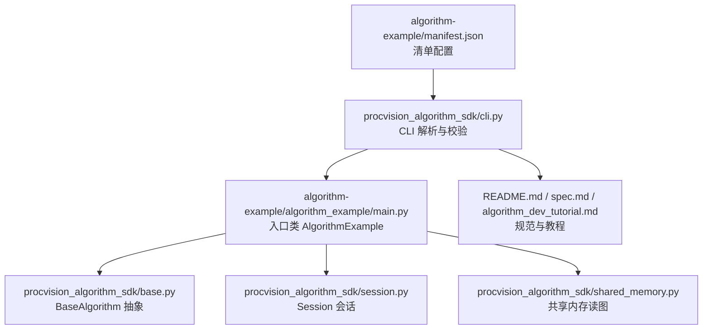
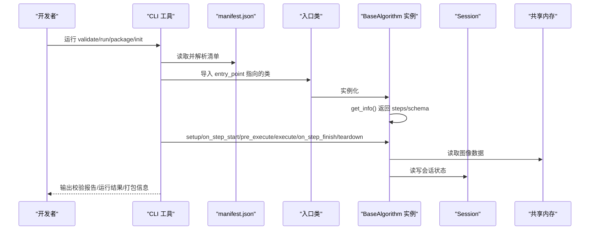
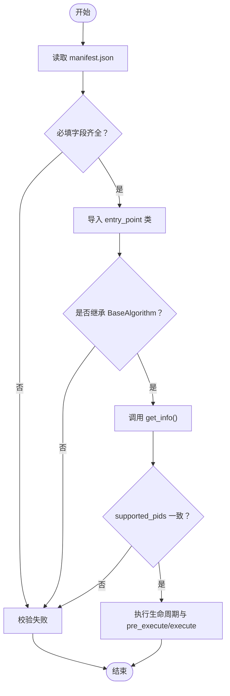
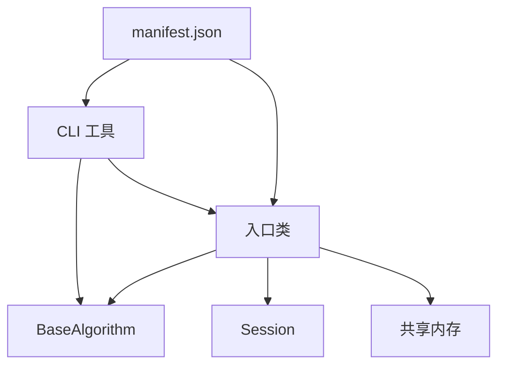

# manifest.json 配置

<cite>
**本文引用的文件**
- [algorithm-example/manifest.json](file://algorithm-example/manifest.json)
- [algorithm-example/algorithm_example/main.py](file://algorithm-example/algorithm_example/main.py)
- [procvision_algorithm_sdk/cli.py](file://procvision_algorithm_sdk/cli.py)
- [procvision_algorithm_sdk/base.py](file://procvision_algorithm_sdk/base.py)
- [procvision_algorithm_sdk/session.py](file://procvision_algorithm_sdk/session.py)
- [procvision_algorithm_sdk/shared_memory.py](file://procvision_algorithm_sdk/shared_memory.py)
- [README.md](file://README.md)
- [spec.md](file://spec.md)
- [algorithm_dev_tutorial.md](file://algorithm_dev_tutorial.md)
</cite>

## 目录
1. [简介](#简介)
2. [项目结构](#项目结构)
3. [核心组件](#核心组件)
4. [架构总览](#架构总览)
5. [详细组件分析](#详细组件分析)
6. [依赖关系分析](#依赖关系分析)
7. [性能考量](#性能考量)
8. [故障排查指南](#故障排查指南)
9. [结论](#结论)
10. [附录](#附录)

## 简介
本文件系统性解释 manifest.json 在算法包中的配置作用与结构规范，重点围绕以下方面展开：
- 字段语义与取值规则：name、version、entry_point、description、supported_pids
- steps 数组中每个步骤的 index、name、params 的配置方式
- 参数类型（rect、float、enum）的默认值、取值范围与必填属性
- 多步骤算法（如主板定位、螺丝检测）参数体系设计思路
- CLI 工具与运行时环境如何解析 manifest.json，实现动态加载与参数校验
- 常见配置错误的排查方法

## 项目结构
manifest.json 位于算法示例项目的根目录，与入口类 main.py、SDK 接口定义、CLI 工具共同构成完整的开发与运行链路。

图表来源
- [algorithm-example/manifest.json](file://algorithm-example/manifest.json#L1-L25)
- [procvision_algorithm_sdk/cli.py](file://procvision_algorithm_sdk/cli.py#L35-L145)
- [algorithm-example/algorithm_example/main.py](file://algorithm-example/algorithm_example/main.py#L1-L150)
- [procvision_algorithm_sdk/base.py](file://procvision_algorithm_sdk/base.py#L1-L58)
- [procvision_algorithm_sdk/session.py](file://procvision_algorithm_sdk/session.py#L1-L36)
- [procvision_algorithm_sdk/shared_memory.py](file://procvision_algorithm_sdk/shared_memory.py#L1-L53)
- [README.md](file://README.md#L1-L116)
- [spec.md](file://spec.md#L868-L956)
- [algorithm_dev_tutorial.md](file://algorithm_dev_tutorial.md#L1-L348)

章节来源
- [algorithm-example/manifest.json](file://algorithm-example/manifest.json#L1-L25)
- [procvision_algorithm_sdk/cli.py](file://procvision_algorithm_sdk/cli.py#L35-L145)
- [algorithm-example/algorithm_example/main.py](file://algorithm-example/algorithm_example/main.py#L1-L150)
- [README.md](file://README.md#L1-L116)
- [spec.md](file://spec.md#L868-L956)
- [algorithm_dev_tutorial.md](file://algorithm_dev_tutorial.md#L1-L348)

## 核心组件
- manifest.json：算法包的“元数据+步骤参数定义”，决定入口类、支持的产品型号与各步骤的可配置参数
- CLI 工具（procvision-cli）：负责加载 manifest.json、导入入口类、执行校验与运行
- BaseAlgorithm：算法实现的抽象基类，get_info() 返回 steps 与参数 schema，pre_execute()/execute() 执行业务
- Session：会话上下文，用于跨步骤数据共享
- 共享内存：算法通过 SDK 读取图像数据，避免文件 IO

章节来源
- [procvision_algorithm_sdk/cli.py](file://procvision_algorithm_sdk/cli.py#L35-L145)
- [procvision_algorithm_sdk/base.py](file://procvision_algorithm_sdk/base.py#L1-L58)
- [procvision_algorithm_sdk/session.py](file://procvision_algorithm_sdk/session.py#L1-L36)
- [procvision_algorithm_sdk/shared_memory.py](file://procvision_algorithm_sdk/shared_memory.py#L1-L53)

## 架构总览
manifest.json 作为“配置契约”的一部分，与 SDK 的 get_info() 参数 schema、CLI 的校验流程协同工作，形成“清单驱动”的动态加载与参数校验闭环。

图表来源
- [procvision_algorithm_sdk/cli.py](file://procvision_algorithm_sdk/cli.py#L35-L145)
- [procvision_algorithm_sdk/base.py](file://procvision_algorithm_sdk/base.py#L1-L58)
- [procvision_algorithm_sdk/session.py](file://procvision_algorithm_sdk/session.py#L1-L36)
- [procvision_algorithm_sdk/shared_memory.py](file://procvision_algorithm_sdk/shared_memory.py#L1-L53)

## 详细组件分析

### manifest.json 字段解析
- name
  - 语义：算法唯一标识，建议与入口类名一致，便于识别与版本追踪
  - 取值规则：字符串，建议使用小写、下划线或点分命名，避免特殊字符
  - 与 get_info() 的 name 保持一致，否则校验失败
- version
  - 语义：语义化版本号，用于交付包命名与版本管理
  - 取值规则：字符串，建议遵循 x.y.z 格式
  - 与 get_info() 的 version 保持一致
- entry_point
  - 语义：入口类定位，格式为“模块路径:类名”
  - 取值规则：模块路径需可被 Python sys.path 解析；类名需存在于该模块
  - CLI 会动态导入该类并断言其继承自 BaseAlgorithm
- description
  - 语义：算法描述，便于平台与使用者理解功能
  - 取值规则：字符串，建议简洁明了
- supported_pids
  - 语义：该算法包支持的产品型号列表
  - 取值规则：字符串数组，建议数量控制在合理范围（规范建议≤20）
  - 必须与 get_info() 返回的 supported_pids 完全一致，否则校验失败

章节来源
- [algorithm-example/manifest.json](file://algorithm-example/manifest.json#L1-L25)
- [procvision_algorithm_sdk/cli.py](file://procvision_algorithm_sdk/cli.py#L35-L145)
- [procvision_algorithm_sdk/base.py](file://procvision_algorithm_sdk/base.py#L1-L58)
- [spec.md](file://spec.md#L868-L956)

### steps 数组与参数体系设计
- index
  - 语义：步骤索引，平台与 Dev Runner 均从 1 开始
  - 取值规则：整数，建议连续且递增
- name
  - 语义：步骤名称，用于 UI 展示与日志标识
  - 取值规则：字符串，建议简洁明确
- params
  - 语义：步骤参数列表，定义用户可调参数的类型、默认值、取值范围与必填属性
  - 支持类型与约束（来自规范与示例）：
    - rect
      - 语义：矩形区域，通常表示 ROI
      - 必填属性：required（布尔）
      - 其他：描述性字段（如 description）
      - 取值范围：由算法实现校验坐标与宽高，规范未在 manifest 中限定
    - float
      - 语义：浮点阈值、曝光时间等
      - 必填属性：default（数值）、min/max（数值）、unit（字符串，如 ms）
      - 取值规则：默认值与取值范围用于 UI 与校验
    - enum
      - 语义：枚举模式（如 fast/accurate）
      - 必填属性：choices（字符串数组）、default（字符串）
      - 取值规则：默认值必须在 choices 中
    - bool/string/int（来自规范示例）
      - bool：default（布尔）
      - string：max_length、pattern（正则）
      - int：default、min/max、unit
  - 必填属性定义
    - required：布尔，true 表示该参数在 manifest 中必须提供
    - default：各类型默认值，用于 UI 默认展示与回退
    - min/max：数值类型的取值范围
    - choices：枚举类型的候选值集合
    - unit：单位说明（如 ms、lux）
    - description：参数说明，用于 UI 提示

章节来源
- [algorithm-example/manifest.json](file://algorithm-example/manifest.json#L1-L25)
- [spec.md](file://spec.md#L868-L956)
- [algorithm_dev_tutorial.md](file://algorithm_dev_tutorial.md#L1-L348)

### 多步骤算法参数体系设计示例
以“主板定位—检测左上角螺丝”为例，参数体系设计如下：
- 步骤1：定位主板
  - 参数
    - roi：rect，必填，用于定义定位区域
    - exposure：float，可选，带默认值与取值范围，单位 ms
- 步骤2：检测左上角螺丝
  - 参数
    - threshold：float，可选，带默认值与取值范围，用于置信度阈值
    - mode：enum，可选，choices 为 fast/accurate，default 为 fast

设计要点：
- 将“步骤”与“参数”分离：steps 描述步骤，params 描述参数；参数类型与范围在 manifest 中集中定义
- 保证参数与实现一致：入口类 get_info() 返回的 steps/schema 必须与 manifest 一致
- 明确默认值与取值范围：UI 可据此生成参数面板与校验规则
- 控制参数数量与复杂度：避免过度参数化，提升可维护性

章节来源
- [algorithm-example/manifest.json](file://algorithm-example/manifest.json#L1-L25)
- [algorithm-example/algorithm_example/main.py](file://algorithm-example/algorithm_example/main.py#L1-L150)
- [spec.md](file://spec.md#L868-L956)

### CLI 工具与运行时解析流程
- 加载与校验
  - CLI 读取 manifest.json，校验必填字段（name、version、entry_point、supported_pids）
  - 动态导入 entry_point 指向的类，断言其继承自 BaseAlgorithm
  - 调用入口类实例的 get_info()，比对 supported_pids 与 manifest 是否一致
  - 调用生命周期钩子与 pre_execute/execute，验证返回结构（status、data、result_status 等）
- 运行流程
  - CLI 将本地图片写入共享内存，构造 Session 与 image_meta
  - 调用入口类的 setup/on_step_start/pre_execute/execute/on_step_finish/teardown
  - 输出人类可读或 JSON 格式的运行结果
- 打包流程
  - CLI 读取 manifest.json 与 requirements.txt，下载 wheels，打包源码、清单、依赖与资产

图表来源
- [procvision_algorithm_sdk/cli.py](file://procvision_algorithm_sdk/cli.py#L35-L145)
- [procvision_algorithm_sdk/base.py](file://procvision_algorithm_sdk/base.py#L1-L58)

章节来源
- [procvision_algorithm_sdk/cli.py](file://procvision_algorithm_sdk/cli.py#L35-L145)
- [procvision_algorithm_sdk/base.py](file://procvision_algorithm_sdk/base.py#L1-L58)

## 依赖关系分析
manifest.json 与 SDK、CLI、入口类之间的依赖关系如下：

图表来源
- [algorithm-example/manifest.json](file://algorithm-example/manifest.json#L1-L25)
- [procvision_algorithm_sdk/cli.py](file://procvision_algorithm_sdk/cli.py#L35-L145)
- [procvision_algorithm_sdk/base.py](file://procvision_algorithm_sdk/base.py#L1-L58)
- [procvision_algorithm_sdk/session.py](file://procvision_algorithm_sdk/session.py#L1-L36)
- [procvision_algorithm_sdk/shared_memory.py](file://procvision_algorithm_sdk/shared_memory.py#L1-L53)

章节来源
- [algorithm-example/manifest.json](file://algorithm-example/manifest.json#L1-L25)
- [procvision_algorithm_sdk/cli.py](file://procvision_algorithm_sdk/cli.py#L35-L145)
- [procvision_algorithm_sdk/base.py](file://procvision_algorithm_sdk/base.py#L1-L58)
- [procvision_algorithm_sdk/session.py](file://procvision_algorithm_sdk/session.py#L1-L36)
- [procvision_algorithm_sdk/shared_memory.py](file://procvision_algorithm_sdk/shared_memory.py#L1-L53)

## 性能考量
- 参数校验开销：manifest.json 中的参数类型与范围定义有助于 UI 侧提前校验，减少无效请求与运行时失败
- 步骤索引从 1 开始：与平台约定一致，避免额外转换成本
- 共享内存读图：避免磁盘 IO，提高吞吐；算法需在 execute 中尽快完成处理，避免阻塞心跳
- 资源加载策略：setup/teardown 用于加载/释放重型资源，降低重复初始化成本

[本节为通用指导，不直接分析具体文件]

## 故障排查指南
- 路径错误
  - manifest.json 未找到：CLI 会在 validate 时检测 manifest.json 是否存在
  - entry_point 指向模块不可导入：CLI 会尝试导入并捕获异常，提示错误信息
- JSON 格式问题
  - manifest.json 语法错误：CLI 在加载时会捕获异常并标记为 FAIL
- 参数定义不匹配
  - supported_pids 不一致：CLI 会比较 manifest 与 get_info() 的 supported_pids，不一致则失败
  - 参数类型/范围不匹配：入口类 get_info() 的 steps/schema 必须与 manifest 一致
- 运行时错误
  - 图像数据为空：入口类在 pre_execute/execute 中返回 status="ERROR"，CLI 会记录并退出
  - 参数 JSON 格式错误：run 时 --params 必须为合法 JSON 字符串，否则 CLI 会提示错误

章节来源
- [procvision_algorithm_sdk/cli.py](file://procvision_algorithm_sdk/cli.py#L35-L145)
- [procvision_algorithm_sdk/cli.py](file://procvision_algorithm_sdk/cli.py#L559-L584)
- [algorithm-example/algorithm_example/main.py](file://algorithm-example/algorithm_example/main.py#L1-L150)

## 结论
manifest.json 是算法包的“契约文件”，它与 SDK 的 get_info() 参数 schema、CLI 的校验与运行流程紧密协作，实现了动态加载、参数校验与一致性的保障。通过规范的字段定义与参数体系设计，可以显著提升算法的可维护性、可移植性与可验证性。

[本节为总结性内容，不直接分析具体文件]

## 附录
- 入门与示例
  - 使用 CLI 初始化脚手架，生成 manifest.json 与入口包
  - 参考示例算法的 manifest.json 与入口类实现
- 规范与教程
  - 查阅 README、spec 与算法开发教程，了解接口契约与最佳实践

章节来源
- [README.md](file://README.md#L1-L116)
- [algorithm_dev_tutorial.md](file://algorithm_dev_tutorial.md#L1-L348)