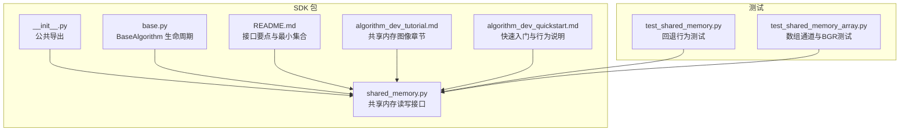
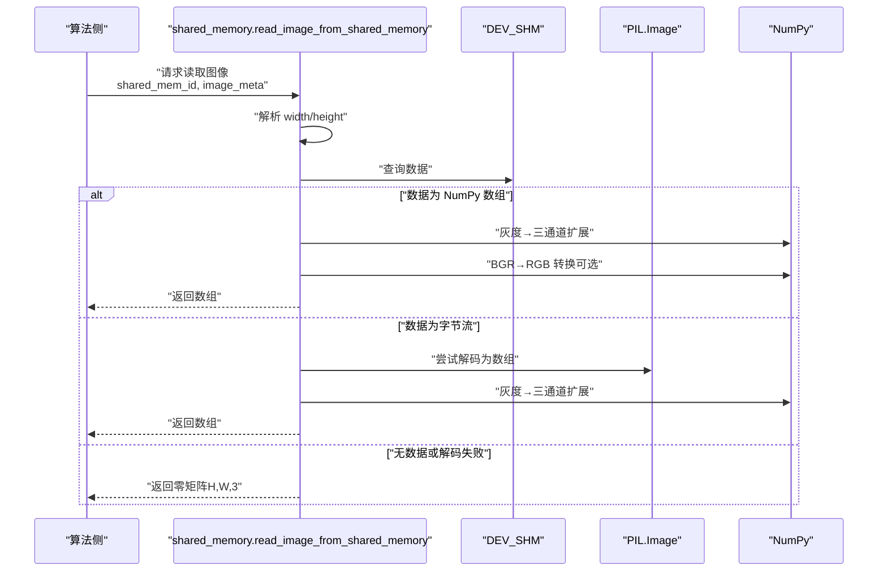
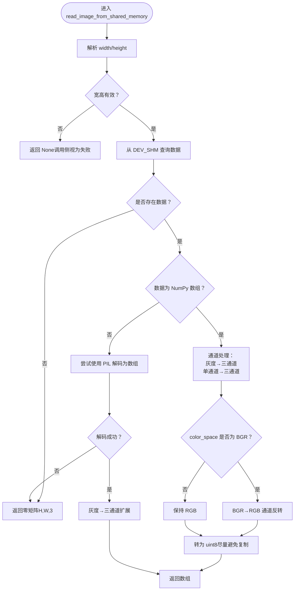
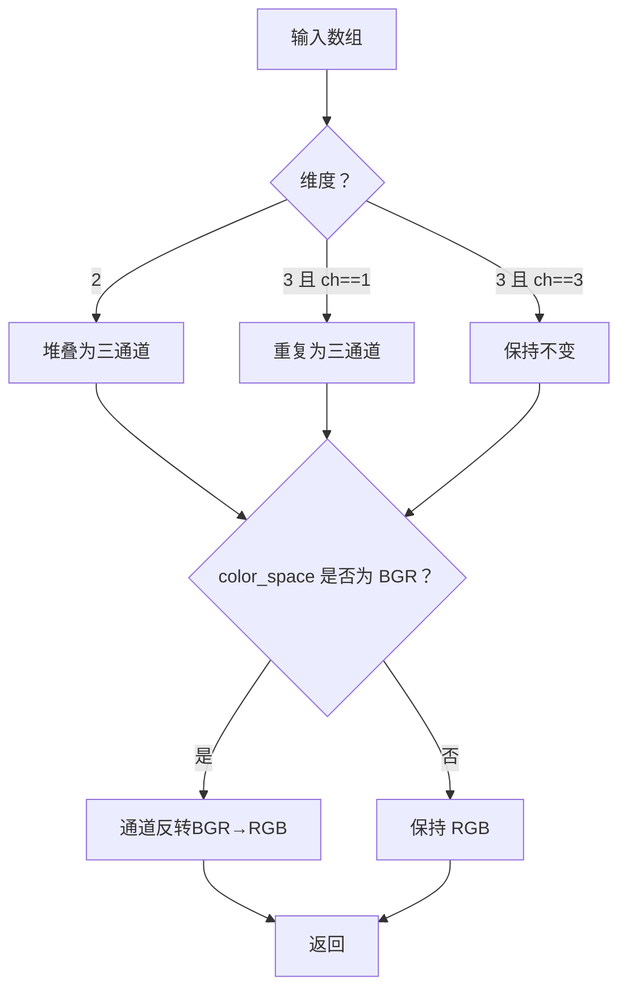
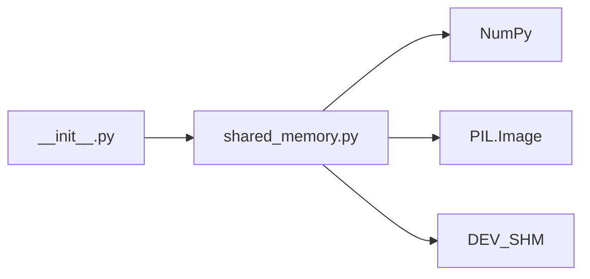

# 共享内存图像传输

<cite>
**本文引用的文件列表**
- [shared_memory.py](file://procvision_algorithm_sdk/shared_memory.py)
- [__init__.py](file://procvision_algorithm_sdk/__init__.py)
- [README.md](file://README.md)
- [algorithm_dev_tutorial.md](file://algorithm_dev_tutorial.md)
- [algorithm_dev_quickstart.md](file://algorithm_dev_quickstart.md)
- [test_shared_memory.py](file://tests/test_shared_memory.py)
- [test_shared_memory_array.py](file://tests/test_shared_memory_array.py)
</cite>

## 更新摘要
**已做更改**
- 更新了read_image_from_shared_memory函数的双模式输入支持说明
- 增加了BGR到RGB颜色空间自动转换功能的详细解释
- 更新了相关架构图和处理流程图
- 补充了最佳实践中的性能优化建议

## 目录
1. [简介](#简介)
2. [项目结构](#项目结构)
3. [核心组件](#核心组件)
4. [架构总览](#架构总览)
5. [详细组件分析](#详细组件分析)
6. [依赖关系分析](#依赖关系分析)
7. [性能考量](#性能考量)
8. [故障排查指南](#故障排查指南)
9. [结论](#结论)
10. [附录](#附录)

## 简介
本文档围绕"通过共享内存进行图像数据传输"的技术实现展开，重点解析read_image_from_shared_memory函数的参数与行为，涵盖：
- 参数shared_mem_id与image_meta的用途与约束
- 从_DEV_SHM获取数据的两种模式：直接NumPy数组读取与JPEG/PNG字节流解码（PIL.Image）
- 多维数组的通道处理机制：灰度图扩展为三通道、BGR到RGB的颜色空间转换
- 数据不可用时返回空白图像的容错策略
- 工业视觉场景下采用共享内存而非文件或网络传输的原因及性能影响
- 使用该函数的最佳实践与异常处理建议

## 项目结构
SDK提供了共享内存读图接口与配套的开发/测试工具，核心位于shared_memory模块，对外通过__init__.py导出公共API。README与教程文档明确了接口契约、元数据要求与回退行为。

**图表来源**
- [shared_memory.py](file://procvision_algorithm_sdk/shared_memory.py#L1-L53)
- [__init__.py](file://procvision_algorithm_sdk/__init__.py#L1-L19)
- [README.md](file://README.md#L1-L116)
- [algorithm_dev_tutorial.md](file://algorithm_dev_tutorial.md#L1-L348)
- [algorithm_dev_quickstart.md](file://algorithm_dev_quickstart.md#L80-L140)
- [test_shared_memory.py](file://tests/test_shared_memory.py#L1-L16)
- [test_shared_memory_array.py](file://tests/test_shared_memory_array.py#L1-L39)

**章节来源**
- [README.md](file://README.md#L1-L116)
- [algorithm_dev_tutorial.md](file://algorithm_dev_tutorial.md#L1-L348)
- [algorithm_dev_quickstart.md](file://algorithm_dev_quickstart.md#L80-L140)

## 核心组件
- 共享内存容器：DEV_SHM是一个字典，键为shared_mem_id，值为bytes或numpy.ndarray
- 写入接口：
  - 字节写入：dev_write_image_to_shared_memory(shared_mem_id, image_bytes)
  - 数组写入：write_image_array_to_shared_memory(shared_mem_id, image_array)
- 读取接口：
  - read_image_from_shared_memory(shared_mem_id, image_meta)
- 元数据image_meta的关键字段：
  - width/height：图像宽高（必须为正整数）
  - color_space：颜色空间，可选RGB/BGR
  - camera_id/timestamp_ms：设备标识与时间戳（教程与最小集合中明确）

**章节来源**
- [shared_memory.py](file://procvision_algorithm_sdk/shared_memory.py#L1-L53)
- [README.md](file://README.md#L1-L116)
- [algorithm_dev_tutorial.md](file://algorithm_dev_tutorial.md#L1-L348)
- [algorithm_dev_quickstart.md](file://algorithm_dev_quickstart.md#L80-L140)

## 架构总览
共享内存读图的整体流程如下：算法侧通过shared_mem_id与image_meta请求图像；SDK从DEV_SHM中查找对应数据；若为数组则进行通道与颜色空间处理；若为字节则尝试解码为数组；若均不可用则按元数据返回零矩阵作为回退。

**图表来源**
- [shared_memory.py](file://procvision_algorithm_sdk/shared_memory.py#L15-L53)
- [test_shared_memory.py](file://tests/test_shared_memory.py#L1-L16)
- [test_shared_memory_array.py](file://tests/test_shared_memory_array.py#L1-L39)

## 详细组件分析

### read_image_from_shared_memory 函数解析
- 参数
  - shared_mem_id：字符串，唯一标识共享内存中的图像数据
  - image_meta：字典，包含width、height、color_space（可选）、camera_id、timestamp_ms等
- 返回
  - 若成功：numpy.ndarray（dtype=uint8，shape=(H,W,3)）
  - 若失败：返回零矩阵（dtype=uint8，shape=(height,width,3)）
- 处理逻辑
  - 校验宽高：width/height必须为正整数，否则返回None（在调用侧被解释为失败）
  - 从DEV_SHM读取数据
  - 若为numpy.ndarray：
    - 灰度图（ndim==2）扩展为三通道
    - 单通道（ndim==3, shape[2]==1）重复为三通道
    - 三通道保持不变
    - 若颜色空间为BGR，则进行通道反转（BGR→RGB）
    - 强制转换为uint8，尽量避免复制
  - 若为字节流：
    - 使用PIL解码为数组
    - 灰度图扩展为三通道
    - 返回数组
  - 若均失败：返回零矩阵（H,W,3）

**图表来源**
- [shared_memory.py](file://procvision_algorithm_sdk/shared_memory.py#L15-L53)
- [test_shared_memory.py](file://tests/test_shared_memory.py#L1-L16)
- [test_shared_memory_array.py](file://tests/test_shared_memory_array.py#L1-L39)

**章节来源**
- [shared_memory.py](file://procvision_algorithm_sdk/shared_memory.py#L15-L53)
- [algorithm_dev_tutorial.md](file://algorithm_dev_tutorial.md#L1-L348)
- [algorithm_dev_quickstart.md](file://algorithm_dev_quickstart.md#L80-L140)

### 参数 image_meta 的用途与处理逻辑
- width/height：决定返回数组的形状与回退零矩阵的尺寸
- color_space：控制是否进行BGR→RGB的通道反转
- camera_id/timestamp_ms：用于调试与诊断，不参与图像数据解码
- 元数据最小集合：width/height/timestamp_ms/camera_id（教程与README明确）

**章节来源**
- [README.md](file://README.md#L1-L116)
- [algorithm_dev_tutorial.md](file://algorithm_dev_tutorial.md#L1-L348)
- [algorithm_dev_quickstart.md](file://algorithm_dev_quickstart.md#L80-L140)

### 两种数据模式的读取与解码
- 直接NumPy数组读取
  - 适用场景：上位机/测试环境直接写入numpy.ndarray
  - 处理：通道扩展与颜色空间转换
- JPEG/PNG字节流解码
  - 适用场景：平台侧将图像编码为字节流写入共享内存
  - 处理：PIL解码为数组，随后灰度扩展

**章节来源**
- [shared_memory.py](file://procvision_algorithm_sdk/shared_memory.py#L15-L53)
- [algorithm_dev_tutorial.md](file://algorithm_dev_tutorial.md#L1-L348)
- [algorithm_dev_quickstart.md](file://algorithm_dev_quickstart.md#L80-L140)

### 多维数组的通道处理机制
- 灰度图（H,W）→ 三通道（H,W,3）：通过堆叠或重复实现
- 单通道（H,W,1）→ 三通道（H,W,3）：重复通道
- 三通道（H,W,3）：保持不变
- BGR→RGB：当color_space为BGR且为三通道时，进行通道反转

**图表来源**
- [shared_memory.py](file://procvision_algorithm_sdk/shared_memory.py#L15-L53)
- [test_shared_memory_array.py](file://tests/test_shared_memory_array.py#L1-L39)

**章节来源**
- [test_shared_memory_array.py](file://tests/test_shared_memory_array.py#L1-L39)

### 容错策略：数据不可用时返回空白图像
- 当shared_mem_id对应无数据或解码失败时，返回形状为(height, width, 3)的零矩阵（dtype=uint8）
- 该策略确保算法侧无需额外判空逻辑，简化调用方处理

**章节来源**
- [shared_memory.py](file://procvision_algorithm_sdk/shared_memory.py#L45-L53)
- [test_shared_memory.py](file://tests/test_shared_memory.py#L1-L16)

### 工业视觉场景下的共享内存优势与性能影响
- 优势
  - 低延迟：进程内共享内存，避免文件IO与网络传输开销
  - 高吞吐：减少拷贝与序列化成本，适合高频帧率场景
  - 低耦合：算法与上位机/平台通过约定的键值解耦
- 影响
  - 仅限同主机/同进程场景，跨机器需其他方案
  - 需要严格的元数据一致性（width/height/color_space），否则回退零矩阵

**章节来源**
- [README.md](file://README.md#L1-L116)
- [algorithm_dev_tutorial.md](file://algorithm_dev_tutorial.md#L1-L348)
- [algorithm_dev_quickstart.md](file://algorithm_dev_quickstart.md#L80-L140)

### 最佳实践
- 确保image_meta的准确性
  - width/height必须为正整数，否则返回None（调用侧应视为失败）
  - color_space仅在需要时提供，且取值为RGB/BGR
- 处理异常情况
  - 当返回None或零矩阵时，算法侧应记录诊断并给出明确错误码
  - 对于字节流解码失败的情况，建议记录原始数据类型与长度以便排查
- 优化解码性能
  - 优先传递numpy.ndarray（H,W,3）以避免解码开销
  - 若必须传递字节流，确保压缩格式为JPEG/PNG且尺寸合理
  - 避免频繁创建大数组，尽量复用缓冲区

**章节来源**
- [shared_memory.py](file://procvision_algorithm_sdk/shared_memory.py#L15-L53)
- [algorithm_dev_tutorial.md](file://algorithm_dev_tutorial.md#L1-L348)
- [algorithm_dev_quickstart.md](file://algorithm_dev_quickstart.md#L80-L140)

## 依赖关系分析
- 模块导出
  - __init__.py将read_image_from_shared_memory与write_image_array_to_shared_memory对外导出
- 内部依赖
  - read_image_from_shared_memory依赖numpy（数组操作）、PIL（字节流解码）
  - DEV_SHM作为全局字典，承载数据存储

**图表来源**
- [__init__.py](file://procvision_algorithm_sdk/__init__.py#L1-L19)
- [shared_memory.py](file://procvision_algorithm_sdk/shared_memory.py#L1-L53)

**章节来源**
- [__init__.py](file://procvision_algorithm_sdk/__init__.py#L1-L19)
- [shared_memory.py](file://procvision_algorithm_sdk/shared_memory.py#L1-L53)

## 性能考量
- 数组路径优于字节流路径：数组直接进行通道与颜色空间处理，避免解码开销
- 零拷贝与就地转换：将数组强制转换为uint8时尽量避免复制，降低内存压力
- 元数据校验前置：提前校验宽高，避免无效解码与浪费
- 批量处理：在上位机侧合并多帧或预处理，减少共享内存写入次数

[本节为通用性能讨论，不直接分析具体文件]

## 故障排查指南
- 现象：返回None
  - 可能原因：width/height无效；shared_mem_id不存在
  - 建议：检查元数据与键值一致性
- 现象：返回零矩阵
  - 可能原因：无数据；字节流解码失败；数组维度不符合预期
  - 建议：确认上位机写入路径与数据格式；补充color_space元信息
- 现象：颜色异常
  - 可能原因：BGR未标注或标注错误
  - 建议：在image_meta中明确color_space=BGR

**章节来源**
- [shared_memory.py](file://procvision_algorithm_sdk/shared_memory.py#L15-L53)
- [test_shared_memory.py](file://tests/test_shared_memory.py#L1-L16)
- [test_shared_memory_array.py](file://tests/test_shared_memory_array.py#L1-L39)

## 结论
read_image_from_shared_memory通过统一的元数据契约与双路径解码机制，在保证兼容性的同时兼顾性能与易用性。在工业视觉场景中，共享内存显著降低了端到端延迟与系统复杂度；但需要严格维护元数据与数据格式，以确保稳定回退与正确转换。

[本节为总结性内容，不直接分析具体文件]

## 附录
- 公共导出
  - read_image_from_shared_memory、write_image_array_to_shared_memory
- 元数据最小集合
  - width/height/timestamp_ms/camera_id
- 颜色空间
  - color_space ∈ {RGB, BGR}

**章节来源**
- [__init__.py](file://procvision_algorithm_sdk/__init__.py#L1-L19)
- [README.md](file://README.md#L1-L116)
- [algorithm_dev_tutorial.md](file://algorithm_dev_tutorial.md#L1-L348)
- [algorithm_dev_quickstart.md](file://algorithm_dev_quickstart.md#L80-L140)