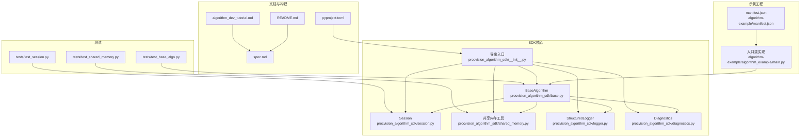
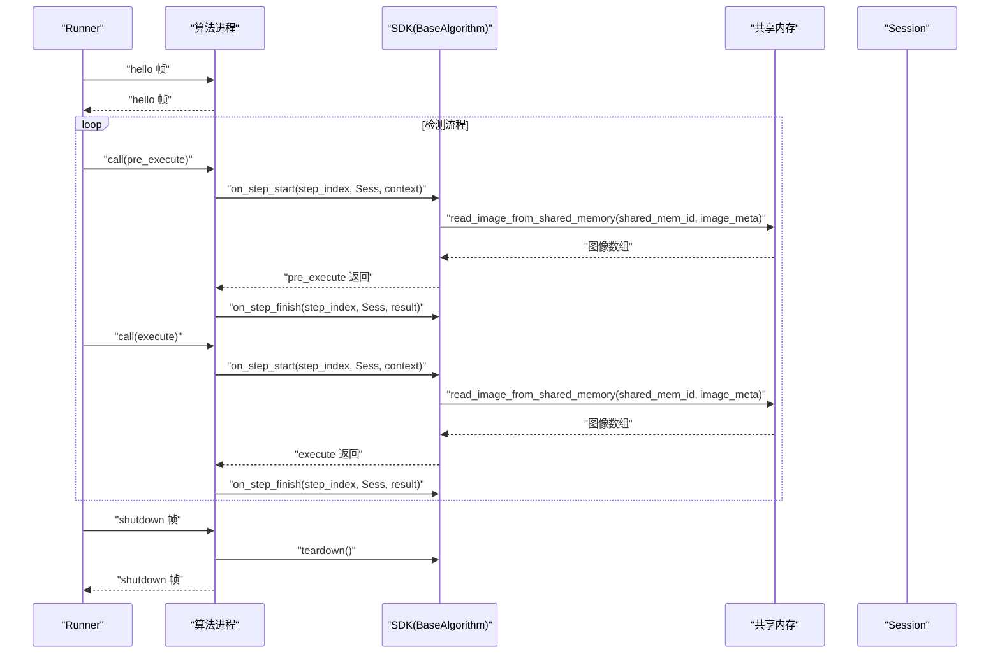
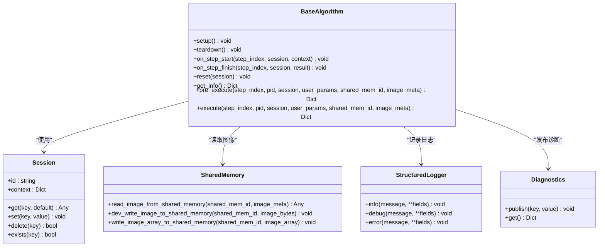
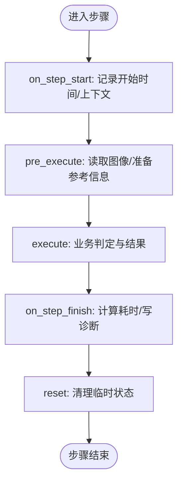
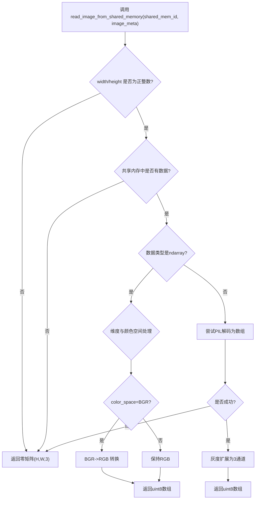
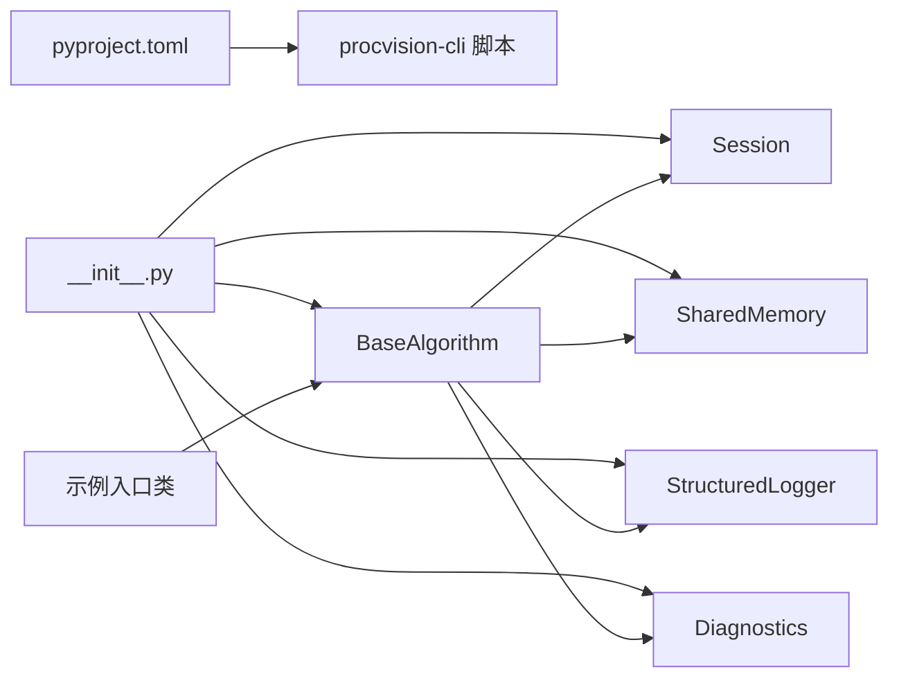

# 核心概念

<cite>
**本文引用的文件**
- [README.md](file://README.md)
- [spec.md](file://spec.md)
- [algorithm_dev_tutorial.md](file://algorithm_dev_tutorial.md)
- [pyproject.toml](file://pyproject.toml)
- [procvision_algorithm_sdk/base.py](file://procvision_algorithm_sdk/base.py)
- [procvision_algorithm_sdk/session.py](file://procvision_algorithm_sdk/session.py)
- [procvision_algorithm_sdk/shared_memory.py](file://procvision_algorithm_sdk/shared_memory.py)
- [procvision_algorithm_sdk/logger.py](file://procvision_algorithm_sdk/logger.py)
- [procvision_algorithm_sdk/diagnostics.py](file://procvision_algorithm_sdk/diagnostics.py)
- [procvision_algorithm_sdk/__init__.py](file://procvision_algorithm_sdk/__init__.py)
- [algorithm-example/manifest.json](file://algorithm-example/manifest.json)
- [algorithm-example/algorithm_example/main.py](file://algorithm-example/algorithm_example/main.py)
- [tests/test_base_algo.py](file://tests/test_base_algo.py)
- [tests/test_session.py](file://tests/test_session.py)
- [tests/test_shared_memory.py](file://tests/test_shared_memory.py)
</cite>

## 目录
1. [简介](#简介)
2. [项目结构](#项目结构)
3. [核心组件](#核心组件)
4. [架构总览](#架构总览)
5. [详细组件分析](#详细组件分析)
6. [依赖关系分析](#依赖关系分析)
7. [性能考量](#性能考量)
8. [故障排查指南](#故障排查指南)
9. [结论](#结论)
10. [附录](#附录)

## 简介
本文件围绕工业视觉平台 ProcVision 算法 SDK 的核心概念展开，重点阐释以下主题：
- BaseAlgorithm 生命周期与接口契约
- Session 状态管理与跨步骤共享
- manifest.json 配置与清单一致性校验
- 共享内存图像传输（JPEG-only）与读取回退策略
- 调用关系、领域模型与使用模式
- 与 Runner/平台的交互与协议约束
- 常见问题与排障建议

该文档既面向初学者提供循序渐进的理解路径，也为有经验的开发者提供深入的技术细节与最佳实践。

## 项目结构
SDK 采用“功能模块化 + 示例工程 + 测试”的组织方式：
- 核心 SDK：procvision_algorithm_sdk（基础抽象、会话、共享内存、日志、诊断、导出）
- 示例算法：algorithm-example（清单 + 入口类实现）
- 文档与规范：README.md、spec.md、algorithm_dev_tutorial.md
- 构建与分发：pyproject.toml（打包、脚本入口、依赖）
- 单元测试：tests/*（覆盖 CLI、Session、共享内存、基类最小流程）

图表来源
- [procvision_algorithm_sdk/base.py](file://procvision_algorithm_sdk/base.py#L1-L58)
- [procvision_algorithm_sdk/session.py](file://procvision_algorithm_sdk/session.py#L1-L36)
- [procvision_algorithm_sdk/shared_memory.py](file://procvision_algorithm_sdk/shared_memory.py#L1-L53)
- [procvision_algorithm_sdk/logger.py](file://procvision_algorithm_sdk/logger.py#L1-L24)
- [procvision_algorithm_sdk/diagnostics.py](file://procvision_algorithm_sdk/diagnostics.py#L1-L12)
- [procvision_algorithm_sdk/__init__.py](file://procvision_algorithm_sdk/__init__.py#L1-L19)
- [algorithm-example/manifest.json](file://algorithm-example/manifest.json#L1-L25)
- [algorithm-example/algorithm_example/main.py](file://algorithm-example/algorithm_example/main.py#L1-L150)
- [README.md](file://README.md#L1-L116)
- [spec.md](file://spec.md#L1-L2102)
- [algorithm_dev_tutorial.md](file://algorithm_dev_tutorial.md#L1-L348)
- [pyproject.toml](file://pyproject.toml#L1-L36)
- [tests/test_base_algo.py](file://tests/test_base_algo.py#L1-L65)
- [tests/test_session.py](file://tests/test_session.py#L1-L24)
- [tests/test_shared_memory.py](file://tests/test_shared_memory.py#L1-L16)

章节来源
- [README.md](file://README.md#L1-L116)
- [algorithm_dev_tutorial.md](file://algorithm_dev_tutorial.md#L1-L348)
- [pyproject.toml](file://pyproject.toml#L1-L36)

## 核心组件
本节聚焦 SDK 的四大核心构件：BaseAlgorithm 抽象、Session 会话、共享内存读图工具、结构化日志与诊断。

- BaseAlgorithm
  - 定义算法生命周期钩子与必须实现的接口：get_info、pre_execute、execute
  - 提供可选钩子：setup、teardown、on_step_start、on_step_finish、reset
  - 通过 Session 与 image_meta、shared_mem_id、user_params 等参数协作
  - 参考：[BaseAlgorithm 类定义](file://procvision_algorithm_sdk/base.py#L1-L58)

- Session
  - 会话上下文对象，提供 id、context、get/set/delete/exists 等 API
  - set 值必须 JSON 可序列化，否则抛 TypeError
  - 参考：[Session 类定义](file://procvision_algorithm_sdk/session.py#L1-L36)

- 共享内存图像工具
  - 读取接口：read_image_from_shared_memory(shared_mem_id, image_meta)
  - 开发写入：dev_write_image_to_shared_memory、write_image_array_to_shared_memory
  - 元信息：至少包含 width、height、timestamp_ms、camera_id；可选 color_space
  - 回退策略：读取失败或无数据返回零矩阵（H,W,3）
  - 参考：[共享内存工具](file://procvision_algorithm_sdk/shared_memory.py#L1-L53)

- 结构化日志与诊断
  - StructuredLogger：统一输出 JSON 日志，包含 level、timestamp_ms 等字段
  - Diagnostics：聚合诊断项，供返回体 data.debug 或外部采集
  - 参考：[StructuredLogger](file://procvision_algorithm_sdk/logger.py#L1-L24)、[Diagnostics](file://procvision_algorithm_sdk/diagnostics.py#L1-L12)

章节来源
- [procvision_algorithm_sdk/base.py](file://procvision_algorithm_sdk/base.py#L1-L58)
- [procvision_algorithm_sdk/session.py](file://procvision_algorithm_sdk/session.py#L1-L36)
- [procvision_algorithm_sdk/shared_memory.py](file://procvision_algorithm_sdk/shared_memory.py#L1-L53)
- [procvision_algorithm_sdk/logger.py](file://procvision_algorithm_sdk/logger.py#L1-L24)
- [procvision_algorithm_sdk/diagnostics.py](file://procvision_algorithm_sdk/diagnostics.py#L1-L12)

## 架构总览
SDK 与 Runner/平台的交互遵循“协议帧 + 生命周期钩子 + 共享内存图像”的模式。Runner 通过 stdin/stdout 与算法进程通信，协议采用“4字节长度 + UTF-8 JSON”帧格式，确保无粘包。算法在生命周期钩子中完成资源管理与状态共享，通过共享内存读取图像并返回结构化结果。

图表来源
- [spec.md](file://spec.md#L1-L2102)
- [procvision_algorithm_sdk/base.py](file://procvision_algorithm_sdk/base.py#L1-L58)
- [procvision_algorithm_sdk/session.py](file://procvision_algorithm_sdk/session.py#L1-L36)
- [procvision_algorithm_sdk/shared_memory.py](file://procvision_algorithm_sdk/shared_memory.py#L1-L53)

## 详细组件分析

### BaseAlgorithm 生命周期与接口契约
- 生命周期钩子
  - setup/teardown：进程级初始化/释放，适合加载/释放模型、句柄等重量级资源
  - on_step_start/on_step_finish：每步开始/结束回调，适合记录时间戳、统计耗时、写诊断
  - reset：流程级复位，清理本次检测相关的易变状态
- 必须实现接口
  - get_info：返回算法元信息与 steps 配置（含 supported_pids 与参数 schema）
  - pre_execute：执行前准备，返回参考信息（如 calibration_rects），不包含业务判定
  - execute：执行核心逻辑，返回业务判定 result_status（OK/NG）及缺陷/位置框等
- 参数与返回
  - 参数分组：步骤控制（step_index）、上下文（pid, session）、用户输入（user_params）、图像数据（shared_mem_id, image_meta）
  - 返回结构：首层 status/message，二层 data（包含业务结果与 debug 诊断）
- 与 Runner 的关系
  - Runner 调用顺序：setup → on_step_start → pre_execute → execute → on_step_finish → teardown
  - Runner 通过协议帧传递 step_index、session、shared_mem_id、image_meta、user_params 等

图表来源
- [procvision_algorithm_sdk/base.py](file://procvision_algorithm_sdk/base.py#L1-L58)
- [procvision_algorithm_sdk/session.py](file://procvision_algorithm_sdk/session.py#L1-L36)
- [procvision_algorithm_sdk/shared_memory.py](file://procvision_algorithm_sdk/shared_memory.py#L1-L53)
- [procvision_algorithm_sdk/logger.py](file://procvision_algorithm_sdk/logger.py#L1-L24)
- [procvision_algorithm_sdk/diagnostics.py](file://procvision_algorithm_sdk/diagnostics.py#L1-L12)

章节来源
- [procvision_algorithm_sdk/base.py](file://procvision_algorithm_sdk/base.py#L1-L58)
- [spec.md](file://spec.md#L1-L2102)
- [algorithm_dev_tutorial.md](file://algorithm_dev_tutorial.md#L1-L348)

### Session 状态管理
- 设计要点
  - Session 仅在单次检测流程内有效，跨产品检测会重新初始化
  - set 值必须 JSON 可序列化，否则抛 TypeError
  - context 为只读上下文（产品信息、操作员等），返回副本防止外部修改
- 使用模式
  - 在 on_step_start 中记录时间戳或上下文
  - 在 on_step_finish 中计算耗时并写入诊断
  - 在 reset 中清理本次检测相关的临时状态
- 测试覆盖
  - KV 存取、存在性判断、序列化约束等

图表来源
- [procvision_algorithm_sdk/session.py](file://procvision_algorithm_sdk/session.py#L1-L36)
- [procvision_algorithm_sdk/base.py](file://procvision_algorithm_sdk/base.py#L1-L58)

章节来源
- [procvision_algorithm_sdk/session.py](file://procvision_algorithm_sdk/session.py#L1-L36)
- [tests/test_session.py](file://tests/test_session.py#L1-L24)

### manifest.json 配置与清单一致性
- 必填字段
  - name、version、entry_point、supported_pids
  - 推荐字段：description、steps（含 index/name/params）
- 入口点格式：模块路径:类名，类必须继承 BaseAlgorithm
- 一致性要求
  - manifest.supported_pids 与 get_info().supported_pids 必须完全一致
  - steps.index 建议从 1 开始，params.type ∈ {int,float,rect,enum,bool,string}
- 示例
  - [示例清单](file://algorithm-example/manifest.json#L1-L25)

章节来源
- [algorithm-example/manifest.json](file://algorithm-example/manifest.json#L1-L25)
- [algorithm_dev_tutorial.md](file://algorithm_dev_tutorial.md#L1-L348)
- [spec.md](file://spec.md#L1-L2102)

### 共享内存图像传输与读取回退
- 约定
  - 平台将相机图像以 JPEG 编码写入共享内存，并提供 shared_mem_id + image_meta
  - image_meta 最小集合：width、height、timestamp_ms、camera_id；可选 color_space
  - 不再支持 Base64 图像或临时文件
- 读取与回退
  - 读取接口：read_image_from_shared_memory(shared_mem_id, image_meta)
  - 支持字节数据（JPEG/PNG）与 numpy.ndarray（uint8，H,W,3）
  - 灰度自动扩展为 3 通道；当 color_space=BGR 时自动转 RGB
  - 读取失败或无数据返回零矩阵（H,W,3）
- 开发/测试
  - dev_write_image_to_shared_memory：写入字节数据
  - write_image_array_to_shared_memory：写入数组

图表来源
- [procvision_algorithm_sdk/shared_memory.py](file://procvision_algorithm_sdk/shared_memory.py#L1-L53)

章节来源
- [procvision_algorithm_sdk/shared_memory.py](file://procvision_algorithm_sdk/shared_memory.py#L1-L53)
- [tests/test_shared_memory.py](file://tests/test_shared_memory.py#L1-L16)

### 与 Runner/平台的交互与协议
- 通信协议
  - 双向管道：stdin/stdout
  - 帧格式：4字节大端长度 + UTF-8 JSON
  - 消息类型：hello、call、result、ping、pong、error、shutdown
- 握手与心跳
  - 启动后算法立即输出 hello；Runner 返回 hello
  - Runner 定期发送 ping，算法需在超时内回复 pong
- 调用流程
  - Runner 发送 call 帧，包含 step_index、session、shared_mem_id、image_meta、user_params
  - 算法处理后返回 result 帧，首层 status/message，二层 data
- 超时与优雅终止
  - 心跳超时策略与 execute 超时策略详见规范

章节来源
- [spec.md](file://spec.md#L1-L2102)
- [README.md](file://README.md#L1-L116)

## 依赖关系分析
- 包导出
  - SDK 通过 __init__.py 导出 BaseAlgorithm、Session、共享内存读取函数、日志与诊断等
  - CLI 入口由 pyproject.toml 的 scripts 定义
- 外部依赖
  - numpy>=1.21、pillow>=10.0.0
- 内部耦合
  - BaseAlgorithm 依赖 Session、SharedMemory、Logger、Diagnostics
  - 示例算法继承 BaseAlgorithm 并使用 SDK 工具

图表来源
- [procvision_algorithm_sdk/__init__.py](file://procvision_algorithm_sdk/__init__.py#L1-L19)
- [pyproject.toml](file://pyproject.toml#L1-L36)
- [algorithm-example/algorithm_example/main.py](file://algorithm-example/algorithm_example/main.py#L1-L150)

章节来源
- [procvision_algorithm_sdk/__init__.py](file://procvision_algorithm_sdk/__init__.py#L1-L19)
- [pyproject.toml](file://pyproject.toml#L1-L36)

## 性能考量
- 图像读取
  - 优先使用 numpy 数组写入共享内存，避免重复解码
  - 注意颜色空间转换与灰度扩展的成本
- 会话存储
  - Session 仅在单次检测流程内有效，避免在其中存储大量数据
- 生命周期钩子
  - 将重计算放在 pre_execute/execute，钩子保持轻量化
- 日志与诊断
  - 使用结构化日志与诊断聚合，便于平台侧采集与分析

[本节为通用指导，不直接分析具体文件]

## 故障排查指南
- PID 不一致
  - 现象：清单与 get_info().supported_pids 不一致
  - 处理：统一两者，确保完全一致
  - 参考：[一致性校验](file://algorithm_dev_tutorial.md#L1-L348)
- 返回结构错误
  - 现象：pre_execute 返回业务判定；execute 缺少 result_status
  - 处理：pre_execute 仅返回参考信息；execute 必须包含 result_status
  - 参考：[返回结构规范](file://spec.md#L1-L2102)
- 图像尺寸异常
  - 现象：width/height 非正整数或读取失败
  - 处理：确保 image_meta 提供正整数尺寸；读取失败将回退零矩阵
  - 参考：[共享内存读取](file://procvision_algorithm_sdk/shared_memory.py#L1-L53)
- Session set 非 JSON 可序列化
  - 现象：抛 TypeError
  - 处理：确保 set 的值为 JSON 可序列化
  - 参考：[Session set 约束](file://procvision_algorithm_sdk/session.py#L1-L36)
- wheels 不匹配
  - 现象：pip download 无匹配依赖
  - 处理：在目标 Python 版本与 ABI 环境内执行 pip freeze，生成兼容 requirements.txt
  - 参考：[打包与下载](file://algorithm_dev_tutorial.md#L1-L348)

章节来源
- [algorithm_dev_tutorial.md](file://algorithm_dev_tutorial.md#L1-L348)
- [procvision_algorithm_sdk/shared_memory.py](file://procvision_algorithm_sdk/shared_memory.py#L1-L53)
- [procvision_algorithm_sdk/session.py](file://procvision_algorithm_sdk/session.py#L1-L36)

## 结论
本文件系统梳理了 ProcVision 算法 SDK 的核心概念与实现细节，明确了 BaseAlgorithm 生命周期、Session 状态管理、manifest.json 配置与共享内存图像传输的关键契约。通过规范的接口、严格的返回结构与协议约束，SDK 为算法与平台的解耦集成提供了坚实基础。建议在实际开发中：
- 严格遵守 get_info 与 manifest 的一致性
- 将重计算置于 pre_execute/execute，钩子保持轻量化
- 使用结构化日志与诊断，便于平台采集
- 通过 CLI 进行本地验证与打包，确保离线交付质量

[本节为总结性内容，不直接分析具体文件]

## 附录
- 示例算法
  - [示例入口类](file://algorithm-example/algorithm_example/main.py#L1-L150)
  - [示例清单](file://algorithm-example/manifest.json#L1-L25)
- 单元测试
  - [基类最小流程](file://tests/test_base_algo.py#L1-L65)
  - [Session KV 操作](file://tests/test_session.py#L1-L24)
  - [共享内存回退](file://tests/test_shared_memory.py#L1-L16)

章节来源
- [algorithm-example/algorithm_example/main.py](file://algorithm-example/algorithm_example/main.py#L1-L150)
- [algorithm-example/manifest.json](file://algorithm-example/manifest.json#L1-L25)
- [tests/test_base_algo.py](file://tests/test_base_algo.py#L1-L65)
- [tests/test_session.py](file://tests/test_session.py#L1-L24)
- [tests/test_shared_memory.py](file://tests/test_shared_memory.py#L1-L16)