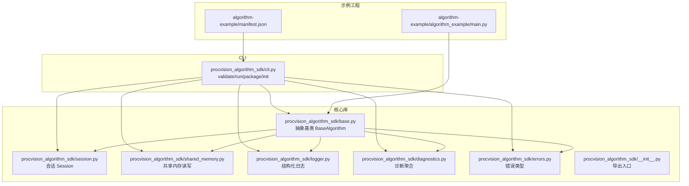
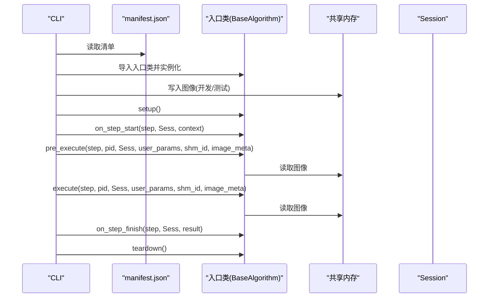
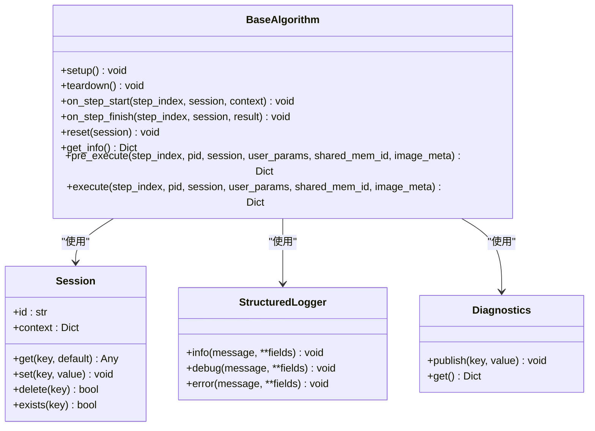
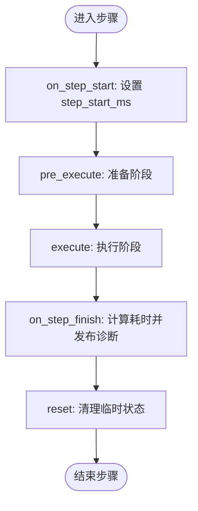
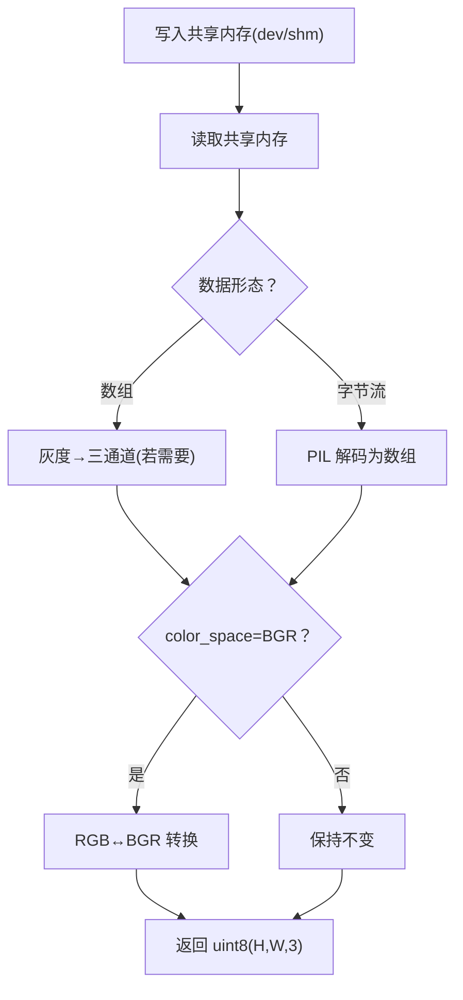
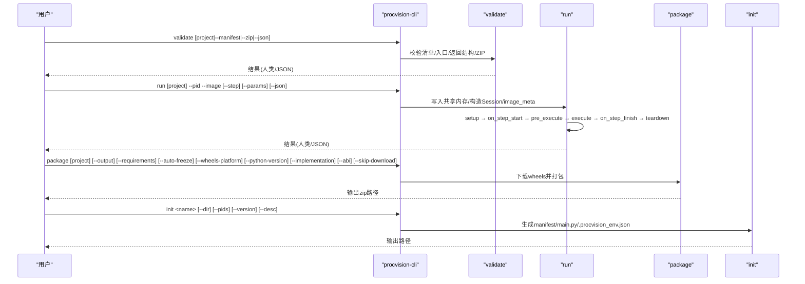
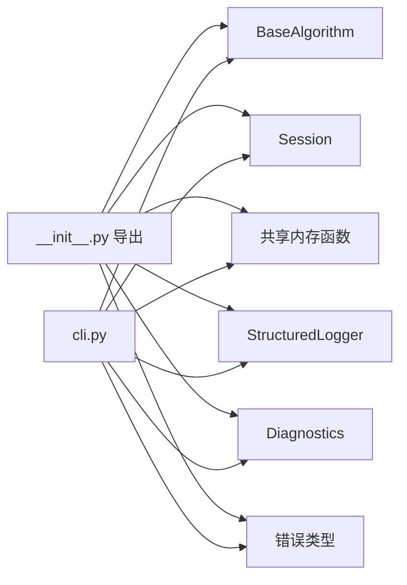

# 附录

<cite>
**本文引用的文件**
- [README.md](file://README.md)
- [algorithm_dev_tutorial.md](file://algorithm_dev_tutorial.md)
- [pyproject.toml](file://pyproject.toml)
- [procvision_algorithm_sdk/__init__.py](file://procvision_algorithm_sdk/__init__.py)
- [procvision_algorithm_sdk/base.py](file://procvision_algorithm_sdk/base.py)
- [procvision_algorithm_sdk/session.py](file://procvision_algorithm_sdk/session.py)
- [procvision_algorithm_sdk/shared_memory.py](file://procvision_algorithm_sdk/shared_memory.py)
- [procvision_algorithm_sdk/cli.py](file://procvision_algorithm_sdk/cli.py)
- [procvision_algorithm_sdk/logger.py](file://procvision_algorithm_sdk/logger.py)
- [procvision_algorithm_sdk/diagnostics.py](file://procvision_algorithm_sdk/diagnostics.py)
- [procvision_algorithm_sdk/errors.py](file://procvision_algorithm_sdk/errors.py)
- [algorithm-example/manifest.json](file://algorithm-example/manifest.json)
- [algorithm-example/algorithm_example/main.py](file://algorithm-example/algorithm_example/main.py)
- [tests/test_import.py](file://tests/test_import.py)
</cite>

## 目录
1. [简介](#简介)
2. [项目结构](#项目结构)
3. [核心组件](#核心组件)
4. [架构总览](#架构总览)
5. [组件详细分析](#组件详细分析)
6. [依赖关系分析](#依赖关系分析)
7. [性能与可靠性考量](#性能与可靠性考量)
8. [故障排查指南](#故障排查指南)
9. [结论](#结论)
10. [附录：常见用例与示例](#附录常见用例与示例)

## 简介
本附录面向工业视觉平台 ProcVision 算法 SDK 的使用者与维护者，系统梳理 SDK 的设计目标、架构组成、核心接口、使用模式与交付流程。文档既提供面向初学者的概念性说明，也包含面向资深工程师的实现细节、配置选项与最佳实践。文中所有术语与流程均与代码库一致，便于读者快速定位到具体实现与测试用例。

## 项目结构
SDK 采用“核心库 + CLI + 示例工程”的组织方式：
- 核心库：procvision_algorithm_sdk，提供抽象基类、会话上下文、共享内存读图、结构化日志与诊断、错误类型等基础能力。
- CLI：procvision-cli，提供 validate/run/package/init 四个子命令，覆盖本地校验、运行模拟、离线包构建与脚手架初始化。
- 示例工程：algorithm-example，展示 manifest.json 与入口类的典型实现，便于对照学习。

**图表来源**
- [procvision_algorithm_sdk/base.py](file://procvision_algorithm_sdk/base.py#L1-L58)
- [procvision_algorithm_sdk/session.py](file://procvision_algorithm_sdk/session.py#L1-L36)
- [procvision_algorithm_sdk/shared_memory.py](file://procvision_algorithm_sdk/shared_memory.py#L1-L53)
- [procvision_algorithm_sdk/cli.py](file://procvision_algorithm_sdk/cli.py#L1-L615)
- [algorithm-example/manifest.json](file://algorithm-example/manifest.json#L1-L25)
- [algorithm-example/algorithm_example/main.py](file://algorithm-example/algorithm_example/main.py#L1-L150)

**章节来源**
- [README.md](file://README.md#L1-L116)
- [algorithm_dev_tutorial.md](file://algorithm_dev_tutorial.md#L1-L348)

## 核心组件
- 抽象基类 BaseAlgorithm：定义 get_info、pre_execute、execute 三个必须实现的方法，以及 setup/teardown/on_step_start/on_step_finish/reset 五个生命周期钩子。算法实现通过继承该类并按规范返回结构化结果，即可与平台解耦集成。
- 会话 Session：提供只读上下文与键值存储，支持 JSON 可序列化值的 set 操作，用于跨步骤传递状态与统计。
- 共享内存读写：提供开发/测试场景下的图像写入与读取接口，支持字节流（JPEG/PNG）与 numpy 数组两种输入形态，并对颜色空间进行兼容转换。
- 结构化日志 StructuredLogger：输出统一格式的 JSON 日志，包含 level、timestamp_ms、message 与自定义字段，便于平台侧采集与检索。
- 诊断 Diagnostics：提供键值对聚合能力，便于在生命周期钩子中收集耗时、版本、指标等数据。
- 错误类型：定义 RecoverableError、FatalError、GPUOutOfMemoryError、ProgramError，用于区分不同类型的异常场景。
- CLI：提供 validate/run/package/init 四个子命令，覆盖清单校验、本地运行模拟、离线包构建与脚手架初始化。

**章节来源**
- [procvision_algorithm_sdk/base.py](file://procvision_algorithm_sdk/base.py#L1-L58)
- [procvision_algorithm_sdk/session.py](file://procvision_algorithm_sdk/session.py#L1-L36)
- [procvision_algorithm_sdk/shared_memory.py](file://procvision_algorithm_sdk/shared_memory.py#L1-L53)
- [procvision_algorithm_sdk/logger.py](file://procvision_algorithm_sdk/logger.py#L1-L24)
- [procvision_algorithm_sdk/diagnostics.py](file://procvision_algorithm_sdk/diagnostics.py#L1-L12)
- [procvision_algorithm_sdk/errors.py](file://procvision_algorithm_sdk/errors.py#L1-L14)
- [procvision_algorithm_sdk/cli.py](file://procvision_algorithm_sdk/cli.py#L1-L615)

## 架构总览
SDK 的整体交互围绕“算法生命周期 + 数据通道 + 工具链”展开：
- 生命周期：setup → on_step_start → pre_execute → execute → on_step_finish → teardown
- 数据通道：通过 shared_mem_id 与 image_meta 在算法与上位机之间传递图像数据；Session 作为上下文与状态容器。
- 工具链：CLI 提供 validate/run/package/init，配合 manifest.json 与入口类实现标准化交付与自测。

**图表来源**
- [procvision_algorithm_sdk/cli.py](file://procvision_algorithm_sdk/cli.py#L163-L212)
- [procvision_algorithm_sdk/base.py](file://procvision_algorithm_sdk/base.py#L17-L58)
- [procvision_algorithm_sdk/shared_memory.py](file://procvision_algorithm_sdk/shared_memory.py#L16-L52)
- [algorithm-example/manifest.json](file://algorithm-example/manifest.json#L1-L25)

## 组件详细分析

### 抽象基类 BaseAlgorithm
- 设计要点
  - 通过抽象方法约束算法实现的核心契约：get_info 返回算法元信息；pre_execute 负责准备阶段（不含业务判定）；execute 负责执行阶段（业务判定在 data.result_status）。
  - 生命周期钩子提供幂等、轻量化的扩展点，便于资源管理与诊断输出。
- 关键接口
  - get_info(): 返回包含 name/version/description/supported_pids/steps 的字典。
  - pre_execute(...): 返回包含 status 与可选 message/data/debug 的字典；禁止包含业务判定。
  - execute(...): 返回包含 status 与 data.result_status 的字典；当 result_status=NG 时需包含 ng_reason 与缺陷矩形列表（≤20）。
  - 可选钩子：setup/teardown/on_step_start/on_step_finish/reset。
- 复杂度与性能
  - 接口均为 O(1) 级别，实际耗时由 pre_execute/execute 内部算法决定。
- 错误处理
  - 建议在钩子中捕获异常并记录日志，最终在 execute 中以 status="ERROR" 返回明确提示。

**图表来源**
- [procvision_algorithm_sdk/base.py](file://procvision_algorithm_sdk/base.py#L1-L58)
- [procvision_algorithm_sdk/session.py](file://procvision_algorithm_sdk/session.py#L1-L36)
- [procvision_algorithm_sdk/logger.py](file://procvision_algorithm_sdk/logger.py#L1-L24)
- [procvision_algorithm_sdk/diagnostics.py](file://procvision_algorithm_sdk/diagnostics.py#L1-L12)

**章节来源**
- [procvision_algorithm_sdk/base.py](file://procvision_algorithm_sdk/base.py#L1-L58)
- [algorithm_dev_tutorial.md](file://algorithm_dev_tutorial.md#L1-L348)

### 会话 Session
- 设计要点
  - 提供只读上下文与可序列化值的键值存储，支持 get/set/delete/exists。
  - set 在写入前强制 JSON 可序列化，防止不可传输的数据污染。
- 使用模式
  - 在 on_step_start 中记录起始时间，在 on_step_finish 中计算耗时并写入 Diagnostics。
  - 在 reset 中清理临时状态，保证幂等性。

**图表来源**
- [procvision_algorithm_sdk/session.py](file://procvision_algorithm_sdk/session.py#L1-L36)
- [procvision_algorithm_sdk/base.py](file://procvision_algorithm_sdk/base.py#L17-L30)

**章节来源**
- [procvision_algorithm_sdk/session.py](file://procvision_algorithm_sdk/session.py#L1-L36)
- [algorithm_dev_tutorial.md](file://algorithm_dev_tutorial.md#L1-L348)

### 共享内存读写
- 设计要点
  - 支持字节流（JPEG/PNG）与 numpy 数组（uint8, H×W×3 或灰度→三通道）两种输入形态。
  - 自动处理 color_space=BGR→RGB 转换；读取失败或无数据时回退为零矩阵。
- 使用模式
  - 开发/测试：使用 dev_write_image_to_shared_memory/write_image_array_to_shared_memory 写入；运行时使用 read_image_from_shared_memory 读取。
  - 元信息：至少包含 width/height/timestamp_ms/camera_id；可选 color_space。

**图表来源**
- [procvision_algorithm_sdk/shared_memory.py](file://procvision_algorithm_sdk/shared_memory.py#L16-L52)

**章节来源**
- [procvision_algorithm_sdk/shared_memory.py](file://procvision_algorithm_sdk/shared_memory.py#L1-L53)
- [algorithm_dev_tutorial.md](file://algorithm_dev_tutorial.md#L1-L348)

### CLI：validate/run/package/init
- validate
  - 校验清单存在与必填字段、入口类继承 BaseAlgorithm、get_info/steps 类型、supported_pids 一致性、pre_execute/execute 返回结构；可选校验离线包包含 manifest/requirements/wheels。
  - 输出人类可读或 JSON，退出码依据校验结果。
- run
  - 本地模拟运行：写入图片到共享内存，构造 Session 与 image_meta，执行完整生命周期；支持 step 与 params。
  - 输入校验：项目/清单/图片/参数 JSON。
- package
  - 下载 wheels 并打包源码、manifest、requirements 与 wheels；支持平台、Python 版本、实现与 ABI 参数。
- init
  - 生成脚手架：manifest.json、包目录与入口类 main.py，并写入 .procvision_env.json 以便打包默认参数。

**图表来源**
- [procvision_algorithm_sdk/cli.py](file://procvision_algorithm_sdk/cli.py#L36-L145)
- [procvision_algorithm_sdk/cli.py](file://procvision_algorithm_sdk/cli.py#L163-L212)
- [procvision_algorithm_sdk/cli.py](file://procvision_algorithm_sdk/cli.py#L228-L326)
- [procvision_algorithm_sdk/cli.py](file://procvision_algorithm_sdk/cli.py#L344-L463)

**章节来源**
- [procvision_algorithm_sdk/cli.py](file://procvision_algorithm_sdk/cli.py#L1-L615)
- [algorithm_dev_tutorial.md](file://algorithm_dev_tutorial.md#L1-L348)

### 结构化日志与诊断
- StructuredLogger
  - 输出统一格式的 JSON，包含 level、timestamp_ms、message 与自定义字段；便于平台侧采集与检索。
- Diagnostics
  - 聚合键值对，推荐在生命周期钩子中发布耗时、版本、指标等数据，供平台 UI 采集。

**章节来源**
- [procvision_algorithm_sdk/logger.py](file://procvision_algorithm_sdk/logger.py#L1-L24)
- [procvision_algorithm_sdk/diagnostics.py](file://procvision_algorithm_sdk/diagnostics.py#L1-L12)
- [algorithm_dev_tutorial.md](file://algorithm_dev_tutorial.md#L1-L348)

### 错误类型
- RecoverableError：可恢复错误，建议重试或降级策略。
- FatalError：致命错误，流程应终止。
- GPUOutOfMemoryError：显存不足，建议降低分辨率或批大小。
- ProgramError：程序错误，通常指实现不符合规范。

**章节来源**
- [procvision_algorithm_sdk/errors.py](file://procvision_algorithm_sdk/errors.py#L1-L14)

## 依赖关系分析
- 包导出
  - 通过 __init__.py 暴露 BaseAlgorithm、Session、共享内存读写函数、StructuredLogger、Diagnostics 与错误类型，便于直接导入使用。
- 外部依赖
  - numpy≥1.21、pillow≥10.0.0；Python≥3.10。
- 打包与脚本
  - pyproject.toml 定义了包名、版本、依赖、控制台脚本 procvision-cli 与包发现规则。

**图表来源**
- [procvision_algorithm_sdk/__init__.py](file://procvision_algorithm_sdk/__init__.py#L1-L19)
- [procvision_algorithm_sdk/cli.py](file://procvision_algorithm_sdk/cli.py#L1-L615)
- [pyproject.toml](file://pyproject.toml#L1-L36)

**章节来源**
- [procvision_algorithm_sdk/__init__.py](file://procvision_algorithm_sdk/__init__.py#L1-L19)
- [pyproject.toml](file://pyproject.toml#L1-L36)

## 性能与可靠性考量
- 生命周期钩子应保持轻量化，重计算放在 pre_execute/execute 中，避免在 on_step_start/finish 中做昂贵操作。
- 共享内存读取失败时会回退零矩阵，建议在 pre_execute 中尽早返回错误，减少无效计算。
- 诊断与日志统一格式，便于平台侧进行聚合与可视化；建议在 on_step_finish 中发布关键指标。
- package 时锁定依赖并下载目标平台 wheels，避免运行时找不到兼容包。

[本节为通用指导，无需列出具体文件来源]

## 故障排查指南
- 清单与入口不一致
  - 现象：validate 报告 supported_pids 不一致。
  - 处理：确保 manifest.json 与 get_info().supported_pids 一致。
- 返回结构错误
  - 现象：validate 报告 pre_execute/execute 返回结构不符合规范。
  - 处理：pre_execute 不含业务判定；execute 的 data 必须包含 result_status；NG 时需包含 ng_reason 与缺陷矩形列表（≤20）。
- wheels 不匹配
  - 现象：package 时 pip download 失败。
  - 处理：在目标 Python 版本与 ABI 环境中执行 pip freeze，生成 requirements.txt 后再下载 wheels。
- 图像尺寸异常
  - 现象：共享内存读取失败或返回零矩阵。
  - 处理：确保 image_meta 包含正整数 width/height；必要时在 pre_execute 中返回错误。

**章节来源**
- [procvision_algorithm_sdk/cli.py](file://procvision_algorithm_sdk/cli.py#L36-L145)
- [procvision_algorithm_sdk/shared_memory.py](file://procvision_algorithm_sdk/shared_memory.py#L16-L52)
- [algorithm_dev_tutorial.md](file://algorithm_dev_tutorial.md#L1-L348)

## 结论
ProcVision 算法 SDK 通过清晰的抽象基类、会话上下文、共享内存接口与 CLI 工具链，实现了算法与平台的解耦集成。遵循 SDK 规范可显著提升开发效率与交付质量；借助 validate/run/package/init，开发者可在本地完成自测与打包，降低部署风险。

[本节为总结性内容，无需列出具体文件来源]

## 附录：常见用例与示例
- 初始化脚手架
  - 使用 init 子命令生成 manifest.json、包目录与入口类 main.py，并写入 .procvision_env.json。
- 本地运行模拟
  - 使用 run 子命令，传入项目路径、产品型号、图片路径与可选参数，查看预执行与执行阶段的返回摘要。
- 清单校验
  - 使用 validate 子命令，检查清单、入口类、supported_pids 一致性与返回结构；也可校验离线包结构。
- 离线包构建
  - 使用 package 子命令，下载 wheels 并打包源码、manifest、requirements 与 wheels；支持平台、Python 版本、实现与 ABI 参数。
- 示例工程对照
  - algorithm-example 展示了完整的 get_info、pre_execute、execute 实现与生命周期钩子使用方式，可作为实现参考。

**章节来源**
- [procvision_algorithm_sdk/cli.py](file://procvision_algorithm_sdk/cli.py#L344-L463)
- [procvision_algorithm_sdk/cli.py](file://procvision_algorithm_sdk/cli.py#L163-L212)
- [procvision_algorithm_sdk/cli.py](file://procvision_algorithm_sdk/cli.py#L228-L326)
- [algorithm-example/manifest.json](file://algorithm-example/manifest.json#L1-L25)
- [algorithm-example/algorithm_example/main.py](file://algorithm-example/algorithm_example/main.py#L1-L150)